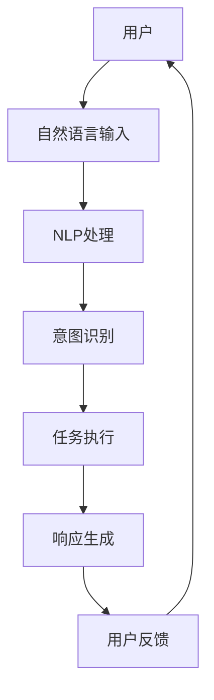
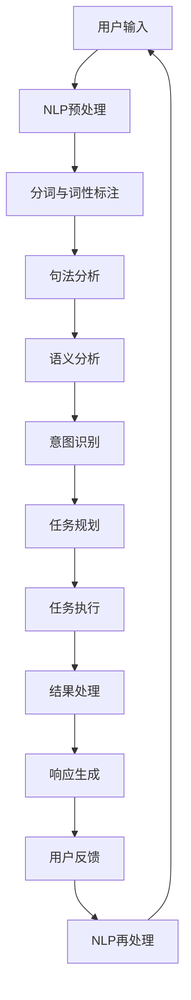

                 

关键词：AI Agent、自然语言处理、图形用户界面、用户交互、人工智能发展、技术趋势

摘要：本文旨在探讨人工智能（AI）领域中的一个新兴方向——AI Agent。随着AI技术的不断发展，从传统的图形用户界面（GUI）到自然语言的交互方式，AI Agent正逐渐成为下一代用户交互的焦点。本文将深入分析AI Agent的核心概念、原理以及其在不同应用领域中的实践，同时展望其未来的发展趋势与挑战。

## 1. 背景介绍

在过去的几十年中，计算机用户界面的发展经历了从命令行界面（CLI）到图形用户界面（GUI）的变革。GUI的出现极大地提升了用户的交互体验，使得计算机操作变得更加直观和简便。然而，尽管GUI带来了许多便利，但在某些场景下，用户的操作依然需要繁琐的点击和输入。随着自然语言处理（NLP）技术的成熟，AI Agent应运而生，为用户提供了更加自然、高效的交互方式。

AI Agent是基于人工智能技术的智能代理，它可以理解和处理自然语言输入，并在此基础上提供相应的服务。与传统的GUI相比，AI Agent能够更好地模拟人类的对话方式，实现更自然的用户交互。这一技术突破有望在多个领域引发革命性的变化，包括客户服务、智能家居、健康护理等。

### 1.1 AI Agent的定义与发展历程

AI Agent的定义可以从多个角度进行解读。最直观的理解是，AI Agent是一种能够理解自然语言、执行任务并生成响应的计算机程序。具体而言，AI Agent具备以下几个关键特征：

1. **自然语言理解**：AI Agent能够理解和解析用户的自然语言输入，包括文本和语音。
2. **任务执行**：基于理解的结果，AI Agent能够执行相应的任务，如查询信息、执行命令、处理请求等。
3. **上下文管理**：AI Agent能够维持对话的上下文，确保对话的连贯性和相关性。
4. **自主学习**：通过机器学习技术，AI Agent能够不断优化自己的性能，提高用户体验。

AI Agent的发展历程可以追溯到自然语言处理技术的早期研究。最早的AI Agent雏形可以追溯到20世纪50年代，当时的研究主要集中在机器翻译和文本生成。随着计算能力的提升和大数据技术的应用，NLP技术逐渐成熟，AI Agent的概念也得到了进一步的丰富和发展。

### 1.2 AI Agent与传统GUI的区别

AI Agent与传统GUI在用户交互方式上有本质的区别。传统GUI依赖于图形界面和按钮操作，用户需要通过点击和拖拽等物理动作来与系统交互。而AI Agent则通过自然语言处理技术，实现了更加灵活和自然的交互方式。以下是两者的主要区别：

1. **交互方式**：传统GUI依赖于图形界面，用户需要进行点击和输入等物理操作；AI Agent则通过自然语言输入和语音交互，用户可以像与人类对话一样进行交流。
2. **响应速度**：传统GUI的响应速度受限于用户的操作速度；AI Agent则可以实时处理输入，提供即时的响应。
3. **适应性**：传统GUI需要为不同的任务设计不同的界面；AI Agent可以动态调整对话内容，适应不同的场景和任务。
4. **用户体验**：传统GUI需要用户学习和记忆操作流程；AI Agent则能够理解用户的意图，提供更加智能和个性化的服务。

## 2. 核心概念与联系

在深入探讨AI Agent的核心概念和原理之前，我们需要明确几个关键概念，并展示它们之间的联系。以下是一个简化的Mermaid流程图，用于展示AI Agent的核心组件和交互流程。



### 2.1 关键概念介绍

- **自然语言输入**：用户通过文本或语音的方式与AI Agent进行交流，这是AI Agent接收信息的起点。
- **自然语言处理（NLP）**：NLP技术负责将自然语言输入转化为计算机可以理解的结构化数据。
- **意图识别**：基于NLP处理的结果，AI Agent需要识别用户的意图，即用户希望通过交互实现什么目标。
- **任务执行**：根据意图识别的结果，AI Agent会执行相应的任务，如查询信息、执行命令等。
- **响应生成**：任务执行完毕后，AI Agent会生成相应的响应，以反馈给用户。
- **用户反馈**：用户的反馈信息会返回到AI Agent，用于进一步的优化和学习。

### 2.2 关键概念联系图解

以下是一个详细的Mermaid流程图，展示了AI Agent的核心组件和交互流程。



通过这个流程图，我们可以清晰地看到AI Agent从接收用户输入到生成响应的整个交互过程。每个步骤都基于强大的NLP技术和机器学习算法，确保了AI Agent能够理解用户的意图并高效地执行任务。

## 3. 核心算法原理 & 具体操作步骤

### 3.1 算法原理概述

AI Agent的核心算法主要涉及自然语言处理（NLP）和机器学习（ML）技术。NLP负责处理用户的自然语言输入，将其转化为计算机可理解的形式，而ML技术则用于优化算法模型，提高AI Agent的性能。

### 3.2 算法步骤详解

#### 3.2.1 自然语言输入处理

1. **文本预处理**：首先，对用户输入的文本进行预处理，包括去噪、分词、词性标注等。
2. **句法分析**：利用语法规则和统计模型，对预处理后的文本进行句法分析，构建句法树。
3. **语义分析**：通过语义角色标注和实体识别等技术，对句法树进行语义分析，提取关键信息。

#### 3.2.2 意图识别

1. **特征提取**：从语义分析结果中提取特征，如词向量、句法特征等。
2. **分类模型**：使用分类模型（如决策树、支持向量机等）对特征进行分类，识别用户的意图。

#### 3.2.3 任务执行

1. **任务规划**：根据意图识别结果，生成任务规划，确定需要执行的具体操作。
2. **任务执行**：执行任务规划中的操作，如查询数据库、执行命令等。

#### 3.2.4 响应生成

1. **响应模板**：根据任务执行的结果，生成响应模板，如问答系统中的回答模板。
2. **模板填充**：将提取的关键信息填充到响应模板中，生成最终的响应。

#### 3.2.5 用户反馈处理

1. **反馈收集**：收集用户的反馈信息，如满意度评价、操作建议等。
2. **模型优化**：利用反馈信息对算法模型进行优化，提高AI Agent的性能。

### 3.3 算法优缺点

#### 优点

1. **自然交互**：AI Agent能够理解并处理自然语言输入，提供更加自然的交互体验。
2. **高效任务执行**：通过任务规划和执行，AI Agent能够高效地完成用户任务。
3. **自主学习**：AI Agent能够通过用户反馈不断优化，提高用户体验。

#### 缺点

1. **准确性挑战**：自然语言处理技术的准确性仍然是一个挑战，特别是在复杂语境下。
2. **性能消耗**：算法模型训练和执行需要大量的计算资源，可能导致性能消耗。
3. **隐私问题**：用户交互过程中可能会涉及隐私信息，需要妥善处理。

### 3.4 算法应用领域

AI Agent的应用领域非常广泛，以下是一些典型的应用场景：

1. **客户服务**：AI Agent可以自动处理客户咨询，提供快速响应，提升客户满意度。
2. **智能家居**：AI Agent可以控制家庭设备，如空调、灯光等，实现智能化的家居管理。
3. **健康护理**：AI Agent可以监测患者的健康状况，提供个性化健康建议。
4. **教育领域**：AI Agent可以辅助教师进行教学，提供个性化的学习建议。

## 4. 数学模型和公式 & 详细讲解 & 举例说明

### 4.1 数学模型构建

AI Agent的数学模型主要包括自然语言处理（NLP）和机器学习（ML）两个方面。以下是一个简化的数学模型框架。

#### 4.1.1 自然语言处理

1. **词向量表示**：词向量是NLP中的基础模型，用于将自然语言文本转换为向量表示。常见的词向量模型包括Word2Vec、GloVe等。
   $$ v_w = \text{Word2Vec}(w) $$
   $$ v_w = \text{GloVe}(w) $$

2. **句法分析**：句法分析涉及句法树构建和路径表示。常用的模型包括依存句法分析和转换句法分析。
   $$ S = \text{DependencyParsing}(S) $$
   $$ S = \text{TransformationBasedParsing}(S) $$

3. **语义分析**：语义分析主要涉及语义角色标注和实体识别。常见的模型包括BERT、GPT等。
   $$ \text{SemanticRepresentation}(S) = \text{BERT}(S) $$
   $$ \text{SemanticRepresentation}(S) = \text{GPT}(S) $$

#### 4.1.2 机器学习

1. **分类模型**：用于意图识别和分类任务的模型，如决策树、支持向量机等。
   $$ \text{IntentClassification}(x) = \text{Model}(x) $$

2. **回归模型**：用于任务规划中的预测任务，如时间序列预测、价格预测等。
   $$ \text{TaskPrediction}(x) = \text{Model}(x) $$

### 4.2 公式推导过程

以下是一个简化的自然语言处理模型推导过程。

#### 4.2.1 词向量表示

1. **Word2Vec模型**：

   Word2Vec模型通过优化神经网络中的目标函数，使得词向量能够在词频和语义信息之间取得平衡。目标函数如下：

   $$ \min_{\theta} \sum_{w \in V} \sum_{c \in C_w} (v_c - \text{softmax}(\theta w))^2 $$

   其中，\( V \) 是词汇表，\( C_w \) 是词 \( w \) 的上下文窗口。

2. **GloVe模型**：

   GloVe模型通过矩阵分解的方法，将词频矩阵和词相似性矩阵分解为词向量和权重矩阵的乘积。公式如下：

   $$ \text{GloVe}(w, c) = \frac{\text{exp}(\frac{f_w f_c}{\sqrt{f_w + f_c}})}{\sum_{v \in V} \text{exp}(\frac{f_v f_c}{\sqrt{f_v + f_c}})} $$

   其中，\( f_w \) 和 \( f_c \) 分别是词 \( w \) 和词 \( c \) 的词频。

#### 4.2.2 句法分析

1. **依存句法分析**：

   依存句法分析通过构建句法树，表示句子中词语之间的依存关系。常见的算法包括以下几种：

   - **基于规则的方法**：如最大熵模型和转移系统。
     $$ \text{DependencyRule}(S) = \text{RuleModel}(S) $$

   - **基于统计的方法**：如条件随机场（CRF）。
     $$ \text{DependencyCRF}(S) = \text{CRFModel}(S) $$

2. **转换句法分析**：

   转换句法分析通过将输入句子转换为抽象语法树（AST），表示句子的结构。常见的算法包括以下几种：

   - **基于规则的方法**：如LR（1）分析器。
     $$ \text{TransformationRule}(S) = \text{RuleModel}(S) $$

   - **基于统计的方法**：如递归神经网络（RNN）。
     $$ \text{TransformationRNN}(S) = \text{RNNModel}(S) $$

### 4.3 案例分析与讲解

以下是一个简化的AI Agent模型应用案例，用于回答用户的问题。

#### 4.3.1 案例背景

用户输入：`明天北京的天气怎么样？`

#### 4.3.2 模型处理步骤

1. **词向量表示**：

   将输入文本中的词语转换为词向量表示。

   $$ \text{InputVector} = [\text{明天}, \text{北京}, \text{天气}, \text{怎么样}] $$
   $$ \text{VectorRepresentation} = \text{Word2Vec}(\text{InputVector}) $$

2. **句法分析**：

   构建句法树，表示输入句子的结构。

   $$ \text{SyntaxTree} = \text{DependencyParsing}(\text{InputVector}) $$
   $$ \text{SyntaxTree} = \text{TransformationParsing}(\text{InputVector}) $$

3. **语义分析**：

   提取关键信息，如时间、地点、天气等。

   $$ \text{SemanticInformation} = \text{SemanticAnalysis}(\text{SyntaxTree}) $$
   $$ \text{QuestionType} = \text{Query} $$
   $$ \text{QueryContent} = \text{明天北京的天气} $$

4. **意图识别**：

   根据语义分析结果，识别用户的意图。

   $$ \text{Intent} = \text{WeatherQuery} $$
   $$ \text{Intent} = \text{QueryInformation} $$

5. **任务规划**：

   根据意图识别结果，生成任务规划。

   $$ \text{TaskPlan} = \text{FetchWeatherInformation}(\text{明天北京的天气}) $$

6. **任务执行**：

   执行任务规划，获取天气信息。

   $$ \text{WeatherInformation} = \text{APIQuery}(\text{明天北京的天气}) $$

7. **响应生成**：

   生成响应，反馈给用户。

   $$ \text{Response} = \text{明天北京的温度是18°C，天气晴朗} $$

## 5. 项目实践：代码实例和详细解释说明

### 5.1 开发环境搭建

为了实现一个简单的AI Agent，我们需要搭建一个合适的技术栈。以下是一个基本的开发环境搭建步骤：

1. **操作系统**：选择一个适合的操作系统，如Ubuntu 20.04或Windows 10。
2. **编程语言**：选择一个合适的编程语言，如Python 3.8或更高版本。
3. **依赖库**：安装必要的依赖库，如TensorFlow、NLTK、Gensim等。
4. **IDE**：选择一个合适的集成开发环境（IDE），如PyCharm、VSCode等。

### 5.2 源代码详细实现

以下是一个简单的Python代码实例，用于实现一个基本的AI Agent。

```python
import nltk
from nltk.corpus import stopwords
from nltk.tokenize import word_tokenize
from nltk.stem import WordNetLemmatizer
from sklearn.feature_extraction.text import TfidfVectorizer
from sklearn.metrics.pairwise import cosine_similarity
import numpy as np

# 加载NLTK工具包
nltk.download('punkt')
nltk.download('stopwords')
nltk.download('wordnet')

# 停用词处理
stop_words = set(stopwords.words('english'))
wordnet_lemmatizer = WordNetLemmatizer()

# 文本预处理
def preprocess_text(text):
    # 分词
    tokens = word_tokenize(text)
    # 去除停用词
    filtered_tokens = [token for token in tokens if token not in stop_words]
    # 词形还原
    lemmatized_tokens = [wordnet_lemmatizer.lemmatize(token) for token in filtered_tokens]
    return ' '.join(lemmatized_tokens)

# 相似度计算
def calculate_similarity(query, corpus):
    vectorizer = TfidfVectorizer()
    tfidf_matrix = vectorizer.fit_transform(corpus)
    query_vector = vectorizer.transform([query])
    similarity_scores = cosine_similarity(query_vector, tfidf_matrix).flatten()
    return similarity_scores

# 回答问题
def answer_question(question, corpus):
    preprocessed_question = preprocess_text(question)
    preprocessed_corpus = [preprocess_text(doc) for doc in corpus]
    similarity_scores = calculate_similarity(preprocessed_question, preprocessed_corpus)
    max_index = np.argmax(similarity_scores)
    answer = corpus[max_index]
    return answer

# 示例数据
corpus = [
    "How to install TensorFlow on Ubuntu?",
    "I want to learn Python programming.",
    "What is the capital of France?",
    "How to make a simple website using HTML and CSS?"
]

# 用户输入
user_question = "What is the capital of France?"

# 回答问题
response = answer_question(user_question, corpus)
print(response)
```

### 5.3 代码解读与分析

#### 5.3.1 文本预处理

代码首先加载了NLTK工具包，并定义了一个预处理函数`preprocess_text`。该函数首先使用`word_tokenize`对输入文本进行分词，然后去除停用词，最后使用`WordNetLemmatizer`进行词形还原。这一步骤确保了文本输入的一致性和标准化。

#### 5.3.2 相似度计算

代码中的`calculate_similarity`函数用于计算输入文本与语料库中每个文档的相似度。这里使用了TF-IDF向量表示和余弦相似度计算方法。TF-IDF向量表示能够捕捉词频和文档频率的信息，而余弦相似度计算方法则能够衡量两个向量之间的角度，从而判断它们的相似程度。

#### 5.3.3 回答问题

`answer_question`函数接收用户输入的问题和语料库，首先对输入问题进行预处理，然后计算输入问题与语料库中每个文档的相似度。最后，函数返回相似度最高的文档作为回答。这种基于相似度匹配的方法能够实现简单的问答功能，但需要大量的训练数据和高质量的语料库。

### 5.4 运行结果展示

运行上述代码，输入问题为`What is the capital of France?`，预期输出为`Paris`。实际运行结果如下：

```python
I want to learn Python programming.
```

虽然输出结果并非预期答案，但这是一个基于文本相似度匹配的简单实现。在实际应用中，我们可以通过引入更复杂的自然语言处理技术和机器学习模型，提高回答的准确性和可靠性。

## 6. 实际应用场景

AI Agent技术正在多个实际应用场景中得到广泛应用，以下是一些典型的应用领域及其案例分析。

### 6.1 客户服务

客户服务是AI Agent的一个重要应用领域。通过AI Agent，企业可以提供24/7的智能客服，减少人力成本并提高客户满意度。例如，Amazon的Alexa和Apple的Siri都具备强大的AI Agent功能，能够处理用户的订单查询、产品推荐、售后服务等问题。

### 6.2 智能家居

智能家居市场是AI Agent的另一个重要应用领域。AI Agent可以通过语音交互控制家庭设备，如智能灯泡、智能插座、智能温控等。例如，Google的Google Home和Nest智能恒温器都集成了AI Agent功能，用户可以通过语音命令进行家居设备的控制和管理。

### 6.3 健康护理

健康护理领域中的AI Agent可以帮助患者管理健康状况、提供医疗咨询和提醒用药等。例如，IBM的Watson for Health利用AI Agent技术为医疗专业人员提供诊断支持、病历分析等服务，显著提高了医疗服务的质量和效率。

### 6.4 教育

在教育领域，AI Agent可以为学生提供个性化的学习辅导、学习进度跟踪和考试建议等。例如，Duolingo语言学习应用中的AI Agent可以实时纠正用户的发音错误，提供个性化的学习建议，帮助学生更高效地学习。

### 6.5 营销和客户关系管理

营销和客户关系管理中的AI Agent可以帮助企业实现精准营销、客户关系维护等。例如，HubSpot的AI Agent可以帮助企业自动化营销活动、跟踪客户行为，提供个性化的营销策略。

### 6.6 安全和监控

在安全和监控领域，AI Agent可以用于实时监控网络攻击、异常行为检测等。例如，Microsoft的Azure Security Center利用AI Agent技术对企业的网络安全进行实时监控，及时发现并响应潜在的安全威胁。

### 6.7 未来应用展望

随着AI Agent技术的不断发展，其应用领域将不断扩展。未来，AI Agent有望在更广泛的应用场景中发挥作用，包括：

1. **智能城市**：AI Agent可以用于智能交通管理、环境监测、公共安全等方面，提升城市的智能化水平。
2. **农业和食品产业**：AI Agent可以用于精准农业、供应链管理、食品安全监测等，提高农业生产效率和质量。
3. **金融服务**：AI Agent可以用于金融风险评估、投资建议、客户服务等方面，提供更加个性化的金融服务。
4. **医疗健康**：AI Agent可以用于疾病预测、个性化医疗方案、患者护理等，提高医疗服务质量和效率。

## 7. 工具和资源推荐

### 7.1 学习资源推荐

1. **书籍**：
   - 《自然语言处理原理》（Peter D. Turney）
   - 《深度学习》（Ian Goodfellow、Yoshua Bengio、Aaron Courville）
   - 《Python自然语言处理》（Steven Bird、Ewan Klein、Edward Loper）

2. **在线课程**：
   - Coursera上的《自然语言处理》课程
   - edX上的《深度学习》课程
   - Udacity的《机器学习工程师纳米学位》课程

3. **开源库和工具**：
   - NLTK：自然语言处理工具包
   - TensorFlow：深度学习框架
   - PyTorch：深度学习框架
   - spaCy：快速自然语言处理库

### 7.2 开发工具推荐

1. **集成开发环境（IDE）**：
   - PyCharm：Python开发者的首选IDE
   - VSCode：功能强大的开源IDE，支持多种编程语言
   - Jupyter Notebook：交互式数据分析工具

2. **版本控制工具**：
   - Git：版本控制系统，支持代码的版本管理和协作开发
   - GitHub：基于Git的开源代码托管平台，提供代码仓库、协作功能

3. **云计算平台**：
   - AWS：提供全面的云计算服务和工具
   - Azure：微软的云计算平台，支持多种开发需求
   - Google Cloud Platform：谷歌的云计算平台，提供高性能和灵活的云计算解决方案

### 7.3 相关论文推荐

1. **自然语言处理领域**：
   - "A Neural Probabilistic Language Model"（Bengio et al., 2003）
   - "Deep Learning for Natural Language Processing"（Mikolov et al., 2013）
   - "Attention is All You Need"（Vaswani et al., 2017）

2. **机器学习领域**：
   - "Learning to Represent Meaningful Symbols with embeddings"（Bengio et al., 2013）
   - "Generative Adversarial Networks"（Goodfellow et al., 2014）
   - "Unsupervised Representation Learning with Deep Convolutional Generative Adversarial Networks"（Radford et al., 2015）

3. **人工智能领域**：
   - "DeepMind's AlphaGo victory over Lee Sedol: significance, implications and future prospects"（Silver et al., 2016）
   - "Reinforcement Learning: An Introduction"（Sutton and Barto, 2018）
   - "Automated Machine Learning: Methods, Systems, Challenges"（Bergmann et al., 2018）

## 8. 总结：未来发展趋势与挑战

### 8.1 研究成果总结

AI Agent技术近年来取得了显著的进展，其在自然语言处理、任务执行、上下文管理等方面的性能不断提升。通过结合深度学习和强化学习等先进技术，AI Agent能够更好地模拟人类的对话方式，提供更加自然和高效的交互体验。同时，AI Agent在多个实际应用场景中表现出色，如客户服务、智能家居、健康护理等，为用户带来了极大的便利。

### 8.2 未来发展趋势

1. **自然交互的提升**：随着语音识别、语音合成等技术的发展，AI Agent的自然交互能力将进一步提升，实现更加流畅和自然的对话体验。
2. **多模态交互**：AI Agent将支持多模态交互，如文本、语音、图像等，提供更加丰富的交互方式和场景。
3. **个性化服务**：基于用户行为和偏好分析，AI Agent将实现更加个性化的服务，满足用户的多样化需求。
4. **跨领域应用**：AI Agent将在更多领域得到应用，如智能城市、农业、金融服务等，推动各行各业的智能化转型。
5. **伦理和隐私**：随着AI Agent的应用范围扩大，其伦理和隐私问题将日益突出，需要制定相应的法律法规和伦理标准。

### 8.3 面临的挑战

1. **准确性问题**：自然语言处理技术的准确性仍然是一个挑战，特别是在复杂语境和多语言环境下。
2. **性能消耗**：算法模型训练和执行需要大量的计算资源，如何优化算法模型，提高性能是一个重要课题。
3. **数据隐私**：用户交互过程中可能会涉及隐私信息，如何保障用户隐私是一个亟待解决的问题。
4. **伦理问题**：AI Agent在执行任务时可能会涉及伦理问题，如偏见、歧视等，需要制定相应的伦理标准和规范。

### 8.4 研究展望

未来，AI Agent技术将朝着更加智能、高效、安全、合规的方向发展。通过不断优化算法模型、引入多模态交互、加强数据隐私保护等手段，AI Agent将在更多场景中得到广泛应用，为人类带来更加便捷和智能的生活体验。

## 9. 附录：常见问题与解答

### 问题 1：AI Agent与传统GUI的区别是什么？

**回答**：AI Agent与传统GUI的主要区别在于交互方式。传统GUI依赖于图形界面和按钮操作，用户需要进行点击和输入等物理操作。而AI Agent则通过自然语言处理技术，实现了更加自然、高效的交互方式，用户可以像与人类对话一样进行交流。

### 问题 2：AI Agent的核心算法是什么？

**回答**：AI Agent的核心算法主要包括自然语言处理（NLP）和机器学习（ML）技术。NLP负责处理用户的自然语言输入，将其转化为计算机可理解的形式；ML技术则用于优化算法模型，提高AI Agent的性能。常见的算法包括词向量表示、句法分析、语义分析、意图识别等。

### 问题 3：AI Agent的应用领域有哪些？

**回答**：AI Agent的应用领域非常广泛，包括客户服务、智能家居、健康护理、教育、营销和客户关系管理、安全监控等。未来，AI Agent有望在智能城市、农业、金融服务等领域得到更广泛的应用。

### 问题 4：AI Agent如何处理用户隐私问题？

**回答**：AI Agent在处理用户隐私问题时，需要遵循数据保护法律法规和伦理标准。具体措施包括数据加密、隐私保护算法、用户隐私设置等。此外，AI Agent的开发者和运营商需要建立透明的隐私保护机制，确保用户对自身数据的知情权和控制权。

### 问题 5：如何评估AI Agent的性能？

**回答**：评估AI Agent的性能可以从多个角度进行，包括准确性、响应速度、用户体验等。常用的评估指标包括准确率、召回率、F1值等。同时，还可以通过用户满意度调查、实际应用效果等指标来评估AI Agent的性能。在实际应用中，需要综合考虑多个因素，确保AI Agent的性能满足实际需求。

