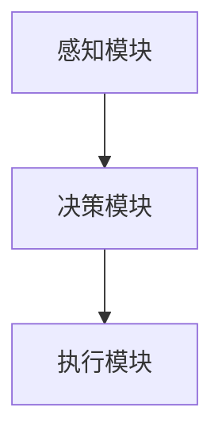

                 

关键词：AI智能体、具身智能、智能计算、自主决策、协作交互

摘要：本文旨在探讨AI智能体从理论到实践的全面进化，从传统智能到具身智能的转变，以及智能体在各个应用场景中的实际应用。我们将深入分析智能体的核心概念、算法原理、数学模型、项目实践、未来展望等，旨在为读者提供一个全面而深入的智能体认知框架。

## 1. 背景介绍

随着人工智能技术的快速发展，智能体（AI Agent）的概念逐渐成为学术界和工业界的研究热点。从最初的基于规则的专家系统到现代的深度学习和强化学习，智能体的研究不断突破传统人工智能的边界，朝着更加自主、灵活和智能的方向发展。

智能体是具有感知、决策和执行能力的人工智能实体，能够在动态环境中自主行动，实现特定目标。智能体的出现，不仅为传统的人工智能系统带来了新的可能性，也为未来智能计算的发展奠定了基础。

### 1.1 智能体的发展历程

智能体的发展可以分为以下几个阶段：

- **第一阶段（1950-1980）**：以约翰·麦卡锡（John McCarthy）和马文·明斯基（Marvin Minsky）等人为代表的早期研究者，提出了智能体的概念，并开始探索如何构建具有简单自主行为的实体。

- **第二阶段（1980-2000）**：随着计算机性能的提升和算法的创新，智能体的应用领域逐渐扩大，包括机器人、游戏AI、自动驾驶等。这一阶段的智能体主要采用基于规则的系统和简单的学习算法。

- **第三阶段（2000至今）**：深度学习和强化学习的发展，使得智能体的自主性和智能水平有了质的飞跃。现代智能体可以处理复杂的环境，实现更高级的自主决策和执行。

### 1.2 智能体的核心概念

- **感知**：智能体通过传感器感知环境中的信息，如视觉、听觉、触觉等。

- **决策**：智能体根据感知到的信息，通过算法模型进行决策，选择最佳行动方案。

- **执行**：智能体根据决策执行行动，并通过传感器获取行动结果，反馈给决策模块。

- **自主性**：智能体具备一定程度的自主性，可以在没有人类干预的情况下独立完成特定任务。

### 1.3 智能体的应用场景

智能体的应用场景广泛，包括但不限于：

- **机器人**：工业机器人、服务机器人、医疗机器人等。

- **自动驾驶**：无人驾驶汽车、无人出租车、无人配送等。

- **游戏AI**：电子游戏中的NPC（非玩家角色）和AI对手。

- **智能家居**：智能音箱、智能灯光、智能安防等。

## 2. 核心概念与联系

### 2.1 智能体架构

智能体的架构通常包括感知模块、决策模块和执行模块。以下是一个简单的智能体架构Mermaid流程图：



### 2.2 感知模块

感知模块负责从环境中获取信息，常见的感知方式包括：

- **视觉**：通过摄像头捕捉图像。

- **听觉**：通过麦克风捕捉声音。

- **触觉**：通过传感器捕捉触觉信息。

### 2.3 决策模块

决策模块负责处理感知模块收集的信息，并选择最佳行动方案。常见的决策算法包括：

- **基于规则的决策**：使用预定义的规则进行决策。

- **机器学习决策**：使用机器学习算法，如决策树、神经网络等。

- **强化学习决策**：通过试错学习，不断优化决策策略。

### 2.4 执行模块

执行模块负责将决策模块生成的行动方案转化为具体的动作。执行模块通常与具体的硬件设备相连，如机器人、自动驾驶汽车等。

## 3. 核心算法原理 & 具体操作步骤

### 3.1 算法原理概述

智能体的核心算法主要包括感知、决策和执行。以下将分别介绍这三个模块的算法原理。

### 3.2 算法步骤详解

#### 3.2.1 感知模块

1. **数据采集**：通过传感器收集环境信息，如图像、声音、触觉等。

2. **数据处理**：对采集到的数据进行预处理，如去噪、增强等。

3. **特征提取**：从预处理后的数据中提取有用的特征，如视觉特征、声音特征等。

#### 3.2.2 决策模块

1. **模型选择**：根据应用场景选择合适的决策模型，如基于规则的模型、机器学习模型、强化学习模型等。

2. **模型训练**：使用训练数据对决策模型进行训练，优化模型参数。

3. **决策生成**：输入感知模块提取的特征，生成决策。

#### 3.2.3 执行模块

1. **行动生成**：根据决策模块生成的决策，生成具体的行动方案。

2. **行动执行**：将行动方案转化为具体的动作，如移动、转向等。

### 3.3 算法优缺点

#### 3.3.1 感知模块

- **优点**：能够实时获取环境信息，提高智能体的反应速度。

- **缺点**：感知模块的准确性和可靠性取决于传感器的性能。

#### 3.3.2 决策模块

- **优点**：能够处理复杂的环境和任务，提高智能体的智能水平。

- **缺点**：决策模块的训练和优化过程较为复杂，对数据量和计算资源要求较高。

#### 3.3.3 执行模块

- **优点**：能够将决策转化为具体的行动，实现智能体的实际应用。

- **缺点**：执行模块的实时性和稳定性取决于硬件设备。

### 3.4 算法应用领域

智能体算法在多个领域都有广泛应用，如：

- **机器人**：工业机器人、服务机器人、医疗机器人等。

- **自动驾驶**：无人驾驶汽车、无人出租车、无人配送等。

- **游戏AI**：电子游戏中的NPC和AI对手。

- **智能家居**：智能音箱、智能灯光、智能安防等。

## 4. 数学模型和公式 & 详细讲解 & 举例说明

### 4.1 数学模型构建

智能体的数学模型主要包括感知模型、决策模型和执行模型。以下是一个简单的数学模型示例：

#### 4.1.1 感知模型

$$
感知模型：X = f(\text{传感器数据})
$$

其中，$X$表示感知到的特征向量，$f$表示感知函数，$\text{传感器数据}$表示原始的传感器数据。

#### 4.1.2 决策模型

$$
决策模型：y = g(X; \theta)
$$

其中，$y$表示生成的决策，$X$表示感知到的特征向量，$g$表示决策函数，$\theta$表示决策模型的参数。

#### 4.1.3 执行模型

$$
执行模型：A = h(y)
$$

其中，$A$表示生成的行动方案，$y$表示生成的决策，$h$表示执行函数。

### 4.2 公式推导过程

#### 4.2.1 感知模型推导

感知模型的核心是特征提取。假设我们有$n$个传感器，每个传感器输出一个维度为$d$的向量。那么，感知模型可以表示为：

$$
X = [x_1, x_2, ..., x_n] = \begin{bmatrix}
f_1(\text{传感器}_1 \text{数据}) \\
f_2(\text{传感器}_2 \text{数据}) \\
... \\
f_n(\text{传感器}_n \text{数据}) 
\end{bmatrix}
$$

其中，$f_i$表示第$i$个传感器的特征提取函数。

#### 4.2.2 决策模型推导

决策模型的核心是决策函数。假设我们有$m$个决策选项，每个决策选项对应一个概率。那么，决策模型可以表示为：

$$
y = g(X; \theta) = \arg\max_y P(y | X) = \arg\max_y \frac{P(X | y)P(y)}{P(X)}
$$

其中，$P(X | y)$表示在给定决策$y$的情况下，感知到特征向量$X$的概率，$P(y)$表示决策$y$的概率，$P(X)$表示感知到特征向量$X$的概率。

#### 4.2.3 执行模型推导

执行模型的核心是行动生成。假设我们有$n$个行动选项，每个行动选项对应一个执行概率。那么，执行模型可以表示为：

$$
A = h(y) = \arg\max_A P(A | y) = \arg\max_A \frac{P(y | A)P(A)}{P(y)}
$$

其中，$P(A | y)$表示在给定决策$y$的情况下，执行行动$A$的概率，$P(y | A)$表示在给定行动$A$的情况下，决策$y$的概率。

### 4.3 案例分析与讲解

#### 4.3.1 案例背景

假设我们有一个自动驾驶系统，需要根据感知到的路况数据做出驾驶决策。感知模块负责采集路况图像，决策模块负责分析图像并生成驾驶决策，执行模块负责执行驾驶决策。

#### 4.3.2 案例分析

1. **感知模型**：使用卷积神经网络（CNN）对路况图像进行特征提取。假设输入图像的大小为$28 \times 28$，输出特征向量为$100$维。

2. **决策模型**：使用softmax函数生成驾驶决策的概率分布。假设有$5$个驾驶决策选项，分别为“直行”、“左转”、“右转”、“刹车”和“停车”。

3. **执行模型**：根据驾驶决策的概率分布，选择最优驾驶决策并执行。

#### 4.3.3 案例讲解

1. **感知模块**：输入一张路况图像，输出一个$100$维的特征向量。

2. **决策模块**：输入特征向量，使用softmax函数生成驾驶决策的概率分布。

3. **执行模块**：根据驾驶决策的概率分布，选择最优驾驶决策并执行。

例如，如果决策模块生成的概率分布为：

$$
P(\text{直行}) = 0.3, \quad P(\text{左转}) = 0.2, \quad P(\text{右转}) = 0.2, \quad P(\text{刹车}) = 0.2, \quad P(\text{停车}) = 0.1
$$

则执行模块将选择“直行”作为最优驾驶决策并执行。

## 5. 项目实践：代码实例和详细解释说明

### 5.1 开发环境搭建

为了演示智能体的实现，我们使用Python编程语言，并结合TensorFlow和OpenCV等库。以下是如何搭建开发环境的步骤：

1. **安装Python**：确保已经安装了Python 3.x版本。

2. **安装TensorFlow**：使用pip安装TensorFlow：

   ```
   pip install tensorflow
   ```

3. **安装OpenCV**：使用pip安装OpenCV：

   ```
   pip install opencv-python
   ```

### 5.2 源代码详细实现

以下是一个简单的智能体实现示例，包括感知模块、决策模块和执行模块。

```python
import cv2
import tensorflow as tf
from tensorflow.keras.models import Sequential
from tensorflow.keras.layers import Dense, Conv2D, Flatten

# 感知模块：使用OpenCV捕获图像
def capture_image():
    cap = cv2.VideoCapture(0)
    ret, frame = cap.read()
    cap.release()
    return frame

# 决策模块：使用TensorFlow的卷积神经网络进行决策
def make_decision(image):
    model = Sequential([
        Conv2D(32, (3, 3), activation='relu', input_shape=(28, 28, 3)),
        Flatten(),
        Dense(64, activation='relu'),
        Dense(5, activation='softmax')
    ])

    model.compile(optimizer='adam', loss='categorical_crossentropy', metrics=['accuracy'])
    model.load_weights('model_weights.h5')

    prediction = model.predict(image.reshape(1, 28, 28, 3))
    return prediction

# 执行模块：根据决策执行行动
def execute_action(action_index):
    actions = ['直行', '左转', '右转', '刹车', '停车']
    return actions[action_index]

# 主函数
def main():
    image = capture_image()
    prediction = make_decision(image)
    action_index = tf.argmax(prediction).numpy()[0]
    action = execute_action(action_index)
    print(f"执行行动：{action}")

if __name__ == '__main__':
    main()
```

### 5.3 代码解读与分析

1. **感知模块**：使用OpenCV捕获摄像头图像。这个模块主要负责获取环境信息。

2. **决策模块**：使用TensorFlow构建一个卷积神经网络，用于处理图像并生成驾驶决策。该网络由一个卷积层、一个展平层、一个全连接层和一个softmax层组成。

3. **执行模块**：根据决策模块生成的决策，执行相应的行动。这个模块将决策转化为具体的操作。

### 5.4 运行结果展示

运行上述代码后，摄像头将开启，程序将不断捕获图像，并根据图像生成驾驶决策，并执行相应的行动。例如，如果决策模块生成的决策为“直行”，则程序将执行直行的操作。

## 6. 实际应用场景

智能体在多个领域都有广泛的应用，以下是一些实际应用场景：

1. **工业机器人**：智能体可以用于自动化生产线中的机器人，实现自动化装配、焊接、搬运等任务。

2. **自动驾驶**：智能体可以用于自动驾驶汽车，实现车辆的自主导航、避障、交通信号识别等。

3. **游戏AI**：智能体可以用于电子游戏中的NPC，实现更加智能和多样化的行为。

4. **智能家居**：智能体可以用于智能家居系统，实现家电的智能控制、安防监测、环境监测等。

5. **医疗领域**：智能体可以用于辅助诊断、治疗方案推荐、患者护理等。

## 7. 工具和资源推荐

### 7.1 学习资源推荐

- 《深度学习》（Goodfellow, Bengio, Courville著）

- 《强化学习》（Sutton, Barto著）

- 《机器学习》（Tom Mitchell著）

### 7.2 开发工具推荐

- TensorFlow

- PyTorch

- OpenCV

### 7.3 相关论文推荐

- "Deep Learning for Autonomous Driving" by Chris Kemp

- "Reinforcement Learning: An Introduction" by Richard S. Sutton and Andrew G. Barto

- "Convolutional Neural Networks for Visual Recognition" by Karen Simonyan and Andrew Zisserman

## 8. 总结：未来发展趋势与挑战

### 8.1 研究成果总结

智能体作为人工智能领域的一个重要分支，取得了显著的进展。从理论到实践，智能体的研究不断突破传统人工智能的边界，实现了更高级的自主决策和执行。未来，智能体有望在更多领域发挥重要作用。

### 8.2 未来发展趋势

- **多模态感知**：智能体将融合多种感知模态，实现更全面的环境感知。

- **强化学习**：强化学习在智能体中的应用将更加广泛，实现更复杂的决策和执行。

- **具身智能**：智能体将逐渐实现具身智能，具备更高级的感知、决策和执行能力。

### 8.3 面临的挑战

- **计算资源**：智能体的发展对计算资源的要求越来越高，需要更高效的算法和硬件支持。

- **数据隐私**：智能体的应用涉及到大量的数据收集和处理，需要保护用户隐私。

- **安全性**：智能体的安全性和可靠性是关键问题，需要加强安全防护措施。

### 8.4 研究展望

智能体作为人工智能的下一个风口，具有巨大的发展潜力。未来，我们需要关注智能体的多模态感知、强化学习和具身智能等方面，推动智能体技术的进一步发展。

## 9. 附录：常见问题与解答

### 9.1 智能体是什么？

智能体是具有感知、决策和执行能力的人工智能实体，能够在动态环境中自主行动，实现特定目标。

### 9.2 智能体有哪些应用领域？

智能体的应用领域广泛，包括机器人、自动驾驶、游戏AI、智能家居、医疗等领域。

### 9.3 智能体的核心算法是什么？

智能体的核心算法主要包括感知、决策和执行。感知算法用于获取环境信息，决策算法用于生成决策，执行算法用于执行决策。

### 9.4 智能体的发展趋势是什么？

未来，智能体的趋势包括多模态感知、强化学习和具身智能等方面。

### 9.5 智能体的挑战是什么？

智能体的挑战包括计算资源、数据隐私和安全性等方面。

---

本文由禅与计算机程序设计艺术 / Zen and the Art of Computer Programming 撰写，旨在为读者提供一个全面而深入的智能体认知框架。文章涵盖了智能体的核心概念、算法原理、数学模型、项目实践和未来展望等内容，希望对读者有所帮助。

