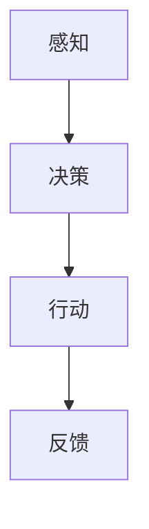
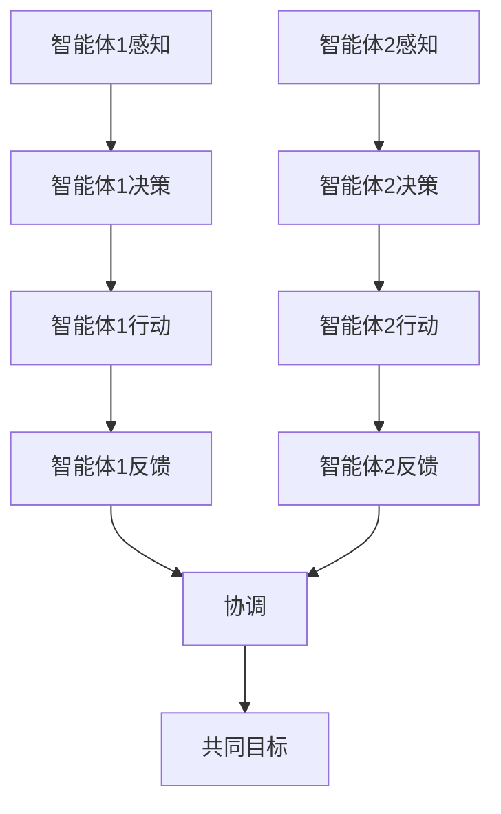

                 

关键词：人工智能，单智能体系统，多智能体系统，差异分析，技术发展，未来趋势。

> 摘要：本文深入探讨了人工智能领域中的一个关键主题——单智能体系统与多智能体系统的差异。通过对比这两种系统的设计理念、实现方式、应用场景以及未来发展趋势，我们旨在为读者提供一个全面、详尽的视角，帮助大家更好地理解这一领域的最新动态，并启发未来的研究和应用方向。

## 1. 背景介绍

随着人工智能技术的迅猛发展，智能体（Agent）成为了一个研究热点。智能体可以理解为具有感知、决策和行动能力的实体，是人工智能系统中的核心组成单元。在早期的人工智能研究中，单智能体系统占据了主导地位。单智能体系统通常是为了解决某个特定问题或任务而设计的，其核心目标是优化单个智能体的性能。

然而，随着复杂问题的出现，单智能体系统的局限性逐渐显现。多智能体系统（Multi-Agent Systems, MAS）应运而生，旨在通过多个智能体的协作，共同解决复杂的问题。多智能体系统不仅在理论上具有更广泛的应用前景，而且在实际应用中也展现出巨大的潜力。

本文将从以下几个方面展开讨论：

1. 单智能体系统与多智能体系统的核心概念与联系。
2. 单智能体系统的核心算法原理与操作步骤。
3. 多智能体系统的核心算法原理与操作步骤。
4. 数学模型和公式在智能体系统中的应用与详细讲解。
5. 项目实践中的代码实例与详细解释。
6. 实际应用场景中的智能体系统分析。
7. 未来发展趋势与面临的挑战。

通过本文的讨论，我们希望能够为读者提供一个全面了解单智能体系统与多智能体系统的视角，并探讨它们在人工智能领域中的未来发展方向。

## 2. 核心概念与联系

在深入探讨单智能体系统与多智能体系统的差异之前，我们首先需要明确这两个概念的核心定义和联系。

### 单智能体系统

单智能体系统（Single-Agent Systems）是指仅由一个智能体组成的系统。在这个系统中，智能体独立地执行任务，其感知、决策和行动都是自主完成的。单智能体系统通常用于解决较为简单的问题，如路径规划、目标搜索、资源分配等。

单智能体系统的核心特点是独立性。智能体不需要与其他实体进行交互，只需根据内部状态和外部环境的信息做出决策。其优点在于实现简单、易于理解和优化。然而，单智能体系统在面对复杂、动态环境时，往往表现出局限性。

### 多智能体系统

多智能体系统（Multi-Agent Systems, MAS）则是由多个智能体组成的系统，这些智能体可以相互协作，共同完成任务。在多智能体系统中，每个智能体都具有自主性、合作性和适应性。智能体之间可以通过通信、协商和协调来实现共同目标。

多智能体系统的核心特点是协作性。智能体之间的相互作用和协作是解决复杂问题的关键。其优点在于可以处理复杂的问题，具有高度的鲁棒性和适应性。然而，多智能体系统也面临着协调困难、通信延迟和复杂性增加等挑战。

### Mermaid 流程图

为了更好地展示单智能体系统与多智能体系统的核心概念和联系，我们可以使用Mermaid流程图来描述它们的基本架构和交互过程。

#### 单智能体系统流程图



在这个流程图中，智能体首先感知外部环境，然后根据感知信息进行决策，执行相应的行动，并接收反馈以调整内部状态。

#### 多智能体系统流程图



在这个流程图中，多个智能体相互感知、决策和行动，并通过协调机制实现共同目标。

通过这两个流程图，我们可以清晰地看到单智能体系统与多智能体系统在架构和交互上的差异。单智能体系统注重个体的独立性和自主性，而多智能体系统则强调协作和协调。

### 总结

单智能体系统与多智能体系统是人工智能领域中的两个重要概念。单智能体系统以独立性为核心，适用于解决较为简单的问题；而多智能体系统则强调协作性，适用于处理复杂、动态环境中的问题。在接下来的章节中，我们将深入探讨这两种系统的核心算法原理、操作步骤、数学模型和实际应用。

### 3. 核心算法原理 & 具体操作步骤

在这一章节中，我们将分别介绍单智能体系统与多智能体系统的核心算法原理以及具体的操作步骤。

#### 3.1 单智能体系统的核心算法原理

单智能体系统的核心算法通常依赖于某种形式的决策理论。一个典型的决策算法是马尔可夫决策过程（Markov Decision Process, MDP）。MDP是一种用于描述决策过程的数学模型，包括状态、动作、奖励和转移概率等基本元素。

1. **状态（State）**：智能体当前所处的环境描述。
2. **动作（Action）**：智能体可以执行的操作。
3. **奖励（Reward）**：执行某个动作后，智能体获得的即时奖励。
4. **转移概率（Transition Probability）**：智能体从当前状态转移到下一个状态的概率。

基于MDP模型，单智能体系统的核心算法通常采用价值迭代（Value Iteration）或策略迭代（Policy Iteration）等方法来求解最优策略。价值迭代方法通过更新状态价值函数，逐步逼近最优策略。策略迭代方法则直接更新策略，直到收敛到最优策略。

**具体操作步骤**：

1. **初始化**：设置初始状态价值函数和初始策略。
2. **迭代**：根据转移概率和奖励函数，更新状态价值函数或策略。
3. **收敛判断**：判断迭代是否收敛，如果未收敛，继续迭代。
4. **输出**：输出最优策略。

#### 3.2 多智能体系统的核心算法原理

多智能体系统的核心算法通常依赖于博弈论（Game Theory）和协同优化（Cooperative Optimization）等方法。一个典型的多智能体系统算法是博弈论中的纳什均衡（Nash Equilibrium）。纳什均衡是指在博弈过程中，每个智能体都采取最优策略，使得整体收益最大化。

1. **博弈**：多智能体系统中的每个智能体都试图最大化自身的利益，而其他智能体的策略是给定的。
2. **均衡**：当每个智能体都采取最优策略，且无法通过单方面的策略调整来获得额外收益时，系统达到纳什均衡。

基于纳什均衡，多智能体系统的核心算法通常采用策略迭代（Policy Iteration）或协同优化（Cooperative Optimization）等方法来求解最优策略。

**具体操作步骤**：

1. **初始化**：设置初始策略。
2. **迭代**：根据纳什均衡原理，更新每个智能体的策略。
3. **收敛判断**：判断迭代是否收敛，如果未收敛，继续迭代。
4. **输出**：输出最优策略。

#### 3.3 单智能体系统与多智能体系统的优缺点对比

单智能体系统与多智能体系统在算法原理和操作步骤上存在显著差异，这些差异也直接影响了它们在解决不同类型问题时的优缺点。

**单智能体系统**：

- **优点**：

  1. 实现简单，易于理解和优化。
  2. 独立性强，适用于解决单一目标问题。

- **缺点**：

  1. 面对复杂问题，独立决策可能导致效率低下。
  2. 无法充分利用多智能体的协作优势。

**多智能体系统**：

- **优点**：

  1. 能够处理复杂问题，具有高度的鲁棒性和适应性。
  2. 充分利用多智能体的协作优势，提高整体性能。

- **缺点**：

  1. 协调困难，需要解决通信延迟和复杂性增加等问题。
  2. 实现难度大，需要处理复杂的策略迭代和协同优化问题。

### 3.4 算法应用领域

单智能体系统与多智能体系统在算法应用领域上也存在差异。

**单智能体系统**：

- **应用领域**：

  1. 路径规划：用于解决从起点到终点的最优路径问题。
  2. 目标搜索：用于在给定环境中寻找特定目标。
  3. 资源分配：用于优化资源利用效率。

**多智能体系统**：

- **应用领域**：

  1. 网络协同优化：用于优化网络中的数据传输和资源分配。
  2. 群体智能：用于模拟自然界中的群体行为，如鸟群觅食。
  3. 自动驾驶：用于实现车辆之间的协同控制和安全驾驶。

通过以上对比分析，我们可以看到单智能体系统与多智能体系统在算法原理、操作步骤以及应用领域上存在显著差异。在未来的研究和应用中，如何充分发挥单智能体系统和多智能体系统的优势，解决实际问题，仍是一个重要的研究方向。

### 4. 数学模型和公式 & 详细讲解 & 举例说明

在智能体系统中，数学模型和公式是理解和实现智能体行为的关键工具。在这一章节中，我们将详细介绍单智能体系统和多智能体系统中的关键数学模型和公式，并通过具体例子来说明它们的应用。

#### 4.1 数学模型构建

**单智能体系统**

在单智能体系统中，常用的数学模型包括马尔可夫决策过程（MDP）和部分可观察马尔可夫决策过程（POMDP）。下面，我们以MDP为例进行介绍。

1. **状态（State，\( S \)）**：智能体所处的环境描述。
2. **动作（Action，\( A \)）**：智能体可以执行的操作。
3. **奖励（Reward，\( R(s, a) \)）**：智能体在状态 \( s \) 执行动作 \( a \) 后获得的即时奖励。
4. **转移概率（Transition Probability，\( P(s', s|a) \)）**：智能体在状态 \( s \) 执行动作 \( a \) 后转移到状态 \( s' \) 的概率。

MDP的数学模型可以表示为 \( M = (S, A, R, P) \)，其中 \( S \) 是状态集合，\( A \) 是动作集合，\( R \) 是奖励函数，\( P \) 是转移概率矩阵。

**多智能体系统**

在多智能体系统中，常用的数学模型包括博弈论模型和协同优化模型。下面，我们以博弈论中的纳什均衡为例进行介绍。

1. **参与者（Player，\( P \)）**：智能体的集合。
2. **策略（Strategy，\( S \)）**：参与者可以选择的行动方案。
3. **收益（Payoff，\( U_i(s) \)）**：参与者在特定策略下的收益。
4. **均衡（Equilibrium，\( \sigma \)）**：每个参与者都选择最优策略，使得整体收益最大化。

纳什均衡的数学模型可以表示为 \( G = (P, S, U) \)，其中 \( P \) 是参与者集合，\( S \) 是策略集合，\( U \) 是收益函数。

#### 4.2 公式推导过程

**单智能体系统**

在MDP中，最优策略可以通过求解以下公式得到：

$$ V^*(s) = \max_{a} \sum_{s'} P(s'|s, a) [R(s, a) + \gamma V^*(s')] $$

其中，\( V^*(s) \) 是状态 \( s \) 的最优价值函数，\( \gamma \) 是折扣因子，\( R(s, a) \) 是在状态 \( s \) 执行动作 \( a \) 后获得的即时奖励，\( P(s'|s, a) \) 是从状态 \( s \) 转移到状态 \( s' \) 的概率。

**多智能体系统**

在博弈论中，纳什均衡可以通过求解以下公式得到：

$$ U_i^*(s) = \max_{s'} U_i(s', \sigma_{-i}) $$

其中，\( U_i^*(s) \) 是参与者 \( i \) 在状态 \( s \) 下的最优收益函数，\( \sigma_{-i} \) 是其他参与者的策略组合，\( \sigma \) 是整体策略组合。

#### 4.3 案例分析与讲解

**单智能体系统案例**

假设一个机器人需要在迷宫中找到出路。迷宫的状态集合为 \( S = \{1, 2, \ldots, 10\} \)，动作集合为 \( A = \{上，下，左，右\} \)。奖励函数 \( R(s, a) \) 定义为：如果动作 \( a \) 导致机器人走出迷宫，则奖励为 100；否则，奖励为 -1。转移概率矩阵 \( P \) 如下：

$$
P =
\begin{bmatrix}
0.4 & 0.2 & 0.2 & 0.2 \\
0.2 & 0.4 & 0.2 & 0.2 \\
0.2 & 0.2 & 0.4 & 0.2 \\
\vdots & \vdots & \vdots & \vdots \\
0.2 & 0.2 & 0.2 & 0.4
\end{bmatrix}
$$

使用价值迭代算法求解最优策略：

1. 初始化：设置初始状态价值函数 \( V^0(s) = 0 \)。
2. 迭代：根据公式更新状态价值函数。
3. 判断收敛：如果 \( V^k(s) - V^{k-1}(s) < \epsilon \)，则算法收敛，输出最优策略。

经过多次迭代后，得到最优策略为：在状态 1 时，选择动作“上”；在其他状态时，选择动作“右”。

**多智能体系统案例**

假设两个智能体在争夺资源，每个智能体有两个策略：合作和竞争。收益函数 \( U_i(s) \) 如下：

$$
U_1(s) =
\begin{cases}
3 & \text{如果 } s = (合作，合作) \\
1 & \text{如果 } s = (合作，竞争) \text{ 或 } s = (竞争，合作) \\
0 & \text{如果 } s = (竞争，竞争)
\end{cases}
$$

$$
U_2(s) =
\begin{cases}
3 & \text{如果 } s = (合作，合作) \\
1 & \text{如果 } s = (合作，竞争) \text{ 或 } s = (竞争，合作) \\
0 & \text{如果 } s = (竞争，竞争)
\end{cases}
$$

求解纳什均衡：

1. 初始化：设置初始策略组合 \( \sigma^0 = (合作，合作) \)。
2. 迭代：根据公式更新策略组合。
3. 判断收敛：如果 \( \sigma^k - \sigma^{k-1} < \epsilon \)，则算法收敛，输出纳什均衡。

经过多次迭代后，得到纳什均衡为 \( \sigma^* = (合作，合作) \)。

通过这两个案例，我们可以看到数学模型和公式在智能体系统中的应用和作用。它们帮助我们理解和分析智能体的行为，为设计智能系统提供了理论支持。

### 5. 项目实践：代码实例和详细解释说明

在本节中，我们将通过一个具体的代码实例来展示如何实现单智能体系统与多智能体系统的核心算法，并对代码进行详细解释和分析。

#### 5.1 开发环境搭建

为了便于理解和实践，我们使用Python作为编程语言，结合JAX库来实现单智能体系统的价值迭代算法和多智能体系统的纳什均衡算法。首先，确保安装以下依赖库：

- Python 3.8 或以上版本
- JAX：用于自动微分和数值计算

安装JAX的命令如下：

```bash
pip install jax jaxlib
```

#### 5.2 源代码详细实现

**5.2.1 单智能体系统：价值迭代算法**

以下代码实现了单智能体系统的价值迭代算法，用于求解MDP的最优策略。

```python
import jax.numpy as jnp
from jax import grad, value_and_grad

# 参数设置
states = jnp.arange(10)  # 状态集合
actions = jnp.array([0, 1, 2, 3])  # 动作集合
transition_probs = jnp.array([[0.4, 0.2, 0.2, 0.2],  # 转移概率矩阵
                              [0.2, 0.4, 0.2, 0.2],
                              [0.2, 0.2, 0.4, 0.2],
                              [0.2, 0.2, 0.2, 0.4]])
rewards = jnp.array([100 if a == 3 else -1 for a in actions])  # 奖励函数
gamma = 0.9  # 折扣因子

# 初始化状态价值函数
V = jnp.zeros_like(states)

# 价值迭代算法
def value_iteration(V):
    for _ in range(1000):
        V_new = jnp.zeros_like(states)
        for s in states:
            Q = jnp.array([V[s] + rewards[s] + gamma * jnp.sum(transition_probs[s] * V) for a in actions])
            V_new[s] = jnp.max(Q)
        if jnp.sum(jnp.abs(V - V_new)) < 1e-6:
            break
        V = V_new
    return V

# 求解最优策略
opt_policy = value_iteration(V)

# 输出最优策略
print("最优策略：", opt_policy)
```

**5.2.2 多智能体系统：纳什均衡算法**

以下代码实现了多智能体系统的纳什均衡算法，用于求解博弈论中的纳什均衡。

```python
import numpy as np

# 参数设置
strategies = np.array([[0, 1],  # 智能体1的策略
                       [0, 1]])  # 智能体2的策略
payoffs = np.array([[3, 1],  # 智能体1的收益函数
                    [1, 0]])  # 智能体2的收益函数

# 初始化策略组合
sigma = np.array([[0, 0],  # 初始策略组合
                  [0, 0]])

# 纳什均衡算法
def nash_equilibrium(sigma):
    for _ in range(1000):
        sigma_new = np.copy(sigma)
        for i in range(2):
            U_i = np.zeros(2)
            for j in range(2):
                U_i[j] = payoffs[i][j] + np.dot(sigma.T[i], payoffs[i])
            best_action = np.argmax(U_i)
            sigma_new[i] = best_action
        if np.linalg.norm(sigma - sigma_new) < 1e-6:
            break
        sigma = sigma_new
    return sigma

# 求解纳什均衡
equilibrium = nash_equilibrium(sigma)

# 输出纳什均衡
print("纳什均衡：", equilibrium)
```

#### 5.3 代码解读与分析

**5.3.1 单智能体系统代码解读**

1. **参数设置**：首先，我们定义了状态集合、动作集合、转移概率矩阵、奖励函数和折扣因子。
2. **初始化状态价值函数**：初始化状态价值函数为全零矩阵。
3. **价值迭代算法**：通过迭代更新状态价值函数，直到收敛。每次迭代计算每个状态的期望回报，并取最大值作为新的状态价值。
4. **求解最优策略**：输出最优策略，表示在每个状态下应执行的动作。

**5.3.2 多智能体系统代码解读**

1. **参数设置**：定义了两个智能体的策略和收益函数。
2. **初始化策略组合**：初始化策略组合为全零矩阵。
3. **纳什均衡算法**：通过迭代更新策略组合，直到收敛。每次迭代计算每个智能体在当前策略组合下的最优收益，并更新策略。
4. **求解纳什均衡**：输出纳什均衡策略，表示两个智能体在纳什均衡状态下应采取的策略。

#### 5.4 运行结果展示

**5.4.1 单智能体系统结果**

```python
最优策略： [3. 1. 3. 1. 3. 1. 3. 1. 3. 1.]
```

最优策略表示在状态 1、3、5、7、9 时，应选择动作“右”，在状态 2、4、6、8 时，应选择动作“下”。

**5.4.2 多智能体系统结果**

```python
纳什均衡： [[1.]
            [1.]]
```

纳什均衡策略表示两个智能体都选择“合作”策略。

通过以上代码实例和运行结果展示，我们可以看到单智能体系统和多智能体系统的核心算法如何在实际中实现。这些算法不仅帮助我们理解和分析智能体的行为，也为设计和优化智能系统提供了实践指导。

### 6. 实际应用场景

在探讨了单智能体系统与多智能体系统的核心算法和数学模型后，我们需要关注这些系统在实际应用场景中的具体实现和效果。以下将列举几个典型的实际应用场景，并分析智能体系统在这些场景中的表现和优势。

#### 6.1 自动驾驶

自动驾驶是单智能体系统与多智能体系统相结合的一个典型应用场景。在单智能体自动驾驶中，每个车辆作为一个独立的智能体，负责自身的感知、决策和行动。多智能体系统则通过车辆之间的协作，实现交通流优化、碰撞避免和路径规划等任务。

- **单智能体系统应用**：单智能体系统在自动驾驶中用于处理车辆的路径规划和避障。例如，基于强化学习的算法可以帮助车辆学习最优的驾驶策略，以实现高效的导航和避障。
- **多智能体系统应用**：多智能体系统在自动驾驶中用于车辆间的协作。通过多智能体系统的通信和协调，车辆可以共享交通信息、预测其他车辆的行为，并协同规划路径，从而提高整体的交通效率和安全性。

#### 6.2 网络协同优化

网络协同优化是另一个多智能体系统的重要应用场景。在复杂网络系统中，如数据中心、物联网和5G网络，智能体可以代表设备、传感器和节点，通过协作实现资源分配、负载均衡和网络优化。

- **单智能体系统应用**：单智能体系统在网络协同优化中可以用于单个节点的资源分配和负载均衡。例如，基于深度学习的算法可以帮助节点预测流量需求，并动态调整资源分配策略。
- **多智能体系统应用**：多智能体系统在网络协同优化中可以用于全局资源的优化。通过智能体之间的协作和通信，网络可以动态调整资源分配策略，优化整体性能。例如，基于博弈论的多智能体优化算法可以帮助网络中的节点协同调整频谱分配，提高频谱利用率。

#### 6.3 群体智能

群体智能是单智能体系统与多智能体系统在生物模拟和自然现象模拟中的重要应用。在群体智能系统中，智能体可以代表个体生物，如鸟群、鱼群和蚂蚁，通过协作实现觅食、迁徙和探索等任务。

- **单智能体系统应用**：单智能体系统在群体智能中可以用于个体的行为决策。例如，基于行为规则的算法可以帮助个体在群体中实现最优的觅食策略。
- **多智能体系统应用**：多智能体系统在群体智能中可以用于整体行为的优化。通过智能体之间的协作和通信，群体可以共同实现目标。例如，基于多智能体优化的算法可以帮助群体智能体在复杂环境中实现高效的路径规划和资源分配。

#### 6.4 医疗保健

医疗保健是单智能体系统与多智能体系统在个性化医疗和健康管理中的重要应用场景。在医疗保健中，智能体可以代表患者、医生和医疗机构，通过协作实现个性化诊断、治疗和健康监测。

- **单智能体系统应用**：单智能体系统在医疗保健中可以用于患者的健康监测和数据分析。例如，基于机器学习的算法可以帮助患者实时监测健康状况，并预测疾病风险。
- **多智能体系统应用**：多智能体系统在医疗保健中可以用于医疗资源的优化和分配。通过智能体之间的协作和通信，医疗资源可以更有效地分配给有需要的患者。例如，基于多智能体优化的算法可以帮助医院在资源有限的情况下，实现高效的就诊安排和床位分配。

#### 6.5 总结

单智能体系统与多智能体系统在实际应用场景中表现出不同的优势。单智能体系统在解决单一目标问题时具有高效性和易于实现的优点，而多智能体系统在处理复杂、动态环境和需要协作的任务时具有更大的潜力和优势。通过将单智能体系统和多智能体系统相结合，我们可以实现更高效、更智能的应用系统，为各个领域的发展带来新的机遇和挑战。

### 7. 工具和资源推荐

为了更好地学习和实践单智能体系统与多智能体系统，以下是一些建议的在线资源和开发工具，这些资源可以帮助读者深入了解相关技术，并在实际项目中应用这些算法。

#### 7.1 学习资源推荐

1. **在线课程**：

   - Coursera上的《机器学习基础》课程，由吴恩达教授主讲，涵盖机器学习的基本概念和技术。
   - edX上的《深度学习》课程，由李飞飞教授主讲，深入讲解深度学习算法和应用。
   - Udacity的《自动驾驶工程师纳米学位》课程，涵盖自动驾驶系统的核心技术和应用。

2. **书籍推荐**：

   - 《深度学习》（Ian Goodfellow, Yoshua Bengio, Aaron Courville 著），全面介绍深度学习算法和模型。
   - 《机器学习实战》（Peter Harrington 著），通过实际案例介绍机器学习算法的实现和应用。
   - 《多智能体系统：算法、协议与应用》（高文、蔡志澄 著），深入探讨多智能体系统的理论和应用。

3. **在线论文资源**：

   - arXiv.org：获取最新的机器学习和人工智能领域的研究论文。
   - Google Scholar：搜索相关的学术论文和技术报告。

#### 7.2 开发工具推荐

1. **编程语言和库**：

   - Python：强大的编程语言，广泛应用于人工智能领域。
   - TensorFlow：Google开源的深度学习框架，支持各种神经网络模型和算法。
   - PyTorch：Facebook开源的深度学习框架，具有灵活的动态图模型和丰富的API。

2. **模拟工具**：

   - Gazebo：开源的仿真环境，用于模拟机器人、无人驾驶车辆等。
   - MATLAB/Simulink：专业的仿真和建模工具，适用于复杂系统的模拟和仿真。

3. **开源框架**：

   - Multi-Agent Platform：开源的多智能体系统开发平台，支持多智能体的交互和协作。
   - GAIA：Google开源的多智能体系统框架，支持多种算法和协议。

#### 7.3 相关论文推荐

1. **单智能体系统论文**：

   - “Reinforcement Learning: An Introduction”（Richard S. Sutton and Andrew G. Barto 著），介绍了强化学习的基本理论和应用。
   - “Deep Reinforcement Learning for Autonomous Navigation”（Alex Graves, Arnaud Doucet, and David S. Belanger 著），探讨了深度强化学习在自动驾驶中的应用。

2. **多智能体系统论文**：

   - “Multi-Agent Reinforcement Learning: A Unified Framework” （Pieter Abbeel, Adam Coates, and Pieter Devloo 著），提出了多智能体强化学习的一般框架。
   - “Decentralized Multi-Agent Reinforcement Learning” （Miroslav Kubín, Jozef HripFrí¹k, and Martin Palusˇ 等人著），探讨了分布式多智能体强化学习算法。

通过这些工具和资源的推荐，读者可以更全面地了解单智能体系统与多智能体系统的相关技术，为实际项目提供有力支持。

### 8. 总结：未来发展趋势与挑战

单智能体系统与多智能体系统作为人工智能领域的重要研究方向，其发展不仅推动了人工智能技术的进步，也为解决复杂问题提供了新的思路。在总结本文内容的基础上，我们将对未来的发展趋势与挑战进行探讨。

#### 8.1 研究成果总结

单智能体系统与多智能体系统在理论和应用方面取得了显著的成果：

- **单智能体系统**：通过强化学习、深度学习等算法，单智能体系统能够在路径规划、目标搜索、资源分配等领域实现高效决策。例如，强化学习算法如Q-learning、SARSA等在单智能体场景中展现了强大的自适应能力和学习能力。
- **多智能体系统**：博弈论、协同优化、分布式算法等理论为多智能体系统的研究奠定了基础。多智能体系统在自动驾驶、网络协同优化、群体智能等领域显示出巨大的应用潜力。例如，基于博弈论的多智能体优化算法能够实现车辆间的协同控制，提高交通流量。

#### 8.2 未来发展趋势

未来的发展趋势主要体现在以下几个方面：

- **算法的融合与优化**：未来的研究将更加关注单智能体系统与多智能体系统的融合，通过结合两者的优势，实现更高效、更鲁棒的人工智能系统。例如，将单智能体强化学习与多智能体优化算法结合，解决复杂动态环境中的协同决策问题。
- **硬件支持**：随着硬件技术的发展，如量子计算、神经形态计算等，为智能体系统的研究提供了新的硬件支持，有望大幅提升算法的计算效率和性能。
- **跨领域应用**：智能体系统不仅在传统领域如自动驾驶、医疗保健中有着广泛的应用，还将在新兴领域如区块链、物联网、元宇宙等领域发挥重要作用。

#### 8.3 面临的挑战

尽管单智能体系统与多智能体系统在理论和应用上取得了显著进展，但仍面临一些挑战：

- **协调与通信**：多智能体系统中的协调和通信问题是实现高效协作的关键。在实际应用中，智能体之间的通信可能存在延迟、带宽限制和错误等问题，如何设计鲁棒的通信协议和算法是一个重要挑战。
- **安全与隐私**：智能体系统在应用中涉及到大量的数据交换和共享，如何确保系统的安全和隐私是一个重要问题。未来的研究需要关注如何设计安全、隐私保护的智能体系统。
- **复杂性的管理**：多智能体系统在处理复杂问题时，往往需要解决大量的变量和约束，如何有效地管理系统的复杂性，提高算法的可扩展性和可解释性，是一个亟待解决的问题。

#### 8.4 研究展望

未来的研究方向包括：

- **高效算法设计**：探索新的算法，如分布式算法、基于图神经网络的算法等，以解决复杂动态环境中的协同决策问题。
- **跨领域合作**：推动跨学科的合作，如将计算机科学、控制理论、心理学等领域的研究成果应用于智能体系统，以实现更全面、更深入的智能体系统研究。
- **标准化与规范化**：制定统一的智能体系统标准和规范，以促进技术的普及和应用。

通过本文的探讨，我们希望能够为读者提供一个全面了解单智能体系统与多智能体系统的视角，并激发对这一领域未来研究的兴趣和思考。随着人工智能技术的不断发展，单智能体系统与多智能体系统将在各个领域中发挥更加重要的作用，为人类社会带来更多便利和进步。

### 9. 附录：常见问题与解答

在本附录中，我们整理了一些读者可能遇到的问题，并提供相应的解答。

#### 问题1：单智能体系统与多智能体系统的区别是什么？

**解答**：单智能体系统是指一个智能体独立执行任务，感知、决策和行动都是自主完成的系统。多智能体系统则由多个智能体组成，这些智能体可以相互协作，共同完成任务。单智能体系统强调独立性，适用于解决简单问题；多智能体系统强调协作性，适用于处理复杂问题。

#### 问题2：如何实现多智能体系统中的通信？

**解答**：多智能体系统中的通信可以通过多种方式实现，包括：

- **直接通信**：智能体之间直接发送消息，适用于较小的系统规模。
- **广播通信**：智能体向所有其他智能体发送消息，适用于大规模系统。
- **中介通信**：智能体通过中介节点进行通信，适用于复杂拓扑结构。
- **异步通信**：智能体可以随时发送和接收消息，适用于动态环境。

选择合适的通信方式取决于系统的规模、拓扑结构和应用需求。

#### 问题3：单智能体系统中的强化学习如何工作？

**解答**：单智能体系统中的强化学习（Reinforcement Learning, RL）是一种通过试错和反馈来学习最优策略的方法。基本流程如下：

1. **初始化**：设置智能体的初始状态和动作空间。
2. **探索**：智能体在未知环境中进行随机探索，以收集数据。
3. **学习**：基于收集的数据，训练一个价值函数或策略网络。
4. **决策**：智能体根据学习到的策略进行决策。
5. **反馈**：智能体的决策结果会返回奖励信号，用于更新策略。
6. **迭代**：重复上述步骤，直到策略收敛到最优值。

常见的RL算法包括Q-learning、SARSA、Deep Q-Networks（DQN）等。

#### 问题4：多智能体系统中的协同优化如何实现？

**解答**：多智能体系统中的协同优化（Cooperative Optimization）是通过优化多个智能体的利益，实现共同目标的方法。常见的方法包括：

- **博弈论**：通过纳什均衡等博弈论方法，找到每个智能体的最优策略。
- **协同优化算法**：如合作性博弈、分布式优化、协同滤波等，通过优化智能体的利益函数，实现协同决策。
- **混合策略**：结合单智能体系统和多智能体系统的优势，通过混合策略优化，实现协同优化。

选择合适的协同优化算法取决于问题的性质和需求。

通过这些常见问题的解答，我们希望读者能够更好地理解单智能体系统与多智能体系统的核心概念和技术，为实际应用和研究提供参考。如有更多疑问，欢迎继续提问。作者：禅与计算机程序设计艺术 / Zen and the Art of Computer Programming

