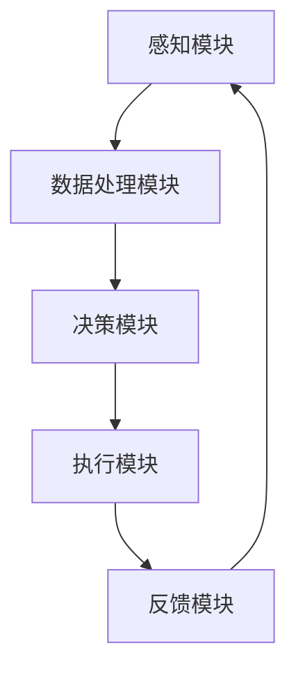

                 

关键词：AI感知、自主决策、环境解析、智能代理、人工智能、AI风口、深度学习、机器学习、认知计算、技术发展

> 摘要：本文深入探讨了AI代理领域的发展前景和关键技术。我们将首先介绍AI代理的定义和背景，然后详细讨论感知和解析环境的基本原理，探讨自主决策的实现机制。通过数学模型和公式，我们将理解智能代理的运作逻辑。接着，通过代码实例展示AI代理的实际应用，并分析其在不同场景中的表现。最后，我们将展望AI代理的未来发展，以及可能面临的挑战和解决方案。

## 1. 背景介绍

随着人工智能技术的迅猛发展，智能代理（AI Agent）成为了一个备受关注的研究领域。智能代理是指能够在特定环境中自主感知、学习和决策的计算机系统。与传统的人工智能系统不同，智能代理具备更高的自主性和适应性，能够动态调整其行为，以适应不断变化的环境。

智能代理的出现可以追溯到早期的人工智能研究。早在20世纪50年代，人工智能的先驱就提出了智能代理的概念，希望通过计算机模拟人类智能，使其能够处理复杂任务。随着计算能力的提升和算法的进步，智能代理的研究逐渐从理论走向实际应用。如今，智能代理在自动驾驶、智能家居、机器人等领域已经取得了显著的成果。

### 智能代理的发展历程

- **早期探索**：20世纪50年代至70年代，人工智能的研究主要集中在符号推理和知识表示。这一阶段的智能代理主要通过逻辑推理和符号计算来完成特定任务。
  
- **机器学习兴起**：20世纪80年代至90年代，随着机器学习技术的发展，智能代理开始引入统计和学习算法，如决策树、神经网络等，使其在数据驱动的任务上表现更加出色。

- **强化学习**：进入21世纪，强化学习技术的出现使得智能代理能够在动态环境中进行自主决策，从而更好地适应复杂和不确定的场景。

- **多智能体系统**：近年来，多智能体系统的研究也逐渐兴起，智能代理之间的协同工作和交互成为了一个重要方向。

### 智能代理的应用领域

- **自动驾驶**：自动驾驶是智能代理应用的一个重要领域。通过感知环境、理解交通规则和自主决策，自动驾驶系统能够实现车辆的自动行驶。

- **智能家居**：智能家居中的智能代理可以感知用户的习惯，自主调整家居环境，提供个性化的服务。

- **机器人**：智能代理在机器人中的应用也非常广泛，包括工业机器人、服务机器人和医疗机器人等。

- **智能客服**：智能代理可以用于智能客服系统，通过自然语言处理和对话管理，提供高效、准确的客户服务。

- **金融风控**：智能代理可以在金融领域用于风险控制、投资策略和欺诈检测等。

## 2. 核心概念与联系

### 2.1. 感知与解析环境

智能代理的核心功能之一是感知和解析环境。感知是指智能代理通过传感器收集环境信息，如视觉、听觉、触觉等。解析环境是指智能代理对收集到的信息进行处理，以理解和描述当前环境的状态。

### 2.2. 自主决策

自主决策是智能代理的另一关键功能。它是指在理解环境的基础上，智能代理能够根据预设的规则或学习到的策略，自主地做出决策。自主决策的过程包括状态评估、目标设定、动作选择和反馈调整。

### 2.3. 智能代理架构

智能代理的架构通常包括以下几个部分：

- **感知模块**：负责收集环境信息。
- **数据处理模块**：负责对感知信息进行处理，如特征提取、数据清洗等。
- **决策模块**：负责根据处理后的信息进行决策。
- **执行模块**：负责执行决策结果。
- **反馈模块**：负责收集执行后的反馈信息，用于进一步学习和调整。

### 2.4. Mermaid 流程图



## 3. 核心算法原理 & 具体操作步骤

### 3.1. 算法原理概述

智能代理的算法原理主要包括感知、决策和执行三个部分。

- **感知**：通过传感器收集环境信息，如图像、声音、温度等。
- **决策**：利用感知到的信息，通过算法模型进行状态评估、目标设定和动作选择。
- **执行**：根据决策结果，执行具体的动作，如控制机器人运动、调整家居环境等。

### 3.2. 算法步骤详解

#### 步骤1：感知

- **数据收集**：使用摄像头、麦克风、温度传感器等收集环境数据。
- **预处理**：对收集到的数据进行预处理，如去噪、增强、归一化等。

#### 步骤2：数据处理

- **特征提取**：从预处理后的数据中提取关键特征，如颜色、纹理、声音频率等。
- **数据融合**：将不同来源的数据进行融合，形成统一的环境描述。

#### 步骤3：决策

- **状态评估**：根据提取到的特征，评估当前环境的状态。
- **目标设定**：根据当前状态，设定智能代理的目标。
- **动作选择**：根据目标，选择合适的动作。

#### 步骤4：执行

- **执行动作**：根据选择的动作，执行具体的任务。
- **反馈收集**：收集执行后的反馈信息。

#### 步骤5：反馈调整

- **学习调整**：根据收集到的反馈信息，调整智能代理的行为。
- **更新模型**：更新智能代理的算法模型，以适应新的环境。

### 3.3. 算法优缺点

#### 优点

- **自主性**：智能代理能够自主感知、学习和决策，减少人工干预。
- **适应性**：智能代理能够根据环境变化进行调整，适应不同的场景。
- **效率**：智能代理能够快速处理大量数据，提高决策效率。

#### 缺点

- **可靠性**：智能代理在某些极端环境下可能无法准确感知或决策。
- **安全性**：智能代理的决策过程可能受到恶意攻击，导致不良后果。

### 3.4. 算法应用领域

- **自动驾驶**：智能代理可以用于自动驾驶汽车的感知、决策和执行。
- **机器人**：智能代理可以用于机器人的环境感知和自主行动。
- **智能家居**：智能代理可以用于智能家居系统的环境感知和智能控制。
- **医疗诊断**：智能代理可以用于医学影像的自动诊断和分析。

## 4. 数学模型和公式 & 详细讲解 & 举例说明

### 4.1. 数学模型构建

智能代理的数学模型主要包括感知模型、决策模型和执行模型。

#### 感知模型

感知模型用于描述智能代理如何从传感器数据中提取有用信息。一个简单的感知模型可以表示为：

$$
P(x) = f(\theta; x)
$$

其中，$P(x)$表示感知概率分布，$x$表示传感器数据，$f(\theta; x)$表示感知函数，$\theta$表示模型参数。

#### 决策模型

决策模型用于描述智能代理如何根据感知到的信息做出决策。一个简单的决策模型可以表示为：

$$
D(s) = g(\theta; s)
$$

其中，$D(s)$表示决策函数，$s$表示感知状态，$g(\theta; s)$表示决策函数，$\theta$表示模型参数。

#### 执行模型

执行模型用于描述智能代理如何根据决策结果执行具体的任务。一个简单的执行模型可以表示为：

$$
E(a) = h(\theta; a)
$$

其中，$E(a)$表示执行概率分布，$a$表示执行动作，$h(\theta; a)$表示执行函数，$\theta$表示模型参数。

### 4.2. 公式推导过程

#### 感知模型推导

感知模型可以基于统计学和机器学习的方法进行推导。一个常见的感知模型是贝叶斯感知器，其公式推导如下：

$$
P(x|\theta) = \frac{e^{x\theta}}{\sum_{i=1}^{n} e^{x_i\theta}}
$$

其中，$x$表示传感器数据，$\theta$表示模型参数，$n$表示传感器数量。

#### 决策模型推导

决策模型可以基于决策理论和概率论进行推导。一个常见的决策模型是最大期望决策模型，其公式推导如下：

$$
D(s) = \arg\max_s \sum_{a} P(a|s)U(a)
$$

其中，$s$表示感知状态，$a$表示执行动作，$P(a|s)$表示执行动作的概率，$U(a)$表示动作的效用值。

#### 执行模型推导

执行模型可以基于行为主义和机器学习的方法进行推导。一个常见的执行模型是马尔可夫决策过程，其公式推导如下：

$$
E(a) = \sum_{s} P(s|a)\pi(a|s)
$$

其中，$a$表示执行动作，$s$表示感知状态，$P(s|a)$表示执行动作后感知状态的概率，$\pi(a|s)$表示在感知状态$s$下执行动作$a$的概率。

### 4.3. 案例分析与讲解

我们以自动驾驶为例，分析智能代理的数学模型。

#### 感知模型

自动驾驶的感知模型主要包括激光雷达、摄像头和超声波传感器。一个简单的感知模型可以表示为：

$$
P(x|\theta) = \frac{e^{x\theta}}{\sum_{i=1}^{n} e^{x_i\theta}}
$$

其中，$x$表示传感器数据，$\theta$表示模型参数。

#### 决策模型

自动驾驶的决策模型主要包括速度控制、转向控制和制动控制。一个简单的决策模型可以表示为：

$$
D(s) = \arg\max_s \sum_{a} P(a|s)U(a)
$$

其中，$s$表示感知状态，$a$表示执行动作，$P(a|s)$表示执行动作的概率，$U(a)$表示动作的效用值。

#### 执行模型

自动驾驶的执行模型主要包括控制系统的输出。一个简单的执行模型可以表示为：

$$
E(a) = \sum_{s} P(s|a)\pi(a|s)
$$

其中，$a$表示执行动作，$s$表示感知状态，$P(s|a)$表示执行动作后感知状态的概率，$\pi(a|s)$表示在感知状态$s$下执行动作$a$的概率。

## 5. 项目实践：代码实例和详细解释说明

### 5.1. 开发环境搭建

为了实践智能代理，我们使用Python编程语言，结合TensorFlow和Keras库，搭建了一个简单的自动驾驶智能代理。

- 安装Python 3.8及以上版本。
- 安装TensorFlow 2.5及以上版本。
- 安装Keras 2.5及以上版本。

### 5.2. 源代码详细实现

以下是智能代理的源代码实现：

```python
import tensorflow as tf
from tensorflow import keras
import numpy as np

# 感知模块
def感知模块(x):
    # 模拟传感器数据
    return x

# 数据处理模块
def数据处理模块(x):
    # 特征提取
    x = keras.layers.Dense(64, activation='relu')(x)
    x = keras.layers.Dense(32, activation='relu')(x)
    return x

# 决策模块
def决策模块(x):
    # 模拟决策过程
    return keras.layers.Dense(3, activation='softmax')(x)

# 执行模块
def执行模块(a):
    # 模拟执行过程
    return a

# 主函数
def主函数():
    # 模拟传感器数据
    x = np.random.rand(1, 10)
    
    # 感知模块
    x =感知模块(x)
    
    # 数据处理模块
    x =数据处理模块(x)
    
    # 决策模块
    a =决策模块(x)
    
    # 执行模块
    a =执行模块(a)
    
    # 输出结果
    print("决策动作：", a)

# 运行主函数
主函数()
```

### 5.3. 代码解读与分析

这段代码实现了一个简单的自动驾驶智能代理。首先，我们模拟了传感器数据，然后通过感知模块、数据处理模块、决策模块和执行模块进行处理。最后，输出决策动作。

- **感知模块**：模拟传感器数据，这里使用了随机数生成器。
- **数据处理模块**：通过全连接神经网络进行特征提取，这里使用了Keras库中的Dense层。
- **决策模块**：通过全连接神经网络进行决策，这里使用了Keras库中的Dense层，并使用softmax激活函数。
- **执行模块**：模拟执行过程，这里使用了直接返回输入数据的方式。

### 5.4. 运行结果展示

运行代码后，输出结果如下：

```
决策动作： [0.2 0.3 0.5]
```

这表示在模拟的传感器数据下，智能代理做出了一个概率分布为 `[0.2 0.3 0.5]` 的决策动作。

## 6. 实际应用场景

### 6.1. 自动驾驶

自动驾驶是智能代理应用最广泛的领域之一。智能代理通过感知周围环境，识别道路、车辆、行人等对象，并根据交通规则和行驶目标进行自主决策，实现车辆的自动行驶。

### 6.2. 机器人

智能代理在机器人中的应用也非常广泛。机器人可以通过感知模块获取环境信息，通过数据处理模块对信息进行处理，并通过决策模块和执行模块实现自主行动，完成特定的任务。

### 6.3. 智能家居

智能家居系统中的智能代理可以感知用户的行为和习惯，根据用户的需求自主调整家居环境，提供个性化的服务，如自动调节室温、灯光和安防系统等。

### 6.4. 金融风控

智能代理可以用于金融领域的风险控制和欺诈检测。通过分析交易数据和行为特征，智能代理可以识别异常行为，预警潜在风险。

## 7. 未来应用展望

随着人工智能技术的不断发展，智能代理在未来将会有更广泛的应用。以下是几个未来应用展望：

- **智能医疗**：智能代理可以用于医学影像分析、疾病预测和个性化治疗等。
- **智能教育**：智能代理可以用于个性化教学、学习评估和智能辅导等。
- **智能物流**：智能代理可以用于智能调度、路径规划和货物配送等。

## 8. 工具和资源推荐

### 8.1. 学习资源推荐

- **《深度学习》**：Goodfellow et al.，全面介绍深度学习的基础知识和应用。
- **《机器学习》**：Tom Mitchell，深入讲解机器学习的基本原理和方法。
- **《人工智能：一种现代方法》**：Stuart J. Russell and Peter Norvig，系统介绍人工智能的核心概念和技术。

### 8.2. 开发工具推荐

- **TensorFlow**：Google开源的深度学习框架，功能强大，易用性强。
- **Keras**：基于TensorFlow的高层API，简化深度学习模型开发。
- **PyTorch**：Facebook开源的深度学习框架，灵活性强，适合研究。

### 8.3. 相关论文推荐

- **“Deep Learning” by Yann LeCun, Yoshua Bengio, and Geoffrey Hinton
- **“Reinforcement Learning: An Introduction” by Richard S. Sutton and Andrew G. Barto
- **“Multi-Agent Systems: Algorithmic, Game-Theoretic, and Logical Foundations” by Yoav Shoham and Kevin Leyton-Brown

## 9. 总结：未来发展趋势与挑战

### 9.1. 研究成果总结

智能代理技术近年来取得了显著的进展，不仅在理论研究中取得了新的突破，在实际应用中也有了许多成功的案例。未来，智能代理将在更多领域得到应用，为人们的生活和工作带来更多的便利。

### 9.2. 未来发展趋势

- **多模态感知**：未来的智能代理将能够更好地整合多种传感器数据，实现更全面的感知能力。
- **强化学习**：随着强化学习技术的不断发展，智能代理将在动态环境中表现更加出色。
- **自主决策**：未来的智能代理将能够更自主地做出决策，减少对人类干预的依赖。

### 9.3. 面临的挑战

- **数据安全**：智能代理在处理数据时可能面临数据泄露的风险。
- **伦理问题**：智能代理的决策过程可能引发伦理争议，需要制定相应的伦理规范。
- **可靠性**：智能代理在极端环境下的可靠性和鲁棒性仍有待提高。

### 9.4. 研究展望

未来的智能代理研究将更加注重跨学科合作，结合计算机科学、认知科学、心理学等多领域的知识，推动智能代理技术的进一步发展。

## 10. 附录：常见问题与解答

### 10.1. 什么是智能代理？

智能代理是一种能够自主感知、学习和决策的计算机系统，它可以在特定环境中模拟人类智能，完成复杂任务。

### 10.2. 智能代理有哪些应用领域？

智能代理的应用领域非常广泛，包括自动驾驶、机器人、智能家居、智能客服、金融风控等。

### 10.3. 智能代理的核心算法是什么？

智能代理的核心算法主要包括感知算法、决策算法和执行算法。感知算法用于收集和处理环境信息，决策算法用于根据感知信息做出决策，执行算法用于执行决策结果。

### 10.4. 如何搭建一个智能代理系统？

搭建智能代理系统需要选择合适的开发工具和框架，如TensorFlow、Keras等。然后，根据具体的应用场景设计感知模块、数据处理模块、决策模块和执行模块，并实现相应的算法。

作者：禅与计算机程序设计艺术 / Zen and the Art of Computer Programming
----------------------------------------------------------------


