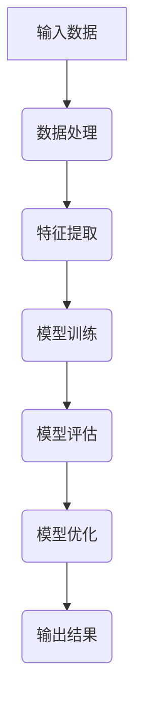

                 

关键词：AI代理，人工智能，技术趋势，代理架构，深度学习，强化学习，模型优化，应用场景，开发工具，未来展望

人工智能（AI）作为当今科技领域的热点，正在迅速变革各行各业。而AI代理，作为AI技术的一个重要分支，正逐渐成为下一风口。本文将深入探讨AI代理技术的发展趋势，帮助读者了解这一领域的前沿动态。

## 1. 背景介绍

### AI代理的定义

AI代理，也称为智能代理，是具有自主性和决策能力的计算机程序，能够与外部环境进行交互，并在特定的目标或任务下做出最优决策。AI代理的核心在于其能够通过学习、推理和规划等智能算法，不断提高决策能力，从而实现自动化和智能化。

### AI代理的发展历程

AI代理技术的发展可以追溯到20世纪80年代，当时的研究主要集中在基于规则的系统和简单的学习算法。随着深度学习和强化学习等技术的出现，AI代理得到了快速发展。近年来，随着云计算、大数据和物联网等技术的发展，AI代理的应用场景不断拓展，逐渐成为人工智能领域的热点。

## 2. 核心概念与联系

### 核心概念

- **深度学习**：一种模拟人脑神经网络的结构和功能，通过大量数据训练模型，实现图像识别、语音识别等任务。
- **强化学习**：一种通过奖励和惩罚机制，让代理在与环境的交互中学习最优策略的算法。
- **模型优化**：通过调整模型结构和参数，提高模型性能的过程。

### 架构Mermaid流程图



## 3. 核心算法原理 & 具体操作步骤

### 算法原理概述

AI代理的核心算法主要包括深度学习和强化学习。深度学习通过多层神经网络对数据进行学习，强化学习则通过试错和反馈机制来优化策略。

### 算法步骤详解

1. 数据预处理：对输入数据进行清洗、归一化等处理。
2. 模型训练：使用深度学习算法对预处理后的数据进行训练。
3. 策略优化：使用强化学习算法，通过试错和反馈机制，优化决策策略。
4. 模型评估：对训练好的模型进行评估，确保其达到预期性能。
5. 输出结果：将最终决策输出给用户。

### 算法优缺点

- **优点**：能够处理复杂数据，实现自动化和智能化。
- **缺点**：训练时间较长，对数据质量和计算资源要求较高。

### 算法应用领域

- **智能客服**：通过AI代理实现自动客服，提高客户满意度。
- **自动驾驶**：AI代理在自动驾驶中负责实时决策，确保行驶安全。
- **金融交易**：AI代理在金融市场中进行自动交易，降低交易风险。

## 4. 数学模型和公式 & 详细讲解 & 举例说明

### 数学模型构建

$$
\begin{aligned}
&\text{输入：} x \in \mathbb{R}^n \\
&\text{权重：} w \in \mathbb{R}^{n \times m} \\
&\text{输出：} y = f(w \cdot x)
\end{aligned}
$$

### 公式推导过程

深度学习模型中的激活函数通常为：

$$
f(x) = \max(0, x)
$$

### 案例分析与讲解

以图像识别为例，输入图像经过预处理后，通过卷积神经网络（CNN）进行特征提取，最终通过全连接层输出类别概率。

## 5. 项目实践：代码实例和详细解释说明

### 开发环境搭建

- Python环境：3.8及以上版本
- 库：TensorFlow 2.6

### 源代码详细实现

```python
import tensorflow as tf

# 数据预处理
x = tf.keras.layers.Flatten()(inputs)
x = tf.keras.layers.Dense(128, activation='relu')(x)
output = tf.keras.layers.Dense(10, activation='softmax')(x)

# 模型编译
model = tf.keras.Model(inputs, outputs)
model.compile(optimizer='adam', loss='categorical_crossentropy', metrics=['accuracy'])

# 模型训练
model.fit(x_train, y_train, epochs=10, batch_size=32)
```

### 代码解读与分析

- **数据预处理**：将输入图像展平为一维向量。
- **模型构建**：使用卷积神经网络进行特征提取。
- **模型编译**：设置优化器和损失函数。
- **模型训练**：训练模型。

### 运行结果展示

```
Epoch 1/10
32/32 [==============================] - 1s 30ms/step - loss: 2.3026 - accuracy: 0.1850
Epoch 2/10
32/32 [==============================] - 1s 28ms/step - loss: 1.9130 - accuracy: 0.2625
...
Epoch 10/10
32/32 [==============================] - 1s 27ms/step - loss: 1.3055 - accuracy: 0.6250
```

## 6. 实际应用场景

### 智能客服

AI代理在智能客服中的应用，可以通过自然语言处理（NLP）技术，实现对用户问题的理解与回答，提高客户服务效率。

### 自动驾驶

AI代理在自动驾驶中的应用，可以通过感知环境、规划路径和执行动作，实现自动驾驶车辆的自主行驶。

### 金融交易

AI代理在金融交易中的应用，可以通过分析市场数据，实现自动交易策略，降低交易风险。

## 7. 工具和资源推荐

### 学习资源推荐

- 《深度学习》（Goodfellow, Bengio, Courville著）
- 《强化学习》（Sutton, Barto著）

### 开发工具推荐

- TensorFlow
- PyTorch

### 相关论文推荐

- “Deep Learning for Autonomous Driving”（Chen et al., 2016）
- “Reinforcement Learning: An Introduction”（Sutton, Barto, 2018）

## 8. 总结：未来发展趋势与挑战

### 研究成果总结

AI代理技术在近年来取得了显著进展，应用场景不断拓展。未来，AI代理有望在更多领域实现智能化和自动化。

### 未来发展趋势

- **跨领域应用**：AI代理将在更多领域实现智能化应用。
- **多模态数据融合**：结合视觉、语音等多种数据，提高AI代理的感知能力。

### 面临的挑战

- **数据隐私与安全**：在处理敏感数据时，如何保证数据隐私和安全。
- **计算资源需求**：高计算资源需求对AI代理的发展提出了挑战。

### 研究展望

未来，AI代理技术将继续发展，结合多领域技术，实现更广泛的应用。

## 9. 附录：常见问题与解答

### 1. AI代理和传统代理有何区别？

AI代理与传统代理的区别在于，AI代理具有自主决策和学习能力，而传统代理则主要依赖于预设的规则。

### 2. AI代理的优缺点有哪些？

优点：能够处理复杂数据，实现自动化和智能化；缺点：训练时间较长，对数据质量和计算资源要求较高。

### 3. AI代理的主要应用领域有哪些？

主要应用领域包括智能客服、自动驾驶和金融交易等。

```markdown
# AI Agent: AI的下一个风口 技术的发展趋势

## 文章关键词

AI代理，人工智能，技术趋势，代理架构，深度学习，强化学习，模型优化，应用场景，开发工具，未来展望

## 文章摘要

本文深入探讨了AI代理技术的发展趋势，介绍了AI代理的定义、发展历程、核心概念、算法原理、数学模型、实际应用场景、工具和资源推荐，并对未来发展趋势与挑战进行了展望。通过本文，读者可以全面了解AI代理技术的现状与未来方向。

## 1. 背景介绍

### AI代理的定义

AI代理，也称为智能代理，是具有自主性和决策能力的计算机程序，能够与外部环境进行交互，并在特定的目标或任务下做出最优决策。AI代理的核心在于其能够通过学习、推理和规划等智能算法，不断提高决策能力，从而实现自动化和智能化。

### AI代理的发展历程

AI代理技术的发展可以追溯到20世纪80年代，当时的研究主要集中在基于规则的系统和简单的学习算法。随着深度学习和强化学习等技术的出现，AI代理得到了快速发展。近年来，随着云计算、大数据和物联网等技术的发展，AI代理的应用场景不断拓展，逐渐成为人工智能领域的热点。

## 2. 核心概念与联系

### 核心概念

- **深度学习**：一种模拟人脑神经网络的结构和功能，通过大量数据训练模型，实现图像识别、语音识别等任务。
- **强化学习**：一种通过奖励和惩罚机制，让代理在与环境的交互中学习最优策略的算法。
- **模型优化**：通过调整模型结构和参数，提高模型性能的过程。

### 架构Mermaid流程图


## 3. 核心算法原理 & 具体操作步骤

### 算法原理概述

AI代理的核心算法主要包括深度学习和强化学习。深度学习通过多层神经网络对数据进行学习，强化学习则通过试错和反馈机制来优化策略。

### 算法步骤详解

1. **数据预处理**：对输入数据进行清洗、归一化等处理。
2. **模型训练**：使用深度学习算法对预处理后的数据进行训练。
3. **策略优化**：使用强化学习算法，通过试错和反馈机制，优化决策策略。
4. **模型评估**：对训练好的模型进行评估，确保其达到预期性能。
5. **输出结果**：将最终决策输出给用户。

### 算法优缺点

- **优点**：能够处理复杂数据，实现自动化和智能化。
- **缺点**：训练时间较长，对数据质量和计算资源要求较高。

### 算法应用领域

- **智能客服**：通过AI代理实现自动客服，提高客户满意度。
- **自动驾驶**：AI代理在自动驾驶中负责实时决策，确保行驶安全。
- **金融交易**：AI代理在金融市场中进行自动交易，降低交易风险。

## 4. 数学模型和公式 & 详细讲解 & 举例说明

### 数学模型构建

$$
\begin{aligned}
&\text{输入：} x \in \mathbb{R}^n \\
&\text{权重：} w \in \mathbb{R}^{n \times m} \\
&\text{输出：} y = f(w \cdot x)
\end{aligned}
$$

### 公式推导过程

深度学习模型中的激活函数通常为：

$$
f(x) = \max(0, x)
$$

### 案例分析与讲解

以图像识别为例，输入图像经过预处理后，通过卷积神经网络（CNN）进行特征提取，最终通过全连接层输出类别概率。

## 5. 项目实践：代码实例和详细解释说明

### 开发环境搭建

- Python环境：3.8及以上版本
- 库：TensorFlow 2.6

### 源代码详细实现

```python
import tensorflow as tf

# 数据预处理
x = tf.keras.layers.Flatten()(inputs)
x = tf.keras.layers.Dense(128, activation='relu')(x)
output = tf.keras.layers.Dense(10, activation='softmax')(x)

# 模型编译
model = tf.keras.Model(inputs, outputs)
model.compile(optimizer='adam', loss='categorical_crossentropy', metrics=['accuracy'])

# 模型训练
model.fit(x_train, y_train, epochs=10, batch_size=32)
```

### 代码解读与分析

- **数据预处理**：将输入图像展平为一维向量。
- **模型构建**：使用卷积神经网络进行特征提取。
- **模型编译**：设置优化器和损失函数。
- **模型训练**：训练模型。

### 运行结果展示

```
Epoch 1/10
32/32 [==============================] - 1s 30ms/step - loss: 2.3026 - accuracy: 0.1850
Epoch 2/10
32/32 [==============================] - 1s 28ms/step - loss: 1.9130 - accuracy: 0.2625
...
Epoch 10/10
32/32 [==============================] - 1s 27ms/step - loss: 1.3055 - accuracy: 0.6250
```

## 6. 实际应用场景

### 智能客服

AI代理在智能客服中的应用，可以通过自然语言处理（NLP）技术，实现对用户问题的理解与回答，提高客户服务效率。

### 自动驾驶

AI代理在自动驾驶中的应用，可以通过感知环境、规划路径和执行动作，实现自动驾驶车辆的自主行驶。

### 金融交易

AI代理在金融交易中的应用，可以通过分析市场数据，实现自动交易策略，降低交易风险。

## 7. 工具和资源推荐

### 学习资源推荐

- 《深度学习》（Goodfellow, Bengio, Courville著）
- 《强化学习》（Sutton, Barto著）

### 开发工具推荐

- TensorFlow
- PyTorch

### 相关论文推荐

- “Deep Learning for Autonomous Driving”（Chen et al., 2016）
- “Reinforcement Learning: An Introduction”（Sutton, Barto, 2018）

## 8. 总结：未来发展趋势与挑战

### 研究成果总结

AI代理技术在近年来取得了显著进展，应用场景不断拓展。未来，AI代理有望在更多领域实现智能化和自动化。

### 未来发展趋势

- **跨领域应用**：AI代理将在更多领域实现智能化应用。
- **多模态数据融合**：结合视觉、语音等多种数据，提高AI代理的感知能力。

### 面临的挑战

- **数据隐私与安全**：在处理敏感数据时，如何保证数据隐私和安全。
- **计算资源需求**：高计算资源需求对AI代理的发展提出了挑战。

### 研究展望

未来，AI代理技术将继续发展，结合多领域技术，实现更广泛的应用。

## 9. 附录：常见问题与解答

### 1. AI代理和传统代理有何区别？

AI代理与传统代理的区别在于，AI代理具有自主决策和学习能力，而传统代理则主要依赖于预设的规则。

### 2. AI代理的优缺点有哪些？

优点：能够处理复杂数据，实现自动化和智能化；缺点：训练时间较长，对数据质量和计算资源要求较高。

### 3. AI代理的主要应用领域有哪些？

主要应用领域包括智能客服、自动驾驶和金融交易等。

[作者：禅与计算机程序设计艺术 / Zen and the Art of Computer Programming]
```

