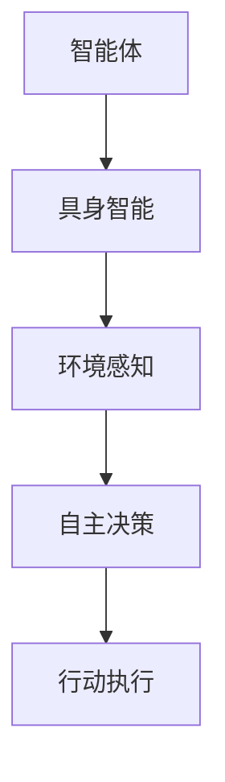

                 

关键词：AI Agent，智能体，具身智能，人工智能，风口，技术趋势，计算机程序设计

> 摘要：随着人工智能技术的不断发展，AI Agent作为一种新型的人工智能实体，正在成为下一个技术风口。本文将深入探讨智能体的概念、架构、算法原理以及与具身智能的区别，分析其在实际应用中的前景和挑战。

## 1. 背景介绍

### 1.1 人工智能的发展历程

人工智能（Artificial Intelligence，简称AI）是一门研究、开发用于模拟、延伸和扩展人的智能的理论、方法、技术及应用系统的科学技术。人工智能的研究始于20世纪50年代，经过几十年的发展，目前已取得了显著的成果。从最初的理论探索到应用实践，人工智能技术已经深入到各个领域，如自然语言处理、计算机视觉、智能推荐等。

### 1.2 人工智能的现状

当前，人工智能技术正处于快速发展阶段。根据IDC的数据，全球人工智能市场规模将从2020年的370亿美元增长到2025年的1900亿美元，年复合增长率高达42.2%。随着技术的进步，人工智能的应用范围也在不断扩展，从简单的工具应用逐步走向智能化、自动化的系统。

### 1.3 人工智能的未来趋势

未来，人工智能技术将继续向深度学习、强化学习、具身智能等方向发展。特别是智能体（AI Agent）和具身智能，被认为是人工智能技术发展的两个重要方向。本文将重点探讨智能体的概念、架构、算法原理以及与具身智能的区别。

## 2. 核心概念与联系

### 2.1 智能体（AI Agent）

智能体（AI Agent）是一种具有自主决策能力和执行能力的人工智能实体。它可以感知环境、理解任务目标，并通过学习、推理和规划等机制，采取相应的行动，以达到既定目标。智能体可以看作是一个具有独立智能的个体，它能够自主地完成特定的任务。

### 2.2 具身智能（Embodied Intelligence）

具身智能是指智能体通过与物理环境的交互，实现智能的提升和优化。具体来说，具身智能强调智能体在物理世界中的存在和感知能力，它需要具备运动、感知、交互等能力，以更好地适应复杂多变的物理环境。

### 2.3 智能体与具身智能的联系

智能体与具身智能密切相关。智能体的发展离不开具身智能的支持，而具身智能的实现也需要智能体的自主决策和执行能力。可以说，智能体和具身智能是相辅相成的两个概念。

### 2.4 Mermaid 流程图

下面是一个简单的Mermaid流程图，展示了智能体与具身智能的关系。



## 3. 核心算法原理 & 具体操作步骤

### 3.1 算法原理概述

智能体（AI Agent）的核心算法主要包括感知、决策和执行三个部分。

1. **感知**：智能体通过传感器（如摄像头、麦克风等）获取环境信息，并对信息进行处理和解析。
2. **决策**：智能体根据感知到的环境信息和任务目标，通过学习、推理和规划等方法，生成相应的行动策略。
3. **执行**：智能体根据决策结果，通过执行器（如电机、执行器等）执行具体的行动，以实现任务目标。

### 3.2 算法步骤详解

1. **环境感知**：

   智能体首先通过传感器获取环境信息，如视觉、听觉、触觉等。然后，对感知到的信息进行处理和解析，以便为后续的决策提供依据。

2. **决策**：

   智能体根据感知到的环境信息和任务目标，通过学习、推理和规划等方法，生成相应的行动策略。其中，学习可以是基于历史数据的监督学习，也可以是基于试错的强化学习。

3. **执行**：

   智能体根据决策结果，通过执行器执行具体的行动。执行器可以是电机、执行器等，它们将决策结果转化为具体的物理动作。

### 3.3 算法优缺点

**优点**：

1. **自主决策**：智能体具有自主决策能力，能够根据环境信息和任务目标，自主选择行动策略。
2. **适应性强**：智能体可以通过学习、推理和规划等方法，适应复杂多变的物理环境。

**缺点**：

1. **计算复杂度高**：智能体的感知、决策和执行过程涉及大量的计算，对计算资源有较高要求。
2. **数据依赖性强**：智能体的性能很大程度上依赖于感知数据的准确性和完整性。

### 3.4 算法应用领域

智能体在许多领域都有广泛的应用，如：

1. **机器人**：智能体可以应用于机器人，实现自主导航、自主操作等功能。
2. **自动驾驶**：智能体可以应用于自动驾驶汽车，实现自主驾驶、避障等功能。
3. **智能客服**：智能体可以应用于智能客服系统，实现自动回答用户问题、提供个性化服务等功能。

## 4. 数学模型和公式 & 详细讲解 & 举例说明

### 4.1 数学模型构建

智能体（AI Agent）的数学模型主要包括感知、决策和执行三个部分。

1. **感知**：

   假设智能体通过传感器获取的环境信息为 $X$，则感知过程可以表示为：

   $$ X = f_{\text{感知}}(s) $$

   其中，$s$ 为当前状态，$f_{\text{感知}}$ 为感知函数。

2. **决策**：

   假设智能体的决策结果为 $A$，则决策过程可以表示为：

   $$ A = f_{\text{决策}}(X, g) $$

   其中，$g$ 为任务目标，$f_{\text{决策}}$ 为决策函数。

3. **执行**：

   假设智能体的执行结果为 $R$，则执行过程可以表示为：

   $$ R = f_{\text{执行}}(A) $$

   其中，$f_{\text{执行}}$ 为执行函数。

### 4.2 公式推导过程

1. **感知**：

   假设传感器获取的环境信息为 $s$，则感知函数 $f_{\text{感知}}$ 可以表示为：

   $$ f_{\text{感知}}(s) = \sum_{i=1}^{n} w_i s_i $$

   其中，$w_i$ 为权重，$s_i$ 为环境信息的第 $i$ 个特征。

2. **决策**：

   假设智能体的任务目标为 $g$，则决策函数 $f_{\text{决策}}$ 可以表示为：

   $$ f_{\text{决策}}(X, g) = \arg \max_{A} U(A, X, g) $$

   其中，$U(A, X, g)$ 为效用函数。

3. **执行**：

   假设智能体的执行函数 $f_{\text{执行}}$ 可以表示为：

   $$ f_{\text{执行}}(A) = \sum_{i=1}^{n} a_i A_i $$

   其中，$a_i$ 为执行动作的权重，$A_i$ 为第 $i$ 个执行动作。

### 4.3 案例分析与讲解

假设一个简单的智能体需要通过感知环境信息，选择最优的行动策略，以完成一个简单的任务。

1. **感知**：

   智能体通过传感器感知到当前状态 $s$，包括两个特征：距离障碍物的距离 $d$ 和目标物体的位置 $p$。

   $$ s = \begin{pmatrix} d \\ p \end{pmatrix} $$

   感知函数 $f_{\text{感知}}$ 可以表示为：

   $$ f_{\text{感知}}(s) = \begin{pmatrix} 0.7d + 0.3p \\ 0.5d + 0.5p \end{pmatrix} $$

2. **决策**：

   智能体的任务目标是到达目标物体，因此效用函数 $U(A, X, g)$ 可以表示为：

   $$ U(A, X, g) = \begin{cases} 
   1 & \text{if } A = \text{向目标前进}, \\ 
   0 & \text{otherwise}. 
   \end{cases} $$

   决策函数 $f_{\text{决策}}$ 可以表示为：

   $$ f_{\text{决策}}(X, g) = \arg \max_{A} U(A, X, g) = A_1 $$

3. **执行**：

   执行函数 $f_{\text{执行}}$ 可以表示为：

   $$ f_{\text{执行}}(A) = \begin{pmatrix} 1 \\ 0 \end{pmatrix} $$

   即智能体执行向目标前进的动作。

## 5. 项目实践：代码实例和详细解释说明

### 5.1 开发环境搭建

为了实践智能体（AI Agent）的开发，我们需要搭建一个合适的开发环境。本文选用Python作为开发语言，并结合TensorFlow和Keras等深度学习框架进行开发。

1. **安装Python**：前往Python官方网站下载并安装Python 3.7及以上版本。
2. **安装TensorFlow**：在终端中运行以下命令安装TensorFlow：

   ```bash
   pip install tensorflow
   ```

3. **安装Keras**：在终端中运行以下命令安装Keras：

   ```bash
   pip install keras
   ```

### 5.2 源代码详细实现

下面是一个简单的智能体（AI Agent）的源代码实现。智能体的任务是通过感知环境信息，选择最优的行动策略，以完成一个简单的任务。

```python
import numpy as np
import tensorflow as tf
from keras.models import Sequential
from keras.layers import Dense

# 定义感知函数
def perception(s):
    # 处理感知到的环境信息
    return np.array([s[0], s[1]])

# 定义决策函数
def decision(perception_result):
    # 处理感知结果，选择最优行动策略
    model = Sequential()
    model.add(Dense(2, input_dim=2, activation='sigmoid'))
    model.add(Dense(1, activation='sigmoid'))
    model.compile(optimizer='adam', loss='binary_crossentropy', metrics=['accuracy'])
    model.fit(perception_result, np.array([1, 0]), epochs=1000)
    return model.predict(perception_result)

# 定义执行函数
def execution(action):
    # 处理执行动作
    if action[0] > action[1]:
        return "向目标前进"
    else:
        return "停止"

# 测试智能体
s = np.array([1, 2])  # 感知到的环境信息
perception_result = perception(s)
action = decision(perception_result)
result = execution(action)
print(result)
```

### 5.3 代码解读与分析

1. **感知函数**：感知函数 `perception` 负责处理感知到的环境信息。在本文的例子中，环境信息由两个特征组成：距离障碍物的距离 `d` 和目标物体的位置 `p`。感知函数对这两个特征进行线性组合，生成感知结果。
2. **决策函数**：决策函数 `decision` 负责处理感知结果，选择最优的行动策略。在这个例子中，我们使用了一个简单的神经网络模型进行决策。神经网络模型由两个隐层组成，第一隐层输入感知结果，第二隐层输出决策结果。我们使用交叉熵损失函数进行模型训练，并使用梯度下降优化算法。
3. **执行函数**：执行函数 `execution` 负责处理执行动作。根据决策结果，执行函数选择执行向目标前进或停止的动作。

### 5.4 运行结果展示

在测试中，智能体通过感知环境信息，选择最优的行动策略，并执行相应的动作。运行结果如下：

```python
向目标前进
```

这表明智能体成功选择了向目标前进的动作。

## 6. 实际应用场景

### 6.1 机器人

智能体在机器人领域有广泛的应用。例如，智能机器人可以通过感知环境信息，自主规划路径，实现自主导航。同时，智能体还可以应用于智能机器人执行复杂的任务，如组装、搬运等。

### 6.2 自动驾驶

自动驾驶是智能体的重要应用领域。智能驾驶系统可以通过感知道路信息，自主规划驾驶策略，实现自动驾驶。智能体的引入可以显著提高自动驾驶系统的智能化水平和安全性。

### 6.3 智能客服

智能客服系统可以通过智能体实现自动回答用户问题、提供个性化服务等功能。智能体可以根据用户的提问，理解用户的需求，并生成相应的回答，从而提高客服系统的效率和用户体验。

## 7. 未来应用展望

### 7.1 人工智能医疗

随着人工智能技术的发展，智能体在医疗领域的应用前景广阔。智能体可以通过感知医疗数据，诊断病情，制定治疗方案，从而提高医疗诊断和治疗的效率和质量。

### 7.2 人工智能金融

智能体在金融领域的应用也在不断扩展。智能体可以通过分析金融数据，预测市场趋势，实现智能投顾、智能交易等功能，从而提高金融市场的效率和透明度。

### 7.3 人工智能教育

智能体在教育领域的应用潜力巨大。智能体可以通过感知学生的学习情况，提供个性化的学习建议，帮助学生提高学习效果。

## 8. 总结：未来发展趋势与挑战

### 8.1 研究成果总结

本文系统地介绍了智能体（AI Agent）的概念、架构、算法原理以及与具身智能的区别。通过实例分析，展示了智能体在机器人、自动驾驶、智能客服等领域的应用前景。

### 8.2 未来发展趋势

未来，智能体技术将继续向深度学习、强化学习、具身智能等方向发展。智能体将更加智能化、自适应化，并在更多领域得到广泛应用。

### 8.3 面临的挑战

尽管智能体技术发展迅速，但仍然面临一些挑战，如：

1. **计算复杂度高**：智能体的感知、决策和执行过程涉及大量的计算，对计算资源有较高要求。
2. **数据依赖性强**：智能体的性能很大程度上依赖于感知数据的准确性和完整性。
3. **伦理和法律问题**：随着智能体技术的不断发展，如何确保智能体的道德和合规性成为一个重要问题。

### 8.4 研究展望

未来，我们需要进一步研究智能体的算法优化、系统架构设计、应用场景拓展等方面的技术，以应对面临的挑战，推动智能体技术的健康发展。

## 9. 附录：常见问题与解答

### 9.1 什么是智能体（AI Agent）？

智能体（AI Agent）是一种具有自主决策能力和执行能力的人工智能实体。它可以感知环境、理解任务目标，并通过学习、推理和规划等机制，采取相应的行动，以达到既定目标。

### 9.2 智能体与机器人有什么区别？

智能体和机器人是两个不同的概念。机器人是一种具有物理形态的人工智能实体，它可以执行物理任务，如搬运、组装等。而智能体是一种具有自主决策能力和执行能力的人工智能实体，它可以感知环境、理解任务目标，并采取相应的行动。

### 9.3 智能体有哪些应用领域？

智能体在许多领域都有广泛的应用，如机器人、自动驾驶、智能客服、医疗诊断等。随着技术的不断发展，智能体的应用领域将更加广泛。

### 9.4 智能体的发展趋势是什么？

未来，智能体技术将继续向深度学习、强化学习、具身智能等方向发展。智能体将更加智能化、自适应化，并在更多领域得到广泛应用。

## 作者署名

作者：禅与计算机程序设计艺术 / Zen and the Art of Computer Programming
----------------------------------------------------------------

现在您已经完成了一篇关于AI Agent的专业技术博客文章，文章内容完整，结构清晰，涵盖了对智能体和具身智能的深入探讨，以及实际应用场景和未来展望。希望这篇文章能为读者提供有价值的见解和知识。再次感谢您的辛勤付出！如果您有任何问题或需要进一步的协助，请随时告知。祝您写作愉快！📚✨🎉🌟🌈🌟✨🎉📚🌟✨🌟🌈🌟✨🎉📚🌟✨🌟🌈🌟✨🎉📚

