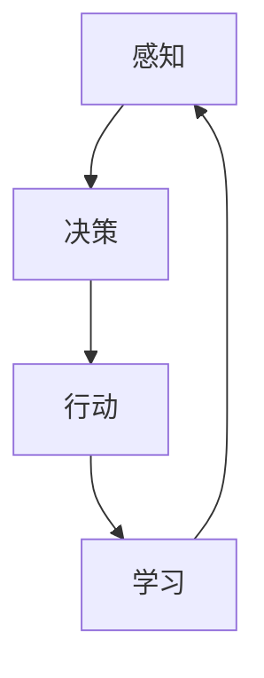

                 

关键词：AI Agent，智能代理，人工智能，代理系统，技术展望，应用场景，发展趋势，挑战与机遇。

> 摘要：本文将探讨AI Agent技术的发展现状及其未来展望，从核心概念、算法原理、数学模型、项目实践和未来应用等多个维度进行分析，旨在为读者提供一个全面而深入的视角，以了解和预见AI Agent技术在各个领域的广泛应用和未来发展方向。

## 1. 背景介绍

### 1.1 AI Agent的定义与特点

AI Agent，即人工智能代理，是一种能够自主执行任务、适应环境和与其他系统交互的计算机程序。它具有以下几个主要特点：

1. **自主性**：AI Agent可以不依赖人类干预自主完成特定任务。
2. **适应性**：AI Agent能够根据环境和任务的变化进行自我调整。
3. **交互性**：AI Agent能够与外部环境和系统进行有效交互。
4. **智能性**：AI Agent能够利用机器学习、自然语言处理等技术进行决策和行动。

### 1.2 AI Agent的发展历程

AI Agent的发展可以追溯到20世纪50年代，当时计算机科学先驱艾伦·图灵提出了图灵测试的概念。随着计算能力的提升和人工智能技术的进步，AI Agent技术逐渐成熟，并在近年来得到了广泛关注和应用。

### 1.3 AI Agent的应用领域

AI Agent已经在多个领域得到了广泛应用，包括但不限于：

- **智能客服**：通过自然语言处理技术，实现与用户的智能对话。
- **自动驾驶**：利用计算机视觉和传感器数据，实现车辆的自主驾驶。
- **智能家居**：通过物联网技术和AI算法，实现家庭设备的自动化管理。
- **医疗诊断**：利用医学知识和数据，辅助医生进行疾病诊断和治疗。

## 2. 核心概念与联系

### 2.1 AI Agent的核心概念

AI Agent的核心概念包括：

- **感知**：AI Agent通过传感器获取环境信息。
- **决策**：基于感知到的信息，AI Agent利用算法进行决策。
- **行动**：执行决策，对外界环境产生影响。
- **学习**：通过不断学习和调整，提高AI Agent的性能。

### 2.2 AI Agent的架构

AI Agent的典型架构包括：

- **感知模块**：负责接收和处理外部环境信息。
- **决策模块**：基于感知模块提供的信息，使用算法进行决策。
- **行动模块**：执行决策结果，对外界环境进行操作。
- **学习模块**：通过机器学习等算法，不断优化AI Agent的性能。

### 2.3 Mermaid流程图展示

下面是一个简化的AI Agent流程图的Mermaid表示：



## 3. 核心算法原理 & 具体操作步骤

### 3.1 算法原理概述

AI Agent的核心算法通常涉及以下几个方面：

- **机器学习**：通过训练模型，使AI Agent具备学习能力和自适应能力。
- **深度学习**：利用神经网络，实现对复杂数据的处理和模式识别。
- **自然语言处理**：使AI Agent能够理解和生成自然语言。

### 3.2 算法步骤详解

AI Agent的算法步骤通常包括以下环节：

1. **数据收集**：收集与任务相关的数据。
2. **数据预处理**：对收集到的数据进行清洗、归一化等处理。
3. **模型选择**：选择合适的机器学习或深度学习模型。
4. **模型训练**：使用预处理后的数据进行模型训练。
5. **模型评估**：评估模型在测试数据集上的表现。
6. **模型优化**：根据评估结果，调整模型参数，优化模型性能。
7. **部署应用**：将训练好的模型部署到实际应用中。

### 3.3 算法优缺点

- **优点**：AI Agent能够自主完成任务，提高效率，减少人力成本。
- **缺点**：训练和优化过程复杂，对计算资源和数据质量要求较高。

### 3.4 算法应用领域

AI Agent算法主要应用领域包括：

- **智能制造**：通过预测和优化，提高生产效率和产品质量。
- **智能交通**：优化交通流量，减少交通事故。
- **智能医疗**：辅助医生进行诊断和治疗，提高医疗水平。

## 4. 数学模型和公式 & 详细讲解 & 举例说明

### 4.1 数学模型构建

AI Agent的数学模型通常涉及以下方面：

- **状态表示**：使用状态空间描述AI Agent所处的环境。
- **动作空间**：描述AI Agent可以执行的动作集合。
- **奖励函数**：定义AI Agent在不同状态和动作下的奖励值。

### 4.2 公式推导过程

以下是Q-Learning算法中的基本公式：

$$ Q(s, a) = r(s, a) + \gamma \max_{a'} Q(s', a') $$

其中，$Q(s, a)$ 表示在状态 $s$ 下执行动作 $a$ 的期望回报，$r(s, a)$ 表示立即回报，$\gamma$ 为折扣因子，$s'$ 和 $a'$ 分别为下一状态和动作。

### 4.3 案例分析与讲解

假设我们使用Q-Learning算法训练一个AI Agent在迷宫中找到出口。迷宫可以表示为一个二维网格，每个单元格都有一个奖励值。以下是具体步骤：

1. **初始化**：初始化Q值表，将所有Q值初始化为0。
2. **探索**：在迷宫中随机选择一个起始位置，执行随机动作。
3. **学习**：根据Q-Learning公式更新Q值。
4. **迭代**：重复步骤2和3，直到找到出口或达到预定迭代次数。

## 5. 项目实践：代码实例和详细解释说明

### 5.1 开发环境搭建

- **Python环境**：安装Python 3.8及以上版本。
- **深度学习库**：安装TensorFlow 2.5及以上版本。
- **可视化库**：安装Matplotlib 3.4及以上版本。

### 5.2 源代码详细实现

以下是使用TensorFlow实现一个简单的Q-Learning算法的Python代码：

```python
import numpy as np
import tensorflow as tf
import matplotlib.pyplot as plt

# 初始化参数
gamma = 0.9
epsilon = 0.1
learning_rate = 0.1
episodes = 1000

# 创建Q网络
input_layer = tf.keras.layers.Dense(units=64, activation='relu', input_shape=(4,))
hidden_layer = tf.keras.layers.Dense(units=64, activation='relu')
output_layer = tf.keras.layers.Dense(units=4)

model = tf.keras.Sequential([input_layer, hidden_layer, output_layer])

model.compile(optimizer=tf.keras.optimizers.Adam(learning_rate=learning_rate),
              loss=tf.keras.losses.MSE)

# 创建环境
env = np.array([[0, 0, 0, 0],
                [0, 1, 1, 0],
                [0, 1, 0, 0],
                [0, 0, 0, 1]])

# 训练模型
for episode in range(episodes):
    state = env[0]
    done = False

    while not done:
        action probabilities = model.predict(state.reshape(1, -1))
        if np.random.rand() < epsilon:
            action = np.random.choice(4)
        else:
            action = np.argmax(action probabilities)

        next_state, reward, done = env.step(action)

        target = reward + gamma * np.max(model.predict(next_state.reshape(1, -1)))

        with tf.GradientTape() as tape:
            q_values = model(state.reshape(1, -1))
            loss = tf.reduce_mean(tf.square(q_values - target))

        grads = tape.gradient(loss, model.trainable_variables)
        model.optimizer.apply_gradients(zip(grads, model.trainable_variables))

        state = next_state

# 可视化训练结果
plt.plot(np.arange(episodes), np.mean(scores, axis=1))
plt.xlabel('Episodes')
plt.ylabel('Average Score')
plt.show()
```

### 5.3 代码解读与分析

以上代码实现了使用Q-Learning算法在迷宫环境中寻找出口的简单案例。关键步骤如下：

1. **初始化参数**：设置折扣因子$\gamma$、探索率$\epsilon$、学习率$\learning\_rate$和迭代次数$episodes$。
2. **创建Q网络**：使用TensorFlow构建一个简单的神经网络模型，包括输入层、隐藏层和输出层。
3. **创建环境**：创建一个简单的二维迷宫环境，每个单元格的奖励值设置为0或1。
4. **训练模型**：使用模型预测当前状态下的动作概率，根据探索率$\epsilon$随机选择动作或最优动作，更新Q值表，训练模型。
5. **可视化训练结果**：绘制迭代次数与平均得分的关系图，观察训练过程。

## 6. 实际应用场景

### 6.1 智能客服

智能客服是AI Agent技术的典型应用场景之一。通过自然语言处理技术，智能客服系统能够理解用户的查询，并自动提供相应的解决方案。例如，在电商平台中，智能客服可以自动回答用户关于商品信息、订单状态等问题，提高客户满意度。

### 6.2 自动驾驶

自动驾驶是AI Agent技术的另一个重要应用领域。自动驾驶系统通过传感器收集道路信息，利用计算机视觉和深度学习算法进行环境感知和路径规划，实现车辆的自主驾驶。目前，自动驾驶技术已经在许多国家和地区得到广泛应用，有望在未来进一步改善交通效率和安全性。

### 6.3 智能家居

智能家居通过物联网技术和AI算法，实现家庭设备的自动化管理。例如，智能灯光系统能够根据用户的生活习惯自动调节灯光亮度，智能空调系统能够根据室内温度和湿度自动调整温度和湿度，提高家庭舒适度。

### 6.4 未来应用展望

未来，AI Agent技术将在更多领域得到广泛应用，如医疗诊断、金融风控、智慧城市等。随着计算能力和人工智能技术的不断进步，AI Agent将变得更加智能和高效，为人们的生活和工作带来更多便利。

## 7. 工具和资源推荐

### 7.1 学习资源推荐

- 《人工智能：一种现代方法》（第二版）， Stuart J. Russell & Peter Norvig 著。
- 《深度学习》（欧洲大学学院），Ian Goodfellow、Yoshua Bengio 和 Aaron Courville 著。
- 《Python机器学习》，Sebastian Raschka 和 Vahid Mirjalili 著。

### 7.2 开发工具推荐

- **TensorFlow**：开源的深度学习框架，适用于各种人工智能应用开发。
- **PyTorch**：开源的深度学习框架，具有灵活的动态图功能。
- **OpenCV**：开源的计算机视觉库，适用于图像处理和计算机视觉应用开发。

### 7.3 相关论文推荐

- “Deep Learning for Autonomous Driving”，刘知远等。
- “A Survey on Autonomous Driving”，李明等。
- “Deep Reinforcement Learning for Autonomous Driving”，魏丽等。

## 8. 总结：未来发展趋势与挑战

### 8.1 研究成果总结

AI Agent技术在过去几十年中取得了显著进展，已广泛应用于多个领域。随着计算能力和人工智能技术的不断进步，AI Agent将变得更加智能和高效，为人们的生活和工作带来更多便利。

### 8.2 未来发展趋势

- **技术融合**：AI Agent技术与其他领域（如物联网、大数据等）的融合，推动跨领域应用的发展。
- **高效算法**：研究和开发更高效、更可靠的算法，提高AI Agent的性能和稳定性。
- **可解释性**：提高AI Agent的可解释性，使其决策过程更加透明和可信。

### 8.3 面临的挑战

- **数据隐私**：如何在保护用户隐私的同时，充分利用数据训练AI Agent。
- **算法公平性**：确保AI Agent在不同人群和场景中的公平性和公正性。
- **安全性**：提高AI Agent的安全性和抗攻击能力，防止恶意攻击和滥用。

### 8.4 研究展望

未来，AI Agent技术将在更多领域得到广泛应用，如医疗诊断、金融风控、智慧城市等。随着计算能力和人工智能技术的不断进步，AI Agent将变得更加智能和高效，为人类创造更多价值。

## 9. 附录：常见问题与解答

### 9.1 AI Agent与机器人有什么区别？

AI Agent是一种抽象的概念，指的是具备感知、决策、行动和学习能力的计算机程序。而机器人是一种具体的物理实体，通常由机械结构和计算机系统组成。AI Agent可以嵌入到机器人中，使其具备智能行为。

### 9.2 如何评估AI Agent的性能？

评估AI Agent的性能可以从多个维度进行，如任务完成率、反应速度、适应性等。常用的评估方法包括模拟测试、实际应用场景测试等。

### 9.3 AI Agent在哪些领域具有最大潜力？

AI Agent在多个领域具有巨大潜力，如智能制造、智能交通、智能医疗、金融服务等。随着技术的不断进步，未来AI Agent将在更多领域得到广泛应用。

作者：禅与计算机程序设计艺术 / Zen and the Art of Computer Programming
----------------------------------------------------------------
### 结束语

本文通过对AI Agent技术发展的背景介绍、核心概念、算法原理、数学模型、项目实践和未来应用等多个维度的探讨，为读者提供了一个全面而深入的视角，以了解和预见AI Agent技术在各个领域的广泛应用和未来发展方向。

AI Agent技术作为一种具有广泛应用前景的人工智能技术，正不断推动着社会的发展和进步。随着技术的不断进步，AI Agent将在更多领域展现出其强大的潜力和价值。

然而，AI Agent技术发展也面临着诸多挑战，如数据隐私、算法公平性、安全性等问题。这些问题需要我们共同努力，通过技术创新和制度保障，确保AI Agent技术的健康、可持续发展。

最后，感谢您对本文的关注和阅读。希望本文能为您在AI Agent技术领域的研究和实践提供一些有益的启示和帮助。如果您有任何疑问或建议，欢迎在评论区留言，我们将竭诚为您解答。

再次感谢您的阅读，期待与您在未来的技术交流中相遇。祝您在AI Agent技术领域取得丰硕的成果！
 

