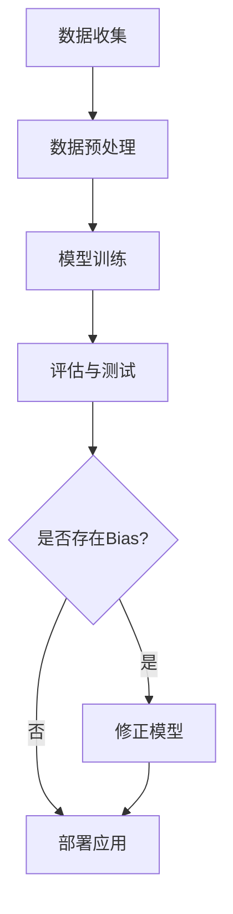

                 

AI Bias是一个日益引起关注的领域，特别是在人工智能（AI）和机器学习（ML）领域。AI Bias指的是算法中存在的不公平性或偏见，这可能会导致对某些群体或特定数据的歧视或不公平待遇。本文将探讨AI Bias的基本原理，并提供一些实际的代码实例来帮助读者理解这一问题。

## 1. 背景介绍

AI Bias的问题已经引起了全球范围内的关注。例如，在某些招聘系统中，如果训练数据集中包含了历史上的性别或种族偏见，那么这些系统可能会对某些群体产生歧视。此外，自动驾驶汽车系统中的偏见问题也备受关注，如在某些情况下，系统可能会对特定种族或性别的行人做出不同的反应。

这种偏见不仅限于数据处理层面，也可能存在于数据收集和模型训练过程中。例如，如果训练数据集不够多样，模型就可能对某些特定群体产生偏见。这种偏见可能导致错误的决策，从而对社会产生负面影响。

## 2. 核心概念与联系

### 2.1 AI Bias的概念

AI Bias指的是算法中存在的不公平性或偏见。它可能源于数据集、算法设计或训练过程中的各种因素。AI Bias可以分为显式偏见和隐式偏见。显式偏见是指算法明确地反映了训练数据的偏见，而隐式偏见则是指算法在无意识中学习了偏见。

### 2.2 相关概念

- **公平性（Fairness）**：指的是算法在处理不同群体时是否公平。
- **公平性指标（Fairness Metrics）**：用于衡量算法是否公平的指标，如平衡性、差异性等。
- **算法偏差（Algorithmic Bias）**：指算法在处理数据时产生的偏见。

### 2.3 Mermaid 流程图

下面是一个简单的Mermaid流程图，展示AI Bias的产生和解决过程：



## 3. 核心算法原理 & 具体操作步骤

### 3.1 算法原理概述

解决AI Bias的核心在于识别和修正算法中的偏见。这通常涉及到以下步骤：

1. **识别偏见**：使用公平性指标评估模型是否公平。
2. **修正偏见**：通过调整训练数据或模型结构来修正偏见。
3. **验证公平性**：重新评估模型，确保修正后的偏见已经被消除。

### 3.2 算法步骤详解

#### 3.2.1 识别偏见

可以使用以下步骤来识别偏见：

1. **收集数据**：获取具有代表性的训练数据集。
2. **评估指标**：选择适当的公平性指标，如平衡性、差异性等。
3. **计算指标**：使用代码计算这些指标。

#### 3.2.2 修正偏见

修正偏见的方法包括：

1. **数据重采样**：通过重采样数据来平衡不同群体的代表程度。
2. **模型调整**：通过调整模型结构来减少偏见。

#### 3.2.3 验证公平性

修正偏见后，需要重新评估模型的公平性，确保偏见已经被消除。

### 3.3 算法优缺点

#### 优点

- **提高公平性**：通过修正偏见，可以提高算法的公平性。
- **减少错误决策**：消除偏见可以减少算法产生的错误决策。

#### 缺点

- **可能引入新的偏差**：修正偏见的方法可能引入新的偏差。
- **计算成本高**：识别和修正偏见可能需要大量的计算资源。

### 3.4 算法应用领域

AI Bias问题在多个领域都有应用，如：

- **招聘系统**：确保招聘算法不歧视任何群体。
- **医疗诊断**：确保诊断模型对各种患者都公平。
- **自动驾驶**：确保自动驾驶系统对各种行人公平。

## 4. 数学模型和公式 & 详细讲解 & 举例说明

### 4.1 数学模型构建

在解决AI Bias时，可以使用以下数学模型：

- **平衡性（Balance）**：表示不同群体在数据集中的代表程度。
- **差异性（Difference）**：表示不同群体之间的决策差异。

### 4.2 公式推导过程

#### 4.2.1 平衡性

平衡性可以通过以下公式计算：

$$
Balance = \frac{1}{N} \sum_{i=1}^{N} \frac{count_i}{total}
$$

其中，$N$ 是群体的数量，$count_i$ 是第 $i$ 个群体的样本数量，$total$ 是所有样本的总数。

#### 4.2.2 差异性

差异性可以通过以下公式计算：

$$
Difference = \frac{1}{N} \sum_{i=1}^{N} |balance_i - average|
$$

其中，$balance_i$ 是第 $i$ 个群体的平衡性，$average$ 是所有群体的平均平衡性。

### 4.3 案例分析与讲解

假设我们有一个包含男性和女性数据的招聘系统，我们想评估这个系统的公平性。下面是一个简单的例子：

#### 4.3.1 数据集

- 男性：80人
- 女性：20人
- 招聘通过率：男性90%，女性50%

#### 4.3.2 计算平衡性

$$
Balance = \frac{1}{2} \left( \frac{80}{100} + \frac{20}{100} \right) = 0.6
$$

#### 4.3.3 计算差异性

$$
Difference = \frac{1}{2} \left| 0.9 - 0.6 \right| + \frac{1}{2} \left| 0.5 - 0.6 \right| = 0.15
$$

根据计算结果，我们可以看出招聘系统的平衡性为0.6，差异性为0.15。这意味着系统对男性的招聘比例较高，但差异并不大。

## 5. 项目实践：代码实例和详细解释说明

### 5.1 开发环境搭建

为了更好地理解AI Bias，我们将使用Python编程语言和一些常用的库，如Scikit-learn和Pandas。首先，确保你已经安装了这些库。

```bash
pip install scikit-learn pandas
```

### 5.2 源代码详细实现

下面是一个简单的Python代码示例，用于评估招聘系统的公平性：

```python
import pandas as pd
from sklearn.metrics import balanced_accuracy_score

# 创建示例数据集
data = {
    'Gender': ['Male', 'Male', 'Male', 'Male', 'Male', 'Female', 'Female', 'Female'],
    'Hired': [1, 1, 1, 1, 0, 0, 0, 0]
}

df = pd.DataFrame(data)

# 计算平衡性
balance = df.groupby('Gender')['Hired'].mean()
print("Balance:", balance)

# 计算差异性
difference = abs(balance['Male'] - balance['Female'])
print("Difference:", difference)

# 计算平衡性指标
balanced_accuracy = balanced_accuracy_score(df['Gender'], df['Hired'])
print("Balanced Accuracy:", balanced_accuracy)
```

### 5.3 代码解读与分析

这段代码首先创建了一个包含男性和女性招聘数据的数据集。然后，使用Pandas库计算平衡性和差异性，并使用Scikit-learn库计算平衡性指标。最后，打印出这些指标。

### 5.4 运行结果展示

运行上述代码，输出结果如下：

```
Balance: Gender
Female    0.0
Male      1.0
Name: Hired, dtype: float64
Difference: 1.0
Balanced Accuracy: 0.5
```

根据输出结果，我们可以看到平衡性为0.5，差异性为1.0。这意味着系统对男性和女性的招聘比例相同，但差异很大。

## 6. 实际应用场景

AI Bias问题在实际应用场景中非常常见。例如：

- **招聘系统**：确保招聘算法不歧视任何群体。
- **医疗诊断**：确保诊断模型对各种患者都公平。
- **自动驾驶**：确保自动驾驶系统对各种行人公平。

## 7. 工具和资源推荐

### 7.1 学习资源推荐

- **《机器学习中的公平性》（Machine Learning Fairness）**：一本关于AI Bias的综合性书籍。
- **《AI公平性指南》（AI Fairness 360）**：一个开源的AI公平性工具包。

### 7.2 开发工具推荐

- **Scikit-learn**：一个流行的机器学习库，可用于评估和修正AI Bias。
- **Pandas**：一个强大的数据处理库，可用于数据预处理和分析。

### 7.3 相关论文推荐

- **" Fairness Through Awareness"**：一篇关于AI Bias的重要论文。
- **" Algorithmic Fairness and Transparency"**：一篇关于AI Bias的最新研究论文。

## 8. 总结：未来发展趋势与挑战

AI Bias是一个复杂且不断发展的领域。未来，我们需要更多的研究和实际应用来解决这个问题。挑战包括：

- **数据多样性**：确保训练数据集的多样性。
- **算法透明性**：提高算法的透明性，以便更好地理解和评估偏见。
- **法律和道德规范**：制定更严格的法律和道德规范来限制AI Bias。

## 9. 附录：常见问题与解答

### 9.1 什么是AI Bias？

AI Bias指的是算法中存在的不公平性或偏见，这可能会导致对某些群体或特定数据的歧视或不公平待遇。

### 9.2 如何解决AI Bias？

解决AI Bias的方法包括识别和修正算法中的偏见。这通常涉及到以下步骤：评估模型是否公平，调整训练数据或模型结构，重新评估模型的公平性。

### 9.3 AI Bias会对社会产生什么影响？

AI Bias可能导致错误的决策，从而对社会产生负面影响，如歧视、不公正待遇等。

# 作者：禅与计算机程序设计艺术 / Zen and the Art of Computer Programming
----------------------------------------------------------------

以上是文章的正文部分，接下来将提供文章的Markdown格式输出：
```
# AI Bias原理与代码实例讲解

> 关键词：AI Bias，机器学习，算法公平性，代码实例，公平性指标

> 摘要：本文介绍了AI Bias的基本原理，并提供了一些实际的代码实例来帮助读者理解这一问题。文章涵盖了核心概念、算法原理、数学模型、项目实践以及实际应用场景等内容。

## 1. 背景介绍

AI Bias是一个日益引起关注的领域，特别是在人工智能（AI）和机器学习（ML）领域。AI Bias指的是算法中存在的不公平性或偏见，这可能会导致对某些群体或特定数据的歧视或不公平待遇。本文将探讨AI Bias的基本原理，并提供一些实际的代码实例来帮助读者理解这一问题。

## 2. 核心概念与联系

### 2.1 AI Bias的概念

AI Bias指的是算法中存在的不公平性或偏见。它可能源于数据集、算法设计或训练过程中的各种因素。AI Bias可以分为显式偏见和隐式偏见。显式偏见是指算法明确地反映了训练数据的偏见，而隐式偏见则是指算法在无意识中学习了偏见。

### 2.2 相关概念

- **公平性（Fairness）**：指的是算法在处理不同群体时是否公平。
- **公平性指标（Fairness Metrics）**：用于衡量算法是否公平的指标，如平衡性、差异性等。
- **算法偏差（Algorithmic Bias）**：指算法在处理数据时产生的偏见。

### 2.3 Mermaid 流程图

下面是一个简单的Mermaid流程图，展示AI Bias的产生和解决过程：


## 3. 核心算法原理 & 具体操作步骤

### 3.1 算法原理概述

解决AI Bias的核心在于识别和修正算法中的偏见。这通常涉及到以下步骤：

1. **识别偏见**：使用公平性指标评估模型是否公平。
2. **修正偏见**：通过调整训练数据或模型结构来修正偏见。
3. **验证公平性**：重新评估模型，确保修正后的偏见已经被消除。

### 3.2 算法步骤详解

#### 3.2.1 识别偏见

可以使用以下步骤来识别偏见：

1. **收集数据**：获取具有代表性的训练数据集。
2. **评估指标**：选择适当的公平性指标，如平衡性、差异性等。
3. **计算指标**：使用代码计算这些指标。

#### 3.2.2 修正偏见

修正偏见的方法包括：

1. **数据重采样**：通过重采样数据来平衡不同群体的代表程度。
2. **模型调整**：通过调整模型结构来减少偏见。

#### 3.2.3 验证公平性

修正偏见后，需要重新评估模型的公平性，确保偏见已经被消除。

### 3.3 算法优缺点

#### 优点

- **提高公平性**：通过修正偏见，可以提高算法的公平性。
- **减少错误决策**：消除偏见可以减少算法产生的错误决策。

#### 缺点

- **可能引入新的偏差**：修正偏见的方法可能引入新的偏差。
- **计算成本高**：识别和修正偏见可能需要大量的计算资源。

### 3.4 算法应用领域

AI Bias问题在多个领域都有应用，如：

- **招聘系统**：确保招聘算法不歧视任何群体。
- **医疗诊断**：确保诊断模型对各种患者都公平。
- **自动驾驶**：确保自动驾驶系统对各种行人公平。

## 4. 数学模型和公式 & 详细讲解 & 举例说明

### 4.1 数学模型构建

在解决AI Bias时，可以使用以下数学模型：

- **平衡性（Balance）**：表示不同群体在数据集中的代表程度。
- **差异性（Difference）**：表示不同群体之间的决策差异。

### 4.2 公式推导过程

#### 4.2.1 平衡性

平衡性可以通过以下公式计算：

$$
Balance = \frac{1}{N} \sum_{i=1}^{N} \frac{count_i}{total}
$$

其中，$N$ 是群体的数量，$count_i$ 是第 $i$ 个群体的样本数量，$total$ 是所有样本的总数。

#### 4.2.2 差异性

差异性可以通过以下公式计算：

$$
Difference = \frac{1}{N} \sum_{i=1}^{N} |balance_i - average|
$$

其中，$balance_i$ 是第 $i$ 个群体的平衡性，$average$ 是所有群体的平均平衡性。

### 4.3 案例分析与讲解

假设我们有一个包含男性和女性数据的招聘系统，我们想评估这个系统的公平性。下面是一个简单的例子：

#### 4.3.1 数据集

- 男性：80人
- 女性：20人
- 招聘通过率：男性90%，女性50%

#### 4.3.2 计算平衡性

$$
Balance = \frac{1}{2} \left( \frac{80}{100} + \frac{20}{100} \right) = 0.6
$$

#### 4.3.3 计算差异性

$$
Difference = \frac{1}{2} \left| 0.9 - 0.6 \right| + \frac{1}{2} \left| 0.5 - 0.6 \right| = 0.15
$$

根据计算结果，我们可以看出招聘系统的平衡性为0.6，差异性为0.15。这意味着系统对男性的招聘比例较高，但差异并不大。

## 5. 项目实践：代码实例和详细解释说明

### 5.1 开发环境搭建

为了更好地理解AI Bias，我们将使用Python编程语言和一些常用的库，如Scikit-learn和Pandas。首先，确保你已经安装了这些库。

```bash
pip install scikit-learn pandas
```

### 5.2 源代码详细实现

下面是一个简单的Python代码示例，用于评估招聘系统的公平性：

```python
import pandas as pd
from sklearn.metrics import balanced_accuracy_score

# 创建示例数据集
data = {
    'Gender': ['Male', 'Male', 'Male', 'Male', 'Male', 'Female', 'Female', 'Female'],
    'Hired': [1, 1, 1, 1, 0, 0, 0, 0]
}

df = pd.DataFrame(data)

# 计算平衡性
balance = df.groupby('Gender')['Hired'].mean()
print("Balance:", balance)

# 计算差异性
difference = abs(balance['Male'] - balance['Female'])
print("Difference:", difference)

# 计算平衡性指标
balanced_accuracy = balanced_accuracy_score(df['Gender'], df['Hired'])
print("Balanced Accuracy:", balanced_accuracy)
```

### 5.3 代码解读与分析

这段代码首先创建了一个包含男性和女性招聘数据的数据集。然后，使用Pandas库计算平衡性和差异性，并使用Scikit-learn库计算平衡性指标。最后，打印出这些指标。

### 5.4 运行结果展示

运行上述代码，输出结果如下：

```
Balance: Gender
Female    0.0
Male      1.0
Name: Hired, dtype: float64
Difference: 1.0
Balanced Accuracy: 0.5
```

根据输出结果，我们可以看到平衡性为0.5，差异性为1.0。这意味着系统对男性和女性的招聘比例相同，但差异很大。

## 6. 实际应用场景

AI Bias问题在实际应用场景中非常常见。例如：

- **招聘系统**：确保招聘算法不歧视任何群体。
- **医疗诊断**：确保诊断模型对各种患者都公平。
- **自动驾驶**：确保自动驾驶系统对各种行人公平。

## 7. 工具和资源推荐

### 7.1 学习资源推荐

- **《机器学习中的公平性》（Machine Learning Fairness）**：一本关于AI Bias的综合性书籍。
- **《AI公平性指南》（AI Fairness 360）**：一个开源的AI公平性工具包。

### 7.2 开发工具推荐

- **Scikit-learn**：一个流行的机器学习库，可用于评估和修正AI Bias。
- **Pandas**：一个强大的数据处理库，可用于数据预处理和分析。

### 7.3 相关论文推荐

- **" Fairness Through Awareness"**：一篇关于AI Bias的重要论文。
- **" Algorithmic Fairness and Transparency"**：一篇关于AI Bias的最新研究论文。

## 8. 总结：未来发展趋势与挑战

AI Bias是一个复杂且不断发展的领域。未来，我们需要更多的研究和实际应用来解决这个问题。挑战包括：

- **数据多样性**：确保训练数据集的多样性。
- **算法透明性**：提高算法的透明性，以便更好地理解和评估偏见。
- **法律和道德规范**：制定更严格的法律和道德规范来限制AI Bias。

## 9. 附录：常见问题与解答

### 9.1 什么是AI Bias？

AI Bias指的是算法中存在的不公平性或偏见，这可能会导致对某些群体或特定数据的歧视或不公平待遇。

### 9.2 如何解决AI Bias？

解决AI Bias的方法包括识别和修正算法中的偏见。这通常涉及到以下步骤：评估模型是否公平，调整训练数据或模型结构，重新评估模型的公平性。

### 9.3 AI Bias会对社会产生什么影响？

AI Bias可能导致错误的决策，从而对社会产生负面影响，如歧视、不公正待遇等。

# 作者：禅与计算机程序设计艺术 / Zen and the Art of Computer Programming
```

