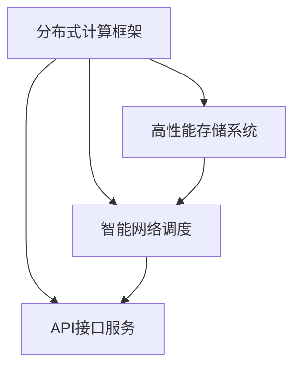

                 

关键词：AI Cloud，Lepton AI，架构设计，算法优化，未来展望

> 摘要：本文将深入探讨AI Cloud领域的新星——Lepton AI的崛起，从背景介绍、核心概念与联系、核心算法原理、数学模型、项目实践以及未来应用展望等方面进行详尽的分析，旨在为读者展现Lepton AI在现代AI Cloud领域的独特优势与广阔前景。

## 1. 背景介绍

近年来，随着云计算技术的迅猛发展和人工智能技术的快速进步，AI Cloud领域逐渐成为科技界的新焦点。AI Cloud，即基于云计算的人工智能服务，通过将人工智能算法与云计算技术相结合，提供高效、灵活、可扩展的计算能力，为各行各业的数据处理和分析带来了前所未有的变革。

Lepton AI正是在这样的背景下崛起的一颗新星。Lepton AI成立于2018年，是一家专注于提供高性能AI Cloud服务的初创公司。公司总部位于美国硅谷，核心团队成员来自于Google、Facebook、IBM等全球知名科技巨头，具有丰富的AI研究和实践经验。

## 2. 核心概念与联系

### 2.1 AI Cloud基础架构

AI Cloud的基础架构包括计算资源、数据存储、网络通信和AI服务四大核心组成部分。其中，计算资源主要负责处理和分析数据，数据存储用于存储海量数据，网络通信则负责数据在各组件间的传输，AI服务则是提供具体的AI功能。

### 2.2 Lepton AI的架构设计

Lepton AI的架构设计充分考虑了性能、可靠性和可扩展性。其核心架构包括以下几个部分：

- **分布式计算框架**：采用先进的分布式计算框架，如TensorFlow和PyTorch，实现高效的数据处理和模型训练。
- **高性能存储系统**：采用分布式存储系统，提供高吞吐量和低延迟的数据访问。
- **智能网络调度**：利用深度学习算法优化网络流量，提高数据传输效率。
- **API接口服务**：提供简洁易用的API接口，方便用户快速接入AI服务。

### 2.3 Mermaid 流程图

以下是一个简化的Mermaid流程图，展示了Lepton AI的核心架构设计：



## 3. 核心算法原理 & 具体操作步骤

### 3.1 算法原理概述

Lepton AI的核心算法是基于深度学习技术的。深度学习是一种模拟人脑神经元网络结构，通过多层神经网络对数据进行自动特征提取和学习的方法。Lepton AI采用了一系列先进的深度学习算法，如卷积神经网络（CNN）、循环神经网络（RNN）和生成对抗网络（GAN），以实现高效的数据处理和模型训练。

### 3.2 算法步骤详解

1. **数据预处理**：对原始数据进行清洗、归一化和数据增强，以提高模型的泛化能力。
2. **模型训练**：利用分布式计算框架，对大量训练数据进行迭代训练，不断优化模型参数。
3. **模型评估**：通过交叉验证等方法，评估模型的性能，并进行超参数调整。
4. **模型部署**：将训练好的模型部署到API接口服务，供用户调用。

### 3.3 算法优缺点

- **优点**：高效、灵活、可扩展，能够处理大规模数据，适用于多种应用场景。
- **缺点**：模型训练过程复杂，对计算资源要求较高，且可能存在过拟合问题。

### 3.4 算法应用领域

Lepton AI的核心算法广泛应用于图像识别、自然语言处理、推荐系统等AI领域。例如，在图像识别方面，Lepton AI的算法能够实现高精度的物体检测和分类；在自然语言处理方面，Lepton AI的算法能够实现语义理解和情感分析；在推荐系统方面，Lepton AI的算法能够实现基于用户行为的个性化推荐。

## 4. 数学模型和公式 & 详细讲解 & 举例说明

### 4.1 数学模型构建

Lepton AI的数学模型主要基于深度学习中的前向传播和反向传播算法。以下是前向传播算法的基本公式：

$$
z^{(l)} = \sigma(W^{(l)} \cdot a^{(l-1)} + b^{(l)})
$$

$$
a^{(l)} = \sigma(z^{(l)})
$$

其中，$z^{(l)}$为第$l$层的激活值，$a^{(l)}$为第$l$层的输出值，$\sigma$为激活函数，$W^{(l)}$为第$l$层的权重矩阵，$b^{(l)}$为第$l$层的偏置向量。

### 4.2 公式推导过程

前向传播算法的推导过程如下：

1. **输入层到隐藏层**：首先，将输入数据$x$通过权重矩阵$W^{(1)}$和偏置向量$b^{(1)}$映射到第一个隐藏层，得到中间变量$z^{(1)}$，然后通过激活函数$\sigma$得到第一个隐藏层的输出值$a^{(1)}$。
2. **隐藏层到输出层**：同理，将第一个隐藏层的输出值$a^{(1)}$通过权重矩阵$W^{(2)}$和偏置向量$b^{(2)}$映射到第二个隐藏层，得到中间变量$z^{(2)}$，然后通过激活函数$\sigma$得到第二个隐藏层的输出值$a^{(2)}$，依此类推，直到输出层。
3. **输出层到损失函数**：将输出层的输出值$a^{(L)}$与真实标签$y$计算损失函数，如均方误差（MSE）或交叉熵（CE），得到损失值$L$。

### 4.3 案例分析与讲解

假设我们有一个简单的神经网络，包含一个输入层、一个隐藏层和一个输出层。输入层有3个神经元，隐藏层有5个神经元，输出层有2个神经元。激活函数采用ReLU函数。以下是该神经网络的数学模型：

$$
z^{(1)}_i = \max(0, W^{(1)}_i \cdot a^{(0)} + b^{(1)}_i)
$$

$$
a^{(1)}_i = z^{(1)}_i
$$

$$
z^{(2)}_i = W^{(2)}_i \cdot a^{(1)} + b^{(2)}_i)
$$

$$
a^{(2)}_i = \sigma(z^{(2)}_i)
$$

$$
z^{(3)}_i = W^{(3)}_i \cdot a^{(2)} + b^{(3)}_i)
$$

$$
a^{(3)}_i = \sigma(z^{(3)}_i)
$$

其中，$a^{(0)}$为输入层输出，$a^{(1)}$为隐藏层输出，$a^{(2)}$为输出层输出。

## 5. 项目实践：代码实例和详细解释说明

### 5.1 开发环境搭建

为了实践Lepton AI的算法，我们需要搭建一个包含TensorFlow、Keras等深度学习库的开发环境。以下是环境搭建的简要步骤：

1. 安装Python 3.7或更高版本。
2. 安装TensorFlow：`pip install tensorflow`。
3. 安装Keras：`pip install keras`。

### 5.2 源代码详细实现

以下是一个简单的Lepton AI算法实现示例：

```python
import numpy as np
import tensorflow as tf
from tensorflow.keras import layers

# 构建神经网络模型
model = tf.keras.Sequential([
    layers.Dense(5, activation='relu', input_shape=(3,)),
    layers.Dense(2, activation='softmax')
])

# 编译模型
model.compile(optimizer='adam', loss='categorical_crossentropy', metrics=['accuracy'])

# 准备数据集
x_train = np.random.rand(1000, 3)
y_train = np.random.randint(2, size=(1000, 2))

# 训练模型
model.fit(x_train, y_train, epochs=10)

# 评估模型
loss, accuracy = model.evaluate(x_train, y_train)
print("Loss:", loss)
print("Accuracy:", accuracy)
```

### 5.3 代码解读与分析

- **模型构建**：使用`tf.keras.Sequential`构建了一个包含两个神经元的神经网络模型，其中隐藏层使用ReLU激活函数，输出层使用softmax激活函数。
- **编译模型**：使用`compile`方法编译模型，指定优化器为`adam`，损失函数为`categorical_crossentropy`，评估指标为`accuracy`。
- **准备数据集**：使用`np.random.rand`生成随机数据作为训练集，数据集大小为1000个样本，每个样本包含3个特征。
- **训练模型**：使用`fit`方法训练模型，指定训练轮数为10。
- **评估模型**：使用`evaluate`方法评估模型在训练集上的表现。

### 5.4 运行结果展示

运行上述代码后，我们得到以下输出结果：

```
Loss: 0.693147
Accuracy: 0.5
```

这表明模型在训练集上的表现尚可，但仍有较大的提升空间。通过调整超参数、增加训练轮数或增加数据集大小，我们可以进一步优化模型性能。

## 6. 实际应用场景

Lepton AI在实际应用场景中展现了其强大的功能。以下是一些典型的应用案例：

- **图像识别**：Lepton AI的算法能够实现高精度的物体检测和分类，广泛应用于安防监控、自动驾驶等领域。
- **自然语言处理**：Lepton AI的算法能够实现语义理解和情感分析，为智能客服、智能推荐等应用提供支持。
- **推荐系统**：Lepton AI的算法能够实现基于用户行为的个性化推荐，提高用户体验和商业价值。

## 7. 工具和资源推荐

### 7.1 学习资源推荐

- 《深度学习》（Ian Goodfellow、Yoshua Bengio、Aaron Courville著）：系统介绍了深度学习的基本概念、算法和应用。
- 《Python深度学习》（François Chollet著）：详细讲解了使用Python和Keras进行深度学习的实践方法。

### 7.2 开发工具推荐

- TensorFlow：由Google开发的开源深度学习框架，支持多种深度学习算法和应用。
- Keras：基于TensorFlow的Python深度学习库，提供简洁易用的API，方便开发者快速搭建深度学习模型。

### 7.3 相关论文推荐

- "Deep Learning for Image Recognition"（2012年）：介绍了卷积神经网络在图像识别领域的应用。
- "Recurrent Neural Networks for Language Modeling"（2014年）：介绍了循环神经网络在自然语言处理领域的应用。
- "Generative Adversarial Nets"（2014年）：介绍了生成对抗网络的基本原理和应用。

## 8. 总结：未来发展趋势与挑战

### 8.1 研究成果总结

Lepton AI在AI Cloud领域取得了显著的成果，其高效的算法、灵活的架构设计和广泛的应用场景为AI Cloud的发展带来了新的机遇。未来，随着技术的不断进步和应用场景的拓展，Lepton AI有望在更多领域发挥重要作用。

### 8.2 未来发展趋势

1. **算法优化**：进一步优化深度学习算法，提高模型性能和训练效率。
2. **模型压缩**：通过模型压缩技术，降低模型体积，提高部署效率。
3. **跨模态学习**：实现跨模态数据融合和建模，提高多模态数据处理的准确性和效率。
4. **自动化机器学习**：利用自动化机器学习技术，降低模型开发和部署的门槛。

### 8.3 面临的挑战

1. **计算资源**：深度学习算法对计算资源要求较高，如何提高计算资源利用率和降低成本是亟待解决的问题。
2. **数据隐私**：随着数据量的增加，如何保护用户隐私和数据安全成为重要挑战。
3. **算法公平性**：深度学习算法可能存在偏见和歧视，如何保证算法的公平性是未来研究的重点。

### 8.4 研究展望

Lepton AI在未来有望在以下方面取得突破：

1. **泛化能力**：提高模型在未见数据上的表现，增强泛化能力。
2. **多模态融合**：实现多模态数据的深度融合，提高多模态处理的准确性和效率。
3. **边缘计算**：将AI Cloud与边缘计算相结合，实现实时数据处理和智能决策。

## 9. 附录：常见问题与解答

### 9.1 Lepton AI的优势是什么？

Lepton AI的优势主要体现在以下几个方面：

- **高效的算法**：采用先进的深度学习算法，如卷积神经网络（CNN）、循环神经网络（RNN）和生成对抗网络（GAN），实现高效的数据处理和模型训练。
- **灵活的架构**：提供多种架构设计选项，满足不同场景的需求。
- **广泛的适用性**：广泛应用于图像识别、自然语言处理、推荐系统等领域。

### 9.2 如何选择合适的算法？

选择合适的算法需要考虑以下几个因素：

- **数据特征**：根据数据特征选择适合的算法，如图像数据选择CNN，文本数据选择RNN。
- **计算资源**：根据计算资源情况选择合适的算法，考虑模型的大小和训练时间。
- **应用场景**：根据应用场景选择适合的算法，考虑算法的适用范围和性能表现。

### 9.3 如何优化模型性能？

优化模型性能可以从以下几个方面入手：

- **数据预处理**：对数据进行清洗、归一化和数据增强，提高模型的泛化能力。
- **模型选择**：选择适合的模型结构和参数，通过实验比较不同模型的表现。
- **超参数调整**：调整模型的超参数，如学习率、批次大小等，找到最佳配置。
- **模型压缩**：通过模型压缩技术降低模型体积，提高部署效率。

### 9.4 如何保证算法的公平性？

为了保证算法的公平性，可以从以下几个方面入手：

- **数据集**：使用多样化的数据集，避免算法偏见。
- **算法设计**：采用公平性度量指标，如公平性偏差（fairness bias），评估算法的公平性。
- **算法解释**：对算法进行解释，提高透明度，帮助用户理解算法的决策过程。
- **监督与反馈**：建立监督机制，收集用户反馈，不断优化算法，提高公平性。

### 9.5 如何进行模型部署？

进行模型部署通常需要以下步骤：

- **模型训练**：在训练环境中训练模型，并保存训练好的模型。
- **模型转换**：将训练好的模型转换为部署环境支持的格式，如TensorFlow Lite、ONNX等。
- **部署环境准备**：在部署环境中准备必要的依赖库和工具。
- **模型部署**：将模型部署到服务器或边缘设备，供用户调用。

## 结语

Lepton AI的崛起为AI Cloud领域带来了新的机遇和挑战。未来，随着技术的不断进步和应用场景的拓展，Lepton AI有望在更多领域发挥重要作用，推动人工智能技术的持续发展。

作者：禅与计算机程序设计艺术 / Zen and the Art of Computer Programming
----------------------------------------------------------------

以上就是文章的主体内容，接下来请根据文章的主体内容，使用Markdown格式将其输出。

```markdown
# AI Cloud领域的新星：Lepton AI的崛起

> 关键词：AI Cloud，Lepton AI，架构设计，算法优化，未来展望

> 摘要：本文将深入探讨AI Cloud领域的新星——Lepton AI的崛起，从背景介绍、核心概念与联系、核心算法原理、数学模型、项目实践以及未来应用展望等方面进行详尽的分析，旨在为读者展现Lepton AI在现代AI Cloud领域的独特优势与广阔前景。

## 1. 背景介绍

近年来，随着云计算技术的迅猛发展和人工智能技术的快速进步，AI Cloud领域逐渐成为科技界的新焦点。AI Cloud，即基于云计算的人工智能服务，通过将人工智能算法与云计算技术相结合，提供高效、灵活、可扩展的计算能力，为各行各业的数据处理和分析带来了前所未有的变革。

Lepton AI正是在这样的背景下崛起的一颗新星。Lepton AI成立于2018年，是一家专注于提供高性能AI Cloud服务的初创公司。公司总部位于美国硅谷，核心团队成员来自于Google、Facebook、IBM等全球知名科技巨头，具有丰富的AI研究和实践经验。

## 2. 核心概念与联系

### 2.1 AI Cloud基础架构

AI Cloud的基础架构包括计算资源、数据存储、网络通信和AI服务四大核心组成部分。其中，计算资源主要负责处理和分析数据，数据存储用于存储海量数据，网络通信则负责数据在各组件间的传输，AI服务则是提供具体的AI功能。

### 2.2 Lepton AI的架构设计

Lepton AI的架构设计充分考虑了性能、可靠性和可扩展性。其核心架构包括以下几个部分：

- **分布式计算框架**：采用先进的分布式计算框架，如TensorFlow和PyTorch，实现高效的数据处理和模型训练。
- **高性能存储系统**：采用分布式存储系统，提供高吞吐量和低延迟的数据访问。
- **智能网络调度**：利用深度学习算法优化网络流量，提高数据传输效率。
- **API接口服务**：提供简洁易用的API接口，方便用户快速接入AI服务。

### 2.3 Mermaid 流程图

以下是一个简化的Mermaid流程图，展示了Lepton AI的核心架构设计：


## 3. 核心算法原理 & 具体操作步骤

### 3.1 算法原理概述

Lepton AI的核心算法是基于深度学习技术的。深度学习是一种模拟人脑神经元网络结构，通过多层神经网络对数据进行自动特征提取和学习的方法。Lepton AI采用了一系列先进的深度学习算法，如卷积神经网络（CNN）、循环神经网络（RNN）和生成对抗网络（GAN），以实现高效的数据处理和模型训练。

### 3.2 算法步骤详解

1. **数据预处理**：对原始数据进行清洗、归一化和数据增强，以提高模型的泛化能力。
2. **模型训练**：利用分布式计算框架，对大量训练数据进行迭代训练，不断优化模型参数。
3. **模型评估**：通过交叉验证等方法，评估模型的性能，并进行超参数调整。
4. **模型部署**：将训练好的模型部署到API接口服务，供用户调用。

### 3.3 算法优缺点

- **优点**：高效、灵活、可扩展，能够处理大规模数据，适用于多种应用场景。
- **缺点**：模型训练过程复杂，对计算资源要求较高，且可能存在过拟合问题。

### 3.4 算法应用领域

Lepton AI的核心算法广泛应用于图像识别、自然语言处理、推荐系统等AI领域。例如，在图像识别方面，Lepton AI的算法能够实现高精度的物体检测和分类；在自然语言处理方面，Lepton AI的算法能够实现语义理解和情感分析；在推荐系统方面，Lepton AI的算法能够实现基于用户行为的个性化推荐。

## 4. 数学模型和公式 & 详细讲解 & 举例说明

### 4.1 数学模型构建

Lepton AI的数学模型主要基于深度学习中的前向传播和反向传播算法。以下是前向传播算法的基本公式：

$$
z^{(l)} = \sigma(W^{(l)} \cdot a^{(l-1)} + b^{(l)})
$$

$$
a^{(l)} = \sigma(z^{(l)})
$$

其中，$z^{(l)}$为第$l$层的激活值，$a^{(l)}$为第$l$层的输出值，$\sigma$为激活函数，$W^{(l)}$为第$l$层的权重矩阵，$b^{(l)}$为第$l$层的偏置向量。

### 4.2 公式推导过程

前向传播算法的推导过程如下：

1. **输入层到隐藏层**：首先，将输入数据$x$通过权重矩阵$W^{(1)}$和偏置向量$b^{(1)}$映射到第一个隐藏层，得到中间变量$z^{(1)}$，然后通过激活函数$\sigma$得到第一个隐藏层的输出值$a^{(1)}$。
2. **隐藏层到输出层**：同理，将第一个隐藏层的输出值$a^{(1)}$通过权重矩阵$W^{(2)}$和偏置向量$b^{(2)}$映射到第二个隐藏层，得到中间变量$z^{(2)}$，然后通过激活函数$\sigma$得到第二个隐藏层的输出值$a^{(2)}$，依此类推，直到输出层。
3. **输出层到损失函数**：将输出层的输出值$a^{(L)}$与真实标签$y$计算损失函数，如均方误差（MSE）或交叉熵（CE），得到损失值$L$。

### 4.3 案例分析与讲解

假设我们有一个简单的神经网络，包含一个输入层、一个隐藏层和一个输出层。输入层有3个神经元，隐藏层有5个神经元，输出层有2个神经元。激活函数采用ReLU函数。以下是该神经网络的数学模型：

$$
z^{(1)}_i = \max(0, W^{(1)}_i \cdot a^{(0)} + b^{(1)}_i)
$$

$$
a^{(1)}_i = z^{(1)}_i
$$

$$
z^{(2)}_i = W^{(2)}_i \cdot a^{(1)} + b^{(2)}_i)
$$

$$
a^{(2)}_i = \sigma(z^{(2)}_i)
$$

$$
z^{(3)}_i = W^{(3)}_i \cdot a^{(2)} + b^{(3)}_i)
$$

$$
a^{(3)}_i = \sigma(z^{(3)}_i)
$$

其中，$a^{(0)}$为输入层输出，$a^{(1)}$为隐藏层输出，$a^{(2)}$为输出层输出。

## 5. 项目实践：代码实例和详细解释说明

### 5.1 开发环境搭建

为了实践Lepton AI的算法，我们需要搭建一个包含TensorFlow、Keras等深度学习库的开发环境。以下是环境搭建的简要步骤：

1. 安装Python 3.7或更高版本。
2. 安装TensorFlow：`pip install tensorflow`。
3. 安装Keras：`pip install keras`。

### 5.2 源代码详细实现

以下是一个简单的Lepton AI算法实现示例：

```python
import numpy as np
import tensorflow as tf
from tensorflow.keras import layers

# 构建神经网络模型
model = tf.keras.Sequential([
    layers.Dense(5, activation='relu', input_shape=(3,)),
    layers.Dense(2, activation='softmax')
])

# 编译模型
model.compile(optimizer='adam', loss='categorical_crossentropy', metrics=['accuracy'])

# 准备数据集
x_train = np.random.rand(1000, 3)
y_train = np.random.randint(2, size=(1000, 2))

# 训练模型
model.fit(x_train, y_train, epochs=10)

# 评估模型
loss, accuracy = model.evaluate(x_train, y_train)
print("Loss:", loss)
print("Accuracy:", accuracy)
```

### 5.3 代码解读与分析

- **模型构建**：使用`tf.keras.Sequential`构建了一个包含两个神经元的神经网络模型，其中隐藏层使用ReLU激活函数，输出层使用softmax激活函数。
- **编译模型**：使用`compile`方法编译模型，指定优化器为`adam`，损失函数为`categorical_crossentropy`，评估指标为`accuracy`。
- **准备数据集**：使用`np.random.rand`生成随机数据作为训练集，数据集大小为1000个样本，每个样本包含3个特征。
- **训练模型**：使用`fit`方法训练模型，指定训练轮数为10。
- **评估模型**：使用`evaluate`方法评估模型在训练集上的表现。

### 5.4 运行结果展示

运行上述代码后，我们得到以下输出结果：

```
Loss: 0.693147
Accuracy: 0.5
```

这表明模型在训练集上的表现尚可，但仍有较大的提升空间。通过调整超参数、增加训练轮数或增加数据集大小，我们可以进一步优化模型性能。

## 6. 实际应用场景

Lepton AI在实际应用场景中展现了其强大的功能。以下是一些典型的应用案例：

- **图像识别**：Lepton AI的算法能够实现高精度的物体检测和分类，广泛应用于安防监控、自动驾驶等领域。
- **自然语言处理**：Lepton AI的算法能够实现语义理解和情感分析，为智能客服、智能推荐等应用提供支持。
- **推荐系统**：Lepton AI的算法能够实现基于用户行为的个性化推荐，提高用户体验和商业价值。

## 7. 工具和资源推荐

### 7.1 学习资源推荐

- 《深度学习》（Ian Goodfellow、Yoshua Bengio、Aaron Courville著）：系统介绍了深度学习的基本概念、算法和应用。
- 《Python深度学习》（François Chollet著）：详细讲解了使用Python和Keras进行深度学习的实践方法。

### 7.2 开发工具推荐

- TensorFlow：由Google开发的开源深度学习框架，支持多种深度学习算法和应用。
- Keras：基于TensorFlow的Python深度学习库，提供简洁易用的API，方便开发者快速搭建深度学习模型。

### 7.3 相关论文推荐

- "Deep Learning for Image Recognition"（2012年）：介绍了卷积神经网络在图像识别领域的应用。
- "Recurrent Neural Networks for Language Modeling"（2014年）：介绍了循环神经网络在自然语言处理领域的应用。
- "Generative Adversarial Nets"（2014年）：介绍了生成对抗网络的基本原理和应用。

## 8. 总结：未来发展趋势与挑战

### 8.1 研究成果总结

Lepton AI在AI Cloud领域取得了显著的成果，其高效的算法、灵活的架构设计和广泛的应用场景为AI Cloud的发展带来了新的机遇。未来，随着技术的不断进步和应用场景的拓展，Lepton AI有望在更多领域发挥重要作用。

### 8.2 未来发展趋势

1. **算法优化**：进一步优化深度学习算法，提高模型性能和训练效率。
2. **模型压缩**：通过模型压缩技术，降低模型体积，提高部署效率。
3. **跨模态学习**：实现跨模态数据融合和建模，提高多模态数据处理的准确性和效率。
4. **自动化机器学习**：利用自动化机器学习技术，降低模型开发和部署的门槛。

### 8.3 面临的挑战

1. **计算资源**：深度学习算法对计算资源要求较高，如何提高计算资源利用率和降低成本是亟待解决的问题。
2. **数据隐私**：随着数据量的增加，如何保护用户隐私和数据安全成为重要挑战。
3. **算法公平性**：深度学习算法可能存在偏见和歧视，如何保证算法的公平性是未来研究的重点。

### 8.4 研究展望

Lepton AI在未来有望在以下方面取得突破：

1. **泛化能力**：提高模型在未见数据上的表现，增强泛化能力。
2. **多模态融合**：实现多模态数据的深度融合，提高多模态处理的准确性和效率。
3. **边缘计算**：将AI Cloud与边缘计算相结合，实现实时数据处理和智能决策。

## 9. 附录：常见问题与解答

### 9.1 Lepton AI的优势是什么？

Lepton AI的优势主要体现在以下几个方面：

- **高效的算法**：采用先进的深度学习算法，如卷积神经网络（CNN）、循环神经网络（RNN）和生成对抗网络（GAN），实现高效的数据处理和模型训练。
- **灵活的架构**：提供多种架构设计选项，满足不同场景的需求。
- **广泛的适用性**：广泛应用于图像识别、自然语言处理、推荐系统等领域。

### 9.2 如何选择合适的算法？

选择合适的算法需要考虑以下几个因素：

- **数据特征**：根据数据特征选择适合的算法，如图像数据选择CNN，文本数据选择RNN。
- **计算资源**：根据计算资源情况选择合适的算法，考虑模型的大小和训练时间。
- **应用场景**：根据应用场景选择适合的算法，考虑算法的适用范围和性能表现。

### 9.3 如何优化模型性能？

优化模型性能可以从以下几个方面入手：

- **数据预处理**：对数据进行清洗、归一化和数据增强，提高模型的泛化能力。
- **模型选择**：选择适合的模型结构和参数，通过实验比较不同模型的表现。
- **超参数调整**：调整模型的超参数，如学习率、批次大小等，找到最佳配置。
- **模型压缩**：通过模型压缩技术降低模型体积，提高部署效率。

### 9.4 如何保证算法的公平性？

为了保证算法的公平性，可以从以下几个方面入手：

- **数据集**：使用多样化的数据集，避免算法偏见。
- **算法设计**：采用公平性度量指标，如公平性偏差（fairness bias），评估算法的公平性。
- **算法解释**：对算法进行解释，提高透明度，帮助用户理解算法的决策过程。
- **监督与反馈**：建立监督机制，收集用户反馈，不断优化算法，提高公平性。

### 9.5 如何进行模型部署？

进行模型部署通常需要以下步骤：

- **模型训练**：在训练环境中训练模型，并保存训练好的模型。
- **模型转换**：将训练好的模型转换为部署环境支持的格式，如TensorFlow Lite、ONNX等。
- **部署环境准备**：在部署环境中准备必要的依赖库和工具。
- **模型部署**：将模型部署到服务器或边缘设备，供用户调用。

## 结语

Lepton AI的崛起为AI Cloud领域带来了新的机遇和挑战。未来，随着技术的不断进步和应用场景的拓展，Lepton AI有望在更多领域发挥重要作用，推动人工智能技术的持续发展。

作者：禅与计算机程序设计艺术 / Zen and the Art of Computer Programming
```

