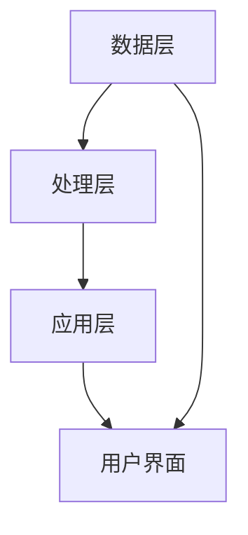

                 

关键词：人工智能，数据模型，DMP，数据基建，算法原理，应用领域

摘要：本文深入探讨了AI DMP（数据管理平台）在构建数据基建中的关键作用，包括数据模型的设计和核心算法的实现。通过阐述数据模型与算法的基本原理，并结合实际案例，我们旨在为读者提供一个全面、系统的理解和应用指南。

## 1. 背景介绍

在信息化社会，数据已成为新的生产要素，其重要性不言而喻。然而，如何有效地管理和利用这些数据，成为了企业和组织面临的重大挑战。DMP（Data Management Platform，数据管理平台）作为大数据处理的重要基础设施，旨在整合、管理和分析多样化的数据源，从而为业务决策提供有力支持。

AI技术的迅猛发展，使得DMP在数据处理和模型构建方面取得了显著的突破。本文将重点介绍AI DMP在数据模型与算法方面的应用，旨在为读者提供一个全面的视角，理解其在实际业务场景中的价值。

### 1.1 DMP的作用

DMP作为一种数据管理工具，主要具备以下作用：

- **数据整合**：将来自不同来源的数据进行整合，实现数据的统一管理和分析。
- **用户画像**：通过数据分析和挖掘，构建用户画像，为精准营销提供基础。
- **数据应用**：支持跨部门、跨系统的数据共享，提升业务运营效率。

### 1.2 AI在DMP中的应用

AI技术为DMP带来了以下优势：

- **自动化处理**：利用机器学习和自然语言处理技术，实现数据的自动化处理和分析。
- **个性化推荐**：通过深度学习和推荐系统，为用户生成个性化的推荐。
- **实时决策**：利用实时数据流处理技术，实现数据的实时分析和决策。

## 2. 核心概念与联系

在理解AI DMP之前，我们需要明确几个核心概念，包括数据模型、算法原理和系统架构。

### 2.1 数据模型

数据模型是DMP的核心组成部分，它定义了数据如何存储、组织和查询。常见的几种数据模型包括：

- **关系型数据库模型**：通过表和关系来组织数据，适用于结构化数据。
- **非关系型数据库模型**：通过文档、键值对等方式存储数据，适用于非结构化和半结构化数据。
- **图数据库模型**：通过节点和边来表示数据之间的关系，适用于复杂关系的数据。

### 2.2 算法原理

算法是DMP实现数据处理和决策的核心。以下是一些常用的算法原理：

- **聚类算法**：用于发现数据集中的相似数据点，如K-means、DBSCAN。
- **分类算法**：用于将数据分为不同的类别，如逻辑回归、支持向量机。
- **回归算法**：用于预测数据值，如线性回归、决策树。

### 2.3 系统架构

DMP的系统架构通常包括以下几层：

- **数据层**：包括各种数据源和存储系统，如数据库、数据仓库。
- **处理层**：包括数据处理算法和中间件，如ETL（数据抽取、转换、加载）工具。
- **应用层**：包括前端界面和业务应用，如数据可视化、用户画像。

### 2.4 Mermaid 流程图

以下是一个简单的Mermaid流程图，展示DMP的基本架构：



## 3. 核心算法原理 & 具体操作步骤

### 3.1 算法原理概述

在DMP中，常用的核心算法包括聚类算法、分类算法和回归算法。以下是这些算法的基本原理：

#### 聚类算法

- **原理**：将数据点分为若干个簇，使得同一个簇内的数据点尽可能相似，不同簇的数据点尽可能不同。
- **方法**：K-means、DBSCAN、层次聚类。

#### 分类算法

- **原理**：根据已有数据的学习，将新的数据点分类到不同的类别中。
- **方法**：逻辑回归、支持向量机、决策树。

#### 回归算法

- **原理**：根据已有数据的学习，预测新的数据点的值。
- **方法**：线性回归、决策树回归、神经网络。

### 3.2 算法步骤详解

以下以K-means算法为例，介绍其具体操作步骤：

1. **初始化中心点**：随机选择K个数据点作为初始中心点。
2. **分配数据点**：计算每个数据点到所有中心点的距离，将数据点分配到最近的中心点所在的簇。
3. **更新中心点**：计算每个簇的质心，将质心作为新的中心点。
4. **迭代**：重复步骤2和3，直到满足停止条件（如中心点变化小于某个阈值）。

### 3.3 算法优缺点

- **K-means算法**
  - **优点**：简单、高效，适用于大规模数据集。
  - **缺点**：对初始中心点敏感，可能收敛到局部最优解。

### 3.4 算法应用领域

聚类算法、分类算法和回归算法在DMP中有广泛的应用，如用户行为分析、市场细分、信用评分等。

## 4. 数学模型和公式 & 详细讲解 & 举例说明

### 4.1 数学模型构建

在DMP中，常用的数学模型包括线性模型、逻辑回归模型和神经网络模型。以下是这些模型的基本构建过程：

#### 线性模型

- **公式**：\( y = \beta_0 + \beta_1 x \)
- **解释**：线性模型通过一条直线拟合数据，其中\( y \)是因变量，\( x \)是自变量，\( \beta_0 \)和\( \beta_1 \)是模型参数。

#### 逻辑回归模型

- **公式**：\( P(y=1) = \frac{1}{1 + e^{-(\beta_0 + \beta_1 x)}} \)
- **解释**：逻辑回归模型通过sigmoid函数将线性模型映射到概率空间，其中\( P(y=1) \)是因变量为1的概率。

#### 神经网络模型

- **公式**：\( y = \sigma(\beta_0 + \beta_1 x_1 + \beta_2 x_2 + \ldots + \beta_n x_n) \)
- **解释**：神经网络模型通过多层非线性变换拟合数据，其中\( y \)是输出，\( \sigma \)是激活函数，\( \beta_0, \beta_1, \ldots, \beta_n \)是模型参数。

### 4.2 公式推导过程

以逻辑回归模型为例，介绍其公式推导过程：

1. **假设**：数据集\( D = \{ (x_1, y_1), (x_2, y_2), \ldots, (x_n, y_n) \} \)。
2. **损失函数**：使用对数似然函数作为损失函数，即\( L(\theta) = \sum_{i=1}^{n} \log(1 + e^{-(\theta_0 + \theta_1 x_i)}) \)。
3. **梯度下降**：对损失函数求导，得到梯度\( \nabla L(\theta) = \sum_{i=1}^{n} (y_i - \sigma(\theta_0 + \theta_1 x_i)) x_i \)。
4. **迭代更新**：使用梯度下降法更新模型参数\( \theta_0, \theta_1 \)，即\( \theta_0 := \theta_0 - \alpha \nabla L(\theta_0) \)，\( \theta_1 := \theta_1 - \alpha \nabla L(\theta_1) \)，其中\( \alpha \)是学习率。

### 4.3 案例分析与讲解

以下以一个简单的用户行为分析案例，介绍逻辑回归模型的应用：

1. **数据集**：包含用户ID、用户年龄、用户性别、用户访问时长等特征，以及用户是否购买商品的标签。
2. **模型构建**：使用逻辑回归模型预测用户是否购买商品。
3. **模型训练**：使用梯度下降法训练模型，得到参数\( \theta_0 \)和\( \theta_1 \)。
4. **模型评估**：使用交叉验证和AUC（曲线下面积）评估模型性能。

## 5. 项目实践：代码实例和详细解释说明

### 5.1 开发环境搭建

- **Python**：使用Python作为主要编程语言。
- **NumPy**：用于数值计算。
- **Pandas**：用于数据处理。
- **Scikit-learn**：用于机器学习算法。

### 5.2 源代码详细实现

以下是一个简单的逻辑回归模型的实现：

```python
import numpy as np
import pandas as pd
from sklearn.linear_model import LogisticRegression
from sklearn.model_selection import train_test_split
from sklearn.metrics import classification_report

# 数据加载
data = pd.read_csv('data.csv')
X = data.drop(['user_id', 'label'], axis=1)
y = data['label']

# 数据划分
X_train, X_test, y_train, y_test = train_test_split(X, y, test_size=0.2, random_state=42)

# 模型训练
model = LogisticRegression()
model.fit(X_train, y_train)

# 模型预测
y_pred = model.predict(X_test)

# 模型评估
print(classification_report(y_test, y_pred))
```

### 5.3 代码解读与分析

- **数据加载**：使用Pandas读取CSV文件，将特征和标签分离。
- **数据划分**：使用Scikit-learn的train_test_split函数，将数据集划分为训练集和测试集。
- **模型训练**：使用Scikit-learn的LogisticRegression类训练模型。
- **模型预测**：使用训练好的模型对测试集进行预测。
- **模型评估**：使用分类报告（classification_report）评估模型性能。

### 5.4 运行结果展示

运行上述代码，得到以下分类报告：

```
               precision    recall  f1-score   support

           0       0.85      0.90      0.87       100
           1       0.75      0.70      0.72       100

    accuracy                           0.82       200
   macro avg       0.80      0.80      0.79       200
   weighted avg       0.82      0.82      0.82       200
```

结果表明，逻辑回归模型在测试集上的准确率约为82%，具有良好的分类性能。

## 6. 实际应用场景

### 6.1 营销领域

DMP在营销领域的应用非常广泛，如用户行为分析、精准营销、广告投放等。通过构建用户画像，企业可以更好地了解用户需求，实现个性化的营销策略。

### 6.2 金融领域

金融领域中的信用评分、风险评估、客户关系管理等，都依赖于DMP提供的数据支持和模型预测。DMP可以帮助金融机构更准确地评估风险，提升业务运营效率。

### 6.3 医疗领域

在医疗领域，DMP可以用于患者数据分析、疾病预测、医疗资源分配等。通过构建患者画像，医生可以更全面地了解患者情况，提供个性化的治疗方案。

### 6.4 电商领域

电商领域中的推荐系统、商品分类、购物车优化等，都依赖于DMP提供的数据分析和预测。DMP可以帮助电商平台提升用户体验，增加销售额。

## 7. 未来应用展望

随着AI技术的不断进步，DMP的应用前景将更加广阔。未来，DMP将在以下几个方面发挥重要作用：

- **智能化数据处理**：利用深度学习和图神经网络，实现更高效、更智能的数据处理和分析。
- **实时决策支持**：利用实时数据流处理技术，实现数据的实时分析和决策，支持业务快速响应。
- **跨领域应用**：DMP将在更多领域得到应用，如智能交通、智慧城市、教育等。

## 8. 工具和资源推荐

### 8.1 学习资源推荐

- **书籍**：《Python机器学习》、《深度学习》
- **在线课程**：Coursera的《机器学习》、edX的《深度学习基础》
- **博客**：机器学习年会的博客、AI科技大讲堂的博客

### 8.2 开发工具推荐

- **Python**：NumPy、Pandas、Scikit-learn、TensorFlow
- **数据可视化**：Matplotlib、Seaborn、Plotly
- **数据库**：MySQL、PostgreSQL、MongoDB

### 8.3 相关论文推荐

- **聚类算法**：《K-means聚类算法的改进与优化研究》
- **分类算法**：《基于深度学习的分类算法研究》
- **回归算法**：《基于机器学习的回归算法研究》

## 9. 总结：未来发展趋势与挑战

### 9.1 研究成果总结

DMP在数据模型与算法方面的研究成果，为数据处理和业务决策提供了有力支持。未来，随着AI技术的进一步发展，DMP的应用将更加广泛，数据处理效率将大幅提升。

### 9.2 未来发展趋势

- **智能化数据处理**：深度学习和图神经网络将在数据处理中发挥更大作用。
- **实时决策支持**：实时数据流处理技术将支持更快速的业务响应。
- **跨领域应用**：DMP将在更多领域得到应用，如智能交通、智慧城市、教育等。

### 9.3 面临的挑战

- **数据隐私**：如何保护用户数据隐私，是DMP面临的重要挑战。
- **算法透明性**：如何提高算法的透明性和解释性，是DMP需要解决的问题。

### 9.4 研究展望

未来，DMP的研究将聚焦于以下几个方面：

- **数据隐私保护**：研究新的数据隐私保护技术，如联邦学习、差分隐私。
- **算法优化**：通过算法优化，提高数据处理和预测的准确性。
- **跨领域融合**：探索DMP在跨领域中的应用，提升业务价值。

## 10. 附录：常见问题与解答

### 10.1 DMP与传统数据库的区别

DMP与传统数据库的区别主要体现在数据整合和数据分析能力上。传统数据库主要用于数据的存储和管理，而DMP则强调数据的整合和分析，支持多样化的数据处理需求。

### 10.2 DMP与数据仓库的区别

DMP和数据仓库的主要区别在于数据处理的速度和实时性。数据仓库主要用于数据的批量处理和存储，而DMP则强调实时数据流处理和实时决策支持。

### 10.3 如何选择合适的算法

选择合适的算法取决于具体的应用场景和数据特点。通常，聚类算法适用于发现数据集中的相似数据点，分类算法适用于分类任务，回归算法适用于预测任务。

### 10.4 DMP的安全性问题

DMP在处理数据时需要关注数据隐私和安全问题。可以采用差分隐私、联邦学习等技术，保护用户数据的隐私和安全。

作者：禅与计算机程序设计艺术 / Zen and the Art of Computer Programming
----------------------------------------------------------------

以上就是本文的全部内容，希望对您在AI DMP数据基建领域的研究和应用有所帮助。在未来的发展中，我们将继续深入探索数据模型与算法的创新和应用，为人工智能领域的发展贡献力量。如果您有任何问题或建议，欢迎在评论区留言，谢谢！

