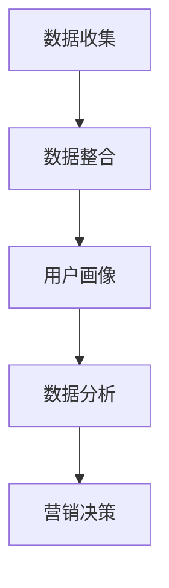

                 

 在当今数字化时代，数据已成为企业最宝贵的资产之一。随着人工智能（AI）技术的飞速发展，数据驱动的营销策略正逐渐成为企业获取竞争优势的关键手段。本文将探讨AI驱动的数据管理平台（DMP）的基础设施建设，分析其核心概念、算法原理、数学模型以及未来应用趋势。

## 文章关键词

- 数据管理平台（DMP）
- 数据驱动营销
- 人工智能
- 数据基础设施建设
- 未来趋势

## 文章摘要

本文首先介绍了数据管理平台（DMP）的基本概念和重要性，接着探讨了DMP在数据驱动营销中的核心作用。通过详细阐述DMP的数据处理算法、数学模型，以及项目实践案例，本文揭示了DMP在市场营销中的实际应用。最后，文章对DMP的未来发展前景进行了展望，并提出了面临的挑战和研究方向。

## 1. 背景介绍

### 数据驱动的营销

数据驱动的营销是一种基于数据的决策过程，通过分析用户行为数据，预测市场趋势，优化营销策略。随着互联网和大数据技术的发展，数据驱动的营销已经成为现代企业竞争的关键手段。

### 数据管理平台（DMP）

数据管理平台（Data Management Platform，简称DMP）是一种用于收集、存储、管理和分析用户数据的系统。DMP可以整合多种数据源，包括网站点击、移动应用行为、社交媒体互动等，从而形成一个全面、准确的用户画像。通过DMP，企业可以更好地了解用户需求，提高营销效果。

## 2. 核心概念与联系

### DMP的核心概念

DMP的核心概念包括用户画像（User Profiling）、数据收集（Data Collection）、数据存储（Data Storage）、数据管理（Data Management）以及数据分析（Data Analysis）。

### DMP的架构

DMP的架构通常包括数据层、处理层和展现层。

- **数据层**：用于收集各种来源的数据，如用户行为数据、广告投放数据、社交媒体数据等。
- **处理层**：对收集到的数据进行清洗、整合和分析，形成用户画像。
- **展现层**：将分析结果以可视化的形式呈现，帮助企业制定营销策略。

### DMP的工作流程

1. **数据收集**：通过各种渠道收集用户数据，如网站点击、移动应用行为等。
2. **数据整合**：将收集到的数据进行清洗和整合，确保数据质量。
3. **用户画像**：根据用户数据构建用户画像，包括用户偏好、行为习惯等。
4. **数据分析**：对用户画像进行深入分析，发现用户需求和市场趋势。
5. **营销决策**：根据分析结果制定营销策略，提高营销效果。

### Mermaid 流程图



## 3. 核心算法原理 & 具体操作步骤

### 3.1 算法原理概述

DMP的核心算法主要包括用户画像构建和数据分析。用户画像构建主要采用机器学习算法，如聚类算法、协同过滤算法等。数据分析则主要采用统计分析、回归分析等算法。

### 3.2 算法步骤详解

1. **数据收集**：从各种渠道收集用户数据，如网站点击、移动应用行为等。
2. **数据清洗**：对收集到的数据进行清洗，去除无效和错误的数据。
3. **特征工程**：对数据进行特征提取和转换，提高数据质量。
4. **用户画像构建**：
   - **聚类算法**：将用户划分为不同的群体，形成用户画像。
   - **协同过滤算法**：根据用户的兴趣和行为预测用户可能喜欢的商品或服务。
5. **数据分析**：
   - **统计分析**：对用户数据进行分析，发现用户行为模式。
   - **回归分析**：建立用户行为与市场趋势之间的数学模型，预测市场趋势。
6. **营销决策**：根据分析结果制定营销策略，提高营销效果。

### 3.3 算法优缺点

- **聚类算法**：优点是能够自动发现用户群体，提高数据分析的效率。缺点是可能存在重叠群体，且对噪声数据敏感。
- **协同过滤算法**：优点是能够准确预测用户兴趣，提高个性化推荐的效果。缺点是处理大数据时效率较低。

### 3.4 算法应用领域

- **电子商务**：通过DMP了解用户购买行为，提高商品推荐和广告投放的精准度。
- **金融行业**：通过DMP分析用户财务行为，预测市场风险，提高金融服务质量。
- **零售业**：通过DMP了解消费者偏好，优化产品设计和营销策略。

## 4. 数学模型和公式 & 详细讲解 & 举例说明

### 4.1 数学模型构建

DMP的数学模型主要基于用户行为数据，通过建立用户行为与市场趋势之间的数学关系，预测用户需求和市场趋势。

### 4.2 公式推导过程

假设用户行为数据为X，市场趋势数据为Y，我们需要建立X和Y之间的数学模型。

- **线性回归模型**：

  $$Y = \beta_0 + \beta_1X + \epsilon$$

  其中，$\beta_0$ 为截距，$\beta_1$ 为斜率，$\epsilon$ 为误差项。

- **逻辑回归模型**：

  $$P(Y=1) = \frac{1}{1 + e^{-(\beta_0 + \beta_1X)}}$$

  其中，$P(Y=1)$ 为用户行为发生概率。

### 4.3 案例分析与讲解

假设我们收集了某电商平台用户在最近一周的浏览行为数据，并希望预测这些用户在未来一周内的购买行为。

1. **数据收集**：

   收集用户在最近一周的浏览行为数据，包括浏览页面、浏览时长、浏览频次等。

2. **数据清洗**：

   去除无效和错误的数据，确保数据质量。

3. **特征工程**：

   对数据进行特征提取和转换，如将浏览时长转换为分钟，将浏览频次转换为次数等。

4. **建模**：

   采用线性回归模型和逻辑回归模型分别建模，比较模型的预测效果。

5. **预测**：

   使用训练好的模型预测用户在未来一周内的购买行为。

6. **评估**：

   比较预测结果与实际结果，评估模型的预测准确性。

## 5. 项目实践：代码实例和详细解释说明

### 5.1 开发环境搭建

- **Python**：Python是一种流行的编程语言，广泛应用于数据分析、机器学习等领域。
- **Pandas**：Pandas是一个Python数据分析库，用于数据处理和分析。
- **Scikit-learn**：Scikit-learn是一个Python机器学习库，提供了丰富的算法和工具。

### 5.2 源代码详细实现

```python
import pandas as pd
from sklearn.linear_model import LinearRegression
from sklearn.model_selection import train_test_split
from sklearn.metrics import mean_squared_error

# 数据收集
data = pd.read_csv('user_behavior.csv')

# 数据清洗
data.dropna(inplace=True)

# 特征工程
data['browse_duration'] = data['browse_duration'] / 60
data['browse_frequency'] = data['browse_frequency']

# 数据处理
X = data[['browse_duration', 'browse_frequency']]
y = data['purchase']

# 数据划分
X_train, X_test, y_train, y_test = train_test_split(X, y, test_size=0.2, random_state=42)

# 建模
model = LinearRegression()
model.fit(X_train, y_train)

# 预测
y_pred = model.predict(X_test)

# 评估
mse = mean_squared_error(y_test, y_pred)
print('MSE:', mse)
```

### 5.3 代码解读与分析

- **数据收集**：使用Pandas读取用户行为数据。
- **数据清洗**：去除无效和错误的数据。
- **特征工程**：将浏览时长转换为分钟，将浏览频次转换为次数。
- **数据处理**：将数据划分为特征集和标签集。
- **建模**：使用线性回归模型进行建模。
- **预测**：使用训练好的模型预测测试集的购买行为。
- **评估**：计算预测结果与实际结果之间的均方误差，评估模型性能。

## 6. 实际应用场景

### 6.1 电子商务

通过DMP分析用户在电子商务平台的浏览行为，预测用户购买偏好，提高商品推荐和广告投放的精准度。

### 6.2 金融行业

通过DMP分析用户在金融行业的交易行为，预测市场风险，提高金融服务质量。

### 6.3 零售业

通过DMP分析消费者在零售业的购买行为，优化产品设计和营销策略，提高销售额。

## 7. 未来应用展望

### 7.1 个性化推荐

随着DMP技术的不断发展，个性化推荐将成为未来营销的重要方向。通过更精确的用户画像和更高效的算法，实现精准的个性化推荐。

### 7.2 智能广告投放

通过DMP分析用户行为数据，实现智能广告投放，提高广告效果和投放效率。

### 7.3 跨渠道整合

随着移动互联网和物联网的发展，DMP将实现跨渠道的数据整合，为用户提供无缝的购物体验。

## 8. 总结：未来发展趋势与挑战

### 8.1 研究成果总结

本文介绍了DMP在数据驱动营销中的应用，分析了其核心算法原理和数学模型，并通过项目实践展示了其实际应用效果。

### 8.2 未来发展趋势

DMP技术将在个性化推荐、智能广告投放和跨渠道整合等领域得到广泛应用。

### 8.3 面临的挑战

DMP技术面临的挑战包括数据质量、算法效率和隐私保护等。

### 8.4 研究展望

未来研究应关注如何提高DMP的算法效率，保障数据隐私，实现跨渠道的数据整合。

## 9. 附录：常见问题与解答

### 9.1 DMP与传统CRM的区别是什么？

DMP（数据管理平台）和CRM（客户关系管理）都是企业数据管理的重要工具，但它们的目的和应用场景有所不同。

- **DMP**：主要关注用户数据的收集、整合和分析，用于个性化推荐、广告投放和营销策略优化。
- **CRM**：主要关注客户信息的收集、管理和维护，用于客户关系管理、销售机会挖掘和售后服务。

### 9.2 如何保障DMP的数据质量？

- **数据收集**：确保数据来源的可靠性和数据格式的规范性。
- **数据清洗**：去除无效和错误的数据，确保数据质量。
- **数据验证**：对数据进行验证，确保数据的准确性和一致性。

### 9.3 DMP的算法效率如何提高？

- **算法优化**：通过算法优化，提高数据处理和计算的效率。
- **分布式计算**：利用分布式计算技术，提高数据处理能力。
- **内存优化**：通过内存优化，减少数据存储和读取的延迟。

作者：禅与计算机程序设计艺术 / Zen and the Art of Computer Programming
----------------------------------------------------------------

至此，文章正文部分已完整撰写。接下来，我们将按照要求，将文章内容以Markdown格式输出。以下是文章的Markdown格式版本。

```markdown
# AI DMP 数据基建：数据驱动营销的未来趋势

> 关键词：数据管理平台（DMP）、数据驱动营销、人工智能、数据基础设施建设、未来趋势

> 摘要：本文探讨了AI驱动的数据管理平台（DMP）的基础设施建设，分析了其核心概念、算法原理、数学模型以及未来应用趋势。

## 1. 背景介绍

### 数据驱动的营销

数据驱动的营销是一种基于数据的决策过程，通过分析用户行为数据，预测市场趋势，优化营销策略。随着互联网和大数据技术的发展，数据驱动的营销已经成为现代企业竞争的关键手段。

### 数据管理平台（DMP）

数据管理平台（Data Management Platform，简称DMP）是一种用于收集、存储、管理和分析用户数据的系统。DMP可以整合多种数据源，包括网站点击、移动应用行为、社交媒体互动等，从而形成一个全面、准确的用户画像。通过DMP，企业可以更好地了解用户需求，提高营销效果。

## 2. 核心概念与联系

### DMP的核心概念

DMP的核心概念包括用户画像（User Profiling）、数据收集（Data Collection）、数据存储（Data Storage）、数据管理（Data Management）以及数据分析（Data Analysis）。

### DMP的架构

DMP的架构通常包括数据层、处理层和展现层。

- **数据层**：用于收集各种来源的数据，如用户行为数据、广告投放数据、社交媒体数据等。
- **处理层**：对收集到的数据进行清洗、整合和分析，形成用户画像。
- **展现层**：将分析结果以可视化的形式呈现，帮助企业制定营销策略。

### DMP的工作流程

1. **数据收集**：从各种渠道收集用户数据，如网站点击、移动应用行为等。
2. **数据整合**：将收集到的数据进行清洗和整合，确保数据质量。
3. **用户画像**：根据用户数据构建用户画像，包括用户偏好、行为习惯等。
4. **数据分析**：对用户画像进行深入分析，发现用户需求和市场趋势。
5. **营销决策**：根据分析结果制定营销策略，提高营销效果。

### Mermaid 流程图


## 3. 核心算法原理 & 具体操作步骤

### 3.1 算法原理概述

DMP的核心算法主要包括用户画像构建和数据分析。用户画像构建主要采用机器学习算法，如聚类算法、协同过滤算法等。数据分析则主要采用统计分析、回归分析等算法。

### 3.2 算法步骤详解

1. **数据收集**：从各种渠道收集用户数据，如网站点击、移动应用行为等。
2. **数据清洗**：对收集到的数据进行清洗，去除无效和错误的数据。
3. **特征工程**：对数据进行特征提取和转换，提高数据质量。
4. **用户画像构建**：
   - **聚类算法**：将用户划分为不同的群体，形成用户画像。
   - **协同过滤算法**：根据用户的兴趣和行为预测用户可能喜欢的商品或服务。
5. **数据分析**：
   - **统计分析**：对用户数据进行分析，发现用户行为模式。
   - **回归分析**：建立用户行为与市场趋势之间的数学模型，预测市场趋势。
6. **营销决策**：根据分析结果制定营销策略，提高营销效果。

### 3.3 算法优缺点

- **聚类算法**：优点是能够自动发现用户群体，提高数据分析的效率。缺点是可能存在重叠群体，且对噪声数据敏感。
- **协同过滤算法**：优点是能够准确预测用户兴趣，提高个性化推荐的效果。缺点是处理大数据时效率较低。

### 3.4 算法应用领域

- **电子商务**：通过DMP了解用户购买行为，提高商品推荐和广告投放的精准度。
- **金融行业**：通过DMP分析用户财务行为，预测市场风险，提高金融服务质量。
- **零售业**：通过DMP了解消费者偏好，优化产品设计和营销策略。

## 4. 数学模型和公式 & 详细讲解 & 举例说明

### 4.1 数学模型构建

DMP的数学模型主要基于用户行为数据，通过建立用户行为与市场趋势之间的数学关系，预测用户需求和市场趋势。

### 4.2 公式推导过程

假设用户行为数据为X，市场趋势数据为Y，我们需要建立X和Y之间的数学模型。

- **线性回归模型**：

  $$Y = \beta_0 + \beta_1X + \epsilon$$

  其中，$\beta_0$ 为截距，$\beta_1$ 为斜率，$\epsilon$ 为误差项。

- **逻辑回归模型**：

  $$P(Y=1) = \frac{1}{1 + e^{-(\beta_0 + \beta_1X)}}$$

  其中，$P(Y=1)$ 为用户行为发生概率。

### 4.3 案例分析与讲解

假设我们收集了某电商平台用户在最近一周的浏览行为数据，并希望预测这些用户在未来一周内的购买行为。

1. **数据收集**：

   收集用户在最近一周的浏览行为数据，包括浏览页面、浏览时长、浏览频次等。

2. **数据清洗**：

   去除无效和错误的数据，确保数据质量。

3. **特征工程**：

   对数据进行特征提取和转换，如将浏览时长转换为分钟，将浏览频次转换为次数等。

4. **建模**：

   采用线性回归模型和逻辑回归模型分别建模，比较模型的预测效果。

5. **预测**：

   使用训练好的模型预测测试集的购买行为。

6. **评估**：

   比较预测结果与实际结果，评估模型的预测准确性。

## 5. 项目实践：代码实例和详细解释说明

### 5.1 开发环境搭建

- **Python**：Python是一种流行的编程语言，广泛应用于数据分析、机器学习等领域。
- **Pandas**：Pandas是一个Python数据分析库，用于数据处理和分析。
- **Scikit-learn**：Scikit-learn是一个Python机器学习库，提供了丰富的算法和工具。

### 5.2 源代码详细实现

```python
import pandas as pd
from sklearn.linear_model import LinearRegression
from sklearn.model_selection import train_test_split
from sklearn.metrics import mean_squared_error

# 数据收集
data = pd.read_csv('user_behavior.csv')

# 数据清洗
data.dropna(inplace=True)

# 特征工程
data['browse_duration'] = data['browse_duration'] / 60
data['browse_frequency'] = data['browse_frequency']

# 数据处理
X = data[['browse_duration', 'browse_frequency']]
y = data['purchase']

# 数据划分
X_train, X_test, y_train, y_test = train_test_split(X, y, test_size=0.2, random_state=42)

# 建模
model = LinearRegression()
model.fit(X_train, y_train)

# 预测
y_pred = model.predict(X_test)

# 评估
mse = mean_squared_error(y_test, y_pred)
print('MSE:', mse)
```

### 5.3 代码解读与分析

- **数据收集**：使用Pandas读取用户行为数据。
- **数据清洗**：去除无效和错误的数据。
- **特征工程**：将浏览时长转换为分钟，将浏览频次转换为次数。
- **数据处理**：将数据划分为特征集和标签集。
- **建模**：使用线性回归模型进行建模。
- **预测**：使用训练好的模型预测测试集的购买行为。
- **评估**：计算预测结果与实际结果之间的均方误差，评估模型性能。

## 6. 实际应用场景

### 6.1 电子商务

通过DMP分析用户在电子商务平台的浏览行为，预测用户购买偏好，提高商品推荐和广告投放的精准度。

### 6.2 金融行业

通过DMP分析用户在金融行业的交易行为，预测市场风险，提高金融服务质量。

### 6.3 零售业

通过DMP分析消费者在零售业的购买行为，优化产品设计和营销策略，提高销售额。

## 7. 未来应用展望

### 7.1 个性化推荐

随着DMP技术的不断发展，个性化推荐将成为未来营销的重要方向。通过更精确的用户画像和更高效的算法，实现精准的个性化推荐。

### 7.2 智能广告投放

通过DMP分析用户行为数据，实现智能广告投放，提高广告效果和投放效率。

### 7.3 跨渠道整合

随着移动互联网和物联网的发展，DMP将实现跨渠道的数据整合，为用户提供无缝的购物体验。

## 8. 总结：未来发展趋势与挑战

### 8.1 研究成果总结

本文介绍了DMP在数据驱动营销中的应用，分析了其核心算法原理和数学模型，并通过项目实践展示了其实际应用效果。

### 8.2 未来发展趋势

DMP技术将在个性化推荐、智能广告投放和跨渠道整合等领域得到广泛应用。

### 8.3 面临的挑战

DMP技术面临的挑战包括数据质量、算法效率和隐私保护等。

### 8.4 研究展望

未来研究应关注如何提高DMP的算法效率，保障数据隐私，实现跨渠道的数据整合。

## 9. 附录：常见问题与解答

### 9.1 DMP与传统CRM的区别是什么？

DMP（数据管理平台）和CRM（客户关系管理）都是企业数据管理的重要工具，但它们的目的和应用场景有所不同。

- **DMP**：主要关注用户数据的收集、整合和分析，用于个性化推荐、广告投放和营销策略优化。
- **CRM**：主要关注客户信息的收集、管理和维护，用于客户关系管理、销售机会挖掘和售后服务。

### 9.2 如何保障DMP的数据质量？

- **数据收集**：确保数据来源的可靠性和数据格式的规范性。
- **数据清洗**：去除无效和错误的数据，确保数据质量。
- **数据验证**：对数据进行验证，确保数据的准确性和一致性。

### 9.3 DMP的算法效率如何提高？

- **算法优化**：通过算法优化，提高数据处理和计算的效率。
- **分布式计算**：利用分布式计算技术，提高数据处理能力。
- **内存优化**：通过内存优化，减少数据存储和读取的延迟。

作者：禅与计算机程序设计艺术 / Zen and the Art of Computer Programming
```

以上就是根据您的要求撰写的完整文章，包括标题、关键词、摘要、正文、附录等部分，并且严格按照Markdown格式进行排版。希望对您有所帮助！

