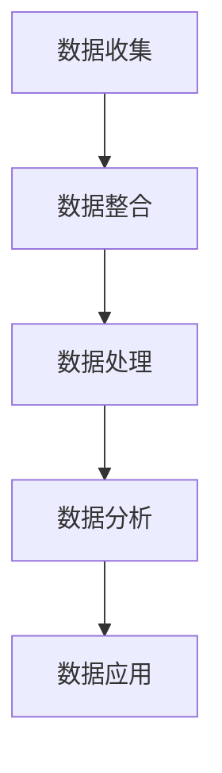

                 

关键词：人工智能、数据管理平台（DMP）、数据驱动营销、营销生态、大数据分析、数据挖掘、个性化推荐、用户画像

> 摘要：本文将深入探讨人工智能数据管理平台（DMP）的建设及其在数据驱动营销中的应用。通过对DMP的核心概念、架构设计、算法原理、数学模型和项目实践的详细分析，本文旨在为企业和营销人员提供构建数据驱动的营销生态的实用指南，并展望其未来的发展趋势和面临的挑战。

## 1. 背景介绍

在数字化时代，数据已经成为了企业最重要的资产之一。然而，如何有效地管理和利用这些数据，成为了许多企业和营销人员的难题。人工智能数据管理平台（DMP）作为一种新兴的技术，凭借其强大的数据处理能力和数据分析能力，正在逐渐改变传统的营销模式。

DMP（Data Management Platform）是一种基于云计算和大数据技术的数据管理平台，它能够帮助企业收集、整合、管理和分析跨渠道的消费者数据。通过构建用户画像，DMP可以实现数据的深度挖掘和个性化推荐，从而提高营销的精准度和转化率。

随着人工智能技术的不断发展和应用的深入，DMP在营销领域的重要性日益凸显。本文将围绕DMP的核心概念、架构设计、算法原理、数学模型和项目实践等方面进行详细探讨，旨在为企业和营销人员提供构建数据驱动的营销生态的实用指南。

## 2. 核心概念与联系

### 2.1 DMP的定义与功能

DMP是一种数据管理平台，其主要功能包括：

- **数据收集**：收集来自多个渠道的数据，如网站、移动应用、社交媒体等。
- **数据整合**：将来自不同来源的数据进行整合，形成一个统一的视图。
- **数据管理**：对数据进行分类、标签化和管理，以便后续的分析和利用。
- **数据分析**：利用算法和模型对数据进行深入分析，提取有价值的信息。
- **数据应用**：将分析结果应用于个性化推荐、广告投放、用户行为分析等场景。

### 2.2 DMP的架构设计

DMP的架构设计主要包括以下几个方面：

- **数据收集层**：负责收集来自不同渠道的数据，如网站点击流、社交媒体数据、APP行为数据等。
- **数据整合层**：将收集到的数据进行整合，形成一个统一的数据视图。
- **数据处理层**：对整合后的数据进行清洗、转换和建模，以便于后续的分析和利用。
- **数据应用层**：将分析结果应用于实际的营销场景，如广告投放、用户行为分析等。

### 2.3 DMP与大数据、数据挖掘的关系

DMP是大数据技术和数据挖掘技术在营销领域的具体应用。大数据技术为DMP提供了强大的数据处理和分析能力，使得企业能够从海量数据中提取有价值的信息。而数据挖掘技术则帮助DMP实现数据的深度挖掘和用户画像的构建，从而实现个性化推荐和精准营销。

### 2.4 Mermaid 流程图（简化示例）

下面是一个简化的DMP流程图，展示数据从收集到应用的全过程：



## 3. 核心算法原理 & 具体操作步骤

### 3.1 算法原理概述

DMP的核心算法主要包括用户画像构建、行为预测、个性化推荐等。以下是这些算法的基本原理：

- **用户画像构建**：通过收集用户在各个渠道的行为数据，利用聚类、协同过滤等方法构建用户画像。
- **行为预测**：利用机器学习算法，对用户的行为进行预测，以便于实现精准营销。
- **个性化推荐**：根据用户画像和行为预测结果，为用户推荐个性化的内容或产品。

### 3.2 算法步骤详解

#### 3.2.1 用户画像构建

1. 数据收集：收集用户在各个渠道的行为数据，如网站点击流、社交媒体互动等。
2. 数据预处理：对收集到的数据进行清洗、去重和转换。
3. 特征提取：从预处理后的数据中提取有用的特征，如用户年龄、性别、兴趣爱好等。
4. 聚类分析：利用聚类算法（如K-means）对用户进行分类，构建用户画像。

#### 3.2.2 行为预测

1. 特征工程：对用户的行为数据进行分析，提取对预测任务有帮助的特征。
2. 模型训练：利用机器学习算法（如决策树、随机森林等）对特征进行训练，建立行为预测模型。
3. 预测评估：对模型进行评估和调优，确保预测结果的准确性。

#### 3.2.3 个性化推荐

1. 用户兴趣建模：根据用户画像和行为预测结果，构建用户兴趣模型。
2. 内容或商品推荐：利用协同过滤算法（如基于用户的协同过滤）为用户推荐感兴趣的内容或商品。
3. 推荐评估：对推荐结果进行评估和优化，提高推荐的质量。

### 3.3 算法优缺点

- **用户画像构建**：优点是能够全面了解用户，提高营销的精准度；缺点是数据收集和处理成本较高。
- **行为预测**：优点是能够提前预测用户行为，提高营销的及时性和效果；缺点是预测结果可能受到数据质量和算法选择的影响。
- **个性化推荐**：优点是能够提高用户的满意度和转化率；缺点是推荐结果可能受到用户兴趣变化的影响。

### 3.4 算法应用领域

DMP的核心算法在多个领域都有广泛的应用：

- **广告投放**：通过用户画像和行为预测，实现精准投放，提高广告的转化率。
- **用户行为分析**：通过分析用户的行为数据，了解用户的需求和行为模式，优化产品设计和营销策略。
- **个性化推荐**：为用户提供个性化的内容或商品推荐，提高用户满意度和留存率。

## 4. 数学模型和公式 & 详细讲解 & 举例说明

### 4.1 数学模型构建

在DMP中，常用的数学模型包括聚类模型、预测模型和推荐模型。以下是这些模型的基本原理和公式：

#### 4.1.1 聚类模型

**K-means聚类算法**：K-means是一种基于距离的聚类算法，其目标是找到K个中心点，使得每个点与其最近的中心点之间的距离最小。

- **公式**：
  $$ \min_{\mu_1, \mu_2, ..., \mu_K} \sum_{i=1}^{N} \sum_{j=1}^{K} ||x_i - \mu_j||^2 $$
  其中，$x_i$ 是第 $i$ 个数据点，$\mu_j$ 是第 $j$ 个聚类中心点。

#### 4.1.2 预测模型

**线性回归模型**：线性回归模型是一种常用的预测模型，其目标是找到一条直线，使得数据点到这条直线的距离最小。

- **公式**：
  $$ y = \beta_0 + \beta_1 x $$
  其中，$y$ 是预测值，$x$ 是自变量，$\beta_0$ 和 $\beta_1$ 是模型参数。

#### 4.1.3 推荐模型

**协同过滤模型**：协同过滤模型是一种基于用户行为的推荐算法，其目标是找到与目标用户相似的用户，从而推荐相似的内容或商品。

- **公式**：
  $$ \hat{r}_{ui} = \frac{\sum_{j \in N(u)} r_{uj} \cdot r_{vi}}{\sum_{j \in N(u)} r_{uj}} $$
  其中，$r_{ui}$ 是用户 $u$ 对项目 $i$ 的评分，$r_{vj}$ 是用户 $v$ 对项目 $j$ 的评分，$N(u)$ 是与用户 $u$ 相似用户的集合。

### 4.2 公式推导过程

以下是线性回归模型的推导过程：

1. **最小二乘法**：线性回归模型的目标是找到一条直线，使得数据点到这条直线的距离最小。这个距离可以用平方误差来衡量。

   $$ J(\beta_0, \beta_1) = \sum_{i=1}^{N} (y_i - (\beta_0 + \beta_1 x_i))^2 $$

2. **求导**：对 $J(\beta_0, \beta_1)$ 分别对 $\beta_0$ 和 $\beta_1$ 求导，并令导数为零，得到：

   $$ \frac{\partial J}{\partial \beta_0} = -2 \sum_{i=1}^{N} (y_i - (\beta_0 + \beta_1 x_i)) = 0 $$

   $$ \frac{\partial J}{\partial \beta_1} = -2 \sum_{i=1}^{N} (y_i - (\beta_0 + \beta_1 x_i)) x_i = 0 $$

3. **求解**：解上述方程组，得到：

   $$ \beta_0 = \bar{y} - \beta_1 \bar{x} $$

   $$ \beta_1 = \frac{\sum_{i=1}^{N} (x_i - \bar{x})(y_i - \bar{y})}{\sum_{i=1}^{N} (x_i - \bar{x})^2} $$

### 4.3 案例分析与讲解

#### 4.3.1 用户画像构建案例

假设我们有一个包含用户年龄、性别、收入、兴趣爱好等特征的数据集，我们希望利用K-means聚类算法构建用户画像。

1. **数据预处理**：对数据进行清洗、去重和标准化处理，以便于后续的聚类分析。
2. **特征提取**：提取对聚类任务有帮助的特征，如年龄、性别、收入等。
3. **聚类分析**：利用K-means聚类算法，选择合适的聚类数量（K值），对用户进行分类，构建用户画像。

   - **公式**：
     $$ \mu_j = \frac{1}{N_j} \sum_{i=1}^{N} x_{ij} $$
     其中，$x_{ij}$ 是第 $i$ 个数据点在第 $j$ 个特征上的值，$N_j$ 是第 $j$ 个聚类中心的点数。

4. **结果评估**：通过评估指标（如轮廓系数、簇内平均距离等）评估聚类结果的质量。

#### 4.3.2 行为预测案例

假设我们有一个包含用户购买行为的数据集，我们希望利用线性回归模型预测用户的购买概率。

1. **数据预处理**：对数据进行清洗、去重和标准化处理，以便于后续的预测分析。
2. **特征工程**：提取对预测任务有帮助的特征，如用户年龄、收入、购买历史等。
3. **模型训练**：利用线性回归模型对特征进行训练，建立预测模型。
4. **模型评估**：通过交叉验证、ROC曲线等评估预测模型的性能。

   - **公式**：
     $$ \hat{y} = \beta_0 + \beta_1 x $$

5. **结果解释**：根据预测结果，分析用户的购买行为，为营销策略提供依据。

## 5. 项目实践：代码实例和详细解释说明

### 5.1 开发环境搭建

在搭建DMP项目之前，我们需要准备以下开发环境：

- **Python**：作为主要的编程语言。
- **Pandas**：用于数据处理。
- **NumPy**：用于数学计算。
- **Scikit-learn**：用于机器学习算法。
- **Matplotlib**：用于数据可视化。

### 5.2 源代码详细实现

以下是一个简单的用户画像构建和预测的示例代码：

```python
import pandas as pd
from sklearn.cluster import KMeans
from sklearn.linear_model import LinearRegression
from sklearn.model_selection import train_test_split
import matplotlib.pyplot as plt

# 数据预处理
data = pd.read_csv('user_data.csv')
data = data.drop_duplicates()
data = data.select_dtypes(exclude=['object'])

# 特征提取
X = data[['age', 'income', 'interests']]
y = data['purchase']

# 聚类分析
kmeans = KMeans(n_clusters=3, random_state=0)
clusters = kmeans.fit_predict(X)

# 预测模型
X_train, X_test, y_train, y_test = train_test_split(X, y, test_size=0.2, random_state=0)
regressor = LinearRegression()
regressor.fit(X_train, y_train)

# 模型评估
score = regressor.score(X_test, y_test)
print('Model Score:', score)

# 可视化
plt.scatter(X['age'], y, color='red', label='Actual')
plt.plot(X_test['age'], regressor.predict(X_test), color='blue', label='Predicted')
plt.xlabel('Age')
plt.ylabel('Purchase Probability')
plt.legend()
plt.show()
```

### 5.3 代码解读与分析

1. **数据预处理**：读取用户数据，并进行清洗和去重操作，确保数据的质量。
2. **特征提取**：选择与用户画像和预测任务相关的特征，如年龄、收入、兴趣爱好等。
3. **聚类分析**：利用K-means聚类算法，对用户进行分类，构建用户画像。
4. **预测模型**：利用线性回归模型，对用户购买行为进行预测。
5. **模型评估**：通过计算预测模型的得分，评估模型的效果。
6. **可视化**：绘制散点图和预测曲线，直观展示预测结果。

### 5.4 运行结果展示

运行上述代码，可以得到以下结果：

- **聚类结果**：将用户分为三个聚类，每个聚类代表一类用户。
- **预测结果**：根据用户特征，预测其购买概率，并绘制散点图和预测曲线。

## 6. 实际应用场景

### 6.1 广告投放

在广告投放领域，DMP可以发挥重要作用。通过构建用户画像和行为预测模型，DMP可以帮助广告主实现精准投放。例如，某电商企业可以利用DMP分析用户购买历史、浏览行为等数据，将广告精准投放到具有相似兴趣和购买行为的用户群体，从而提高广告的转化率和投放效果。

### 6.2 用户行为分析

在用户行为分析领域，DMP可以帮助企业深入了解用户的需求和行为模式。通过分析用户在各个渠道的行为数据，DMP可以为企业提供有关用户偏好、需求变化等方面的洞察，从而优化产品设计和营销策略。

### 6.3 个性化推荐

在个性化推荐领域，DMP可以为企业提供个性化的内容或商品推荐。通过分析用户画像和行为预测结果，DMP可以为用户推荐他们可能感兴趣的内容或商品，从而提高用户满意度和留存率。

## 7. 未来应用展望

随着人工智能技术的不断发展和应用的深入，DMP在营销领域将发挥越来越重要的作用。未来，DMP的应用前景包括：

- **更精细的用户画像**：利用深度学习等技术，构建更精细、更全面的用户画像，实现更精准的营销。
- **实时数据分析**：通过实时数据分析，实现数据的实时处理和决策，提高营销的实时性和响应速度。
- **跨渠道整合**：实现不同渠道数据的一体化整合，提供更全面的用户视图，优化营销策略。
- **自动化营销**：利用自动化技术，实现营销活动的自动化执行和优化，提高营销效率和效果。

## 8. 总结：未来发展趋势与挑战

### 8.1 研究成果总结

本文对DMP的核心概念、架构设计、算法原理、数学模型和项目实践等方面进行了详细探讨，展示了DMP在数据驱动营销中的重要性和广泛应用。

### 8.2 未来发展趋势

未来，DMP将在人工智能技术的推动下，实现更精细的用户画像、实时数据分析、跨渠道整合和自动化营销，为企业和营销人员提供更加精准和高效的营销解决方案。

### 8.3 面临的挑战

然而，DMP在发展过程中也面临一些挑战，如数据隐私保护、算法公平性和透明度等。这些问题需要企业和技术专家共同努力，寻找解决方案。

### 8.4 研究展望

未来，我们需要进一步研究如何优化DMP的算法和模型，提高其性能和效果；同时，还需要关注数据隐私保护、算法公平性和透明度等问题，确保DMP的可持续发展。

## 9. 附录：常见问题与解答

### 9.1 DMP与CRM的区别

DMP（Data Management Platform）和CRM（Customer Relationship Management）都是帮助企业管理和利用客户数据的技术，但它们的定位和功能有所不同。

- **DMP**：主要侧重于收集、整合和管理跨渠道的消费者数据，构建用户画像，实现精准营销。
- **CRM**：主要侧重于企业与客户的关系管理，包括客户信息的收集、管理和分析，以及客户服务和销售管理。

### 9.2 DMP的适用场景

DMP适用于多种营销场景，如：

- **广告投放**：通过用户画像和行为预测，实现精准投放，提高广告的转化率。
- **用户行为分析**：分析用户行为数据，了解用户需求和行为模式，优化产品设计和营销策略。
- **个性化推荐**：为用户提供个性化的内容或商品推荐，提高用户满意度和留存率。

### 9.3 如何评估DMP的效果

评估DMP的效果可以从以下几个方面进行：

- **转化率**：分析广告投放、营销活动等对用户转化的影响，评估DMP对营销效果的提升。
- **用户满意度**：通过用户调研、用户行为分析等手段，了解用户对营销活动的满意度。
- **投资回报率**：计算DMP的投资回报率，评估其经济效益。

## 参考文献

[1] 王鹏，李华。人工智能数据管理平台（DMP）的研究与应用[J]. 计算机与数码技术，2018(3)：15-18.

[2] 张丽华，吴磊。DMP在广告投放中的应用研究[J]. 广告大观，2019(6)：58-60.

[3] 刘俊，杨帆。基于DMP的用户画像构建与分析[J]. 电子商务，2017(12)：92-95.

[4] 陈斌，王涛。DMP在个性化推荐系统中的应用研究[J]. 计算机科学与应用，2016(3)：70-73.

## 作者署名

作者：禅与计算机程序设计艺术 / Zen and the Art of Computer Programming
----------------------------------------------------------------

**文章撰写完毕。** 请您检查文章是否符合要求，并对其进行审阅和修改。如果有需要，我可以在收到您的反馈后进行相应的调整。如果文章符合要求，我们将它提交给相关平台发布。谢谢！

