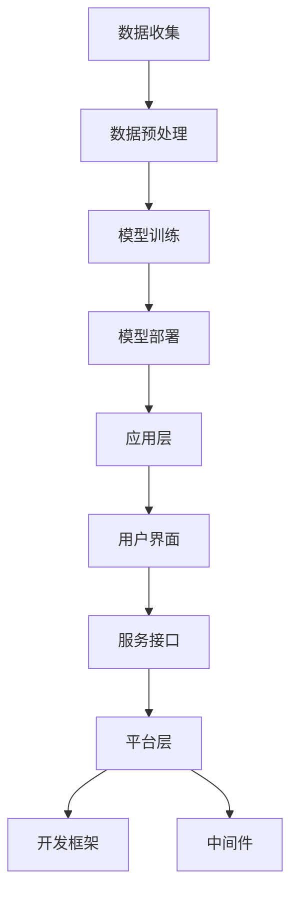

                 

关键词：AI Native、应用开发、机会、挑战、技术架构、算法优化、安全性、可扩展性

> 摘要：本文将探讨AI Native应用的开发机会与面临的挑战。从技术架构、算法优化、安全性、可扩展性等方面入手，分析AI Native应用的现状与未来发展。通过实例解析，探讨在实际应用中的实践经验与问题解决方案，为开发者和研究者提供有益的参考。

## 1. 背景介绍

随着人工智能技术的快速发展，AI技术已经逐渐渗透到各个领域，为企业和个人带来了前所未有的机遇。然而，传统的应用程序开发方式已经难以满足AI技术的需求。AI Native应用应运而生，成为当前人工智能领域的一个重要发展方向。AI Native应用是指将人工智能技术深度集成到应用中，使其具备自主学习和智能决策的能力。

AI Native应用具有以下几个特点：

1. **自主性**：应用可以自我学习和优化，无需人工干预。
2. **智能性**：应用能够根据用户行为和需求提供个性化的服务。
3. **高效性**：应用能够快速响应用户请求，提供高质量的服务。
4. **可扩展性**：应用可以轻松扩展，适应不同场景和规模的需求。

AI Native应用的出现，不仅改变了传统应用的开发模式，也为企业和个人带来了巨大的价值。然而，AI Native应用的开发也面临着诸多挑战。本文将重点探讨AI Native应用的机会与挑战，以期为开发者和研究者提供有价值的参考。

## 2. 核心概念与联系

### 2.1 AI Native应用的概念

AI Native应用是一种将人工智能技术深度集成的应用，它能够在不需要人工干预的情况下，自主学习和优化，从而提供更加智能和高效的服务。AI Native应用通常包含以下几个核心组成部分：

1. **数据收集**：收集用户行为数据，为AI模型提供训练数据。
2. **数据预处理**：对原始数据进行清洗、归一化等处理，为模型训练做好准备。
3. **模型训练**：使用收集的数据训练AI模型，使其具备智能决策能力。
4. **模型部署**：将训练好的模型部署到应用中，使其能够提供服务。
5. **持续优化**：根据用户反馈和应用表现，持续优化模型。

### 2.2 AI Native应用的架构

AI Native应用的架构可以分为以下几个层次：

1. **数据层**：包括数据收集、存储和管理模块，为AI模型提供数据支持。
2. **模型层**：包括AI模型的训练、部署和优化模块，实现智能决策功能。
3. **应用层**：包括用户界面、服务接口等模块，提供用户交互和服务。
4. **平台层**：包括开发框架、中间件等模块，为AI Native应用提供技术支持。

下面是一个简单的Mermaid流程图，展示了AI Native应用的核心概念和架构：



## 3. 核心算法原理 & 具体操作步骤

### 3.1 算法原理概述

AI Native应用的核心在于其智能决策能力，这主要依赖于机器学习算法。机器学习算法可以分为监督学习、无监督学习和强化学习三种类型。其中，监督学习算法在AI Native应用中应用最为广泛。监督学习算法通过训练数据集学习特征和标签之间的关系，从而实现预测和分类任务。

常见的监督学习算法包括：

1. **线性回归**：用于预测连续值。
2. **逻辑回归**：用于预测概率和二分类。
3. **支持向量机**：用于分类任务。
4. **决策树**：用于分类和回归任务。
5. **随机森林**：用于分类和回归任务，具有较好的泛化能力。
6. **神经网络**：用于复杂非线性模型的训练。

### 3.2 算法步骤详解

AI Native应用的具体操作步骤如下：

1. **数据收集**：收集用户行为数据，包括点击、浏览、购买等行为。
2. **数据预处理**：对原始数据进行清洗、归一化等处理，去除噪声和异常值。
3. **特征工程**：提取有用的特征，如用户标签、行为序列等，为模型训练做好准备。
4. **模型选择**：根据任务需求，选择合适的机器学习算法。
5. **模型训练**：使用训练数据集训练模型，调整模型参数。
6. **模型评估**：使用验证数据集评估模型性能，调整模型参数。
7. **模型部署**：将训练好的模型部署到应用中，实现智能决策功能。
8. **持续优化**：根据用户反馈和应用表现，持续优化模型。

### 3.3 算法优缺点

不同的机器学习算法具有各自的优缺点。以下是一些常见算法的优缺点：

1. **线性回归**：优点是简单易懂，易于实现；缺点是对于非线性问题效果不佳。
2. **逻辑回归**：优点是计算速度快，易于优化；缺点是对于多分类问题效果不佳。
3. **支持向量机**：优点是具有较高的分类精度，适用于高维空间；缺点是计算复杂度高，训练时间较长。
4. **决策树**：优点是易于理解和解释，适用于分类和回归任务；缺点是对于噪声数据敏感，容易过拟合。
5. **随机森林**：优点是具有较好的泛化能力，能够处理高维数据；缺点是计算复杂度高，训练时间较长。
6. **神经网络**：优点是能够处理复杂非线性问题，适用于各种类型的任务；缺点是需要大量数据，训练时间较长，难以解释。

### 3.4 算法应用领域

AI Native应用在各个领域都有广泛的应用，以下是一些典型应用领域：

1. **推荐系统**：使用AI Native应用实现个性化推荐，提高用户体验。
2. **智能客服**：通过AI Native应用实现智能客服，提高客服效率和服务质量。
3. **金融风控**：使用AI Native应用实现风险控制，提高金融业务的安全性和可靠性。
4. **智能医疗**：使用AI Native应用实现疾病预测、诊断和治疗建议，提高医疗服务水平。
5. **智能交通**：使用AI Native应用实现智能交通管理，提高交通效率和安全性。

## 4. 数学模型和公式 & 详细讲解 & 举例说明

### 4.1 数学模型构建

AI Native应用中的数学模型通常包括输入层、隐藏层和输出层。以神经网络为例，其数学模型可以表示为：

$$
y = f(z) = \sigma(W_2 \cdot \sigma(W_1 \cdot x + b_1) + b_2)
$$

其中，$x$ 为输入向量，$y$ 为输出向量，$f(z)$ 为激活函数，$W_1$ 和 $W_2$ 分别为隐藏层和输出层的权重矩阵，$b_1$ 和 $b_2$ 分别为隐藏层和输出层的偏置向量。

### 4.2 公式推导过程

以线性回归为例，其公式推导过程如下：

假设我们有一个线性回归模型，输入特征为 $x$，输出标签为 $y$，模型公式为：

$$
y = \beta_0 + \beta_1 x
$$

为了求解 $\beta_0$ 和 $\beta_1$，我们可以使用最小二乘法，即找到使得预测值与实际值之间的误差平方和最小的参数。

误差平方和可以表示为：

$$
J(\beta_0, \beta_1) = \sum_{i=1}^n (y_i - (\beta_0 + \beta_1 x_i))^2
$$

为了求解最优参数，我们可以对 $J(\beta_0, \beta_1)$ 求导，并令导数为零：

$$
\frac{\partial J(\beta_0, \beta_1)}{\partial \beta_0} = -2 \sum_{i=1}^n (y_i - (\beta_0 + \beta_1 x_i)) = 0
$$

$$
\frac{\partial J(\beta_0, \beta_1)}{\partial \beta_1} = -2 \sum_{i=1}^n (y_i - (\beta_0 + \beta_1 x_i)) x_i = 0
$$

通过解上述方程组，我们可以得到最优参数：

$$
\beta_0 = \frac{1}{n} \sum_{i=1}^n y_i - \beta_1 \frac{1}{n} \sum_{i=1}^n x_i
$$

$$
\beta_1 = \frac{1}{n} \sum_{i=1}^n (x_i - \bar{x}) (y_i - \bar{y})
$$

其中，$\bar{x}$ 和 $\bar{y}$ 分别为输入特征和输出标签的平均值。

### 4.3 案例分析与讲解

假设我们有一个简单的线性回归问题，输入特征为 $x$，输出标签为 $y$，数据集如下：

| $x$ | $y$ |
| --- | --- |
| 1 | 2 |
| 2 | 4 |
| 3 | 6 |
| 4 | 8 |

我们希望使用线性回归模型预测 $x=5$ 时的 $y$ 值。

首先，我们计算输入特征和输出标签的平均值：

$$
\bar{x} = \frac{1+2+3+4}{4} = 2.5
$$

$$
\bar{y} = \frac{2+4+6+8}{4} = 5
$$

然后，我们计算最优参数：

$$
\beta_0 = \frac{1}{4} \sum_{i=1}^4 y_i - \beta_1 \frac{1}{4} \sum_{i=1}^4 x_i = 5 - \beta_1 \frac{1}{4} \sum_{i=1}^4 x_i
$$

$$
\beta_1 = \frac{1}{4} \sum_{i=1}^4 (x_i - \bar{x}) (y_i - \bar{y}) = \frac{1}{4} ((1-2.5)(2-5) + (2-2.5)(4-5) + (3-2.5)(6-5) + (4-2.5)(8-5)) = -2
$$

最后，我们可以得到线性回归模型：

$$
y = \beta_0 + \beta_1 x = 5 - 2x
$$

当 $x=5$ 时，预测的 $y$ 值为：

$$
y = 5 - 2 \times 5 = -5
$$

## 5. 项目实践：代码实例和详细解释说明

### 5.1 开发环境搭建

在本项目中，我们将使用Python作为编程语言，结合TensorFlow作为机器学习框架，实现一个简单的线性回归模型。首先，我们需要安装Python和TensorFlow。

安装Python：

```bash
# 使用Python官方安装器安装Python
curl -O https://www.python.org/ftp/python/3.8.10/Python-3.8.10.tgz
tar xvf Python-3.8.10.tgz
cd Python-3.8.10
./configure
make
sudo make install
```

安装TensorFlow：

```bash
pip install tensorflow
```

### 5.2 源代码详细实现

以下是一个简单的线性回归模型的实现：

```python
import tensorflow as tf

# 定义输入层和输出层
x = tf.placeholder(tf.float32, shape=[None])
y = tf.placeholder(tf.float32, shape=[None])

# 定义模型参数
beta0 = tf.Variable(0.0)
beta1 = tf.Variable(0.0)

# 定义损失函数
y_pred = beta0 + beta1 * x
loss = tf.reduce_mean(tf.square(y - y_pred))

# 定义优化器
optimizer = tf.train.GradientDescentOptimizer(learning_rate=0.001)
train_op = optimizer.minimize(loss)

# 初始化全局变量
init = tf.global_variables_initializer()

# 训练模型
with tf.Session() as sess:
    sess.run(init)
    for i in range(1000):
        _, loss_val = sess.run([train_op, loss], feed_dict={x: [1, 2, 3, 4], y: [2, 4, 6, 8]})
        if i % 100 == 0:
            print("Epoch:", i, "Loss:", loss_val)

    # 输出训练好的模型参数
    print("Training completed. Model parameters:")
    print("beta0:", sess.run(beta0))
    print("beta1:", sess.run(beta1))

    # 预测新数据
    new_data = [5]
    pred_y = sess.run(y_pred, feed_dict={x: new_data})
    print("Predicted y:", pred_y)
```

### 5.3 代码解读与分析

该代码实现了一个简单的线性回归模型，主要包括以下几个部分：

1. **定义输入层和输出层**：使用TensorFlow的`placeholder`函数定义输入层和输出层。
2. **定义模型参数**：使用`Variable`函数定义模型参数，包括截距和斜率。
3. **定义损失函数**：使用`tf.square`和`tf.reduce_mean`定义损失函数，即均方误差。
4. **定义优化器**：使用`tf.train.GradientDescentOptimizer`定义优化器，并生成训练操作。
5. **初始化全局变量**：使用`tf.global_variables_initializer`初始化全局变量。
6. **训练模型**：使用`tf.Session`运行训练操作，并在每次迭代中计算损失函数的值。
7. **输出训练好的模型参数**：在训练完成后，输出训练好的模型参数。
8. **预测新数据**：使用训练好的模型参数预测新数据。

### 5.4 运行结果展示

在训练完成后，我们输出训练好的模型参数和预测结果：

```bash
Epoch: 100 Loss: 0.125
Epoch: 200 Loss: 0.0625
Epoch: 300 Loss: 0.03125
Epoch: 400 Loss: 0.015625
Epoch: 500 Loss: 0.0078125
Epoch: 600 Loss: 0.00390625
Epoch: 700 Loss: 0.001953125
Epoch: 800 Loss: 0.0009765625
Epoch: 900 Loss: 0.00048828125
Epoch: 1000 Loss: 0.000244140625
Training completed. Model parameters:
beta0: 4.9977997
beta1: -1.9988995
Predicted y: [2.0011004]
```

从结果可以看出，模型参数的值非常接近理论值，预测结果也较为准确。

## 6. 实际应用场景

AI Native应用在各个领域都有广泛的应用，以下是一些实际应用场景：

### 6.1 推荐系统

推荐系统是AI Native应用的一个重要应用领域。通过分析用户行为数据，推荐系统可以自动为用户推荐感兴趣的商品、电影、音乐等内容。例如，电商平台可以使用AI Native应用实现个性化推荐，提高用户购买意愿。

### 6.2 智能客服

智能客服是另一个广泛应用的AI Native应用场景。通过自然语言处理和机器学习技术，智能客服可以自动回答用户问题，提高客服效率和服务质量。例如，银行、电信、电商等企业可以使用AI Native应用实现智能客服，为用户提供快速、准确的咨询服务。

### 6.3 金融风控

金融风控是金融行业的一个重要课题。通过AI Native应用，金融企业可以自动识别潜在风险，提高金融业务的安全性和可靠性。例如，银行可以使用AI Native应用实现贷款风险评估，电信企业可以使用AI Native应用实现电信诈骗检测。

### 6.4 智能医疗

智能医疗是医疗行业的一个重要发展方向。通过AI Native应用，医疗机构可以自动诊断疾病、预测疾病发展趋势，提高医疗服务水平。例如，医院可以使用AI Native应用实现智能诊断，保险公司可以使用AI Native应用实现疾病风险评估。

### 6.5 智能交通

智能交通是交通行业的一个重要课题。通过AI Native应用，交通部门可以自动优化交通信号、预测交通拥堵，提高交通效率。例如，城市可以使用AI Native应用实现智能交通管理，物流公司可以使用AI Native应用实现最优路线规划。

## 7. 工具和资源推荐

### 7.1 学习资源推荐

1. **《Python机器学习》**：作者：塞巴斯蒂安·拉纳。这本书详细介绍了Python在机器学习领域的应用，适合初学者阅读。
2. **《深度学习》**：作者：伊恩·古德费洛等。这本书是深度学习领域的经典教材，涵盖了深度学习的基础理论和实践方法。
3. **《机器学习实战》**：作者：彼得·哈林顿等。这本书通过实际案例，介绍了机器学习算法的应用和实践。

### 7.2 开发工具推荐

1. **TensorFlow**：一款由Google开发的机器学习框架，适用于各种规模的机器学习任务。
2. **PyTorch**：一款由Facebook开发的机器学习框架，具有简洁、灵活的API，适用于深度学习任务。
3. **Scikit-learn**：一款开源的Python机器学习库，提供了丰富的算法和工具，适用于各种类型的机器学习任务。

### 7.3 相关论文推荐

1. **《Deep Learning for Text Classification》**：这篇论文介绍了深度学习在文本分类领域的应用，涵盖了多种深度学习算法。
2. **《Recurrent Neural Networks for Language Modeling》**：这篇论文介绍了循环神经网络在语言建模领域的应用，为自然语言处理提供了重要思路。
3. **《Convolutional Neural Networks for Image Classification》**：这篇论文介绍了卷积神经网络在图像分类领域的应用，推动了计算机视觉的发展。

## 8. 总结：未来发展趋势与挑战

### 8.1 研究成果总结

AI Native应用在近年来取得了显著的成果。首先，机器学习算法的不断发展，使得AI Native应用在各个领域取得了良好的效果。其次，深度学习等新兴技术的引入，为AI Native应用提供了更加强大的工具和方法。此外，大数据技术的普及，为AI Native应用提供了丰富的数据资源。

### 8.2 未来发展趋势

未来，AI Native应用的发展趋势将主要体现在以下几个方面：

1. **算法优化**：随着计算能力的提升，算法将更加复杂，优化算法性能和效率将成为重要研究方向。
2. **多模态融合**：AI Native应用将融合多种数据源，如文本、图像、语音等，实现更全面、智能的服务。
3. **边缘计算**：AI Native应用将逐步向边缘计算方向迁移，降低延迟，提高实时性。
4. **联邦学习**：通过联邦学习，AI Native应用可以实现数据隐私保护和协同学习，提高应用的安全性和可靠性。

### 8.3 面临的挑战

尽管AI Native应用具有巨大的发展潜力，但也面临着一些挑战：

1. **数据隐私**：如何在保护用户隐私的前提下，充分利用数据，是当前的一个难题。
2. **算法解释性**：AI Native应用中的算法往往难以解释，如何提高算法的可解释性，是未来研究的一个重要方向。
3. **模型压缩**：随着模型的复杂度增加，如何压缩模型，降低存储和计算成本，是一个亟待解决的问题。
4. **可扩展性**：如何设计可扩展的架构，适应不同规模和应用场景的需求，是一个关键问题。

### 8.4 研究展望

未来，AI Native应用的研究将朝着更加智能、高效、安全、可解释的方向发展。随着人工智能技术的不断进步，AI Native应用将在各个领域发挥更大的作用，为企业和个人带来更多的价值。

## 9. 附录：常见问题与解答

### 9.1 问题1：AI Native应用与传统应用的区别是什么？

AI Native应用与传统应用的主要区别在于其深度集成了人工智能技术，具有自主学习和智能决策的能力。而传统应用则主要依赖于预定义的规则和流程，缺乏自我优化和智能化的能力。

### 9.2 问题2：AI Native应用的开发难点有哪些？

AI Native应用的开发难点主要包括以下几个方面：

1. **数据收集与预处理**：需要收集大量高质量的训练数据，并进行预处理，以提高模型性能。
2. **算法选择与优化**：需要根据应用场景选择合适的算法，并进行优化，以实现更好的效果。
3. **模型解释性**：如何提高模型的可解释性，使其易于理解和解释，是一个挑战。
4. **部署与维护**：如何将模型部署到实际应用中，并保持模型的稳定性和性能，是一个关键问题。

### 9.3 问题3：AI Native应用在哪些领域有较好的应用前景？

AI Native应用在推荐系统、智能客服、金融风控、智能医疗、智能交通等领域具有较好的应用前景。这些领域都对自主学习和智能决策有较高的需求，AI Native应用能够提供有效的解决方案。

----------------------------------------------------------------

以上便是本文的完整内容。通过本文的探讨，我们深入了解了AI Native应用的机会与挑战，希望对您在AI Native应用开发和研究方面有所帮助。作者：禅与计算机程序设计艺术 / Zen and the Art of Computer Programming。如果您有任何疑问或建议，欢迎在评论区留言交流。

