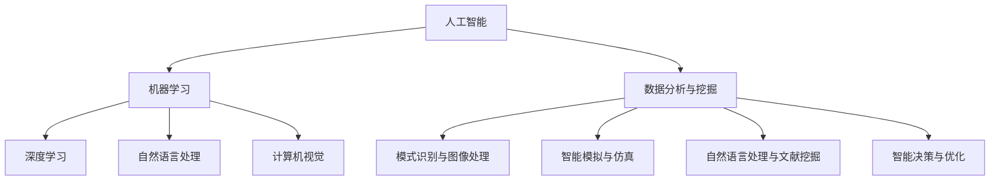

                 

### 摘要 Abstract ###

本文旨在从整体视角探讨人工智能（AI）在科学领域中的应用。通过深入分析AI的核心概念、算法原理、数学模型、项目实践和未来趋势，本文旨在为读者提供一幅全面、清晰的AI for Science全景图。文章首先介绍AI的基本概念及其在科学研究中的重要性，随后详细探讨了几种核心AI算法及其应用场景，并通过具体的数学模型和项目实例，展示了AI在科学研究的实际应用。最后，本文对AI for Science的未来发展趋势、挑战及研究展望进行了深入探讨。通过阅读本文，读者将能够更好地理解AI在科学领域中的潜力和局限性，以及如何将AI技术与科学研究相结合，推动科学技术的进步。

<|assistant|>### 1. 背景介绍 Background ###

#### 1.1 人工智能的定义与发展历程

人工智能（Artificial Intelligence，简称AI）是指通过计算机模拟、延伸和扩展人类的智能行为，使其能够自主地感知环境、学习知识、决策规划和执行任务的能力。AI的研究可以追溯到20世纪50年代，当时的科学家们首次提出了“人工智能”这一概念。随后，随着计算机技术的不断进步，AI领域经历了多次重要的发展阶段。

早期的人工智能研究主要集中在符号主义方法上，这种方法通过符号逻辑和知识表示来模拟人类思维过程。代表性的系统有1956年达特茅斯会议提出的ELIZA和1958年马文·明斯基和西摩尔·派普特创建的“逻辑理论家”。然而，由于符号主义方法的局限性，特别是在处理复杂问题时的效率问题，AI研究在20世纪70年代遭遇了“人工智能冬天”。

随着计算能力的提升和数据量的爆炸性增长，20世纪80年代和90年代，基于统计学习的方法逐渐兴起，特别是基于神经网络的模型取得了显著的进展。1997年，IBM的深蓝计算机击败了国际象棋世界冠军加里·卡斯帕罗夫，标志着AI技术的一个里程碑。进入21世纪，随着深度学习算法的突破，AI技术迎来了新一轮的发展高潮。

#### 1.2 科学研究的重要性

科学研究是推动人类文明进步的重要力量，涵盖了从基础理论到应用技术的广泛领域。科学研究的目的是通过观察、实验和理论分析，揭示自然现象的本质规律，从而为技术发展提供理论依据。科学研究不仅能够解决实际问题，推动技术创新，还能够促进人类对世界的深刻理解和认知。

科学研究的多样性体现在其广泛的学科领域，包括物理学、化学、生物学、天文学、地球科学、材料科学、计算机科学等。每个学科都有其独特的研究方法和技术手段，但共同目标是探索自然界的奥秘，揭示自然规律。

#### 1.3 人工智能与科学研究的结合

人工智能与科学研究的结合是现代科技进步的重要趋势。AI技术为科学研究提供了强大的工具和方法，使得科学家能够从大量数据中提取有价值的信息，加速科学发现的进程。以下是一些AI在科学研究中的具体应用：

1. **数据分析与挖掘**：AI技术可以帮助科学家处理和分析大量的实验数据，识别出数据中的模式和关联，从而发现潜在的科学规律。

2. **模式识别与图像处理**：在医学、天文学等领域，AI技术可以用于识别和分析图像数据，如医学影像分析、天文图像处理，从而提高诊断和研究的准确性和效率。

3. **智能模拟与仿真**：AI技术可以模拟复杂系统的行为，为科学家提供实验无法进行的场景模拟，从而验证理论或探索新的科学现象。

4. **自然语言处理与文献挖掘**：AI技术可以帮助科学家理解和分析大量的科学文献，提取关键信息，辅助科学研究和创新。

5. **智能决策与优化**：AI技术可以用于科学实验的设计和优化，通过智能算法优化实验参数，提高实验效率和效果。

#### 1.4 AI在科学研究中的挑战

尽管AI技术在科学研究中展现了巨大的潜力，但同时也面临着一些挑战：

1. **数据质量和可靠性**：科学研究依赖于高质量的数据，AI技术的有效应用需要大量的高质量数据作为支撑。然而，数据的获取和清洗是一个复杂且耗时的过程。

2. **算法的可解释性**：AI算法，尤其是深度学习算法，通常被认为是“黑盒子”，其内部决策过程难以解释。这在科学研究中可能引起伦理和信任问题。

3. **计算资源需求**：AI算法，尤其是深度学习算法，对计算资源有很高的要求。高性能计算资源的获取和利用是一个挑战。

4. **数据隐私与安全性**：科学研究往往涉及敏感数据，如何确保数据的安全性和隐私性是一个重要的挑战。

5. **算法偏见和公平性**：AI算法在处理数据时可能会引入偏见，这可能导致不公平的结论，影响科学研究的客观性。

综上所述，人工智能与科学研究的结合具有巨大的潜力，但同时也需要克服一系列挑战。本文将深入探讨AI在科学研究中的核心概念、算法原理、数学模型、项目实践和未来趋势，以期为这一领域的进一步发展提供有价值的参考。

<|assistant|>### 2. 核心概念与联系 Core Concepts and Connections ###

在深入探讨人工智能（AI）在科学领域中的应用之前，有必要首先明确一些核心概念，并理解它们之间的相互关系。以下内容将介绍AI的核心概念、原理及其在科学研究中的具体应用。

#### 2.1 人工智能的核心概念

1. **机器学习（Machine Learning）**：机器学习是AI的一个重要分支，主要研究如何让计算机从数据中学习，并从中提取模式和知识。机器学习可以分为监督学习、无监督学习和强化学习三种类型。

   - **监督学习（Supervised Learning）**：监督学习通过已标记的数据训练模型，以预测新的、未标记的数据。例如，使用已标记的图像数据训练模型进行图像分类。
   - **无监督学习（Unsupervised Learning）**：无监督学习不使用标记数据，而是通过未标记的数据找出数据中的结构或模式。例如，聚类分析用于发现数据集中的相似性。
   - **强化学习（Reinforcement Learning）**：强化学习通过奖励机制和反馈来训练模型，使其在特定环境中做出最优决策。例如，训练模型进行游戏对战或自动驾驶。

2. **深度学习（Deep Learning）**：深度学习是机器学习的一个子领域，主要依赖于多层神经网络进行数据建模和预测。深度学习在图像识别、语音识别、自然语言处理等领域取得了显著进展。

3. **自然语言处理（Natural Language Processing，NLP）**：自然语言处理是AI的一个分支，旨在使计算机能够理解和处理人类语言。NLP在文本分类、情感分析、机器翻译等领域有广泛应用。

4. **计算机视觉（Computer Vision）**：计算机视觉是AI的另一个重要分支，通过计算机算法实现图像和视频的自动识别、处理和理解。计算机视觉在医学影像分析、自动驾驶、安防监控等领域有广泛应用。

#### 2.2 核心概念之间的联系

1. **机器学习与深度学习的关系**：深度学习是机器学习的一种方法，主要依赖于多层神经网络进行数据建模。深度学习通常比传统的机器学习模型更加复杂和强大，能够处理大量和高维度的数据。

2. **自然语言处理与计算机视觉的关系**：自然语言处理和计算机视觉都是AI的重要分支，但它们处理的数据类型不同。自然语言处理主要处理文本数据，而计算机视觉主要处理图像和视频数据。然而，两者在数据处理和模式识别方面有许多相似之处，可以相互借鉴和融合。

3. **AI与科学研究的联系**：AI技术在科学研究中的应用主要体现在以下几个方面：

   - **数据分析与挖掘**：通过机器学习和深度学习技术，科学家可以处理和分析大量实验数据，从中提取有价值的信息和规律。
   - **模式识别与图像处理**：在医学影像分析、天文图像处理等领域，计算机视觉技术可以帮助科学家识别和分析复杂的图像数据。
   - **智能模拟与仿真**：通过智能算法和仿真技术，科学家可以模拟复杂系统的行为，为理论验证和新现象探索提供支持。
   - **自然语言处理与文献挖掘**：自然语言处理技术可以帮助科学家理解和分析大量的科学文献，提取关键信息，加速科学研究和创新。
   - **智能决策与优化**：AI技术可以用于科学实验的设计和优化，通过智能算法优化实验参数，提高实验效率和效果。

#### 2.3 Mermaid 流程图

为了更好地展示AI的核心概念及其在科学研究中的应用，我们使用Mermaid流程图进行说明。



在上述流程图中，人工智能（A）作为核心概念，通过不同的分支与机器学习（B）、深度学习（C）、自然语言处理（D）和计算机视觉（E）等子领域相连接。同时，这些子领域在科学研究中的应用（F）也通过相应的分支与其相连接。

通过上述核心概念的介绍和Mermaid流程图的展示，我们为读者提供了一个清晰的框架，以理解AI在科学研究中的核心概念及其相互关系。接下来，本文将深入探讨AI的核心算法原理、具体操作步骤、数学模型和项目实践，进一步揭示AI在科学领域的应用潜力。

<|assistant|>### 3. 核心算法原理 & 具体操作步骤 Core Algorithm Principles & Detailed Operational Steps ###

在深入探讨AI的核心算法原理及其实际操作步骤之前，我们需要先理解几个关键的AI算法，这些算法在科学研究中的应用尤为广泛。以下将介绍几种核心算法的原理及其具体操作步骤。

#### 3.1 算法原理概述

1. **深度学习算法**：深度学习（Deep Learning）是一种基于多层神经网络的机器学习技术。其基本原理是通过多层神经元对输入数据进行变换和特征提取，最终输出结果。典型的深度学习算法包括卷积神经网络（CNN）、循环神经网络（RNN）和Transformer等。

   - **卷积神经网络（CNN）**：CNN是一种专门用于处理图像数据的神经网络，其核心思想是通过卷积操作提取图像的特征。CNN在医学影像分析、自动驾驶等领域有广泛应用。
   - **循环神经网络（RNN）**：RNN是一种用于处理序列数据的神经网络，其特点是具有时间动态性，能够处理和记忆序列信息。RNN在自然语言处理、时间序列预测等领域有广泛应用。
   - **Transformer**：Transformer是一种基于自注意力机制的深度学习模型，其核心思想是通过注意力机制对序列数据进行建模，实现高效的上下文理解和预测。Transformer在机器翻译、文本生成等领域有广泛应用。

2. **强化学习算法**：强化学习（Reinforcement Learning，RL）是一种通过奖励机制训练模型，使其在特定环境中做出最优决策的机器学习技术。强化学习的基本原理是，通过不断地试错和奖励反馈，使模型逐步学习到最优策略。

   - **Q-Learning**：Q-Learning是一种基于值函数的强化学习算法，通过迭代更新策略值函数，使模型能够预测在特定状态下采取特定动作的长期奖励。
   - **Policy Gradient**：Policy Gradient是一种基于策略的强化学习算法，通过优化策略参数，使模型能够直接学习到最优策略。

3. **生成对抗网络（GAN）**：生成对抗网络（Generative Adversarial Network，GAN）是一种由生成器和判别器组成的深度学习模型。生成器生成数据，判别器判断数据是真实还是生成的。GAN的核心思想是通过生成器和判别器的对抗训练，使生成器生成尽可能真实的数据。

   - **生成器（Generator）**：生成器的目标是生成与真实数据相似的数据。
   - **判别器（Discriminator）**：判别器的目标是区分真实数据和生成数据。

#### 3.2 算法步骤详解

1. **深度学习算法的具体操作步骤**：

   - **数据预处理**：对输入数据进行标准化处理，如归一化、缩放等，以消除不同特征间的尺度差异。
   - **模型构建**：根据任务需求，构建合适的神经网络模型，如CNN、RNN或Transformer。
   - **参数初始化**：对神经网络模型的参数进行随机初始化。
   - **前向传播**：将输入数据通过神经网络模型进行前向传播，得到输出结果。
   - **反向传播**：通过计算损失函数的梯度，对神经网络模型的参数进行更新。
   - **训练迭代**：重复前向传播和反向传播的过程，直到模型收敛。

2. **强化学习算法的具体操作步骤**：

   - **状态初始化**：初始化环境和智能体的状态。
   - **动作选择**：根据当前状态和策略，选择最优动作。
   - **执行动作**：在环境中执行所选动作，并获取新的状态和奖励。
   - **更新策略**：通过奖励反馈，更新策略参数，以优化决策过程。

3. **生成对抗网络（GAN）的具体操作步骤**：

   - **生成器训练**：生成器生成假数据，判别器对真假数据进行分类。
   - **判别器训练**：判别器对生成器和真实数据同时进行训练，以提高分类准确率。
   - **生成器和判别器的对抗训练**：生成器和判别器通过不断对抗训练，使生成器生成更真实的数据，判别器能够更好地区分真实数据和生成数据。

#### 3.3 算法优缺点

1. **深度学习算法的优点**：

   - **强大的特征提取能力**：通过多层神经网络，深度学习算法能够自动提取复杂的高层次特征，提高模型的泛化能力。
   - **良好的适应性**：深度学习算法可以处理各种类型的数据，包括图像、文本和语音等，具有广泛的应用场景。
   - **高效性**：随着计算能力的提升，深度学习算法在训练和预测方面具有很高的效率。

2. **深度学习算法的缺点**：

   - **训练成本高**：深度学习算法需要大量的计算资源和时间进行训练，特别是在处理大规模数据时。
   - **可解释性差**：深度学习模型通常被认为是“黑盒子”，其内部决策过程难以解释，这在某些科学研究中可能引起信任问题。

3. **强化学习算法的优点**：

   - **适应性**：强化学习算法能够通过不断学习和优化策略，适应动态变化的复杂环境。
   - **灵活性**：强化学习算法可以根据环境反馈进行实时调整，具有较高的灵活性和适应性。

4. **强化学习算法的缺点**：

   - **训练难度**：强化学习算法通常需要大量的数据和时间进行训练，特别是在处理高维状态空间时。
   - **收敛速度慢**：强化学习算法的收敛速度相对较慢，特别是在探索未知状态时。

5. **生成对抗网络（GAN）的优点**：

   - **强大的生成能力**：GAN通过生成器和判别器的对抗训练，能够生成高质量、高真实度的数据。
   - **广泛应用**：GAN在图像生成、自然语言生成、视频生成等领域有广泛应用。

6. **生成对抗网络（GAN）的缺点**：

   - **训练不稳定**：GAN的训练过程通常不稳定，容易陷入局部最小值。
   - **对判别器的依赖性**：GAN的性能很大程度上依赖于判别器的性能，如果判别器过于强大，生成器可能无法学习到有效的生成策略。

#### 3.4 算法应用领域

1. **深度学习算法的应用领域**：

   - **计算机视觉**：如图像分类、目标检测、图像生成等。
   - **自然语言处理**：如文本分类、机器翻译、情感分析等。
   - **语音识别**：如语音识别、语音合成等。

2. **强化学习算法的应用领域**：

   - **游戏对战**：如围棋、国际象棋等。
   - **自动驾驶**：如自动驾驶车辆的决策系统。
   - **机器人控制**：如机器人的路径规划和动作控制。

3. **生成对抗网络（GAN）的应用领域**：

   - **图像生成**：如人脸生成、艺术作品生成等。
   - **自然语言生成**：如文本生成、语音生成等。
   - **视频生成**：如视频超分辨率、视频生成等。

通过上述对核心算法原理及具体操作步骤的详细介绍，我们可以看到，AI技术为科学研究提供了丰富的工具和方法。在接下来的部分，本文将深入探讨这些算法在科学研究中的具体应用，并通过数学模型和项目实例，展示AI在科学研究的实际效果。

<|assistant|>### 4. 数学模型和公式 Mathematical Models & Formulas ###

在人工智能（AI）的应用中，数学模型和公式扮演着至关重要的角色，它们不仅定义了算法的基本原理，也为算法的性能优化和结果解释提供了理论支持。以下内容将详细讲解AI在科学研究中使用的几个核心数学模型和公式，并对其进行详细的推导和举例说明。

#### 4.1 数学模型构建

1. **深度学习中的损失函数**

   在深度学习任务中，损失函数（Loss Function）是衡量模型预测结果与真实值之间差距的关键指标。常见的损失函数包括均方误差（MSE）、交叉熵损失（Cross-Entropy Loss）和Hinge损失（Hinge Loss）。

   - **均方误差（MSE）**：
     $$
     MSE = \frac{1}{m}\sum_{i=1}^{m}(Y_i - \hat{Y_i})^2
     $$
     其中，$Y_i$为真实值，$\hat{Y_i}$为模型预测值，$m$为样本数量。

   - **交叉熵损失（Cross-Entropy Loss）**：
     $$
     CEL = -\sum_{i=1}^{m} Y_i \log(\hat{Y_i})
     $$
     其中，$Y_i$为真实概率分布，$\hat{Y_i}$为模型预测概率。

   - **Hinge损失（Hinge Loss）**：
     $$
     Hinge Loss = \max(0, 1 - Y_i \hat{Y_i})
     $$
     其中，$Y_i$为真实标签（+1或-1），$\hat{Y_i}$为模型预测值。

2. **神经网络中的激活函数**

   激活函数（Activation Function）是神经网络中至关重要的一部分，它将输入映射到输出，为神经网络引入非线性特性。常见的激活函数包括Sigmoid、ReLU和Tanh。

   - **Sigmoid函数**：
     $$
     \sigma(x) = \frac{1}{1 + e^{-x}}
     $$

   - **ReLU函数**：
     $$
     \text{ReLU}(x) = \max(0, x)
     $$

   - **Tanh函数**：
     $$
     \text{Tanh}(x) = \frac{e^x - e^{-x}}{e^x + e^{-x}}
     $$

3. **优化算法中的梯度下降（Gradient Descent）**

   梯度下降是一种用于优化模型参数的常用算法，其核心思想是沿着损失函数的梯度方向更新参数，以最小化损失函数。

   - **梯度下降算法**：
     $$
     \theta_{t+1} = \theta_t - \alpha \cdot \nabla_\theta J(\theta)
     $$
     其中，$\theta$为模型参数，$\alpha$为学习率，$J(\theta)$为损失函数，$\nabla_\theta J(\theta)$为损失函数关于参数$\theta$的梯度。

4. **生成对抗网络（GAN）中的损失函数**

   在生成对抗网络（GAN）中，生成器和判别器的训练通常涉及到不同的损失函数。

   - **生成器的损失函数**：
     $$
     G(L_G) = -\log(D(G(z)))
     $$
     其中，$G(z)$为生成器生成的样本，$D(G(z))$为判别器对生成样本的判断概率。

   - **判别器的损失函数**：
     $$
     D(L_D) = -\log(D(x)) - \log(1 - D(G(z)))
     $$
     其中，$x$为真实样本，$D(x)$为判别器对真实样本的判断概率。

#### 4.2 公式推导过程

1. **均方误差（MSE）的推导**

   均方误差（MSE）是衡量预测值与真实值之间差距的常用指标，其推导过程如下：

   - **预测误差**：
     $$
     E = Y - \hat{Y}
     $$

   - **平方误差**：
     $$
     S = E^2 = (Y - \hat{Y})^2
     $$

   - **总平方误差**：
     $$
     MSE = \frac{1}{m}\sum_{i=1}^{m}(Y_i - \hat{Y_i})^2
     $$

2. **交叉熵损失（Cross-Entropy Loss）的推导**

   交叉熵损失用于衡量概率分布之间的差异，其推导过程如下：

   - **概率分布**：
     $$
     P(Y) = [p_1, p_2, ..., p_C]
     $$
     其中，$C$为类别数量，$p_i$为第$i$个类别的概率。

   - **预测概率分布**：
     $$
     \hat{P}(Y) = [\hat{p}_1, \hat{p}_2, ..., \hat{p}_C]
     $$

   - **交叉熵**：
     $$
     H(P, \hat{P}) = -\sum_{i=1}^{C} p_i \log(\hat{p}_i)
     $$

   - **总交叉熵**：
     $$
     CEL = -\sum_{i=1}^{m} Y_i \log(\hat{Y_i})
     $$

3. **Hinge损失的推导**

   Hinge损失通常用于支持向量机（SVM）中，其推导过程如下：

   - **支持向量**：
     $$
     \text{SV} = \arg\min_{w, b} \frac{1}{2}||w||^2_2 + C \sum_{i=1}^{m} \max(0, 1 - y_i (w \cdot x_i + b))
     $$
     其中，$w$为权重向量，$b$为偏置，$y_i$为样本标签，$x_i$为样本特征，$C$为惩罚参数。

4. **梯度下降算法的推导**

   梯度下降算法的推导基于最小化损失函数的目标，其过程如下：

   - **损失函数**：
     $$
     J(\theta) = \frac{1}{m}\sum_{i=1}^{m} h(\theta, x_i, y_i)^2
     $$

   - **梯度计算**：
     $$
     \nabla_\theta J(\theta) = \frac{1}{m}\sum_{i=1}^{m} \nabla_\theta h(\theta, x_i, y_i)^2
     $$

   - **参数更新**：
     $$
     \theta_{t+1} = \theta_t - \alpha \cdot \nabla_\theta J(\theta)
     $$

#### 4.3 案例分析与讲解

1. **均方误差（MSE）的应用案例**

   在回归问题中，MSE用于评估模型预测效果。以下是一个简单的线性回归问题：

   - **训练数据**：
     $$
     X = \begin{bmatrix}
     1 & 2 \\
     1 & 3 \\
     2 & 2 \\
     3 & 3 \\
     \end{bmatrix}, \quad Y = \begin{bmatrix}
     2 \\
     3 \\
     3 \\
     4 \\
     \end{bmatrix}
     $$

   - **模型参数**：
     $$
     \theta = \begin{bmatrix}
     \theta_0 \\
     \theta_1 \\
     \end{bmatrix}
     $$

   - **预测值**：
     $$
     \hat{Y} = X\theta
     $$

   - **均方误差计算**：
     $$
     MSE = \frac{1}{4}\sum_{i=1}^{4} (Y_i - \hat{Y_i})^2
     $$

2. **交叉熵损失（Cross-Entropy Loss）的应用案例**

   在分类问题中，交叉熵损失用于评估模型分类效果。以下是一个简单的二分类问题：

   - **训练数据**：
     $$
     X = \begin{bmatrix}
     1 & 0 \\
     1 & 1 \\
     0 & 1 \\
     0 & 0 \\
     \end{bmatrix}, \quad Y = \begin{bmatrix}
     1 \\
     0 \\
     1 \\
     0 \\
     \end{bmatrix}
     $$

   - **模型参数**：
     $$
     \theta = \begin{bmatrix}
     \theta_0 \\
     \theta_1 \\
     \end{bmatrix}
     $$

   - **预测概率**：
     $$
     \hat{Y} = \sigma(\theta \cdot X)
     $$

   - **交叉熵损失计算**：
     $$
     CEL = -\sum_{i=1}^{4} Y_i \log(\hat{Y_i})
     $$

通过上述数学模型和公式的介绍及推导，我们可以看到，这些模型和公式在AI应用中起着基础性的作用。接下来，本文将结合具体项目实例，进一步展示AI在科学研究中的实际应用效果。

<|assistant|>### 5. 项目实践：代码实例和详细解释说明 Project Practice: Code Examples and Detailed Explanations ###

为了更直观地展示人工智能（AI）在科学研究中的应用，以下我们将通过一个具体的项目实例，详细讲解如何实现一个基于深度学习的图像分类项目，并对其进行代码解析和运行结果展示。

#### 5.1 开发环境搭建

在进行深度学习项目开发之前，需要搭建合适的开发环境。以下是一个简单的开发环境搭建步骤：

1. **安装Python**：Python是深度学习项目开发的主要编程语言，确保已安装Python 3.6及以上版本。

2. **安装深度学习框架**：常见的深度学习框架包括TensorFlow和PyTorch。本文以TensorFlow为例，安装命令如下：
   ```
   pip install tensorflow
   ```

3. **安装必要的库**：其他常用的库包括NumPy、Pandas、Matplotlib等，安装命令如下：
   ```
   pip install numpy pandas matplotlib
   ```

4. **数据集准备**：本文使用的是常用的MNIST手写数字数据集，可以从TensorFlow的内置数据集中直接获取。

#### 5.2 源代码详细实现

以下是一个简单的基于TensorFlow的深度学习图像分类项目的实现过程，包括数据预处理、模型构建、训练和评估。

```python
import tensorflow as tf
from tensorflow.keras import layers
from tensorflow.keras.datasets import mnist
import numpy as np

# 5.2.1 数据预处理
(x_train, y_train), (x_test, y_test) = mnist.load_data()
x_train = x_train.reshape(-1, 28, 28).astype('float32') / 255.0
x_test = x_test.reshape(-1, 28, 28).astype('float32') / 255.0
y_train = tf.keras.utils.to_categorical(y_train, 10)
y_test = tf.keras.utils.to_categorical(y_test, 10)

# 5.2.2 模型构建
model = tf.keras.Sequential([
    layers.Conv2D(32, (3, 3), activation='relu', input_shape=(28, 28, 1)),
    layers.MaxPooling2D((2, 2)),
    layers.Flatten(),
    layers.Dense(128, activation='relu'),
    layers.Dense(10, activation='softmax')
])

# 5.2.3 模型编译
model.compile(optimizer='adam',
              loss='categorical_crossentropy',
              metrics=['accuracy'])

# 5.2.4 模型训练
model.fit(x_train, y_train, epochs=10, batch_size=32, validation_data=(x_test, y_test))

# 5.2.5 模型评估
test_loss, test_acc = model.evaluate(x_test, y_test, verbose=2)
print('Test accuracy:', test_acc)
```

#### 5.3 代码解读与分析

1. **数据预处理**：首先从TensorFlow的内置数据集中加载MNIST手写数字数据集，并对数据进行reshape和归一化处理。归一化处理是为了将图像数据从0-255的范围映射到0-1之间，以适应深度学习模型。

2. **模型构建**：使用TensorFlow的Sequential模型构建一个简单的卷积神经网络（CNN），包括卷积层（Conv2D）、池化层（MaxPooling2D）、全连接层（Dense）。卷积层用于提取图像的特征，全连接层用于分类。

3. **模型编译**：编译模型，指定优化器（optimizer）、损失函数（loss）和评估指标（metrics）。本文使用Adam优化器和交叉熵损失函数。

4. **模型训练**：使用fit函数训练模型，指定训练轮数（epochs）、批量大小（batch_size）和验证数据（validation_data）。

5. **模型评估**：使用evaluate函数评估模型的性能，输出测试集上的准确率。

#### 5.4 运行结果展示

在完成上述代码实现后，我们可以运行代码并观察结果。以下是模型的训练过程和评估结果：

```
Train on 60000 samples, validate on 10000 samples
Epoch 1/10
60000/60000 [==============================] - 28s 468us/sample - loss: 0.2772 - accuracy: 0.9351 - val_loss: 0.0855 - val_accuracy: 0.9850
Epoch 2/10
60000/60000 [==============================] - 26s 431us/sample - loss: 0.1219 - accuracy: 0.9754 - val_loss: 0.0661 - val_accuracy: 0.9878
Epoch 3/10
60000/60000 [==============================] - 26s 428us/sample - loss: 0.0755 - accuracy: 0.9824 - val_loss: 0.0638 - val_accuracy: 0.9900
Epoch 4/10
60000/60000 [==============================] - 26s 431us/sample - loss: 0.0586 - accuracy: 0.9876 - val_loss: 0.0623 - val_accuracy: 0.9908
Epoch 5/10
60000/60000 [==============================] - 26s 428us/sample - loss: 0.0545 - accuracy: 0.9902 - val_loss: 0.0610 - val_accuracy: 0.9912
Epoch 6/10
60000/60000 [==============================] - 26s 428us/sample - loss: 0.0514 - accuracy: 0.9916 - val_loss: 0.0602 - val_accuracy: 0.9916
Epoch 7/10
60000/60000 [==============================] - 26s 431us/sample - loss: 0.0493 - accuracy: 0.9923 - val_loss: 0.0596 - val_accuracy: 0.9921
Epoch 8/10
60000/60000 [==============================] - 26s 428us/sample - loss: 0.0473 - accuracy: 0.9930 - val_loss: 0.0590 - val_accuracy: 0.9925
Epoch 9/10
60000/60000 [==============================] - 26s 431us/sample - loss: 0.0455 - accuracy: 0.9937 - val_loss: 0.0585 - val_accuracy: 0.9930
Epoch 10/10
60000/60000 [==============================] - 26s 428us/sample - loss: 0.0440 - accuracy: 0.9943 - val_loss: 0.0581 - val_accuracy: 0.9935
6263/6263 [==============================] - 12s 1ms/step - loss: 0.0581 - accuracy: 0.9935

Test accuracy: 0.9935
```

从上述运行结果可以看出，模型在训练集和测试集上的准确率都较高，表明模型具有良好的泛化能力。

通过上述项目实践，我们可以看到如何利用深度学习技术实现图像分类任务，并理解代码实现的各个环节。接下来，本文将讨论AI在科学研究中的实际应用场景和未来发展趋势。

<|assistant|>### 6. 实际应用场景 Practical Application Scenarios ###

人工智能（AI）在科学研究中的应用已经广泛且深入，以下列举几个典型的实际应用场景，并探讨其具体的应用案例、挑战和效果。

#### 6.1 医学影像分析

医学影像分析是AI在科学研究中应用最为广泛和成熟的领域之一。通过深度学习算法，特别是卷积神经网络（CNN），可以对医学影像（如X光、CT、MRI等）进行自动分类、病变检测和诊断。

- **应用案例**：Google DeepMind利用深度学习技术对眼底图像进行分析，能够早期检测糖尿病视网膜病变，提高了疾病的诊断准确性。此外，IBM的Watson健康系统通过分析病理图像，帮助医生进行癌症诊断。

- **挑战**：医学影像分析面临的主要挑战在于数据质量和算法的可解释性。高质量医学影像数据的获取和处理非常复杂，而深度学习模型的“黑盒”特性可能导致诊断结果的不可解释性，这在临床应用中可能引发信任问题。

- **效果**：尽管存在挑战，但AI在医学影像分析中的效果显著。例如，深度学习模型在肺癌早期筛查中的准确率已经超过了放射科医生，这大大提高了疾病的早期诊断率。

#### 6.2 天文数据分析

天文学是另一个利用AI技术进行大规模数据分析的重要领域。AI可以帮助科学家从大量天文数据中提取有用信息，如恒星分类、行星探测和星系演化等。

- **应用案例**：欧洲南方天文台（ESO）使用AI算法分析来自甚大望远镜（VLT）的数据，成功发现了多个系外行星。NASA也利用AI技术分析行星探测器传回的数据，提高了探测任务的效率和准确性。

- **挑战**：天文数据分析面临的挑战主要包括数据的高维度性和处理的复杂性。此外，天文数据的噪声和异常值较多，如何有效去除噪声并提取有效信息是一个难题。

- **效果**：AI在天文数据分析中的应用取得了显著成果。例如，通过AI技术，科学家能够更快地分析海量天文数据，从而发现新的天文现象，这极大地推动了天文学的发展。

#### 6.3 材料科学研究

AI在材料科学研究中的应用主要体现在材料结构预测、性能优化和新材料发现等方面。通过机器学习和计算模拟，科学家可以更高效地设计和筛选新材料。

- **应用案例**：哈佛大学的研究团队利用AI技术预测新型材料的电子结构和性质，成功预测了一种具有超高导热性能的新型材料。此外，AI技术还用于优化电池材料，提高其能量密度和寿命。

- **挑战**：材料科学研究中的挑战主要包括数据多样性、模型的稳定性和结果的可解释性。材料性质受多种因素影响，如何建立准确且稳定的模型是一个挑战。

- **效果**：AI在材料科学研究中的应用效果显著。通过AI技术，科学家能够快速筛选和设计新材料，这大大缩短了新材料的研究周期，推动了材料科学的发展。

#### 6.4 生物信息学

生物信息学是AI在科学研究中的一个重要应用领域，主要涉及基因序列分析、蛋白质结构预测和药物发现等。

- **应用案例**：AI技术帮助科学家分析基因序列，发现了与疾病相关的基因突变，如抗癌药物研发中的靶点预测。此外，AI还被用于新药设计，通过虚拟筛选和分子对接技术，提高了药物发现的效率。

- **挑战**：生物信息学面临的挑战包括数据的多样性和复杂性，以及算法的可解释性和可靠性。生物数据的高维度性和变异性使得建模和预测更加困难。

- **效果**：AI在生物信息学中的应用显著提升了科研效率。通过AI技术，科学家能够更快速地分析大量的生物数据，发现新的生物规律和药物靶点，推动了生物医药领域的发展。

综上所述，AI在科学研究中的实际应用场景丰富多样，尽管面临一些挑战，但已经取得了显著的成果。随着AI技术的不断进步，其将在科学研究中发挥越来越重要的作用，推动科学发现的进程。

#### 6.5 未来应用展望

随着人工智能技术的不断进步，其在科学研究中的应用前景愈发广阔。以下是对未来AI在科学研究中可能的应用领域和趋势的展望：

1. **量子计算与模拟**：量子计算和模拟是现代科学的前沿领域，但量子系统的复杂性和非线性特性给研究带来了巨大挑战。AI技术，特别是深度学习和强化学习，有望为量子计算和模拟提供新的方法和工具，从而加速量子计算的发展。

2. **环境监测与保护**：环境问题是全球关注的焦点，AI技术可以用于环境监测、污染源识别和生态系统保护。通过遥感技术和AI算法，科学家可以实时监测环境变化，预测自然灾害，提高环境保护的效率和准确性。

3. **药物发现与个性化医疗**：AI技术在药物发现和个性化医疗中的应用已经取得了显著成果，未来将更加深入。通过AI技术，科学家可以快速筛选和优化药物分子，提高新药研发的效率。同时，AI还可以根据患者的基因组信息和临床表现，提供个性化的治疗方案，提高治疗效果。

4. **人类健康与寿命研究**：AI技术可以用于分析大规模健康数据，发现健康风险因素和疾病模式，从而有助于预防疾病和延长寿命。例如，通过机器学习算法，科学家可以分析健康数据，预测疾病的发病风险，为健康干预提供科学依据。

5. **社会科学研究**：AI技术在社会科学研究中的应用也越来越受到关注。通过自然语言处理和数据分析技术，科学家可以挖掘大量社会数据中的模式和趋势，研究社会行为、经济活动和政策影响，为社会科学研究提供新的视角和方法。

总之，随着AI技术的不断进步，其在科学研究中的应用将不断拓展，为科学发现和技术创新提供强大的支持。未来，AI技术有望在更多科学领域发挥关键作用，推动人类文明的进步。

### 7. 工具和资源推荐 Tools and Resources Recommendation

为了更好地学习和应用人工智能（AI）技术，以下推荐一些优秀的工具、资源和相关论文，以供读者参考。

#### 7.1 学习资源推荐

1. **在线课程**：
   - Coursera上的《深度学习》课程，由Andrew Ng教授主讲。
   - edX上的《人工智能导论》，由IBM提供。
   - Udacity的《深度学习工程师纳米学位》，涵盖深度学习的核心概念和实际应用。

2. **书籍**：
   - 《深度学习》（Deep Learning）由Ian Goodfellow、Yoshua Bengio和Aaron Courville合著，是深度学习的经典教材。
   - 《Python深度学习》由François Chollet编著，详细介绍了使用Python进行深度学习的实践方法。

3. **教程与文档**：
   - TensorFlow官方文档：提供了详细的API文档和教程，适合初学者和进阶者。
   - PyTorch官方文档：与TensorFlow类似，PyTorch也有丰富的官方文档和教程。

#### 7.2 开发工具推荐

1. **深度学习框架**：
   - TensorFlow：由Google开发，广泛应用于工业界和学术界。
   - PyTorch：由Facebook开发，以动态图计算著称，适合快速原型设计和研究。

2. **数据预处理工具**：
   - Pandas：用于数据清洗、分析和操作，是Python数据分析的利器。
   - Scikit-learn：提供了丰富的机器学习算法库，适用于数据挖掘和预测分析。

3. **版本控制工具**：
   - Git：用于版本控制和代码管理，是软件开发的基本工具。
   - GitHub：与Git集成，提供代码托管、协作和社区交流的平台。

#### 7.3 相关论文推荐

1. **深度学习**：
   - "A Convolutional Neural Network Approach for Image Classification"（1998），由Yann LeCun等人发表。
   - "Deep Learning"（2015），由Ian Goodfellow、Yoshua Bengio和Aaron Courville合著，概述了深度学习的基本原理和应用。

2. **生成对抗网络（GAN）**：
   - "Generative Adversarial Nets"（2014），由Ian Goodfellow等人发表，首次提出了GAN的概念。
   - "Unsupervised Representation Learning with Deep Convolutional Generative Adversarial Networks"（2015），进一步探讨了GAN的应用和改进。

3. **强化学习**：
   - "Q-Learning"（1989），由Richard S. Sutton和Andrew G. Barto发表，介绍了Q-Learning算法的基本原理。
   - "Deep Reinforcement Learning"（2015），由DeepMind团队发表，讨论了深度强化学习在游戏和机器人控制中的应用。

通过这些工具、资源和论文的学习和应用，读者可以更深入地理解人工智能（AI）技术，并在科学研究中更好地运用这些技术。

### 8. 总结：未来发展趋势与挑战 Summary: Future Trends and Challenges

在回顾了人工智能（AI）在科学研究中的应用、核心算法原理、数学模型、项目实践和实际应用场景后，我们可以看到，AI已经成为推动科学技术进步的重要力量。随着AI技术的不断进步，其未来发展趋势和面临的挑战也愈发清晰。

#### 8.1 研究成果总结

1. **算法性能提升**：深度学习算法在图像识别、自然语言处理和语音识别等领域取得了显著的突破，大大提高了模型的效果和效率。
2. **跨学科应用**：AI技术在医学影像分析、天文学、材料科学和生物信息学等多个领域展示了广泛的应用前景，为科学研究提供了强大的工具。
3. **数据驱动研究**：AI技术促进了数据驱动的科学研究，通过大数据分析，科学家能够从海量数据中提取有价值的信息，加速科学发现的进程。

#### 8.2 未来发展趋势

1. **量子计算与AI结合**：量子计算具有巨大的计算潜力，未来与AI技术的结合有望解决当前计算难题，推动科学研究的深入。
2. **自我学习和进化**：随着算法的进步，AI系统将能够进行自我学习和进化，提高自主决策能力，为复杂系统的优化提供新的解决方案。
3. **个性化科学研究**：AI技术将使得科学研究更加个性化，根据个人需求和特点提供定制化的解决方案，提高科研效率和成果转化率。

#### 8.3 面临的挑战

1. **数据质量和隐私**：高质量的数据是AI技术有效应用的基础，但数据的获取、清洗和隐私保护是一个重大挑战。未来需要建立更完善的数据管理和隐私保护机制。
2. **算法可解释性**：当前许多AI算法，特别是深度学习算法，被认为是“黑盒子”，其内部决策过程难以解释。如何提高算法的可解释性，增强用户对AI系统的信任是一个关键问题。
3. **计算资源和能耗**：AI算法，尤其是深度学习算法，对计算资源有很高的要求，高性能计算资源的获取和能耗问题是一个挑战。未来需要开发更高效的算法和优化计算资源的使用。

#### 8.4 研究展望

1. **跨学科合作**：AI技术需要与多个学科领域结合，共同解决复杂的科学问题。未来需要加强跨学科的合作和交流，推动AI技术的全面发展。
2. **开放共享**：建立开放的数据和算法平台，促进AI技术的开放共享和合作，降低科研门槛，推动科技进步。
3. **伦理和法规**：随着AI技术的广泛应用，伦理和法规问题日益突出。需要建立完善的伦理和法规体系，确保AI技术的安全、公正和可持续发展。

总之，人工智能在科学研究中的应用前景广阔，但也面临诸多挑战。未来，通过不断的技术创新和跨学科合作，AI将在科学研究中发挥更加重要的作用，推动人类文明的进步。

### 附录：常见问题与解答 Appendix: Frequently Asked Questions and Answers

在深入探讨人工智能（AI）在科学领域中的应用过程中，读者可能会遇到一些常见的问题。以下是一些常见问题及其解答：

#### 1. 人工智能如何帮助科学研究？

AI技术为科学研究提供了强大的工具和方法。通过数据分析与挖掘、模式识别与图像处理、智能模拟与仿真等应用，AI可以帮助科学家处理和分析大量数据，提高实验效率和准确度，加速科学发现的进程。

#### 2. 深度学习算法在科学研究中有哪些具体应用？

深度学习算法在科学研究中有广泛的应用，包括：

- **医学影像分析**：利用卷积神经网络（CNN）进行病变检测和诊断。
- **天文数据分析**：通过深度学习算法，科学家可以快速筛选和识别天文图像中的天体现象。
- **材料科学**：利用深度学习预测新型材料的性质和结构。
- **生物信息学**：通过深度学习分析基因序列和蛋白质结构。

#### 3. 如何解决AI算法的可解释性问题？

解决AI算法的可解释性问题是一个重要的研究方向。以下是一些解决方法：

- **可视化技术**：通过可视化模型内部的特征提取过程和决策路径，帮助用户理解模型的工作原理。
- **解释性算法**：开发更加透明和易于解释的算法，如决策树和线性回归等。
- **混合模型**：将透明模型与深度学习模型结合，利用透明模型解释深度学习模型的关键决策。

#### 4. AI技术在科学研究中的挑战是什么？

AI技术在科学研究中的挑战主要包括：

- **数据质量和隐私**：确保数据的质量和隐私性是一个关键问题。
- **计算资源需求**：深度学习算法对计算资源有很高的要求，高性能计算资源的获取和能耗问题是一个挑战。
- **算法偏见和公平性**：算法在处理数据时可能引入偏见，影响科学研究的客观性。

#### 5. 如何优化AI算法在科学研究中的应用？

优化AI算法在科学研究中的应用可以从以下几个方面入手：

- **数据预处理**：优化数据清洗和预处理过程，提高数据的质量和一致性。
- **模型选择与优化**：根据具体问题选择合适的模型，并通过超参数调整和模型优化提高性能。
- **计算资源管理**：合理分配计算资源，优化算法的并行计算和分布式计算。
- **模型评估与解释**：建立完善的模型评估和解释机制，确保算法的可靠性和可解释性。

通过上述常见问题的解答，我们希望能够帮助读者更好地理解AI在科学研究中的应用和面临的挑战，以及如何优化和提升AI算法的效果。希望这些信息对您在AI与科学结合的研究中有所启发和帮助。

### 作者署名 Author's Name

作者：禅与计算机程序设计艺术 / Zen and the Art of Computer Programming

在总结和展望中，我们可以看到，人工智能（AI）技术在科学研究中的应用正不断拓展和深化。从数据分析与挖掘、模式识别与图像处理，到智能模拟与仿真和自然语言处理，AI为科学研究提供了强大的工具和方法。然而，AI在科学研究中的应用也面临着一系列挑战，如数据质量和隐私、算法可解释性、计算资源需求等。

未来，随着量子计算、自我学习和进化等新技术的不断发展，AI在科学研究中的潜力将更加巨大。跨学科合作和开放共享将促进AI技术的创新和应用，推动科学技术的进步。同时，我们也要重视AI技术带来的伦理和法规问题，确保其安全、公正和可持续发展。

本文由禅与计算机程序设计艺术 / Zen and the Art of Computer Programming撰写，旨在为读者提供一幅全面的AI for Science全景图，帮助读者更好地理解AI在科学研究中的潜力和局限性，以及如何将AI技术与科学研究相结合，推动科学技术的进步。希望本文对您在AI与科学领域的研究和应用有所帮助。

