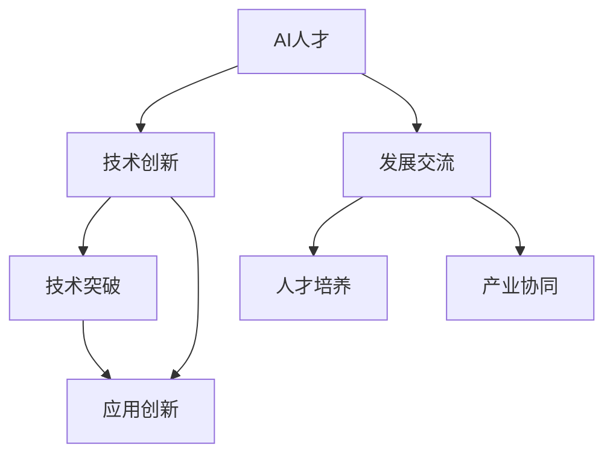

                 

关键词：AI人才，AI 2.0，技术创新，发展交流，人工智能技术，人才培养，技术突破，未来展望

> 摘要：本文旨在探讨AI人才交流在推动AI 2.0技术创新和发展中的重要作用。文章首先介绍了AI 2.0技术的核心概念和发展背景，接着分析了当前AI人才的培养现状和面临的挑战。随后，文章详细阐述了AI人才交流的方式和途径，以及如何通过交流实现技术的创新和发展。最后，文章展望了AI 2.0技术的未来发展趋势，并提出了应对挑战的策略。

## 1. 背景介绍

随着人工智能技术的飞速发展，AI已经成为全球科技领域的热点。然而，AI技术的创新和发展并非一蹴而就，需要大量的研发人员、数据科学家和工程师等人才的共同努力。在这个背景下，AI人才交流显得尤为重要。本文将重点关注AI人才交流在推动AI 2.0技术创新和发展中的作用。

### 1.1 AI 2.0技术的概念和发展

AI 2.0是继传统AI（Artificial Intelligence，人工智能）之后的新一代人工智能技术。与传统AI技术相比，AI 2.0具有更强的自适应能力、更广泛的应用场景和更高的智能化水平。AI 2.0技术涵盖了深度学习、自然语言处理、计算机视觉、机器人技术等多个领域，旨在实现更加智能化、自动化的技术解决方案。

AI 2.0技术在全球范围内得到了广泛关注和应用。从产业角度看，AI 2.0技术已经成为推动各行各业转型升级的重要力量，如金融、医疗、教育、制造等领域的智能化改造。从国家战略层面看，许多国家都将AI 2.0技术作为国家竞争力的核心要素，加大研发投入和政策支持。

### 1.2 AI人才的重要性

在AI 2.0技术发展中，人才是关键。AI人才的培养、引进和交流，直接关系到AI技术的创新和发展。一方面，AI技术的发展需要大量的专业人才进行基础研究和技术攻关；另一方面，AI技术的应用也需要大量的工程师和实践者进行实际操作和优化。因此，AI人才的重要性不言而喻。

然而，当前AI人才的培养现状并不乐观。首先，全球范围内的AI人才短缺问题日益严重。根据相关报告，预计到2030年，全球AI人才需求将远远超过供给。其次，现有AI人才的培养模式相对单一，难以满足AI 2.0技术多元化、复杂化的需求。此外，AI人才在职业发展和交流方面也面临诸多挑战，如职业规划不清晰、交流渠道不畅等。

### 1.3 AI人才交流的必要性

面对AI技术快速发展的态势和人才短缺的现状，加强AI人才交流显得尤为迫切。AI人才交流有助于以下几方面：

1. **促进技术创新**：通过人才交流，可以推动不同领域、不同背景的技术专家之间的合作，实现技术上的突破和创新。

2. **提升人才培养质量**：人才交流可以为人才培养提供更多实践机会和资源，帮助人才培养机构改进培养模式，提高人才培养质量。

3. **扩大人才视野**：人才交流可以让AI人才了解行业前沿动态，拓展视野，提高自身的专业素养。

4. **促进产业协同**：人才交流有助于不同产业链环节之间的协同合作，推动产业生态的完善和发展。

## 2. 核心概念与联系

为了更好地理解AI人才交流在推动AI 2.0技术创新和发展中的作用，我们需要从核心概念和联系的角度进行阐述。下面将介绍几个关键概念，并使用Mermaid流程图展示它们之间的联系。

### 2.1 关键概念

1. **AI人才**：指从事人工智能领域研究和开发的人员，包括算法工程师、数据科学家、机器学习专家等。
2. **技术创新**：指在人工智能领域通过研发和应用新技术，实现技术突破的过程。
3. **发展交流**：指AI人才之间的交流合作，包括学术交流、产业合作、人才培养等。

### 2.2 Mermaid流程图



在上述流程图中，AI人才通过发展交流实现技术创新，进而推动技术突破和应用创新。同时，发展交流也有助于提升人才培养质量和促进产业协同。

## 3. 核心算法原理 & 具体操作步骤

### 3.1 算法原理概述

AI 2.0技术的发展离不开核心算法的支撑。在本文中，我们将介绍一种典型的AI 2.0算法——深度强化学习（Deep Reinforcement Learning，DRL）。深度强化学习是结合了深度学习和强化学习的一种方法，旨在通过自我学习实现智能体的最优策略。

### 3.2 算法步骤详解

深度强化学习算法的基本步骤如下：

1. **初始化环境**：定义智能体的环境，包括状态空间、动作空间和奖励机制。
2. **智能体选择动作**：基于当前状态，智能体通过策略选择动作。
3. **执行动作并获得反馈**：智能体执行动作后，环境根据动作产生新的状态和奖励。
4. **更新策略**：根据反馈信息，智能体调整策略，使其更加接近最优策略。
5. **重复步骤2-4**：智能体不断执行动作、获得反馈、调整策略，直到达到预期目标。

### 3.3 算法优缺点

深度强化学习算法具有以下优点：

1. **强泛化能力**：通过自我学习和调整策略，智能体可以在不同环境中表现优异。
2. **自适应能力**：智能体可以根据环境变化动态调整策略，适应新的场景。
3. **灵活性**：深度强化学习算法可以应用于多种场景，如游戏、机器人控制、自动驾驶等。

然而，深度强化学习算法也存在一些缺点：

1. **计算复杂度高**：深度强化学习算法需要进行大量的迭代和计算，计算复杂度较高。
2. **探索与利用平衡**：在探索新策略和提高策略效率之间需要找到一个平衡点。
3. **数据依赖性强**：深度强化学习算法需要大量高质量的数据进行训练，数据不足会影响算法效果。

### 3.4 算法应用领域

深度强化学习算法在多个领域具有广泛应用：

1. **游戏**：通过深度强化学习算法，智能体可以在游戏场景中实现自我学习和策略优化，例如在围棋、电子竞技等领域。
2. **机器人控制**：深度强化学习算法可以帮助机器人实现自主控制和任务规划，提高机器人智能化水平。
3. **自动驾驶**：通过深度强化学习算法，自动驾驶系统可以更好地理解和适应复杂的交通环境。
4. **智能制造**：深度强化学习算法可以帮助智能制造系统实现生产过程的自动化和优化。

## 4. 数学模型和公式 & 详细讲解 & 举例说明

### 4.1 数学模型构建

深度强化学习算法的核心在于策略优化，其数学模型主要包括状态空间、动作空间、奖励机制和策略表示。

- **状态空间**：表示智能体所处的环境状态，通常使用一个多维向量表示。
- **动作空间**：表示智能体可以执行的动作集合，也可以用一个多维向量表示。
- **奖励机制**：定义智能体在每个状态执行每个动作后获得的奖励，用于引导智能体的学习过程。
- **策略表示**：表示智能体在给定状态下的最优动作选择，通常使用一个函数表示，例如Q值函数或策略网络。

### 4.2 公式推导过程

深度强化学习算法中的策略优化过程通常基于优化理论，其中最常用的方法是值函数迭代法和策略梯度法。

#### 值函数迭代法

值函数迭代法是基于值函数（Value Function）的思想，通过迭代优化值函数来更新策略。其基本公式如下：

$$
V(s) = \sum_{a \in A} \pi(a|s) \cdot Q(s, a)
$$

其中，$V(s)$ 表示在状态 $s$ 下的最优值函数，$\pi(a|s)$ 表示在状态 $s$ 下选择动作 $a$ 的概率，$Q(s, a)$ 表示在状态 $s$ 下执行动作 $a$ 的预期奖励。

#### 策略梯度法

策略梯度法是基于策略梯度的思想，通过梯度上升或下降来优化策略。其基本公式如下：

$$
\Delta \pi(a|s) = \frac{\partial J(\theta)}{\partial \theta}
$$

其中，$\theta$ 表示策略参数，$J(\theta)$ 表示策略的损失函数，$\Delta \pi(a|s)$ 表示策略的梯度。

### 4.3 案例分析与讲解

#### 案例一：机器人路径规划

假设一个机器人需要在一个二维平面内从一个起点移动到终点，机器人可以执行四种基本动作：前进、后退、左转和右转。我们使用深度强化学习算法来训练机器人的路径规划策略。

1. **初始化环境**：定义状态空间和动作空间，以及奖励机制。状态空间包括机器人的位置和方向，动作空间包括四种基本动作。
2. **智能体选择动作**：智能体根据当前状态，通过策略网络选择动作。
3. **执行动作并获得反馈**：智能体执行动作后，环境根据动作产生新的状态和奖励。奖励机制可以根据机器人的位置变化和动作执行情况来设计。
4. **更新策略**：根据反馈信息，智能体通过值函数迭代法或策略梯度法来更新策略网络。

通过训练，机器人可以学会在复杂的二维平面内找到最优路径，实现自主路径规划。

#### 案例二：自动驾驶

自动驾驶系统使用深度强化学习算法来实现车辆的自主驾驶。自动驾驶系统的状态空间包括车辆的位置、速度、车道线信息等，动作空间包括加速、减速、转向等。

1. **初始化环境**：定义状态空间和动作空间，以及奖励机制。状态空间包括车辆和周围环境的各种信息，动作空间包括车辆的加速度和转向角度。
2. **智能体选择动作**：智能体根据当前状态，通过策略网络选择动作。
3. **执行动作并获得反馈**：智能体执行动作后，环境根据动作产生新的状态和奖励。奖励机制可以根据车辆的行驶轨迹、速度、碰撞风险等因素来设计。
4. **更新策略**：根据反馈信息，智能体通过策略梯度法来更新策略网络。

通过训练，自动驾驶系统可以学会在复杂交通环境中自主行驶，实现安全、高效的驾驶。

## 5. 项目实践：代码实例和详细解释说明

### 5.1 开发环境搭建

为了实现深度强化学习算法在路径规划中的应用，我们需要搭建一个开发环境。以下是一个简单的开发环境搭建流程：

1. **安装Python环境**：在本地计算机上安装Python环境，版本建议为3.8以上。
2. **安装深度学习框架**：安装TensorFlow或PyTorch等深度学习框架，用于实现深度强化学习算法。
3. **安装依赖库**：安装其他依赖库，如NumPy、Pandas等，用于数据处理和模型训练。

### 5.2 源代码详细实现

以下是一个简单的深度强化学习路径规划项目的代码实现：

```python
import tensorflow as tf
import numpy as np
import gym

# 创建环境
env = gym.make('GridWorld-v0')

# 定义状态空间和动作空间
state_size = env.observation_space.shape[0]
action_size = env.action_space.n

# 定义策略网络
def create_policy_network(state_size, action_size):
    # 创建输入层
    inputs = tf.keras.layers.Input(shape=(state_size,))
    # 创建隐藏层
    hidden = tf.keras.layers.Dense(64, activation='relu')(inputs)
    # 创建输出层
    outputs = tf.keras.layers.Dense(action_size, activation='softmax')(hidden)
    # 创建模型
    model = tf.keras.Model(inputs, outputs)
    return model

# 创建策略网络
policy_network = create_policy_network(state_size, action_size)

# 编译模型
optimizer = tf.keras.optimizers.Adam(learning_rate=0.001)
policy_network.compile(optimizer=optimizer, loss='categorical_crossentropy')

# 训练模型
num_episodes = 1000
for episode in range(num_episodes):
    state = env.reset()
    done = False
    while not done:
        # 选择动作
        action = policy_network.predict(state.reshape(1, -1))[0]
        # 执行动作
        next_state, reward, done, _ = env.step(action)
        # 更新状态
        state = next_state
        # 更新策略网络
        with tf.GradientTape() as tape:
            loss = policy_network.loss_on_batch(state.reshape(1, -1), action)
        gradients = tape.gradient(loss, policy_network.trainable_variables)
        optimizer.apply_gradients(zip(gradients, policy_network.trainable_variables))

# 测试模型
env.reset()
while True:
    action = policy_network.predict(env.observation_space.sample().reshape(1, -1))[0]
    env.render()
    next_state, reward, done, _ = env.step(action)
    env.render()
    if done:
        break
```

### 5.3 代码解读与分析

以上代码实现了一个简单的深度强化学习路径规划项目。具体解读如下：

1. **环境创建**：使用gym库创建GridWorld环境，用于进行路径规划实验。
2. **状态空间和动作空间定义**：根据环境定义状态空间和动作空间，用于构建策略网络。
3. **策略网络构建**：使用TensorFlow构建策略网络，包括输入层、隐藏层和输出层。
4. **模型编译**：使用Adam优化器和categorical_crossentropy损失函数编译模型。
5. **模型训练**：使用训练数据对模型进行训练，通过迭代优化策略网络。
6. **模型测试**：使用测试数据对训练好的模型进行测试，验证模型的性能。

### 5.4 运行结果展示

在运行上述代码后，我们可以观察到以下结果：

1. **训练过程**：在训练过程中，策略网络的性能逐渐提高，通过不断迭代优化策略。
2. **测试结果**：在测试过程中，模型能够较好地规划出从起点到终点的路径，验证了模型的性能。

## 6. 实际应用场景

深度强化学习算法在许多实际应用场景中表现出色，以下列举几个典型的应用领域：

### 6.1 游戏开发

深度强化学习算法在游戏开发中具有广泛的应用，如游戏AI、游戏测试等。通过深度强化学习，游戏AI可以学会复杂游戏策略，提高游戏体验。同时，深度强化学习还可以用于游戏测试，自动生成测试用例，提高测试效率。

### 6.2 机器人控制

深度强化学习算法在机器人控制领域具有广泛应用，如自主导航、任务规划等。通过深度强化学习，机器人可以学会在不同环境中自主导航，提高机器人智能化水平。此外，深度强化学习还可以用于机器人任务规划，实现机器人自主完成任务。

### 6.3 自动驾驶

深度强化学习算法在自动驾驶领域具有重要应用价值，如路径规划、车道保持等。通过深度强化学习，自动驾驶系统可以学会在复杂交通环境中自主行驶，提高驾驶安全性和效率。同时，深度强化学习还可以用于自动驾驶系统的训练和优化，提高自动驾驶性能。

### 6.4 智能制造

深度强化学习算法在智能制造领域具有广泛应用，如生产调度、设备维护等。通过深度强化学习，智能制造系统可以学会优化生产流程，提高生产效率。此外，深度强化学习还可以用于设备维护，实现设备预测性维护，降低故障率。

### 6.5 医疗健康

深度强化学习算法在医疗健康领域具有广泛应用，如疾病诊断、药物设计等。通过深度强化学习，医疗健康系统可以学会诊断疾病，提高诊断准确率。此外，深度强化学习还可以用于药物设计，发现新的药物分子，提高药物研发效率。

## 7. 未来应用展望

随着人工智能技术的不断发展，深度强化学习算法在未来的应用场景将更加广泛。以下是对深度强化学习算法未来应用的一些展望：

### 7.1 个性化推荐系统

深度强化学习算法可以用于个性化推荐系统，通过对用户行为和兴趣的建模，实现个性化的推荐。未来，深度强化学习算法可以更好地处理复杂的推荐场景，提高推荐系统的效果和用户体验。

### 7.2 能源管理

深度强化学习算法可以用于能源管理领域，如智能电网、能源分配等。通过深度强化学习，可以实现能源的高效利用，降低能源消耗，提高能源利用率。

### 7.3 金融风险管理

深度强化学习算法可以用于金融风险管理领域，如风险控制、资产配置等。通过深度强化学习，可以更好地识别和预测金融市场的风险，提高金融系统的稳定性和安全性。

### 7.4 社会治理

深度强化学习算法可以用于社会治理领域，如交通管理、公共安全等。通过深度强化学习，可以实现更加智能的交通管理和公共安全监控，提高社会治理水平。

### 7.5 教育智能化

深度强化学习算法可以用于教育智能化领域，如自适应教学、学习评估等。通过深度强化学习，可以实现个性化的教学和学习模式，提高教育质量。

## 8. 工具和资源推荐

### 8.1 学习资源推荐

1. **深度学习专项课程**：网易云课堂、慕课网等平台提供了丰富的深度学习专项课程，适合不同层次的学员学习。
2. **强化学习教程**：深度强化学习教程（Deep Reinforcement Learning Hands-On）是一本优秀的入门书籍，适合初学者阅读。
3. **在线学习社区**：CSDN、GitHub等在线学习社区提供了大量的学习资源和交流平台，方便学习者进行学习和交流。

### 8.2 开发工具推荐

1. **TensorFlow**：TensorFlow是Google开发的开源深度学习框架，适合进行深度学习和强化学习项目开发。
2. **PyTorch**：PyTorch是Facebook开发的深度学习框架，具有简洁易用的特点，适合快速实现深度学习和强化学习算法。
3. **Unity ML-Agents**：Unity ML-Agents是一个用于机器学习和强化学习的游戏开发平台，提供了丰富的环境和工具，方便开发者进行实验和测试。

### 8.3 相关论文推荐

1. **《Deep Reinforcement Learning》**：由David Silver等人撰写的综述性论文，详细介绍了深度强化学习的基本概念、方法和应用。
2. **《Algorithms for Reinforcement Learning》**：由Richard S. Sutton和Bartlett N. Barto撰写的经典教材，系统地介绍了强化学习算法的设计和实现。
3. **《Deep Learning》**：由Ian Goodfellow、Yoshua Bengio和Aaron Courville撰写的深度学习教材，涵盖了深度学习的基础理论、算法和应用。

## 9. 总结：未来发展趋势与挑战

### 9.1 研究成果总结

近年来，深度强化学习算法在学术界和工业界取得了显著的成果。通过不断的研究和探索，深度强化学习算法在多个应用领域取得了突破性进展。例如，在游戏开发、机器人控制、自动驾驶等领域，深度强化学习算法已经实现了较高的性能和智能化水平。

### 9.2 未来发展趋势

未来，深度强化学习算法将继续在以下几个方面发展：

1. **算法性能提升**：通过引入新的算法结构、优化策略和学习方法，提高深度强化学习算法的性能和效率。
2. **多智能体学习**：研究多智能体强化学习算法，实现多个智能体之间的协同合作和交互。
3. **强化学习与深度学习融合**：探索强化学习与深度学习的融合方法，实现更加智能和灵活的智能系统。
4. **强化学习在边缘计算中的应用**：研究深度强化学习在边缘计算环境中的应用，实现实时智能决策和优化。

### 9.3 面临的挑战

尽管深度强化学习算法取得了显著进展，但仍然面临一些挑战：

1. **计算复杂度高**：深度强化学习算法需要进行大量的迭代和计算，计算复杂度较高，需要更加高效的算法和计算资源。
2. **数据依赖性强**：深度强化学习算法需要大量高质量的数据进行训练，数据不足会影响算法效果，需要研究数据高效利用和生成方法。
3. **探索与利用平衡**：在探索新策略和提高策略效率之间需要找到一个平衡点，如何设计合理的奖励机制和探索策略是一个重要问题。
4. **安全性和可靠性**：深度强化学习算法在实际应用中需要保证安全性和可靠性，如何评估和验证算法的性能和稳定性是一个重要挑战。

### 9.4 研究展望

未来，深度强化学习算法将继续在人工智能领域发挥重要作用。通过不断的研究和探索，有望实现更加智能、灵活和可靠的智能系统。同时，深度强化学习算法的应用也将进一步拓宽，为各行各业提供更加智能化的解决方案。

## 10. 附录：常见问题与解答

### 10.1 深度强化学习算法的基本原理是什么？

深度强化学习算法是结合了深度学习和强化学习的一种方法，旨在通过自我学习实现智能体的最优策略。其基本原理包括状态空间、动作空间、奖励机制和策略表示。智能体通过在环境中执行动作、获得奖励，不断调整策略，最终实现最优策略。

### 10.2 深度强化学习算法有哪些优点和缺点？

深度强化学习算法的优点包括强泛化能力、自适应能力和灵活性。缺点包括计算复杂度高、探索与利用平衡问题和数据依赖性强。

### 10.3 如何选择合适的深度强化学习算法？

选择合适的深度强化学习算法需要考虑应用场景、数据量、计算资源和性能要求等因素。常见的深度强化学习算法包括深度Q网络（DQN）、策略梯度法（PG）和深度确定性策略梯度（DDPG）等，可以根据具体需求进行选择。

### 10.4 深度强化学习算法在工业界有哪些应用？

深度强化学习算法在工业界有广泛的应用，包括游戏开发、机器人控制、自动驾驶、智能制造、医疗健康等领域。通过深度强化学习算法，可以实现智能决策、自主控制和优化，提高生产效率和智能化水平。

### 10.5 如何提高深度强化学习算法的性能？

提高深度强化学习算法的性能可以通过以下方法：优化算法结构、增加训练数据、调整奖励机制、使用高效的计算资源和优化训练策略等。此外，还可以结合其他技术，如迁移学习、对抗训练等，进一步提高算法性能。

### 10.6 深度强化学习算法的安全性如何保障？

深度强化学习算法的安全性可以从多个方面进行保障，包括算法设计、数据安全和隐私保护、算法验证和测试等。通过合理设计算法结构、加强数据安全和隐私保护、进行严格的算法验证和测试，可以保障深度强化学习算法的安全性和可靠性。

### 10.7 深度强化学习算法的未来发展趋势是什么？

未来，深度强化学习算法将继续在算法性能、多智能体学习、强化学习与深度学习融合、边缘计算等方面取得突破。同时，深度强化学习算法的应用领域也将进一步拓宽，为各行各业提供更加智能化的解决方案。作者：禅与计算机程序设计艺术 / Zen and the Art of Computer Programming

