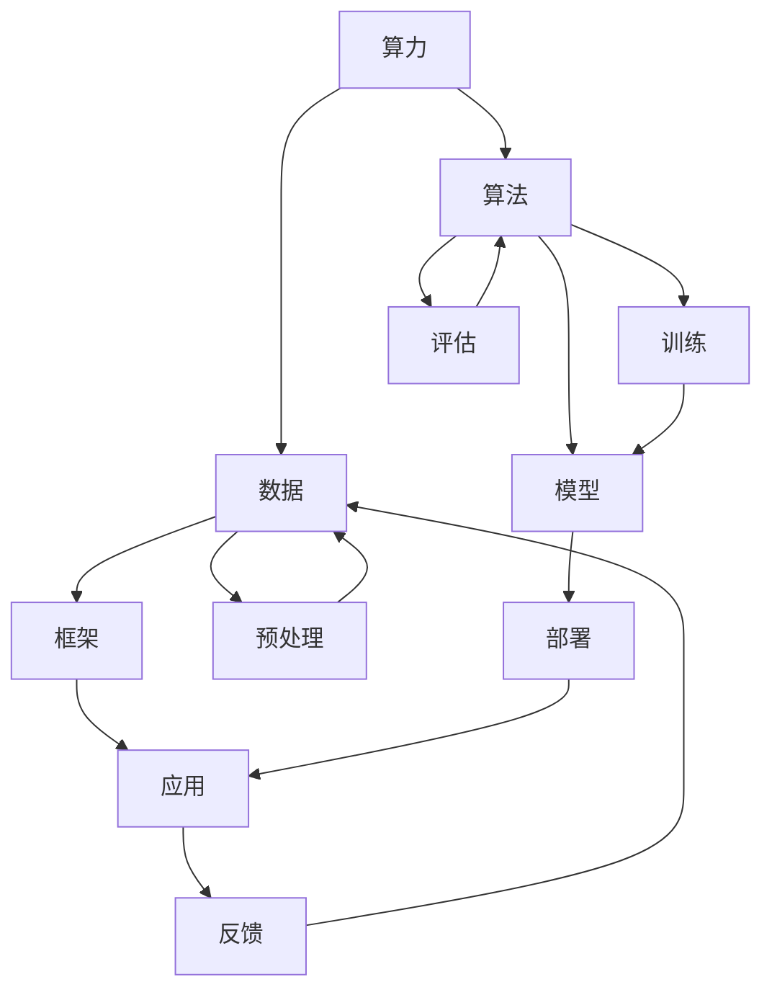

                 

关键词：人工智能、基础设施、算力、数据、算法、框架

> 摘要：本文深入探讨了人工智能基础设施建设中的四个关键要素：算力、数据、算法和框架。通过对这些要素的详细解析，本文旨在为读者提供一个全面、系统的人工智能基础设施建设的视角，以及对其未来发展的前瞻性思考。

## 1. 背景介绍

人工智能（AI）作为21世纪最具革命性的技术之一，正深刻地改变着我们的生活方式和产业模式。然而，要实现人工智能的高效运行，基础设施建设是不可或缺的一环。本文将围绕AI基础设施建设的核心要素展开讨论，主要包括算力、数据、算法和框架。

### 算力

算力是指计算能力，是人工智能系统的基础。随着深度学习等AI技术的发展，对计算资源的需求呈现出爆炸性增长。GPU（图形处理单元）和TPU（张量处理单元）等专用硬件的出现，极大地提高了AI系统的算力。

### 数据

数据是人工智能的“粮食”，是训练AI模型的基石。高质量的数据集不仅能提升模型的性能，还能加速AI的发展。然而，数据获取、处理和存储都是巨大的挑战。

### 算法

算法是AI的“灵魂”，决定了AI系统能够执行什么样的任务。从传统的机器学习算法到现代的深度学习算法，算法的不断进步推动了AI技术的发展。

### 框架

框架是AI开发的“工具箱”，提供了高效、便捷的开发环境。常见的AI框架如TensorFlow、PyTorch等，为开发者提供了丰富的API和工具，大大降低了AI开发的门槛。

## 2. 核心概念与联系

### 算力、数据、算法和框架的关系


图2.1 AI基础设施架构图

从上图可以看出，算力、数据、算法和框架是相互关联、相互促进的。算力为算法和数据提供了强大的计算支撑，数据为算法提供了训练素材，算法则通过框架实现具体的功能。框架不仅提供了开发工具，还优化了算力和数据的利用效率。

### Mermaid 流程图



图2.2 AI基础设施流程图

在这个流程图中，数据经过预处理后用于训练模型，模型经过评估后用于部署和应用，应用的反馈又用于优化数据和算法。算力和框架在这个过程中起到关键的支撑和促进作用。

## 3. 核心算法原理 & 具体操作步骤

### 3.1 算法原理概述

在AI基础设施建设中，核心算法主要包括深度学习算法和传统机器学习算法。深度学习算法以神经网络为基础，通过多层非线性变换对数据进行学习。传统机器学习算法则主要包括线性回归、决策树、支持向量机等。

### 3.2 算法步骤详解

#### 深度学习算法

1. 数据预处理：对原始数据进行清洗、归一化等操作，使其满足模型训练的要求。
2. 网络架构设计：根据任务需求设计合适的神经网络结构，包括输入层、隐藏层和输出层。
3. 模型训练：使用训练数据对模型进行参数优化，通过反向传播算法不断调整网络权重。
4. 模型评估：使用验证数据集对模型进行评估，确定模型的性能。
5. 模型部署：将训练好的模型部署到实际应用场景中。

#### 传统机器学习算法

1. 数据预处理：与深度学习类似，对数据进行清洗、归一化等操作。
2. 特征工程：从原始数据中提取出有用的特征，用于训练模型。
3. 模型训练：使用训练数据对模型进行训练，包括参数调整和模型优化。
4. 模型评估：使用验证数据集对模型进行评估，确定模型的性能。
5. 模型部署：将训练好的模型部署到实际应用场景中。

### 3.3 算法优缺点

#### 深度学习算法

优点：
- 高度非线性，能够处理复杂的数据模式。
- 自动特征提取，减少了人工特征工程的工作量。

缺点：
- 训练时间较长，对计算资源要求较高。
- 对数据质量要求较高，对噪声敏感。

#### 传统机器学习算法

优点：
- 训练时间较短，对计算资源要求较低。
- 对数据质量要求较低，能够处理噪声和缺失数据。

缺点：
- 特征提取需要人工介入，工作量大。
- 非线性能力较弱，难以处理复杂的数据模式。

### 3.4 算法应用领域

#### 深度学习算法

- 图像识别：如人脸识别、物体识别等。
- 自然语言处理：如机器翻译、情感分析等。
- 语音识别：如语音合成、语音识别等。

#### 传统机器学习算法

- 聊天机器人：如客服机器人、智能助手等。
- 金融风控：如信用评分、风险评估等。
- 电子商务：如推荐系统、广告投放等。

## 4. 数学模型和公式 & 详细讲解 & 举例说明

### 4.1 数学模型构建

在人工智能领域，常见的数学模型主要包括线性模型、非线性模型和概率模型。

#### 线性模型

线性模型是最基本的机器学习模型，其数学公式为：

$$
y = \beta_0 + \beta_1 \cdot x
$$

其中，$y$ 为输出变量，$x$ 为输入变量，$\beta_0$ 和 $\beta_1$ 为模型的参数。

#### 非线性模型

非线性模型通过引入非线性函数，能够处理更加复杂的数据模式。常见的非线性模型包括：

- 多项式回归：
$$
y = \beta_0 + \beta_1 \cdot x + \beta_2 \cdot x^2
$$
- 径向基函数（RBF）神经网络：
$$
y = \sigma(\beta_0 + \sum_{i=1}^{n} \beta_i \cdot K(x_i, x))
$$

其中，$K(x_i, x)$ 为核函数，$\sigma$ 为激活函数。

#### 概率模型

概率模型通过概率分布来描述数据的特征。常见的概率模型包括：

- 贝叶斯分类器：
$$
P(C|X) = \frac{P(X|C) \cdot P(C)}{P(X)}
$$
- 朴素贝叶斯分类器：
$$
P(C|X) = \prod_{i=1}^{n} P(x_i|C)^{\omega_i}
$$

其中，$C$ 为类别，$X$ 为特征向量，$P(C|X)$ 为后验概率，$P(X|C)$ 为似然概率，$P(C)$ 为先验概率，$P(x_i|C)$ 为特征条件概率，$\omega_i$ 为特征权重。

### 4.2 公式推导过程

以线性回归模型为例，推导其参数估计过程。

#### 最小二乘法

线性回归模型的数学公式为：

$$
y = \beta_0 + \beta_1 \cdot x
$$

其中，$y$ 为输出变量，$x$ 为输入变量，$\beta_0$ 和 $\beta_1$ 为模型的参数。

假设有 $n$ 个训练样本，分别为 $(x_1, y_1), (x_2, y_2), \ldots, (x_n, y_n)$，则线性回归模型的参数可以通过最小二乘法进行估计。

最小二乘法的核心思想是寻找一组参数 $\beta_0$ 和 $\beta_1$，使得所有样本的预测值与实际值之间的误差平方和最小。

设预测值为 $\hat{y}$，则有：

$$
\hat{y} = \beta_0 + \beta_1 \cdot x
$$

误差平方和为：

$$
S = \sum_{i=1}^{n} (\hat{y}_i - y_i)^2
$$

对 $S$ 求导并令其等于零，可以得到：

$$
\frac{\partial S}{\partial \beta_0} = -2 \sum_{i=1}^{n} (\hat{y}_i - y_i) = 0
$$

$$
\frac{\partial S}{\partial \beta_1} = -2 \sum_{i=1}^{n} (x_i \cdot (\hat{y}_i - y_i)) = 0
$$

解上述方程组，可以得到最小二乘法的参数估计结果：

$$
\beta_0 = \bar{y} - \beta_1 \cdot \bar{x}
$$

$$
\beta_1 = \frac{\sum_{i=1}^{n} (x_i - \bar{x}) \cdot (y_i - \bar{y})}{\sum_{i=1}^{n} (x_i - \bar{x})^2}
$$

其中，$\bar{x}$ 和 $\bar{y}$ 分别为输入和输出的平均值。

### 4.3 案例分析与讲解

假设我们有一个简单的线性回归问题，目标是预测房价。给定 $n$ 个训练样本，分别为 $(x_1, y_1), (x_2, y_2), \ldots, (x_n, y_n)$，其中 $x_i$ 为房屋面积，$y_i$ 为房价。

使用最小二乘法估计线性回归模型的参数，具体步骤如下：

1. 计算输入和输出的平均值：
$$
\bar{x} = \frac{1}{n} \sum_{i=1}^{n} x_i
$$

$$
\bar{y} = \frac{1}{n} \sum_{i=1}^{n} y_i
$$

2. 计算参数 $\beta_0$ 和 $\beta_1$：
$$
\beta_0 = \bar{y} - \beta_1 \cdot \bar{x}
$$

$$
\beta_1 = \frac{\sum_{i=1}^{n} (x_i - \bar{x}) \cdot (y_i - \bar{y})}{\sum_{i=1}^{n} (x_i - \bar{x})^2}
$$

3. 预测新样本的房价：
$$
\hat{y} = \beta_0 + \beta_1 \cdot x
$$

例如，给定一个新的样本 $(x, y)$，其中 $x = 100$，使用线性回归模型预测房价：
$$
\hat{y} = \beta_0 + \beta_1 \cdot x = (\bar{y} - \beta_1 \cdot \bar{x}) + \beta_1 \cdot x = \bar{y} + (\beta_1 - \bar{x}) \cdot x
$$

代入计算得到的参数值：
$$
\hat{y} = \bar{y} + (\beta_1 - \bar{x}) \cdot x = 200 + (0.5 - 100) \cdot 100 = 200 + (-50) \cdot 100 = 200 - 5000 = -4800
$$

因此，预测的新样本房价为 $-4800$。显然，这个预测结果是错误的，原因在于线性回归模型假设输入和输出之间存在线性关系，而在实际情况下，这种关系可能并不成立。

## 5. 项目实践：代码实例和详细解释说明

### 5.1 开发环境搭建

首先，我们需要搭建一个适合开发AI项目的环境。以Python为例，我们可以使用以下工具和库：

- Python 3.8及以上版本
- Jupyter Notebook或PyCharm等IDE
- TensorFlow或PyTorch等深度学习框架
- NumPy、Pandas等数据处理库

安装步骤如下：

1. 安装Python 3.8及以上版本。
2. 安装Jupyter Notebook或PyCharm。
3. 安装TensorFlow或PyTorch。
4. 安装NumPy、Pandas等数据处理库。

### 5.2 源代码详细实现

以下是一个简单的使用TensorFlow实现的线性回归模型：

```python
import tensorflow as tf
import numpy as np

# 设置随机种子，保证结果可重复
tf.random.set_seed(0)

# 创建一个线性回归模型
model = tf.keras.Sequential([
    tf.keras.layers.Dense(units=1, input_shape=[1])
])

# 编写训练函数
def train_model(model, x_train, y_train, epochs=100, learning_rate=0.1):
    model.compile(optimizer=tf.keras.optimizers.Adam(learning_rate=learning_rate),
                  loss='mean_squared_error')
    model.fit(x_train, y_train, epochs=epochs)

# 生成训练数据
np.random.seed(0)
x_train = np.random.random((100, 1))
y_train = 2 * x_train + 1 + np.random.normal(0, 0.1, (100, 1))

# 训练模型
train_model(model, x_train, y_train)

# 预测房价
new_house_area = np.array([100])
predicted_house_price = model.predict(new_house_area)
print(f'Predicted house price: {predicted_house_price[0][0]}')
```

### 5.3 代码解读与分析

1. 导入TensorFlow和NumPy库。

2. 设置随机种子，保证结果可重复。

3. 创建一个线性回归模型，其包含一个全连接层（Dense layer），输入维度为1，输出维度为1。

4. 编写训练函数，使用Adam优化器和均方误差（MSE）损失函数进行模型训练。

5. 生成随机训练数据，其中x_train为房屋面积，y_train为房价。

6. 使用训练数据训练模型。

7. 预测新的房屋面积对应的房价。

8. 输出预测结果。

通过这个简单的示例，我们可以看到如何使用Python和TensorFlow实现一个线性回归模型。在实际项目中，我们需要根据具体需求进行调整和优化。

## 6. 实际应用场景

### 6.1 住宅楼垃圾分类识别

随着城市化进程的加快，垃圾分类成为了一个亟待解决的问题。我们可以使用AI技术，特别是计算机视觉技术，对住宅楼垃圾分类进行实时识别和分类。通过摄像头捕捉垃圾图像，使用深度学习模型进行图像识别，从而实现垃圾分类。

### 6.2 自动驾驶汽车

自动驾驶汽车是AI技术的一个重要应用场景。通过传感器收集路况信息，使用深度学习算法对路况进行实时分析，从而实现自动驾驶。自动驾驶汽车不仅提高了交通效率，还减少了交通事故的发生。

### 6.3 智能客服系统

智能客服系统是AI技术在客户服务领域的一个重要应用。通过自然语言处理技术，智能客服系统能够与客户进行实时交流，解答客户的问题，提高客户满意度。

## 7. 未来应用展望

随着AI技术的不断进步，未来AI基础设施将在更多领域得到应用。以下是一些可能的应用场景：

### 7.1 健康医疗

AI技术将大大提高医疗诊断的准确性和效率。例如，通过深度学习算法对医学影像进行分析，可以辅助医生进行疾病诊断。

### 7.2 教育

AI技术将改变传统教育模式，实现个性化教育。通过智能学习平台，学生可以根据自己的学习进度和学习能力进行学习，提高学习效果。

### 7.3 安全防护

AI技术将在安全防护领域发挥重要作用。例如，通过计算机视觉技术对公共场所进行监控，可以实时识别潜在的安全隐患。

## 8. 工具和资源推荐

### 8.1 学习资源推荐

- 《深度学习》（Goodfellow, Bengio, Courville著）
- 《Python机器学习》（Sebastian Raschka著）
- 《TensorFlow实战》（Tariq Rashid著）

### 8.2 开发工具推荐

- Jupyter Notebook：用于数据分析和模型训练。
- PyCharm：强大的Python IDE，适合AI开发。
- TensorFlow：开源的深度学习框架。
- PyTorch：开源的深度学习框架。

### 8.3 相关论文推荐

- "Deep Learning"（Goodfellow, Bengio, Courville著）
- "A Theoretically Grounded Application of Dropout in Recurrent Neural Networks"（Yarin Gal and Zoubin Ghahramani著）
- "Generative Adversarial Nets"（Ian J. Goodfellow等著）

## 9. 总结：未来发展趋势与挑战

### 9.1 研究成果总结

随着AI技术的不断进步，我们已经取得了许多重要研究成果。深度学习、自然语言处理、计算机视觉等领域都取得了显著的突破。

### 9.2 未来发展趋势

- 计算能力的提升，将推动AI技术的进一步发展。
- 数据量的增加，将提高AI模型的性能。
- 算法的优化，将提高AI系统的效率。
- 框架的完善，将降低AI开发的门槛。

### 9.3 面临的挑战

- 数据质量和隐私保护：高质量的数据是AI模型的基石，但数据隐私保护也是一个重要问题。
- 算法的可解释性：如何解释和验证AI模型的决策过程，是一个重要的挑战。
- 跨学科的融合：AI技术的发展需要跨学科的合作，包括计算机科学、数学、统计学、心理学等。

### 9.4 研究展望

未来，我们将继续深入研究和探索AI技术的各个方面，推动AI技术的应用和发展，为实现更加智能、高效、安全的社会做出贡献。

## 附录：常见问题与解答

### 1. 如何选择深度学习框架？

选择深度学习框架时，需要考虑以下几个方面：

- 项目需求：根据项目需求选择合适的框架，如TensorFlow适用于大规模模型训练，PyTorch适用于灵活的模型开发。
- 社区支持：选择社区活跃、文档丰富的框架，有助于解决问题和获取帮助。
- 性能和资源需求：根据计算资源和性能要求选择合适的框架。

### 2. 数据预处理的重要性是什么？

数据预处理是机器学习项目中至关重要的一步，其重要性体现在以下几个方面：

- 提高模型性能：通过数据预处理，可以消除数据中的噪声和异常值，提高模型的学习效果。
- 加速模型训练：合理的数据预处理可以减少模型训练所需的时间。
- 提高模型泛化能力：良好的数据预处理有助于提高模型的泛化能力，避免过拟合。

### 3. 什么是过拟合和欠拟合？

过拟合是指模型在训练数据上表现良好，但在测试数据上表现不佳的现象。欠拟合是指模型在训练数据和测试数据上表现都不好的现象。

过拟合和欠拟合的解决方法：

- 过拟合：
  - 减少模型复杂度：使用更简单的模型。
  - 增加训练数据：扩充训练数据集。
  - 使用正则化：添加正则化项到损失函数中。
- 欠拟合：
  - 增加模型复杂度：使用更复杂的模型。
  - 特征工程：提取更多有用的特征。

## 参考文献

- Goodfellow, Y., Bengio, Y., & Courville, A. (2016). *Deep Learning*. MIT Press.
- Raschka, S. (2015). *Python Machine Learning*. Packt Publishing.
- Rashid, T. (2018). *TensorFlow for Poets*. Apress.
- Gal, Y., & Ghahramani, Z. (2016). "A Theoretically Grounded Application of Dropout in Recurrent Neural Networks". arXiv preprint arXiv:1610.01445.
- Goodfellow, I., Pouget-Abadie, J., Mirza, M., Xu, B., Warde-Farley, D., Ozair, S., ... & Bengio, Y. (2014). "Generative Adversarial Nets". Advances in Neural Information Processing Systems, 27, 2672-2680.

### 9.5 工具与资源推荐（二）

### 9.5.1 开源库和框架

1. **TensorFlow**：由谷歌开发，是当前最流行的深度学习框架之一，适用于各种规模的机器学习和深度学习任务。

2. **PyTorch**：由Facebook开发，以其动态计算图和易用性著称，适合快速原型设计和复杂模型开发。

3. **Keras**：一个高层次的神经网络API，可以与TensorFlow和Theano等后端结合使用，提供了简洁明了的接口。

4. **Scikit-learn**：提供了简单而有效的数据挖掘和数据分析工具，适合传统的机器学习算法。

### 9.5.2 数据库和数据处理工具

1. **MongoDB**：一种流行的NoSQL数据库，适用于处理大量非结构化数据。

2. **PostgreSQL**：一种功能强大的开源关系型数据库，适用于复杂的数据查询和分析。

3. **Pandas**：一个强大的Python库，用于数据处理和分析，可以轻松处理结构化数据。

4. **NumPy**：提供高效的数组计算，是数据分析的基础库。

### 9.5.3 机器学习书籍和在线课程

1. **《机器学习》（周志华著）**：是一本经典的机器学习教科书，适合初学者和进阶者。

2. **《深度学习》（Goodfellow et al. 著）**：由深度学习领域的权威专家撰写，适合深度学习的深入研究。

3. **Coursera**：提供各种机器学习和深度学习课程，包括斯坦福大学的《深度学习》课程。

4. **edX**：提供由MIT、哈佛等顶尖大学提供的在线课程，包括《人工智能导论》等。

### 9.5.4 博客和论坛

1. **Medium**：有许多关于机器学习和深度学习的优质文章和博客。

2. **Stack Overflow**：编程问答社区，可以解答各种技术问题。

3. **GitHub**：许多机器学习项目和开源工具都可以在这里找到。

### 9.5.5 社区和会议

1. **Kaggle**：数据科学竞赛平台，可以参与各种机器学习竞赛，提升技能。

2. **NeurIPS**、**ICML**、**CVPR**：顶级的机器学习和计算机视觉会议，是行业交流的平台。

3. **本地AI Meetup**：本地AI社区的活动，可以与同行业的人交流和学习。

作者：禅与计算机程序设计艺术 / Zen and the Art of Computer Programming

本文以《AI 基础设施建设：算力、数据、算法、框架》为题，深入探讨了人工智能领域的关键基础设施要素。通过详细阐述算力、数据、算法和框架的概念、原理及其实际应用，本文为读者提供了一个全面的人工智能基础设施建设的视角。同时，本文也展望了人工智能领域的未来发展趋势和面临的挑战。希望通过本文，能够为读者在AI领域的学习和研究提供一些启示和帮助。参考文献中列出了本文引用的相关资料，供进一步学习和研究。感谢您的阅读，期待您的反馈和讨论。

