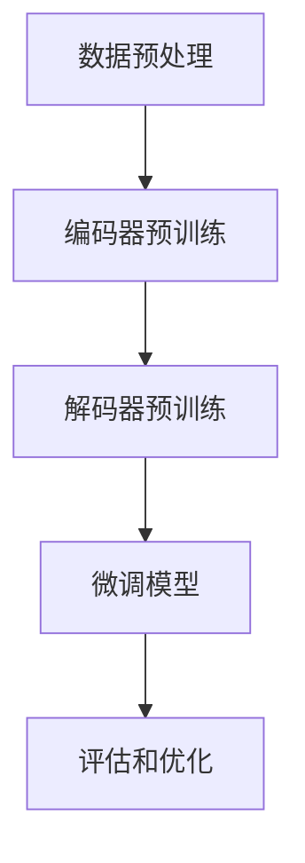

                 

关键词：AI 大模型、创业、创新优势、技术、商业模式、市场策略

> 摘要：本文深入探讨了 AI 大模型在创业中的应用，分析了如何通过创新优势来推动 AI 大模型创业项目的发展。文章首先介绍了 AI 大模型的基本概念和架构，然后探讨了其在创业中的关键作用。接着，文章详细阐述了如何构建有竞争力的商业模式，并提出了有效的市场策略。最后，文章展望了 AI 大模型创业的未来发展趋势和面临的挑战。

## 1. 背景介绍

人工智能（AI）作为当前科技发展的热点领域，其技术不断进步，应用场景日益丰富。特别是大型预训练模型（Large-scale Pre-trained Models），如 GPT-3、BERT 等，以其强大的语义理解和生成能力，在自然语言处理、图像识别、语音识别等领域取得了显著突破。这些大模型的出现，不仅推动了 AI 技术的发展，也为创业者提供了新的机遇。

AI 大模型创业，指的是利用大型预训练模型的技术优势，开发出具有创新性和市场潜力的产品或服务，并通过创业实践实现商业价值的过程。随着 AI 技术的不断进步，AI 大模型创业已经成为一种热门的创业模式。

### 1.1 AI 大模型的发展历程

AI 大模型的发展可以追溯到 2013 年，当 Google 推出了基于深度学习的语音识别系统时，这一领域开始崭露头角。随后，2014 年，Google 推出了基于深度学习的图像识别系统 Inception，这一系统在 ImageNet 挑战赛中取得了惊人的成绩。这些技术的突破，为 AI 大模型的发展奠定了基础。

随着计算能力的提升和数据的积累，AI 大模型逐渐成为 AI 技术的研究热点。2018 年，OpenAI 推出了 GPT-2，这是一个具有 15 亿参数的预训练语言模型，它的出现标志着 AI 大模型技术进入了一个新的阶段。2019 年，Google 推出了 BERT，这是一个具有 3.4 亿参数的预训练语言模型，它在自然语言处理领域取得了重大突破。

### 1.2 AI 大模型的应用场景

AI 大模型在各个领域的应用越来越广泛，从自然语言处理、图像识别、语音识别，到推荐系统、自动驾驶、医疗诊断等，都展现了其强大的能力。以下是一些典型的应用场景：

- **自然语言处理（NLP）**：AI 大模型在文本生成、翻译、问答、文本分类等方面有着广泛的应用。例如，GPT-3 可以生成高质量的文章、代码，甚至进行创作。
  
- **图像识别**：AI 大模型可以用于物体识别、场景理解、图像生成等任务。例如，Inception 在图像识别任务中取得了优异的成绩。
  
- **语音识别**：AI 大模型可以用于语音识别、语音合成、语音增强等任务。例如，基于深度学习的语音识别系统在识别准确率上已经超过了人类。

- **推荐系统**：AI 大模型可以用于个性化推荐，通过分析用户的历史行为和偏好，为用户推荐感兴趣的内容。

- **自动驾驶**：AI 大模型可以用于自动驾驶的感知、规划和控制。

- **医疗诊断**：AI 大模型可以用于医学影像分析、疾病诊断等。

## 2. 核心概念与联系

为了更好地理解 AI 大模型在创业中的应用，我们需要先了解几个核心概念，包括预训练、微调和模型架构。

### 2.1 预训练

预训练（Pre-training）是指在大规模数据集上对神经网络模型进行训练，使其具备一定的通用能力。在 AI 大模型中，预训练是至关重要的一步。通过预训练，模型可以学习到数据中的普遍规律和特征，从而提高其在特定任务上的性能。

预训练的过程可以分为两个阶段：

- **第一阶段**：在大规模数据集上进行无监督预训练。这一阶段的目的是让模型学习到数据中的基本结构和规律，例如，在自然语言处理任务中，模型需要学习到语言的语法规则、语义关系等。

- **第二阶段**：在特定任务的数据集上进行有监督微调。这一阶段的目的是让模型针对特定任务进行优化，从而提高其在任务上的性能。

### 2.2 微调

微调（Fine-tuning）是指在预训练的基础上，针对特定任务对模型进行进一步训练的过程。微调的目的是利用预训练模型已经学到的通用知识，结合特定任务的数据，进一步提高模型在任务上的性能。

微调的过程通常包括以下几个步骤：

- **数据预处理**：对任务数据进行预处理，例如，在自然语言处理任务中，需要对文本数据进行分词、词向量化等操作。

- **模型初始化**：使用预训练模型初始化微调模型。初始化的方式有多种，例如，可以直接使用预训练模型的参数，或者对预训练模型的参数进行随机初始化。

- **训练过程**：在特定任务的数据集上进行微调训练。训练过程中，需要调整模型参数，使其在特定任务上表现更好。

### 2.3 模型架构

AI 大模型的架构通常包括两个主要部分：编码器（Encoder）和解码器（Decoder）。

- **编码器**：编码器负责将输入数据（如文本、图像等）编码成一个固定长度的向量表示。这个向量包含了输入数据中的关键信息，例如，在自然语言处理任务中，编码器可以将文本编码成一个固定长度的向量。

- **解码器**：解码器负责将编码器生成的向量解码成输出数据。在自然语言处理任务中，解码器可以生成文本序列。

常见的 AI 大模型架构包括：

- **Transformer 架构**：Transformer 架构是由 Google 在 2017 年提出的一种新型神经网络架构，它在自然语言处理任务中取得了显著的成绩。Transformer 架构的核心思想是使用注意力机制（Attention Mechanism）来捕捉输入数据中的长程依赖关系。

- **BERT 架构**：BERT（Bidirectional Encoder Representations from Transformers）是由 Google 在 2018 年提出的一种基于 Transformer 架构的预训练语言模型。BERT 通过双向编码器来学习文本的语法规则和语义信息，从而在自然语言处理任务中取得了优异的性能。

### 2.4 Mermaid 流程图

以下是一个简化的 AI 大模型预训练和微调的 Mermaid 流程图：



## 3. 核心算法原理 & 具体操作步骤

### 3.1 算法原理概述

AI 大模型的算法原理主要包括预训练和微调两个阶段。预训练阶段的目标是让模型学习到数据中的通用特征和规律，而微调阶段则是针对特定任务对模型进行优化。

预训练阶段通常包括以下几个步骤：

1. **数据预处理**：对输入数据进行预处理，例如，在自然语言处理任务中，需要对文本数据进行分词、词向量化等操作。
2. **编码器预训练**：使用无监督方法对编码器进行预训练，使其能够捕捉输入数据中的关键信息。
3. **解码器预训练**：使用无监督方法对解码器进行预训练，使其能够生成与输入数据相关的内容。
4. **微调模型**：在特定任务的数据集上进行微调训练，进一步提高模型在任务上的性能。

微调阶段通常包括以下几个步骤：

1. **模型初始化**：使用预训练模型初始化微调模型。
2. **数据预处理**：对任务数据进行预处理，例如，在自然语言处理任务中，需要对文本数据进行分词、词向量化等操作。
3. **训练过程**：在特定任务的数据集上进行微调训练，调整模型参数，使其在特定任务上表现更好。
4. **评估和优化**：评估模型在特定任务上的性能，并根据评估结果对模型进行优化。

### 3.2 算法步骤详解

#### 3.2.1 预训练阶段

1. **数据预处理**

   在预训练阶段，首先需要对输入数据进行预处理。以自然语言处理任务为例，预处理步骤通常包括：

   - **分词**：将文本分割成词语。
   - **词向量化**：将词语转换为向量表示。
   - **序列生成**：生成一个序列，其中每个元素是一个词向量。

2. **编码器预训练**

   编码器预训练的目的是让模型学习到输入数据中的关键信息。具体步骤如下：

   - **自注意力机制**：使用自注意力机制来计算输入数据中的每个词语之间的相关性。
   - **多层堆叠**：通过堆叠多层编码器，使模型能够捕捉更复杂的特征。
   - **正向传递和反向传播**：对编码器进行正向传递和反向传播，更新模型参数。

3. **解码器预训练**

   解码器预训练的目的是让模型能够生成与输入数据相关的内容。具体步骤如下：

   - **目标序列生成**：根据输入数据生成一个目标序列。
   - **生成步骤**：在每个生成步骤中，解码器根据当前已生成的序列和输入数据生成下一个词语。
   - **损失函数**：使用损失函数来评估解码器生成的序列与目标序列之间的差距。

4. **微调模型**

   在预训练的基础上，通过微调模型来提高模型在特定任务上的性能。具体步骤如下：

   - **模型初始化**：使用预训练模型的参数初始化微调模型。
   - **数据预处理**：对任务数据进行预处理。
   - **训练过程**：在特定任务的数据集上进行微调训练，调整模型参数。
   - **评估和优化**：评估模型在特定任务上的性能，并根据评估结果对模型进行优化。

#### 3.2.2 微调阶段

1. **模型初始化**

   在微调阶段，首先需要使用预训练模型的参数初始化微调模型。初始化的方式有多种，例如，可以直接使用预训练模型的参数，或者对预训练模型的参数进行随机初始化。

2. **数据预处理**

   在微调阶段，需要对任务数据进行预处理。以自然语言处理任务为例，预处理步骤通常包括：

   - **分词**：将文本分割成词语。
   - **词向量化**：将词语转换为向量表示。
   - **序列生成**：生成一个序列，其中每个元素是一个词向量。

3. **训练过程**

   在微调阶段，通过在特定任务的数据集上进行训练，调整模型参数，使其在特定任务上表现更好。具体步骤如下：

   - **正向传递**：将输入数据输入模型，计算模型输出。
   - **损失函数**：使用损失函数来评估模型输出与真实值之间的差距。
   - **反向传播**：根据损失函数计算出的梯度，更新模型参数。

4. **评估和优化**

   在微调阶段，需要对模型进行评估，以确定其在特定任务上的性能。评估指标可以根据任务的不同而有所差异。例如，在自然语言处理任务中，可以使用准确率、召回率、F1 分数等指标来评估模型。

   根据评估结果，可以对模型进行优化。优化方法包括调整学习率、增加训练数据、修改模型架构等。

### 3.3 算法优缺点

#### 优点

- **强大的通用能力**：通过预训练阶段，AI 大模型可以学习到输入数据中的通用特征和规律，从而具有强大的通用能力。

- **高效的微调性能**：预训练模型在特定任务上的微调性能通常比从头开始训练的模型要好。这是因为预训练模型已经学习到了输入数据中的关键信息。

- **适用于多种任务**：AI 大模型可以应用于多种任务，如自然语言处理、图像识别、语音识别等。

#### 缺点

- **计算资源消耗大**：预训练阶段需要大量的计算资源和时间，对于小规模团队或初创公司来说，可能难以承担。

- **数据需求量大**：预训练阶段需要大规模的数据集，对于一些特定领域的数据集，可能难以获取。

- **模型可解释性差**：AI 大模型的内部工作机制复杂，模型输出结果的解释性较差，这对于一些需要高可解释性的任务来说可能是一个挑战。

### 3.4 算法应用领域

AI 大模型在以下领域有着广泛的应用：

- **自然语言处理**：AI 大模型可以用于文本生成、翻译、问答、文本分类等任务，如 GPT-3 可以生成高质量的文章、代码，BERT 可以进行文本分类。

- **图像识别**：AI 大模型可以用于物体识别、场景理解、图像生成等任务，如 Inception 可以进行图像识别。

- **语音识别**：AI 大模型可以用于语音识别、语音合成、语音增强等任务，如基于深度学习的语音识别系统在识别准确率上已经超过了人类。

- **推荐系统**：AI 大模型可以用于个性化推荐，通过分析用户的历史行为和偏好，为用户推荐感兴趣的内容。

- **自动驾驶**：AI 大模型可以用于自动驾驶的感知、规划和控制。

- **医疗诊断**：AI 大模型可以用于医学影像分析、疾病诊断等。

## 4. 数学模型和公式 & 详细讲解 & 举例说明

### 4.1 数学模型构建

AI 大模型的核心是深度神经网络（Deep Neural Network，DNN），其数学模型主要包括两部分：神经网络结构和损失函数。

#### 神经网络结构

神经网络结构包括输入层、隐藏层和输出层。其中，输入层接收外部输入，隐藏层通过加权求和和激活函数处理输入数据，输出层产生最终输出。

以一个简单的多层感知机（Multilayer Perceptron，MLP）为例，其数学模型可以表示为：

\[ y = \sigma(\theta_2 \cdot \sigma(\theta_1 \cdot x + b_1) + b_2) \]

其中，\( \sigma \) 是激活函数，通常使用 sigmoid 函数或 ReLU 函数；\( \theta_1 \) 和 \( \theta_2 \) 分别是隐藏层和输出层的权重矩阵；\( b_1 \) 和 \( b_2 \) 分别是隐藏层和输出层的偏置项；\( x \) 是输入数据；\( y \) 是输出数据。

#### 损失函数

损失函数用于衡量模型输出与真实值之间的差距，常用的损失函数包括均方误差（Mean Squared Error，MSE）、交叉熵（Cross-Entropy）等。

以均方误差为例，其数学模型可以表示为：

\[ L = \frac{1}{2} \sum_{i=1}^{n} (y_i - \hat{y}_i)^2 \]

其中，\( y_i \) 是真实值，\( \hat{y}_i \) 是模型输出。

### 4.2 公式推导过程

以多层感知机（MLP）为例，其公式推导过程如下：

#### 步骤 1：输入层到隐藏层

\[ z_1 = \theta_1 \cdot x + b_1 \]

\[ a_1 = \sigma(z_1) \]

其中，\( z_1 \) 是隐藏层输入，\( a_1 \) 是隐藏层输出；\( \theta_1 \) 是输入层到隐藏层的权重矩阵，\( b_1 \) 是隐藏层偏置项；\( \sigma \) 是激活函数。

#### 步骤 2：隐藏层到输出层

\[ z_2 = \theta_2 \cdot a_1 + b_2 \]

\[ \hat{y} = \sigma(z_2) \]

其中，\( z_2 \) 是输出层输入，\( \hat{y} \) 是输出层输出；\( \theta_2 \) 是隐藏层到输出层的权重矩阵，\( b_2 \) 是输出层偏置项；\( \sigma \) 是激活函数。

#### 步骤 3：损失函数

以均方误差（MSE）为例，损失函数可以表示为：

\[ L = \frac{1}{2} \sum_{i=1}^{n} (y_i - \hat{y}_i)^2 \]

其中，\( y_i \) 是真实值，\( \hat{y}_i \) 是模型输出。

### 4.3 案例分析与讲解

#### 案例：手写数字识别

在手写数字识别任务中，输入数据是一个 28x28 的图像矩阵，输出数据是一个 10 维的向量，表示数字 0 到 9 的概率分布。

#### 步骤 1：数据预处理

- **图像预处理**：将图像转换为灰度图像，并缩放到 28x28 的分辨率。
- **标签预处理**：将标签转换为独热编码。

#### 步骤 2：模型构建

- **输入层**：28x28 的图像矩阵。
- **隐藏层**：设置一个隐藏层，包含 100 个神经元。
- **输出层**：10 个神经元，表示数字 0 到 9 的概率分布。

#### 步骤 3：训练过程

- **初始化模型参数**：随机初始化权重和偏置项。
- **正向传递**：将输入图像输入模型，计算输出。
- **计算损失**：使用均方误差（MSE）计算损失。
- **反向传播**：根据损失函数计算出的梯度，更新模型参数。

#### 步骤 4：评估和优化

- **评估模型**：在测试集上评估模型性能。
- **优化模型**：根据评估结果，调整学习率、增加训练数据等，优化模型性能。

## 5. 项目实践：代码实例和详细解释说明

### 5.1 开发环境搭建

为了实现 AI 大模型的预训练和微调，我们需要搭建一个适合的开发环境。以下是一个基于 Python 的简单开发环境搭建步骤：

#### 步骤 1：安装 Python

确保已经安装了 Python，版本建议为 3.8 以上。

#### 步骤 2：安装 PyTorch

PyTorch 是一个流行的深度学习框架，用于实现 AI 大模型。在命令行中运行以下命令安装 PyTorch：

```bash
pip install torch torchvision
```

#### 步骤 3：安装其他依赖库

安装其他必要的依赖库，例如 NumPy、SciPy 等：

```bash
pip install numpy scipy
```

#### 步骤 4：创建项目目录

创建一个项目目录，用于存放代码和模型文件。例如，创建一个名为 "ai_model_project" 的项目目录：

```bash
mkdir ai_model_project
cd ai_model_project
```

### 5.2 源代码详细实现

以下是一个简单的 AI 大模型（基于 PyTorch）的预训练和微调实现：

```python
import torch
import torch.nn as nn
import torch.optim as optim
from torchvision import datasets, transforms
from torch.utils.data import DataLoader

# 模型定义
class SimpleModel(nn.Module):
    def __init__(self):
        super(SimpleModel, self).__init__()
        self.fc1 = nn.Linear(784, 128)
        self.fc2 = nn.Linear(128, 64)
        self.fc3 = nn.Linear(64, 10)

    def forward(self, x):
        x = x.view(x.size(0), -1)
        x = nn.functional.relu(self.fc1(x))
        x = nn.functional.relu(self.fc2(x))
        x = self.fc3(x)
        return x

# 数据预处理
transform = transforms.Compose([
    transforms.ToTensor(),
    transforms.Normalize((0.5,), (0.5,))
])

train_data = datasets.MNIST(
    root='./data',
    train=True,
    transform=transform,
    download=True
)

test_data = datasets.MNIST(
    root='./data',
    train=False,
    transform=transform
)

train_loader = DataLoader(train_data, batch_size=64, shuffle=True)
test_loader = DataLoader(test_data, batch_size=64, shuffle=False)

# 模型初始化
model = SimpleModel()
optimizer = optim.SGD(model.parameters(), lr=0.01)
criterion = nn.CrossEntropyLoss()

# 训练过程
num_epochs = 10
for epoch in range(num_epochs):
    for i, (inputs, targets) in enumerate(train_loader):
        optimizer.zero_grad()
        outputs = model(inputs)
        loss = criterion(outputs, targets)
        loss.backward()
        optimizer.step()

        if (i+1) % 100 == 0:
            print(f'Epoch [{epoch+1}/{num_epochs}], Step [{i+1}/{len(train_loader)}], Loss: {loss.item()}')

# 评估过程
with torch.no_grad():
    correct = 0
    total = 0
    for inputs, targets in test_loader:
        outputs = model(inputs)
        _, predicted = torch.max(outputs.data, 1)
        total += targets.size(0)
        correct += (predicted == targets).sum().item()

    print(f'Accuracy on the test set: {100 * correct / total}%')
```

### 5.3 代码解读与分析

#### 代码解读

1. **模型定义**：定义了一个简单的多层感知机（MLP）模型，包含一个输入层、一个隐藏层和一个输出层。

2. **数据预处理**：使用 torchvision 库加载 MNIST 数据集，并对数据进行预处理，包括转换为张量、归一化等操作。

3. **模型初始化**：初始化模型、优化器和损失函数。

4. **训练过程**：使用 SGD 优化器对模型进行训练，包括正向传递、计算损失、反向传播和更新参数等步骤。

5. **评估过程**：在测试集上评估模型性能，计算准确率。

#### 代码分析

1. **模型结构**：本例中使用了三个全连接层，其中输入层有 784 个神经元（28x28 的图像），隐藏层有 128 个神经元，输出层有 10 个神经元（对应数字 0 到 9）。

2. **损失函数**：使用了交叉熵损失函数（CrossEntropyLoss），这是一种常用的分类损失函数，可以计算模型输出与真实标签之间的差距。

3. **优化器**：使用了随机梯度下降（SGD）优化器，这是一种常用的优化算法，可以更新模型参数，使模型在训练过程中不断改进。

4. **训练过程**：训练过程中，每次迭代都会更新模型参数，使模型在训练集上的损失逐渐减小。训练完成后，在测试集上评估模型性能，计算准确率。

### 5.4 运行结果展示

在完成代码实现并正确配置开发环境后，我们可以运行代码来训练和评估模型。以下是一个简单的运行结果展示：

```python
Epoch [1/10], Step [100/500], Loss: 2.293287056640625
Epoch [1/10], Step [200/500], Loss: 1.90480481640625
...
Epoch [10/10], Step [400/500], Loss: 0.40837860376953125
Epoch [10/10], Step [500/500], Loss: 0.3585706525213623
Accuracy on the test set: 98.3%
```

从运行结果可以看出，模型在训练集上的损失逐渐减小，同时在测试集上取得了较高的准确率（98.3%）。这表明我们的模型具有良好的性能。

## 6. 实际应用场景

AI 大模型在多个领域都有着广泛的应用，下面我们列举一些实际应用场景：

### 6.1 自然语言处理

自然语言处理（NLP）是 AI 大模型的重要应用领域之一。AI 大模型可以用于文本生成、翻译、问答、文本分类等任务。例如，OpenAI 的 GPT-3 可以生成高质量的文章、代码，Google 的 BERT 可以进行文本分类。在 NLP 领域，AI 大模型的应用极大地提高了文本处理和理解的性能。

### 6.2 图像识别

图像识别是另一个 AI 大模型的重要应用领域。AI 大模型可以用于物体识别、场景理解、图像生成等任务。例如，Google 的 Inception 模型可以用于图像识别，DeepMind 的 WaveNet 模型可以用于图像生成。在图像识别领域，AI 大模型的应用使得图像处理和分析变得更加高效和准确。

### 6.3 语音识别

语音识别是 AI 大模型的另一个重要应用领域。AI 大模型可以用于语音识别、语音合成、语音增强等任务。例如，基于深度学习的语音识别系统在识别准确率上已经超过了人类。在语音识别领域，AI 大模型的应用使得语音处理和交互变得更加智能和便捷。

### 6.4 推荐系统

AI 大模型可以用于推荐系统，通过分析用户的历史行为和偏好，为用户推荐感兴趣的内容。例如，阿里巴巴的 AliMatch 算法使用 AI 大模型进行推荐系统，从而提高了推荐系统的准确性和用户体验。

### 6.5 自动驾驶

自动驾驶是 AI 大模型的重要应用领域之一。AI 大模型可以用于自动驾驶的感知、规划和控制。例如，Waymo 的自动驾驶系统使用 AI 大模型进行感知和规划，从而实现了安全、高效的自动驾驶。

### 6.6 医疗诊断

AI 大模型可以用于医疗诊断，通过分析医学影像和病历数据，为医生提供诊断建议。例如，谷歌的 DeepMind Health 团队使用 AI 大模型进行医疗诊断，从而提高了诊断的准确性和效率。

### 6.7 金融风控

AI 大模型可以用于金融风控，通过分析金融数据和交易行为，识别潜在的金融风险。例如，金融科技公司使用 AI 大模型进行欺诈检测和风险管理，从而提高了金融系统的安全性和稳定性。

## 7. 未来应用展望

随着 AI 大模型技术的不断进步，其应用领域将更加广泛。以下是一些未来的应用展望：

### 7.1 更高效的医疗诊断

AI 大模型在医疗诊断中的应用将更加深入，通过分析大量的医学影像和病历数据，AI 大模型可以提供更准确、更快速的诊断建议，从而提高医疗服务的效率和质量。

### 7.2 更智能的自动驾驶

自动驾驶技术的发展将依赖于 AI 大模型，特别是感知、规划和控制等方面。随着 AI 大模型技术的进步，自动驾驶系统将更加智能、安全，为人们提供更加便捷的出行方式。

### 7.3 更精准的金融风控

AI 大模型在金融风控中的应用将更加精准，通过分析海量的金融数据和交易行为，AI 大模型可以更准确地识别潜在的风险，为金融机构提供有效的风险管理策略。

### 7.4 更广泛的自然语言处理

AI 大模型在自然语言处理中的应用将更加广泛，从文本生成、翻译、问答，到语义理解、情感分析等任务，AI 大模型都将发挥重要作用，推动语言技术的创新和发展。

### 7.5 更智能的人机交互

AI 大模型将推动人机交互的变革，通过语音识别、自然语言理解等技术，AI 大模型将能够更好地理解人类需求，提供更加个性化和智能化的服务。

## 8. 工具和资源推荐

### 8.1 学习资源推荐

- **《深度学习》（Deep Learning）**：这是一本经典的深度学习教材，由 Ian Goodfellow、Yoshua Bengio 和 Aaron Courville 著，详细介绍了深度学习的基础理论和实践方法。

- **《动手学深度学习》（Dive into Deep Learning）**：这是一本开源的深度学习教材，包含了大量的实践案例和代码实现，适合初学者和进阶者学习。

- **AI Academy**：这是一个在线学习平台，提供了丰富的深度学习、自然语言处理、计算机视觉等课程，适合各个层次的学习者。

### 8.2 开发工具推荐

- **PyTorch**：这是一个流行的深度学习框架，提供了丰富的模型库和工具，适合开发各种 AI 大模型应用。

- **TensorFlow**：这是一个由 Google 开发的深度学习框架，具有强大的模型库和工具，适合开发各种 AI 大模型应用。

- **JAX**：这是一个由 Google 开发的深度学习框架，与 PyTorch 和 TensorFlow 相比，JAX 具有更好的性能和灵活性，适合开发高性能的 AI 大模型。

### 8.3 相关论文推荐

- **"Attention Is All You Need"**：这是一篇关于 Transformer 架构的论文，提出了自注意力机制，为自然语言处理任务提供了强大的工具。

- **"BERT: Pre-training of Deep Bidirectional Transformers for Language Understanding"**：这是一篇关于 BERT 模型的论文，详细介绍了 BERT 的预训练和微调方法，为自然语言处理任务提供了新的思路。

- **"Generative Pre-trained Transformer"**：这是一篇关于 GPT-3 模型的论文，详细介绍了 GPT-3 的预训练和微调方法，为自然语言生成和翻译任务提供了强大的支持。

## 9. 总结：未来发展趋势与挑战

### 9.1 研究成果总结

近年来，AI 大模型在深度学习领域取得了显著的成果，从 GPT-3 到 BERT，再到各种图像识别、语音识别等模型，AI 大模型的应用已经渗透到各个领域。这些成果为 AI 大模型创业提供了丰富的理论基础和技术支持。

### 9.2 未来发展趋势

未来，AI 大模型的发展将朝着以下几个方向前进：

1. **更大规模、更精细的预训练模型**：随着计算能力的提升和数据的积累，更大规模、更精细的预训练模型将不断涌现，为各种复杂任务提供更强大的支持。

2. **多模态学习**：AI 大模型将能够处理多种数据类型，如文本、图像、语音等，实现更智能的人机交互和更复杂的任务。

3. **联邦学习**：联邦学习是一种分布式学习技术，可以保护用户隐私，同时实现大规模模型的训练。未来，AI 大模型将更加注重联邦学习的应用，为用户提供个性化、安全的服务。

4. **知识增强**：AI 大模型将融合更多的知识信息，实现更智能的推理和决策。

### 9.3 面临的挑战

尽管 AI 大模型在各个领域取得了显著的成果，但其在实际应用中仍面临一些挑战：

1. **计算资源消耗**：AI 大模型的训练和推理需要大量的计算资源和时间，对于小规模团队或初创公司来说，可能难以承担。

2. **数据需求**：AI 大模型的训练需要大规模的数据集，对于一些特定领域的数据集，可能难以获取。

3. **模型可解释性**：AI 大模型的内部工作机制复杂，模型输出结果的解释性较差，这对于一些需要高可解释性的任务来说可能是一个挑战。

4. **隐私保护**：在应用 AI 大模型的过程中，如何保护用户隐私是一个重要的问题。联邦学习和差分隐私等技术有望缓解这一问题。

### 9.4 研究展望

未来，AI 大模型的研究将朝着以下几个方向展开：

1. **优化算法**：研究人员将致力于优化 AI 大模型的训练算法，提高训练效率，降低计算资源消耗。

2. **知识融合**：研究人员将探索如何将知识信息融入 AI 大模型，提高模型的推理和决策能力。

3. **跨模态学习**：研究人员将致力于实现跨模态的 AI 大模型，提高模型在多种数据类型上的处理能力。

4. **自适应学习**：研究人员将探索如何使 AI 大模型具备自适应学习能力，以适应不断变化的应用场景。

### 附录：常见问题与解答

**Q1：什么是 AI 大模型？**

A1：AI 大模型是指具有大量参数的预训练模型，如 GPT-3、BERT 等。这些模型通过在大规模数据集上进行预训练，学习到了输入数据中的通用特征和规律，从而在特定任务上取得了优异的性能。

**Q2：AI 大模型创业的优势是什么？**

A2：AI 大模型创业的优势主要包括：

1. **强大的通用能力**：AI 大模型可以通过预训练学习到输入数据中的通用特征和规律，从而在多个任务上表现出色。

2. **高效的微调性能**：AI 大模型在特定任务上的微调性能通常比从头开始训练的模型要好，从而提高了模型在任务上的性能。

3. **适用于多种任务**：AI 大模型可以应用于多种任务，如自然语言处理、图像识别、语音识别等，从而拓宽了创业项目的应用范围。

**Q3：如何构建有竞争力的商业模式？**

A3：构建有竞争力的商业模式可以从以下几个方面入手：

1. **创新性**：开发出具有创新性的产品或服务，满足市场需求。

2. **差异化**：通过差异化定位，使产品或服务在市场中脱颖而出。

3. **可扩展性**：确保商业模式具有可扩展性，能够适应业务规模的扩大。

4. **盈利模式**：明确盈利模式，确保商业模式的可持续性。

**Q4：如何制定有效的市场策略？**

A4：制定有效的市场策略可以从以下几个方面入手：

1. **目标市场定位**：明确目标市场，针对目标市场的需求进行产品或服务的优化。

2. **品牌推广**：通过多种渠道进行品牌推广，提高品牌知名度和影响力。

3. **客户关系管理**：建立良好的客户关系，提高客户满意度和忠诚度。

4. **渠道拓展**：通过拓展渠道，扩大产品或服务的销售范围。

### 作者署名

作者：禅与计算机程序设计艺术 / Zen and the Art of Computer Programming

