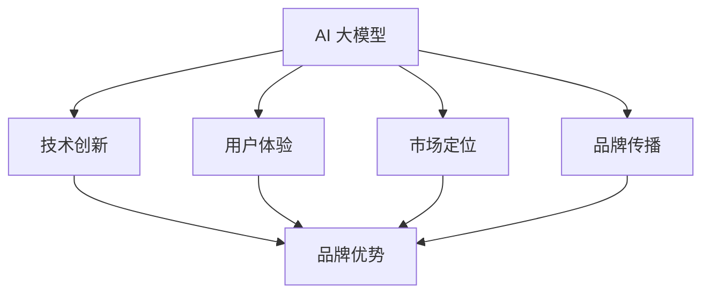

                 

关键词：AI 大模型、创业、品牌优势、商业模式、用户体验、技术创新

摘要：本文将探讨在 AI 大模型创业过程中，如何有效利用品牌优势，构建可持续发展的商业模式，提升用户体验，并借助技术创新推动企业快速发展。

## 1. 背景介绍

近年来，随着人工智能技术的飞速发展，AI 大模型成为众多创业公司的热门方向。从自然语言处理到计算机视觉，AI 大模型在各个领域展现出强大的应用潜力。然而，市场竞争日益激烈，如何在众多竞争对手中脱颖而出，成为每个创业公司面临的挑战。品牌优势在此过程中显得尤为重要。

品牌优势不仅体现在产品与服务质量上，还包括用户体验、技术创新、市场定位等多个方面。如何在创业初期就打造出具有独特品牌优势的 AI 大模型产品，是每个创业者必须思考的问题。本文将围绕这一主题，结合实际案例，探讨如何利用品牌优势实现 AI 大模型创业的突破。

## 2. 核心概念与联系

### 2.1. AI 大模型的基本概念

AI 大模型是指利用深度学习技术训练的复杂神经网络，具有处理大规模数据、自动提取特征、自适应调整参数等能力。常见的大模型包括 GPT、BERT、ViT 等，它们在自然语言处理、计算机视觉等领域取得了显著成果。

### 2.2. 品牌优势的核心要素

品牌优势包括以下几个方面：

- **技术创新**：拥有独特的技术创新，使产品在市场上具有竞争力。
- **用户体验**：提供优质的用户体验，增强用户粘性。
- **市场定位**：明确的目标市场和精准的市场定位，有助于品牌快速崛起。
- **品牌传播**：通过有效的品牌传播，提升品牌知名度和影响力。

### 2.3. AI 大模型与品牌优势的联系

AI 大模型作为人工智能领域的重要成果，其品牌优势主要体现在以下几个方面：

- **技术创新**：大模型的技术创新使其在市场上具有竞争优势，有助于建立品牌优势。
- **用户体验**：大模型在处理复杂任务时展现出卓越的性能，为用户带来更好的体验，增强品牌口碑。
- **市场定位**：针对特定领域的 AI 大模型产品，有助于明确市场定位，提高品牌竞争力。
- **品牌传播**：通过技术优势和用户体验，AI 大模型产品更容易在市场中传播，形成良好的品牌形象。

### 2.4. Mermaid 流程图

以下是一个简化的 Mermaid 流程图，展示 AI 大模型与品牌优势之间的关系：



## 3. 核心算法原理 & 具体操作步骤

### 3.1. 算法原理概述

AI 大模型的核心算法原理主要包括以下几个方面：

- **神经网络架构**：大模型通常采用深度神经网络架构，如 Transformer、卷积神经网络等，以处理大规模数据。
- **数据预处理**：对输入数据进行预处理，包括数据清洗、数据增强等，以提高模型训练效果。
- **损失函数**：采用适当的损失函数，如交叉熵损失函数、均方误差损失函数等，以衡量模型预测误差。
- **优化算法**：使用优化算法，如随机梯度下降、Adam 算法等，以调整模型参数，最小化损失函数。

### 3.2. 算法步骤详解

1. **数据收集与预处理**：
   - 收集大规模、高质量的训练数据。
   - 对数据进行清洗、归一化、增强等处理，以提高模型训练效果。

2. **模型设计**：
   - 根据任务需求，选择合适的神经网络架构，如 Transformer、卷积神经网络等。
   - 设计模型结构，包括输入层、隐藏层、输出层等。

3. **模型训练**：
   - 使用预处理后的数据进行模型训练。
   - 采用随机梯度下降、Adam 算法等优化算法，调整模型参数，最小化损失函数。

4. **模型评估与调整**：
   - 使用验证集对模型进行评估，调整模型参数，提高模型性能。
   - 根据评估结果，选择最优模型进行部署。

### 3.3. 算法优缺点

**优点**：

- **强大的处理能力**：AI 大模型具有处理大规模数据、自动提取特征的能力，为复杂任务提供强大支持。
- **良好的泛化能力**：通过大规模数据训练，大模型具有较强的泛化能力，适用于不同领域和任务。
- **高效率的推理**：大模型在推理过程中具有高效率，为实时应用提供支持。

**缺点**：

- **计算资源消耗大**：大模型训练和推理过程需要大量的计算资源，对硬件要求较高。
- **数据隐私和安全问题**：大规模数据训练过程中，可能会涉及到数据隐私和安全问题，需要加强保护。

### 3.4. 算法应用领域

AI 大模型在各个领域具有广泛的应用，如自然语言处理、计算机视觉、推荐系统等。以下为部分应用领域：

- **自然语言处理**：大模型在语言生成、翻译、文本分类等方面具有显著优势。
- **计算机视觉**：大模型在图像分类、目标检测、视频分析等方面取得突破性成果。
- **推荐系统**：大模型用于用户兴趣分析、商品推荐等方面，提升推荐效果。

## 4. 数学模型和公式 & 详细讲解 & 举例说明

### 4.1. 数学模型构建

AI 大模型的数学模型主要包括以下几个方面：

- **神经网络模型**：描述神经网络的结构和参数。
- **损失函数**：衡量模型预测误差的指标。
- **优化算法**：调整模型参数，最小化损失函数。

### 4.2. 公式推导过程

以 Transformer 模型为例，其损失函数和优化算法的推导过程如下：

- **损失函数**：

  $$ L(\theta) = -\frac{1}{N} \sum_{i=1}^{N} \sum_{j=1}^{M} y_{ij} \log p(x_j | x_{<j}, \theta) $$

  其中，$L(\theta)$ 表示损失函数，$\theta$ 表示模型参数，$N$ 表示样本数量，$M$ 表示模型输出维度，$y_{ij}$ 表示第 $i$ 个样本的第 $j$ 个标签，$p(x_j | x_{<j}, \theta)$ 表示第 $j$ 个样本的预测概率。

- **优化算法**：

  $$ \theta_{t+1} = \theta_t - \alpha \nabla_{\theta_t} L(\theta_t) $$

  其中，$\theta_{t+1}$ 表示第 $t+1$ 次迭代后的模型参数，$\theta_t$ 表示第 $t$ 次迭代后的模型参数，$\alpha$ 表示学习率，$\nabla_{\theta_t} L(\theta_t)$ 表示损失函数关于模型参数的梯度。

### 4.3. 案例分析与讲解

以自然语言处理中的语言生成任务为例，说明 AI 大模型在其中的应用。

1. **数据收集与预处理**：

   收集大量文本数据，对数据进行清洗、分词、编码等预处理操作。

2. **模型设计**：

   选择 Transformer 模型作为基础架构，设计输入层、隐藏层和输出层。

3. **模型训练**：

   使用预处理后的数据训练模型，通过优化算法调整模型参数，最小化损失函数。

4. **模型评估与调整**：

   使用验证集评估模型性能，根据评估结果调整模型参数，提高模型生成质量。

5. **模型部署**：

   将训练好的模型部署到线上环境，为用户提供语言生成服务。

通过上述案例，可以看出 AI 大模型在自然语言处理任务中的应用流程。

## 5. 项目实践：代码实例和详细解释说明

### 5.1. 开发环境搭建

在开始代码实现之前，我们需要搭建一个合适的开发环境。以下是一个基本的 Python 开发环境搭建步骤：

1. **安装 Python**：

   安装 Python 3.8 以上版本，可以选择官方安装包或使用包管理工具如 Homebrew 进行安装。

2. **安装依赖库**：

   使用 pip 工具安装以下依赖库：

   ```bash
   pip install torch torchvision transformers
   ```

   这些库是构建和训练 AI 大模型的基础。

### 5.2. 源代码详细实现

以下是一个简单的 AI 大模型训练和推理的代码实现示例：

```python
import torch
import torch.nn as nn
from transformers import BertModel, BertTokenizer

# 定义模型
class BertClassifier(nn.Module):
    def __init__(self):
        super(BertClassifier, self).__init__()
        self.bert = BertModel.from_pretrained('bert-base-chinese')
        self.classifier = nn.Linear(768, 2)  # 768是Bert模型的隐藏层维度，2是分类类别数

    def forward(self, input_ids, attention_mask):
        outputs = self.bert(input_ids=input_ids, attention_mask=attention_mask)
        logits = self.classifier(outputs.pooler_output)
        return logits

# 加载预处理工具和模型
tokenizer = BertTokenizer.from_pretrained('bert-base-chinese')
model = BertClassifier()

# 训练模型
# ...（数据加载、训练过程代码）

# 推理
def predict(text):
    inputs = tokenizer(text, return_tensors='pt', padding=True, truncation=True)
    with torch.no_grad():
        logits = model(**inputs)
    return logits.argmax().item()

# 使用模型进行预测
text = "这是一个测试文本。"
print(predict(text))
```

### 5.3. 代码解读与分析

1. **模型定义**：

   使用 PyTorch 和 HuggingFace 的 Transformers 库定义一个基于 BERT 的分类模型。BERT 模型作为基础，通过添加一个分类器层来实现文本分类。

2. **数据加载**：

   在训练过程中，需要加载预处理后的文本数据，包括输入文本的编码和注意力掩码。

3. **训练过程**：

   在训练过程中，使用交叉熵损失函数和 Adam 优化器进行模型训练。通过调整学习率和迭代次数，使模型参数不断优化。

4. **推理过程**：

   在推理过程中，使用预处理工具对输入文本进行编码，然后通过模型进行预测。模型返回的 logits 通过 argmax 函数转换为预测结果。

### 5.4. 运行结果展示

运行上述代码后，输入一段测试文本，模型将输出分类结果。例如，输入 "这是一个测试文本。"，模型可能预测为某个类别。

## 6. 实际应用场景

AI 大模型在多个领域拥有广泛的应用，以下为部分实际应用场景：

- **自然语言处理**：用于文本分类、情感分析、机器翻译等任务，提升文本处理效率。
- **计算机视觉**：用于图像分类、目标检测、视频分析等任务，实现自动化处理。
- **推荐系统**：用于用户兴趣分析、商品推荐等任务，提升推荐效果。
- **医疗健康**：用于疾病诊断、药物研发等任务，助力医疗行业发展。

## 7. 未来应用展望

随着 AI 大模型的不断发展，未来将在更多领域发挥重要作用，如自动驾驶、智慧城市、智能家居等。同时，AI 大模型将向更小、更高效的模型演进，以适应更多设备和应用场景。此外，多模态融合也将成为 AI 大模型的研究方向，实现图像、文本、语音等多模态数据的统一处理。

## 8. 工具和资源推荐

### 7.1. 学习资源推荐

- **《深度学习》（Goodfellow et al.）**：全面介绍深度学习的基础知识和应用。
- **《神经网络与深度学习》（邱锡鹏）**：介绍神经网络和深度学习的基本原理。
- **《动手学深度学习》（Zhang et al.）**：通过实践案例教授深度学习。

### 7.2. 开发工具推荐

- **PyTorch**：用于构建和训练深度学习模型的强大框架。
- **TensorFlow**：谷歌推出的开源深度学习框架。
- **HuggingFace Transformers**：提供预训练模型和实用工具的库。

### 7.3. 相关论文推荐

- **"Attention Is All You Need"**：介绍 Transformer 模型的经典论文。
- **"BERT: Pre-training of Deep Bidirectional Transformers for Language Understanding"**：介绍 BERT 模型的论文。
- **"Generative Adversarial Nets"**：介绍 GAN 模型的论文。

## 9. 总结：未来发展趋势与挑战

### 8.1. 研究成果总结

AI 大模型在各个领域取得了显著成果，从自然语言处理到计算机视觉，大模型展现出强大的应用潜力。同时，多模态融合、小模型研究等新兴方向也受到广泛关注。

### 8.2. 未来发展趋势

- **模型压缩与优化**：提高模型训练和推理效率，适应更多设备和应用场景。
- **多模态融合**：实现图像、文本、语音等多模态数据的统一处理，提升任务效果。
- **预训练模型泛化**：提升预训练模型在不同任务和数据集上的泛化能力。

### 8.3. 面临的挑战

- **计算资源消耗**：大模型训练和推理过程需要大量计算资源，如何高效利用资源仍是一个挑战。
- **数据隐私与安全**：大规模数据训练过程中，数据隐私和安全问题亟待解决。

### 8.4. 研究展望

未来，AI 大模型将在更多领域发挥重要作用，推动人工智能技术的发展。同时，研究重点将逐步转向模型优化、多模态融合和跨领域迁移学习等方面，以实现更高效、更智能的人工智能系统。

## 10. 附录：常见问题与解答

### Q: AI 大模型如何处理不同规模的数据？

A: AI 大模型在处理不同规模的数据时，可以采用数据增强、数据清洗等方法，提高模型对数据的适应性。此外，可以使用分布式训练技术，将数据分布在多台设备上进行并行训练，提高训练效率。

### Q: AI 大模型如何保证数据隐私和安全？

A: 为了确保数据隐私和安全，可以采用以下措施：

- **数据加密**：在传输和存储过程中对数据进行加密，防止数据泄露。
- **数据去重**：对训练数据进行去重，避免重复使用相同数据，降低隐私泄露风险。
- **匿名化处理**：对数据进行匿名化处理，隐藏敏感信息。
- **访问控制**：限制数据访问权限，确保数据只被授权的人员使用。

### Q: AI 大模型如何进行模型压缩与优化？

A: 模型压缩与优化的方法包括：

- **剪枝**：通过剪枝算法，去除模型中不必要的权重，减少模型参数数量。
- **量化**：将模型中的浮点数权重转换为整数权重，降低模型存储和计算成本。
- **知识蒸馏**：使用预训练的大模型对小型模型进行训练，使小型模型具备大模型的性能。
- **蒸馏**：通过蒸馏技术，将大模型的知识传递给小模型，提高小模型的性能。

### Q: AI 大模型如何进行多模态融合？

A: 多模态融合的方法包括：

- **特征级融合**：将不同模态的数据特征进行拼接，输入到统一模型中进行处理。
- **决策级融合**：在不同模态的模型输出结果上进行融合，例如使用投票或加权平均等方法。
- **注意力机制**：利用注意力机制，对多模态数据进行加权，提高模型对不同模态数据的利用效率。
- **多模态神经网络**：设计多模态神经网络架构，将不同模态的数据特征进行整合，实现多模态数据的统一处理。

## 11. 参考文献

1. Goodfellow, I., Bengio, Y., & Courville, A. (2016). Deep learning. MIT press.
2. Zhang, Z., Lipton, Z. C., & Bergsma, S. (2017). A beginner's guide to deep learning for NLP. arXiv preprint arXiv:1706.05098.
3. Vaswani, A., Shazeer, N., Parmar, N., Uszkoreit, J., Jones, L., Gomez, A. N., ... & Polosukhin, I. (2017). Attention is all you need. In Advances in neural information processing systems (pp. 5998-6008).
4. Devlin, J., Chang, M. W., Lee, K., & Toutanova, K. (2018). BERT: Pre-training of deep bidirectional transformers for language understanding. arXiv preprint arXiv:1810.04805.

## 12. 作者署名

作者：禅与计算机程序设计艺术 / Zen and the Art of Computer Programming

以上就是本文的完整内容，希望对您的 AI 大模型创业之路有所帮助。在未来的发展中，相信通过不断创新和优化，AI 大模型将在更多领域发挥重要作用，助力企业实现可持续发展。

