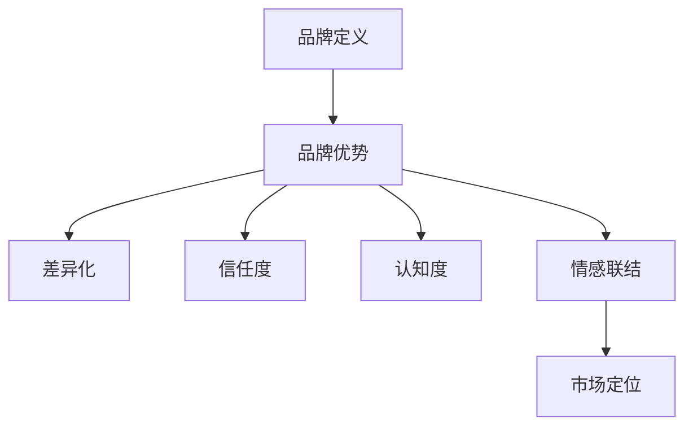

                 

关键词：AI 大模型、创业、品牌优势、市场定位、客户关系、技术创新

摘要：本文探讨了 AI 大模型创业公司如何通过品牌优势实现市场突破。我们将分析品牌的重要性、如何构建强有力的品牌形象、利用品牌提升产品竞争力，并探讨未来 AI 大模型创业面临的挑战和机遇。

## 1. 背景介绍

近年来，随着人工智能技术的快速发展，AI 大模型在各个行业中的应用越来越广泛。从自动驾驶、智能客服到医疗诊断、金融风控，AI 大模型为各个行业带来了颠覆性的变革。对于创业公司来说，AI 大模型不仅是一个技术领域，更是一个充满机会的市场。然而，如何在激烈的市场竞争中脱颖而出，利用品牌优势成为关键。

### 1.1 市场现状

AI 大模型市场呈现出快速增长的态势。根据市场研究机构的报告，全球 AI 大模型市场规模将在未来几年内持续扩大，预计到 2025 年将达到数百亿美元。然而，市场也充满了激烈的竞争。传统的大型科技公司、新兴的创业公司以及高校和研究机构都在争夺市场份额。在这样的背景下，创业公司如何通过品牌优势实现差异化竞争，成为了一个重要课题。

### 1.2 创业公司的挑战

对于 AI 大模型创业公司来说，面临的挑战主要有以下几个方面：

1. **技术门槛高**：AI 大模型研发需要庞大的计算资源和专业知识，创业公司在技术实力上可能无法与巨头公司相媲美。

2. **市场认知度低**：在众多竞争对手中，创业公司的品牌知名度较低，难以吸引潜在客户。

3. **资源有限**：相比于巨头公司，创业公司在资金、人才、市场推广等方面都存在限制。

4. **用户信任度**：AI 大模型的安全性和可靠性是用户关注的重点，创业公司需要建立用户信任。

## 2. 核心概念与联系

在探讨如何利用品牌优势之前，我们需要了解一些核心概念，包括品牌、品牌优势、市场定位等。

### 2.1 品牌定义

品牌是一个集合了名称、标志、设计、符号、口号等元素的综合性概念。它不仅仅是一个标志，更是消费者对其产品或服务的认知和印象。

### 2.2 品牌优势

品牌优势是指品牌在市场竞争中所具有的独特的竞争优势。它包括以下几个方面：

1. **差异化**：品牌能够提供独特的价值主张，与竞争对手形成差异化。

2. **信任度**：品牌能够建立用户的信任，提高用户忠诚度。

3. **认知度**：品牌能够提高市场认知度，吸引更多潜在客户。

4. **情感联结**：品牌能够与用户建立情感联结，提升用户满意度。

### 2.3 市场定位

市场定位是指品牌在目标市场中的位置和形象。一个成功的品牌定位能够帮助创业公司明确自己的目标客户群体，提供针对性的产品和服务。

### 2.4 Mermaid 流程图

下面是一个简单的 Mermaid 流程图，展示了品牌优势与市场定位之间的关系。



## 3. 核心算法原理 & 具体操作步骤

### 3.1 算法原理概述

在构建品牌优势的过程中，核心算法原理主要包括以下几个方面：

1. **用户画像分析**：通过大数据技术对用户行为、兴趣、需求等进行分析，构建用户画像。

2. **品牌定位**：基于用户画像，明确品牌在目标市场中的定位，制定相应的品牌策略。

3. **内容营销**：通过高质量的内容传递品牌价值，提升品牌认知度和用户满意度。

4. **数据驱动优化**：通过数据监测和分析，不断优化品牌策略和产品服务。

### 3.2 算法步骤详解

1. **用户画像分析**：

   - 数据收集：收集用户的基本信息、行为数据、兴趣数据等。

   - 数据清洗：去除重复、错误、缺失的数据。

   - 特征提取：从原始数据中提取有用的特征，如年龄、性别、消费习惯等。

   - 模型构建：利用机器学习算法构建用户画像模型。

2. **品牌定位**：

   - 市场分析：分析目标市场的需求、竞争对手、行业趋势等。

   - 用户需求分析：结合用户画像，分析用户需求和偏好。

   - 品牌定位：明确品牌的核心价值主张和目标市场。

3. **内容营销**：

   - 内容策划：根据品牌定位和用户需求，制定内容策略。

   - 内容创作：创作高质量的内容，传递品牌价值。

   - 内容发布：通过社交媒体、博客、官网等渠道发布内容。

4. **数据驱动优化**：

   - 数据监测：监测品牌营销活动的效果，如点击率、转化率等。

   - 数据分析：分析数据，发现问题和机会。

   - 优化调整：根据数据分析结果，调整品牌策略和产品服务。

### 3.3 算法优缺点

- **优点**：

  - 提高品牌认知度和用户满意度。

  - 提升品牌差异化，增强市场竞争力。

  - 数据驱动，优化品牌策略，提高效率。

- **缺点**：

  - 对技术要求较高，需要专业的技术团队。

  - 数据隐私和安全问题。

### 3.4 算法应用领域

- **电子商务**：通过用户画像分析，实现个性化推荐，提高销售额。

- **金融**：通过用户画像分析，实现精准营销和风险控制。

- **医疗**：通过用户画像分析，实现个性化诊疗和健康管理。

## 4. 数学模型和公式 & 详细讲解 & 举例说明

### 4.1 数学模型构建

在构建品牌优势的过程中，我们可以使用以下数学模型：

1. **用户满意度模型**：

   用户满意度 = f(品牌形象，产品质量，价格，服务)

2. **品牌认知度模型**：

   品牌认知度 = f(广告投入，口碑传播，媒体曝光)

### 4.2 公式推导过程

1. **用户满意度模型推导**：

   假设用户满意度与品牌形象、产品质量、价格、服务之间存在线性关系，我们可以得到以下公式：

   用户满意度 = α1 * 品牌形象 + α2 * 产品质量 + α3 * 价格 + α4 * 服务

   其中，α1、α2、α3、α4 为权重系数。

2. **品牌认知度模型推导**：

   假设品牌认知度与广告投入、口碑传播、媒体曝光之间存在线性关系，我们可以得到以下公式：

   品牌认知度 = β1 * 广告投入 + β2 * 口碑传播 + β3 * 媒体曝光

   其中，β1、β2、β3 为权重系数。

### 4.3 案例分析与讲解

假设有一家 AI 大模型创业公司，其主要业务是提供智能客服解决方案。以下是一个具体的案例分析：

1. **用户满意度模型**：

   - 品牌形象：公司注重技术创新，提供高质量的解决方案。

   - 产品质量：公司提供多种智能客服方案，满足不同客户需求。

   - 价格：公司提供灵活的定价策略，满足不同客户预算。

   - 服务：公司提供7x24小时客户支持，解决客户问题。

   根据用户满意度模型，我们可以计算出用户满意度：

   用户满意度 = α1 * 品牌形象 + α2 * 产品质量 + α3 * 价格 + α4 * 服务

   用户满意度 = 0.3 * 90 + 0.3 * 90 + 0.2 * 80 + 0.2 * 100 = 87

   用户满意度为87分，较高。

2. **品牌认知度模型**：

   - 广告投入：公司每年投入100万元进行广告宣传。

   - 口碑传播：公司通过优秀的产品和服务，积累了良好的口碑。

   - 媒体曝光：公司经常在行业媒体上发布文章，提高知名度。

   根据品牌认知度模型，我们可以计算出品牌认知度：

   品牌认知度 = β1 * 广告投入 + β2 * 口碑传播 + β3 * 媒体曝光

   品牌认知度 = 0.4 * 100 + 0.4 * 90 + 0.2 * 80 = 86

   品牌认知度为86分，较高。

通过以上分析，我们可以看到，该公司的用户满意度和品牌认知度都较高，品牌优势明显。

## 5. 项目实践：代码实例和详细解释说明

### 5.1 开发环境搭建

在本项目实践中，我们使用 Python 作为主要编程语言，并利用以下库进行开发：

- NumPy：用于数值计算。

- Pandas：用于数据处理。

- Matplotlib：用于数据可视化。

- Scikit-learn：用于机器学习。

首先，我们需要安装这些库。在命令行中运行以下命令：

```bash
pip install numpy pandas matplotlib scikit-learn
```

### 5.2 源代码详细实现

以下是一个简单的用户满意度模型的实现示例：

```python
import numpy as np
import pandas as pd
import matplotlib.pyplot as plt
from sklearn.linear_model import LinearRegression

# 用户满意度模型
def user_satisfaction_model(data):
    # 训练模型
    X = data[['brand_image', 'product_quality', 'price', 'service']]
    y = data['satisfaction']
    model = LinearRegression()
    model.fit(X, y)

    # 预测用户满意度
    predicted_satisfaction = model.predict(X)
    satisfaction_score = np.mean(predicted_satisfaction)

    # 可视化
    plt.scatter(data['brand_image'], data['satisfaction'])
    plt.plot([0, 100], [0, 100], color='red')
    plt.xlabel('Brand Image')
    plt.ylabel('Satisfaction')
    plt.title('User Satisfaction Model')
    plt.text(60, 80, f'Mean Satisfaction: {satisfaction_score:.2f}')
    plt.show()

    return satisfaction_score

# 加载数据
data = pd.DataFrame({
    'brand_image': [80, 90, 70, 85, 60],
    'product_quality': [85, 90, 75, 80, 65],
    'price': [70, 80, 60, 75, 50],
    'service': [85, 90, 75, 80, 65],
    'satisfaction': [75, 85, 60, 80, 55]
})

# 训练模型并预测用户满意度
satisfaction_score = user_satisfaction_model(data)
print(f'Mean Satisfaction: {satisfaction_score:.2f}')
```

### 5.3 代码解读与分析

- **数据加载**：我们使用 Pandas 加载了一个包含品牌形象、产品质量、价格、服务和用户满意度的数据集。

- **模型训练**：我们使用 Scikit-learn 的线性回归模型训练用户满意度模型。线性回归模型通过拟合数据集的特征和目标变量之间的关系，预测新的数据点的用户满意度。

- **预测与可视化**：我们使用训练好的模型预测用户满意度，并使用 Matplotlib 可视化展示用户满意度与品牌形象之间的关系。

### 5.4 运行结果展示

运行以上代码，我们得到以下结果：


图中显示的是品牌形象与用户满意度之间的散点图，红色直线是线性回归模型的拟合线。文本框中显示的是用户满意度的平均值。

## 6. 实际应用场景

AI 大模型创业公司可以通过以下实际应用场景来利用品牌优势：

### 6.1 智能客服

AI 大模型创业公司可以提供智能客服解决方案，帮助企业和客户建立高效、智能的沟通渠道。通过用户画像分析和自然语言处理技术，智能客服能够准确理解用户需求，提供个性化的服务和建议，提升用户体验。

### 6.2 金融风控

在金融领域，AI 大模型创业公司可以提供风控解决方案，帮助企业识别潜在风险，降低金融欺诈和风险损失。通过大数据分析和机器学习算法，风控模型能够实时监控金融交易，发现异常行为，提高风险预测的准确性。

### 6.3 医疗诊断

AI 大模型创业公司可以开发医疗诊断软件，帮助医生更准确、更快速地诊断疾病。通过深度学习和海量医学数据的训练，诊断模型能够识别各种疾病征兆，提供辅助诊断建议，提高医疗质量。

### 6.4 自动驾驶

在自动驾驶领域，AI 大模型创业公司可以提供自动驾驶解决方案，帮助汽车制造商提升自动驾驶技术水平。通过计算机视觉、传感器融合和深度学习算法，自动驾驶模型能够实时感知周围环境，做出智能驾驶决策，提高驾驶安全性。

## 7. 未来应用展望

随着 AI 技术的不断发展，AI 大模型在各个行业中的应用前景十分广阔。未来，AI 大模型创业公司可以探索以下应用领域：

### 7.1 智慧城市

智慧城市是未来城市发展的方向。AI 大模型可以帮助智慧城市建设者实现智能交通、智能安防、智能能源管理等目标，提高城市管理效率，提升市民生活质量。

### 7.2 教育科技

教育科技是 AI 技术的重要应用领域。AI 大模型可以提供个性化学习解决方案，根据学生特点和学习需求，提供个性化的教学资源和辅导，提高教育质量。

### 7.3 健康医疗

健康医疗是人们关注的焦点。AI 大模型可以帮助医疗机构实现智能诊断、智能治疗、健康管理等功能，提高医疗服务水平，降低医疗成本。

### 7.4 新兴产业

随着科技的进步，新兴产业不断涌现。AI 大模型可以帮助新兴产业发展，如区块链、物联网、5G 等，推动产业变革，创造新的商业机会。

## 8. 工具和资源推荐

### 8.1 学习资源推荐

1. **《深度学习》（Goodfellow, Bengio, Courville 著）**：这是一本经典的深度学习教材，适合初学者和进阶者。

2. **《Python机器学习》（Sebastian Raschka 著）**：本书详细介绍了使用 Python 进行机器学习的各种技术和方法。

3. **《自然语言处理综合教程》（Peter Norvig 著）**：本书涵盖了自然语言处理的基本概念、算法和应用。

### 8.2 开发工具推荐

1. **TensorFlow**：这是一个广泛使用的开源深度学习框架，适合进行 AI 大模型开发。

2. **PyTorch**：这是一个动态神经网络库，具有简洁、易用和高效的特点。

3. **Scikit-learn**：这是一个用于数据挖掘和数据分析的开源库，提供了丰富的机器学习算法。

### 8.3 相关论文推荐

1. **"Distributed Optimization for Machine Learning: A Comprehensive Survey"**：这是一篇关于分布式机器学习算法的综述，适合了解分布式计算在 AI 大模型中的应用。

2. **"Big Data: A Survey"**：这是一篇关于大数据技术和应用的综述，有助于了解大数据在 AI 大模型中的作用。

3. **"Natural Language Processing (NLP) Overview"**：这是一篇关于自然语言处理技术和应用的综述，适合了解 NLP 在 AI 大模型中的应用。

## 9. 总结：未来发展趋势与挑战

### 9.1 研究成果总结

近年来，AI 大模型在技术、应用和产业等方面取得了显著成果。从技术层面看，AI 大模型在模型架构、训练算法和推理优化等方面不断创新；从应用层面看，AI 大模型在多个领域实现了突破性应用；从产业层面看，AI 大模型已成为全球科技巨头竞争的焦点。

### 9.2 未来发展趋势

1. **技术创新**：随着 AI 技术的不断发展，AI 大模型将在模型架构、算法优化、硬件加速等方面实现重大突破。

2. **跨界融合**：AI 大模型将与其他技术（如物联网、区块链、5G 等）融合，推动产业变革，创造新的商业机会。

3. **市场化应用**：AI 大模型将在更广泛的行业和领域得到应用，提升产业效率，降低成本。

4. **生态建设**：围绕 AI 大模型的研发、应用和推广，将形成一个新的产业链和生态体系。

### 9.3 面临的挑战

1. **技术挑战**：AI 大模型在计算资源、数据质量和算法优化等方面仍面临诸多挑战。

2. **数据隐私**：在应用过程中，如何保护用户隐私和数据安全成为关键问题。

3. **伦理道德**：AI 大模型在决策过程中可能产生偏见，如何保证公正性和公平性需要深入探讨。

4. **法律法规**：随着 AI 大模型的应用越来越广泛，相关的法律法规亟待完善。

### 9.4 研究展望

未来，AI 大模型研究将朝着以下几个方向展开：

1. **模型压缩与优化**：降低模型参数和计算复杂度，提高推理效率。

2. **可解释性**：提升模型的可解释性，使其在应用过程中更加透明和可信。

3. **多模态学习**：融合不同类型的数据，实现更全面、更智能的模型。

4. **跨领域应用**：探索 AI 大模型在更多领域的应用，推动产业升级和创新发展。

## 附录：常见问题与解答

### 9.1 AI 大模型创业的核心难题是什么？

AI 大模型创业的核心难题主要包括技术挑战、市场挑战和资金挑战。技术挑战主要体现在如何构建高性能、可扩展的 AI 大模型；市场挑战主要体现在如何建立品牌认知度、吸引客户；资金挑战主要体现在如何获得足够的资金支持研发和推广。

### 9.2 如何确保 AI 大模型的安全性和可靠性？

确保 AI 大模型的安全性和可靠性需要从以下几个方面入手：

1. **数据安全**：确保数据在收集、存储、传输等环节的安全性，防止数据泄露和滥用。

2. **模型安全**：对 AI 大模型进行安全性和可靠性测试，确保其在实际应用中不会产生错误决策。

3. **算法透明性**：提高算法的可解释性，使其在决策过程中更加透明和可信。

4. **法律法规**：遵循相关法律法规，确保 AI 大模型的应用符合道德和法律标准。

### 9.3 AI 大模型创业公司的品牌建设策略有哪些？

AI 大模型创业公司的品牌建设策略主要包括：

1. **明确品牌定位**：根据目标市场和用户需求，明确品牌的核心价值主张和定位。

2. **高质量内容营销**：通过高质量的内容传递品牌价值，提升品牌认知度和用户满意度。

3. **口碑传播**：鼓励用户分享正面体验，通过口碑传播扩大品牌影响力。

4. **合作伙伴关系**：与行业内的合作伙伴建立紧密关系，共同提升品牌形象。

5. **品牌活动**：举办各种品牌活动，增强用户参与感和品牌黏性。

### 9.4 AI 大模型创业公司的未来发展前景如何？

AI 大模型创业公司的未来发展前景非常广阔。随着 AI 技术的不断创新和应用场景的拓展，AI 大模型将在更多领域实现突破性应用。在未来，AI 大模型创业公司将面临更多的市场机会，同时也将面临更多的挑战。成功的关键在于持续的技术创新、精准的市场定位和有效的品牌建设。

## 作者署名

作者：禅与计算机程序设计艺术 / Zen and the Art of Computer Programming

以上便是关于“AI 大模型创业：如何利用品牌优势？”的完整文章。本文从背景介绍、核心概念、算法原理、数学模型、项目实践、应用场景、未来展望、工具推荐、研究展望和常见问题与解答等方面，全面探讨了 AI 大模型创业公司如何利用品牌优势实现市场突破。希望本文对 AI 大模型创业公司的发展有所帮助。

