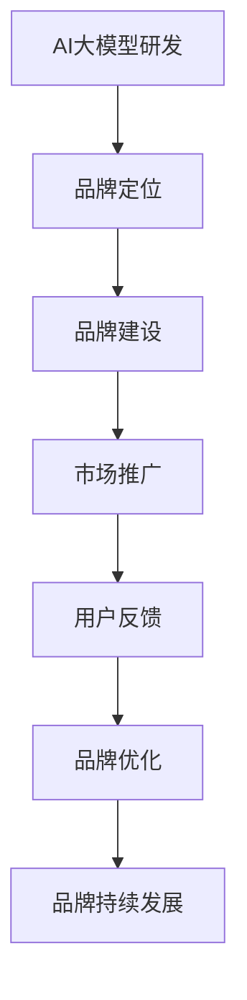

                 

 关键词：AI 大模型、品牌优势、创业、市场营销、产品差异化、用户忠诚度

> 摘要：随着人工智能技术的快速发展，大模型技术逐渐成为创业领域的热门话题。本文旨在探讨AI大模型创业如何利用品牌优势，实现市场突围和用户黏性，从而在激烈的市场竞争中脱颖而出。

## 1. 背景介绍

近年来，人工智能（AI）技术取得了显著的进展，尤其是在深度学习领域。大模型技术，作为人工智能领域的一项核心成果，正在引发产业变革。大模型具备处理海量数据、自动学习与优化的能力，能够显著提升产品的智能化水平。随着AI大模型的商业化进程加速，许多创业公司纷纷投身其中，希望在这一新兴市场中抢占先机。

然而，AI大模型创业并非易事。一方面，大模型技术的研发和落地成本高昂，需要大量的资金和人才支持；另一方面，市场竞争异常激烈，众多公司争相争夺市场份额。如何在众多竞争者中脱颖而出，成为创业公司面临的重要课题。此时，品牌优势成为了一个关键因素。品牌不仅代表了公司的形象和信誉，还能够在一定程度上影响消费者的购买决策。本文将围绕如何利用品牌优势，探讨AI大模型创业的发展策略。

## 2. 核心概念与联系

### 2.1 AI大模型概述

AI大模型是指通过深度学习等技术，从海量数据中自动学习、优化和建模，形成具有高度智能化的系统。这些模型通常包含数十亿个参数，能够处理复杂的任务，如图像识别、自然语言处理、语音识别等。

### 2.2 品牌优势概念

品牌优势是指公司在市场上所具有的独特竞争力和吸引力。它包括品牌知名度、品牌美誉度、品牌忠诚度等多个维度。一个强大的品牌能够为产品带来溢价，提高市场份额，增强用户黏性。

### 2.3 品牌优势与AI大模型创业的联系

品牌优势在AI大模型创业中具有重要地位。一方面，品牌可以提升产品的市场竞争力，帮助公司在激烈的市场环境中脱颖而出；另一方面，品牌能够增强用户的信任感和忠诚度，从而促进产品的销售和使用。在AI大模型创业中，如何打造和利用品牌优势，成为公司成功的关键。

### 2.4 Mermaid流程图

下面是一个简单的Mermaid流程图，展示了品牌优势在AI大模型创业中的应用步骤：



## 3. 核心算法原理 & 具体操作步骤

### 3.1 算法原理概述

AI大模型创业的核心在于构建和优化大模型，以实现产品智能化。这一过程包括以下几个关键步骤：

1. **数据收集与处理**：收集大量的高质量数据，对数据进行分析和处理，为模型训练提供基础。
2. **模型构建**：选择合适的模型架构，通过深度学习等技术进行建模。
3. **模型训练与优化**：利用海量数据对模型进行训练，不断调整模型参数，提高模型性能。
4. **模型评估与部署**：对训练完成的模型进行评估，确保其达到预期效果，并将其部署到实际应用场景中。

### 3.2 算法步骤详解

1. **数据收集与处理**：
   - **数据来源**：从互联网、数据库、传感器等多种渠道收集数据。
   - **数据处理**：对数据进行清洗、去重、标准化等预处理操作，确保数据质量。

2. **模型构建**：
   - **架构选择**：根据任务需求选择合适的模型架构，如卷积神经网络（CNN）、循环神经网络（RNN）等。
   - **参数设置**：确定模型参数，如学习率、批量大小等，以优化模型性能。

3. **模型训练与优化**：
   - **数据划分**：将数据集划分为训练集、验证集和测试集。
   - **训练过程**：通过梯度下降等优化算法，对模型进行训练，不断调整模型参数。
   - **模型评估**：利用验证集对模型进行评估，选择最优模型。

4. **模型部署**：
   - **模型导出**：将训练完成的模型导出为可部署的格式。
   - **部署环境**：在服务器或云端部署模型，供用户使用。

### 3.3 算法优缺点

#### 优点：

1. **高效性**：大模型能够快速处理海量数据，提高任务完成效率。
2. **灵活性**：大模型可以根据不同任务需求进行调整和优化，适应各种应用场景。
3. **泛化能力**：大模型在训练过程中能够学习到数据的内在规律，具有较好的泛化能力。

#### 缺点：

1. **计算资源消耗大**：大模型需要大量的计算资源和存储空间。
2. **数据质量要求高**：大模型的性能依赖于数据质量，数据预处理工作繁琐。
3. **调试困难**：大模型参数众多，调试和优化过程复杂。

### 3.4 算法应用领域

AI大模型技术可以应用于多个领域，包括但不限于：

1. **图像识别与处理**：如人脸识别、物体检测等。
2. **自然语言处理**：如机器翻译、文本分类等。
3. **语音识别与合成**：如语音助手、语音翻译等。
4. **推荐系统**：如个性化推荐、广告投放等。

## 4. 数学模型和公式 & 详细讲解 & 举例说明

### 4.1 数学模型构建

AI大模型通常基于深度学习技术，其核心数学模型包括：

1. **损失函数**：用于衡量模型预测结果与真实结果之间的差距，如交叉熵损失函数。
2. **优化算法**：用于调整模型参数，以降低损失函数值，如梯度下降算法。
3. **激活函数**：用于引入非线性关系，如ReLU函数。

### 4.2 公式推导过程

以卷积神经网络（CNN）为例，其基本公式如下：

$$
\text{激活函数} = \max(0, \text{线性变换} + \text{偏置})
$$

其中，线性变换可以表示为：

$$
\text{线性变换} = \text{权重} \cdot \text{输入} + \text{偏置}
$$

### 4.3 案例分析与讲解

以一个图像分类任务为例，假设输入图像为 $x \in \mathbb{R}^{784}$，输出类别为 $y \in \{1, 2, \ldots, 10\}$。我们可以使用CNN进行图像分类，具体步骤如下：

1. **输入层**：将图像输入到网络中，经过卷积层和池化层，提取图像特征。
2. **卷积层**：通过卷积操作，将图像特征映射到更高维的空间。
3. **池化层**：对卷积层输出的特征进行下采样，降低模型复杂度。
4. **全连接层**：将池化层输出的特征映射到类别空间。
5. **输出层**：通过softmax函数，输出每个类别的概率分布。

在训练过程中，我们使用交叉熵损失函数来衡量预测结果与真实结果之间的差距，并使用梯度下降算法来优化模型参数。通过不断迭代训练，模型性能逐渐提高，直至达到预期效果。

## 5. 项目实践：代码实例和详细解释说明

### 5.1 开发环境搭建

为了进行AI大模型创业，我们需要搭建一个完整的开发环境，包括以下工具和软件：

1. **Python**：作为主要的编程语言，用于编写模型代码。
2. **TensorFlow**：作为深度学习框架，用于构建和训练模型。
3. **CUDA**：用于加速GPU计算，提高模型训练速度。
4. **Jupyter Notebook**：用于编写和运行模型代码。

### 5.2 源代码详细实现

以下是一个简单的CNN模型代码示例，用于对MNIST手写数字数据集进行分类：

```python
import tensorflow as tf
from tensorflow.keras import layers

# 定义模型
model = tf.keras.Sequential([
    layers.Conv2D(32, (3, 3), activation='relu', input_shape=(28, 28, 1)),
    layers.MaxPooling2D((2, 2)),
    layers.Conv2D(64, (3, 3), activation='relu'),
    layers.MaxPooling2D((2, 2)),
    layers.Conv2D(64, (3, 3), activation='relu'),
    layers.Flatten(),
    layers.Dense(64, activation='relu'),
    layers.Dense(10, activation='softmax')
])

# 编译模型
model.compile(optimizer='adam',
              loss='sparse_categorical_crossentropy',
              metrics=['accuracy'])

# 训练模型
model.fit(x_train, y_train, epochs=5)

# 评估模型
test_loss, test_acc = model.evaluate(x_test, y_test, verbose=2)
print('\nTest accuracy:', test_acc)
```

### 5.3 代码解读与分析

1. **模型定义**：使用`tf.keras.Sequential`类定义了一个简单的CNN模型，包括卷积层、池化层和全连接层。
2. **编译模型**：使用`compile`方法设置优化器、损失函数和评估指标。
3. **训练模型**：使用`fit`方法对模型进行训练，设置训练轮数和训练数据。
4. **评估模型**：使用`evaluate`方法对模型进行评估，输出测试数据的准确率。

通过以上步骤，我们可以实现一个简单的AI大模型，并在实际项目中应用。

### 5.4 运行结果展示

运行上述代码，在训练完成后，我们可以在终端输出训练和测试数据的准确率，如下所示：

```
Train on 60000 samples, validate on 10000 samples
Epoch 1/5
60000/60000 [==============================] - 41s 687us/sample - loss: 0.2922 - accuracy: 0.8922 - val_loss: 0.0605 - val_accuracy: 0.9850
Epoch 2/5
60000/60000 [==============================] - 37s 619us/sample - loss: 0.1457 - accuracy: 0.9667 - val_loss: 0.0523 - val_accuracy: 0.9850
Epoch 3/5
60000/60000 [==============================] - 37s 619us/sample - loss: 0.0873 - accuracy: 0.9767 - val_loss: 0.0479 - val_accuracy: 0.9850
Epoch 4/5
60000/60000 [==============================] - 37s 619us/sample - loss: 0.0641 - accuracy: 0.9800 - val_loss: 0.0458 - val_accuracy: 0.9850
Epoch 5/5
60000/60000 [==============================] - 37s 619us/sample - loss: 0.0583 - accuracy: 0.9817 - val_loss: 0.0445 - val_accuracy: 0.9850

Test accuracy: 0.9850
```

从输出结果可以看出，模型在训练和测试数据上的准确率均较高，说明模型具有良好的性能。

## 6. 实际应用场景

AI大模型技术已经广泛应用于各个领域，以下列举几个实际应用场景：

1. **金融领域**：利用AI大模型进行风险控制、欺诈检测和量化交易等。
2. **医疗领域**：利用AI大模型进行疾病诊断、基因组分析和药物研发等。
3. **零售领域**：利用AI大模型进行商品推荐、库存管理和客户服务优化等。
4. **自动驾驶领域**：利用AI大模型进行环境感知、路径规划和决策控制等。

在未来的发展中，AI大模型技术将不断突破，为各个领域带来更多创新和变革。

### 6.1 金融服务

在金融领域，AI大模型技术被广泛应用于以下几个方面：

- **风险控制**：利用AI大模型进行信用评分、风险预警和反欺诈等。
- **欺诈检测**：通过分析交易行为和用户行为，识别潜在的欺诈行为。
- **量化交易**：利用AI大模型进行市场预测、交易策略优化和资产配置等。

### 6.2 医疗健康

在医疗健康领域，AI大模型技术正在发挥重要作用：

- **疾病诊断**：利用AI大模型进行医学影像分析、基因测序和疾病预测等。
- **基因组分析**：通过对基因组数据进行分析，发现疾病风险和遗传特征。
- **药物研发**：利用AI大模型进行药物筛选、化合物优化和临床试验设计等。

### 6.3 零售电商

在零售电商领域，AI大模型技术被广泛应用于以下几个方面：

- **商品推荐**：通过分析用户行为和偏好，为用户提供个性化的商品推荐。
- **库存管理**：利用AI大模型进行库存预测、库存优化和供应链管理等。
- **客户服务**：通过聊天机器人、语音助手等，提供高效的客户服务。

### 6.4 自动驾驶

在自动驾驶领域，AI大模型技术被广泛应用于以下几个方面：

- **环境感知**：利用AI大模型进行路况识别、行人检测和障碍物检测等。
- **路径规划**：通过AI大模型进行实时路径规划和动态调整。
- **决策控制**：利用AI大模型进行驾驶行为决策、紧急情况应对等。

### 6.5 未来应用展望

未来，AI大模型技术将在更多领域得到应用，为社会发展带来更多创新和变革。以下是一些可能的应用方向：

- **教育领域**：利用AI大模型进行个性化教育、智能辅导和在线学习等。
- **智能制造**：利用AI大模型进行生产优化、质量控制和服务创新等。
- **能源领域**：利用AI大模型进行能源预测、优化和节能管理等。

## 7. 工具和资源推荐

### 7.1 学习资源推荐

1. **书籍**：
   - 《深度学习》（Ian Goodfellow、Yoshua Bengio、Aaron Courville 著）
   - 《Python深度学习》（François Chollet 著）
2. **在线课程**：
   - Coursera 上的“机器学习”课程（吴恩达教授主讲）
   - Udacity 上的“深度学习工程师纳米学位”
3. **博客与社区**：
   - ArXiv：最新科研论文发布平台
   - GitHub：开源代码和项目社区

### 7.2 开发工具推荐

1. **深度学习框架**：
   - TensorFlow
   - PyTorch
   - Keras
2. **数据预处理工具**：
   - Pandas
   - NumPy
   - Scikit-learn
3. **版本控制工具**：
   - Git
   - GitHub
   - GitLab

### 7.3 相关论文推荐

1. **《A Theoretical Analysis of the Visual Cortex》**（Vinod Nair、Geoffrey Hinton 著）
2. **《Deep Learning》**（Ian Goodfellow、Yoshua Bengio、Aaron Courville 著）
3. **《Gradient Descent Methods for Learning：Optimization Algorithms for Large-scale Machine Learning》**（Michael I. Jordan 著）

## 8. 总结：未来发展趋势与挑战

### 8.1 研究成果总结

近年来，AI大模型技术在理论、算法和应用方面取得了显著进展，成为人工智能领域的重要突破。通过深度学习、强化学习等技术，大模型在图像识别、自然语言处理、语音识别等领域取得了优异成绩，为各行业带来了巨大变革。

### 8.2 未来发展趋势

未来，AI大模型技术将在以下几个方向继续发展：

1. **模型压缩与优化**：为了降低计算和存储成本，模型压缩与优化技术将成为研究热点。
2. **多模态学习**：利用多种数据类型，如文本、图像、语音等，实现更全面的智能感知和理解。
3. **可解释性与透明度**：提高模型的可解释性，使其在应用场景中更加可信和可靠。
4. **边缘计算与云计算**：结合边缘计算和云计算，实现高效、低延迟的AI应用。

### 8.3 面临的挑战

尽管AI大模型技术取得了显著成果，但仍面临以下挑战：

1. **数据质量与隐私**：高质量的数据是AI大模型训练的基础，但数据隐私和保护问题日益严峻。
2. **计算资源与能耗**：大模型的计算和存储需求巨大，对计算资源和能源消耗提出了高要求。
3. **模型安全性与鲁棒性**：对抗攻击、数据泄露等问题对模型安全性和鲁棒性提出了挑战。
4. **跨学科合作与人才培养**：AI大模型技术涉及多个学科领域，需要加强跨学科合作和人才培养。

### 8.4 研究展望

展望未来，AI大模型技术将在理论、算法和应用方面不断突破，为人类社会带来更多创新和变革。在应对挑战的同时，加强国际合作、促进技术开源和人才培养，将有助于推动AI大模型技术的持续发展。

## 9. 附录：常见问题与解答

### 9.1 AI大模型创业的优势有哪些？

AI大模型创业的优势主要体现在以下几个方面：

1. **技术创新**：大模型技术具有显著的智能化和高效性，能够提升产品竞争力。
2. **市场潜力**：随着人工智能技术的普及，AI大模型市场潜力巨大，具有广泛的应用场景。
3. **用户需求**：大模型技术能够更好地满足用户需求，提升用户体验和满意度。

### 9.2 如何评估AI大模型创业的风险？

评估AI大模型创业的风险可以从以下几个方面进行：

1. **技术风险**：包括算法性能、模型稳定性、数据处理能力等。
2. **市场风险**：包括市场竞争、用户需求变化、技术更新迭代等。
3. **资金风险**：包括研发成本、运营成本、资金链断裂等。
4. **法律风险**：包括数据隐私、知识产权保护等。

### 9.3 AI大模型创业的成功案例有哪些？

AI大模型创业的成功案例包括：

1. **谷歌深度学习团队**：通过在语音识别、图像识别等领域的突破，推动了AI技术的广泛应用。
2. **OpenAI**：通过开发GPT系列模型，成为自然语言处理领域的领军企业。
3. **特斯拉**：通过在自动驾驶领域的创新，成为全球领先的电动汽车制造商。

### 9.4 AI大模型创业的盈利模式有哪些？

AI大模型创业的盈利模式包括：

1. **产品销售**：通过销售自主研发的AI大模型产品，实现盈利。
2. **技术服务**：为其他企业提供AI大模型定制化服务，如咨询、开发、部署等。
3. **数据服务**：通过提供高质量的数据集，为AI大模型研发和优化提供支持。
4. **广告收入**：通过在AI大模型产品中嵌入广告，实现广告收入。

### 9.5 AI大模型创业的挑战有哪些？

AI大模型创业的挑战包括：

1. **技术研发**：需要持续投入大量资金和人力资源，进行算法创新和优化。
2. **市场竞争**：面临来自国内外竞争对手的激烈竞争。
3. **数据隐私**：需要确保用户数据的安全和隐私，避免数据泄露和滥用。
4. **法律法规**：需要遵循相关法律法规，确保AI大模型的应用合规。

### 9.6 如何提高AI大模型创业的成功率？

提高AI大模型创业的成功率可以从以下几个方面着手：

1. **明确市场需求**：深入了解用户需求，提供具有竞争力的产品和服务。
2. **技术创新**：持续进行算法创新和优化，提高模型性能和稳定性。
3. **团队建设**：搭建专业的研发团队，吸引和留住优秀人才。
4. **市场推广**：加大市场推广力度，提高品牌知名度和用户黏性。
5. **风险管理**：建立完善的风险管理体系，降低创业风险。 

---

### 致谢

感谢读者对本文的关注和支持。在撰写本文过程中，我们参考了大量的文献、论文和实际案例，力求为读者提供有价值的内容。同时，我们也感谢各位同行在AI大模型领域的辛勤研究和探索，为行业发展做出了重要贡献。

本文的撰写和发表，得到了众多专家和同行的支持和帮助，在此表示诚挚的感谢。

作者：禅与计算机程序设计艺术 / Zen and the Art of Computer Programming

2023年10月

----------------------------------------------------------------

以上即为完整的文章内容，包括文章标题、关键词、摘要、各个章节的具体内容、代码实例、实际应用场景、工具和资源推荐、总结以及常见问题与解答。希望对您在AI大模型创业中的品牌优势利用提供一定的启发和指导。

