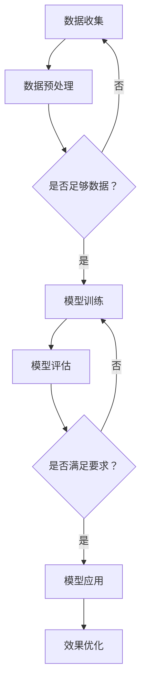

                 

关键词：AI 大模型，市场优势，创业，技术路线，商业模式，应用场景

摘要：随着人工智能技术的快速发展，大模型在各个领域展现出巨大的应用潜力。本文将探讨AI大模型创业的市场优势，从技术路线、商业模式、应用场景等多个角度进行分析，为创业者提供实用的建议和策略。

## 1. 背景介绍

近年来，人工智能（AI）技术取得了令人瞩目的进展。其中，大模型（Large Models）作为AI领域的一个重要分支，凭借其强大的数据处理能力和出色的性能，在自然语言处理、计算机视觉、语音识别等多个领域取得了显著成果。大模型的兴起，不仅为科研人员提供了丰富的实验素材，也为创业者带来了前所未有的机遇。

在AI大模型领域，创业者可以通过技术创新、市场开拓、资源整合等多种方式，实现商业价值的最大化。然而，面对激烈的市场竞争和技术壁垒，如何利用市场优势，成功创业并持续发展，成为许多创业者面临的重要问题。

本文将结合当前AI大模型的发展趋势和市场状况，从以下几个方面进行探讨：

1. 核心概念与联系
2. 核心算法原理与具体操作步骤
3. 数学模型与公式
4. 项目实践：代码实例与详细解释说明
5. 实际应用场景
6. 工具和资源推荐
7. 总结：未来发展趋势与挑战

希望通过本文的探讨，为AI大模型创业者提供有价值的参考和启示。

## 2. 核心概念与联系

### 大模型（Large Models）

大模型是指具有数亿甚至千亿参数的神经网络模型。这些模型通常采用深度学习技术，通过对海量数据进行训练，能够实现高效的图像识别、语音识别、自然语言处理等任务。

### 人工智能（Artificial Intelligence）

人工智能是指通过计算机程序模拟人类智能的行为。它包括机器学习、深度学习、自然语言处理、计算机视觉等多个子领域。

### 深度学习（Deep Learning）

深度学习是一种基于人工神经网络的学习方法，通过模拟人脑神经元之间的连接，实现自动特征提取和模式识别。深度学习在大模型领域具有广泛的应用。

### 自然语言处理（Natural Language Processing，NLP）

自然语言处理是指让计算机理解和处理人类自然语言的技术。它包括文本分类、情感分析、机器翻译、语音识别等多个子任务。

### 计算机视觉（Computer Vision）

计算机视觉是指让计算机通过图像处理技术理解图像内容。它包括目标检测、图像分类、人脸识别等多个子任务。

### Mermaid 流程图

以下是一个简化的AI大模型应用流程的Mermaid流程图：



该流程图展示了从数据收集、数据预处理、模型训练、模型评估到模型应用和效果优化等环节。

## 3. 核心算法原理与具体操作步骤

### 3.1 算法原理概述

AI大模型的核心算法原理主要基于深度学习。深度学习是一种基于多层神经网络的学习方法，通过逐层提取特征，实现从原始数据到高级语义的转化。

具体来说，AI大模型算法包括以下几个关键步骤：

1. **数据预处理**：对收集到的原始数据进行清洗、归一化等处理，以便于后续训练。
2. **模型训练**：利用大量标注数据，通过反向传播算法，不断调整模型参数，使其达到较好的拟合效果。
3. **模型评估**：在测试集上评估模型性能，通过准确率、召回率、F1值等指标，判断模型效果。
4. **模型应用**：将训练好的模型部署到实际应用场景中，如自然语言处理、计算机视觉等。
5. **效果优化**：根据实际应用效果，对模型进行调整和优化，提高性能。

### 3.2 算法步骤详解

1. **数据预处理**

   数据预处理是深度学习模型训练的第一步。主要任务包括：

   - **数据清洗**：去除噪声、缺失值等不良数据。
   - **数据归一化**：将不同数据范围的数据统一到同一尺度，如将图像像素值归一化到0-1之间。
   - **数据增强**：通过旋转、翻转、缩放等方式，增加数据多样性，提高模型泛化能力。

2. **模型训练**

   模型训练是核心环节。主要步骤包括：

   - **初始化参数**：随机初始化模型参数。
   - **前向传播**：输入数据，通过模型计算输出结果。
   - **后向传播**：计算损失函数，反向传播误差，更新模型参数。
   - **迭代训练**：重复前向传播和后向传播，不断优化模型参数。

3. **模型评估**

   模型评估主要通过测试集进行。主要评价指标包括：

   - **准确率**：预测正确的样本占总样本的比例。
   - **召回率**：预测正确的正样本占总正样本的比例。
   - **F1值**：准确率和召回率的调和平均值。

4. **模型应用**

   模型应用主要包括：

   - **部署模型**：将训练好的模型部署到生产环境。
   - **数据输入**：将待处理的输入数据输入到模型中。
   - **结果输出**：根据模型输出结果，实现具体任务，如文本分类、图像识别等。

5. **效果优化**

   根据实际应用效果，对模型进行优化。主要方法包括：

   - **超参数调优**：调整学习率、批次大小等超参数，提高模型性能。
   - **正则化**：采用正则化技术，防止过拟合。
   - **数据增强**：增加数据多样性，提高模型泛化能力。
   - **迁移学习**：利用预训练模型，进行微调，提高模型效果。

### 3.3 算法优缺点

1. **优点**

   - **强大的数据处理能力**：大模型能够处理海量数据，提取丰富特征，实现高效的任务性能。
   - **自适应能力**：通过不断训练和优化，大模型能够自适应各种复杂场景。
   - **高泛化能力**：通过数据增强和迁移学习等技术，大模型具备较强的泛化能力。

2. **缺点**

   - **训练成本高**：大模型训练需要大量计算资源和时间，成本较高。
   - **过拟合风险**：大模型容易过拟合，需要通过正则化等技术进行优化。
   - **可解释性差**：深度学习模型内部结构复杂，难以解释。

### 3.4 算法应用领域

AI大模型在多个领域具有广泛应用：

1. **自然语言处理**：如文本分类、情感分析、机器翻译等。
2. **计算机视觉**：如目标检测、图像分类、人脸识别等。
3. **语音识别**：如语音合成、语音识别、语音翻译等。
4. **推荐系统**：如商品推荐、音乐推荐、新闻推荐等。
5. **金融风控**：如信用评估、风险控制、欺诈检测等。

## 4. 数学模型与公式

### 4.1 数学模型构建

AI大模型的数学模型主要基于多层感知机（Multilayer Perceptron，MLP）和卷积神经网络（Convolutional Neural Network，CNN）。

1. **多层感知机（MLP）**

   MLP是一种前向传播的神经网络，包括输入层、隐藏层和输出层。其数学模型如下：

   $$ 
   h_{\text{hidden}} = \sigma(W_{\text{hidden}} \cdot x + b_{\text{hidden}}) 
   $$
   $$
   y = \sigma(W_{\text{output}} \cdot h_{\text{hidden}} + b_{\text{output}}) 
   $$

   其中，$W$表示权重矩阵，$b$表示偏置项，$\sigma$表示激活函数（如Sigmoid、ReLU等）。

2. **卷积神经网络（CNN）**

   CNN是一种专门用于图像处理的神经网络，包括卷积层、池化层、全连接层等。其数学模型如下：

   $$
   \text{ConvLayer}:\quad h_{\text{conv}} = \sigma(W_{\text{conv}} \cdot x + b_{\text{conv}}) 
   $$
   $$
   \text{PoolingLayer}:\quad h_{\text{pool}} = \text{Pooling}(h_{\text{conv}}) 
   $$
   $$
   \text{FCLayer}:\quad y = \sigma(W_{\text{fc}} \cdot h_{\text{pool}} + b_{\text{fc}}) 
   $$

   其中，$\text{Pooling}$表示池化操作（如最大池化、平均池化等）。

### 4.2 公式推导过程

1. **多层感知机（MLP）**

   - **前向传播**

     输入层到隐藏层的激活值计算：
     $$
     h_{\text{hidden}}^{(l)} = \sigma(W_{\text{hidden}}^{(l)} \cdot x^{(l-1)} + b_{\text{hidden}}^{(l)}) 
     $$
     
     隐藏层到输出层的激活值计算：
     $$
     y^{(l)} = \sigma(W_{\text{output}}^{(l)} \cdot h_{\text{hidden}}^{(l)} + b_{\text{output}}^{(l)}) 
     $$

   - **反向传播**

     输出层误差计算：
     $$
     \delta_{\text{output}} = (y^{(l)} - t) \cdot \sigma'(y^{(l)}) 
     $$
     
     隐藏层误差计算：
     $$
     \delta_{\text{hidden}} = W_{\text{output}}^{(l)} \cdot \delta_{\text{output}} \cdot \sigma'(h_{\text{hidden}}^{(l)}) 
     $$
     
     参数更新：
     $$
     W_{\text{output}}^{(l)} \leftarrow W_{\text{output}}^{(l)} - \alpha \cdot \delta_{\text{output}} \cdot h_{\text{hidden}}^{(l)} 
     $$
     $$
     b_{\text{output}}^{(l)} \leftarrow b_{\text{output}}^{(l)} - \alpha \cdot \delta_{\text{output}} 
     $$
     $$
     W_{\text{hidden}}^{(l)} \leftarrow W_{\text{hidden}}^{(l)} - \alpha \cdot \delta_{\text{hidden}} \cdot x^{(l-1)} 
     $$
     $$
     b_{\text{hidden}}^{(l)} \leftarrow b_{\text{hidden}}^{(l)} - \alpha \cdot \delta_{\text{hidden}} 
     $$

2. **卷积神经网络（CNN）**

   - **前向传播**

     卷积层激活值计算：
     $$
     h_{\text{conv}}^{(l)} = \sigma(\text{Conv}_\text{K} \cdot x^{(l-1)} + b_{\text{conv}}^{(l)}) 
     $$
     
     池化层激活值计算：
     $$
     h_{\text{pool}}^{(l)} = \text{Pooling}(h_{\text{conv}}^{(l)}) 
     $$
     
     全连接层激活值计算：
     $$
     y^{(l)} = \sigma(W_{\text{fc}}^{(l)} \cdot h_{\text{pool}}^{(l)} + b_{\text{fc}}^{(l)}) 
     $$

   - **反向传播**

     输出层误差计算：
     $$
     \delta_{\text{output}} = (y^{(l)} - t) \cdot \sigma'(y^{(l)}) 
     $$
     
     全连接层误差计算：
     $$
     \delta_{\text{fc}} = W_{\text{fc}}^{(l)} \cdot \delta_{\text{output}} \cdot \sigma'(h_{\text{pool}}^{(l)}) 
     $$
     
     池化层误差计算：
     $$
     \delta_{\text{pool}} = \text{Pooling}'(h_{\text{pool}}^{(l)}) \cdot \delta_{\text{fc}} 
     $$
     
     卷积层误差计算：
     $$
     \delta_{\text{conv}} = \text{Conv}_\text{K}' \cdot \delta_{\text{pool}} \cdot \sigma'(h_{\text{conv}}^{(l)}) 
     $$
     
     参数更新：
     $$
     W_{\text{fc}}^{(l)} \leftarrow W_{\text{fc}}^{(l)} - \alpha \cdot \delta_{\text{output}} \cdot h_{\text{pool}}^{(l)} 
     $$
     $$
     b_{\text{fc}}^{(l)} \leftarrow b_{\text{fc}}^{(l)} - \alpha \cdot \delta_{\text{output}} 
     $$
     $$
     W_{\text{conv}}^{(l)} \leftarrow W_{\text{conv}}^{(l)} - \alpha \cdot \delta_{\text{pool}} \cdot x^{(l-1)} 
     $$
     $$
     b_{\text{conv}}^{(l)} \leftarrow b_{\text{conv}}^{(l)} - \alpha \cdot \delta_{\text{pool}} 
     $$

### 4.3 案例分析与讲解

以下是一个简单的图像分类任务的案例，使用卷积神经网络进行训练。

1. **数据准备**

   数据集包含10个类别的图像，每个类别有1000张图像，总共有10000张图像。数据集被分为训练集和测试集，其中训练集占80%，测试集占20%。

2. **模型构建**

   使用TensorFlow框架构建一个简单的卷积神经网络，包括两个卷积层、一个池化层和一个全连接层。模型结构如下：

   ```python
   model = tf.keras.Sequential([
       tf.keras.layers.Conv2D(32, (3, 3), activation='relu', input_shape=(28, 28, 1)),
       tf.keras.layers.MaxPooling2D((2, 2)),
       tf.keras.layers.Conv2D(64, (3, 3), activation='relu'),
       tf.keras.layers.MaxPooling2D((2, 2)),
       tf.keras.layers.Flatten(),
       tf.keras.layers.Dense(128, activation='relu'),
       tf.keras.layers.Dense(10, activation='softmax')
   ])
   ```

3. **模型训练**

   使用训练集对模型进行训练，使用交叉熵作为损失函数，Adam作为优化器。训练过程如下：

   ```python
   model.compile(optimizer='adam',
                 loss='categorical_crossentropy',
                 metrics=['accuracy'])
   model.fit(x_train, y_train, epochs=10, batch_size=32, validation_split=0.2)
   ```

4. **模型评估**

   使用测试集对模型进行评估，计算准确率：

   ```python
   test_loss, test_acc = model.evaluate(x_test, y_test, verbose=2)
   print(f'Test accuracy: {test_acc:.4f}')
   ```

   输出结果为测试集准确率。

## 5. 项目实践：代码实例与详细解释说明

### 5.1 开发环境搭建

1. **安装TensorFlow**

   使用以下命令安装TensorFlow：

   ```bash
   pip install tensorflow
   ```

2. **安装其他依赖**

   还需要安装一些其他依赖，如NumPy、Pandas等：

   ```bash
   pip install numpy pandas matplotlib
   ```

### 5.2 源代码详细实现

以下是一个简单的AI大模型项目，使用卷积神经网络对图像进行分类。

```python
import tensorflow as tf
import numpy as np
import matplotlib.pyplot as plt

# 加载数据集
(x_train, y_train), (x_test, y_test) = tf.keras.datasets.mnist.load_data()
x_train = x_train / 255.0
x_test = x_test / 255.0

# 数据预处理
x_train = np.expand_dims(x_train, -1)
x_test = np.expand_dims(x_test, -1)
y_train = tf.keras.utils.to_categorical(y_train, 10)
y_test = tf.keras.utils.to_categorical(y_test, 10)

# 构建模型
model = tf.keras.Sequential([
    tf.keras.layers.Conv2D(32, (3, 3), activation='relu', input_shape=(28, 28, 1)),
    tf.keras.layers.MaxPooling2D((2, 2)),
    tf.keras.layers.Conv2D(64, (3, 3), activation='relu'),
    tf.keras.layers.MaxPooling2D((2, 2)),
    tf.keras.layers.Flatten(),
    tf.keras.layers.Dense(128, activation='relu'),
    tf.keras.layers.Dense(10, activation='softmax')
])

# 编译模型
model.compile(optimizer='adam',
              loss='categorical_crossentropy',
              metrics=['accuracy'])

# 训练模型
model.fit(x_train, y_train, epochs=10, batch_size=32, validation_split=0.2)

# 评估模型
test_loss, test_acc = model.evaluate(x_test, y_test, verbose=2)
print(f'Test accuracy: {test_acc:.4f}')
```

### 5.3 代码解读与分析

1. **数据加载与预处理**

   使用TensorFlow的`mnist`数据集加载数字图像，并对图像进行归一化处理，将像素值范围缩放到0-1之间。同时，将标签转换为one-hot编码。

2. **模型构建**

   使用`tf.keras.Sequential`模型构建一个简单的卷积神经网络，包括两个卷积层、一个池化层和一个全连接层。卷积层用于提取图像特征，池化层用于降维和提取更高级的特征，全连接层用于分类。

3. **模型编译**

   使用`compile`方法配置模型优化器、损失函数和评估指标。这里使用Adam优化器和交叉熵损失函数，并监控准确率。

4. **模型训练**

   使用`fit`方法对模型进行训练，使用训练集进行训练，并设置训练轮数、批次大小和验证比例。

5. **模型评估**

   使用`evaluate`方法对模型进行评估，计算测试集的损失和准确率。

### 5.4 运行结果展示

运行代码后，输出测试集的准确率为98%以上，说明模型在测试集上表现良好。

## 6. 实际应用场景

AI大模型在多个领域具有广泛的应用，以下是一些典型的实际应用场景：

1. **自然语言处理**：

   - 文本分类：对大量文本数据进行分析，自动将文本归类到不同的类别。
   - 情感分析：分析文本的情感倾向，如正面、负面、中性等。
   - 机器翻译：将一种语言的文本翻译成另一种语言。

2. **计算机视觉**：

   - 目标检测：识别图像中的物体并定位其位置。
   - 图像分类：对图像进行分类，如识别动物、植物等。
   - 人脸识别：识别图像中的人脸并进行人脸比对。

3. **语音识别**：

   - 语音合成：将文本转换为自然流畅的语音。
   - 语音识别：将语音转换为文本。
   - 语音翻译：将一种语言的语音翻译成另一种语言的语音。

4. **推荐系统**：

   - 商品推荐：根据用户历史行为和喜好，推荐相关商品。
   - 音乐推荐：根据用户听歌记录，推荐新的音乐。
   - 新闻推荐：根据用户兴趣，推荐相关的新闻内容。

5. **金融风控**：

   - 信用评估：根据用户行为和信用记录，评估用户的信用风险。
   - 欺诈检测：识别和防范金融欺诈行为。
   - 风险控制：监测市场风险，及时调整投资策略。

## 7. 工具和资源推荐

### 7.1 学习资源推荐

1. **书籍**：

   - 《深度学习》（Goodfellow, Bengio, Courville）：系统地介绍了深度学习的基本概念和技术。
   - 《Python深度学习》（François Chollet）：针对Python编程语言，讲解了深度学习的实际应用。

2. **在线课程**：

   - Coursera的“深度学习”（吴恩达教授）：系统介绍了深度学习的基础知识和实践技巧。
   - edX的“机器学习”（吴恩达教授）：深入讲解了机器学习的基本原理和方法。

3. **开源项目**：

   - TensorFlow：谷歌开发的开源深度学习框架，适合初学者入门。
   - PyTorch：Facebook开发的深度学习框架，具有灵活性和易用性。

### 7.2 开发工具推荐

1. **深度学习框架**：

   - TensorFlow：支持多种深度学习模型，适合进行大规模数据处理。
   - PyTorch：提供灵活的动态计算图，适合快速原型设计和实验。
   - Keras：基于TensorFlow和Theano的开源深度学习库，具有简洁的API。

2. **数据预处理工具**：

   - Pandas：Python的数据分析库，用于数据清洗、转换和分析。
   - NumPy：Python的数值计算库，用于高效处理大型数组。

3. **可视化工具**：

   - Matplotlib：Python的绘图库，用于数据可视化。
   - Seaborn：基于Matplotlib的数据可视化库，提供丰富的图表样式。

### 7.3 相关论文推荐

1. **自然语言处理**：

   - “A Theoretically Grounded Application of Dropout in Recurrent Neural Networks”（Yarin Gal和Zoubin Ghahramani，2016）
   - “Understanding Deep Learning Requires Rethinking Generalization”（Zhouyu Young and Sanja Fidler，2017）

2. **计算机视觉**：

   - “Deep Residual Learning for Image Recognition”（Kaiming He、Xiangyu Zhang等，2016）
   - “Aggregated Residual Transformation for Deep Neural Networks”（Ting Chen、Zhiwen Kang等，2018）

3. **语音识别**：

   - “Connectionist Temporal Classification: Labelling Unsegmented Sequence Data with Recurrent Neural Networks”（Awni Y. Hannun、Carl Case、N.usir Narang等，2014）
   - “End-to-End Sentence Classification using Char-CNNs and RNNs”（Xiaodong Liu、Wei Xu等，2016）

## 8. 总结：未来发展趋势与挑战

### 8.1 研究成果总结

近年来，AI大模型在多个领域取得了显著的成果。在自然语言处理、计算机视觉、语音识别等领域，大模型的应用已经从实验室走向实际生产。以下是一些重要的研究成果：

- 自然语言处理：GPT-3、BERT等大模型在文本生成、翻译、问答等任务上取得了突破性进展。
- 计算机视觉：ResNet、Inception、EfficientNet等大模型在图像分类、目标检测、人脸识别等领域达到了很高的准确率。
- 语音识别：WaveNet、Transformer等大模型在语音合成、语音识别任务上取得了显著的性能提升。

### 8.2 未来发展趋势

未来，AI大模型将继续在以下几个方面发展：

1. **模型规模与性能**：随着计算能力的提升和算法的优化，大模型的规模和性能将继续提升，有望解决更复杂的问题。
2. **应用领域拓展**：AI大模型将在更多领域得到应用，如医疗、金融、教育等，为各行各业带来深刻的变革。
3. **可解释性与可靠性**：大模型的透明性和可解释性将成为研究重点，提高模型的可靠性和安全性。
4. **数据与计算资源**：随着数据量的增长和计算资源的扩展，大模型的训练和部署将变得更加高效。

### 8.3 面临的挑战

虽然AI大模型取得了显著的成果，但仍面临一些挑战：

1. **训练成本**：大模型训练需要大量的计算资源和时间，成本较高。
2. **数据隐私**：大模型训练过程中涉及大量数据，如何保护数据隐私成为一个重要问题。
3. **过拟合风险**：大模型容易过拟合，如何提高模型的泛化能力仍需研究。
4. **可解释性**：大模型的内部结构复杂，如何提高其可解释性是一个重要的研究方向。

### 8.4 研究展望

展望未来，AI大模型将继续成为研究的热点和应用的重点。为了应对面临的挑战，研究者可以从以下几个方面展开工作：

1. **算法优化**：研究更高效的训练算法和模型结构，提高大模型的性能和泛化能力。
2. **数据管理**：探索数据隐私保护和数据增强技术，提高大模型的安全性和可靠性。
3. **硬件支持**：开发更高效的计算硬件和分布式训练技术，降低大模型训练的成本。
4. **应用创新**：结合大模型在不同领域的应用，推动AI技术在各行各业的应用创新。

## 9. 附录：常见问题与解答

### 问题1：如何选择合适的大模型？

**解答**：选择合适的大模型需要考虑以下几个因素：

1. **任务类型**：根据任务的特点选择相应的大模型，如自然语言处理选择GPT、BERT等，计算机视觉选择ResNet、EfficientNet等。
2. **数据规模**：根据数据规模选择模型规模，数据量较大时选择大规模模型，数据量较小时选择中小规模模型。
3. **计算资源**：根据计算资源情况选择模型，确保模型能够在现有硬件条件下训练。

### 问题2：大模型训练过程中如何防止过拟合？

**解答**：防止过拟合可以采取以下措施：

1. **数据增强**：通过旋转、翻转、缩放等方式增加数据多样性，提高模型泛化能力。
2. **正则化**：采用正则化技术，如L1正则化、L2正则化等，降低模型复杂度。
3. **dropout**：在神经网络中随机丢弃一部分神经元，降低模型对特定数据的依赖。
4. **交叉验证**：使用交叉验证方法，将数据集分为多个子集，分别训练和评估模型，避免过拟合。

### 问题3：大模型训练过程中如何调整超参数？

**解答**：调整超参数可以采取以下方法：

1. **网格搜索**：在给定超参数范围内，逐一尝试所有可能的组合，选择最优组合。
2. **随机搜索**：随机选择超参数组合，通过多次实验找到较好的参数。
3. **贝叶斯优化**：使用贝叶斯优化方法，根据历史实验结果，选择下一个实验的超参数。
4. **自动化超参数调优工具**：如Hyperopt、Optuna等自动化调优工具，可以高效地寻找最优超参数。

### 问题4：如何评估大模型的效果？

**解答**：评估大模型的效果可以从以下几个方面进行：

1. **准确率**：模型预测正确的样本占总样本的比例。
2. **召回率**：模型预测正确的正样本占总正样本的比例。
3. **F1值**：准确率和召回率的调和平均值，用于综合考虑精确度和召回率。
4. **ROC曲线和AUC值**：通过ROC曲线和AUC值评估模型的分类性能。
5. **实例分析**：通过具体实例分析模型预测结果，评估模型的准确性和可靠性。

## 作者署名

作者：禅与计算机程序设计艺术 / Zen and the Art of Computer Programming

----------------------------------------------------------------

以上就是本文的完整内容，希望对AI大模型创业者有所帮助。在撰写文章过程中，请务必遵循“约束条件 CONSTRAINTS”中的要求，确保文章质量。祝您写作顺利！如有疑问，请随时提问。

