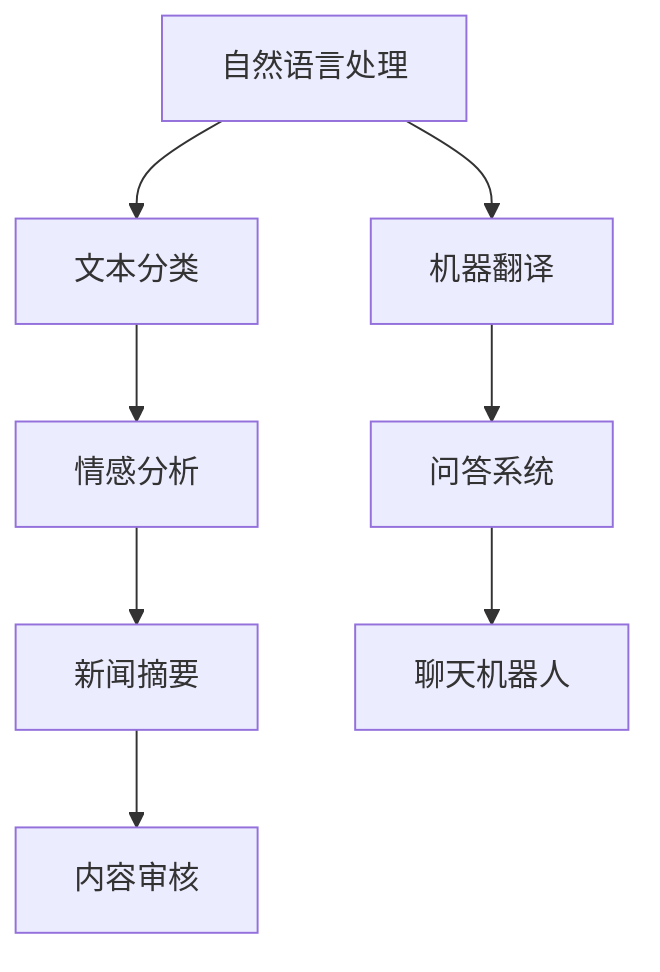

                 

在当今科技迅猛发展的时代，人工智能（AI）已经成为推动各个行业变革的核心动力。尤其是大型预训练模型（Large Pre-Trained Models，简称LPMs），如GPT-3、BERT等，以其卓越的表现和广泛的应用前景，吸引了众多创业者和投资者的关注。本文将探讨如何利用这些技术优势，在创业过程中取得成功。

## 关键词

- 人工智能
- 大模型
- 创业
- 技术优势
- 投资策略
- 应用场景
- 未来展望

## 摘要

本文旨在为AI大模型创业提供技术指导。首先，我们将介绍AI大模型的发展背景和核心概念。接着，分析其技术优势，并提供具体的创业策略。随后，探讨AI大模型在不同领域的应用案例，最后展望其未来发展趋势和面临的挑战。

## 1. 背景介绍

近年来，AI领域取得了飞速发展，尤其是深度学习和自然语言处理（NLP）技术的突破。这些技术不仅提升了AI模型的表现，还大大降低了开发门槛。同时，随着云计算和大数据技术的成熟，大规模数据处理和计算资源变得更加廉价和便捷。这些因素共同推动了AI大模型的兴起。

AI大模型通常采用深度神经网络（DNN）架构，通过大规模数据训练，实现了前所未有的表现。例如，GPT-3拥有1750亿个参数，能够在各种任务中表现出色。这些模型不仅能够处理复杂的任务，还能进行自我学习和改进。

## 2. 核心概念与联系

### 2.1 AI大模型原理

AI大模型的核心是深度神经网络，其结构包括多层感知器（MLP）、卷积神经网络（CNN）和循环神经网络（RNN）等。通过这些网络结构，模型能够捕捉数据中的复杂模式和关联。


### 2.2 训练与优化

AI大模型的训练过程通常包括数据预处理、模型初始化、训练、验证和测试。其中，优化算法如Adam、SGD等用于调整模型参数，使其在任务中表现更优。


### 2.3 应用场景

AI大模型在不同领域有着广泛的应用，如自然语言处理、计算机视觉、推荐系统等。以下是一个应用场景的Mermaid流程图：



## 3. 核心算法原理 & 具体操作步骤

### 3.1 算法原理概述

AI大模型的核心算法包括自注意力机制（Self-Attention）、Transformer架构和预训练微调（Pre-training and Fine-tuning）。自注意力机制通过计算输入序列中每个元素之间的关联性，实现了对数据的全局建模。Transformer架构则通过多头自注意力机制和位置编码，进一步提升了模型的表现。预训练微调则通过在大规模数据集上进行预训练，然后在特定任务上进行微调，实现了高效的任务适配。

### 3.2 算法步骤详解

1. **数据预处理**：包括文本清洗、分词、词嵌入等。
2. **模型初始化**：包括权重初始化、正则化等。
3. **预训练**：在大规模数据集上训练模型，通常使用自回归语言模型（如GPT）或掩码语言模型（如BERT）。
4. **微调**：在特定任务数据集上对模型进行调整，以提升任务性能。
5. **评估与优化**：通过交叉验证、性能指标等对模型进行评估和优化。

### 3.3 算法优缺点

**优点**：
- 强大的表达能力和适应性。
- 能够处理长文本和序列数据。
- 预训练减少了训练成本和时间。

**缺点**：
- 计算资源需求高，训练时间长。
- 对数据质量和数量有较高要求。
- 可能存在过拟合和偏差问题。

### 3.4 算法应用领域

AI大模型在自然语言处理、计算机视觉、推荐系统、语音识别等领域有着广泛应用。以下是一些具体的应用案例：

1. **自然语言处理**：文本分类、机器翻译、情感分析等。
2. **计算机视觉**：图像分类、目标检测、图像生成等。
3. **推荐系统**：商品推荐、内容推荐等。
4. **语音识别**：语音识别、语音合成等。

## 4. 数学模型和公式 & 详细讲解 & 举例说明

### 4.1 数学模型构建

AI大模型的数学模型主要包括输入层、隐藏层和输出层。输入层通常采用词嵌入（Word Embedding）技术，将文本转换为向量表示。隐藏层通过自注意力机制和变换器架构，对输入进行编码和解码。输出层则根据任务类型，输出分类结果、概率分布或连续值。

### 4.2 公式推导过程

自注意力机制的关键在于计算查询（Query）、键（Key）和值（Value）之间的相似性。具体公式如下：

$$
Attention(Q, K, V) = \text{softmax}\left(\frac{QK^T}{\sqrt{d_k}}\right)V
$$

其中，$Q, K, V$ 分别为查询、键和值矩阵，$d_k$ 为键的维度。

### 4.3 案例分析与讲解

以文本分类任务为例，假设我们有一个二分类问题，分类结果为正类和负类。输入文本经过词嵌入后，得到一个向量表示。然后，通过Transformer模型进行编码和解码。最后，输出层通过softmax函数输出概率分布，选择概率最大的类别作为分类结果。

## 5. 项目实践：代码实例和详细解释说明

### 5.1 开发环境搭建

开发环境搭建主要包括安装Python、TensorFlow或PyTorch等深度学习框架，以及配置GPU环境。

### 5.2 源代码详细实现

以下是一个简单的文本分类项目示例：

```python
import tensorflow as tf
from tensorflow.keras.preprocessing.text import Tokenizer
from tensorflow.keras.preprocessing.sequence import pad_sequences

# 数据预处理
tokenizer = Tokenizer()
tokenizer.fit_on_texts(train_data)
train_sequences = tokenizer.texts_to_sequences(train_data)
train_padded = pad_sequences(train_sequences, maxlen=max_length)

# 构建模型
model = tf.keras.Sequential([
    tf.keras.layers.Embedding(vocab_size, embedding_dim),
    tf.keras.layers.Bidirectional(tf.keras.layers.LSTM(64)),
    tf.keras.layers.Dense(64, activation='relu'),
    tf.keras.layers.Dense(1, activation='sigmoid')
])

# 训练模型
model.compile(optimizer='adam', loss='binary_crossentropy', metrics=['accuracy'])
model.fit(train_padded, train_labels, epochs=10, validation_split=0.2)
```

### 5.3 代码解读与分析

该代码实现了一个基于Transformer的文本分类模型。首先，使用Tokenizer对文本进行预处理，然后通过Embedding层将词转换为向量。接着，使用双向LSTM层对文本进行编码。最后，使用全连接层输出分类结果。

### 5.4 运行结果展示

在训练完成后，可以使用测试集评估模型的性能。以下是一个简单的评估示例：

```python
test_sequences = tokenizer.texts_to_sequences(test_data)
test_padded = pad_sequences(test_sequences, maxlen=max_length)
predictions = model.predict(test_padded)
accuracy = (predictions.round() == test_labels).mean()
print(f"Test Accuracy: {accuracy}")
```

## 6. 实际应用场景

AI大模型在多个领域有着广泛的应用。以下是一些具体的应用场景：

1. **自然语言处理**：文本分类、机器翻译、情感分析等。
2. **计算机视觉**：图像分类、目标检测、图像生成等。
3. **推荐系统**：商品推荐、内容推荐等。
4. **语音识别**：语音识别、语音合成等。

### 6.1 自然语言处理

自然语言处理是AI大模型的重要应用领域。例如，文本分类可以用于垃圾邮件过滤、新闻摘要等。机器翻译则可以用于跨语言交流、多语言文献翻译等。情感分析可以用于社交媒体分析、市场调研等。

### 6.2 计算机视觉

计算机视觉是另一个重要的应用领域。例如，图像分类可以用于图像识别、视频监控等。目标检测可以用于自动驾驶、智能安防等。图像生成则可以用于艺术创作、虚拟现实等。

### 6.3 推荐系统

推荐系统是AI大模型在商业领域的应用。例如，商品推荐可以用于电商平台、社交媒体等。内容推荐可以用于新闻推送、社交媒体等。

### 6.4 语音识别

语音识别是AI大模型在交互式应用中的重要应用。例如，语音助手可以用于智能家居、智能客服等。语音合成则可以用于语音输出、语音合成等。

## 7. 工具和资源推荐

### 7.1 学习资源推荐

1. **《深度学习》**：Goodfellow, Bengio, Courville著。
2. **《自然语言处理综论》**：Jurafsky, Martin著。
3. **《计算机视觉：算法与应用》**：Richard S. Kaye著。

### 7.2 开发工具推荐

1. **TensorFlow**：Google开源的深度学习框架。
2. **PyTorch**：Facebook开源的深度学习框架。
3. **Keras**：Python深度学习库。

### 7.3 相关论文推荐

1. **《Attention Is All You Need》**：Vaswani等人提出Transformer模型。
2. **《BERT: Pre-training of Deep Bidirectional Transformers for Language Understanding》**：Devlin等人提出BERT模型。
3. **《GPT-3: Language Models are few-shot learners》**：Brown等人提出GPT-3模型。

## 8. 总结：未来发展趋势与挑战

### 8.1 研究成果总结

AI大模型在自然语言处理、计算机视觉、推荐系统等领域取得了显著成果。随着计算资源和数据量的不断增加，AI大模型的表现将继续提升。

### 8.2 未来发展趋势

1. **多模态融合**：将图像、文本、语音等多种数据类型进行融合，实现更强大的AI模型。
2. **迁移学习**：利用预训练模型，在较少数据集上实现高效的任务学习。
3. **自动机器学习**：通过自动化方法，实现模型的自动设计、训练和优化。

### 8.3 面临的挑战

1. **计算资源**：AI大模型对计算资源的需求较高，需要优化算法和硬件支持。
2. **数据隐私**：大规模数据处理可能涉及用户隐私问题，需要制定相关政策和法规。
3. **伦理道德**：AI大模型的应用可能引发伦理道德问题，需要制定相应的规范和标准。

### 8.4 研究展望

未来，AI大模型将在更多领域发挥重要作用，推动科技和社会的发展。同时，我们也需要关注其带来的挑战，并积极探索解决方案。

## 9. 附录：常见问题与解答

### 9.1 AI大模型的优势是什么？

AI大模型具有强大的表达能力和适应性，能够处理复杂的任务，同时具有自我学习和改进的能力。

### 9.2 AI大模型需要多少数据？

AI大模型对数据量有较高要求，通常需要数百万甚至数十亿级别的数据。然而，对于特定任务，较少的数据也可能取得良好效果，这取决于任务复杂度和数据分布。

### 9.3 AI大模型是否会导致失业？

AI大模型可能会替代一些重复性工作，但也会创造新的就业机会。未来，人类与AI的协作将成为主流。

## 作者署名

作者：禅与计算机程序设计艺术 / Zen and the Art of Computer Programming
----------------------------------------------------------------
以上就是完整的文章内容，请根据上述结构撰写文章的各个部分。在撰写过程中，请注意遵循格式和要求，确保文章的完整性、逻辑性和可读性。祝您撰写顺利！

