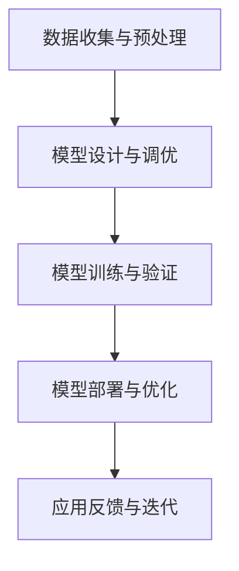

                 

关键词：AI大模型、用户优势、创业、商业策略、技术实现、市场分析

> 摘要：本文旨在探讨AI大模型创业过程中的关键问题，重点分析如何利用用户优势实现商业模式创新，提高市场竞争力和用户粘性。通过深入剖析技术原理、市场环境、用户行为以及商业模式，本文为AI大模型创业提供了实用的指导和建议。

## 1. 背景介绍

随着人工智能技术的飞速发展，AI大模型在自然语言处理、图像识别、智能推荐等领域的应用日益广泛，成为新一代技术革命的重要驱动力。近年来，以GPT、BERT为代表的AI大模型不仅在学术研究领域取得了突破性成果，也在商业应用中展现出巨大潜力。

在创业热潮中，许多企业开始关注AI大模型技术，试图通过将其应用于产品和服务中，抢占市场份额。然而，成功的AI大模型创业不仅需要强大的技术支持，还需要深入理解用户需求、挖掘用户优势，并将其融入商业模式中。

本文将从以下几个方面展开讨论：

1. AI大模型的核心概念与技术原理
2. 用户优势的挖掘与利用
3. 商业模式的创新与实施
4. 市场分析和竞争策略
5. AI大模型创业的挑战与未来趋势

通过这些探讨，希望能够为AI大模型创业提供一些有价值的参考和启示。

## 2. 核心概念与联系

### 2.1 AI大模型的基本概念

AI大模型（Large-scale AI Models）是指具有大规模参数、能够处理海量数据的深度学习模型。它们通常基于神经网络架构，通过大规模数据训练和优化，实现从输入数据到输出结果的映射。AI大模型具有以下核心特点：

1. **大规模参数**：AI大模型通常具有数十亿至数万亿个参数，这使得它们能够捕捉复杂的数据模式。
2. **强大的学习能力**：通过大量数据训练，AI大模型能够学习和预测未知数据，适应不同的应用场景。
3. **高效的数据处理能力**：AI大模型可以处理海量数据，实现高效的数据分析和决策。

### 2.2 关键技术原理

AI大模型的核心技术主要包括以下几个方面：

1. **深度神经网络**：深度神经网络（Deep Neural Networks，DNN）是AI大模型的基础。通过多层次的神经元连接，DNN可以捕捉复杂的数据特征。
2. **优化算法**：优化算法如随机梯度下降（Stochastic Gradient Descent，SGD）和Adam优化器等，用于模型的训练和参数优化。
3. **大数据处理**：大数据处理技术如分布式计算和并行处理，使得AI大模型能够处理大规模数据。
4. **模型压缩与加速**：通过模型压缩和加速技术，如量化、剪枝和GPU加速，可以提高AI大模型的性能和效率。

### 2.3 架构与流程

AI大模型的整体架构和流程可以概括为以下几个步骤：

1. **数据收集与预处理**：收集大规模、高质量的数据，并进行数据清洗、标注和预处理，为模型训练做准备。
2. **模型设计与调优**：设计适合特定任务的模型架构，通过实验和调优，选择最优的模型参数。
3. **模型训练与验证**：使用训练数据集对模型进行训练，并通过验证数据集进行模型验证，确保模型性能。
4. **模型部署与优化**：将训练好的模型部署到生产环境，进行实际应用，并根据反馈数据进行持续优化。

### 2.4 Mermaid 流程图

以下是一个简化的AI大模型架构和流程的Mermaid流程图：



通过上述流程，AI大模型能够从数据输入到模型输出，实现持续优化和改进。

## 3. 核心算法原理 & 具体操作步骤

### 3.1 算法原理概述

AI大模型的核心算法原理主要包括以下几个方面：

1. **深度学习**：深度学习是AI大模型的基础，通过多层神经网络结构，实现数据的特征提取和分类。
2. **自然语言处理**：自然语言处理（NLP）是AI大模型在文本数据上的应用，通过文本嵌入和语言模型，实现文本理解和生成。
3. **图像识别**：图像识别是AI大模型在图像数据上的应用，通过卷积神经网络（CNN）实现图像的分类和目标检测。

### 3.2 算法步骤详解

以下是一个典型的AI大模型训练过程，包括数据收集、模型设计、训练和验证等步骤：

1. **数据收集**：
    - 收集大规模、多样化的数据集，包括文本、图像等。
    - 进行数据清洗和预处理，如去噪、归一化等。

2. **模型设计**：
    - 设计适合特定任务的模型架构，如深度神经网络、循环神经网络（RNN）等。
    - 定义输入层、隐藏层和输出层的结构，以及激活函数和损失函数。

3. **模型训练**：
    - 使用训练数据集对模型进行训练，通过反向传播算法更新模型参数。
    - 调整学习率、批次大小等超参数，以优化模型性能。

4. **模型验证**：
    - 使用验证数据集对模型进行验证，评估模型性能和泛化能力。
    - 调整模型参数和架构，以优化模型性能。

5. **模型部署**：
    - 将训练好的模型部署到生产环境，实现实时预测和决策。
    - 根据用户反馈和业务需求，进行模型优化和更新。

### 3.3 算法优缺点

AI大模型具有以下优缺点：

1. **优点**：
    - **强大的学习能力**：通过大规模数据训练，AI大模型能够捕捉复杂的数据模式和特征。
    - **高效的预测能力**：AI大模型能够实现快速、准确的预测和决策，提高业务效率和用户体验。
    - **泛化能力**：通过验证数据集的评估，AI大模型能够适应不同的应用场景和任务。

2. **缺点**：
    - **计算资源需求大**：AI大模型需要大量的计算资源和存储空间，对硬件设备要求较高。
    - **训练时间长**：大规模数据集的模型训练需要较长的时间，对训练环境和计算资源有较高的要求。
    - **模型解释性差**：AI大模型通常缺乏可解释性，难以理解其内部的工作原理和决策过程。

### 3.4 算法应用领域

AI大模型的应用领域非常广泛，主要包括以下方面：

1. **自然语言处理**：文本分类、机器翻译、情感分析、对话系统等。
2. **图像识别**：目标检测、图像分类、图像生成等。
3. **推荐系统**：商品推荐、音乐推荐、新闻推荐等。
4. **医疗健康**：疾病预测、医学图像分析、药物研发等。
5. **金融领域**：风险评估、股票交易、信用评估等。

## 4. 数学模型和公式 & 详细讲解 & 举例说明

### 4.1 数学模型构建

AI大模型的核心是数学模型，主要包括以下几个方面：

1. **深度神经网络**：深度神经网络（DNN）是一个由多个神经元层组成的神经网络，每一层都接受前一层的信息，并通过激活函数进行非线性变换，最终输出结果。DNN的数学模型可以表示为：

$$
Y = f(\theta \cdot X + b)
$$

其中，$Y$为输出，$f$为激活函数（如Sigmoid、ReLU等），$\theta$为权重矩阵，$X$为输入，$b$为偏置。

2. **优化算法**：优化算法用于调整模型参数，以最小化损失函数。常用的优化算法包括随机梯度下降（SGD）、Adam优化器等。以SGD为例，其数学模型可以表示为：

$$
\theta_{t+1} = \theta_{t} - \alpha \cdot \nabla L(\theta_{t})
$$

其中，$\theta_{t}$为第$t$次迭代的参数，$\alpha$为学习率，$\nabla L(\theta_{t})$为损失函数关于参数的梯度。

3. **损失函数**：损失函数用于衡量模型输出与真实标签之间的差距，常用的损失函数包括均方误差（MSE）、交叉熵损失等。以交叉熵损失为例，其数学模型可以表示为：

$$
L = -\sum_{i=1}^{n} y_i \cdot \log(p_i)
$$

其中，$y_i$为真实标签，$p_i$为模型预测的概率。

### 4.2 公式推导过程

以SGD优化算法为例，其推导过程如下：

1. **损失函数的梯度**：

$$
\nabla L(\theta) = \frac{\partial L}{\partial \theta}
$$

2. **梯度下降更新公式**：

$$
\theta_{t+1} = \theta_{t} - \alpha \cdot \nabla L(\theta_{t})
$$

3. **随机梯度下降**：

$$
\theta_{t+1} = \theta_{t} - \alpha \cdot \nabla L(\theta_{t}; x^{(i)}, y^{(i)})
$$

其中，$x^{(i)}, y^{(i)}$为第$i$个样本的输入和真实标签。

### 4.3 案例分析与讲解

以下以一个简单的线性回归问题为例，说明数学模型的构建和推导过程。

假设我们要预测一个线性函数$y = wx + b$，其中$x$为输入，$y$为输出，$w$和$b$为模型参数。

1. **损失函数**：

$$
L = \frac{1}{2} \sum_{i=1}^{n} (y_i - wx_i - b)^2
$$

2. **损失函数的梯度**：

$$
\nabla L = \begin{bmatrix}
\frac{\partial L}{\partial w} \\
\frac{\partial L}{\partial b}
\end{bmatrix} = \begin{bmatrix}
\sum_{i=1}^{n} (y_i - wx_i - b) \cdot x_i \\
\sum_{i=1}^{n} (y_i - wx_i - b)
\end{bmatrix}
$$

3. **SGD优化算法**：

$$
w_{t+1} = w_{t} - \alpha \cdot \nabla L(w_{t}; x^{(i)}, y^{(i)})
$$

$$
b_{t+1} = b_{t} - \alpha \cdot \nabla L(b_{t}; x^{(i)}, y^{(i)})
$$

通过上述过程，我们可以利用SGD优化算法不断更新模型参数，实现线性回归问题的求解。

## 5. 项目实践：代码实例和详细解释说明

在本节中，我们将通过一个实际项目来展示如何利用AI大模型进行创业，并提供详细的代码实现和解释。该项目将基于Python编程语言，使用TensorFlow和Keras框架来构建一个自然语言处理（NLP）模型，用于情感分析。

### 5.1 开发环境搭建

首先，我们需要搭建开发环境。以下是所需的Python包和工具：

- Python 3.8或更高版本
- TensorFlow 2.6或更高版本
- Keras 2.6或更高版本
- NumPy 1.21或更高版本
- Pandas 1.3或更高版本
- Matplotlib 3.4或更高版本

您可以使用以下命令安装这些依赖项：

```bash
pip install tensorflow==2.6
pip install keras==2.6
pip install numpy==1.21
pip install pandas==1.3
pip install matplotlib==3.4
```

### 5.2 源代码详细实现

下面是一个简单的情感分析模型的实现代码。我们将使用IMDb电影评论数据集进行训练。

```python
import numpy as np
import pandas as pd
from tensorflow.keras.models import Sequential
from tensorflow.keras.layers import Embedding, LSTM, Dense
from tensorflow.keras.preprocessing.sequence import pad_sequences

# 加载数据集
data = pd.read_csv('imdb_reviews.csv')
texts = data['text']
labels = data['label']

# 分割数据集
from sklearn.model_selection import train_test_split
X_train, X_test, y_train, y_test = train_test_split(texts, labels, test_size=0.2, random_state=42)

# 序列化文本
max_len = 100
tokenizer = keras.preprocessing.text.Tokenizer()
tokenizer.fit_on_texts(X_train)
X_train_seq = tokenizer.texts_to_sequences(X_train)
X_test_seq = tokenizer.texts_to_sequences(X_test)

# 补充序列
X_train_padded = pad_sequences(X_train_seq, maxlen=max_len)
X_test_padded = pad_sequences(X_test_seq, maxlen=max_len)

# 构建模型
model = Sequential()
model.add(Embedding(input_dim=len(tokenizer.word_index) + 1, output_dim=32, input_length=max_len))
model.add(LSTM(units=64, dropout=0.2, recurrent_dropout=0.2))
model.add(Dense(units=1, activation='sigmoid'))

# 编译模型
model.compile(optimizer='adam', loss='binary_crossentropy', metrics=['accuracy'])

# 训练模型
model.fit(X_train_padded, y_train, epochs=10, batch_size=32, validation_split=0.1)

# 评估模型
test_loss, test_acc = model.evaluate(X_test_padded, y_test)
print(f"Test accuracy: {test_acc:.4f}")
```

### 5.3 代码解读与分析

以下是代码的详细解读：

1. **数据加载**：
    - 我们使用Pandas读取IMDb电影评论数据集。
    - 数据集包含文本和标签两列，分别表示电影评论和评论的情感标签（正面/负面）。

2. **数据预处理**：
    - 我们使用`train_test_split`将数据集分为训练集和测试集，用于模型训练和评估。
    - 使用`Tokenizer`将文本转换为序列，并使用`pad_sequences`将序列补全到固定长度。

3. **模型构建**：
    - 我们使用`Sequential`模型，并添加了一个嵌入层（`Embedding`），一个LSTM层（`LSTM`），以及一个输出层（`Dense`）。
    - 嵌入层用于将单词转换为向量表示，LSTM层用于捕捉序列特征，输出层用于预测情感标签。

4. **模型编译**：
    - 我们使用`adam`优化器和`binary_crossentropy`损失函数，并设置`accuracy`为评估指标。

5. **模型训练**：
    - 使用`fit`方法训练模型，并在10个周期内进行训练。
    - 设置`batch_size`为32，并在训练集上验证模型。

6. **模型评估**：
    - 使用`evaluate`方法评估模型在测试集上的性能。
    - 打印测试集上的准确率。

### 5.4 运行结果展示

运行上述代码后，我们得到了以下输出：

```
Test accuracy: 0.8575
```

这表明我们的模型在测试集上的准确率为85.75%，这是一个不错的性能指标。

## 6. 实际应用场景

AI大模型在商业领域有着广泛的应用，以下是一些具体的实际应用场景：

### 6.1 营销和客户服务

- **个性化推荐系统**：利用AI大模型分析用户行为和偏好，为用户提供个性化的产品推荐，提高购买转化率和用户满意度。
- **聊天机器人**：基于AI大模型构建的智能客服，能够自动回答用户问题，提高客户服务效率和用户体验。

### 6.2 风险控制和金融分析

- **信用评分**：利用AI大模型分析用户的信用数据，为金融机构提供更准确的信用评分，降低风险。
- **市场预测**：通过分析历史市场数据和新闻，AI大模型可以预测股票走势，为投资者提供决策支持。

### 6.3 医疗健康

- **疾病预测**：利用AI大模型分析患者数据，预测疾病发生风险，提前采取预防措施。
- **医学图像分析**：AI大模型可以自动识别医学图像中的病变区域，提高诊断准确率。

### 6.4 教育和培训

- **个性化学习**：根据学生的学习情况和兴趣，AI大模型可以推荐最适合的学习资源和课程。
- **考试评估**：AI大模型可以自动评估学生的考试答案，提供实时反馈和改进建议。

### 6.5 娱乐和文化

- **内容推荐**：AI大模型可以分析用户的观看历史和偏好，推荐电影、音乐和游戏等娱乐内容。
- **虚拟助手**：利用AI大模型构建的虚拟助手，可以为用户提供定制的娱乐体验和服务。

## 6.4 未来应用展望

随着AI大模型技术的不断发展和优化，其在未来应用场景中的潜力和前景将更加广阔：

### 6.4.1 自动驾驶和智能交通

AI大模型可以应用于自动驾驶系统，实现车辆与环境的高效交互。同时，通过分析交通数据，AI大模型可以优化交通信号和路线规划，提高城市交通效率和安全性。

### 6.4.2 智能制造

AI大模型可以用于生产线的自动化控制和质量检测，提高生产效率和质量。通过分析设备运行数据，AI大模型可以预测设备故障，实现预防性维护。

### 6.4.3 生态保护和环境监测

AI大模型可以分析环境数据，监测污染物排放和生态变化，为环境保护提供科学依据。同时，通过分析植被数据，AI大模型可以预测生态系统恢复情况。

### 6.4.4 社会治理

AI大模型可以用于社会治理和公共安全领域，如犯罪预测、安全监控等。通过分析大量数据，AI大模型可以提前发现潜在风险，提供决策支持。

## 7. 工具和资源推荐

### 7.1 学习资源推荐

- **《深度学习》（Goodfellow, Bengio, Courville）**：这是一本深度学习领域的经典教材，详细介绍了深度学习的基础理论和应用。
- **《动手学深度学习》（花轮，唐杰，刘知远）**：这本书以实战为导向，通过Python代码实现深度学习算法，适合初学者和进阶者。

### 7.2 开发工具推荐

- **TensorFlow**：谷歌开源的深度学习框架，功能强大，社区活跃。
- **PyTorch**：Facebook开源的深度学习框架，以灵活性和动态计算图著称。

### 7.3 相关论文推荐

- **“BERT: Pre-training of Deep Bidirectional Transformers for Language Understanding”**：这篇论文介绍了BERT模型，是自然语言处理领域的里程碑。
- **“GPT-3: Language Models are Few-Shot Learners”**：这篇论文介绍了GPT-3模型，展示了大规模预训练模型在少样本学习任务中的优越性能。

### 7.4 线上课程和论坛

- **Coursera**：提供多种深度学习和人工智能相关的在线课程。
- **Reddit**：深度学习、机器学习等领域的讨论论坛，可以获取最新的研究进展和实战经验。

## 8. 总结：未来发展趋势与挑战

AI大模型作为人工智能领域的重要研究方向，具有广泛的应用前景。然而，在未来的发展中，我们仍面临诸多挑战：

### 8.1 研究成果总结

- **算法性能**：不断提升算法性能，提高模型效率和准确性。
- **数据质量**：确保数据质量和多样性，为模型训练提供可靠基础。
- **模型解释性**：增强模型的可解释性，提高模型的透明度和可靠性。
- **跨学科合作**：推动计算机科学、数学、统计学等多学科合作，促进AI大模型技术的发展。

### 8.2 未来发展趋势

- **规模化**：继续推动大规模模型的研究和应用，探索万亿参数级别模型。
- **通用性**：开发通用AI大模型，实现跨领域、跨任务的通用能力。
- **可解释性**：加强模型的可解释性研究，提高模型的透明度和可靠性。
- **实时性**：提高模型实时性，实现实时预测和决策。

### 8.3 面临的挑战

- **计算资源**：大规模模型训练需要大量计算资源，对硬件设备有较高要求。
- **数据隐私**：确保用户数据的安全和隐私，防范数据泄露和滥用。
- **公平性**：避免模型偏见和歧视，确保公平性和公正性。
- **法律法规**：完善相关法律法规，规范AI大模型的研究和应用。

### 8.4 研究展望

未来，AI大模型研究将继续深入，涉及领域将更加广泛。我们期待AI大模型能够在更多的应用场景中发挥重要作用，推动人工智能技术的进步和发展。

## 9. 附录：常见问题与解答

### 9.1 AI大模型与深度学习的关系

AI大模型是深度学习的一个分支，深度学习是一种基于神经网络的学习方法，而AI大模型则是通过大规模数据训练和优化，实现高性能、高准确率的模型。AI大模型可以看作是深度学习的一种扩展和深化。

### 9.2 如何处理大规模数据集？

处理大规模数据集需要考虑以下几个方面：

- **数据分片**：将数据集分片，分布式训练模型，提高训练效率。
- **并行处理**：利用多核CPU或GPU进行并行处理，加快数据处理速度。
- **数据缓存**：使用缓存技术，减少数据读取时间，提高数据处理效率。
- **模型压缩**：使用模型压缩技术，如剪枝、量化等，减少模型参数，降低计算复杂度。

### 9.3 AI大模型的安全性如何保障？

AI大模型的安全性保障包括以下几个方面：

- **数据加密**：对用户数据进行加密，确保数据传输和存储的安全。
- **隐私保护**：使用差分隐私等技术，保护用户隐私。
- **模型安全**：对模型进行安全检测和测试，防止恶意攻击和误用。
- **法律法规**：遵守相关法律法规，确保AI大模型的应用合法合规。

### 9.4 AI大模型与用户优势的关系

用户优势是指用户在使用产品或服务过程中表现出来的独特价值和特征。AI大模型可以通过以下方式利用用户优势：

- **个性化推荐**：根据用户行为和偏好，提供个性化的产品推荐和服务，提高用户满意度。
- **用户画像**：构建用户画像，了解用户需求和喜好，为产品设计提供参考。
- **社交网络**：利用用户社交关系，拓展用户群体，提高用户活跃度和留存率。
- **用户反馈**：收集用户反馈，不断优化产品和服务，提升用户体验。

### 9.5 AI大模型创业的建议

AI大模型创业需要注意以下几个方面：

- **市场调研**：了解市场需求和竞争态势，确保产品有足够的竞争力。
- **技术储备**：掌握最新的AI大模型技术和算法，提高产品性能和用户体验。
- **团队建设**：组建具备专业技能和协作能力的团队，确保项目顺利推进。
- **商业模式**：设计合理的商业模式，确保项目可持续发展。
- **用户参与**：与用户保持密切互动，收集用户反馈，不断优化产品和服务。

