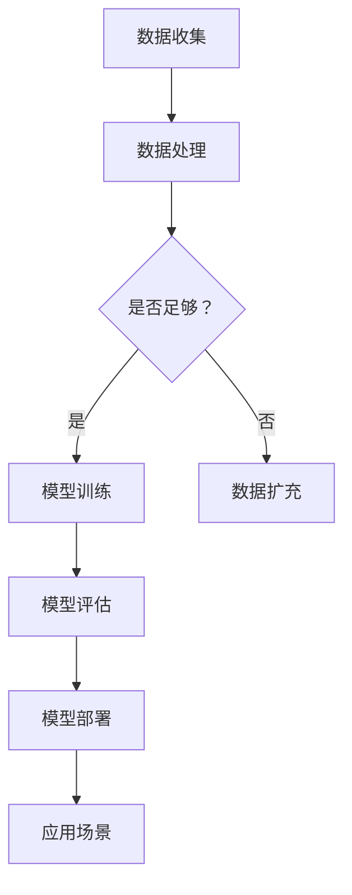

                 

关键词：人工智能、大模型、创业、科技优势、商业模式

摘要：本文将探讨人工智能（AI）大模型在创业领域的应用，分析其科技优势，并给出具体的创业策略和实施步骤，旨在为创业者提供有益的指导。

## 1. 背景介绍

近年来，人工智能（AI）技术取得了飞速发展，其中大模型技术成为了当前研究的热点。大模型，如 GPT-3、BERT 等，具有极强的学习能力，可以处理大规模数据，实现复杂任务的自动化。随着计算能力的提升和大数据的积累，大模型在自然语言处理、图像识别、语音识别等领域取得了显著的成果。

创业领域对 AI 大模型的需求日益增长。一方面，创业者希望利用 AI 大模型提升业务效率，降低成本；另一方面，AI 大模型为创业者提供了全新的商业模式，如基于 AI 大模型的定制化解决方案、智能服务、数据分析等。本文将探讨如何利用 AI 大模型的科技优势，开展有竞争力的创业项目。

## 2. 核心概念与联系

### 2.1. 人工智能大模型

人工智能大模型是指具有大规模参数、能够处理海量数据、实现复杂任务的人工智能系统。大模型通常基于深度学习技术，通过多层神经网络结构进行学习，具有较高的准确性和泛化能力。

### 2.2. 大模型的主要技术

- **深度学习**：通过构建多层神经网络，实现从输入到输出的非线性映射。
- **大数据**：提供海量的训练数据，使大模型能够学习到更多知识。
- **云计算**：提供强大的计算资源，支持大模型的训练和部署。
- **自然语言处理（NLP）**：大模型在 NLP 领域具有广泛的应用，如文本分类、情感分析、机器翻译等。
- **计算机视觉**：大模型在图像识别、目标检测等领域取得了显著的成果。

### 2.3. Mermaid 流程图



## 3. 核心算法原理 & 具体操作步骤

### 3.1. 算法原理概述

AI 大模型的核心是深度学习，其基本原理是通过多层神经网络对数据进行学习，从而实现从输入到输出的映射。大模型的训练过程主要包括数据预处理、模型架构设计、参数调优和模型评估等步骤。

### 3.2. 算法步骤详解

#### 3.2.1. 数据预处理

1. 数据收集：从各种来源收集数据，如文本、图像、音频等。
2. 数据清洗：去除数据中的噪声和异常值。
3. 数据标注：对数据进行分类、标注等处理，以供模型训练使用。

#### 3.2.2. 模型架构设计

1. 选择合适的神经网络架构，如卷积神经网络（CNN）、循环神经网络（RNN）等。
2. 设计网络层数和每层的参数，如神经元数量、激活函数等。

#### 3.2.3. 参数调优

1. 选择优化算法，如梯度下降、Adam 等。
2. 调整学习率、正则化参数等超参数，以优化模型性能。

#### 3.2.4. 模型评估

1. 使用验证集对模型进行评估，计算准确率、召回率、F1 值等指标。
2. 根据评估结果调整模型参数，以提高性能。

#### 3.2.5. 模型部署

1. 将训练好的模型部署到生产环境中，供用户使用。
2. 监控模型性能，根据用户反馈进行优化。

### 3.3. 算法优缺点

#### 优点

- **强大的学习能力**：大模型能够从海量数据中学习到更多知识，提高任务准确性。
- **泛化能力**：大模型具有较强的泛化能力，能够在不同任务和场景中取得较好的表现。
- **自动化**：大模型可以实现复杂任务的自动化，提高业务效率。

#### 缺点

- **计算资源需求大**：大模型需要大量的计算资源和存储空间，对硬件设施要求较高。
- **训练过程时间长**：大模型的训练过程可能需要很长时间，影响项目进度。

### 3.4. 算法应用领域

AI 大模型在多个领域具有广泛的应用，如：

- **自然语言处理**：文本分类、情感分析、机器翻译等。
- **计算机视觉**：图像识别、目标检测、视频分析等。
- **语音识别**：语音合成、语音识别、语音翻译等。
- **智能问答**：构建智能客服系统、教育系统等。
- **金融领域**：风险控制、量化交易、信用评估等。

## 4. 数学模型和公式 & 详细讲解 & 举例说明

### 4.1. 数学模型构建

#### 4.1.1. 深度学习基本公式

$$
y = f(z) = \sigma(w \cdot x + b)
$$

其中，$y$ 为输出值，$f$ 为激活函数（如 sigmoid 函数、ReLU 函数等），$z$ 为神经元的输入值，$w$ 为权重，$b$ 为偏置。

#### 4.1.2. 梯度下降算法

$$
w_{new} = w_{old} - \alpha \cdot \frac{\partial J}{\partial w}
$$

其中，$w_{new}$ 和 $w_{old}$ 分别为当前权重和更新后的权重，$\alpha$ 为学习率，$J$ 为损失函数。

### 4.2. 公式推导过程

#### 4.2.1. 损失函数

假设我们使用均方误差（MSE）作为损失函数：

$$
J = \frac{1}{2} \sum_{i=1}^{n} (y_i - \hat{y}_i)^2
$$

其中，$y_i$ 为真实标签，$\hat{y}_i$ 为预测值。

#### 4.2.2. 梯度计算

对权重 $w$ 求偏导数：

$$
\frac{\partial J}{\partial w} = \frac{\partial}{\partial w} \left( \sum_{i=1}^{n} (y_i - \hat{y}_i)^2 \right) = 2 \sum_{i=1}^{n} (y_i - \hat{y}_i) \cdot \frac{\partial \hat{y}_i}{\partial w}
$$

其中，$\frac{\partial \hat{y}_i}{\partial w}$ 为预测值对权重的偏导数。

### 4.3. 案例分析与讲解

#### 4.3.1. 文本分类

假设我们使用 BERT 模型进行文本分类任务。BERT 模型是一个预训练的 Transformer 模型，其输入为文本序列，输出为标签分布。

1. **数据预处理**：将文本数据转换为词向量表示，如使用 Word2Vec 或 GloVe 算法。
2. **模型架构**：BERT 模型由多层 Transformer 架构组成，每个 Transformer 层包含多头自注意力机制和前馈神经网络。
3. **参数调优**：通过训练数据集进行模型训练，调整学习率、批量大小等超参数。
4. **模型评估**：使用验证集对模型进行评估，计算准确率、召回率等指标。

#### 4.3.2. 计算机视觉

假设我们使用 ResNet 模型进行图像分类任务。ResNet 模型是一个深度残差网络，其核心思想是引入残差连接，解决深层网络训练困难的问题。

1. **数据预处理**：将图像数据转换为固定尺寸的像素矩阵，并进行归一化处理。
2. **模型架构**：ResNet 模型由多个残差模块组成，每个残差模块包含两个卷积层和两个跳跃连接。
3. **参数调优**：通过训练数据集进行模型训练，调整学习率、批量大小等超参数。
4. **模型评估**：使用验证集对模型进行评估，计算准确率、召回率等指标。

## 5. 项目实践：代码实例和详细解释说明

### 5.1. 开发环境搭建

- **硬件环境**：配备 GPU 的计算设备，如 NVIDIA Tesla V100。
- **软件环境**：安装 Python、PyTorch、TensorFlow 等框架。

### 5.2. 源代码详细实现

```python
import torch
import torch.nn as nn
import torch.optim as optim

# 定义模型
class MyModel(nn.Module):
    def __init__(self):
        super(MyModel, self).__init__()
        self.fc1 = nn.Linear(784, 256)
        self.fc2 = nn.Linear(256, 10)

    def forward(self, x):
        x = x.view(-1, 784)
        x = torch.relu(self.fc1(x))
        x = self.fc2(x)
        return x

# 加载数据
train_loader = torch.utils.data.DataLoader(
    MyDataset(train_data), 
    batch_size=64, 
    shuffle=True
)

# 初始化模型、损失函数和优化器
model = MyModel()
criterion = nn.CrossEntropyLoss()
optimizer = optim.Adam(model.parameters(), lr=0.001)

# 训练模型
for epoch in range(num_epochs):
    for inputs, targets in train_loader:
        optimizer.zero_grad()
        outputs = model(inputs)
        loss = criterion(outputs, targets)
        loss.backward()
        optimizer.step()
    print(f'Epoch {epoch+1}/{num_epochs}, Loss: {loss.item()}')

# 评估模型
test_loader = torch.utils.data.DataLoader(
    MyDataset(test_data), 
    batch_size=64, 
    shuffle=False
)

with torch.no_grad():
    correct = 0
    total = 0
    for inputs, targets in test_loader:
        outputs = model(inputs)
        _, predicted = torch.max(outputs.data, 1)
        total += targets.size(0)
        correct += (predicted == targets).sum().item()
print(f'Accuracy: {100 * correct / total}%')
```

### 5.3. 代码解读与分析

上述代码实现了使用 PyTorch 框架训练一个简单的卷积神经网络（CNN）模型。代码主要包括以下部分：

- **模型定义**：定义了一个简单的 CNN 模型，包含一个全连接层和一个卷积层。
- **数据加载**：使用 DataLoader 加载训练集和测试集，并将图像数据进行预处理。
- **模型训练**：使用梯度下降算法进行模型训练，包括前向传播、反向传播和权重更新。
- **模型评估**：在测试集上评估模型性能，计算准确率。

## 6. 实际应用场景

AI 大模型在多个实际应用场景中具有广泛的应用，如：

- **金融领域**：用于风险控制、量化交易、信用评估等。
- **医疗领域**：用于疾病预测、诊断、治疗方案推荐等。
- **智能制造**：用于设备故障预测、生产流程优化等。
- **智能交通**：用于交通流量预测、路况分析、自动驾驶等。
- **教育领域**：用于智能辅导、个性化学习等。

### 6.1. 金融领域

AI 大模型在金融领域的应用主要包括：

- **风险控制**：通过分析历史数据，预测潜在风险，降低金融风险。
- **量化交易**：利用 AI 大模型进行市场趋势分析、交易策略制定等。
- **信用评估**：通过对用户历史数据进行分析，评估用户信用状况。

### 6.2. 医疗领域

AI 大模型在医疗领域的应用主要包括：

- **疾病预测**：通过分析患者历史数据，预测疾病风险。
- **诊断**：通过分析医疗影像数据，辅助医生进行疾病诊断。
- **治疗方案推荐**：根据患者病情和病史，推荐最佳治疗方案。

### 6.3. 智能制造

AI 大模型在智能制造领域的应用主要包括：

- **设备故障预测**：通过分析设备运行数据，预测设备故障，提前进行维护。
- **生产流程优化**：通过分析生产数据，优化生产流程，提高生产效率。

### 6.4. 未来应用展望

随着 AI 大模型的不断进步，未来在更多领域将会有更多的应用。例如：

- **智慧城市**：通过 AI 大模型进行城市交通管理、环境监测等。
- **智能农业**：通过 AI 大模型进行作物生长监测、病虫害预测等。
- **智能家居**：通过 AI 大模型实现智能安防、家居自动化等。

## 7. 工具和资源推荐

### 7.1. 学习资源推荐

- **书籍**：
  - 《深度学习》（Ian Goodfellow、Yoshua Bengio、Aaron Courville 著）
  - 《Python 深度学习》（François Chollet 著）
- **在线课程**：
  - Coursera 上的《深度学习》课程
  - edX 上的《机器学习基础》课程
- **博客和论文**：
  - Medium 上的深度学习相关文章
  - ArXiv 上的最新研究成果论文

### 7.2. 开发工具推荐

- **深度学习框架**：PyTorch、TensorFlow、Keras 等。
- **数据预处理工具**：Pandas、NumPy 等。
- **数据可视化工具**：Matplotlib、Seaborn 等。
- **代码版本控制**：Git、GitHub 等。

### 7.3. 相关论文推荐

- **《BERT: Pre-training of Deep Bidirectional Transformers for Language Understanding》**
- **《GPT-3: Language Models are Few-Shot Learners》**
- **《Transformers: State-of-the-Art Neural Networks for Language Processing》**

## 8. 总结：未来发展趋势与挑战

### 8.1. 研究成果总结

AI 大模型技术在近年来取得了显著进展，在多个领域取得了突破性成果。未来，随着计算能力的提升和数据的积累，AI 大模型将实现更高的性能和更广泛的应用。

### 8.2. 未来发展趋势

- **模型规模不断扩大**：未来将出现更多的大型 AI 模型，如千亿参数级别的模型。
- **跨模态学习**：实现文本、图像、语音等多模态数据的统一表示和交互。
- **预训练与微调**：预训练模型将成为主流，微调策略将更加成熟。
- **边缘计算**：将 AI 大模型应用于边缘设备，提高实时性。

### 8.3. 面临的挑战

- **计算资源需求**：大模型的训练和部署需要大量的计算资源和存储空间。
- **数据隐私和安全**：如何保护用户隐私和数据安全成为关键挑战。
- **算法伦理**：大模型的决策过程缺乏透明性，如何保证算法的公平性和可解释性。

### 8.4. 研究展望

未来，AI 大模型技术将在多个领域取得更多突破，为人类社会带来更多创新和便利。同时，我们需关注其潜在的风险和挑战，积极研究和解决相关问题。

## 9. 附录：常见问题与解答

### 9.1. AI 大模型为什么需要大量数据？

AI 大模型需要大量数据是因为其通过从数据中学习特征和模式来实现良好的泛化能力。大量数据可以提供更多的信息，使得模型能够学习到更复杂的特征，从而在未见过的数据上表现更好。

### 9.2. 如何解决 AI 大模型的计算资源需求？

解决 AI 大模型的计算资源需求可以从以下几个方面入手：

- **使用高性能 GPU**：使用专门为深度学习设计的 GPU，如 NVIDIA Tesla 系列，可以提高训练速度。
- **分布式训练**：将模型拆分成多个部分，在多个计算节点上同时进行训练，可以显著提高训练速度。
- **模型压缩**：通过模型剪枝、量化等技术，减小模型参数量，降低计算资源需求。

### 9.3. AI 大模型如何保证数据隐私和安全？

保证 AI 大模型的数据隐私和安全可以从以下几个方面入手：

- **数据脱敏**：在模型训练前对敏感数据进行脱敏处理，减少隐私泄露的风险。
- **联邦学习**：将模型训练分散到多个参与者处，各参与者仅共享加密后的模型参数，从而保护原始数据。
- **数据安全协议**：使用安全加密算法和协议，确保数据在传输和存储过程中的安全性。

### 9.4. AI 大模型的决策过程如何保证透明性和可解释性？

为了提高 AI 大模型的透明性和可解释性，可以采取以下措施：

- **模型可解释性技术**：使用模型可解释性技术，如 Grad-CAM、LIME 等，帮助用户理解模型在特定输入上的决策过程。
- **可视化工具**：开发可视化工具，将模型的决策过程和特征可视化，帮助用户更好地理解模型的工作原理。
- **算法透明度要求**：在法律和伦理层面加强对算法透明度的要求，确保用户能够理解和使用 AI 大模型。

## 作者署名

作者：禅与计算机程序设计艺术 / Zen and the Art of Computer Programming

