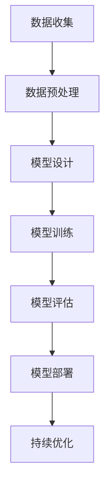

                 

关键词：AI 大模型、创业、算力优势、技术语言、深度学习、人工智能应用

> 摘要：本文旨在探讨 AI 大模型创业过程中如何充分利用算力优势，从技术角度出发，分析大模型开发的关键技术、计算资源需求，以及创业实践中的策略和挑战。文章将结合实际案例，提出可行的解决方案，为 AI 大模型创业提供有价值的指导。

## 1. 背景介绍

随着人工智能技术的不断发展，大模型（如 GPT、BERT 等）在自然语言处理、计算机视觉等领域取得了显著的成果。这些大模型通常具有复杂的网络结构和庞大的参数规模，对计算资源的需求极为巨大。算力优势成为大模型创业的重要驱动力，影响着项目的成功与否。

### 1.1 大模型的崛起

大模型的崛起源于深度学习的快速发展。深度学习通过构建多层神经网络，能够自动提取数据的特征表示，从而在图像识别、语音识别等任务中取得了突破性进展。随着计算能力的提升和数据量的增加，大模型逐渐成为人工智能研究的主流方向。

### 1.2 算力优势的重要性

在 AI 大模型创业过程中，算力优势至关重要。首先，大模型的训练和推理过程需要大量的计算资源，尤其是在模型规模不断扩大的趋势下，计算资源的需求呈现指数级增长。其次，高效的算力能够提高模型的训练效率，缩短研发周期，降低成本。此外，算力优势还可以提升模型的性能，使其在应用场景中具有更强的竞争力。

## 2. 核心概念与联系

在探讨 AI 大模型创业如何利用算力优势之前，我们首先需要了解一些核心概念和其之间的联系。

### 2.1 大模型的概念

大模型是指参数规模在百万到亿级别的神经网络模型。这些模型通常包含多层神经网络，能够处理大量数据，提取复杂的信息。

### 2.2 算力的定义

算力是指计算能力，通常以浮点运算次数（FLOPS）作为衡量标准。算力优势意味着在相同的计算任务中，拥有更高的计算效率。

### 2.3 大模型与算力的关系

大模型对计算资源的需求极为巨大，而算力优势能够提高大模型的训练和推理效率。因此，在 AI 大模型创业过程中，充分利用算力优势至关重要。

### 2.4 Mermaid 流程图

下面是一个用于描述大模型开发过程中关键步骤的 Mermaid 流程图：



## 3. 核心算法原理 & 具体操作步骤

### 3.1 算法原理概述

AI 大模型的核心算法通常基于深度学习，特别是神经网络。神经网络通过层层传递和激活函数，将输入数据映射到输出结果。在大模型中，神经网络的结构通常更加复杂，参数规模更大。

### 3.2 算法步骤详解

#### 3.2.1 数据收集

首先，需要收集大量相关的数据，这些数据可以是文本、图像、音频等多种形式。数据的多样性有助于模型更好地学习到不同类型的特征。

#### 3.2.2 数据预处理

在收集到数据后，需要对数据进行预处理，包括数据清洗、归一化、数据增强等步骤。预处理过程有助于提高模型的训练效果。

#### 3.2.3 模型设计

根据任务需求，设计合适的神经网络结构。大模型的设计通常包含多层卷积层、全连接层等结构，能够提取丰富的特征信息。

#### 3.2.4 模型训练

使用预处理后的数据训练神经网络模型。训练过程中，需要优化模型的参数，使其能够更好地拟合训练数据。优化算法通常采用梯度下降等策略。

#### 3.2.5 模型评估

在模型训练完成后，使用验证集或测试集评估模型的性能。常用的评估指标包括准确率、召回率、F1 分数等。

#### 3.2.6 模型部署

将训练好的模型部署到实际应用场景中，如自然语言处理、计算机视觉等。部署过程中，需要考虑模型的计算效率、存储空间等因素。

#### 3.2.7 持续优化

在模型部署后，根据用户反馈和实际应用情况，对模型进行持续优化，提高模型的性能和鲁棒性。

### 3.3 算法优缺点

#### 优点

- 高效性：大模型能够处理大规模的数据，提取复杂的特征信息，提高模型的性能。
- 广泛适用性：大模型适用于多种应用场景，如自然语言处理、计算机视觉等。
- 自动化：大模型通过自动学习数据特征，减少了对人工干预的需求。

#### 缺点

- 计算资源需求大：大模型的训练和推理过程需要大量的计算资源，对硬件设备的要求较高。
- 数据需求大：大模型需要大量的数据进行训练，数据收集和预处理过程较为复杂。
- 训练时间长：大模型的训练时间较长，需要较长的时间进行优化和调整。

### 3.4 算法应用领域

大模型在多个领域取得了显著的成果，如：

- 自然语言处理：用于文本分类、情感分析、机器翻译等任务。
- 计算机视觉：用于图像识别、目标检测、图像生成等任务。
- 语音识别：用于语音识别、语音合成等任务。

## 4. 数学模型和公式 & 详细讲解 & 举例说明

### 4.1 数学模型构建

在 AI 大模型中，常用的数学模型包括神经网络、损失函数、优化算法等。以下是一个简化的神经网络数学模型：

$$
y_{pred} = \sigma(W \cdot x + b)
$$

其中，$y_{pred}$ 表示预测结果，$\sigma$ 表示激活函数（如 Sigmoid、ReLU 等），$W$ 和 $b$ 分别表示权重和偏置。

### 4.2 公式推导过程

神经网络的训练过程通常涉及以下步骤：

1. 前向传播：计算输入数据通过神经网络的输出结果。
2. 计算损失函数：根据预测结果和真实标签计算损失值。
3. 反向传播：计算损失函数关于模型参数的梯度。
4. 梯度下降：根据梯度更新模型参数。

以反向传播为例，损失函数的梯度可以表示为：

$$
\frac{\partial L}{\partial W} = \frac{\partial L}{\partial y_{pred}} \cdot \frac{\partial y_{pred}}{\partial W}
$$

其中，$L$ 表示损失函数，$\frac{\partial L}{\partial y_{pred}}$ 表示损失函数关于预测结果的梯度，$\frac{\partial y_{pred}}{\partial W}$ 表示预测结果关于权重的梯度。

### 4.3 案例分析与讲解

假设我们有一个二分类问题，输入数据为 $x$，真实标签为 $y$，预测结果为 $y_{pred}$。我们使用交叉熵损失函数：

$$
L = -\frac{1}{m} \sum_{i=1}^{m} [y \cdot \log(y_{pred}) + (1 - y) \cdot \log(1 - y_{pred})]
$$

其中，$m$ 表示样本数量。

在前向传播过程中，我们得到预测结果 $y_{pred}$。然后，计算损失函数的梯度：

$$
\frac{\partial L}{\partial y_{pred}} = \frac{1}{y_{pred}} - \frac{1}{1 - y_{pred}}
$$

假设当前权重的梯度为 $\frac{\partial L}{\partial W}$，则使用梯度下降算法更新权重：

$$
W = W - \alpha \cdot \frac{\partial L}{\partial W}
$$

其中，$\alpha$ 表示学习率。

## 5. 项目实践：代码实例和详细解释说明

### 5.1 开发环境搭建

在开发 AI 大模型之前，我们需要搭建一个合适的开发环境。以下是 Python 环境的搭建步骤：

1. 安装 Python：从官网下载并安装 Python 3.7 以上版本。
2. 安装依赖库：使用 pip 工具安装 TensorFlow、Keras、NumPy 等库。

```bash
pip install tensorflow keras numpy
```

### 5.2 源代码详细实现

以下是一个简单的神经网络模型实现示例：

```python
import tensorflow as tf
from tensorflow.keras.layers import Dense, Activation
from tensorflow.keras.models import Sequential

# 创建模型
model = Sequential()
model.add(Dense(128, input_shape=(784,), activation='relu'))
model.add(Dense(10, activation='softmax'))

# 编译模型
model.compile(optimizer='adam', loss='categorical_crossentropy', metrics=['accuracy'])

# 训练模型
model.fit(x_train, y_train, epochs=10, batch_size=32, validation_data=(x_val, y_val))
```

### 5.3 代码解读与分析

1. 导入 TensorFlow 和 Keras 库。
2. 创建一个顺序模型（Sequential）。
3. 添加全连接层（Dense），定义输入维度和激活函数。
4. 添加输出层，定义输出维度和激活函数。
5. 编译模型，设置优化器、损失函数和评估指标。
6. 训练模型，设置训练轮次、批量大小和验证数据。

### 5.4 运行结果展示

在训练过程中，我们可以使用以下代码查看模型的训练过程和结果：

```python
import matplotlib.pyplot as plt

# 绘制训练过程
plt.plot(history.history['accuracy'])
plt.plot(history.history['val_accuracy'])
plt.title('Model Accuracy')
plt.ylabel('Accuracy')
plt.xlabel('Epoch')
plt.legend(['Train', 'Val'], loc='upper left')
plt.show()
```

## 6. 实际应用场景

AI 大模型在多个领域具有广泛的应用场景，以下列举一些典型的应用案例：

### 6.1 自然语言处理

自然语言处理（NLP）是 AI 大模型的重要应用领域之一。例如，在机器翻译中，大模型可以处理多种语言的翻译任务，提高翻译的准确性和流畅度。

### 6.2 计算机视觉

计算机视觉领域的大模型可以用于图像识别、目标检测、图像生成等任务。例如，在自动驾驶中，大模型可以识别道路标志、行人和车辆等。

### 6.3 语音识别

语音识别领域的大模型可以用于语音合成、语音识别等任务。例如，在智能家居中，大模型可以识别用户的声音指令，实现语音控制。

### 6.4 医疗健康

医疗健康领域的大模型可以用于疾病诊断、药物研发等任务。例如，通过分析医疗数据，大模型可以预测疾病的发病风险，为医生提供诊断依据。

## 7. 工具和资源推荐

### 7.1 学习资源推荐

1. 《深度学习》（Goodfellow, Bengio, Courville）：这是一本经典的深度学习教材，适合初学者和进阶者阅读。
2. 《Python 深度学习》（François Chollet）：本书介绍了使用 Python 和 TensorFlow 进行深度学习的实践方法。

### 7.2 开发工具推荐

1. TensorFlow：TensorFlow 是一款流行的开源深度学习框架，适合开发大模型。
2. Keras：Keras 是 TensorFlow 的一个高级 API，提供了更加简洁和直观的编程接口。

### 7.3 相关论文推荐

1. "Distributed Deep Learning: End-to-End Optimizations"，作者：Quoc V. Le 等。
2. "Large-scale Language Modeling in 2018"，作者：Daniel M. Ziegler 等。

## 8. 总结：未来发展趋势与挑战

### 8.1 研究成果总结

AI 大模型在多个领域取得了显著的成果，推动了人工智能技术的进步。未来，随着计算能力的提升和算法的优化，大模型的应用将更加广泛。

### 8.2 未来发展趋势

1. 大模型将向更复杂的任务和领域扩展。
2. 分布式计算和并行计算将提高大模型的训练和推理效率。
3. 算法优化和新的架构设计将进一步提高大模型的效果。

### 8.3 面临的挑战

1. 计算资源需求巨大，需要更高效的数据中心硬件和分布式计算技术。
2. 大模型的数据需求和数据处理能力要求较高，需要完善的数据收集和预处理技术。
3. 大模型的解释性和可解释性尚待提高，需要探索更有效的方法。

### 8.4 研究展望

未来，AI 大模型将在更多的领域发挥重要作用，成为推动人工智能发展的重要引擎。在研究过程中，需要关注计算资源、数据质量和算法优化等方面的问题，不断提高大模型的效果和应用价值。

## 9. 附录：常见问题与解答

### 9.1 什么是 AI 大模型？

AI 大模型是指参数规模在百万到亿级别的神经网络模型，具有复杂的网络结构和庞大的参数规模。这些模型通常通过自动学习大量数据，提取复杂的特征信息，应用于多种任务。

### 9.2 如何提高大模型的计算效率？

提高大模型的计算效率可以从以下几个方面入手：

1. 使用更高效的硬件设备，如 GPU、TPU 等。
2. 采用分布式计算和并行计算技术，将计算任务分解为多个部分，同时处理。
3. 优化算法和模型结构，减少计算量。

### 9.3 大模型在创业中如何落地应用？

在创业中，可以将大模型应用于以下领域：

1. 自然语言处理：用于文本分类、情感分析、机器翻译等任务。
2. 计算机视觉：用于图像识别、目标检测、图像生成等任务。
3. 语音识别：用于语音合成、语音识别等任务。
4. 医疗健康：用于疾病诊断、药物研发等任务。

通过以上领域的应用，可以为创业项目带来创新性和竞争力，提高市场占有率。

---

> 作者：禅与计算机程序设计艺术 / Zen and the Art of Computer Programming

---

以上就是本文关于“AI 大模型创业：如何利用算力优势？”的详细探讨。希望本文能为您在 AI 大模型创业过程中提供有价值的指导和建议。在未来的发展中，我们期待看到更多创新性的 AI 大模型应用案例，为人工智能技术的发展贡献力量。

