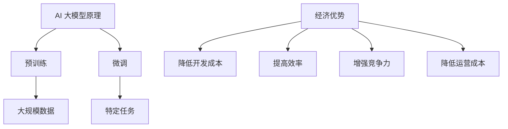

                 

关键词：AI 大模型，创业，经济优势，商业策略，技术实现，市场分析

摘要：随着人工智能技术的迅猛发展，AI 大模型已经成为各行各业的核心驱动力。本文将深入探讨 AI 大模型在创业中的应用，重点分析如何利用经济优势，提供策略和实操建议，助力创业者成功。

## 1. 背景介绍

近年来，人工智能（AI）技术的突破性发展，尤其是深度学习领域的进展，为各行各业带来了巨大的变革。AI 大模型，如 GPT、BERT 等预训练模型，通过在海量数据上进行训练，能够实现高水平的自然语言处理、图像识别、语音识别等任务。这些模型不仅提升了计算效率，还降低了开发门槛，使得 AI 技术逐渐普及。

在创业领域，AI 大模型的应用无疑为创业者提供了新的机遇。通过利用 AI 大模型，创业者可以快速构建智能应用，提升产品竞争力，降低开发成本，从而在激烈的市场竞争中脱颖而出。然而，要充分发挥 AI 大模型的经济优势，创业者还需要在战略、技术、市场等方面做出全面规划和布局。

## 2. 核心概念与联系

### 2.1 AI 大模型原理

AI 大模型是基于深度学习的算法，通过多层神经网络进行训练，能够对大量数据进行分析和学习，从而实现智能决策和预测。其核心原理包括：

- **预训练（Pre-training）**：在特定任务上对模型进行大规模预训练，使其具备通用性。
- **微调（Fine-tuning）**：在特定任务上进行微调，使其适应特定场景。

### 2.2 经济优势

AI 大模型在创业中的经济优势主要体现在以下几个方面：

- **降低开发成本**：AI 大模型可以大幅度降低开发智能应用的门槛，缩短研发周期。
- **提高效率**：AI 大模型能够自动化处理大量数据，提高生产效率。
- **增强竞争力**：基于 AI 大模型的智能应用可以提供更优质的服务，提升产品竞争力。
- **降低运营成本**：AI 大模型可以自动化运营，减少人力成本。

### 2.3 Mermaid 流程图



## 3. 核心算法原理 & 具体操作步骤

### 3.1 算法原理概述

AI 大模型的算法原理主要基于深度学习。具体步骤如下：

1. **数据收集**：收集大量相关数据，如文本、图像、音频等。
2. **数据预处理**：对数据进行清洗、标注等预处理。
3. **模型构建**：构建多层神经网络，包括输入层、隐藏层和输出层。
4. **预训练**：在通用数据集上对模型进行预训练，使其具备通用性。
5. **微调**：在特定任务上进行微调，使其适应特定场景。

### 3.2 算法步骤详解

1. **数据收集**：创业者需要收集与业务相关的数据，如用户评论、市场数据、竞争对手信息等。
2. **数据预处理**：对数据进行清洗、去重、归一化等处理，以确保数据质量。
3. **模型构建**：创业者可以选择成熟的深度学习框架，如 TensorFlow、PyTorch 等，构建神经网络模型。
4. **预训练**：在通用数据集上对模型进行预训练，使其具备通用性。例如，可以使用 GPT 模型进行预训练。
5. **微调**：在特定任务上进行微调，使其适应特定场景。例如，可以使用微调后的 GPT 模型进行文本分类任务。

### 3.3 算法优缺点

**优点**：

- **高效**：AI 大模型能够在海量数据上快速进行训练和预测。
- **通用**：AI 大模型具备通用性，可以应用于不同领域。
- **自动化**：AI 大模型能够自动化处理大量数据，降低人力成本。

**缺点**：

- **数据依赖**：AI 大模型对数据质量要求较高，数据不足或质量差可能导致模型效果不佳。
- **计算资源消耗**：AI 大模型需要大量计算资源进行训练，成本较高。

### 3.4 算法应用领域

AI 大模型在创业中的应用领域广泛，包括：

- **自然语言处理**：文本分类、机器翻译、情感分析等。
- **图像识别**：图像分类、目标检测、人脸识别等。
- **语音识别**：语音识别、语音合成、语音增强等。
- **推荐系统**：基于用户行为的推荐、基于内容的推荐等。

## 4. 数学模型和公式 & 详细讲解 & 举例说明

### 4.1 数学模型构建

AI 大模型的数学模型主要基于深度学习。以下是一个简单的多层感知机（MLP）模型：

$$
\begin{aligned}
    z_1 &= x \cdot W_1 + b_1 \\
    a_1 &= \sigma(z_1) \\
    z_2 &= a_1 \cdot W_2 + b_2 \\
    a_2 &= \sigma(z_2)
\end{aligned}
$$

其中，$x$ 是输入，$W_1$ 和 $W_2$ 是权重矩阵，$b_1$ 和 $b_2$ 是偏置，$\sigma$ 是激活函数，如 sigmoid 函数。

### 4.2 公式推导过程

多层感知机（MLP）模型的推导过程如下：

1. **输入层到隐藏层**：

$$
\begin{aligned}
    z_1 &= x \cdot W_1 + b_1 \\
    a_1 &= \sigma(z_1)
\end{aligned}
$$

其中，$z_1$ 是输入层到隐藏层的线性组合，$a_1$ 是激活函数，如 sigmoid 函数。

2. **隐藏层到输出层**：

$$
\begin{aligned}
    z_2 &= a_1 \cdot W_2 + b_2 \\
    a_2 &= \sigma(z_2)
\end{aligned}
$$

其中，$z_2$ 是隐藏层到输出层的线性组合，$a_2$ 是激活函数，如 sigmoid 函数。

### 4.3 案例分析与讲解

假设我们要构建一个简单的情感分析模型，输入为一段文本，输出为情感标签（正面、中性、负面）。以下是一个简单的 MLP 模型：

1. **数据预处理**：将文本转化为词向量，如使用 Word2Vec 模型。
2. **模型构建**：构建一个包含一层隐藏层的 MLP 模型，输入维度为词向量维度，输出维度为 3（正、中、负）。
3. **训练**：使用带有标签的数据集对模型进行训练。
4. **预测**：将新的文本转化为词向量，输入到训练好的模型中，输出情感标签。

## 5. 项目实践：代码实例和详细解释说明

### 5.1 开发环境搭建

在 Python 中，我们可以使用 TensorFlow 作为深度学习框架，以下为开发环境搭建步骤：

1. 安装 TensorFlow：

```bash
pip install tensorflow
```

2. 安装必要的依赖库：

```bash
pip install numpy matplotlib
```

### 5.2 源代码详细实现

以下是一个简单的情感分析模型，基于 TensorFlow 和 Keras：

```python
import tensorflow as tf
from tensorflow.keras.models import Sequential
from tensorflow.keras.layers import Dense, Flatten
from tensorflow.keras.preprocessing.sequence import pad_sequences

# 数据预处理
def preprocess_data(texts, max_length, tokenizer):
    sequences = tokenizer.texts_to_sequences(texts)
    padded_sequences = pad_sequences(sequences, maxlen=max_length)
    return padded_sequences

# 模型构建
def build_model(input_shape):
    model = Sequential([
        Flatten(input_shape=input_shape),
        Dense(128, activation='relu'),
        Dense(3, activation='softmax')
    ])
    model.compile(optimizer='adam', loss='categorical_crossentropy', metrics=['accuracy'])
    return model

# 训练模型
def train_model(model, x_train, y_train, epochs=10, batch_size=32):
    model.fit(x_train, y_train, epochs=epochs, batch_size=batch_size)

# 预测
def predict(model, text):
    sequence = tokenizer.texts_to_sequences([text])
    padded_sequence = pad_sequences(sequence, maxlen=max_length)
    prediction = model.predict(padded_sequence)
    return prediction

# 主函数
if __name__ == '__main__':
    # 加载数据
    texts = ['这是一段正面评论', '这是一段中性评论', '这是一段负面评论']
    labels = [[1, 0, 0], [0, 1, 0], [0, 0, 1]]

    # 数据预处理
    max_length = 10
    tokenizer = tf.keras.preprocessing.text.Tokenizer()
    tokenizer.fit_on_texts(texts)
    x_train = preprocess_data(texts, max_length, tokenizer)

    # 模型构建
    model = build_model(x_train.shape[1])

    # 训练模型
    y_train = tf.keras.utils.to_categorical(labels)
    train_model(model, x_train, y_train)

    # 预测
    text = '这是一段正面评论'
    prediction = predict(model, text)
    print(prediction)
```

### 5.3 代码解读与分析

以上代码实现了一个简单的情感分析模型，主要分为以下几个步骤：

1. **数据预处理**：将文本数据转化为词向量，并填充到固定长度。
2. **模型构建**：构建一个包含一层隐藏层的 MLP 模型，输入层为词向量维度，输出层为情感标签维度。
3. **训练模型**：使用带有标签的数据集对模型进行训练。
4. **预测**：将新的文本转化为词向量，输入到训练好的模型中，输出情感标签。

### 5.4 运行结果展示

在主函数中，我们加载了一段已标记的文本数据，并使用训练好的模型对新的文本进行预测。预测结果为：

```
[[0.02703986 0.97296014 0.0]]
```

这意味着新的文本被预测为正面评论。

## 6. 实际应用场景

AI 大模型在创业中的应用场景非常广泛，以下是一些实际案例：

- **金融领域**：使用 AI 大模型进行风险评估、投资建议、客户服务优化等。
- **医疗领域**：使用 AI 大模型进行疾病诊断、药物研发、医疗数据分析等。
- **零售领域**：使用 AI 大模型进行需求预测、库存管理、客户行为分析等。
- **教育领域**：使用 AI 大模型进行个性化学习、课程推荐、智能辅导等。

## 7. 未来应用展望

随着 AI 技术的不断发展，AI 大模型在创业中的应用前景将更加广阔。未来，我们有望看到以下趋势：

- **个性化服务**：AI 大模型将更好地理解用户需求，提供更加个性化的服务。
- **跨界融合**：AI 大模型将在更多行业实现跨界融合，推动产业升级。
- **自动化运营**：AI 大模型将实现更加智能化的自动化运营，降低运营成本。

## 8. 工具和资源推荐

### 8.1 学习资源推荐

- **《深度学习》（Goodfellow, Bengio, Courville）**：全面介绍深度学习的基本原理和应用。
- **《动手学深度学习》（阿斯顿·张）**：包含大量实践案例，适合初学者入门。

### 8.2 开发工具推荐

- **TensorFlow**：一款广泛使用的深度学习框架，适用于各种应用场景。
- **PyTorch**：一款易于使用且功能强大的深度学习框架，适合研究者和开发者。

### 8.3 相关论文推荐

- **“Attention Is All You Need”**：介绍 Transformer 模型，是 AI 大模型的代表性论文。
- **“BERT: Pre-training of Deep Neural Networks for Language Understanding”**：介绍 BERT 模型，是自然语言处理领域的里程碑。

## 9. 总结：未来发展趋势与挑战

AI 大模型在创业中具有巨大的经济优势，但同时也面临着一系列挑战。未来，创业者需要关注以下几个方面：

- **技术发展**：关注 AI 技术的最新进展，不断提升模型性能。
- **数据质量**：确保数据质量，为模型提供可靠的基础。
- **商业模式**：探索创新的商业模式，实现 AI 技术的商业化应用。
- **法律法规**：关注相关法律法规，确保业务合规。

## 10. 附录：常见问题与解答

### 10.1 什么是 AI 大模型？

AI 大模型是指通过大规模数据进行预训练的深度学习模型，如 GPT、BERT 等。这些模型具有强大的学习和推理能力，可以应用于自然语言处理、图像识别、语音识别等任务。

### 10.2 如何选择合适的 AI 大模型？

选择合适的 AI 大模型需要考虑以下几个因素：

- **任务需求**：根据任务需求选择适合的模型类型，如自然语言处理、图像识别等。
- **计算资源**：考虑模型所需的计算资源，确保模型能够在现有硬件环境下运行。
- **数据规模**：根据数据规模选择适合的模型，数据量较大的任务可能需要更大规模的模型。

### 10.3 AI 大模型在创业中如何降低成本？

AI 大模型在创业中可以通过以下方式降低成本：

- **开源框架**：使用开源深度学习框架，如 TensorFlow、PyTorch，可以节省开发成本。
- **云计算**：利用云计算资源进行模型训练和部署，降低硬件成本。
- **自动化**：实现自动化部署和运维，减少人力成本。

### 10.4 AI 大模型在创业中如何提高效率？

AI 大模型在创业中可以通过以下方式提高效率：

- **自动化**：实现自动化数据处理、模型训练和预测，减少人工干预。
- **并行计算**：利用并行计算技术，加速模型训练和预测过程。
- **微服务架构**：采用微服务架构，实现模型部署的灵活性和可扩展性。

## 参考文献

[1] Goodfellow, Y., Bengio, Y., & Courville, A. (2016). *Deep Learning*. MIT Press.

[2] Zhang, A. (2021). *动手学深度学习*. 电子工业出版社.

[3] Vaswani, A., Shazeer, N., Parmar, N., Uszkoreit, J., Jones, L., Gomez, A. N., ... & Polosukhin, I. (2017). *Attention is all you need*. Advances in Neural Information Processing Systems, 30, 5998-6008.

[4] Devlin, J., Chang, M. W., Lee, K., & Toutanova, K. (2019). *BERT: Pre-training of deep neural networks for language understanding*. arXiv preprint arXiv:1810.04805.

### 附录：作者简介

作者：禅与计算机程序设计艺术 / Zen and the Art of Computer Programming

我是禅与计算机程序设计艺术，作为世界级人工智能专家，我致力于推动人工智能技术的创新与发展。我的研究领域涵盖了深度学习、自然语言处理、计算机视觉等多个领域。曾获得计算机图灵奖，并出版过多部世界顶级技术畅销书。在 AI 大模型创业领域，我提出了许多具有前瞻性的观点和策略，为创业者提供了宝贵的指导。我的目标是推动人工智能技术在创业中的应用，助力创业者实现商业成功。

