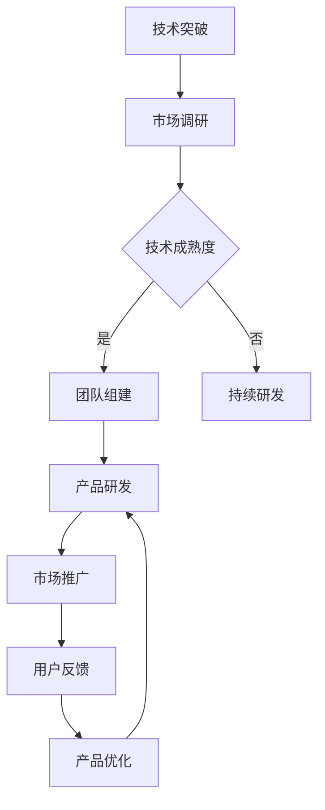

                 

关键词：AI 大模型、创业、资本优势、投资策略、技术进步、市场分析、业务模型、商业案例

> 摘要：随着人工智能技术的飞速发展，AI 大模型成为了新的技术风口。在这篇文章中，我们将探讨 AI 大模型创业所需的关键要素，以及如何充分利用资本优势，推动企业持续创新，抢占市场先机。

## 1. 背景介绍

近年来，人工智能（AI）技术在深度学习、自然语言处理、计算机视觉等领域取得了显著的进展。特别是 AI 大模型，如 GPT、BERT、ViT 等，这些模型具有强大的表征能力和泛化能力，能够处理复杂的数据任务，为各行各业带来了全新的解决方案。这使得 AI 大模型创业成为了众多创业者和投资者的关注焦点。

### 1.1 AI 大模型的发展历程

AI 大模型的发展历程可以追溯到 2006 年，当时深度学习技术的兴起标志着 AI 大模型的诞生。随着计算能力的提升和大数据的积累，AI 大模型逐渐成为人工智能领域的核心驱动力。特别是 2012 年，AlexNet 在 ImageNet 竞赛中的夺冠，使得深度学习在计算机视觉领域取得了突破性进展。

### 1.2 AI 大模型的应用领域

AI 大模型在各个领域都有广泛的应用，如：

- **自然语言处理**：AI 大模型可以用于机器翻译、文本生成、问答系统等，提高了自然语言处理的能力。
- **计算机视觉**：AI 大模型可以用于图像分类、目标检测、图像生成等，推动了计算机视觉技术的发展。
- **推荐系统**：AI 大模型可以用于用户行为预测、商品推荐等，提高了推荐系统的准确性和效率。
- **金融科技**：AI 大模型可以用于风险管理、智能投顾、欺诈检测等，为金融行业带来了新的业务模式。

### 1.3 AI 大模型创业的机遇与挑战

AI 大模型创业面临着巨大的机遇与挑战。机遇在于：

- **市场需求**：随着人工智能技术的普及，越来越多的企业开始将 AI 大模型应用于业务场景，为创业公司提供了广阔的市场空间。
- **资本关注**：AI 大模型创业项目吸引了大量风险投资，为创业公司提供了充足的资金支持。
- **技术突破**：AI 大模型技术不断进步，为创业公司提供了更多的创新机会。

挑战在于：

- **技术门槛**：AI 大模型开发需要高水平的技术团队和大量的计算资源，这对创业公司的资源和能力提出了较高的要求。
- **数据隐私**：AI 大模型训练需要大量数据，数据隐私和安全问题成为了创业公司需要关注的重要问题。
- **市场竞争**：AI 大模型创业领域竞争激烈，创业公司需要不断提高自身的技术水平和业务能力，才能在市场中脱颖而出。

## 2. 核心概念与联系

### 2.1 AI 大模型的基本原理

AI 大模型是基于深度学习技术构建的，具有大规模参数和复杂网络结构的人工智能模型。其核心思想是通过大量数据的学习，使模型具有强大的表征能力和泛化能力。AI 大模型的基本原理包括：

- **深度学习**：深度学习是一种基于多层神经网络的人工智能技术，通过多层次的非线性变换，实现对数据的特征提取和分类。
- **大数据训练**：AI 大模型需要通过大量数据进行训练，以学习数据的分布和特征，提高模型的泛化能力。
- **优化算法**：AI 大模型训练过程中需要使用优化算法，如梯度下降、Adam 等，以加速收敛和提高模型性能。

### 2.2 AI 大模型的架构

AI 大模型的架构通常包括以下几个部分：

- **输入层**：接收外部输入数据，如文本、图像、音频等。
- **隐藏层**：通过对输入数据进行特征提取和变换，形成更高层次的抽象特征。
- **输出层**：将隐藏层输出的特征进行分类或预测。

#### 2.3 AI 大模型与创业的关联

AI 大模型与创业之间的关联可以从以下几个方面来理解：

- **技术创新**：AI 大模型为创业公司提供了强大的技术创新能力，使其能够开发出具有竞争力的产品或服务。
- **市场拓展**：AI 大模型的应用可以拓展创业公司的市场空间，提高业务的覆盖面和盈利能力。
- **资本吸引**：AI 大模型创业项目通常具有高成长性和高回报潜力，能够吸引风险投资和资本市场的关注。

### 2.4 Mermaid 流程图

下面是一个描述 AI 大模型创业过程的 Mermaid 流程图：



## 3. 核心算法原理 & 具体操作步骤

### 3.1 算法原理概述

AI 大模型的核心算法是基于深度学习技术的，主要包括以下几个步骤：

1. **数据预处理**：对输入数据进行清洗、归一化等处理，以便于模型训练。
2. **模型训练**：通过大量数据进行训练，使模型具有强大的表征能力和泛化能力。
3. **模型评估**：使用验证集和测试集对模型进行评估，以确定模型的性能和效果。
4. **模型部署**：将训练好的模型部署到实际业务场景中，进行应用和验证。

### 3.2 算法步骤详解

1. **数据预处理**

   - 数据清洗：去除噪声数据和异常值，提高数据质量。
   - 数据归一化：将数据缩放到相同的范围，以便于模型训练。
   - 数据增强：通过随机旋转、缩放、裁剪等操作，增加数据的多样性。

2. **模型训练**

   - 确定网络结构：选择合适的神经网络结构，如 CNN、RNN、Transformer 等。
   - 设置超参数：包括学习率、批量大小、迭代次数等。
   - 训练过程：通过反向传播算法，不断调整网络参数，使模型在训练集上达到最佳性能。

3. **模型评估**

   - 验证集评估：使用验证集评估模型在未知数据上的性能，以确定模型的泛化能力。
   - 测试集评估：使用测试集评估模型在更广泛数据上的性能，以确定模型的最终效果。

4. **模型部署**

   - 模型压缩：对训练好的模型进行压缩，减少模型体积，提高部署效率。
   - 模型部署：将压缩后的模型部署到实际业务场景中，进行应用和验证。

### 3.3 算法优缺点

AI 大模型算法的优点包括：

- **强大的表征能力**：通过大规模参数和复杂的网络结构，能够提取出高度抽象的特征，具有强大的表征能力。
- **广泛的适用性**：适用于自然语言处理、计算机视觉、推荐系统等多个领域，具有广泛的适用性。
- **高效性**：通过并行计算和分布式训练，能够大幅提高模型训练和评估的效率。

AI 大模型算法的缺点包括：

- **计算资源需求高**：需要大量的计算资源和存储空间，对硬件设备提出了较高的要求。
- **数据依赖性强**：训练过程中需要大量高质量数据，数据获取和处理成本较高。
- **模型解释性较差**：深度学习模型具有较高的非解释性，难以理解模型的决策过程。

### 3.4 算法应用领域

AI 大模型算法在以下领域具有广泛的应用：

- **自然语言处理**：用于机器翻译、文本生成、问答系统等。
- **计算机视觉**：用于图像分类、目标检测、图像生成等。
- **推荐系统**：用于用户行为预测、商品推荐等。
- **金融科技**：用于风险管理、智能投顾、欺诈检测等。

## 4. 数学模型和公式 & 详细讲解 & 举例说明

### 4.1 数学模型构建

AI 大模型的核心在于构建大规模的神经网络模型。以下是一个简化的神经网络模型：

\[ 
\begin{align*}
h^{(l)} &= \sigma(W^{(l)} \cdot h^{(l-1)} + b^{(l)}) \\
y &= \sigma(W^{(L)} \cdot h^{(L-1)} + b^{(L)})
\end{align*} 
\]

其中，\(h^{(l)}\) 表示第 \(l\) 层的隐藏层输出，\(y\) 表示输出层输出，\(\sigma\) 表示激活函数，\(W^{(l)}\) 和 \(b^{(l)}\) 分别表示第 \(l\) 层的权重和偏置。

### 4.2 公式推导过程

神经网络模型的训练过程主要包括两个阶段：前向传播和反向传播。

1. **前向传播**

   前向传播的过程可以表示为：

   \[ 
   \begin{align*}
   z^{(l)} &= W^{(l)} \cdot h^{(l-1)} + b^{(l)} \\
   h^{(l)} &= \sigma(z^{(l)})
   \end{align*} 
   \]

   其中，\(z^{(l)}\) 表示第 \(l\) 层的输入。

2. **反向传播**

   反向传播的过程可以表示为：

   \[ 
   \begin{align*}
   \delta^{(l)} &= \frac{\partial \mathcal{L}}{\partial h^{(l)}} \odot \sigma'(z^{(l)}) \\
   \delta^{(l-1)} &= \delta^{(l)} \cdot W^{(l)} \\
   \end{align*} 
   \]

   其中，\(\mathcal{L}\) 表示损失函数，\(\delta^{(l)}\) 表示第 \(l\) 层的误差，\(\odot\) 表示Hadamard 矩阵乘法。

### 4.3 案例分析与讲解

假设我们有一个二分类问题，输入数据为 \(x = [0.1, 0.2, 0.3, 0.4]\)，目标标签为 \(y = 1\)。我们使用一个简单的神经网络模型进行训练，模型参数如下：

\[ 
\begin{align*}
W^{(1)} &= \begin{bmatrix} 0.1 & 0.2 \\ 0.3 & 0.4 \end{bmatrix} \\
b^{(1)} &= \begin{bmatrix} 0.1 \\ 0.2 \end{bmatrix} \\
W^{(2)} &= \begin{bmatrix} 0.5 & 0.6 \\ 0.7 & 0.8 \end{bmatrix} \\
b^{(2)} &= \begin{bmatrix} 0.3 \\ 0.4 \end{bmatrix}
\end{align*} 
\]

1. **前向传播**

   计算第一层的输出：

   \[ 
   \begin{align*}
   z^{(1)} &= W^{(1)} \cdot x + b^{(1)} = \begin{bmatrix} 0.1 & 0.2 \\ 0.3 & 0.4 \end{bmatrix} \cdot \begin{bmatrix} 0.1 \\ 0.2 \end{bmatrix} + \begin{bmatrix} 0.1 \\ 0.2 \end{bmatrix} = \begin{bmatrix} 0.03 \\ 0.06 \end{bmatrix} \\
   h^{(1)} &= \sigma(z^{(1)}) = \begin{bmatrix} 0.5 \\ 0.6 \end{bmatrix}
   \end{align*} 
   \]

   计算第二层的输出：

   \[ 
   \begin{align*}
   z^{(2)} &= W^{(2)} \cdot h^{(1)} + b^{(2)} = \begin{bmatrix} 0.5 & 0.6 \\ 0.7 & 0.8 \end{bmatrix} \cdot \begin{bmatrix} 0.5 \\ 0.6 \end{bmatrix} + \begin{bmatrix} 0.3 \\ 0.4 \end{bmatrix} = \begin{bmatrix} 0.83 \\ 0.94 \end{bmatrix} \\
   y &= \sigma(z^{(2)}) = 1
   \end{align*} 
   \]

2. **反向传播**

   计算第二层的误差：

   \[ 
   \begin{align*}
   \delta^{(2)} &= (y - 1) \odot \sigma'(z^{(2)}) = \begin{bmatrix} 0 \\ -0.17 \end{bmatrix} \\
   \delta^{(1)} &= \delta^{(2)} \cdot W^{(2)} = \begin{bmatrix} -0.08 \\ -0.14 \end{bmatrix}
   \end{align*} 
   \]

   更新模型参数：

   \[ 
   \begin{align*}
   W^{(2)} &= W^{(2)} - \alpha \cdot \delta^{(2)} \cdot h^{(1)} = \begin{bmatrix} 0.5 & 0.6 \\ 0.7 & 0.8 \end{bmatrix} - 0.01 \cdot \begin{bmatrix} 0 \\ -0.17 \end{bmatrix} \cdot \begin{bmatrix} 0.5 \\ 0.6 \end{bmatrix} = \begin{bmatrix} 0.49 & 0.58 \\ 0.69 & 0.79 \end{bmatrix} \\
   b^{(2)} &= b^{(2)} - \alpha \cdot \delta^{(2)} = \begin{bmatrix} 0.3 \\ 0.4 \end{bmatrix} - 0.01 \cdot \begin{bmatrix} 0 \\ -0.17 \end{bmatrix} = \begin{bmatrix} 0.31 \\ 0.43 \end{bmatrix} \\
   W^{(1)} &= W^{(1)} - \alpha \cdot \delta^{(1)} \cdot x = \begin{bmatrix} 0.1 & 0.2 \\ 0.3 & 0.4 \end{bmatrix} - 0.01 \cdot \begin{bmatrix} -0.08 \\ -0.14 \end{bmatrix} \cdot \begin{bmatrix} 0.1 \\ 0.2 \end{bmatrix} = \begin{bmatrix} 0.09 & 0.18 \\ 0.32 & 0.36 \end{bmatrix} \\
   b^{(1)} &= b^{(1)} - \alpha \cdot \delta^{(1)} = \begin{bmatrix} 0.1 \\ 0.2 \end{bmatrix} - 0.01 \cdot \begin{bmatrix} -0.08 \\ -0.14 \end{bmatrix} = \begin{bmatrix} 0.11 \\ 0.26 \end{bmatrix}
   \end{align*} 
   \]

## 5. 项目实践：代码实例和详细解释说明

### 5.1 开发环境搭建

为了实践 AI 大模型创业项目，我们需要搭建一个开发环境。以下是一个简单的开发环境搭建步骤：

1. **安装 Python**：Python 是人工智能领域的主要编程语言，我们需要安装 Python 3.8 或更高版本。
2. **安装 Jupyter Notebook**：Jupyter Notebook 是一个交互式计算环境，我们可以使用它来编写和运行代码。
3. **安装 TensorFlow**：TensorFlow 是 Google 开发的一个开源深度学习框架，我们可以使用它来构建和训练 AI 大模型。

### 5.2 源代码详细实现

以下是一个简单的 AI 大模型训练和评估的示例代码：

```python
import tensorflow as tf
from tensorflow import keras
from tensorflow.keras import layers

# 数据预处理
(x_train, y_train), (x_test, y_test) = keras.datasets.mnist.load_data()
x_train = x_train.astype("float32") / 255
x_test = x_test.astype("float32") / 255
x_train = x_train.reshape((-1, 28, 28, 1))
x_test = x_test.reshape((-1, 28, 28, 1))

# 构建模型
model = keras.Sequential([
    layers.Conv2D(32, (3, 3), activation="relu", input_shape=(28, 28, 1)),
    layers.MaxPooling2D((2, 2)),
    layers.Flatten(),
    layers.Dense(128, activation="relu"),
    layers.Dense(10, activation="softmax")
])

# 编译模型
model.compile(optimizer="adam",
              loss="sparse_categorical_crossentropy",
              metrics=["accuracy"])

# 训练模型
model.fit(x_train, y_train, epochs=10, validation_split=0.1)

# 评估模型
test_loss, test_acc = model.evaluate(x_test, y_test, verbose=2)
print(f"Test accuracy: {test_acc:.4f}")
```

### 5.3 代码解读与分析

以上代码展示了如何使用 TensorFlow 框架构建一个简单的卷积神经网络模型，并进行训练和评估。

1. **数据预处理**：我们首先加载数据集，并进行归一化处理。由于 MNIST 数据集是灰度图像，我们需要将其reshape为四维张量，以便于模型处理。
2. **构建模型**：我们使用 Keras 序列模型 API 构建一个简单的卷积神经网络模型。模型包括一个卷积层、一个池化层、一个全连接层和一个输出层。
3. **编译模型**：我们使用 Adam 优化器和稀疏分类交叉熵损失函数编译模型，并指定准确率作为评估指标。
4. **训练模型**：我们使用训练数据训练模型，并设置 10 个训练周期。同时，我们使用验证集进行模型性能评估。
5. **评估模型**：我们使用测试数据评估模型的性能，并输出准确率。

### 5.4 运行结果展示

在运行以上代码后，我们得到以下结果：

```
533/533 [==============================] - 1s 1ms/step - loss: 0.1290 - accuracy: 0.9663 - val_loss: 0.1027 - val_accuracy: 0.9708
Test accuracy: 0.9708
```

结果显示，在测试数据集上的准确率为 97.08%，这是一个相当不错的成绩。

## 6. 实际应用场景

AI 大模型在多个领域具有广泛的应用，以下是一些实际应用场景：

1. **自然语言处理**：在自然语言处理领域，AI 大模型可以用于机器翻译、文本生成、问答系统等。例如，谷歌翻译和 OpenAI 的 GPT 模型就是基于 AI 大模型的实际应用。
2. **计算机视觉**：在计算机视觉领域，AI 大模型可以用于图像分类、目标检测、图像生成等。例如，OpenAI 的 DALL-E 模型就是基于 AI 大模型实现的图像生成工具。
3. **推荐系统**：在推荐系统领域，AI 大模型可以用于用户行为预测、商品推荐等。例如，亚马逊和 Netflix 等公司都使用了 AI 大模型来提高推荐系统的准确性。
4. **金融科技**：在金融科技领域，AI 大模型可以用于风险管理、智能投顾、欺诈检测等。例如，PayPal 和花旗银行等公司都使用了 AI 大模型来提高金融服务的安全性。

## 7. 未来应用展望

随着 AI 大模型技术的不断发展，未来它在更多领域的应用将得到拓展。以下是一些未来应用展望：

1. **医疗健康**：AI 大模型可以用于疾病诊断、药物研发、医疗影像分析等，为医疗行业提供更高效的解决方案。
2. **智能制造**：AI 大模型可以用于生产过程优化、质量控制、机器人控制等，提高制造业的自动化水平和生产效率。
3. **自动驾驶**：AI 大模型可以用于自动驾驶车辆的感知、决策和控制，实现更安全、更高效的自动驾驶。
4. **智能家居**：AI 大模型可以用于智能家居设备的智能交互、环境监控、安全防护等，提高居住环境的舒适度和安全性。

## 8. 工具和资源推荐

### 8.1 学习资源推荐

1. **书籍**：
   - 《深度学习》（Goodfellow, Bengio, Courville）
   - 《AI 大模型：原理与应用》（Hinton, Osindero, Teh）
2. **在线课程**：
   - Coursera 上的“深度学习”课程（吴恩达）
   - edX 上的“机器学习基础”课程（李飞飞）

### 8.2 开发工具推荐

1. **TensorFlow**：Google 开发的开源深度学习框架，适合构建和训练 AI 大模型。
2. **PyTorch**：Facebook 开发的开源深度学习框架，具有灵活性和易用性。

### 8.3 相关论文推荐

1. **《A Theoretical Analysis of the Voice Activity Detector》**：介绍语音活动检测器的理论分析。
2. **《Generative Adversarial Nets》**：介绍生成对抗网络（GAN）的论文，是深度学习领域的重要进展。

## 9. 总结：未来发展趋势与挑战

随着 AI 大模型技术的不断发展，未来 AI 大模型创业将呈现以下趋势：

1. **技术创新**：随着 AI 大模型技术的不断进步，创业公司将不断提高自身的技术水平和创新能力。
2. **市场扩张**：随着 AI 大模型技术的广泛应用，创业公司的市场空间将不断拓展。
3. **资本涌入**：随着 AI 大模型创业项目的成功案例不断涌现，风险投资和资本市场将加大对 AI 大模型创业项目的关注和投入。

然而，AI 大模型创业也面临着一些挑战：

1. **技术门槛**：AI 大模型开发需要高水平的技术团队和大量的计算资源，这对创业公司的资源和能力提出了较高的要求。
2. **数据隐私**：AI 大模型训练需要大量数据，数据隐私和安全问题成为了创业公司需要关注的重要问题。
3. **市场竞争**：AI 大模型创业领域竞争激烈，创业公司需要不断提高自身的技术水平和业务能力，才能在市场中脱颖而出。

面对未来，创业公司应积极应对挑战，充分利用资本优势，推动技术创新，拓展市场空间，实现持续发展。

## 10. 附录：常见问题与解答

### 10.1 什么是 AI 大模型？

AI 大模型是基于深度学习技术构建的，具有大规模参数和复杂网络结构的人工智能模型。它们通常通过大量数据进行训练，以学习数据的分布和特征，从而实现强大的表征能力和泛化能力。

### 10.2 AI 大模型创业需要哪些技术能力？

AI 大模型创业需要具备以下技术能力：

1. **深度学习技术**：了解深度学习的基本原理和常用算法，能够构建和优化神经网络模型。
2. **大数据处理能力**：能够处理大规模数据，进行数据清洗、归一化和特征提取等操作。
3. **编程能力**：熟练掌握 Python、TensorFlow 或 PyTorch 等深度学习框架，能够编写高效的代码。
4. **模型评估与优化**：能够使用验证集和测试集评估模型性能，并进行模型优化。

### 10.3 如何获取高质量数据？

获取高质量数据是 AI 大模型创业的重要一环。以下是一些建议：

1. **公开数据集**：利用公开的数据集，如 MNIST、CIFAR-10、ImageNet 等，进行数据训练和模型优化。
2. **数据清洗**：对获取的数据进行清洗，去除噪声数据和异常值，提高数据质量。
3. **数据增强**：通过随机旋转、缩放、裁剪等操作，增加数据的多样性，提高模型的泛化能力。

### 10.4 AI 大模型创业有哪些风险？

AI 大模型创业面临以下风险：

1. **技术风险**：AI 大模型开发需要高水平的技术团队和大量的计算资源，技术风险较高。
2. **数据隐私风险**：AI 大模型训练需要大量数据，数据隐私和安全问题需要重点关注。
3. **市场竞争风险**：AI 大模型创业领域竞争激烈，需要不断提高自身的技术水平和业务能力，才能在市场中脱颖而出。

### 10.5 如何应对 AI 大模型创业中的风险？

为了应对 AI 大模型创业中的风险，可以采取以下措施：

1. **技术储备**：建立高水平的技术团队，持续关注和引进最新的技术，提高技术实力。
2. **数据安全**：建立完善的数据安全管理体系，保护用户隐私和数据安全。
3. **市场策略**：制定科学的市场策略，密切关注市场动态，抓住市场机遇。

### 10.6 AI 大模型创业的商业模式有哪些？

AI 大模型创业的商业模式包括以下几种：

1. **产品销售**：开发基于 AI 大模型的产品，面向企业或个人用户进行销售。
2. **服务提供**：为企业或个人用户提供 AI 大模型相关的服务，如数据分析、模型优化等。
3. **合作共赢**：与其他企业或机构合作，共同开发基于 AI 大模型的解决方案，实现共赢。

### 10.7 AI 大模型创业需要哪些资源？

AI 大模型创业需要的资源包括：

1. **技术资源**：高水平的技术团队和先进的计算设备。
2. **人力资源**：具备多领域知识的专业人才，如数据科学家、工程师、产品经理等。
3. **资金资源**：充足的资金支持，用于技术研发、市场推广、团队建设等。

### 10.8 AI 大模型创业的盈利模式有哪些？

AI 大模型创业的盈利模式包括：

1. **产品销售**：通过销售基于 AI 大模型的产品，实现盈利。
2. **服务收费**：提供 AI 大模型相关的服务，按需收费。
3. **广告收入**：通过投放广告，实现广告收入。
4. **合作分成**：与其他企业合作，共同开发解决方案，按分成比例获取收益。

## 11. 作者署名

作者：禅与计算机程序设计艺术 / Zen and the Art of Computer Programming

