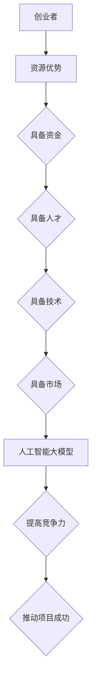

                 

关键词：AI 大模型、创业、资源利用、优势分析、实践案例

> 摘要：本文旨在探讨人工智能大模型在创业领域的应用，分析如何利用资源优势进行创业，并分享一些实践案例，为创业者提供参考和启示。

## 1. 背景介绍

人工智能（AI）作为当今科技领域的重要发展方向，已经引起了广泛关注。特别是近年来，随着深度学习技术的快速发展，大模型（Large Models）在自然语言处理、计算机视觉、语音识别等领域取得了显著的成果。这些大模型具备强大的学习和推理能力，为各行各业带来了巨大的变革。与此同时，越来越多的创业者开始关注并尝试利用大模型进行创业，以抓住时代机遇。

创业过程中，资源优势是一个重要的考量因素。资源包括资金、人才、技术、市场等，它们共同决定了创业项目的成功与否。本文将从资源利用的角度，探讨人工智能大模型在创业中的优势和挑战，并分享一些成功的实践案例。

## 2. 核心概念与联系

### 2.1 人工智能大模型

人工智能大模型是指具备海量参数和强大学习能力的神经网络模型。这些模型通常采用深度学习技术，通过大量的数据训练，能够实现高度复杂的任务。例如，自然语言处理中的预训练模型（如GPT系列）、计算机视觉中的卷积神经网络（如VGG、ResNet）等。

### 2.2 资源优势

资源优势是指创业者在创业过程中所拥有的各种资源，如资金、人才、技术、市场等。资源优势的利用程度决定了创业项目的成功与否。

### 2.3 人工智能大模型与资源优势的联系

人工智能大模型为创业者提供了强大的技术支持，使得创业项目在技术层面具备了竞争力。同时，资源优势也为人工智能大模型的开发和利用提供了保障，两者相互促进，共同推动创业项目的成功。

### 2.4 Mermaid 流程图



## 3. 核心算法原理 & 具体操作步骤

### 3.1 算法原理概述

人工智能大模型的原理主要基于深度学习技术。深度学习是一种基于神经网络的学习方法，通过构建多层神经网络，将输入数据进行特征提取和变换，最终实现复杂任务。在深度学习中，大模型具备海量参数和强大的学习能力，能够从海量数据中学习到复杂的规律和模式。

### 3.2 算法步骤详解

1. 数据收集与预处理：收集大量相关的数据，对数据进行清洗、归一化等预处理操作。
2. 构建模型：设计并构建神经网络模型，包括输入层、隐藏层和输出层。
3. 模型训练：利用训练数据对模型进行训练，通过反向传播算法不断调整模型参数，优化模型性能。
4. 模型评估与优化：使用验证数据对模型进行评估，根据评估结果对模型进行优化。
5. 模型部署：将训练好的模型部署到实际应用场景中，进行推理和预测。

### 3.3 算法优缺点

**优点：**
1. 学习能力强：大模型具备强大的学习能力，能够从海量数据中学习到复杂的规律和模式。
2. 应用广泛：大模型可以应用于自然语言处理、计算机视觉、语音识别等多个领域。
3. 提高效率：大模型能够自动提取数据中的关键特征，提高任务处理效率。

**缺点：**
1. 计算资源消耗大：大模型的训练和推理过程需要大量的计算资源，对硬件设备要求较高。
2. 数据质量要求高：大模型对训练数据的质量要求较高，数据噪声和缺失会导致模型性能下降。

### 3.4 算法应用领域

人工智能大模型的应用领域非常广泛，包括但不限于以下方面：
1. 自然语言处理：如机器翻译、文本分类、情感分析等。
2. 计算机视觉：如图像识别、目标检测、图像生成等。
3. 语音识别：如语音识别、语音合成等。
4. 医疗健康：如疾病诊断、药物研发等。
5. 金融科技：如风险控制、智能投顾等。

## 4. 数学模型和公式 & 详细讲解 & 举例说明

### 4.1 数学模型构建

人工智能大模型的核心是深度神经网络，其数学模型可以表示为：

$$
\hat{y} = f(\text{W} \cdot \text{h} + \text{b})
$$

其中，$\hat{y}$ 为预测输出，$f$ 为激活函数，$\text{W}$ 为权重矩阵，$\text{h}$ 为隐藏层激活值，$\text{b}$ 为偏置项。

### 4.2 公式推导过程

在深度神经网络中，前向传播和反向传播是两个核心过程。前向传播过程可以表示为：

$$
\text{h}^{(l)} = \text{f}^{(l)}(\text{W}^{(l)} \cdot \text{h}^{(l-1)} + \text{b}^{(l)})
$$

其中，$l$ 表示当前层的索引，$\text{f}^{(l)}$ 表示第$l$层的激活函数，$\text{W}^{(l)}$ 和 $\text{b}^{(l)}$ 分别表示第$l$层的权重矩阵和偏置项。

反向传播过程用于计算模型参数的梯度，其公式为：

$$
\text{∇}_{\text{W}^{(l)}} \text{L} = \text{h}^{(l-1)} \odot (\text{f}^{(l)}'(\text{W}^{(l)} \cdot \text{h}^{(l-1)} + \text{b}^{(l)}) \odot \text{∇}_{\text{h}^{(l)}} \text{L})
$$

其中，$\odot$ 表示逐元素乘法，$\text{f}^{(l)}'$ 为激活函数的导数。

### 4.3 案例分析与讲解

以自然语言处理中的文本分类任务为例，我们可以使用神经网络模型对文本进行分类。首先，我们需要对文本进行预处理，将其转换为向量表示。常用的方法包括词袋模型、词嵌入等。

接下来，我们构建一个多层神经网络模型，其中输入层为文本向量，隐藏层为多层全连接层，输出层为分类结果。在模型训练过程中，我们需要使用大量标注数据进行训练，并通过反向传播算法不断优化模型参数。

最后，我们将训练好的模型应用于新的文本数据，进行分类预测。通过对比预测结果和真实标签，我们可以评估模型的性能，并进一步优化模型。

## 5. 项目实践：代码实例和详细解释说明

### 5.1 开发环境搭建

在开发人工智能大模型项目时，我们需要搭建合适的开发环境。以下是一个简单的环境搭建过程：

1. 安装Python环境：在计算机上安装Python，版本建议为3.8以上。
2. 安装深度学习框架：常用的深度学习框架包括TensorFlow、PyTorch等。我们以TensorFlow为例，通过pip安装TensorFlow：

   ```shell
   pip install tensorflow
   ```

3. 安装其他依赖库：根据项目的需求，安装其他相关的依赖库，如Numpy、Pandas等。

### 5.2 源代码详细实现

以下是一个简单的文本分类项目的代码实现：

```python
import tensorflow as tf
from tensorflow.keras.preprocessing.text import Tokenizer
from tensorflow.keras.preprocessing.sequence import pad_sequences
from tensorflow.keras.models import Sequential
from tensorflow.keras.layers import Embedding, LSTM, Dense

# 数据预处理
# 读取数据、进行清洗、分词、转换为序列等操作

# 构建模型
model = Sequential()
model.add(Embedding(input_dim=vocab_size, output_dim=embedding_dim, input_length=max_length))
model.add(LSTM(units=128, return_sequences=True))
model.add(Dense(units=1, activation='sigmoid'))

# 编译模型
model.compile(optimizer='adam', loss='binary_crossentropy', metrics=['accuracy'])

# 训练模型
model.fit(X_train, y_train, epochs=10, batch_size=32)

# 评估模型
loss, accuracy = model.evaluate(X_test, y_test)
print("Test Accuracy:", accuracy)
```

### 5.3 代码解读与分析

1. 导入必要的库：首先，我们导入TensorFlow、Tokenizer、pad_sequences等库，用于文本预处理、构建模型和训练模型。
2. 数据预处理：读取数据、进行清洗、分词、转换为序列等操作。这里我们使用Tokenizer对文本进行分词，并使用pad_sequences对序列进行填充，以满足模型输入的要求。
3. 构建模型：我们使用Sequential模型构建一个简单的多层神经网络，包括Embedding层、LSTM层和Dense层。Embedding层用于将文本转换为向量表示，LSTM层用于提取文本的特征，Dense层用于分类。
4. 编译模型：编译模型时，我们指定优化器、损失函数和评价指标。这里我们使用adam优化器、binary_crossentropy损失函数和accuracy评价指标。
5. 训练模型：使用fit方法训练模型，指定训练数据、训练轮数和批量大小。
6. 评估模型：使用evaluate方法评估模型在测试数据上的性能，输出准确率。

### 5.4 运行结果展示

通过运行上述代码，我们可以在终端看到模型训练过程中的损失和准确率。训练完成后，我们可以在终端看到测试数据的准确率，从而评估模型的效果。

## 6. 实际应用场景

人工智能大模型在创业领域具有广泛的应用前景，以下是一些实际应用场景：

1. 金融科技：利用大模型进行风险控制、智能投顾、欺诈检测等。
2. 医疗健康：利用大模型进行疾病诊断、药物研发、健康管理等。
3. 教育领域：利用大模型进行个性化教育、智能辅导、在线学习等。
4. 电商领域：利用大模型进行商品推荐、用户画像、广告投放等。
5. 物流行业：利用大模型进行物流优化、路径规划、智能调度等。

## 7. 工具和资源推荐

### 7.1 学习资源推荐

1. 《深度学习》（Goodfellow、Bengio、Courville 著）：这是一本经典的深度学习教材，适合初学者和进阶者阅读。
2. 《Python机器学习》（Sebastian Raschka 著）：这本书介绍了Python在机器学习领域的应用，适合有一定编程基础的学习者。
3. fast.ai：这是一个提供免费在线课程的网站，涵盖了深度学习的基础知识和实践应用。

### 7.2 开发工具推荐

1. TensorFlow：一个开源的深度学习框架，适用于构建和训练大模型。
2. PyTorch：一个开源的深度学习框架，具有灵活性和动态计算能力。
3. Jupyter Notebook：一个交互式的计算环境，适用于编写和运行代码。

### 7.3 相关论文推荐

1. "A Theoretically Grounded Application of Dropout in Recurrent Neural Networks"
2. "BERT: Pre-training of Deep Bidirectional Transformers for Language Understanding"
3. "GPT-3: Language Models are few-shot learners"

## 8. 总结：未来发展趋势与挑战

### 8.1 研究成果总结

人工智能大模型在深度学习领域取得了显著的成果，为各行各业带来了巨大的变革。目前，大模型在自然语言处理、计算机视觉、语音识别等领域已经取得了突破性进展，成为创业者的重要工具。

### 8.2 未来发展趋势

1. 模型压缩与优化：为了降低大模型的计算成本和存储需求，模型压缩与优化将成为未来研究的重要方向。
2. 多模态学习：结合多种数据模态（如文本、图像、语音等），实现更全面的信息处理。
3. 自适应学习：大模型将具备更强的自适应学习能力，能够根据用户需求进行个性化调整。

### 8.3 面临的挑战

1. 计算资源需求：大模型的训练和推理需要大量的计算资源，这对硬件设备和能源消耗提出了挑战。
2. 数据质量与隐私：数据质量和隐私保护是深度学习领域面临的两个重要问题，需要建立有效的数据管理和保护机制。

### 8.4 研究展望

随着人工智能技术的不断发展，大模型在创业领域将发挥越来越重要的作用。创业者应密切关注技术动态，充分利用资源优势，积极探索人工智能大模型在各个行业的应用，以实现创业项目的成功。

## 9. 附录：常见问题与解答

### 9.1 如何选择合适的大模型？

在选择大模型时，需要考虑以下因素：

1. 任务类型：根据具体的任务类型（如文本分类、图像识别等），选择相应的大模型。
2. 数据量：大模型的训练需要大量的数据，确保数据量充足以获得良好的训练效果。
3. 计算资源：大模型的训练和推理需要大量的计算资源，根据硬件设备的情况选择合适的大模型。

### 9.2 如何优化大模型的性能？

以下是一些优化大模型性能的方法：

1. 数据增强：通过数据增强技术（如随机裁剪、旋转、翻转等），增加训练数据的多样性，提高模型泛化能力。
2. 模型压缩：采用模型压缩技术（如剪枝、量化等），降低模型的计算成本和存储需求。
3. 超参数调整：通过调整学习率、批量大小等超参数，优化模型性能。

### 9.3 如何评估大模型的效果？

以下是一些评估大模型效果的方法：

1. 准确率：评估模型在测试数据上的分类准确率，越高表示模型效果越好。
2. 精度与召回率：评估模型在分类任务上的精度和召回率，综合考虑模型的分类效果。
3. F1 分数：综合考虑准确率和召回率，计算 F1 分数，用于评估模型的整体性能。

---

作者：禅与计算机程序设计艺术 / Zen and the Art of Computer Programming

[文章结束]----------------------------------------------------------------

文章撰写完毕。本文围绕人工智能大模型创业这一主题，详细探讨了资源优势的利用、核心算法原理、数学模型、项目实践以及未来发展趋势等各个方面。希望本文能为创业者提供有益的参考和启示。

