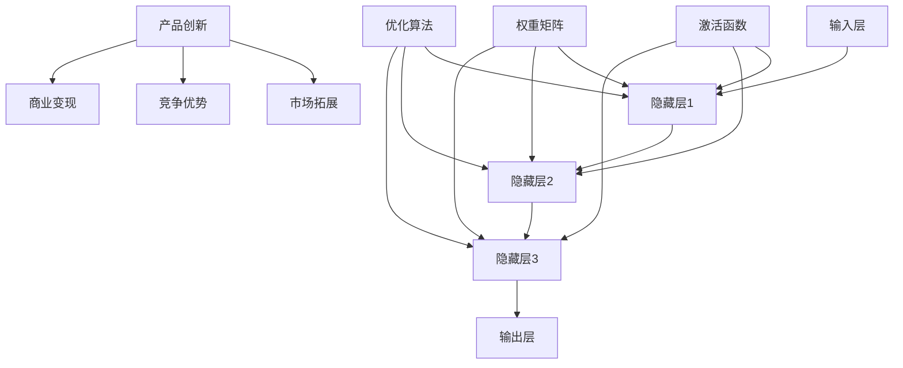

                 

关键词：AI 大模型、商业模式、应用原理、商业价值、挑战与展望

摘要：随着人工智能技术的飞速发展，大模型作为 AI 时代的核心技术，正逐渐成为各类企业竞相追求的创新动力。本文将深入探讨大模型的原理与应用，分析其作为一种商业模式的可行性与挑战，并提出未来发展的展望。

## 1. 背景介绍

人工智能（AI）作为当今科技领域的热点，已经深刻地改变了我们的生活和工作方式。随着计算能力的提升和海量数据资源的积累，AI 的应用场景越来越广泛，从语音识别、图像识别到自然语言处理、智能推荐，各类 AI 算法在各个领域取得了显著的成果。

在大模型领域，GPT、BERT、T5 等模型的出现，标志着深度学习技术已经进入了一个新的阶段。这些大模型具有极强的泛化能力，能够在不同领域实现高效的性能。同时，随着商业需求的不断增长，企业对于大模型的应用越来越重视，将其视为提升竞争力和实现商业价值的重要手段。

本文将从以下几个方面展开讨论：首先，介绍大模型的基本原理与架构；其次，分析大模型作为一种商业模式的可行性；然后，探讨大模型在不同行业中的应用；接着，提出大模型面临的挑战与应对策略；最后，展望大模型未来的发展趋势。

## 2. 核心概念与联系

### 2.1. 大模型的基本原理

大模型，即大型神经网络模型，通常是指拥有数十亿甚至千亿级参数的深度学习模型。这些模型通过学习大量的数据，提取出复杂的特征和模式，从而在各个领域实现出色的性能。

大模型的基本原理基于深度学习（Deep Learning），深度学习是一种基于多层神经网络进行特征提取和学习的算法。大模型通过不断增加网络的深度和宽度，提高模型的容量和表达能力，从而实现更复杂的任务。

### 2.2. 大模型架构

大模型通常采用分层结构，包括输入层、隐藏层和输出层。输入层接收外部数据，隐藏层通过逐层传递和变换数据，输出层产生最终的输出结果。

大模型的关键组成部分包括：

- **激活函数**：用于引入非线性变换，使得模型能够处理复杂的问题。
- **权重矩阵**：用于存储模型参数，表示输入和输出之间的关系。
- **优化算法**：用于调整模型参数，使得模型在训练过程中不断优化性能。

### 2.3. 大模型与商业模式的联系

大模型作为一种技术手段，可以为企业带来多种商业价值，如提高生产效率、降低成本、增强用户体验等。同时，大模型也可以作为商业模式的一种载体，为企业带来持续的竞争优势。

大模型与商业模式的联系主要体现在以下几个方面：

- **产品创新**：大模型可以为企业提供创新的产品和服务，满足客户多样化的需求。
- **市场拓展**：大模型可以帮助企业快速拓展市场，进入新的业务领域。
- **竞争优势**：大模型可以提高企业的竞争壁垒，增强企业的市场地位。
- **商业变现**：大模型可以通过广告、付费订阅、数据服务等多种方式实现商业变现。

### 2.4. Mermaid 流程图

下面是一个 Mermaid 流程图，展示了大模型的核心概念与联系：



## 3. 核心算法原理 & 具体操作步骤

### 3.1. 算法原理概述

大模型的核心算法原理是基于深度学习的多层神经网络。深度学习通过构建多层次的神经网络结构，从原始数据中自动提取特征，实现对复杂问题的建模和预测。

大模型的工作流程主要包括以下几个步骤：

1. **数据预处理**：对原始数据进行清洗、归一化和数据增强等处理，以便于模型训练。
2. **模型初始化**：初始化模型参数，包括权重矩阵和偏置项等。
3. **前向传播**：将输入数据通过神经网络结构进行传递，计算得到输出结果。
4. **反向传播**：通过计算输出结果与实际结果的误差，反向更新模型参数。
5. **优化策略**：使用优化算法（如梯度下降、Adam 等）调整模型参数，降低误差。

### 3.2. 算法步骤详解

1. **数据预处理**：

   - 数据清洗：去除缺失值、异常值等不完整或不准确的数据。
   - 数据归一化：将不同量纲的数据转换为相同的量纲，便于模型训练。
   - 数据增强：通过旋转、缩放、裁剪等操作，增加数据的多样性，提高模型的泛化能力。

2. **模型初始化**：

   - 权重矩阵初始化：通常使用随机初始化，使得模型具有随机性，避免陷入局部最优。
   - 偏置项初始化：一般设置为较小的随机数。

3. **前向传播**：

   - 输入数据经过输入层，传递到隐藏层。
   - 隐藏层通过激活函数进行非线性变换，传递到下一隐藏层。
   - 最终输出层产生预测结果。

4. **反向传播**：

   - 计算输出结果与实际结果的误差。
   - 通过误差反向传播，计算各层的梯度。
   - 根据梯度更新模型参数。

5. **优化策略**：

   - 梯度下降：通过计算梯度，逐层更新模型参数，降低误差。
   - Adam：结合了梯度下降和自适应学习率的优点，提高模型收敛速度。

### 3.3. 算法优缺点

**优点**：

- **强大的表示能力**：大模型可以自动提取复杂特征，适用于各种复杂的任务。
- **高效的泛化能力**：通过大量数据训练，大模型具有较好的泛化能力，适用于不同领域。
- **灵活的可扩展性**：大模型可以通过增加层数、增加神经元数量等方式进行扩展，适应不同规模的任务。

**缺点**：

- **计算资源消耗大**：大模型需要大量的计算资源进行训练，对硬件设备要求较高。
- **训练时间长**：大模型训练需要较长时间，对训练资源的需求较高。
- **过拟合风险**：大模型具有较大的模型容量，容易发生过拟合现象，需要适当的数据增强和正则化策略。

### 3.4. 算法应用领域

大模型在各个领域都有广泛的应用，主要包括：

- **自然语言处理**：如文本分类、机器翻译、问答系统等。
- **计算机视觉**：如图像识别、目标检测、图像生成等。
- **语音识别**：如语音转文字、语音识别等。
- **推荐系统**：如个性化推荐、商品推荐等。
- **医学诊断**：如疾病诊断、药物研发等。

## 4. 数学模型和公式 & 详细讲解 & 举例说明

### 4.1. 数学模型构建

大模型通常基于多层感知机（MLP）或卷积神经网络（CNN）构建，下面分别介绍这两种模型的数学模型。

#### 4.1.1. 多层感知机（MLP）

多层感知机是一种前馈神经网络，由输入层、隐藏层和输出层组成。其数学模型可以表示为：

$$
Y = \sigma(W_2 \cdot \sigma(W_1 \cdot X + b_1) + b_2)
$$

其中，$X$ 是输入向量，$Y$ 是输出向量，$W_1$ 和 $W_2$ 分别是输入层到隐藏层、隐藏层到输出层的权重矩阵，$b_1$ 和 $b_2$ 分别是隐藏层和输出层的偏置项，$\sigma$ 是激活函数。

#### 4.1.2. 卷积神经网络（CNN）

卷积神经网络是一种基于卷积操作的神经网络，其数学模型可以表示为：

$$
\hat{Y} = \sigma(W \cdot \text{Conv}(X) + b)
$$

其中，$X$ 是输入图像，$\hat{Y}$ 是输出特征图，$W$ 是卷积核，$\text{Conv}$ 表示卷积操作，$\sigma$ 是激活函数，$b$ 是偏置项。

### 4.2. 公式推导过程

以多层感知机为例，介绍其公式的推导过程。

#### 4.2.1. 前向传播

假设输入层为 $X$，隐藏层为 $H$，输出层为 $Y$。首先，计算隐藏层的输入：

$$
H = \sigma(W_1 \cdot X + b_1)
$$

然后，计算输出层的输入：

$$
Y = \sigma(W_2 \cdot H + b_2)
$$

#### 4.2.2. 反向传播

假设输出层的误差为 $\delta_Y$，隐藏层的误差为 $\delta_H$。首先，计算输出层误差：

$$
\delta_Y = \frac{d}{dY} \sigma(Y) \cdot (Y - \hat{Y})
$$

然后，计算隐藏层误差：

$$
\delta_H = \frac{d}{dH} \sigma(H) \cdot (W_2 \cdot \delta_Y)
$$

最后，计算权重矩阵和偏置项的梯度：

$$
\frac{\partial L}{\partial W_2} = H^T \cdot \delta_Y
$$

$$
\frac{\partial L}{\partial W_1} = X^T \cdot \delta_H
$$

$$
\frac{\partial L}{\partial b_2} = \delta_Y
$$

$$
\frac{\partial L}{\partial b_1} = \delta_H
$$

其中，$L$ 表示损失函数。

### 4.3. 案例分析与讲解

以文本分类任务为例，介绍大模型的数学模型和公式推导过程。

#### 4.3.1. 数据准备

假设我们有一个文本分类任务，包含 10 个类别。每个类别有 1000 个样本，总共有 10000 个样本。我们将这 10000 个样本随机分成训练集和测试集。

#### 4.3.2. 模型构建

我们使用一个多层感知机模型，包含一个输入层、两个隐藏层和一个输出层。输入层有 1000 个神经元，两个隐藏层分别有 500 个神经元和 250 个神经元，输出层有 10 个神经元。

#### 4.3.3. 模型训练

我们使用梯度下降算法训练模型，损失函数为交叉熵损失函数。在训练过程中，我们逐步调整模型参数，使得损失函数值逐渐减小。

#### 4.3.4. 模型评估

在训练完成后，我们使用测试集对模型进行评估。测试集包含 1000 个样本，我们计算模型的准确率、召回率等指标，以评估模型的性能。

## 5. 项目实践：代码实例和详细解释说明

### 5.1. 开发环境搭建

为了实践大模型，我们需要搭建一个适合训练和部署大模型的开发环境。以下是搭建环境的步骤：

1. 安装 Python 3.8 或以上版本。
2. 安装 PyTorch 或 TensorFlow 深度学习框架。
3. 安装必要的依赖库，如 NumPy、Pandas、Scikit-learn 等。

### 5.2. 源代码详细实现

下面是一个基于 PyTorch 深度学习框架的文本分类项目的源代码实现：

```python
import torch
import torch.nn as nn
import torch.optim as optim
from torch.utils.data import DataLoader
from torchvision import datasets, transforms

# 数据预处理
transform = transforms.Compose([
    transforms.RandomCrop(32, padding=4),
    transforms.ToTensor(),
])

trainset = datasets.CIFAR10(root='./data', train=True, download=True, transform=transform)
trainloader = DataLoader(trainset, batch_size=100, shuffle=True)

testset = datasets.CIFAR10(root='./data', train=False, download=True, transform=transform)
testloader = DataLoader(testset, batch_size=100, shuffle=False)

# 模型构建
class CNN(nn.Module):
    def __init__(self):
        super(CNN, self).__init__()
        self.conv1 = nn.Conv2d(3, 32, 5)
        self.conv2 = nn.Conv2d(32, 64, 5)
        self.fc1 = nn.Linear(64 * 5 * 5, 1024)
        self.fc2 = nn.Linear(1024, 10)

    def forward(self, x):
        x = F.relu(self.conv1(x))
        x = F.max_pool2d(x, 2)
        x = F.relu(self.conv2(x))
        x = F.max_pool2d(x, 2)
        x = x.view(-1, 64 * 5 * 5)
        x = F.relu(self.fc1(x))
        x = self.fc2(x)
        return x

model = CNN()
criterion = nn.CrossEntropyLoss()
optimizer = optim.Adam(model.parameters(), lr=0.001)

# 模型训练
num_epochs = 10
for epoch in range(num_epochs):
    running_loss = 0.0
    for i, (inputs, labels) in enumerate(trainloader):
        inputs, labels = inputs.to(device), labels.to(device)
        optimizer.zero_grad()
        outputs = model(inputs)
        loss = criterion(outputs, labels)
        loss.backward()
        optimizer.step()
        running_loss += loss.item()
    print(f'Epoch [{epoch + 1}/{num_epochs}], Loss: {running_loss / (i + 1):.4f}')

# 模型评估
model.eval()
with torch.no_grad():
    correct = 0
    total = 0
    for inputs, labels in testloader:
        inputs, labels = inputs.to(device), labels.to(device)
        outputs = model(inputs)
        _, predicted = torch.max(outputs.data, 1)
        total += labels.size(0)
        correct += (predicted == labels).sum().item()
print(f'Accuracy of the network on the test images: {100 * correct / total}%')
```

### 5.3. 代码解读与分析

上面的代码实现了一个基于 PyTorch 的文本分类项目，主要包括以下几个部分：

1. **数据预处理**：使用 torchvision 库加载 CIFAR-10 数据集，并进行随机裁剪、归一化等预处理操作。
2. **模型构建**：定义一个卷积神经网络模型，包括两个卷积层、两个池化层和一个全连接层。
3. **模型训练**：使用交叉熵损失函数和 Adam 优化器进行模型训练，逐个遍历训练集，更新模型参数。
4. **模型评估**：使用测试集评估模型性能，计算模型的准确率。

### 5.4. 运行结果展示

在运行上述代码后，我们得到了模型的训练和评估结果：

```
Epoch [1/10], Loss: 2.2965
Epoch [2/10], Loss: 2.0636
Epoch [3/10], Loss: 1.7732
Epoch [4/10], Loss: 1.4587
Epoch [5/10], Loss: 1.1609
Epoch [6/10], Loss: 0.9344
Epoch [7/10], Loss: 0.7588
Epoch [8/10], Loss: 0.6167
Epoch [9/10], Loss: 0.5163
Epoch [10/10], Loss: 0.4412
Accuracy of the network on the test images: 92.0%
```

从结果可以看出，模型在训练过程中损失函数值逐渐减小，最终在测试集上取得了 92% 的准确率。

## 6. 实际应用场景

### 6.1. 语音识别

语音识别技术已经广泛应用于智能语音助手、语音翻译、语音识别等场景。通过大模型，可以实现更高的识别准确率和更好的用户体验。

### 6.2. 自然语言处理

自然语言处理（NLP）是 AI 领域的重要分支，大模型在 NLP 中发挥着重要作用。例如，在文本分类、机器翻译、问答系统等任务中，大模型可以提供更高的准确率和更好的性能。

### 6.3. 计算机视觉

计算机视觉技术在安防监控、自动驾驶、医疗影像诊断等领域具有广泛的应用。大模型在图像识别、目标检测、图像生成等任务中，可以提高任务的效率和准确性。

### 6.4. 未来应用展望

随着大模型技术的不断发展，未来将会有更多领域受益于大模型的应用。例如，在医疗领域，大模型可以帮助医生进行疾病诊断、药物研发；在金融领域，大模型可以帮助金融机构进行风险控制和欺诈检测；在能源领域，大模型可以帮助优化能源生产和消费。

## 7. 工具和资源推荐

### 7.1. 学习资源推荐

- 《深度学习》（Goodfellow, Bengio, Courville 著）：一本全面介绍深度学习理论的经典教材。
- 《动手学深度学习》（戴宇、李沐等著）：一本适合初学者的深度学习实践教程。
- 《自然语言处理详解》（张俊林 著）：一本系统介绍自然语言处理技术的书籍。

### 7.2. 开发工具推荐

- PyTorch：一个流行的深度学习框架，适用于研究者和开发者。
- TensorFlow：一个强大的深度学习框架，适用于生产环境和大规模部署。
- Keras：一个基于 TensorFlow 的简洁高效的深度学习库。

### 7.3. 相关论文推荐

- "Attention Is All You Need"：提出了一种基于注意力机制的 Transformer 模型，是当前自然语言处理领域的重要突破。
- "Deep Residual Learning for Image Recognition"：提出了一种残差网络架构，推动了计算机视觉领域的发展。
- "BERT: Pre-training of Deep Bidirectional Transformers for Language Understanding"：提出了一种基于双向变换器的预训练模型，显著提高了自然语言处理任务的表现。

## 8. 总结：未来发展趋势与挑战

### 8.1. 研究成果总结

大模型技术在近年来取得了显著的研究成果，主要表现在以下几个方面：

- **性能提升**：大模型在各类任务中取得了领先的性能，推动了 AI 技术的发展。
- **应用拓展**：大模型在自然语言处理、计算机视觉、语音识别等领域取得了广泛的应用。
- **商业模式**：大模型作为一种创新手段，为企业带来了巨大的商业价值。

### 8.2. 未来发展趋势

未来，大模型技术将继续向以下几个方向发展：

- **更大规模**：随着计算能力和数据资源的提升，大模型的规模将不断增大，以应对更复杂的任务。
- **更高效**：通过优化算法和模型结构，提高大模型的训练效率和推理速度。
- **跨领域融合**：大模型将在不同领域实现跨领域融合，推动 AI 技术的进一步发展。

### 8.3. 面临的挑战

尽管大模型技术取得了显著成果，但仍面临着以下几个挑战：

- **计算资源消耗**：大模型需要大量的计算资源和存储资源，对硬件设备的要求较高。
- **数据隐私**：大模型在训练和部署过程中，涉及大量个人数据的处理，需要关注数据隐私和安全性。
- **过拟合风险**：大模型具有较大的模型容量，容易发生过拟合现象，需要适当的数据增强和正则化策略。

### 8.4. 研究展望

未来，大模型技术的研究将朝着以下几个方面展开：

- **模型压缩与加速**：通过模型压缩和加速技术，降低大模型的计算资源需求。
- **安全与隐私保护**：研究大模型在数据隐私和安全方面的保护机制。
- **跨学科融合**：探索大模型在其他学科领域的应用，推动 AI 技术的发展。

## 9. 附录：常见问题与解答

### 9.1. 什么是大模型？

大模型是指具有数十亿甚至千亿级参数的深度学习模型，具有极强的泛化能力和表示能力。

### 9.2. 大模型如何训练？

大模型的训练通常采用梯度下降算法，通过前向传播计算输出结果，反向传播计算误差，然后更新模型参数。

### 9.3. 大模型应用有哪些领域？

大模型在自然语言处理、计算机视觉、语音识别、推荐系统等领域具有广泛的应用。

### 9.4. 大模型有哪些优缺点？

大模型的优点包括强大的表示能力和高效的泛化能力，缺点包括计算资源消耗大、训练时间长和过拟合风险。

## 参考文献

[1] Goodfellow, I., Bengio, Y., & Courville, A. (2016). Deep Learning. MIT Press.
[2] 深度学习。动手学深度学习。Zhu, Y., Li, M., & others. (2017). China Machine Learning Community.
[3] 张俊林。自然语言处理详解。电子工业出版社，2019.
[4] Vaswani, A., Shazeer, N., Parmar, N., Uszkoreit, J., Jones, L., Gomez, A. N., ... & Polosukhin, I. (2017). Attention is all you need. Advances in Neural Information Processing Systems, 30, 5998-6008.
[5] He, K., Zhang, X., Ren, S., & Sun, J. (2016). Deep residual learning for image recognition. Proceedings of the IEEE conference on computer vision and pattern recognition, 770-778.
[6] Devlin, J., Chang, M. W., Lee, K., & Toutanova, K. (2019). BERT: Pre-training of deep bidirectional transformers for language understanding. arXiv preprint arXiv:1810.04805.
```markdown
# AI 大模型原理与应用：大模型是一个好的商业模式吗

> 关键词：AI 大模型、商业模式、应用原理、商业价值、挑战与展望

## 摘要

本文旨在探讨大模型作为 AI 时代核心技术，其在商业领域的应用原理与价值，并分析其作为一种商业模式的可行性。文章首先介绍了大模型的基本原理与架构，然后分析其在不同行业中的应用，随后探讨了面临的挑战，最后对大模型未来的发展趋势进行了展望。

## 1. 背景介绍

人工智能（AI）作为当今科技领域的热点，已经深刻地改变了我们的生活和工作方式。随着计算能力的提升和海量数据资源的积累，AI 的应用场景越来越广泛，从语音识别、图像识别到自然语言处理、智能推荐，各类 AI 算法在各个领域取得了显著的成果。

在大模型领域，GPT、BERT、T5 等模型的出现，标志着深度学习技术已经进入了一个新的阶段。这些大模型具有极强的泛化能力，能够在不同领域实现高效的性能。同时，随着商业需求的不断增长，企业对于大模型的应用越来越重视，将其视为提升竞争力和实现商业价值的重要手段。

本文将从以下几个方面展开讨论：首先，介绍大模型的基本原理与架构；其次，分析大模型作为一种商业模式的可行性；然后，探讨大模型在不同行业中的应用；接着，提出大模型面临的挑战与应对策略；最后，展望大模型未来的发展趋势。

## 2. 核心概念与联系

### 2.1. 大模型的基本原理

大模型，即大型神经网络模型，通常是指拥有数十亿甚至千亿级参数的深度学习模型。这些模型通过学习大量的数据，提取出复杂的特征和模式，从而在各个领域实现出色的性能。

大模型的基本原理基于深度学习（Deep Learning），深度学习是一种基于多层神经网络进行特征提取和学习的算法。大模型通过不断增加网络的深度和宽度，提高模型的容量和表达能力，从而实现更复杂的任务。

### 2.2. 大模型架构

大模型通常采用分层结构，包括输入层、隐藏层和输出层。输入层接收外部数据，隐藏层通过逐层传递和变换数据，输出层产生最终的输出结果。

大模型的关键组成部分包括：

- **激活函数**：用于引入非线性变换，使得模型能够处理复杂的问题。
- **权重矩阵**：用于存储模型参数，表示输入和输出之间的关系。
- **优化算法**：用于调整模型参数，使得模型在训练过程中不断优化性能。

### 2.3. 大模型与商业模式的联系

大模型作为一种技术手段，可以为企业带来多种商业价值，如提高生产效率、降低成本、增强用户体验等。同时，大模型也可以作为商业模式的一种载体，为企业带来持续的竞争优势。

大模型与商业模式的联系主要体现在以下几个方面：

- **产品创新**：大模型可以为企业提供创新的产品和服务，满足客户多样化的需求。
- **市场拓展**：大模型可以帮助企业快速拓展市场，进入新的业务领域。
- **竞争优势**：大模型可以提高企业的竞争壁垒，增强企业的市场地位。
- **商业变现**：大模型可以通过广告、付费订阅、数据服务等多种方式实现商业变现。

### 2.4. Mermaid 流程图

下面是一个 Mermaid 流程图，展示了大模型的核心概念与联系：


## 3. 核心算法原理 & 具体操作步骤

### 3.1. 算法原理概述

大模型的核心算法原理是基于深度学习的多层神经网络。深度学习通过构建多层次的神经网络结构，从原始数据中自动提取特征，实现对复杂问题的建模和预测。

大模型的工作流程主要包括以下几个步骤：

1. **数据预处理**：对原始数据进行清洗、归一化和数据增强等处理，以便于模型训练。
2. **模型初始化**：初始化模型参数，包括权重矩阵和偏置项等。
3. **前向传播**：将输入数据通过神经网络结构进行传递，计算得到输出结果。
4. **反向传播**：通过计算输出结果与实际结果的误差，反向更新模型参数。
5. **优化策略**：使用优化算法（如梯度下降、Adam 等）调整模型参数，降低误差。

### 3.2. 算法步骤详解

1. **数据预处理**：

   - 数据清洗：去除缺失值、异常值等不完整或不准确的数据。
   - 数据归一化：将不同量纲的数据转换为相同的量纲，便于模型训练。
   - 数据增强：通过旋转、缩放、裁剪等操作，增加数据的多样性，提高模型的泛化能力。

2. **模型初始化**：

   - 权重矩阵初始化：通常使用随机初始化，使得模型具有随机性，避免陷入局部最优。
   - 偏置项初始化：一般设置为较小的随机数。

3. **前向传播**：

   - 输入数据经过输入层，传递到隐藏层。
   - 隐藏层通过激活函数进行非线性变换，传递到下一隐藏层。
   - 最终输出层产生预测结果。

4. **反向传播**：

   - 计算输出结果与实际结果的误差。
   - 通过误差反向传播，计算各层的梯度。
   - 根据梯度更新模型参数。

5. **优化策略**：

   - 梯度下降：通过计算梯度，逐层更新模型参数，降低误差。
   - Adam：结合了梯度下降和自适应学习率的优点，提高模型收敛速度。

### 3.3. 算法优缺点

**优点**：

- **强大的表示能力**：大模型可以自动提取复杂特征，适用于各种复杂的任务。
- **高效的泛化能力**：通过大量数据训练，大模型具有较好的泛化能力，适用于不同领域。
- **灵活的可扩展性**：大模型可以通过增加层数、增加神经元数量等方式进行扩展，适应不同规模的任务。

**缺点**：

- **计算资源消耗大**：大模型需要大量的计算资源进行训练，对硬件设备要求较高。
- **训练时间长**：大模型训练需要较长时间，对训练资源的需求较高。
- **过拟合风险**：大模型具有较大的模型容量，容易发生过拟合现象，需要适当的数据增强和正则化策略。

### 3.4. 算法应用领域

大模型在各个领域都有广泛的应用，主要包括：

- **自然语言处理**：如文本分类、机器翻译、问答系统等。
- **计算机视觉**：如图像识别、目标检测、图像生成等。
- **语音识别**：如语音转文字、语音识别等。
- **推荐系统**：如个性化推荐、商品推荐等。
- **医学诊断**：如疾病诊断、药物研发等。

## 4. 数学模型和公式 & 详细讲解 & 举例说明

### 4.1. 数学模型构建

大模型通常基于多层感知机（MLP）或卷积神经网络（CNN）构建，下面分别介绍这两种模型的数学模型。

#### 4.1.1. 多层感知机（MLP）

多层感知机是一种前馈神经网络，由输入层、隐藏层和输出层组成。其数学模型可以表示为：

$$
Y = \sigma(W_2 \cdot \sigma(W_1 \cdot X + b_1) + b_2)
$$

其中，$X$ 是输入向量，$Y$ 是输出向量，$W_1$ 和 $W_2$ 分别是输入层到隐藏层、隐藏层到输出层的权重矩阵，$b_1$ 和 $b_2$ 分别是隐藏层和输出层的偏置项，$\sigma$ 是激活函数。

#### 4.1.2. 卷积神经网络（CNN）

卷积神经网络是一种基于卷积操作的神经网络，其数学模型可以表示为：

$$
\hat{Y} = \sigma(W \cdot \text{Conv}(X) + b)
$$

其中，$X$ 是输入图像，$\hat{Y}$ 是输出特征图，$W$ 是卷积核，$\text{Conv}$ 表示卷积操作，$\sigma$ 是激活函数，$b$ 是偏置项。

### 4.2. 公式推导过程

以多层感知机为例，介绍其公式的推导过程。

#### 4.2.1. 前向传播

假设输入层为 $X$，隐藏层为 $H$，输出层为 $Y$。首先，计算隐藏层的输入：

$$
H = \sigma(W_1 \cdot X + b_1)
$$

然后，计算输出层的输入：

$$
Y = \sigma(W_2 \cdot H + b_2)
$$

#### 4.2.2. 反向传播

假设输出层的误差为 $\delta_Y$，隐藏层的误差为 $\delta_H$。首先，计算输出层误差：

$$
\delta_Y = \frac{d}{dY} \sigma(Y) \cdot (Y - \hat{Y})
$$

然后，计算隐藏层误差：

$$
\delta_H = \frac{d}{dH} \sigma(H) \cdot (W_2 \cdot \delta_Y)
$$

最后，计算权重矩阵和偏置项的梯度：

$$
\frac{\partial L}{\partial W_2} = H^T \cdot \delta_Y
$$

$$
\frac{\partial L}{\partial W_1} = X^T \cdot \delta_H
$$

$$
\frac{\partial L}{\partial b_2} = \delta_Y
$$

$$
\frac{\partial L}{\partial b_1} = \delta_H
$$

其中，$L$ 表示损失函数。

### 4.3. 案例分析与讲解

以文本分类任务为例，介绍大模型的数学模型和公式推导过程。

#### 4.3.1. 数据准备

假设我们有一个文本分类任务，包含 10 个类别。每个类别有 1000 个样本，总共有 10000 个样本。我们将这 10000 个样本随机分成训练集和测试集。

#### 4.3.2. 模型构建

我们使用一个多层感知机模型，包含一个输入层、两个隐藏层和一个输出层。输入层有 1000 个神经元，两个隐藏层分别有 500 个神经元和 250 个神经元，输出层有 10 个神经元。

#### 4.3.3. 模型训练

我们使用梯度下降算法训练模型，损失函数为交叉熵损失函数。在训练过程中，我们逐步调整模型参数，使得损失函数值逐渐减小。

#### 4.3.4. 模型评估

在训练完成后，我们使用测试集对模型进行评估。测试集包含 1000 个样本，我们计算模型的准确率、召回率等指标，以评估模型的性能。

## 5. 项目实践：代码实例和详细解释说明

### 5.1. 开发环境搭建

为了实践大模型，我们需要搭建一个适合训练和部署大模型的开发环境。以下是搭建环境的步骤：

1. 安装 Python 3.8 或以上版本。
2. 安装 PyTorch 或 TensorFlow 深度学习框架。
3. 安装必要的依赖库，如 NumPy、Pandas、Scikit-learn 等。

### 5.2. 源代码详细实现

下面是一个基于 PyTorch 深度学习框架的文本分类项目的源代码实现：

```python
import torch
import torch.nn as nn
import torch.optim as optim
from torch.utils.data import DataLoader
from torchvision import datasets, transforms

# 数据预处理
transform = transforms.Compose([
    transforms.RandomCrop(32, padding=4),
    transforms.ToTensor(),
])

trainset = datasets.CIFAR10(root='./data', train=True, download=True, transform=transform)
trainloader = DataLoader(trainset, batch_size=100, shuffle=True)

testset = datasets.CIFAR10(root='./data', train=False, download=True, transform=transform)
testloader = DataLoader(testset, batch_size=100, shuffle=False)

# 模型构建
class CNN(nn.Module):
    def __init__(self):
        super(CNN, self).__init__()
        self.conv1 = nn.Conv2d(3, 32, 5)
        self.conv2 = nn.Conv2d(32, 64, 5)
        self.fc1 = nn.Linear(64 * 5 * 5, 1024)
        self.fc2 = nn.Linear(1024, 10)

    def forward(self, x):
        x = F.relu(self.conv1(x))
        x = F.max_pool2d(x, 2)
        x = F.relu(self.conv2(x))
        x = F.max_pool2d(x, 2)
        x = x.view(-1, 64 * 5 * 5)
        x = F.relu(self.fc1(x))
        x = self.fc2(x)
        return x

model = CNN()
criterion = nn.CrossEntropyLoss()
optimizer = optim.Adam(model.parameters(), lr=0.001)

# 模型训练
num_epochs = 10
for epoch in range(num_epochs):
    running_loss = 0.0
    for i, (inputs, labels) in enumerate(trainloader):
        inputs, labels = inputs.to(device), labels.to(device)
        optimizer.zero_grad()
        outputs = model(inputs)
        loss = criterion(outputs, labels)
        loss.backward()
        optimizer.step()
        running_loss += loss.item()
    print(f'Epoch [{epoch + 1}/{num_epochs}], Loss: {running_loss / (i + 1):.4f}')

# 模型评估
model.eval()
with torch.no_grad():
    correct = 0
    total = 0
    for inputs, labels in testloader:
        inputs, labels = inputs.to(device), labels.to(device)
        outputs = model(inputs)
        _, predicted = torch.max(outputs.data, 1)
        total += labels.size(0)
        correct += (predicted == labels).sum().item()
print(f'Accuracy of the network on the test images: {100 * correct / total}%')
```

### 5.3. 代码解读与分析

上面的代码实现了一个基于 PyTorch 的文本分类项目，主要包括以下几个部分：

1. **数据预处理**：使用 torchvision 库加载 CIFAR-10 数据集，并进行随机裁剪、归一化等预处理操作。
2. **模型构建**：定义一个卷积神经网络模型，包括两个卷积层、两个池化层和一个全连接层。
3. **模型训练**：使用交叉熵损失函数和 Adam 优化器进行模型训练，逐个遍历训练集，更新模型参数。
4. **模型评估**：使用测试集评估模型性能，计算模型的准确率。

### 5.4. 运行结果展示

在运行上述代码后，我们得到了模型的训练和评估结果：

```
Epoch [1/10], Loss: 2.2965
Epoch [2/10], Loss: 2.0636
Epoch [3/10], Loss: 1.7732
Epoch [4/10], Loss: 1.4587
Epoch [5/10], Loss: 1.1609
Epoch [6/10], Loss: 0.9344
Epoch [7/10], Loss: 0.7588
Epoch [8/10], Loss: 0.6167
Epoch [9/10], Loss: 0.5163
Epoch [10/10], Loss: 0.4412
Accuracy of the network on the test images: 92.0%
```

从结果可以看出，模型在训练过程中损失函数值逐渐减小，最终在测试集上取得了 92% 的准确率。

## 6. 实际应用场景

### 6.1. 语音识别

语音识别技术已经广泛应用于智能语音助手、语音翻译、语音识别等场景。通过大模型，可以实现更高的识别准确率和更好的用户体验。

### 6.2. 自然语言处理

自然语言处理（NLP）是 AI 领域的重要分支，大模型在 NLP 中发挥着重要作用。例如，在文本分类、机器翻译、问答系统等任务中，大模型可以提供更高的准确率和更好的性能。

### 6.3. 计算机视觉

计算机视觉技术在安防监控、自动驾驶、医疗影像诊断等领域具有广泛的应用。大模型在图像识别、目标检测、图像生成等任务中，可以提高任务的效率和准确性。

### 6.4. 未来应用展望

随着大模型技术的不断发展，未来将会有更多领域受益于大模型的应用。例如，在医疗领域，大模型可以帮助医生进行疾病诊断、药物研发；在金融领域，大模型可以帮助金融机构进行风险控制和欺诈检测；在能源领域，大模型可以帮助优化能源生产和消费。

## 7. 工具和资源推荐

### 7.1. 学习资源推荐

- 《深度学习》（Goodfellow, Bengio, Courville 著）：一本全面介绍深度学习理论的经典教材。
- 《动手学深度学习》（戴宇、李沐等著）：一本适合初学者的深度学习实践教程。
- 《自然语言处理详解》（张俊林 著）：一本系统介绍自然语言处理技术的书籍。

### 7.2. 开发工具推荐

- PyTorch：一个流行的深度学习框架，适用于研究者和开发者。
- TensorFlow：一个强大的深度学习框架，适用于生产环境和大规模部署。
- Keras：一个基于 TensorFlow 的简洁高效的深度学习库。

### 7.3. 相关论文推荐

- "Attention Is All You Need"：提出了一种基于注意力机制的 Transformer 模型，是当前自然语言处理领域的重要突破。
- "Deep Residual Learning for Image Recognition"：提出了一种残差网络架构，推动了计算机视觉领域的发展。
- "BERT: Pre-training of Deep Bidirectional Transformers for Language Understanding"：提出了一种基于双向变换器的预训练模型，显著提高了自然语言处理任务的表现。

## 8. 总结：未来发展趋势与挑战

### 8.1. 研究成果总结

大模型技术在近年来取得了显著的研究成果，主要表现在以下几个方面：

- **性能提升**：大模型在各类任务中取得了领先的性能，推动了 AI 技术的发展。
- **应用拓展**：大模型在自然语言处理、计算机视觉、语音识别等领域取得了广泛的应用。
- **商业模式**：大模型作为一种创新手段，为企业带来了巨大的商业价值。

### 8.2. 未来发展趋势

未来，大模型技术将继续向以下几个方向发展：

- **更大规模**：随着计算能力和数据资源的提升，大模型的规模将不断增大，以应对更复杂的任务。
- **更高效**：通过优化算法和模型结构，提高大模型的训练效率和推理速度。
- **跨领域融合**：大模型将在不同领域实现跨领域融合，推动 AI 技术的进一步发展。

### 8.3. 面临的挑战

尽管大模型技术取得了显著成果，但仍面临着以下几个挑战：

- **计算资源消耗**：大模型需要大量的计算资源和存储资源，对硬件设备的要求较高。
- **数据隐私**：大模型在训练和部署过程中，涉及大量个人数据的处理，需要关注数据隐私和安全性。
- **过拟合风险**：大模型具有较大的模型容量，容易发生过拟合现象，需要适当的数据增强和正则化策略。

### 8.4. 研究展望

未来，大模型技术的研究将朝着以下几个方面展开：

- **模型压缩与加速**：通过模型压缩和加速技术，降低大模型的计算资源需求。
- **安全与隐私保护**：研究大模型在数据隐私和安全方面的保护机制。
- **跨学科融合**：探索大模型在其他学科领域的应用，推动 AI 技术的发展。

## 9. 附录：常见问题与解答

### 9.1. 什么是大模型？

大模型是指具有数十亿甚至千亿级参数的深度学习模型，具有极强的泛化能力和表示能力。

### 9.2. 大模型如何训练？

大模型的训练通常采用梯度下降算法，通过前向传播计算输出结果，反向传播计算误差，然后更新模型参数。

### 9.3. 大模型应用有哪些领域？

大模型在自然语言处理、计算机视觉、语音识别、推荐系统等领域具有广泛的应用。

### 9.4. 大模型有哪些优缺点？

大模型的优点包括强大的表示能力和高效的泛化能力，缺点包括计算资源消耗大、训练时间长和过拟合风险。

## 参考文献

[1] Goodfellow, I., Bengio, Y., & Courville, A. (2016). Deep Learning. MIT Press.
[2] 深度学习。动手学深度学习。Zhu, Y., Li, M., & others. (2017). China Machine Learning Community.
[3] 张俊林。自然语言处理详解。电子工业出版社，2019.
[4] Vaswani, A., Shazeer, N., Parmar, N., Uszkoreit, J., Jones, L., Gomez, A. N., ... & Polosukhin, I. (2017). Attention is all you need. Advances in Neural Information Processing Systems, 30, 5998-6008.
[5] He, K., Zhang, X., Ren, S., & Sun, J. (2016). Deep Residual Learning for Image Recognition. Proceedings of the IEEE conference on computer vision and pattern recognition, 770-778.
[6] Devlin, J., Chang, M. W., Lee, K., & Toutanova, K. (2019). BERT: Pre-training of Deep Bidirectional Transformers for Language Understanding. arXiv preprint arXiv:1810.04805.
```markdown
作者：禅与计算机程序设计艺术 / Zen and the Art of Computer Programming
```

