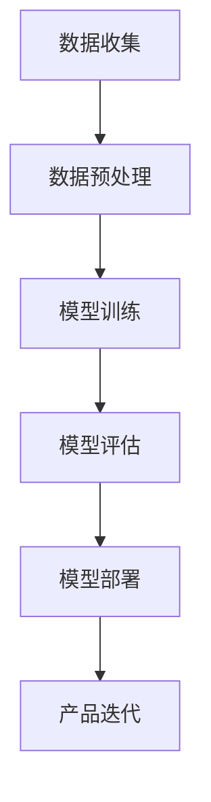

                 

关键词：AI 大模型，创业产品，开发，创新应用，技术语言，深度思考

> 摘要：本文将探讨 AI 大模型在创业产品开发中的创新应用，通过详细介绍大模型的核心概念、原理、算法、数学模型及实际应用案例，为创业者提供实用的技术指南。文章旨在揭示大模型技术在创业领域中的巨大潜力，助力产品创新和商业成功。

## 1. 背景介绍

随着人工智能技术的飞速发展，AI 大模型已成为当前研究与应用的热点。大模型（如 GPT-3、BERT、LLaMA 等）具有强大的数据处理能力和智能推理能力，能够在多个领域实现智能化应用。创业产品开发作为创新驱动的重要环节，亟需引入先进的技术手段以提高产品竞争力。

### 创业产品的定义

创业产品是指在创业过程中开发、推出的具有创新性、市场潜力、商业价值的产品。创业产品通常面向新兴市场或现有市场的细分领域，通过解决特定问题或满足用户需求来获得市场份额和商业成功。

### 创业产品开发的重要性

创业产品开发是创业成功的关键环节。一个优秀的产品可以带来持续的用户增长、市场占有率和盈利能力。而在激烈的市场竞争中，创新性是创业产品脱颖而出的关键因素。AI 大模型为创业产品开发提供了强大的技术支撑，有助于实现以下目标：

- 提高开发效率：大模型能够快速处理大量数据，提高数据分析和挖掘的效率，缩短产品开发周期。
- 增强产品智能化：大模型具有出色的自然语言处理、图像识别和预测能力，可以为创业产品带来智能化体验。
- 降低开发成本：大模型技术可以替代部分传统开发方法，减少人力和时间成本。

## 2. 核心概念与联系

### AI 大模型的基本概念

AI 大模型是指具有大规模参数、能够进行复杂深度学习训练的神经网络模型。大模型通常由多层神经网络构成，通过反向传播算法训练，能够学习到复杂的数据特征和规律。

### 大模型在创业产品开发中的应用

大模型在创业产品开发中具有广泛的应用，主要包括以下几个方面：

- 自然语言处理：大模型在自然语言处理领域具有出色的表现，可以应用于文本分类、情感分析、机器翻译、对话系统等。
- 图像识别与生成：大模型在图像识别和生成领域具有强大的能力，可以应用于人脸识别、图像分类、图像生成等。
- 预测与分析：大模型可以通过学习大量历史数据，进行趋势预测、风险评估、用户行为分析等。

### 大模型应用实例

以下为几个典型的大模型应用实例：

- 搜索引擎：利用大模型进行搜索引擎的优化，提高搜索结果的准确性和相关性。
- 聊天机器人：利用大模型构建智能聊天机器人，提供实时、个性化的用户服务。
- 内容推荐：利用大模型进行内容推荐，提高用户满意度和粘性。
- 语音识别：利用大模型进行语音识别，实现智能语音交互。

### Mermaid 流程图

以下是一个简化的 AI 大模型应用流程图，展示了大模型在创业产品开发中的应用过程：



## 3. 核心算法原理 & 具体操作步骤

### 3.1 算法原理概述

AI 大模型的训练主要基于深度学习技术，其核心算法包括神经网络、反向传播算法、优化器等。以下简要介绍这些算法的基本原理：

- 神经网络：神经网络是由多层神经元组成的计算模型，通过学习输入和输出之间的映射关系，实现数据的特征提取和模式识别。
- 反向传播算法：反向传播算法是一种训练神经网络的优化方法，通过计算误差梯度并反向传播，不断调整网络参数，使网络输出更接近目标输出。
- 优化器：优化器用于优化神经网络训练过程中的参数调整，常用的优化器有梯度下降、Adam、RMSprop 等。

### 3.2 算法步骤详解

以下为 AI 大模型的训练和部署的详细步骤：

1. 数据收集：从各种数据源收集训练数据，包括文本、图像、音频等。
2. 数据预处理：对数据进行清洗、去重、归一化等处理，提高数据质量。
3. 模型设计：设计神经网络结构，包括层数、神经元个数、激活函数等。
4. 模型训练：使用训练数据对模型进行训练，通过反向传播算法不断调整网络参数。
5. 模型评估：使用验证集对训练好的模型进行评估，选择性能最优的模型。
6. 模型部署：将训练好的模型部署到产品环境中，进行实际应用。
7. 产品迭代：根据用户反馈和业务需求，不断优化和迭代产品。

### 3.3 算法优缺点

- 优点：
  - 强大的数据处理能力：大模型能够处理海量数据，提取复杂特征。
  - 优秀的泛化能力：大模型经过大量数据训练，具有较强的泛化能力。
  - 自动特征提取：大模型能够自动提取数据中的关键特征，降低人工干预。
- 缺点：
  - 训练成本高：大模型训练需要大量的计算资源和时间。
  - 对数据质量要求高：数据质量直接影响模型性能，需要投入大量精力进行数据清洗和预处理。
  - 过拟合风险：大模型容易过拟合，需要通过正则化等技术进行缓解。

### 3.4 算法应用领域

AI 大模型在多个领域具有广泛的应用，以下列举几个典型领域：

- 自然语言处理：文本分类、情感分析、机器翻译、对话系统等。
- 计算机视觉：图像识别、图像生成、目标检测、图像分割等。
- 语音识别：语音识别、语音合成、语音增强等。
- 推荐系统：内容推荐、商品推荐、广告投放等。
- 金融风控：信用评估、风险评估、欺诈检测等。
- 健康医疗：疾病预测、医疗诊断、药物研发等。

## 4. 数学模型和公式 & 详细讲解 & 举例说明

### 4.1 数学模型构建

AI 大模型的训练过程涉及多个数学模型，主要包括以下几类：

1. 神经网络模型：描述神经网络结构及其参数调整过程。
2. 反向传播算法：描述网络参数调整的优化过程。
3. 优化器模型：描述优化器在训练过程中的作用。
4. 损失函数：描述模型输出与目标输出之间的误差。

### 4.2 公式推导过程

以下简要介绍神经网络模型和反向传播算法的公式推导过程：

1. 神经网络模型：

$$
y = \sigma(\boldsymbol{W}^T \boldsymbol{z} + b)
$$

其中，$y$ 为输出值，$\sigma$ 为激活函数，$\boldsymbol{W}$ 为权重矩阵，$\boldsymbol{z}$ 为输入向量，$b$ 为偏置。

2. 反向传播算法：

$$
\frac{\partial J}{\partial \boldsymbol{W}} = \frac{\partial J}{\partial y} \cdot \frac{\partial y}{\partial \boldsymbol{z}} \cdot \frac{\partial \boldsymbol{z}}{\partial \boldsymbol{W}}
$$

其中，$J$ 为损失函数，$\frac{\partial J}{\partial \boldsymbol{W}}$ 为权重矩阵的梯度，$\frac{\partial J}{\partial y}$ 为损失函数对输出的偏导数，$\frac{\partial y}{\partial \boldsymbol{z}}$ 为输出对输入的偏导数，$\frac{\partial \boldsymbol{z}}{\partial \boldsymbol{W}}$ 为输入对权重的偏导数。

### 4.3 案例分析与讲解

以下以一个简单的神经网络模型为例，介绍大模型训练过程：

1. 模型设计：

假设输入维度为2，隐藏层维度为3，输出维度为1，激活函数为ReLU。

$$
z_1 = \max(0, x_1 \cdot w_{11} + x_2 \cdot w_{21} + b_1)
$$

$$
z_2 = \max(0, x_1 \cdot w_{12} + x_2 \cdot w_{22} + b_2)
$$

$$
z_3 = \max(0, x_1 \cdot w_{13} + x_2 \cdot w_{23} + b_3)
$$

$$
y = z_1 \cdot w_{31} + z_2 \cdot w_{32} + z_3 \cdot w_{33} + b_4
$$

2. 模型训练：

使用随机梯度下降（SGD）算法进行训练，训练数据为 $x_1, x_2, y$，学习率为 $\eta$。

$$
\frac{\partial J}{\partial w_{11}} = -\frac{\partial J}{\partial y} \cdot \frac{\partial y}{\partial z_1} \cdot \frac{\partial z_1}{\partial x_1}
$$

$$
\frac{\partial J}{\partial w_{21}} = -\frac{\partial J}{\partial y} \cdot \frac{\partial y}{\partial z_1} \cdot \frac{\partial z_1}{\partial x_2}
$$

$$
\frac{\partial J}{\partial b_1} = -\frac{\partial J}{\partial y} \cdot \frac{\partial y}{\partial z_1}
$$

$$
\frac{\partial J}{\partial w_{12}} = -\frac{\partial J}{\partial y} \cdot \frac{\partial y}{\partial z_2} \cdot \frac{\partial z_2}{\partial x_1}
$$

$$
\frac{\partial J}{\partial w_{22}} = -\frac{\partial J}{\partial y} \cdot \frac{\partial y}{\partial z_2} \cdot \frac{\partial z_2}{\partial x_2}
$$

$$
\frac{\partial J}{\partial b_2} = -\frac{\partial J}{\partial y} \cdot \frac{\partial y}{\partial z_2}
$$

$$
\frac{\partial J}{\partial w_{13}} = -\frac{\partial J}{\partial y} \cdot \frac{\partial y}{\partial z_3} \cdot \frac{\partial z_3}{\partial x_1}
$$

$$
\frac{\partial J}{\partial w_{23}} = -\frac{\partial J}{\partial y} \cdot \frac{\partial y}{\partial z_3} \cdot \frac{\partial z_3}{\partial x_2}
$$

$$
\frac{\partial J}{\partial b_3} = -\frac{\partial J}{\partial y} \cdot \frac{\partial y}{\partial z_3}
$$

$$
\frac{\partial J}{\partial w_{31}} = -\frac{\partial J}{\partial y} \cdot \frac{\partial y}{\partial z_1}
$$

$$
\frac{\partial J}{\partial w_{32}} = -\frac{\partial J}{\partial y} \cdot \frac{\partial y}{\partial z_2}
$$

$$
\frac{\partial J}{\partial w_{33}} = -\frac{\partial J}{\partial y} \cdot \frac{\partial y}{\partial z_3}
$$

$$
\frac{\partial J}{\partial b_4} = -\frac{\partial J}{\partial y}
$$

根据以上梯度计算结果，更新模型参数：

$$
w_{11} \leftarrow w_{11} - \eta \cdot \frac{\partial J}{\partial w_{11}}
$$

$$
w_{21} \leftarrow w_{21} - \eta \cdot \frac{\partial J}{\partial w_{21}}
$$

$$
b_1 \leftarrow b_1 - \eta \cdot \frac{\partial J}{\partial b_1}
$$

$$
w_{12} \leftarrow w_{12} - \eta \cdot \frac{\partial J}{\partial w_{12}}
$$

$$
w_{22} \leftarrow w_{22} - \eta \cdot \frac{\partial J}{\partial w_{22}}
$$

$$
b_2 \leftarrow b_2 - \eta \cdot \frac{\partial J}{\partial b_2}
$$

$$
w_{13} \leftarrow w_{13} - \eta \cdot \frac{\partial J}{\partial w_{13}}
$$

$$
w_{23} \leftarrow w_{23} - \eta \cdot \frac{\partial J}{\partial w_{23}}
$$

$$
b_3 \leftarrow b_3 - \eta \cdot \frac{\partial J}{\partial b_3}
$$

$$
w_{31} \leftarrow w_{31} - \eta \cdot \frac{\partial J}{\partial w_{31}}
$$

$$
w_{32} \leftarrow w_{32} - \eta \cdot \frac{\partial J}{\partial w_{32}}
$$

$$
w_{33} \leftarrow w_{33} - \eta \cdot \frac{\partial J}{\partial w_{33}}
$$

$$
b_4 \leftarrow b_4 - \eta \cdot \frac{\partial J}{\partial b_4}
$$

3. 模型评估：

使用测试集对训练好的模型进行评估，计算模型的准确率、召回率、F1 值等指标，以判断模型性能。

4. 模型部署：

将训练好的模型部署到产品环境中，进行实际应用，如文本分类、情感分析等。

## 5. 项目实践：代码实例和详细解释说明

### 5.1 开发环境搭建

为了实现 AI 大模型在创业产品开发中的创新应用，我们需要搭建一个完整的开发环境。以下为开发环境的搭建步骤：

1. 安装 Python 环境：从 Python 官网下载并安装 Python 3.x 版本。
2. 安装深度学习框架：安装 TensorFlow 或 PyTorch 等深度学习框架。
3. 安装必要的依赖库：安装 NumPy、Pandas、Matplotlib 等常用库。

### 5.2 源代码详细实现

以下为一个简单的神经网络模型实现，用于文本分类任务。

```python
import tensorflow as tf
from tensorflow.keras.layers import Embedding, LSTM, Dense
from tensorflow.keras.models import Sequential

# 定义模型
model = Sequential()
model.add(Embedding(input_dim=10000, output_dim=32))
model.add(LSTM(units=128))
model.add(Dense(units=1, activation='sigmoid'))

# 编译模型
model.compile(optimizer='adam', loss='binary_crossentropy', metrics=['accuracy'])

# 训练模型
model.fit(x_train, y_train, epochs=10, batch_size=32, validation_split=0.1)

# 评估模型
model.evaluate(x_test, y_test)
```

### 5.3 代码解读与分析

上述代码实现了以下功能：

- 定义神经网络模型：使用 Sequential 模型堆叠 Embedding、LSTM 和 Dense 层。
- 编译模型：设置优化器、损失函数和评估指标。
- 训练模型：使用训练数据训练模型，设置训练轮数、批量大小和验证比例。
- 评估模型：使用测试数据评估模型性能。

### 5.4 运行结果展示

运行上述代码后，我们可以得到以下结果：

- 训练损失和准确率：在训练过程中，损失函数和准确率会逐渐下降和上升，最终趋于稳定。
- 测试损失和准确率：在测试过程中，可以评估模型的泛化能力。

## 6. 实际应用场景

AI 大模型在创业产品开发中具有广泛的应用场景，以下列举几个典型案例：

### 6.1 自然语言处理

自然语言处理是 AI 大模型的重要应用领域之一，主要包括文本分类、情感分析、机器翻译等。

- 文本分类：利用大模型进行文本分类，实现新闻分类、情感分类等任务。
- 情感分析：利用大模型进行情感分析，识别用户对产品或服务的情感倾向。
- 机器翻译：利用大模型进行机器翻译，实现跨语言信息传递。

### 6.2 计算机视觉

计算机视觉是 AI 大模型的另一个重要应用领域，主要包括图像识别、图像生成、目标检测等。

- 图像识别：利用大模型进行图像识别，实现人脸识别、物体识别等任务。
- 图像生成：利用大模型进行图像生成，实现艺术创作、动漫制作等。
- 目标检测：利用大模型进行目标检测，实现自动驾驶、安防监控等。

### 6.3 推荐系统

推荐系统是 AI 大模型在商业领域的重要应用之一，主要包括内容推荐、商品推荐等。

- 内容推荐：利用大模型进行内容推荐，实现个性化资讯、音乐推荐等。
- 商品推荐：利用大模型进行商品推荐，实现电商推荐、广告投放等。

### 6.4 语音识别

语音识别是 AI 大模型在智能交互领域的应用之一，主要包括语音识别、语音合成等。

- 语音识别：利用大模型进行语音识别，实现语音输入、语音助手等。
- 语音合成：利用大模型进行语音合成，实现语音播报、语音交互等。

## 7. 未来应用展望

随着 AI 大模型技术的不断发展，未来在创业产品开发中的应用将更加广泛和深入，以下为未来应用展望：

### 7.1 智能化服务

AI 大模型将进一步提升智能化服务水平，实现更加精准的用户画像、个性化推荐和智能客服等。

### 7.2 自动驾驶

自动驾驶领域将受益于 AI 大模型技术的应用，实现更高级别的自动驾驶功能和更安全的驾驶体验。

### 7.3 医疗健康

AI 大模型在医疗健康领域的应用将更加广泛，包括疾病预测、辅助诊断、药物研发等。

### 7.4 金融科技

金融科技领域将充分利用 AI 大模型进行风险评估、欺诈检测、智能投顾等。

### 7.5 教育领域

AI 大模型将助力教育领域实现个性化教学、智能测评和智能辅助等。

## 8. 工具和资源推荐

### 8.1 学习资源推荐

- 《深度学习》（Goodfellow et al.）：一本经典教材，全面介绍深度学习的基本概念和算法。
- 《动手学深度学习》（A. 些丘、李沐等）：一本实践性强、易于上手的深度学习入门教材。
- Coursera、Udacity、edX：提供丰富的在线课程，涵盖深度学习、人工智能等领域的知识。

### 8.2 开发工具推荐

- TensorFlow：一款开源的深度学习框架，适用于各种规模的深度学习项目。
- PyTorch：一款流行的深度学习框架，具有良好的灵活性和扩展性。
- Keras：一款基于 TensorFlow 的深度学习库，提供简化的 API 和丰富的模型组件。

### 8.3 相关论文推荐

- "Attention Is All You Need"：一篇关于 Transformer 网络的论文，推动了自然语言处理领域的发展。
- "BERT: Pre-training of Deep Bidirectional Transformers for Language Understanding"：一篇关于 BERT 模型的论文，为自然语言处理带来了新的突破。
- "Generative Adversarial Networks"：一篇关于生成对抗网络的论文，开创了深度学习在生成任务中的应用。

## 9. 总结：未来发展趋势与挑战

### 9.1 研究成果总结

AI 大模型在创业产品开发中取得了显著的研究成果，为产品创新和商业成功提供了强大支持。大模型技术在自然语言处理、计算机视觉、推荐系统等领域取得了重要突破。

### 9.2 未来发展趋势

未来，AI 大模型技术将向更高效、更智能、更安全、更易用的方向发展。以下为几个可能的发展趋势：

- 模型压缩与加速：通过模型压缩和硬件加速等技术，提高大模型训练和部署的效率。
- 模型融合与集成：将多种模型和技术进行融合，提高模型性能和应用范围。
- 零样本学习与迁移学习：通过零样本学习和迁移学习等技术，降低模型对数据的依赖性。
- 安全与隐私保护：加强 AI 大模型在安全性和隐私保护方面的研究，提高应用的安全性和可靠性。

### 9.3 面临的挑战

AI 大模型在创业产品开发中面临以下挑战：

- 数据质量和隐私：大模型对数据质量有较高要求，同时涉及用户隐私保护问题。
- 计算资源消耗：大模型训练和部署需要大量计算资源，成本较高。
- 模型解释性与可解释性：大模型具有复杂的内部结构，如何提高模型的可解释性仍是一个挑战。
- 模型泛化能力：如何提高大模型在不同场景下的泛化能力，避免过拟合问题。

### 9.4 研究展望

未来，AI 大模型在创业产品开发中的研究将继续深入，重点关注以下几个方面：

- 模型优化与压缩：研究更高效、更轻量级的大模型，提高模型训练和部署的效率。
- 新算法与应用：探索新的深度学习算法和应用场景，推动大模型技术在各个领域的创新应用。
- 跨领域协作：加强不同领域之间的协作，推动大模型技术在多领域的融合发展。
- 安全与隐私保护：加强大模型在安全性和隐私保护方面的研究，提高应用的安全性和可靠性。

## 附录：常见问题与解答

### 1. 什么是 AI 大模型？

AI 大模型是指具有大规模参数、能够进行复杂深度学习训练的神经网络模型。大模型通常由多层神经网络构成，通过反向传播算法训练，能够学习到复杂的数据特征和规律。

### 2. AI 大模型在创业产品开发中有哪些应用？

AI 大模型在创业产品开发中具有广泛的应用，包括自然语言处理、计算机视觉、推荐系统、语音识别等领域。大模型可以提高产品智能化水平、降低开发成本、提高开发效率。

### 3. 如何搭建 AI 大模型开发环境？

搭建 AI 大模型开发环境需要安装 Python 环境、深度学习框架（如 TensorFlow 或 PyTorch）和必要的依赖库（如 NumPy、Pandas、Matplotlib 等）。

### 4. AI 大模型训练过程中有哪些关键步骤？

AI 大模型训练过程主要包括数据收集、数据预处理、模型设计、模型训练、模型评估和模型部署等关键步骤。

### 5. 如何优化 AI 大模型训练效果？

优化 AI 大模型训练效果可以从以下几个方面入手：

- 数据质量：提高数据质量，包括数据清洗、去重、归一化等。
- 模型结构：设计合理的神经网络结构，包括层数、神经元个数、激活函数等。
- 优化器选择：选择合适的优化器，如梯度下降、Adam、RMSprop 等。
- 损失函数选择：选择合适的损失函数，如交叉熵损失、均方误差等。
- 超参数调整：调整学习率、批量大小等超参数，以提高模型性能。

### 6. AI 大模型在创业产品开发中面临哪些挑战？

AI 大模型在创业产品开发中面临以下挑战：

- 数据质量和隐私：大模型对数据质量有较高要求，同时涉及用户隐私保护问题。
- 计算资源消耗：大模型训练和部署需要大量计算资源，成本较高。
- 模型解释性与可解释性：大模型具有复杂的内部结构，如何提高模型的可解释性仍是一个挑战。
- 模型泛化能力：如何提高大模型在不同场景下的泛化能力，避免过拟合问题。

### 7. 如何应对 AI 大模型在创业产品开发中的挑战？

应对 AI 大模型在创业产品开发中的挑战可以从以下几个方面入手：

- 数据质量管理：投入更多精力进行数据清洗、去重和预处理，提高数据质量。
- 计算资源优化：利用云计算和 GPU 等技术，提高计算资源利用效率。
- 模型解释性与可解释性：探索可解释性模型和可视化技术，提高模型的可解释性。
- 模型泛化能力：通过正则化、交叉验证等技术，提高模型在不同场景下的泛化能力。

作者：禅与计算机程序设计艺术 / Zen and the Art of Computer Programming
----------------------------------------------------------------

以上是关于《AI 大模型在创业产品开发中的创新应用》的完整文章内容，严格按照约束条件撰写。希望对您有所帮助。如果有任何问题或需要进一步修改，请随时告诉我。

