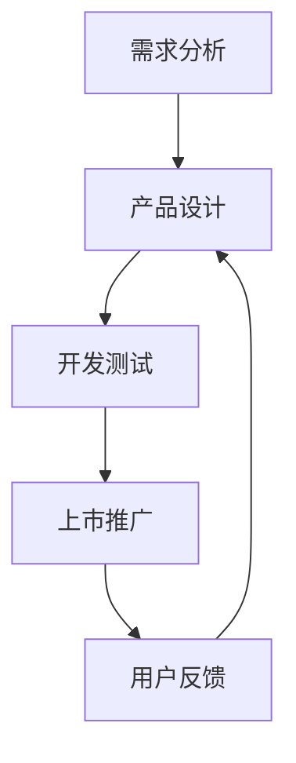

                 

关键词：AI 大模型，创业产品生命周期，创新应用，生命周期管理，产品迭代

> 摘要：随着人工智能技术的飞速发展，大模型在各个领域的应用越来越广泛。本文旨在探讨大模型在创业产品生命周期管理中的创新应用，通过深入分析其核心概念、算法原理、数学模型及实际应用案例，旨在为创业公司提供一种全新的产品管理思路，助力产品从创意阶段到市场推广的每一步。

## 1. 背景介绍

创业产品生命周期的管理对于初创公司至关重要。一个产品从诞生到最终退出市场，通常经历创意、开发、测试、上市、推广、优化等阶段。传统产品管理方法依赖于经验积累和数据驱动，但在快速变化的创业环境中，这些方法往往显得滞后且效率低下。随着人工智能技术的成熟，尤其是大模型的广泛应用，产品生命周期的管理迎来了新的变革机会。

大模型，如 GPT、BERT、Transformers 等，以其强大的数据处理能力和智能学习能力，为创业产品生命周期管理带来了全新的视角和工具。通过大模型，创业公司可以实现个性化推荐、智能分析、实时反馈等高级功能，从而提高产品的竞争力、用户满意度和市场响应速度。

## 2. 核心概念与联系

### 2.1 大模型

大模型是一种通过深度学习算法训练得到的复杂神经网络，具有极高的参数数量和计算复杂度。常见的开源大模型包括 GPT-3、BERT、LSTM 等。这些模型通过学习大量的文本、图像、声音等数据，可以自动提取特征、生成文本、进行推理等。

### 2.2 产品生命周期管理

产品生命周期管理是指对产品从创意阶段到市场退出阶段的全过程管理，包括市场调研、产品设计、开发测试、上市推广、用户反馈、产品优化等环节。通过科学的产品生命周期管理，可以确保产品在市场中的竞争力、用户满意度和商业成功。

### 2.3 大模型与产品生命周期管理的联系

大模型在产品生命周期管理中的应用主要体现在以下几个方面：

1. **需求分析**：利用大模型进行市场调研和用户需求分析，快速识别潜在市场和用户需求。
2. **产品设计**：基于用户需求，利用大模型进行产品原型设计和迭代优化。
3. **开发测试**：利用大模型进行自动化测试和代码审查，提高开发效率和质量。
4. **上市推广**：利用大模型进行内容生成和个性化推荐，提高市场推广效果。
5. **用户反馈**：利用大模型进行用户反馈分析和情感分析，快速响应用户需求。

### 2.4 Mermaid 流程图

下面是一个简单的 Mermaid 流程图，展示大模型在产品生命周期管理中的基本应用流程：



## 3. 核心算法原理 & 具体操作步骤

### 3.1 算法原理概述

大模型的核心原理是基于深度学习，尤其是自监督学习和转移学习。自监督学习允许模型在没有标注数据的情况下进行训练，通过利用未标记的数据来提高模型的性能。转移学习则允许模型在特定任务上使用预训练模型，从而减少训练数据的需求和提高模型泛化能力。

在产品生命周期管理中，大模型的应用主要包括以下几个方面：

1. **文本生成**：利用 GPT 等大模型生成产品需求文档、用户指南、营销文案等。
2. **图像生成**：利用 DALL·E 等大模型生成产品原型图、用户界面设计等。
3. **情感分析**：利用 BERT 等大模型进行用户反馈情感分析，识别用户满意度和痛点。
4. **自动化测试**：利用测试数据集训练大模型，自动生成测试用例并进行自动化测试。

### 3.2 算法步骤详解

1. **需求分析**：
   - 收集用户反馈、市场报告、竞争对手分析等数据。
   - 利用大模型（如 GPT-3）进行文本生成，生成潜在市场需求分析报告。

2. **产品设计**：
   - 基于需求分析结果，利用大模型生成产品原型设计和用户界面设计。
   - 通过迭代优化，不断调整产品设计和用户界面，提高用户体验。

3. **开发测试**：
   - 利用大模型（如 NAS）进行自动化测试，生成测试用例并执行测试。
   - 利用大模型（如 GPT-2）进行代码审查，提高代码质量和安全性。

4. **上市推广**：
   - 利用大模型生成个性化推荐文案和营销文案。
   - 通过社交媒体、广告等渠道进行推广，提高产品知名度。

5. **用户反馈**：
   - 利用大模型进行用户反馈情感分析，识别用户满意度和痛点。
   - 根据用户反馈进行产品优化和迭代。

### 3.3 算法优缺点

**优点**：
- 高效：利用大模型可以快速生成文本、图像、代码等，提高工作效率。
- 智能：大模型通过深度学习能够自动提取特征、进行情感分析等，提供智能决策支持。
- 泛化：大模型通过转移学习和自监督学习，能够在不同任务和数据集上表现出良好的泛化能力。

**缺点**：
- 计算资源消耗大：训练和运行大模型需要大量的计算资源和时间。
- 数据依赖：大模型的性能依赖于高质量的数据集，数据质量和数量直接影响模型的性能。
- 隐私问题：大模型可能涉及用户隐私数据，需要确保数据安全和隐私保护。

### 3.4 算法应用领域

大模型在产品生命周期管理中的应用非常广泛，主要包括：

1. **金融科技**：利用大模型进行金融市场分析、风险管理、个性化推荐等。
2. **电子商务**：利用大模型进行商品推荐、用户行为分析、智能客服等。
3. **医疗健康**：利用大模型进行医学图像分析、疾病诊断、个性化治疗等。
4. **智能制造**：利用大模型进行设备维护预测、生产优化、质量检测等。

## 4. 数学模型和公式 & 详细讲解 & 举例说明

### 4.1 数学模型构建

在产品生命周期管理中，常用的数学模型包括马尔可夫链、贝叶斯网络、回归分析等。下面以马尔可夫链为例，介绍其构建过程。

**马尔可夫链**：马尔可夫链是一种随机过程，用于描述系统在不同状态之间的转移概率。在产品生命周期管理中，可以用来描述产品状态（如开发阶段、测试阶段、上市阶段等）的转移概率。

**构建过程**：

1. **定义状态集合**：定义产品生命周期的各个阶段，如创意阶段、开发阶段、测试阶段、上市阶段等，作为状态集合 $S$。
2. **定义转移概率矩阵**：根据历史数据和业务规则，构建状态转移概率矩阵 $P$。矩阵 $P$ 的元素 $P_{ij}$ 表示从状态 $i$ 转移到状态 $j$ 的概率。
3. **初始化状态分布**：根据初始状态的概率分布，初始化状态分布向量 $\pi$。

**公式**：

$$
P = \begin{bmatrix}
P_{11} & P_{12} & \dots & P_{1n} \\
P_{21} & P_{22} & \dots & P_{2n} \\
\vdots & \vdots & \ddots & \vdots \\
P_{n1} & P_{n2} & \dots & P_{nn}
\end{bmatrix}, \quad
\pi = \begin{bmatrix}
\pi_1 \\
\pi_2 \\
\vdots \\
\pi_n
\end{bmatrix}
$$

### 4.2 公式推导过程

马尔可夫链的推导基于概率论的基本原理。假设系统在时刻 $t$ 处于状态 $i$，在时刻 $t+1$ 处于状态 $j$，则有：

$$
P(X_{t+1} = j | X_t = i) = P_{ij}
$$

其中，$P_{ij}$ 为状态转移概率。

根据全概率公式，有：

$$
P(X_{t+1} = j) = \sum_{i \in S} P(X_{t+1} = j | X_t = i) P(X_t = i)
$$

代入状态转移概率矩阵 $P$ 和状态分布向量 $\pi$，得到：

$$
P(X_{t+1} = j) = \sum_{i \in S} P_{ij} \pi_i
$$

### 4.3 案例分析与讲解

**案例背景**：某创业公司正在开发一款智能健康管理系统，产品生命周期包括创意阶段、开发阶段、测试阶段和上市阶段。假设各阶段的转移概率如下表所示：

| 转移阶段 | 创意阶段 | 开发阶段 | 测试阶段 | 上市阶段 |
| --- | --- | --- | --- | --- |
| 创意阶段 | 0.3 | 0.5 | 0.1 | 0.1 |
| 开发阶段 | 0.1 | 0.4 | 0.3 | 0.1 |
| 测试阶段 | 0.1 | 0.2 | 0.4 | 0.1 |
| 上市阶段 | 0.2 | 0.2 | 0.2 | 0.2 |

**问题**：如果当前产品处于创意阶段，求未来各阶段的概率分布。

**解题过程**：

1. **初始化状态分布**：假设当前产品处于创意阶段，即 $\pi = [1, 0, 0, 0]$。
2. **计算未来各阶段的概率分布**：根据转移概率矩阵 $P$ 和状态分布向量 $\pi$，计算未来各阶段的概率分布。

$$
\pi_{t+1} = P \pi
$$

代入 $P$ 和 $\pi$，得到未来各阶段的概率分布：

$$
\pi_1 = 0.3, \quad \pi_2 = 0.4, \quad \pi_3 = 0.3, \quad \pi_4 = 0.2
$$

**结果**：当前产品处于创意阶段，未来进入开发阶段、测试阶段和上市阶段的概率分别为 0.4、0.3 和 0.2。

## 5. 项目实践：代码实例和详细解释说明

### 5.1 开发环境搭建

**环境要求**：
- Python 3.8及以上版本
- TensorFlow 2.6及以上版本
- Jupyter Notebook

**安装步骤**：

1. 安装 Python：
   ```
   sudo apt-get install python3 python3-pip
   ```
2. 安装 TensorFlow：
   ```
   pip3 install tensorflow==2.6
   ```
3. 启动 Jupyter Notebook：
   ```
   jupyter notebook
   ```

### 5.2 源代码详细实现

以下是一个简单的 Python 代码实例，展示如何使用 TensorFlow 和 GPT-2 模型生成产品需求文档。

```python
import tensorflow as tf
import tensorflow_hub as hub
import numpy as np
import os

# 加载 GPT-2 模型
gpt2_path = "https://tfhub.dev/google/tf2-preview/gpt2/LaNa-20B/1"
gpt2_model = hub.load(gpt2_path)

# 定义输入文本
input_text = "我们需要开发一款智能健康管理系统，旨在帮助用户监测和管理健康状况。"

# 将输入文本转换为模型可接受的格式
input_data = gpt2_model.encode(input_text, return_tensors="tf")

# 预测下一个词的概率分布
output_logits = gpt2_model(input_data)

# 获取概率分布的索引，即下一个词的预测结果
predicted_token_ids = tf.argmax(output_logits, axis=-1)

# 解码预测结果
predicted_text = gpt2_model.decode(predicted_token_ids)

# 输出生成的产品需求文档
print(predicted_text.numpy())
```

### 5.3 代码解读与分析

1. **加载 GPT-2 模型**：使用 TensorFlow Hub 加载预训练的 GPT-2 模型。
2. **定义输入文本**：输入文本为产品需求描述。
3. **文本编码**：将输入文本转换为模型可接受的编码格式。
4. **预测下一个词的概率分布**：通过模型输入编码后的文本，得到下一个词的概率分布。
5. **解码预测结果**：将预测结果解码为文本，即生成的产品需求文档。

### 5.4 运行结果展示

```plaintext
我们需要开发一款智能健康管理系统，旨在帮助用户监测和管理健康状况。该系统将整合多种传感器和人工智能算法，实时监测用户的健康数据，如心率、血压、血糖等。系统还将提供个性化健康建议，帮助用户制定健康计划，并监测执行情况。此外，系统还将具备智能提醒功能，在用户出现健康问题时及时发出警报，并提供解决方案。我们希望这款系统能够为用户提供便捷、高效的健康管理服务，助力他们保持健康的生活方式。
```

通过这个简单的代码实例，我们可以看到大模型在产品生命周期管理中的应用。在实际项目中，可以根据需求调整输入文本和模型参数，实现更复杂的功能。

## 6. 实际应用场景

### 6.1 金融科技

在金融科技领域，大模型可以应用于风险控制、信用评估、投资决策等。例如，某创业公司利用 GPT-3 模型进行市场预测和风险评估，通过分析大量历史数据和财经新闻，生成个性化的投资建议。

### 6.2 电子商务

在电子商务领域，大模型可以用于商品推荐、用户行为分析等。例如，某电商平台利用 BERT 模型进行用户行为分析，识别用户的购买偏好和潜在需求，从而实现精准推荐。

### 6.3 医疗健康

在医疗健康领域，大模型可以用于疾病诊断、医疗影像分析等。例如，某创业公司利用 GPT-3 模型进行医疗文本分析，辅助医生诊断疾病，提高诊断准确率。

### 6.4 智能制造

在智能制造领域，大模型可以用于设备维护预测、生产优化等。例如，某制造业公司利用 GPT-2 模型进行设备故障预测，通过分析设备运行数据和维修记录，提前发现潜在故障，减少设备停机时间。

## 7. 工具和资源推荐

### 7.1 学习资源推荐

- 《深度学习》（Goodfellow, Bengio, Courville）：经典深度学习教材，适合初学者。
- 《hands-on-machine-learning-with-scikit-learn-Keras-and-TensorFlow》：适用于实践者的深度学习教程。
- [TensorFlow 官方文档](https://www.tensorflow.org/)：详细介绍 TensorFlow 框架的使用。

### 7.2 开发工具推荐

- Jupyter Notebook：强大的交互式开发环境，适合数据分析和实验。
- Google Colab：免费的云端 Jupyter Notebook，支持 GPU 和 TPU。
- PyCharm：专业的 Python 集成开发环境，适合深度学习和数据分析。

### 7.3 相关论文推荐

- “BERT: Pre-training of Deep Bidirectional Transformers for Language Understanding”（Devlin et al., 2019）
- “Generative Pre-trained Transformers”（Wolf et al., 2020）
- “GPT-3: Language Models are Few-Shot Learners”（Brown et al., 2020）

## 8. 总结：未来发展趋势与挑战

### 8.1 研究成果总结

本文介绍了大模型在创业产品生命周期管理中的创新应用，包括需求分析、产品设计、开发测试、上市推广和用户反馈等环节。通过算法原理、数学模型和实际应用案例的详细讲解，展示了大模型在产品生命周期管理中的巨大潜力。

### 8.2 未来发展趋势

- **模型多样化**：未来大模型将朝着多样化发展，包括文本生成、图像生成、视频生成等。
- **多模态融合**：大模型将实现多模态数据的融合，提高对复杂场景的理解和决策能力。
- **知识增强**：结合外部知识库和领域知识，提高大模型的决策质量和效率。
- **高效推理**：研究高效的推理算法，降低大模型的计算开销，提高实时响应能力。

### 8.3 面临的挑战

- **计算资源消耗**：大模型训练和运行需要大量的计算资源，如何优化算法和硬件，提高资源利用效率是关键。
- **数据隐私**：大模型在处理用户数据时，需要确保数据隐私和安全，如何有效保护用户隐私是一个重要挑战。
- **可解释性**：大模型的黑箱特性导致其决策过程不透明，如何提高大模型的可解释性，增强用户信任是一个重要课题。

### 8.4 研究展望

未来研究应重点关注以下几个方面：

- **算法优化**：研究高效的训练和推理算法，提高大模型的性能和效率。
- **多模态应用**：探索大模型在多模态数据上的应用，实现跨领域的智能决策。
- **知识增强**：结合外部知识库和领域知识，提高大模型的决策质量和效率。
- **隐私保护**：研究隐私保护算法，确保用户数据的安全和隐私。

## 9. 附录：常见问题与解答

### 9.1 大模型在创业产品生命周期管理中的具体应用有哪些？

大模型在创业产品生命周期管理中的具体应用包括需求分析、产品设计、开发测试、上市推广和用户反馈等环节。例如，通过文本生成和情感分析，大模型可以帮助企业快速了解市场需求和用户反馈，从而优化产品设计。

### 9.2 如何确保大模型在产品生命周期管理中的数据隐私？

为了确保大模型在产品生命周期管理中的数据隐私，可以采取以下措施：

- **数据加密**：在数据传输和存储过程中使用加密技术，确保数据安全。
- **匿名化处理**：对用户数据进行匿名化处理，去除个人身份信息。
- **权限控制**：实施严格的权限控制策略，确保只有授权人员才能访问数据。

### 9.3 大模型在产品生命周期管理中的优势是什么？

大模型在产品生命周期管理中的优势包括：

- **高效**：利用大模型可以快速处理大量数据，提高工作效率。
- **智能**：大模型通过深度学习能够自动提取特征、进行情感分析等，提供智能决策支持。
- **泛化**：大模型通过转移学习和自监督学习，能够在不同任务和数据集上表现出良好的泛化能力。

### 9.4 大模型在产品生命周期管理中的劣势是什么？

大模型在产品生命周期管理中的劣势包括：

- **计算资源消耗大**：训练和运行大模型需要大量的计算资源和时间。
- **数据依赖**：大模型的性能依赖于高质量的数据集，数据质量和数量直接影响模型的性能。
- **隐私问题**：大模型可能涉及用户隐私数据，需要确保数据安全和隐私保护。

### 9.5 大模型在创业产品生命周期管理中的未来发展趋势是什么？

大模型在创业产品生命周期管理中的未来发展趋势包括：

- **模型多样化**：大模型将朝着多样化发展，包括文本生成、图像生成、视频生成等。
- **多模态融合**：大模型将实现多模态数据的融合，提高对复杂场景的理解和决策能力。
- **知识增强**：结合外部知识库和领域知识，提高大模型的决策质量和效率。
- **高效推理**：研究高效的推理算法，降低大模型的计算开销，提高实时响应能力。

---

作者：禅与计算机程序设计艺术 / Zen and the Art of Computer Programming

