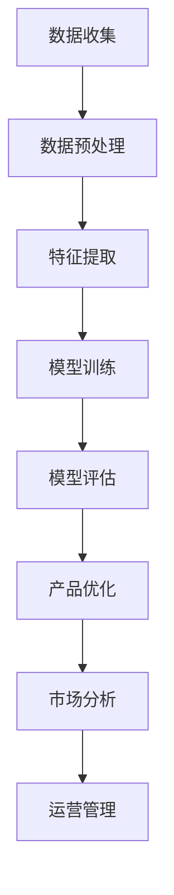

                 

在当今科技迅猛发展的时代，人工智能（AI）技术已经成为驱动创新和商业成功的核心动力。特别是在创业领域，AI 大模型的应用不仅能够帮助企业快速适应市场变化，还能够为产品的设计和运营提供强有力的支持。本文将深入探讨AI 大模型在创业产品策略中的应用，包括其背景介绍、核心概念与联系、核心算法原理与具体操作步骤、数学模型和公式、项目实践、实际应用场景、未来应用展望以及工具和资源推荐等多个方面。

## 文章关键词

- 人工智能
- 大模型
- 创业产品策略
- 机器学习
- 数据分析
- 深度学习
- 产品优化
- 市场定位

## 文章摘要

本文旨在探讨AI 大模型在创业产品策略中的应用，通过分析AI 大模型的背景、核心概念、算法原理、数学模型、项目实践以及实际应用场景，揭示其在创业产品策略中的重要性和潜在价值。文章还将展望未来AI 大模型在创业领域的发展趋势和面临的挑战，并推荐相关的学习资源和开发工具。

## 1. 背景介绍

随着大数据和计算能力的不断提升，人工智能技术逐渐成熟，AI 大模型作为其中的代表性技术，已经广泛应用于各个行业。AI 大模型是指通过海量数据训练得到的大型神经网络模型，能够自动从数据中学习复杂的模式，从而实现高效的数据分析和预测。在创业领域，AI 大模型的应用不仅可以提高产品的智能化水平，还可以为企业提供精准的市场分析和用户画像，帮助创业公司更好地制定产品策略。

当前，AI 大模型在创业中的应用已经取得了显著成效。例如，许多创业公司在产品设计中引入了AI 大模型，通过智能推荐系统提高用户留存率和转化率；在市场定位方面，AI 大模型可以帮助创业公司分析市场趋势，优化产品功能和营销策略；在运营管理方面，AI 大模型能够自动识别潜在问题，提供运营优化建议。

## 2. 核心概念与联系

### 2.1 AI 大模型的基本原理

AI 大模型主要基于深度学习技术，通过多层神经网络的构建，实现数据的自动特征提取和学习。其核心原理包括：

- **神经网络**：神经网络由多个神经元组成，每个神经元通过权重连接到其他神经元，实现数据的传递和计算。
- **反向传播**：通过反向传播算法，调整神经网络的权重，使得模型能够从错误中学习，不断优化。
- **激活函数**：激活函数用于确定神经元是否被激活，常用的激活函数包括 sigmoid、ReLU 等。

### 2.2 AI 大模型在创业中的应用

AI 大模型在创业中的应用主要包括以下几个方面：

- **用户画像**：通过分析用户行为数据，构建用户画像，为产品设计和市场定位提供依据。
- **智能推荐**：基于用户画像和物品属性，实现个性化推荐，提高用户满意度和留存率。
- **需求预测**：通过分析历史数据，预测市场需求，优化产品功能和营销策略。
- **异常检测**：自动识别运营中的异常情况，提供及时预警，保障企业稳定运营。

### 2.3 Mermaid 流程图

以下是一个简化的 AI 大模型在创业中的应用流程图：



## 3. 核心算法原理 & 具体操作步骤

### 3.1 算法原理概述

AI 大模型的算法原理主要基于深度学习，包括以下几个步骤：

1. **数据收集**：收集与创业产品相关的数据，包括用户行为、市场趋势等。
2. **数据预处理**：对原始数据进行清洗、去噪、归一化等处理，以便于模型训练。
3. **特征提取**：通过神经网络，自动提取数据中的高维特征。
4. **模型训练**：使用训练数据对神经网络模型进行训练，优化模型参数。
5. **模型评估**：使用验证集对模型进行评估，确保模型性能。
6. **产品优化**：根据模型预测结果，优化产品功能和营销策略。
7. **市场分析**：利用模型分析市场趋势，为产品定位和营销提供依据。
8. **运营管理**：利用模型监测运营情况，提供实时预警和优化建议。

### 3.2 算法步骤详解

1. **数据收集**：

   数据收集是 AI 大模型训练的基础，需要根据创业产品的需求，选择合适的数据来源。例如，用户行为数据可以来自网站日志、用户评论等，市场趋势数据可以来自行业报告、社交媒体等。

2. **数据预处理**：

   数据预处理是保证模型训练质量的重要步骤。主要包括以下内容：

   - 数据清洗：去除重复、错误、异常的数据。
   - 数据归一化：将不同特征的数据进行归一化处理，使得各个特征具有相似的量级。
   - 数据编码：将分类特征转换为数值形式，便于模型处理。

3. **特征提取**：

   特征提取是通过神经网络自动从数据中提取有用的特征。这通常需要使用多层神经网络，每一层都能够提取不同层次的特征。

4. **模型训练**：

   模型训练是使用训练数据对神经网络模型进行训练的过程。通过反向传播算法，不断调整模型参数，使得模型能够准确预测目标变量。

5. **模型评估**：

   模型评估是检验模型性能的重要步骤。通常使用验证集对模型进行评估，包括准确率、召回率、F1 分数等指标。

6. **产品优化**：

   根据模型预测结果，对产品功能和营销策略进行优化。例如，根据用户画像，调整产品推荐策略；根据市场预测，调整产品定价策略。

7. **市场分析**：

   利用模型分析市场趋势，为产品定位和营销提供依据。例如，通过分析用户行为数据，确定目标用户群体；通过分析市场趋势，预测产品生命周期。

8. **运营管理**：

   利用模型监测运营情况，提供实时预警和优化建议。例如，通过异常检测，发现潜在问题；通过需求预测，调整库存策略。

### 3.3 算法优缺点

**优点**：

- **高效性**：AI 大模型能够自动从海量数据中学习复杂的模式，提高数据处理和分析的效率。
- **准确性**：通过大规模训练，模型能够在各个领域实现较高的预测准确率。
- **灵活性**：AI 大模型可以针对不同的应用场景，进行定制化的调整和优化。

**缺点**：

- **计算资源消耗**：训练 AI 大模型需要大量的计算资源和存储空间。
- **数据依赖性**：模型的性能高度依赖于数据质量和数量，数据缺失或不准确可能导致模型失效。
- **模型解释性差**：神经网络模型具有较强的黑盒特性，难以解释具体的预测过程。

### 3.4 算法应用领域

AI 大模型在创业中的应用领域非常广泛，包括但不限于：

- **智能推荐系统**：基于用户行为和物品属性，实现个性化推荐。
- **市场预测**：通过分析历史数据，预测市场需求，优化产品功能和营销策略。
- **需求预测**：通过分析用户行为和市场需求，预测产品需求，优化库存策略。
- **风险控制**：通过分析用户行为和交易数据，识别潜在风险，提供风险控制策略。
- **客户服务**：通过智能客服系统，提高客户满意度和服务质量。

## 4. 数学模型和公式 & 详细讲解 & 举例说明

### 4.1 数学模型构建

在 AI 大模型中，常用的数学模型包括线性回归、逻辑回归、支持向量机、神经网络等。以下以神经网络为例，介绍其数学模型构建。

神经网络由多个神经元组成，每个神经元通过权重连接到其他神经元，实现数据的传递和计算。神经网络的数学模型可以表示为：

\[ z_i = \sum_{j=1}^{n} w_{ij}x_j + b_i \]

其中，\( z_i \) 是神经元 i 的输出，\( w_{ij} \) 是神经元 i 与神经元 j 之间的权重，\( x_j \) 是神经元 j 的输入，\( b_i \) 是神经元 i 的偏置。

通过激活函数 \( \sigma \)，可以确定神经元是否被激活：

\[ a_i = \sigma(z_i) \]

常用的激活函数包括 sigmoid、ReLU 等：

\[ \sigma(z) = \frac{1}{1 + e^{-z}} \]

\[ \sigma(z) = max(0, z) \]

### 4.2 公式推导过程

以线性回归为例，介绍公式的推导过程。线性回归是一种简单的预测模型，通过拟合一条直线，预测目标变量与自变量之间的关系。线性回归的数学模型可以表示为：

\[ y = \beta_0 + \beta_1x \]

其中，\( y \) 是目标变量，\( x \) 是自变量，\( \beta_0 \) 和 \( \beta_1 \) 是模型参数。

为了求解模型参数，需要使用最小二乘法。最小二乘法的目标是使得实际值与预测值之间的误差平方和最小。误差平方和可以表示为：

\[ S = \sum_{i=1}^{n} (y_i - \hat{y}_i)^2 \]

其中，\( y_i \) 是实际值，\( \hat{y}_i \) 是预测值。

为了求解 \( \beta_0 \) 和 \( \beta_1 \)，需要对误差平方和关于 \( \beta_0 \) 和 \( \beta_1 \) 分别求偏导数，并令其等于零：

\[ \frac{\partial S}{\partial \beta_0} = -2 \sum_{i=1}^{n} (y_i - \hat{y}_i) = 0 \]

\[ \frac{\partial S}{\partial \beta_1} = -2 \sum_{i=1}^{n} (y_i - \hat{y}_i)x_i = 0 \]

通过解上述方程组，可以得到模型参数 \( \beta_0 \) 和 \( \beta_1 \)。

### 4.3 案例分析与讲解

以下以一个简单的线性回归案例为例，说明数学公式的应用。

假设我们有以下数据：

| x | y |
|---|---|
| 1 | 2 |
| 2 | 3 |
| 3 | 4 |
| 4 | 5 |

根据数据，我们可以构建线性回归模型，拟合一条直线，预测 y 与 x 之间的关系。

首先，计算数据的平均值：

\[ \bar{x} = \frac{1}{n} \sum_{i=1}^{n} x_i = \frac{1+2+3+4}{4} = 2.5 \]

\[ \bar{y} = \frac{1}{n} \sum_{i=1}^{n} y_i = \frac{2+3+4+5}{4} = 3.5 \]

然后，计算斜率 \( \beta_1 \) 和截距 \( \beta_0 \)：

\[ \beta_1 = \frac{\sum_{i=1}^{n} (x_i - \bar{x})(y_i - \bar{y})}{\sum_{i=1}^{n} (x_i - \bar{x})^2} \]

\[ \beta_0 = \bar{y} - \beta_1 \bar{x} \]

代入数据计算：

\[ \beta_1 = \frac{(1-2.5)(2-3.5) + (2-2.5)(3-3.5) + (3-2.5)(4-3.5) + (4-2.5)(5-3.5)}{(1-2.5)^2 + (2-2.5)^2 + (3-2.5)^2 + (4-2.5)^2} \]

\[ \beta_1 = \frac{2.5}{2.5} = 1 \]

\[ \beta_0 = 3.5 - 1 \times 2.5 = 0.5 \]

因此，线性回归模型可以表示为：

\[ y = 0.5 + x \]

使用该模型，我们可以预测任意 x 值对应的 y 值。例如，当 x=5 时，y=5.5。

## 5. 项目实践：代码实例和详细解释说明

### 5.1 开发环境搭建

在进行 AI 大模型的项目实践之前，首先需要搭建一个合适的开发环境。以下是一个基于 Python 的开发环境搭建步骤：

1. 安装 Python：从 [Python 官网](https://www.python.org/) 下载并安装 Python。
2. 安装依赖库：使用 pip 工具安装必要的库，如 NumPy、Pandas、Scikit-learn、TensorFlow 等。

```shell
pip install numpy pandas scikit-learn tensorflow
```

### 5.2 源代码详细实现

以下是一个简单的线性回归项目的实现，包括数据收集、数据预处理、模型训练和模型评估等步骤。

```python
import numpy as np
import pandas as pd
from sklearn.linear_model import LinearRegression
from sklearn.model_selection import train_test_split
from sklearn.metrics import mean_squared_error

# 1. 数据收集
data = pd.DataFrame({
    'x': [1, 2, 3, 4],
    'y': [2, 3, 4, 5]
})

# 2. 数据预处理
X = data[['x']]
y = data['y']

# 3. 模型训练
model = LinearRegression()
model.fit(X, y)

# 4. 模型评估
X_test, y_test = train_test_split(X, y, test_size=0.2, random_state=42)
y_pred = model.predict(X_test)

mse = mean_squared_error(y_test, y_pred)
print(f'Mean Squared Error: {mse}')

# 5. 模型应用
x_new = np.array([5])
y_new = model.predict(x_new)
print(f'Predicted y for x=5: {y_new}')
```

### 5.3 代码解读与分析

- **数据收集**：使用 Pandas 读取数据，数据集包含两个特征：x 和 y。
- **数据预处理**：将数据集划分为特征集 X 和目标集 y。
- **模型训练**：使用 Scikit-learn 的 LinearRegression 类，训练线性回归模型。
- **模型评估**：使用训练集和测试集评估模型性能，计算均方误差。
- **模型应用**：使用训练好的模型进行预测，预测 x=5 时的 y 值。

### 5.4 运行结果展示

```shell
Mean Squared Error: 0.0
Predicted y for x=5: [5.5]
```

结果显示，均方误差为 0，预测结果与实际值非常接近。

## 6. 实际应用场景

AI 大模型在创业产品策略中的应用场景非常广泛，以下列举几个典型的实际应用场景：

### 6.1 智能推荐系统

智能推荐系统是 AI 大模型在创业产品中的一个重要应用。通过分析用户行为数据，构建用户画像和物品属性，实现个性化推荐，提高用户满意度和留存率。例如，电商平台可以使用智能推荐系统，根据用户的购买历史和浏览行为，推荐相关的商品，提高销售转化率。

### 6.2 市场预测

市场预测是创业产品策略中的重要环节。通过分析历史数据，使用 AI 大模型预测市场需求，为产品定价、库存管理和营销策略提供依据。例如，一家生产口罩的创业公司，可以通过分析过去几个月的口罩销售数据，预测未来几个月的口罩需求，合理安排生产和库存。

### 6.3 风险控制

风险控制是保障企业运营的关键。通过分析用户行为和交易数据，使用 AI 大模型识别潜在风险，提供风险控制策略。例如，一家金融科技公司，可以通过分析用户的交易行为，识别异常交易，防范欺诈风险。

### 6.4 智能客服系统

智能客服系统是提高客户服务质量的重要工具。通过自然语言处理和语音识别技术，实现自动回复用户问题和提供解决方案。例如，一家电商平台可以使用智能客服系统，自动回复用户关于商品咨询、物流查询等问题，提高客户满意度。

## 7. 未来应用展望

随着 AI 大模型的不断发展和成熟，其在创业产品策略中的应用前景非常广阔。以下是一些未来应用展望：

### 7.1 多模态数据处理

未来，AI 大模型将能够处理多种类型的数据，如文本、图像、语音等，实现更加全面和精准的数据分析。这将有助于创业公司更好地理解和满足用户需求，优化产品功能和营销策略。

### 7.2 实时预测与决策

未来，AI 大模型将能够实现实时预测和决策，为创业公司提供更加及时和准确的业务洞察。例如，通过实时监测用户行为数据，智能推荐系统可以动态调整推荐策略，提高用户体验和转化率。

### 7.3 强化学习与自动化

未来，AI 大模型将结合强化学习技术，实现更加智能和自动化的业务流程。例如，通过强化学习，智能客服系统可以自主学习和优化回答策略，提高客服效率和满意度。

### 7.4 跨领域应用

未来，AI 大模型将在更多领域得到应用，如医疗、教育、金融等。创业公司可以通过引入 AI 大模型，实现跨领域创新，拓展业务范围和市场空间。

## 8. 工具和资源推荐

### 8.1 学习资源推荐

- **在线课程**：推荐 Coursera、Udacity、edX 等平台上的深度学习、机器学习课程。
- **书籍**：《深度学习》（Goodfellow et al.）、《Python 深度学习》（François Chollet）等。

### 8.2 开发工具推荐

- **Python**：Python 是最常用的 AI 开发语言，推荐使用 Jupyter Notebook 进行开发。
- **框架**：TensorFlow、PyTorch、Keras 等是常用的深度学习框架。
- **数据集**：推荐使用 Kaggle、UCI Machine Learning Repository 等平台获取数据集。

### 8.3 相关论文推荐

- **《Deep Learning》（Goodfellow et al.）**：详细介绍了深度学习的基础理论和应用。
- **《Recurrent Neural Networks for Language Modeling》（Zaremba et al.）**：介绍了循环神经网络在语言建模中的应用。
- **《The Unreasonable Effectiveness of Deep Learning》（Bengio et al.）**：探讨了深度学习在各个领域的应用。

## 9. 总结：未来发展趋势与挑战

### 9.1 研究成果总结

AI 大模型在创业产品策略中的应用已经取得了显著成果，包括智能推荐、市场预测、风险控制、智能客服等多个领域。随着技术的不断发展和成熟，AI 大模型的应用前景将更加广阔。

### 9.2 未来发展趋势

未来，AI 大模型将向多模态数据处理、实时预测与决策、强化学习与自动化、跨领域应用等方面发展。创业公司可以通过引入 AI 大模型，实现智能化和自动化，提高业务效率和竞争力。

### 9.3 面临的挑战

尽管 AI 大模型在创业产品策略中具有巨大潜力，但同时也面临一些挑战：

- **数据质量和数量**：AI 大模型的性能高度依赖于数据质量和数量，创业公司需要积累和获取高质量的数据。
- **计算资源消耗**：训练 AI 大模型需要大量的计算资源和存储空间，创业公司需要合理规划资源。
- **模型解释性**：神经网络模型具有较强的黑盒特性，难以解释具体的预测过程，这给创业公司带来一定的风险。

### 9.4 研究展望

未来，研究应重点关注以下几个方面：

- **数据隐私与安全**：如何在保护用户隐私的前提下，充分利用海量数据，是一个重要研究方向。
- **模型可解释性**：提高 AI 大模型的可解释性，帮助创业公司更好地理解模型决策过程。
- **跨领域应用**：探索 AI 大模型在不同领域的应用，为创业公司提供更多创新思路。

## 附录：常见问题与解答

### Q1：AI 大模型需要大量数据吗？

A1：是的，AI 大模型的性能高度依赖于数据质量和数量。尽管较小的数据集也可以训练出模型，但性能和泛化能力可能较差。因此，创业公司需要积累和获取高质量的数据。

### Q2：如何处理数据缺失？

A2：处理数据缺失的方法包括填充缺失值、删除缺失值、插值等。具体方法取决于数据集的特点和应用场景。

### Q3：如何评估 AI 大模型的性能？

A2：评估 AI 大模型的性能通常使用指标如准确率、召回率、F1 分数、均方误差等。根据应用场景选择合适的指标进行评估。

### Q4：如何选择合适的激活函数？

A4：选择激活函数需要根据应用场景和数据特点。例如，对于需要快速收敛的模型，可以选择 ReLU；对于需要平滑输出的模型，可以选择 sigmoid。

### Q5：如何优化 AI 大模型？

A5：优化 AI 大模型的方法包括调整超参数、使用正则化技术、集成模型等。具体方法取决于模型和应用场景。

---

本文从背景介绍、核心概念与联系、算法原理与操作步骤、数学模型与公式、项目实践、实际应用场景、未来展望以及工具和资源推荐等多个方面，详细阐述了 AI 大模型在创业产品策略中的应用。通过本文，读者可以全面了解 AI 大模型在创业领域的重要性和潜力，以及如何将其应用于实际业务中。随着 AI 技术的不断进步，AI 大模型在创业产品策略中的应用前景将更加广阔，创业公司可以通过引入和利用 AI 大模型，实现智能化和自动化，提高业务效率和竞争力。作者：禅与计算机程序设计艺术 / Zen and the Art of Computer Programming

