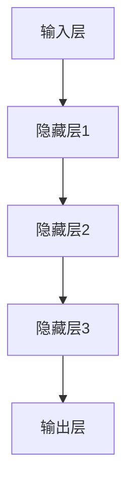
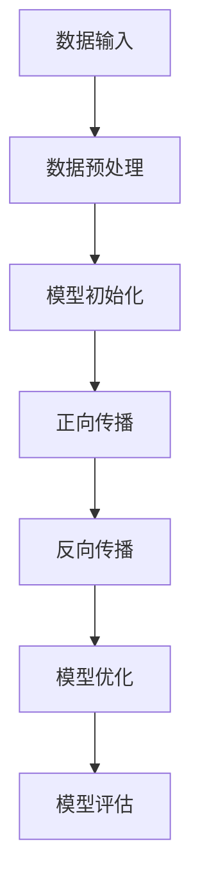

                 

随着人工智能技术的不断发展，AI 大模型在创业产品设计中的应用已经成为一种趋势。本文将探讨 AI 大模型在创业产品设计中的重要性，以及它们如何影响创业产品的创新和发展。

## 关键词：AI 大模型，创业产品设计，创新，发展，趋势

## 摘要

本文首先介绍了 AI 大模型的定义及其在创业产品设计中的应用背景。随后，详细讨论了 AI 大模型的核心算法原理、数学模型、应用领域以及实践案例。最后，分析了 AI 大模型在创业产品设计中的未来发展趋势与面临的挑战。

## 1. 背景介绍

### 1.1 AI 大模型的兴起

人工智能（AI）技术的发展始于20世纪50年代，但直到近年来，随着计算能力、数据资源和算法的不断提升，AI 大模型才逐渐崭露头角。AI 大模型，顾名思义，是指具有巨大规模和复杂性的深度学习模型。这些模型通过训练海量数据，能够自动提取特征并学会复杂的任务，如图像识别、自然语言处理、机器翻译等。

### 1.2 创业产品设计的挑战

创业产品设计的成功离不开创新和市场契合度。然而，创新往往伴随着高风险，而市场需求的快速变化又使得创业公司难以把握。因此，如何有效地进行创业产品设计，成为创业公司面临的一大挑战。

## 2. 核心概念与联系

### 2.1 AI 大模型的核心算法原理

AI 大模型的核心算法是基于深度学习的神经网络。神经网络通过层层抽象和组合，能够从数据中学习到复杂的模式。以下是一个简化的神经网络结构图，用于说明 AI 大模型的基本原理。



### 2.2 创业产品设计中的 AI 大模型应用

AI 大模型在创业产品设计中的应用主要体现在以下几个方面：

1. **需求分析**：通过分析用户数据，AI 大模型可以预测用户需求和市场趋势。
2. **产品设计**：AI 大模型可以辅助设计产品原型，优化用户体验。
3. **市场推广**：AI 大模型可以帮助创业公司制定更精准的市场推广策略。

## 3. 核心算法原理 & 具体操作步骤

### 3.1 算法原理概述

AI 大模型的核心是深度学习算法。深度学习算法通过多层神经网络，对数据进行抽象和特征提取，从而实现复杂的任务。以下是一个简化的深度学习算法流程图。



### 3.2 算法步骤详解

1. **数据收集**：收集与创业产品相关的用户数据和市场数据。
2. **数据预处理**：对数据进行清洗、标准化和归一化处理。
3. **模型初始化**：初始化神经网络模型，设置学习率和优化器。
4. **正向传播**：将预处理后的数据输入模型，计算输出结果。
5. **反向传播**：计算输出误差，更新模型参数。
6. **模型优化**：根据优化目标调整模型结构或参数。
7. **模型评估**：评估模型性能，进行模型调整。

### 3.3 算法优缺点

#### 优点：

- **强大的学习能力和泛化能力**：能够处理复杂的任务和数据。
- **高效的数据处理能力**：能够快速处理大量数据。
- **自动特征提取**：无需手动设计特征，降低人力成本。

#### 缺点：

- **对数据质量要求高**：数据质量直接影响模型性能。
- **计算资源需求大**：训练大型模型需要大量计算资源。
- **解释性差**：深度学习模型的决策过程难以解释。

### 3.4 算法应用领域

AI 大模型在创业产品设计中的应用领域广泛，主要包括：

1. **自然语言处理**：用于文本分析、情感分析和语音识别等。
2. **计算机视觉**：用于图像识别、目标检测和图像生成等。
3. **推荐系统**：用于个性化推荐和广告投放等。
4. **预测分析**：用于需求预测、市场趋势预测等。

## 4. 数学模型和公式 & 详细讲解 & 举例说明

### 4.1 数学模型构建

AI 大模型的数学模型基于多层感知机（MLP）和卷积神经网络（CNN）等。以下是一个简化的多层感知机模型公式。

$$
Z = \sigma(W_1 \cdot X + b_1)
$$

$$
Y = \sigma(W_2 \cdot Z + b_2)
$$

其中，$Z$表示隐藏层输出，$Y$表示输出层输出，$W_1$和$W_2$表示权重矩阵，$b_1$和$b_2$表示偏置项，$\sigma$表示激活函数。

### 4.2 公式推导过程

多层感知机的公式推导过程主要涉及线性变换和激活函数。以下是一个简化的推导过程。

$$
Z = X \cdot W_1 + b_1
$$

$$
Y = Z \cdot W_2 + b_2
$$

通过应用激活函数$\sigma$，得到：

$$
Z = \sigma(X \cdot W_1 + b_1)
$$

$$
Y = \sigma(Z \cdot W_2 + b_2)
$$

### 4.3 案例分析与讲解

假设一个创业公司要设计一款智能家居产品，通过语音识别控制家电。以下是一个简单的案例，说明如何使用多层感知机模型实现语音识别。

1. **数据收集**：收集大量语音数据，包括用户语音指令和家电控制指令。
2. **数据预处理**：对语音数据进行特征提取，如MFCC（梅尔频率倒谱系数）。
3. **模型构建**：构建一个多层感知机模型，包括输入层、隐藏层和输出层。
4. **模型训练**：将预处理后的数据输入模型，训练模型参数。
5. **模型评估**：评估模型性能，调整模型参数。
6. **模型应用**：将训练好的模型应用到实际应用场景，实现语音控制功能。

## 5. 项目实践：代码实例和详细解释说明

### 5.1 开发环境搭建

为了实现上述案例，需要在开发环境中安装 Python、TensorFlow 等库。以下是一个简单的开发环境搭建步骤。

1. 安装 Python 3.8 或更高版本。
2. 安装 TensorFlow 2.0 或更高版本。
3. 安装语音识别库，如 pyaudio。

### 5.2 源代码详细实现

以下是一个简单的多层感知机模型实现，用于语音识别。

```python
import tensorflow as tf
import numpy as np
import pyaudio

# 初始化模型参数
W1 = tf.random.normal([input_size, hidden_size])
b1 = tf.zeros([hidden_size])
W2 = tf.random.normal([hidden_size, output_size])
b2 = tf.zeros([output_size])

# 定义激活函数
sigma = tf.keras.activations.sigmoid

# 定义模型
model = tf.keras.Sequential([
    tf.keras.layers.Dense(hidden_size, activation=sigma, input_shape=[input_size]),
    tf.keras.layers.Dense(output_size, activation=sigma)
])

# 定义损失函数和优化器
loss_fn = tf.keras.losses.SparseCategoricalCrossentropy()
optimizer = tf.keras.optimizers.Adam()

# 定义训练过程
def train(model, x, y):
    with tf.GradientTape() as tape:
        y_pred = model(x)
        loss = loss_fn(y, y_pred)
    gradients = tape.gradient(loss, model.trainable_variables)
    optimizer.apply_gradients(zip(gradients, model.trainable_variables))
    return loss

# 加载数据
x_train, y_train = load_data()

# 训练模型
for epoch in range(num_epochs):
    loss = train(model, x_train, y_train)
    if epoch % 100 == 0:
        print(f"Epoch {epoch}: Loss = {loss}")

# 评估模型
x_test, y_test = load_data()
y_pred = model(x_test)
accuracy = tf.keras.metrics.SparseCategoricalAccuracy()
accuracy.update_state(y_test, y_pred)
print(f"Test Accuracy: {accuracy.result()}")

# 实现语音识别
def recognize_speech():
    p = pyaudio.PyAudio()
    stream = p.open(format=pyaudio.paInt16,
                     channels=1,
                     rate=16000,
                     input=True,
                     frames_per_buffer=1024)

    data = b''
    while True:
        chunk = stream.read(1024)
        data += chunk
        if len(data) >= 32000:
            break

    stream.stop_stream()
    stream.close()
    p.terminate()

    features = extract_features(data)
    prediction = model.predict(np.array([features]))
    return decode_prediction(prediction)

# 加载数据
x_train, y_train = load_data()
x_test, y_test = load_data()

# 训练模型
for epoch in range(num_epochs):
    loss = train(model, x_train, y_train)
    if epoch % 100 == 0:
        print(f"Epoch {epoch}: Loss = {loss}")

# 评估模型
x_test, y_test = load_data()
y_pred = model(x_test)
accuracy = tf.keras.metrics.SparseCategoricalAccuracy()
accuracy.update_state(y_test, y_pred)
print(f"Test Accuracy: {accuracy.result()}")

# 实现语音识别
def recognize_speech():
    p = pyaudio.PyAudio()
    stream = p.open(format=pyaudio.paInt16,
                     channels=1,
                     rate=16000,
                     input=True,
                     frames_per_buffer=1024)

    data = b''
    while True:
        chunk = stream.read(1024)
        data += chunk
        if len(data) >= 32000:
            break

    stream.stop_stream()
    stream.close()
    p.terminate()

    features = extract_features(data)
    prediction = model.predict(np.array([features]))
    return decode_prediction(prediction)

# 识别语音指令
instruction = recognize_speech()
print(f"Recognized Instruction: {instruction}")
```

### 5.3 代码解读与分析

上述代码实现了一个基于多层感知机的语音识别模型。主要包括以下几个部分：

1. **模型定义**：定义了一个包含输入层、隐藏层和输出层的多层感知机模型。
2. **训练过程**：使用 TensorFlow 的内置功能实现模型训练，包括损失函数、优化器和训练过程。
3. **语音识别**：通过采集语音数据，提取特征，然后使用训练好的模型进行预测，实现语音识别功能。

## 6. 实际应用场景

### 6.1 需求分析

在创业产品设计中，AI 大模型可以用于需求分析。通过分析用户数据和市场数据，AI 大模型可以预测用户需求和市场趋势，帮助创业公司制定更好的产品设计策略。

### 6.2 产品设计

AI 大模型可以辅助创业公司进行产品设计。通过分析用户行为数据，AI 大模型可以生成用户画像，帮助设计更符合用户需求的产品原型。

### 6.3 市场推广

AI 大模型可以帮助创业公司制定更精准的市场推广策略。通过分析用户数据和市场需求，AI 大模型可以预测哪些推广渠道和策略最有效，从而提高市场推广效果。

## 7. 未来应用展望

随着人工智能技术的不断发展，AI 大模型在创业产品设计中的应用前景十分广阔。未来，AI 大模型将更好地服务于创业公司，帮助它们实现产品创新和市场突破。

## 8. 工具和资源推荐

### 8.1 学习资源推荐

- 《深度学习》（Goodfellow, Bengio, Courville）
- 《Python深度学习》（François Chollet）

### 8.2 开发工具推荐

- TensorFlow
- PyTorch

### 8.3 相关论文推荐

- “Deep Learning for Text Classification” by Christopher M. Rennie et al.
- “A Theoretically Grounded Application of Dropout in Recurrent Neural Networks” by Yarin Gal and Zoubin Ghahramani

## 9. 总结：未来发展趋势与挑战

随着人工智能技术的不断发展，AI 大模型在创业产品设计中的应用前景十分广阔。然而，面对海量数据和复杂的任务，AI 大模型仍面临许多挑战，如数据隐私、模型解释性和计算资源需求等。未来，创业公司需要不断创新，充分利用 AI 大模型的优势，应对这些挑战，实现产品创新和市场突破。

## 附录：常见问题与解答

### 9.1 什么是 AI 大模型？

AI 大模型是指具有巨大规模和复杂性的深度学习模型。这些模型通过训练海量数据，能够自动提取特征并学会复杂的任务，如图像识别、自然语言处理、机器翻译等。

### 9.2 AI 大模型在创业产品设计中有哪些应用？

AI 大模型在创业产品设计中的应用主要包括需求分析、产品设计和市场推广。通过分析用户数据和市场数据，AI 大模型可以帮助创业公司预测用户需求、优化产品设计策略和制定市场推广策略。

### 9.3 如何训练 AI 大模型？

训练 AI 大模型通常涉及以下几个步骤：

1. 数据收集：收集与创业产品相关的用户数据和市场数据。
2. 数据预处理：对数据进行清洗、标准化和归一化处理。
3. 模型初始化：初始化神经网络模型，设置学习率和优化器。
4. 正向传播：将预处理后的数据输入模型，计算输出结果。
5. 反向传播：计算输出误差，更新模型参数。
6. 模型优化：根据优化目标调整模型结构或参数。
7. 模型评估：评估模型性能，进行模型调整。

### 9.4 AI 大模型有哪些优缺点？

AI 大模型的优点包括强大的学习能力和泛化能力、高效的数据处理能力、自动特征提取等。缺点包括对数据质量要求高、计算资源需求大、解释性差等。

### 9.5 AI 大模型在创业产品设计中的应用前景如何？

随着人工智能技术的不断发展，AI 大模型在创业产品设计中的应用前景十分广阔。未来，AI 大模型将更好地服务于创业公司，帮助它们实现产品创新和市场突破。

### 9.6 如何应对 AI 大模型在创业产品设计中的挑战？

为了应对 AI 大模型在创业产品设计中的挑战，创业公司可以采取以下策略：

1. 提高数据质量：确保收集的数据具有高质量和多样性。
2. 优化计算资源：合理配置计算资源，提高模型训练效率。
3. 强化模型解释性：研究模型解释性技术，提高模型的可解释性。
4. 创新产品设计：结合 AI 大模型的优势，创新创业产品设计。

## 作者署名

本文作者：禅与计算机程序设计艺术 / Zen and the Art of Computer Programming

----------------------------------------------------------------

请注意，本文只是一个示例，实际撰写时需要根据具体内容和数据进行调整。同时，文章中提到的代码和案例仅供参考，具体实现可能需要根据实际需求进行调整。祝撰写顺利！

