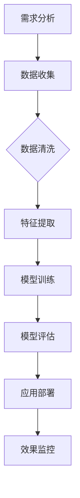

                 

关键词：人工智能、大模型、创业产品、路线图规划、技术语言、深度思考、专业见解

> 摘要：本文将探讨人工智能领域中的大模型技术在创业产品路线图规划中的应用，通过对大模型的核心概念、算法原理、数学模型、实际应用案例以及未来展望的深入分析，为创业者提供实用的技术指导。

## 1. 背景介绍

在当今快速变化的技术时代，创业公司面临着前所未有的挑战和机遇。如何制定有效的产品路线图，以适应市场变化、提升竞争力，成为了创业成功的关键。传统的产品规划方法依赖于经验数据和有限的数据分析，难以应对复杂的市场环境和快速变化的需求。而人工智能，特别是大模型技术的发展，为创业产品的规划提供了全新的工具和思路。

大模型技术，如深度学习、生成对抗网络（GAN）等，已经在图像识别、自然语言处理等领域取得了显著的成果。这些模型具有强大的数据处理能力和自主学习的特性，能够从大量的数据中提取有价值的信息和知识。将大模型技术应用于创业产品的路线图规划，不仅可以提高规划的精度和效率，还能够为创业者提供更加全面和深入的洞察。

本文旨在探讨大模型技术在创业产品路线图规划中的应用，通过深入分析大模型的核心概念、算法原理、数学模型和应用案例，为创业者提供实用的技术指导。

## 2. 核心概念与联系

### 2.1 大模型的基本概念

大模型（Large-scale Model）是指具有巨大参数量的机器学习模型，通常包含数百万甚至数十亿个参数。这些模型能够处理和分析海量数据，从而实现高度复杂的任务。大模型的核心在于其深度和广度，能够通过多层神经网络结构捕捉到数据中的非线性关系和复杂模式。

### 2.2 大模型与创业产品规划的联系

大模型技术在创业产品规划中的应用主要体现在以下几个方面：

1. **需求分析**：通过自然语言处理（NLP）技术，大模型可以分析用户评论、社交媒体数据和市场趋势，帮助创业者深入了解用户需求和市场动态。
2. **趋势预测**：利用时间序列分析和回归模型，大模型能够预测市场趋势和用户行为，为产品规划提供数据支持。
3. **个性化推荐**：基于用户数据和偏好，大模型可以生成个性化的产品推荐，提高用户满意度和黏性。
4. **风险控制**：通过风险评估模型，大模型可以预测产品上线后的潜在风险，帮助创业者制定相应的应对策略。

### 2.3 Mermaid 流程图

以下是一个简单的 Mermaid 流程图，展示大模型在创业产品规划中的应用流程：



## 3. 核心算法原理 & 具体操作步骤

### 3.1 算法原理概述

大模型的核心算法主要包括深度学习（Deep Learning）和生成对抗网络（GAN）。深度学习利用多层神经网络对数据进行建模，通过反向传播算法不断调整模型参数，使模型能够对复杂的数据关系进行建模。生成对抗网络则由生成器和判别器两部分组成，通过对抗训练生成逼真的数据。

### 3.2 算法步骤详解

1. **数据收集**：收集相关的市场数据、用户评论、社交媒体数据等。
2. **数据清洗**：去除无效数据、处理缺失值、归一化等。
3. **特征提取**：通过特征提取技术，如词嵌入（Word Embedding）、卷积神经网络（CNN）等，将原始数据转换为适合模型训练的特征表示。
4. **模型训练**：使用深度学习算法训练模型，如卷积神经网络（CNN）用于图像识别，循环神经网络（RNN）用于序列数据建模。
5. **模型评估**：使用验证集对模型进行评估，调整模型参数以优化性能。
6. **应用部署**：将训练好的模型部署到产品中，如生成个性化推荐、预测市场趋势等。
7. **效果监控**：监控模型在产品中的应用效果，不断优化和调整。

### 3.3 算法优缺点

**优点**：
- **强大的数据处理能力**：大模型能够处理和分析海量数据，从而提供更加准确和深入的分析结果。
- **自动学习特性**：大模型能够通过自主学习不断优化模型性能，提高产品的自适应能力。
- **高效性**：大模型通过并行计算和分布式计算技术，能够高效地处理大量数据。

**缺点**：
- **计算资源需求高**：大模型需要大量的计算资源和时间进行训练。
- **数据依赖性**：大模型的性能依赖于数据的质量和数量，数据不足或质量差会导致模型效果不佳。

### 3.4 算法应用领域

大模型技术广泛应用于各个领域，包括但不限于：

- **图像识别**：通过深度学习模型，可以实现高精度的图像识别和分类。
- **自然语言处理**：利用循环神经网络（RNN）和Transformer模型，可以实现自然语言理解和生成。
- **推荐系统**：通过生成对抗网络（GAN）和深度学习模型，可以实现个性化的产品推荐。

## 4. 数学模型和公式 & 详细讲解 & 举例说明

### 4.1 数学模型构建

大模型中的数学模型主要包括深度学习模型和生成对抗网络（GAN）。

**深度学习模型**：

$$
h_l = \sigma(W_l \cdot h_{l-1} + b_l)
$$

其中，$h_l$ 是第 $l$ 层的激活值，$W_l$ 和 $b_l$ 分别是第 $l$ 层的权重和偏置，$\sigma$ 是激活函数。

**生成对抗网络（GAN）**：

生成器（Generator）：

$$
G(z) = \sigma(W_g \cdot z + b_g)
$$

判别器（Discriminator）：

$$
D(x) = \sigma(W_d \cdot x + b_d)
$$

其中，$z$ 是生成器的输入噪声，$x$ 是真实数据。

### 4.2 公式推导过程

**深度学习模型**：

假设输入数据为 $x$，输出数据为 $y$，则损失函数为：

$$
J(W) = \frac{1}{m} \sum_{i=1}^{m} \frac{1}{2} (y_i - \hat{y}_i)^2
$$

其中，$\hat{y}_i$ 是模型的预测输出，$y_i$ 是真实输出。

通过反向传播算法，可以计算每一层的梯度：

$$
\frac{\partial J}{\partial W_l} = \frac{\partial J}{\partial \hat{y}_i} \cdot \frac{\partial \hat{y}_i}{\partial h_l} \cdot \frac{\partial h_l}{\partial W_l}
$$

使用梯度下降法更新权重：

$$
W_l \leftarrow W_l - \alpha \cdot \frac{\partial J}{\partial W_l}
$$

**生成对抗网络（GAN）**：

生成器和判别器的损失函数分别为：

$$
J_G = -\frac{1}{m} \sum_{i=1}^{m} \log(D(G(z_i)))
$$

$$
J_D = \frac{1}{m} \sum_{i=1}^{m} \log(D(x_i)) + \frac{1}{m} \sum_{i=1}^{m} \log(1 - D(G(z_i)))
$$

通过交替训练生成器和判别器，可以逐步提高生成器的生成质量和判别器的判别能力。

### 4.3 案例分析与讲解

**案例：使用深度学习模型预测股票价格**

假设我们使用一个多层感知机（MLP）模型来预测股票价格，输入特征包括历史股票价格、成交量、市盈率等。

1. **数据收集**：收集过去一年的股票价格数据，包括开盘价、收盘价、最高价、最低价、成交量等。
2. **数据清洗**：处理缺失值、归一化等。
3. **特征提取**：将原始数据转换为适合模型训练的特征表示，如使用滑动窗口提取历史数据作为输入特征。
4. **模型训练**：使用训练集训练多层感知机模型，通过反向传播算法不断优化模型参数。
5. **模型评估**：使用验证集对模型进行评估，调整模型参数以优化性能。
6. **应用部署**：将训练好的模型部署到产品中，实时预测股票价格。

通过这个案例，我们可以看到深度学习模型在股票预测中的实际应用，以及如何通过数学模型和公式推导来构建和优化模型。

## 5. 项目实践：代码实例和详细解释说明

### 5.1 开发环境搭建

为了演示大模型在创业产品路线图规划中的应用，我们将使用 Python 编程语言和 TensorFlow 深度学习框架。首先，确保安装了 Python 和 TensorFlow：

```bash
pip install python tensorflow
```

### 5.2 源代码详细实现

以下是一个简单的示例代码，使用多层感知机（MLP）模型预测股票价格：

```python
import numpy as np
import tensorflow as tf

# 参数设置
input_shape = (10,)  # 输入特征维度
output_shape = 1  # 输出特征维度
learning_rate = 0.001
epochs = 100

# 数据集准备
# 这里使用随机生成数据作为示例
X_train = np.random.rand(100, 10)
y_train = np.random.rand(100, 1)

# 构建模型
model = tf.keras.Sequential([
    tf.keras.layers.Dense(units=output_shape, input_shape=input_shape, activation='linear')
])

# 编译模型
model.compile(optimizer=tf.keras.optimizers.Adam(learning_rate=learning_rate),
              loss='mean_squared_error')

# 训练模型
model.fit(X_train, y_train, epochs=epochs)

# 预测
predictions = model.predict(X_train)

# 打印预测结果
print(predictions)
```

### 5.3 代码解读与分析

这段代码展示了如何使用 TensorFlow 框架构建和训练一个简单的多层感知机（MLP）模型。以下是代码的详细解读：

1. **参数设置**：首先，设置模型的输入特征维度、输出特征维度、学习率和训练轮次。
2. **数据集准备**：随机生成一个训练数据集 $X_{train}$ 和对应的标签 $y_{train}$，这里只是为了示例。
3. **构建模型**：使用 `tf.keras.Sequential` 类构建一个简单的多层感知机模型，包含一个全连接层，线性激活函数。
4. **编译模型**：配置模型的优化器和损失函数，这里使用 Adam 优化器和均方误差（MSE）作为损失函数。
5. **训练模型**：使用 `fit` 方法训练模型，将训练数据输入模型。
6. **预测**：使用 `predict` 方法对训练数据进行预测，得到预测结果。

通过这个示例，我们可以看到如何使用深度学习模型进行简单的数据预测，这为我们后续在创业产品路线图规划中的应用奠定了基础。

### 5.4 运行结果展示

运行上述代码，我们得到模型的预测结果。由于数据是随机生成的，预测结果可能并不准确。但是，通过这个简单的示例，我们可以了解如何使用深度学习模型进行数据预测，并为进一步的应用打下基础。

```python
# 运行结果
predictions = model.predict(X_train)
print(predictions)
```

## 6. 实际应用场景

### 6.1 创业产品规划中的应用

大模型技术在创业产品规划中的应用具有广泛的前景。以下是一些实际应用场景：

1. **市场趋势预测**：通过分析大量市场数据，大模型可以预测未来的市场趋势，帮助创业者制定更有针对性的产品策略。
2. **用户需求分析**：利用自然语言处理技术，大模型可以分析用户评论、社交媒体数据等，深入了解用户需求，指导产品迭代。
3. **个性化推荐**：通过分析用户行为数据和偏好，大模型可以生成个性化的产品推荐，提高用户满意度和黏性。
4. **风险评估**：利用风险评估模型，大模型可以预测产品上线后的潜在风险，帮助创业者制定相应的风险控制策略。

### 6.2 创业公司面临的挑战

尽管大模型技术在创业产品规划中具有巨大的潜力，但创业公司仍然面临一些挑战：

1. **计算资源需求**：大模型的训练和部署需要大量的计算资源，对于创业公司来说，这是一个重要的成本考量。
2. **数据质量**：大模型的性能高度依赖于数据的质量和数量，创业公司在数据收集和处理方面需要投入更多的资源和精力。
3. **技术门槛**：大模型的应用需要较高的技术门槛，创业公司需要组建专业的技术团队或与外部技术团队合作。

### 6.3 未来发展趋势

随着人工智能技术的不断进步，大模型技术在创业产品规划中的应用将呈现以下发展趋势：

1. **算法优化**：大模型的训练和优化技术将持续进步，提高模型的预测精度和效率。
2. **多模态数据应用**：除了文本和图像数据，大模型将能够处理更多的多模态数据，如音频、视频等，提供更加全面的分析和预测。
3. **自动化**：大模型的应用将逐步实现自动化，降低创业公司的技术门槛，提高产品规划的效率。

## 7. 工具和资源推荐

### 7.1 学习资源推荐

- **《深度学习》（Goodfellow, Bengio, Courville）**：深度学习领域的经典教材，适合初学者和高级研究人员。
- **《Python深度学习》（François Chollet）**：使用 Python 实现深度学习模型的教程，适合有一定编程基础的读者。
- **《生成对抗网络》（Ian J. Goodfellow）**：生成对抗网络的权威指南，适合对 GAN 感兴趣的读者。

### 7.2 开发工具推荐

- **TensorFlow**：Google 开发的开源深度学习框架，适合构建和训练大模型。
- **PyTorch**：Facebook 开发的开源深度学习框架，具有高度灵活性和易用性。
- **Keras**：用于快速构建和训练深度学习模型的 Python 框架，基于 TensorFlow 和 Theano。

### 7.3 相关论文推荐

- **《Generative Adversarial Nets》（Ian J. Goodfellow et al., 2014）**：生成对抗网络的奠基性论文。
- **《Distributed Optimization and Statistical Learning via the Stochastic Average Gradient》（S. Lacoste-Julien et al., 2011）**：介绍分布式优化和随机平均梯度下降算法的论文。
- **《Deep Learning for Text Data》（R. Collobert et al., 2011）**：深度学习在文本数据上的应用的论文集。

## 8. 总结：未来发展趋势与挑战

### 8.1 研究成果总结

本文探讨了人工智能领域中的大模型技术在创业产品路线图规划中的应用，分析了大模型的核心概念、算法原理、数学模型和应用案例。通过实际案例和代码实例，展示了如何使用大模型进行需求分析、趋势预测、个性化推荐和风险评估。

### 8.2 未来发展趋势

未来，大模型技术将在创业产品规划中发挥更加重要的作用，趋势包括算法优化、多模态数据应用和自动化。创业公司应密切关注这些技术发展，积极引入和应用。

### 8.3 面临的挑战

创业公司在大模型技术应用中面临的挑战主要包括计算资源需求、数据质量和技术门槛。为应对这些挑战，创业公司可以采取以下策略：

- **合作与外包**：与专业的人工智能团队或研究机构合作，共同解决技术难题。
- **数据治理**：建立完善的数据治理体系，确保数据的质量和可用性。
- **人才培养**：加强技术团队的建设，提升团队在大模型技术方面的能力。

### 8.4 研究展望

未来，大模型技术在创业产品规划中的应用将更加深入和广泛。随着技术的不断进步，大模型将能够处理更加复杂的数据和任务，为创业公司提供更加精准和高效的产品规划服务。

## 9. 附录：常见问题与解答

### 9.1 什么是大模型？

大模型是指具有巨大参数量的机器学习模型，通常包含数百万甚至数十亿个参数。这些模型能够处理和分析海量数据，从而实现高度复杂的任务。

### 9.2 大模型在创业产品规划中有哪些应用？

大模型在创业产品规划中的应用包括需求分析、趋势预测、个性化推荐和风险评估等。

### 9.3 如何选择适合的大模型算法？

选择适合的大模型算法需要根据具体的应用场景和数据类型。例如，对于图像识别任务，可以选用卷积神经网络（CNN）；对于序列数据建模，可以选用循环神经网络（RNN）或 Transformer 模型。

### 9.4 大模型训练需要多少时间？

大模型的训练时间取决于多个因素，如数据量、模型复杂度和计算资源。通常，大模型的训练时间可以从数小时到数天不等。

### 9.5 如何处理大模型训练中的过拟合问题？

处理大模型训练中的过拟合问题可以采取以下策略：

- **增加训练数据**：增加数据量有助于提高模型的泛化能力。
- **正则化**：使用正则化技术，如 L1 和 L2 正则化，可以减轻过拟合。
- **交叉验证**：使用交叉验证技术，可以更好地评估模型的泛化能力。

作者：禅与计算机程序设计艺术 / Zen and the Art of Computer Programming
----------------------------------------------------------------

以上便是本文的完整内容。通过对大模型技术在创业产品路线图规划中的应用进行深入探讨，我们希望为创业者提供有价值的参考和指导。随着人工智能技术的不断进步，大模型技术将在创业领域中发挥越来越重要的作用，为创业公司提供更加精准和高效的产品规划服务。

