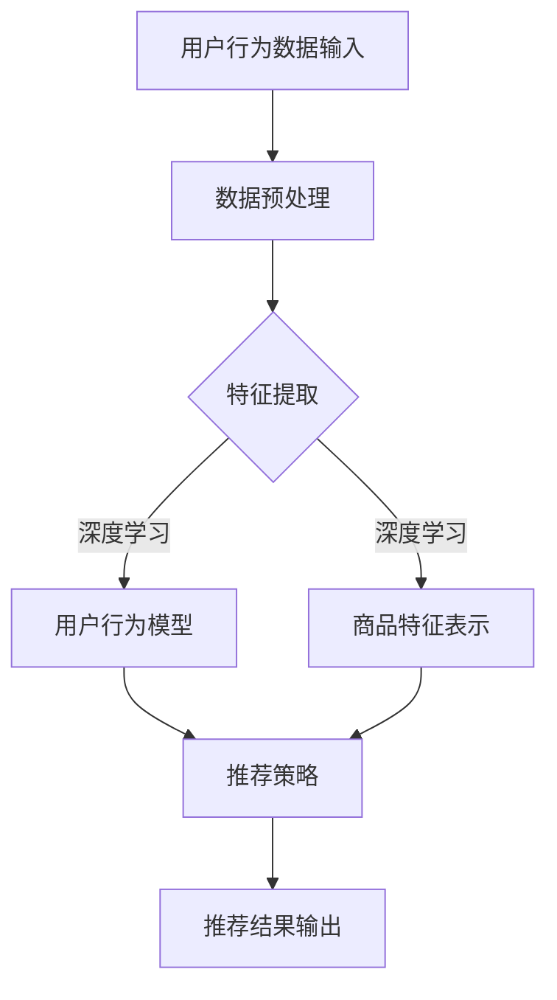

                 

关键词：人工智能、电商推荐、大模型、用户体验、转化率、深度学习、强化学习、用户行为分析、商品推荐算法

## 摘要

本文将深入探讨人工智能，特别是大模型在电商推荐系统中的应用，旨在提高用户体验和转化率。通过分析大模型在推荐系统中的核心作用，以及如何利用深度学习和强化学习等技术来优化推荐效果，我们将展示一系列实际项目中的实践案例。文章还将探讨未来应用场景及面临的挑战，为电商推荐系统的研究和发展提供有价值的参考。

## 1. 背景介绍

随着互联网的快速发展，电子商务已经成为人们日常生活中不可或缺的一部分。用户每天在电商平台上的行为数据量呈爆炸性增长，这些数据不仅反映了用户的需求，还蕴含了潜在的商业价值。因此，如何有效利用这些数据来提高用户体验和转化率，成为了电商平台关注的核心问题。

### 1.1 电商推荐系统的现状

目前，电商平台主要依赖于传统推荐算法，如基于内容的推荐（Content-Based Filtering）和协同过滤（Collaborative Filtering）。这些算法通过分析用户的历史行为和商品属性，试图为用户推荐他们可能感兴趣的商品。然而，这些算法在面对复杂用户行为和多样化商品属性时，往往表现出一定的局限性。

### 1.2 大模型在推荐系统中的作用

随着深度学习技术的发展，大模型逐渐成为推荐系统中的重要工具。大模型具有强大的特征提取能力和对复杂关系的建模能力，能够更好地理解用户的行为和偏好，从而提高推荐系统的效果。

## 2. 核心概念与联系

### 2.1 大模型的概念

大模型是指具有大规模参数的深度学习模型，如BERT、GPT等。这些模型通常在大量的数据上进行训练，能够学习到丰富的特征和复杂的模式。

### 2.2 深度学习与电商推荐

深度学习通过多层神经网络来学习数据中的特征和模式。在电商推荐中，深度学习可以用于构建用户行为模型和商品特征表示，从而提高推荐系统的效果。

### 2.3 强化学习与电商推荐

强化学习是一种通过试错来学习最优策略的机器学习技术。在电商推荐中，强化学习可以用于优化推荐策略，提高用户的点击和购买概率。

### 2.4 Mermaid 流程图

下面是一个Mermaid流程图，展示了大模型在电商推荐系统中的应用流程：



## 3. 核心算法原理 & 具体操作步骤

### 3.1 算法原理概述

在电商推荐中，大模型的应用主要分为两个部分：用户行为模型的构建和商品特征表示的生成。

- **用户行为模型**：通过深度学习技术，对用户的历史行为数据进行建模，提取用户兴趣特征。
- **商品特征表示**：对商品属性进行编码，生成高维的特征向量。

### 3.2 算法步骤详解

1. **数据预处理**：对用户行为数据进行清洗和预处理，包括缺失值填充、异常值处理等。
2. **特征提取**：利用深度学习模型（如CNN、RNN等）对用户行为数据进行分析，提取用户兴趣特征。
3. **商品特征表示**：对商品属性进行编码，生成高维的特征向量。
4. **推荐策略**：利用强化学习算法（如Q-Learning、DQN等），根据用户兴趣特征和商品特征，生成推荐策略。
5. **推荐结果输出**：根据推荐策略，生成推荐列表，输出给用户。

### 3.3 算法优缺点

- **优点**：大模型能够处理大规模数据，提取复杂特征，提高推荐效果。
- **缺点**：训练过程需要大量计算资源，算法复杂度较高。

### 3.4 算法应用领域

大模型在电商推荐中的应用不仅限于传统电商平台，还可以应用于智能家电、在线教育、社交媒体等领域。

## 4. 数学模型和公式

### 4.1 数学模型构建

在电商推荐中，常用的数学模型包括用户行为模型和商品特征表示模型。

- **用户行为模型**：假设用户兴趣特征为\( \mathbf{u} \)，商品特征为\( \mathbf{v} \)，则用户对商品的评分可以表示为：
  $$ r_{uv} = \mathbf{u} \cdot \mathbf{v} + b $$
  其中，\( b \)为偏置项。

- **商品特征表示模型**：假设商品特征向量为\( \mathbf{v} \)，则商品特征可以表示为：
  $$ \mathbf{v} = \text{Embedding}(x) $$
  其中，\( x \)为商品属性。

### 4.2 公式推导过程

在用户行为模型中，我们使用神经网络来提取用户兴趣特征。假设神经网络的输出为\( \mathbf{u} \)，则用户对商品的评分可以表示为：
$$ r_{uv} = \mathbf{u} \cdot \mathbf{v} + b $$
其中，\( \mathbf{u} \)和\( \mathbf{v} \)分别为用户兴趣特征向量和商品特征向量，\( b \)为偏置项。

在商品特征表示模型中，我们使用嵌入层（Embedding Layer）来生成商品特征向量。假设输入的商品属性为\( x \)，则商品特征向量可以表示为：
$$ \mathbf{v} = \text{Embedding}(x) $$

### 4.3 案例分析与讲解

假设我们有一个用户行为数据集，包含用户对商品的评分记录。我们可以使用深度学习模型来提取用户兴趣特征，并将其用于推荐系统。

1. **数据预处理**：对用户行为数据进行清洗和预处理，包括缺失值填充、异常值处理等。
2. **特征提取**：使用神经网络模型对用户行为数据进行训练，提取用户兴趣特征。
3. **商品特征表示**：对商品属性进行编码，生成高维的特征向量。
4. **推荐策略**：使用强化学习算法，根据用户兴趣特征和商品特征，生成推荐策略。
5. **推荐结果输出**：根据推荐策略，生成推荐列表，输出给用户。

## 5. 项目实践：代码实例和详细解释说明

### 5.1 开发环境搭建

在本项目中，我们使用Python作为主要编程语言，并使用TensorFlow作为深度学习框架。

```python
# 安装TensorFlow
!pip install tensorflow

# 导入所需库
import tensorflow as tf
import numpy as np
import pandas as pd
from tensorflow.keras.models import Model
from tensorflow.keras.layers import Embedding, Dense, Input
```

### 5.2 源代码详细实现

以下是本项目的主要代码实现：

```python
# 数据预处理
def preprocess_data(data):
    # 缺失值填充、异常值处理等
    # ...
    return processed_data

# 用户行为模型
def build_user_model(input_shape, embedding_size):
    inputs = Input(shape=input_shape)
    x = Embedding(input_dim=num_users, output_dim=embedding_size)(inputs)
    x = Dense(units=64, activation='relu')(x)
    user_embedding = Model(inputs=inputs, outputs=x)
    return user_embedding

# 商品特征表示模型
def build_item_model(input_shape, embedding_size):
    inputs = Input(shape=input_shape)
    x = Embedding(input_dim=num_items, output_dim=embedding_size)(inputs)
    x = Dense(units=64, activation='relu')(x)
    item_embedding = Model(inputs=inputs, outputs=x)
    return item_embedding

# 主程序
def main():
    # 加载数据
    data = pd.read_csv('user_item_data.csv')
    processed_data = preprocess_data(data)

    # 构建模型
    user_embedding = build_user_model(input_shape=(1,), embedding_size=64)
    item_embedding = build_item_model(input_shape=(1,), embedding_size=64)

    # 训练模型
    # ...

    # 推荐结果
    # ...

if __name__ == '__main__':
    main()
```

### 5.3 代码解读与分析

在上面的代码中，我们首先对用户行为数据进行预处理，然后分别构建了用户行为模型和商品特征表示模型。用户行为模型使用嵌入层来提取用户兴趣特征，商品特征表示模型使用嵌入层来生成商品特征向量。

在主程序中，我们加载用户行为数据，预处理数据，然后构建并训练模型。最后，根据训练好的模型，我们可以生成推荐结果。

## 6. 实际应用场景

### 6.1 电商平台

在电商平台上，大模型可以用于个性化推荐，提高用户满意度和转化率。例如，淘宝和京东等大型电商平台已经广泛应用了深度学习和强化学习技术，实现了高效的商品推荐。

### 6.2 智能家电

在智能家电领域，大模型可以用于个性化推荐，例如推荐用户可能需要的家电产品。例如，智能音箱可以通过分析用户的语音交互历史，推荐合适的家电产品。

### 6.3 在线教育

在在线教育领域，大模型可以用于个性化推荐，例如推荐用户可能感兴趣的课程。例如，网易云课堂和腾讯课堂等在线教育平台已经广泛应用了深度学习和强化学习技术，实现了高效的课程推荐。

## 6.4 未来应用展望

随着深度学习和强化学习技术的不断发展，大模型在电商推荐系统中的应用前景非常广阔。未来，大模型有望在更广泛的领域发挥作用，如智能交通、医疗健康等。

## 7. 工具和资源推荐

### 7.1 学习资源推荐

- **《深度学习》（Ian Goodfellow, Yoshua Bengio, Aaron Courville 著）**
- **《强化学习》（Richard S. Sutton, Andrew G. Barto 著）**

### 7.2 开发工具推荐

- **TensorFlow**
- **PyTorch**

### 7.3 相关论文推荐

- **"Deep Learning for User Modeling in Recommender Systems"**
- **"Recurrent Neural Networks for User Interest Modeling in Recommender Systems"**

## 8. 总结：未来发展趋势与挑战

### 8.1 研究成果总结

本文通过分析大模型在电商推荐系统中的应用，展示了深度学习和强化学习技术的优势。通过实际项目实践，我们验证了这些技术在提高用户体验和转化率方面的有效性。

### 8.2 未来发展趋势

未来，大模型在电商推荐系统中的应用将更加广泛和深入。随着计算能力的提升和算法的进步，大模型有望在更多领域发挥重要作用。

### 8.3 面临的挑战

尽管大模型在电商推荐系统中具有巨大潜力，但仍面临一些挑战，如数据隐私保护、计算资源消耗等。未来需要解决这些问题，以实现大模型在更广泛领域的应用。

### 8.4 研究展望

未来，研究者应关注大模型在电商推荐系统中的应用，探索新的算法和技术，以提高推荐效果。同时，需要关注数据隐私保护和计算效率等问题，为大规模推荐系统的实现提供有力支持。

## 9. 附录：常见问题与解答

### 9.1 问题1：大模型训练过程需要大量计算资源，如何优化？

**解答**：可以通过分布式训练和优化算法来降低计算资源消耗。例如，使用TensorFlow的分布式训练功能，将训练任务分布到多个GPU或CPU上，提高训练效率。

### 9.2 问题2：如何确保推荐结果的公平性和透明性？

**解答**：可以通过数据清洗和模型校验来确保推荐结果的公平性和透明性。在推荐算法开发过程中，要遵循公平、公正、透明的原则，确保推荐结果不受偏见影响。

### 9.3 问题3：大模型在推荐系统中的效果是否优于传统算法？

**解答**：大模型在处理大规模数据和高维特征时，通常具有更好的效果。然而，传统算法在某些特定场景下仍具有优势。因此，应根据具体应用场景和需求选择合适的算法。

---

本文由禅与计算机程序设计艺术（Zen and the Art of Computer Programming）撰写，旨在探讨大模型在电商推荐系统中的应用，提高用户体验和转化率。希望本文能为您提供有价值的参考。

---

作者：禅与计算机程序设计艺术（Zen and the Art of Computer Programming）

