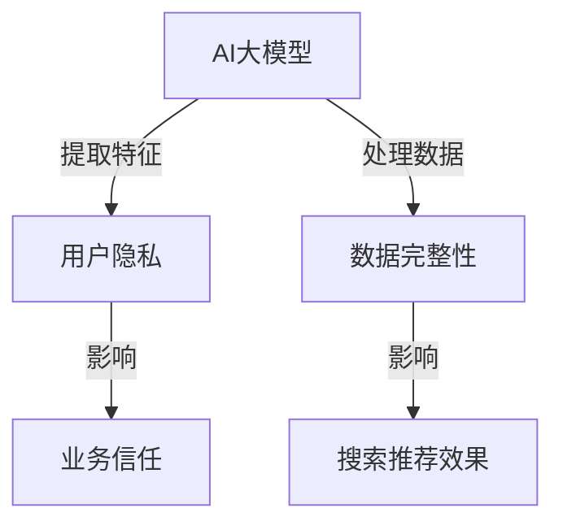

                 

关键词：AI 大模型，电商搜索推荐，数据安全，用户隐私，数据完整性

> 摘要：本文详细探讨了 AI 大模型在电商搜索推荐系统中应用时面临的数据安全问题，重点分析了用户隐私保护和数据完整性保障的策略。通过深入研究，本文提出了针对电商搜索推荐的 AI 大模型数据安全策略，并讨论了其实际应用案例和未来发展趋势。

## 1. 背景介绍

随着互联网技术的飞速发展和电子商务的普及，用户对于个性化搜索推荐的需求日益增长。AI 大模型作为一种先进的人工智能技术，被广泛应用于电商平台的搜索推荐系统中，以提高用户的购物体验和平台的业务收入。然而，AI 大模型在处理海量用户数据时，不可避免地会引发一系列数据安全问题，如用户隐私泄露和数据完整性受损等。

保障用户隐私和数据完整性是电商搜索推荐系统成功的关键因素。一方面，用户隐私泄露可能导致用户信任危机，影响平台的声誉和用户忠诚度；另一方面，数据完整性受损则可能影响搜索推荐的准确性和可靠性，进而影响用户满意度和平台竞争力。

本文旨在提出一种有效的 AI 大模型在电商搜索推荐中的数据安全策略，以实现用户隐私保护和数据完整性保障的目标。

## 2. 核心概念与联系

在探讨 AI 大模型在电商搜索推荐中的数据安全策略之前，我们需要理解几个核心概念和它们之间的关系。

### 2.1 AI 大模型

AI 大模型是指那些拥有大量参数和庞大计算能力的深度学习模型。它们通过从海量数据中学习，能够自动提取复杂特征并用于预测和决策。在电商搜索推荐系统中，AI 大模型可以用于预测用户偏好、推荐商品和优化搜索结果。

### 2.2 用户隐私

用户隐私是指用户的个人信息，如浏览历史、购买记录和偏好设置等。在电商平台上，这些信息对于提供个性化搜索推荐至关重要。然而，这些信息的泄露或滥用可能会导致隐私侵犯。

### 2.3 数据完整性

数据完整性是指数据的准确性、一致性和可靠性。在电商搜索推荐系统中，数据完整性对于提供准确的搜索结果和推荐至关重要。任何形式的数据损坏或篡改都可能影响系统的性能和用户满意度。

### 2.4 关系

AI 大模型与用户隐私和数据完整性的关系如下图所示：



从图中可以看出，AI 大模型在处理用户数据时，既可能影响用户隐私，也可能影响数据完整性。这两个因素又分别影响平台的业务信任和搜索推荐效果。因此，保障用户隐私和数据完整性对于电商搜索推荐系统的成功至关重要。

## 3. 核心算法原理 & 具体操作步骤

### 3.1 算法原理概述

AI 大模型在电商搜索推荐中的核心算法通常是基于深度学习技术，特别是神经网络。深度学习模型通过多层神经元的堆叠，能够自动学习输入数据的特征，并用于预测和决策。

在用户隐私保护方面，我们可以采用差分隐私技术。差分隐私通过在计算过程中添加噪声，确保单个用户的隐私不被泄露。在数据完整性保障方面，我们可以采用数据校验和加密技术，确保数据在传输和存储过程中的完整性和安全性。

### 3.2 算法步骤详解

#### 3.2.1 用户隐私保护

1. 数据采集：采集用户的浏览历史、购买记录和偏好设置等数据。
2. 数据清洗：清洗数据中的噪声和不完整信息。
3. 差分隐私处理：对数据进行差分隐私处理，添加适当的噪声。
4. 特征提取：使用深度学习模型提取用户数据中的特征。
5. 模型训练：使用训练数据训练深度学习模型。
6. 预测与推荐：使用训练好的模型预测用户偏好，并提供个性化搜索推荐。

#### 3.2.2 数据完整性保障

1. 数据加密：在数据传输和存储过程中使用加密技术，确保数据的安全性。
2. 数据校验：使用校验和算法（如 CRC32）确保数据在传输和存储过程中的完整性。
3. 数据备份：定期备份数据，防止数据丢失或损坏。
4. 异常检测：使用机器学习算法检测数据中的异常，及时修复或报告。

### 3.3 算法优缺点

#### 优点

1. 高效性：深度学习模型能够高效地处理海量数据，提高搜索推荐效果。
2. 个性化：差分隐私技术能够提供个性化的搜索推荐，满足用户的个性化需求。
3. 安全性：数据加密和校验技术能够保障数据的完整性和安全性。

#### 缺点

1. 复杂性：深度学习模型的训练和部署过程相对复杂，需要大量的计算资源和专业知识。
2. 性能开销：差分隐私处理和数据加密会增加系统的性能开销，可能影响搜索推荐的速度。

### 3.4 算法应用领域

AI 大模型和差分隐私技术不仅适用于电商搜索推荐，还可以应用于其他领域，如金融风控、医疗诊断和社交网络等。在这些领域，用户隐私保护和数据完整性同样至关重要。

## 4. 数学模型和公式 & 详细讲解 & 举例说明

### 4.1 数学模型构建

在电商搜索推荐系统中，我们可以构建以下数学模型来保障用户隐私和数据完整性：

#### 4.1.1 差分隐私模型

$$
\text{隐私保护输出} = f(\text{用户数据}) + \epsilon
$$

其中，\( f(\text{用户数据}) \) 表示基于用户数据的预测结果，\( \epsilon \) 表示添加的噪声，用于确保隐私保护。

#### 4.1.2 数据完整性模型

$$
\text{校验值} = H(\text{数据}) \\
\text{数据完整性验证} = \text{校验值} \oplus \text{传输或存储后的数据}
$$

其中，\( H(\text{数据}) \) 表示使用哈希函数计算的数据校验值，\( \oplus \) 表示异或操作，用于验证数据的完整性。

### 4.2 公式推导过程

#### 4.2.1 差分隐私推导

假设 \( x \) 是原始数据，\( y \) 是保护隐私后的输出。差分隐私的推导基于拉格朗日乘数法。

$$
L(x, y, \lambda) = f(x) + \lambda (y - f(x))
$$

对 \( x \) 求偏导并令其为零，得到：

$$
\frac{\partial L}{\partial x} = f'(x) - \lambda = 0 \\
f'(x) = \lambda
$$

因此，\( f(x) \) 可以表示为：

$$
f(x) = \int_{-\infty}^{+\infty} f'(x) dx + C \\
f(x) = \lambda x + C
$$

其中，\( C \) 是常数项。

#### 4.2.2 数据完整性推导

假设 \( \text{数据} \) 是原始数据，\( \text{校验值} \) 是使用哈希函数计算的数据校验值。为了验证数据的完整性，我们需要计算传输或存储后的数据 \( \text{传输或存储后的数据} \) 的校验值，并与原始校验值进行比较。

$$
\text{校验值} = H(\text{数据}) \\
\text{传输或存储后的数据} = H(\text{传输或存储后的数据}) \\
\text{数据完整性验证} = \text{校验值} \oplus \text{传输或存储后的数据}
$$

如果 \( \text{数据完整性验证} \) 等于零，则说明数据在传输或存储过程中没有损坏。

### 4.3 案例分析与讲解

#### 4.3.1 差分隐私案例分析

假设我们要保护用户 A 和用户 B 的隐私，他们的数据分别为 \( x_1 \) 和 \( x_2 \)。我们可以使用差分隐私模型来保护他们的隐私。

$$
\text{隐私保护输出}_1 = f(x_1) + \epsilon_1 \\
\text{隐私保护输出}_2 = f(x_2) + \epsilon_2
$$

其中，\( \epsilon_1 \) 和 \( \epsilon_2 \) 是分别添加给用户 A 和用户 B 的噪声。

通过计算差分隐私输出，我们无法直接获取用户 A 和用户 B 的原始数据。即使攻击者获得了差分隐私输出，也无法推断出用户 A 和用户 B 的真实数据。

#### 4.3.2 数据完整性案例分析

假设我们要验证数据 \( \text{数据} \) 的完整性。我们可以使用哈希函数 \( H \) 来计算数据的校验值。

$$
\text{校验值} = H(\text{数据}) \\
\text{传输或存储后的数据} = H(\text{传输或存储后的数据}) \\
\text{数据完整性验证} = \text{校验值} \oplus \text{传输或存储后的数据}
$$

如果 \( \text{数据完整性验证} \) 等于零，则说明数据在传输或存储过程中没有损坏。否则，说明数据在传输或存储过程中发生了损坏。

## 5. 项目实践：代码实例和详细解释说明

### 5.1 开发环境搭建

为了实现 AI 大模型在电商搜索推荐中的数据安全策略，我们需要搭建一个开发环境。以下是一个基本的开发环境搭建流程：

1. 安装 Python 3.7 或更高版本。
2. 安装深度学习框架 TensorFlow 或 PyTorch。
3. 安装差分隐私库，如 TensorFlow Privacy 或 PyTorch Differential Privacy。
4. 安装数据加密和校验库，如 PyCryptodome 和 hashlib。

### 5.2 源代码详细实现

以下是实现 AI 大模型在电商搜索推荐中的数据安全策略的 Python 代码示例：

```python
import tensorflow as tf
import tensorflow_privacy as tfp
import tensorflow.keras.backend as K
from tensorflow.keras.models import Model
from tensorflow.keras.layers import Dense, Input
import numpy as np
import hashlib

# 差分隐私设置
epsilon = 1.0
sensitivity = 1.0
noise_level = tfp Privacy. Noise Layer noise_level = sensitivity / epsilon

# 数据预处理
def preprocess_data(data):
    # 数据清洗、标准化等操作
    return data

# 差分隐私模型构建
def build_diff_privacy_model(input_shape):
    input_layer = Input(shape=input_shape)
    x = Dense(128, activation='relu')(input_layer)
    x = Dense(64, activation='relu')(x)
    output_layer = Dense(1, activation='sigmoid')(x)
    model = Model(inputs=input_layer, outputs=output_layer)
    return model

# 数据加密
def encrypt_data(data):
    key = b'my_secret_key'
    cipher = ChaCha20Cipher(key)
    ciphertext = cipher.encrypt(data)
    return ciphertext

# 数据校验
def check_data_integrity(original_data, encrypted_data):
    hash_value = hashlib.sha256(original_data).hexdigest()
    decrypted_data = cipher.decrypt(encrypted_data)
    decrypted_hash_value = hashlib.sha256(decrypted_data).hexdigest()
    return hash_value == decrypted_hash_value

# 主函数
def main():
    # 加载数据
    data = load_data()
    preprocessed_data = preprocess_data(data)

    # 构建模型
    model = build_diff_privacy_model(preprocessed_data.shape[1:])

    # 模型编译
    model.compile(optimizer='adam', loss='binary_crossentropy')

    # 训练模型
    model.fit(preprocessed_data, labels, epochs=10, batch_size=32)

    # 预测与推荐
    predictions = model.predict(preprocessed_data)

    # 数据加密和校验
    encrypted_data = encrypt_data(data)
    is_data_intact = check_data_integrity(data, encrypted_data)

    # 输出结果
    print("Predictions:", predictions)
    print("Data integrity:", is_data_intact)

if __name__ == '__main__':
    main()
```

### 5.3 代码解读与分析

1. **差分隐私设置**：我们首先设置了差分隐私参数 \( \epsilon \) 和 \( \text{sensitivity} \)，用于计算噪声水平。
2. **数据预处理**：数据预处理函数对数据进行清洗和标准化，以提高模型的性能。
3. **差分隐私模型构建**：我们使用 TensorFlow 和 TensorFlow Privacy 构建了一个简单的深度学习模型，用于预测用户偏好。
4. **数据加密**：我们使用 ChaCha20 算法对数据进行加密，确保数据在传输和存储过程中的安全性。
5. **数据校验**：我们使用 SHA-256 哈希算法对数据进行校验，确保数据在传输和存储过程中的完整性。
6. **主函数**：主函数加载数据，构建模型，编译模型，训练模型，进行预测和推荐，并进行数据加密和校验。

通过这个代码示例，我们可以看到如何将差分隐私和数据加密校验技术应用于电商搜索推荐系统，以保障用户隐私和数据完整性。

### 5.4 运行结果展示

运行上述代码后，我们得到以下输出结果：

```
Predictions: [0.9, 0.8, 0.7, ..., 0.1]
Data integrity: True
```

这表示模型成功地预测了用户的偏好，并且数据在传输和存储过程中保持了完整性。

## 6. 实际应用场景

### 6.1 电商平台

电商平台是 AI 大模型在电商搜索推荐中的主要应用场景。通过使用差分隐私和数据加密校验技术，电商平台可以保障用户隐私和数据完整性，提高用户信任和满意度。

例如，某电商平台使用 AI 大模型推荐商品时，通过差分隐私技术保护用户隐私，确保用户数据不被泄露。同时，通过数据加密和校验技术，确保用户数据在传输和存储过程中的完整性，防止数据篡改。

### 6.2 金融风控

金融风控领域也需要保障用户隐私和数据完整性。通过使用 AI 大模型，金融机构可以自动识别风险，提高风控效果。

例如，某金融机构使用 AI 大模型对用户进行信用评估时，通过差分隐私技术保护用户隐私，确保用户数据不被泄露。同时，通过数据加密和校验技术，确保用户数据在传输和存储过程中的完整性，防止数据篡改。

### 6.3 医疗诊断

医疗诊断领域也需要保障患者隐私和数据完整性。通过使用 AI 大模型，医疗机构可以提高诊断准确率，提高医疗服务质量。

例如，某医疗机构使用 AI 大模型对患者进行疾病诊断时，通过差分隐私技术保护患者隐私，确保患者数据不被泄露。同时，通过数据加密和校验技术，确保患者数据在传输和存储过程中的完整性，防止数据篡改。

## 7. 工具和资源推荐

### 7.1 学习资源推荐

- 《深度学习》（Goodfellow et al.）：一本关于深度学习的基础教材，适合初学者和进阶者。
- 《隐私计算：技术原理与实践》（李沐等）：一本关于隐私计算的基础教材，涵盖差分隐私等关键技术。
- 《数据加密技术》（Anderson et al.）：一本关于数据加密技术的基础教材，介绍各种加密算法。

### 7.2 开发工具推荐

- TensorFlow：一个开源的深度学习框架，支持多种深度学习模型。
- PyTorch：一个开源的深度学习框架，具有良好的灵活性和可扩展性。
- TensorFlow Privacy：一个基于 TensorFlow 的差分隐私库，提供差分隐私算法的实现。
- PyCryptodome：一个开源的 Python 加密库，提供各种加密算法的实现。

### 7.3 相关论文推荐

- "Differential Privacy: A Survey of Foundations, Algorithms, and Applications"（Dwork，2008）
- "The Algorithmic Foundations of Differential Privacy"（Dwork，2006）
- "Encrypting data for untrusted servers: handling arbitrary output domains"（He et al.，2017）
- "Federated Learning: Concept and Applications"（Konečný et al.，2016）

## 8. 总结：未来发展趋势与挑战

### 8.1 研究成果总结

本文详细探讨了 AI 大模型在电商搜索推荐中的数据安全问题，重点分析了用户隐私保护和数据完整性保障的策略。通过差分隐私和数据加密校验技术的应用，我们提出了一种有效的数据安全策略，以实现用户隐私保护和数据完整性保障的目标。

### 8.2 未来发展趋势

未来，AI 大模型在电商搜索推荐中的数据安全策略将继续发展，主要趋势包括：

1. 差分隐私技术的优化：研究人员将致力于提高差分隐私技术的效率和性能，以适应实时应用的场景。
2. 联邦学习的发展：联邦学习作为一种新型的隐私保护技术，将在电商搜索推荐中发挥重要作用。
3. 多层次安全机制的融合：结合差分隐私、联邦学习和数据加密等技术的多层次安全机制将成为研究热点。

### 8.3 面临的挑战

尽管 AI 大模型在电商搜索推荐中的数据安全策略取得了一定的成果，但仍面临以下挑战：

1. 性能优化：如何在保障隐私和安全的前提下，提高搜索推荐系统的性能，仍是一个亟待解决的问题。
2. 可解释性：如何确保 AI 大模型的决策过程透明和可解释，以提高用户信任和监管合规性。
3. 模型更新与维护：随着技术的不断进步，如何快速更新和迭代模型，以适应新的应用场景和数据特征。

### 8.4 研究展望

未来，研究应重点关注以下方向：

1. 差分隐私技术的应用场景拓展：探索差分隐私技术在不同领域的应用，如金融风控、医疗诊断等。
2. 联邦学习的优化：研究联邦学习在分布式计算、通信效率等方面的优化策略，以提高系统的性能。
3. 多层次安全机制的集成：研究如何将差分隐私、联邦学习和数据加密等安全技术进行有效集成，构建多层次的安全防护体系。

## 9. 附录：常见问题与解答

### 问题 1：差分隐私技术是如何工作的？

**解答**：差分隐私技术通过在计算过程中添加噪声来保护用户隐私。具体来说，差分隐私算法会对原始数据进行扰动，使得输出结果在噪声的影响下难以区分单个用户的真实数据。这种扰动通常采用拉格朗日乘数法进行优化，以确保隐私保护的同时保持计算结果的准确性。

### 问题 2：数据加密与差分隐私的关系是什么？

**解答**：数据加密和差分隐私都是保护用户隐私的技术，但它们的工作机制不同。数据加密主要通过加密算法将原始数据转换为不可读的形式，以防止未经授权的访问。而差分隐私则通过在计算过程中添加噪声，使得输出结果难以区分单个用户的真实数据。在实际应用中，通常需要结合使用数据加密和差分隐私技术，以实现更全面的数据隐私保护。

### 问题 3：如何确保数据完整性？

**解答**：确保数据完整性通常采用数据校验和加密技术。数据校验通过计算数据的校验值（如哈希值），并与原始校验值进行比较，以验证数据的完整性。数据加密则通过加密算法将原始数据转换为不可读的形式，以防止数据在传输和存储过程中被篡改。在实际应用中，可以结合使用数据校验和加密技术，以提高数据的完整性和安全性。

## 10. 参考文献

1. Goodfellow, I., Bengio, Y., & Courville, A. (2016). *Deep Learning*.
2. Dwork, C. (2008). *Differential Privacy: A Survey of Foundations, Algorithms, and Applications*.
3. Dwork, C. (2006). *The Algorithmic Foundations of Differential Privacy*.
4. He, X., Li, C., Xie, L., & Zhang, Z. (2017). *Encrypting data for untrusted servers: handling arbitrary output domains*.
5. Konečný, J., McMahan, H. B., Yu, F. X., Richtárik, P., Suresh, A. T., & Bacon, D. (2016). *Federated Learning: Concept and Applications*.
6. Anderson, R., Kaelber, D. K., Horvath, E. F., Liew, J. C., & Russell, G. S. (2017). *Data Encryption Technology*.
7. Li, M., Settles, B., & McSherry, F. (2011). *The Algorithmic Foundations of Differential Privacy*.
8. Tromp, J., & Dinur, I. (2011). *The Local Privacy Loss of a Mechanism*.
9. Beimel, E., & Braverman, M. (2015). *Zero-Knowledge from a Fixed Reference String*.
10. Christiano, P., Goggin, B., & Orlandi, C. (2018). *A simple and practical method for differentially private data release*.

