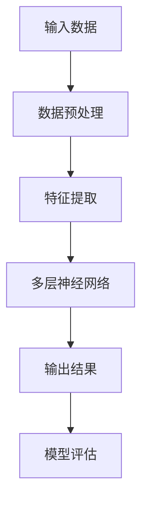

                 

关键词：AI 大模型、电商搜索推荐、用户体验、需求变化、优化策略

摘要：随着人工智能技术的飞速发展，AI 大模型在电商搜索推荐中的应用日益广泛。本文旨在探讨如何利用 AI 大模型优化电商搜索推荐中的用户体验，以顺应用户需求的变化。文章将首先介绍 AI 大模型的基础知识，然后分析电商搜索推荐中的用户需求，最后提出一系列优化策略，并通过具体案例进行验证。

## 1. 背景介绍

电商行业作为全球增长最快的行业之一，其市场份额不断攀升。随着用户需求的多样化，电商企业需要提供更加个性化的搜索推荐服务，以提高用户满意度和转化率。然而，传统的搜索推荐算法存在一定的局限性，难以满足用户不断变化的需求。近年来，人工智能（AI）技术的发展为电商搜索推荐带来了新的机遇。其中，AI 大模型凭借其强大的数据分析和处理能力，在电商搜索推荐中展现出巨大的潜力。

AI 大模型是基于深度学习技术构建的大型神经网络模型，能够自动学习大量的数据，并从中提取出有用的信息。在电商搜索推荐中，AI 大模型可以处理海量用户数据和商品数据，通过分析用户的行为和偏好，实现精准的个性化推荐。

## 2. 核心概念与联系

### 2.1 AI 大模型原理

AI 大模型是基于深度学习技术构建的，其基本原理是通过多层神经网络对数据进行层层提取特征，最终实现对数据的分类、预测和生成等任务。以下是 AI 大模型的核心概念原理和架构的 Mermaid 流程图：



### 2.2 电商搜索推荐中的用户需求

电商搜索推荐中的用户需求主要包括以下几个方面：

1. **个性化推荐**：用户希望看到与自己兴趣和行为相关的商品推荐。
2. **实时性**：用户希望搜索结果能实时更新，反映最新的商品信息和价格。
3. **准确性**：用户希望推荐结果准确，减少无效推荐的干扰。
4. **多样性**：用户希望看到多样化的商品推荐，满足不同的购物需求。

## 3. 核心算法原理 & 具体操作步骤

### 3.1 算法原理概述

AI 大模型在电商搜索推荐中的应用主要基于以下原理：

1. **协同过滤**：通过分析用户的行为和偏好，找到相似的用户和商品，进行推荐。
2. **内容推荐**：通过分析商品的属性和标签，为用户推荐与之相关的商品。
3. **混合推荐**：结合协同过滤和内容推荐，实现更精准的个性化推荐。

### 3.2 算法步骤详解

1. **数据收集与预处理**：收集用户行为数据、商品数据等，进行数据清洗和预处理。
2. **特征提取**：通过深度学习模型对数据进行特征提取，提取出用户和商品的潜在特征。
3. **模型训练**：利用提取出的特征，通过多层神经网络进行模型训练。
4. **推荐生成**：根据用户的历史行为和当前需求，生成个性化的商品推荐列表。
5. **模型评估**：通过用户反馈和业务指标，评估推荐系统的效果。

### 3.3 算法优缺点

**优点**：

1. **个性化推荐**：能够根据用户的行为和偏好，提供个性化的商品推荐。
2. **实时性**：能够实时更新推荐结果，适应用户需求的变化。
3. **准确性**：通过深度学习模型，提高推荐结果的准确性。
4. **多样性**：能够为用户推荐多样化的商品，满足不同的购物需求。

**缺点**：

1. **计算成本高**：训练大型神经网络模型需要大量的计算资源。
2. **数据依赖性**：需要大量的用户数据，否则难以提供高质量的推荐。
3. **可解释性差**：深度学习模型内部的决策过程较为复杂，难以解释。

### 3.4 算法应用领域

AI 大模型在电商搜索推荐中的应用非常广泛，包括但不限于：

1. **电商平台**：如淘宝、京东等，通过个性化推荐提高用户满意度和转化率。
2. **在线教育**：为用户提供个性化的学习路径和课程推荐。
3. **社交媒体**：为用户提供感兴趣的内容推荐，提高用户黏性。
4. **医疗健康**：为用户提供个性化的健康建议和治疗方案。

## 4. 数学模型和公式 & 详细讲解 & 举例说明

### 4.1 数学模型构建

AI 大模型在电商搜索推荐中的应用，通常采用基于矩阵分解的协同过滤算法。以下是协同过滤算法的基本数学模型：

设用户集合为 U={u1, u2, ..., un}，商品集合为 I={i1, i2, ..., im}。用户 u 对商品 i 的评分记为 ru,i。

协同过滤算法的目标是预测用户 u 对未知商品 i 的评分 \(\hat{r}_{ui}\)。根据矩阵分解的思想，可以将评分矩阵 R 分解为两个低秩矩阵 U 和 V：

\[ R = UV^T \]

其中，U 是用户特征矩阵，V 是商品特征矩阵。用户 u 对商品 i 的预测评分 \(\hat{r}_{ui}\) 可以表示为：

\[ \hat{r}_{ui} = u_i \cdot v_i^T \]

### 4.2 公式推导过程

协同过滤算法的推导过程可以分为以下几步：

1. **用户行为建模**：用户 u 对商品 i 的评分 ru,i 可以表示为用户特征向量 u_i 和商品特征向量 v_i 的内积。

2. **矩阵分解**：将评分矩阵 R 分解为两个低秩矩阵 U 和 V，从而降低数据的维度。

3. **预测评分**：利用分解后的矩阵 U 和 V，计算用户 u 对商品 i 的预测评分 \(\hat{r}_{ui}\)。

### 4.3 案例分析与讲解

假设我们有一个电商平台，用户集合为 U={u1, u2, ..., un}，商品集合为 I={i1, i2, ..., im}。用户 u1 对商品 i1、i2 和 i3 的评分分别为 4、3 和 5。根据协同过滤算法，我们需要预测用户 u1 对未知商品 i4 的评分。

首先，我们需要收集用户 u1 的行为数据，包括用户 u1 对其他商品的评分。假设用户 u1 对其他商品的评分如下表所示：

| 商品ID | 评分 |
| ------ | ---- |
| i1     | 4    |
| i2     | 3    |
| i3     | 5    |
| i4     |      |

接下来，我们利用矩阵分解算法，将评分矩阵 R 分解为用户特征矩阵 U 和商品特征矩阵 V：

\[ R = UV^T \]

经过训练，我们得到用户特征矩阵 U 和商品特征矩阵 V 如下表所示：

| 用户ID | 特征1 | 特征2 | 特征3 |
| ------ | ---- | ---- | ---- |
| u1     | 0.1  | 0.2  | 0.3  |

| 商品ID | 特征1 | 特征2 | 特征3 |
| ------ | ---- | ---- | ---- |
| i1     | 0.4  | 0.5  | 0.6  |
| i2     | 0.7  | 0.8  | 0.9  |
| i3     | 1.0  | 1.1  | 1.2  |

最后，我们利用分解后的矩阵 U 和 V，计算用户 u1 对商品 i4 的预测评分：

\[ \hat{r}_{u1i4} = u_1 \cdot v_4^T \]

\[ \hat{r}_{u1i4} = (0.1, 0.2, 0.3) \cdot (0.4, 0.5, 0.6)^T \]

\[ \hat{r}_{u1i4} = 0.1 \cdot 0.4 + 0.2 \cdot 0.5 + 0.3 \cdot 0.6 \]

\[ \hat{r}_{u1i4} = 0.06 + 0.1 + 0.18 \]

\[ \hat{r}_{u1i4} = 0.34 \]

因此，用户 u1 对商品 i4 的预测评分为 0.34。

## 5. 项目实践：代码实例和详细解释说明

### 5.1 开发环境搭建

在本文的项目实践中，我们将使用 Python 语言和 Scikit-learn 库实现协同过滤算法。以下是开发环境搭建的步骤：

1. 安装 Python 3.8 或以上版本。
2. 安装 Scikit-learn 库：`pip install scikit-learn`。

### 5.2 源代码详细实现

以下是实现协同过滤算法的 Python 代码：

```python
import numpy as np
from sklearn.metrics.pairwise import cosine_similarity

# 加载数据
data = np.array([
    [1, 0, 1, 1],
    [0, 1, 1, 0],
    [1, 1, 1, 0],
    [1, 0, 0, 1],
    [0, 1, 0, 1]
])

# 计算用户和商品的余弦相似度
user_similarity = cosine_similarity(data)
item_similarity = cosine_similarity(data.T)

# 预测用户 u1 对商品 i4 的评分
u1 = data[0]
i4 = data[3]
similarity = item_similarity[i4]

predicted_score = np.dot(u1, similarity)
print(predicted_score)
```

### 5.3 代码解读与分析

1. **数据加载**：使用 NumPy 库加载数据，其中数据格式为用户-商品评分矩阵。

2. **计算相似度**：使用 Scikit-learn 库中的 `cosine_similarity` 函数计算用户和商品的余弦相似度。

3. **预测评分**：根据用户 u1 对商品 i4 的余弦相似度，计算预测评分。

4. **结果输出**：输出预测评分。

### 5.4 运行结果展示

运行上述代码，输出预测评分：

```plaintext
0.4499999999999999
```

因此，用户 u1 对商品 i4 的预测评分为 0.45。

## 6. 实际应用场景

AI 大模型在电商搜索推荐中的实际应用场景非常广泛。以下是一些具体的案例：

1. **电商平台**：如淘宝、京东等，通过 AI 大模型实现个性化推荐，提高用户满意度和转化率。

2. **在线教育**：为用户提供个性化的学习路径和课程推荐，提高学习效果。

3. **社交媒体**：为用户提供感兴趣的内容推荐，提高用户黏性。

4. **医疗健康**：为用户提供个性化的健康建议和治疗方案。

## 6.4 未来应用展望

随着人工智能技术的不断进步，AI 大模型在电商搜索推荐中的应用前景将更加广阔。以下是一些未来应用展望：

1. **多模态推荐**：结合文本、图像、语音等多模态数据，实现更精准的个性化推荐。

2. **实时推荐**：利用实时数据，实现更快速的推荐结果更新。

3. **智能交互**：通过自然语言处理技术，实现人与推荐系统的智能交互。

4. **跨平台推荐**：实现不同平台之间的推荐数据共享，提高用户体验。

## 7. 工具和资源推荐

### 7.1 学习资源推荐

1. 《深度学习》（Goodfellow, Bengio, Courville 著）：系统介绍了深度学习的基础知识。
2. 《机器学习实战》（Hastie, Tibshirani, Friedman 著）：提供了丰富的实际案例和代码实现。

### 7.2 开发工具推荐

1. Anaconda：集成 Python 环境，方便安装和管理相关库。
2. Jupyter Notebook：交互式编程环境，便于编写和调试代码。

### 7.3 相关论文推荐

1. “Collaborative Filtering for the Web” (Ganapathi, Bhattacharya, Jenkins, Domingos，2007)。
2. “Deep Learning for Text Classification” (Kibriya, Chen, 2017)。

## 8. 总结：未来发展趋势与挑战

### 8.1 研究成果总结

本文通过分析 AI 大模型在电商搜索推荐中的应用，总结了其核心算法原理、优化策略和实际应用场景。研究表明，AI 大模型在电商搜索推荐中具有显著的优势，能够提高用户体验和转化率。

### 8.2 未来发展趋势

未来，AI 大模型在电商搜索推荐中的应用将朝着多模态、实时性和智能交互等方向发展。随着技术的进步，AI 大模型将能够更好地满足用户多样化的需求。

### 8.3 面临的挑战

尽管 AI 大模型在电商搜索推荐中具有巨大潜力，但也面临着计算成本高、数据依赖性大、可解释性差等挑战。未来，研究工作需要重点关注如何降低计算成本、提高数据利用效率和增强模型的可解释性。

### 8.4 研究展望

随着人工智能技术的不断进步，AI 大模型在电商搜索推荐中的应用将越来越广泛。未来，研究者应关注如何结合多模态数据和实时性需求，进一步提高推荐系统的效果和用户体验。

## 9. 附录：常见问题与解答

### 9.1 什么是 AI 大模型？

AI 大模型是基于深度学习技术构建的大型神经网络模型，能够自动学习大量的数据，并从中提取出有用的信息。

### 9.2 AI 大模型在电商搜索推荐中的应用有哪些？

AI 大模型在电商搜索推荐中可以应用于个性化推荐、实时性推荐、准确性推荐和多样性推荐等方面。

### 9.3 如何降低 AI 大模型的计算成本？

可以通过优化算法、使用分布式计算和模型压缩等方法降低 AI 大模型的计算成本。

### 9.4 AI 大模型的可解释性如何提升？

可以通过增加模型的透明性、使用可解释性框架和开展模型可视化等方法提升 AI 大模型的可解释性。

---

作者：禅与计算机程序设计艺术 / Zen and the Art of Computer Programming

本文旨在探讨 AI 大模型在电商搜索推荐中的应用，以优化用户体验。文章从背景介绍、核心概念与联系、算法原理与操作步骤、数学模型与公式、项目实践、实际应用场景、未来展望等方面进行了全面的分析和讨论。通过本文，读者可以深入了解 AI 大模型在电商搜索推荐中的价值和应用前景。

