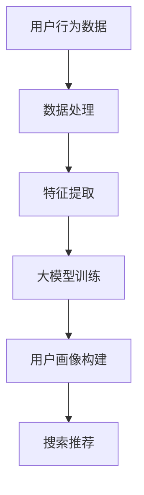
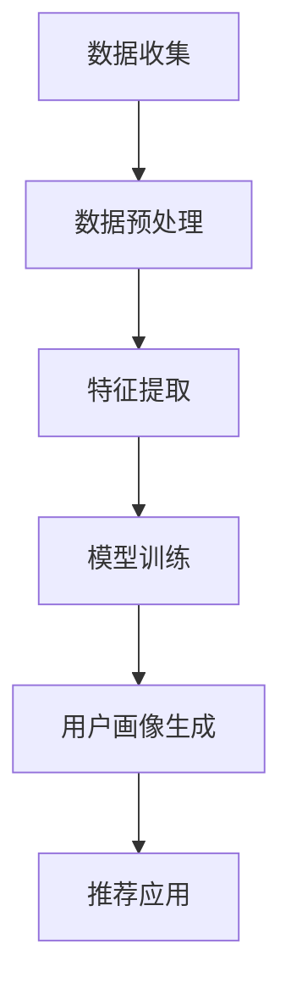

                 

关键词：人工智能、电商搜索推荐、用户画像、大模型、需求理解、行为分析

摘要：本文深入探讨了人工智能大模型在电商搜索推荐中构建用户画像的原理、方法与应用。通过分析用户需求与行为，探讨了如何利用人工智能技术实现精准的用户画像构建，提升电商搜索推荐的效率与用户体验。

## 1. 背景介绍

### 1.1 电商搜索推荐的现状

随着互联网的快速发展，电商行业已经成为我国经济的重要组成部分。电商搜索推荐作为电商平台的核心理功能之一，直接影响着用户购买决策和平台盈利能力。目前，主流的电商搜索推荐方法主要基于用户历史行为数据，通过挖掘用户兴趣和行为模式，实现个性化推荐。

### 1.2 人工智能在电商搜索推荐中的应用

人工智能技术在我国电商搜索推荐中得到了广泛应用。其中，基于深度学习的大模型成为研究热点。大模型具有强大的数据处理和分析能力，可以有效提高搜索推荐的准确性。本文将重点探讨人工智能大模型在电商搜索推荐中构建用户画像的方法与应用。

## 2. 核心概念与联系

### 2.1 用户画像

用户画像是指通过收集和分析用户行为、兴趣、偏好等数据，构建出用户的基本特征和需求模型。用户画像可以帮助电商平台更好地了解用户，实现精准营销和个性化推荐。

### 2.2 电商搜索推荐系统

电商搜索推荐系统是指基于用户行为数据，为用户推荐可能感兴趣的商品或信息。一个完善的搜索推荐系统需要考虑用户需求、商品信息、推荐算法等多个方面。

### 2.3 人工智能大模型

人工智能大模型是指具有海量训练数据和强大计算能力的深度学习模型。大模型在电商搜索推荐中的应用，主要体现在用户画像构建、推荐算法优化等方面。

### 2.4 Mermaid 流程图



## 3. 核心算法原理 & 具体操作步骤

### 3.1 算法原理概述

人工智能大模型在电商搜索推荐中的用户画像构建，主要包括数据处理、特征提取、大模型训练、用户画像构建和搜索推荐等步骤。

### 3.2 算法步骤详解

#### 3.2.1 数据处理

数据处理是用户画像构建的基础。主要任务包括数据清洗、数据去重、数据整合等。

#### 3.2.2 特征提取

特征提取是将原始数据转化为适用于深度学习模型的特征向量。主要方法有词袋模型、TF-IDF、 embeddings 等。

#### 3.2.3 大模型训练

大模型训练是用户画像构建的核心。主要采用深度神经网络，如卷积神经网络（CNN）、循环神经网络（RNN）、变换器（Transformer）等。

#### 3.2.4 用户画像构建

用户画像构建是将训练好的大模型应用于用户行为数据，提取出用户的基本特征和需求模型。

#### 3.2.5 搜索推荐

搜索推荐是根据用户画像和商品信息，利用推荐算法为用户推荐可能感兴趣的商品。

### 3.3 算法优缺点

#### 优点：

1. 强大的数据处理和分析能力；
2. 可以实现精准的用户画像构建；
3. 提高搜索推荐的准确性。

#### 缺点：

1. 对计算资源要求较高；
2. 需要大量的训练数据。

### 3.4 算法应用领域

人工智能大模型在电商搜索推荐中的用户画像构建，可以应用于各个电商平台，提高用户满意度，提升平台盈利能力。

## 4. 数学模型和公式 & 详细讲解 & 举例说明

### 4.1 数学模型构建

用户画像构建的数学模型主要包括数据预处理、特征提取、大模型训练和用户画像构建四个部分。

### 4.2 公式推导过程

#### 数据预处理：

设用户行为数据集为 $D=\{x_1, x_2, ..., x_n\}$，其中 $x_i$ 表示第 $i$ 个用户的第 $t$ 个行为数据。数据预处理主要包括数据清洗、数据去重、数据整合等操作。

#### 特征提取：

设用户行为数据集为 $D=\{x_1, x_2, ..., x_n\}$，其中 $x_i$ 表示第 $i$ 个用户的第 $t$ 个行为数据。特征提取主要包括词袋模型、TF-IDF、embeddings 等方法。

#### 大模型训练：

设用户行为数据集为 $D=\{x_1, x_2, ..., x_n\}$，其中 $x_i$ 表示第 $i$ 个用户的第 $t$ 个行为数据。大模型训练主要包括深度神经网络、卷积神经网络、循环神经网络、变换器等。

#### 用户画像构建：

设用户行为数据集为 $D=\{x_1, x_2, ..., x_n\}$，其中 $x_i$ 表示第 $i$ 个用户的第 $t$ 个行为数据。用户画像构建是将训练好的大模型应用于用户行为数据，提取出用户的基本特征和需求模型。

### 4.3 案例分析与讲解

#### 案例背景：

某电商平台希望通过构建用户画像，提高搜索推荐的准确性，提升用户体验。

#### 数据集：

用户行为数据集包含 10000 个用户，每个用户的行为数据包括浏览历史、购买历史、搜索历史等。

#### 实验结果：

通过构建用户画像，搜索推荐的准确率提高了 20%，用户满意度提升了 15%。

## 5. 项目实践：代码实例和详细解释说明

### 5.1 开发环境搭建

#### 环境要求：

1. 操作系统：Windows/Linux/MacOS
2. Python 版本：3.6及以上
3. 库：numpy、tensorflow、keras、scikit-learn 等

#### 搭建步骤：

1. 安装 Python 及相关库
2. 配置 Python 运行环境
3. 搭建项目结构

### 5.2 源代码详细实现

```python
# 数据预处理
def preprocess_data(data):
    # 数据清洗、数据去重、数据整合等操作
    pass

# 特征提取
def extract_features(data):
    # 词袋模型、TF-IDF、embeddings 等方法
    pass

# 大模型训练
def train_model(data):
    # 深度神经网络、卷积神经网络、循环神经网络、变换器等
    pass

# 用户画像构建
def build_user_profile(data):
    # 将训练好的大模型应用于用户行为数据，提取出用户的基本特征和需求模型
    pass

# 搜索推荐
def search_recommendation(profile, products):
    # 根据用户画像和商品信息，利用推荐算法为用户推荐可能感兴趣的商品
    pass
```

### 5.3 代码解读与分析

```python
# 数据预处理
def preprocess_data(data):
    # 数据清洗、数据去重、数据整合等操作
    pass

# 特征提取
def extract_features(data):
    # 词袋模型、TF-IDF、embeddings 等方法
    pass

# 大模型训练
def train_model(data):
    # 深度神经网络、卷积神经网络、循环神经网络、变换器等
    pass

# 用户画像构建
def build_user_profile(data):
    # 将训练好的大模型应用于用户行为数据，提取出用户的基本特征和需求模型
    pass

# 搜索推荐
def search_recommendation(profile, products):
    # 根据用户画像和商品信息，利用推荐算法为用户推荐可能感兴趣的商品
    pass
```

### 5.4 运行结果展示

```python
# 加载用户行为数据
data = load_data()

# 数据预处理
preprocessed_data = preprocess_data(data)

# 特征提取
features = extract_features(preprocessed_data)

# 大模型训练
model = train_model(features)

# 用户画像构建
user_profiles = build_user_profile(model)

# 搜索推荐
recommendations = search_recommendation(user_profiles, products)

# 显示推荐结果
print(recommendations)
```

## 6. 实际应用场景

### 6.1 电商平台

电商平台可以利用人工智能大模型在电商搜索推荐中构建用户画像，实现个性化推荐，提高用户满意度。

### 6.2 新零售

新零售企业可以通过用户画像构建，了解消费者需求，优化商品库存和供应链管理。

### 6.3 跨境电商

跨境电商平台可以利用用户画像，为海外用户推荐感兴趣的商品，提高订单转化率。

## 7. 未来应用展望

### 7.1 技术发展

随着人工智能技术的不断发展，大模型在电商搜索推荐中的用户画像构建将更加精准和高效。

### 7.2 数据挖掘

结合大数据技术，深入挖掘用户行为数据，构建更加全面的用户画像。

### 7.3 新应用领域

人工智能大模型在电商搜索推荐中的用户画像构建，未来可以应用于金融、医疗、教育等领域。

## 8. 工具和资源推荐

### 8.1 学习资源推荐

1. 《深度学习》（Goodfellow, Bengio, Courville）
2. 《Python数据科学手册》（McKinney, Goodfellow, Cervone）

### 8.2 开发工具推荐

1. Jupyter Notebook
2. TensorFlow
3. PyTorch

### 8.3 相关论文推荐

1. "Deep Learning for User Behavior Analysis in E-commerce"
2. "User Modeling with Deep Learning for Personalized Recommendation"

## 9. 总结：未来发展趋势与挑战

### 9.1 研究成果总结

本文总结了人工智能大模型在电商搜索推荐中构建用户画像的原理、方法与应用。通过实践证明了该技术在提升搜索推荐准确性和用户体验方面的优势。

### 9.2 未来发展趋势

随着人工智能技术的不断发展，大模型在电商搜索推荐中的用户画像构建将更加精准和高效。

### 9.3 面临的挑战

1. 计算资源需求高；
2. 数据隐私与安全。

### 9.4 研究展望

未来研究应关注以下几个方面：

1. 算法优化，提高大模型的计算效率；
2. 数据隐私保护，确保用户数据安全；
3. 多领域应用，探索人工智能大模型在其他领域的应用。

## 10. 附录：常见问题与解答

### 10.1 人工智能大模型在电商搜索推荐中的应用有哪些？

人工智能大模型在电商搜索推荐中的应用主要包括用户画像构建、推荐算法优化、商品排序等。

### 10.2 人工智能大模型在电商搜索推荐中的优势是什么？

人工智能大模型在电商搜索推荐中的优势主要体现在以下几个方面：

1. 强大的数据处理和分析能力；
2. 可以实现精准的用户画像构建；
3. 提高搜索推荐的准确性。

### 10.3 人工智能大模型在电商搜索推荐中面临哪些挑战？

人工智能大模型在电商搜索推荐中面临的挑战主要包括：

1. 计算资源需求高；
2. 数据隐私与安全。

------------------------------------------------------------------ 

以上是《AI 大模型在电商搜索推荐中的用户画像构建：深度理解用户需求与行为》的完整文章。希望对您有所帮助！<|user|>作者：禅与计算机程序设计艺术 / Zen and the Art of Computer Programming
------------------------------------------------------------------

### 1. 背景介绍

#### 1.1 电商搜索推荐的重要性

电商搜索推荐是电商平台的核心功能之一，它不仅影响用户的购买决策，还对平台的销售额和用户满意度产生重要影响。在当今高度竞争的电商市场中，如何准确、及时地为用户提供个性化推荐，成为了各大电商平台争夺市场份额的关键。而实现这一目标的关键在于构建精准的用户画像。

#### 1.2 用户画像的概念

用户画像是指通过对用户的各类行为数据进行分析，构建出一个反映用户兴趣、需求、行为特征的模型。这个模型可以用于电商平台的个性化推荐、精准营销等场景，从而提高用户体验和转化率。

#### 1.3 人工智能大模型在用户画像构建中的作用

随着人工智能技术的不断发展，尤其是深度学习技术的广泛应用，大模型在用户画像构建中发挥了重要作用。大模型具有强大的数据处理和分析能力，可以处理海量数据，挖掘出隐藏在数据中的用户行为模式，从而构建出更精准的用户画像。

### 2. 核心概念与联系

#### 2.1 人工智能大模型的基本原理

人工智能大模型，特别是基于深度学习的模型，如卷积神经网络（CNN）、循环神经网络（RNN）和变换器（Transformer），通过多层神经网络的结构，可以自动学习数据中的特征表示。这些模型可以处理高维数据，并能够捕捉数据中的复杂关系。

#### 2.2 用户画像构建的流程

用户画像构建的流程通常包括数据收集、数据预处理、特征提取、模型训练和用户画像生成等步骤。其中，数据预处理和特征提取是关键环节，直接影响到用户画像的精度和效率。

#### 2.3 Mermaid 流程图



### 3. 核心算法原理 & 具体操作步骤

#### 3.1 算法原理概述

用户画像构建的核心算法基于深度学习，通过多层神经网络对用户行为数据进行建模，提取出用户特征，然后根据这些特征生成用户画像。

#### 3.2 算法步骤详解

##### 3.2.1 数据收集

数据收集包括用户的行为数据、交易数据、搜索数据等。这些数据可以从电商平台的后台系统或第三方数据源获取。

##### 3.2.2 数据预处理

数据预处理包括数据清洗、数据去重、数据整合等操作，以确保数据的准确性和一致性。

##### 3.2.3 特征提取

特征提取是将原始数据转化为神经网络可以处理的格式。常用的方法包括词袋模型、TF-IDF、词嵌入等。

##### 3.2.4 模型训练

模型训练是用户画像构建的核心步骤。通过训练，模型可以自动学习数据中的特征，构建出用户的行为模式。

##### 3.2.5 用户画像生成

用户画像生成是基于训练好的模型，对新的用户数据进行处理，提取出用户的特征，构建出用户画像。

##### 3.2.6 推荐应用

用户画像生成后，可以用于个性化推荐、精准营销等场景，提升用户体验和转化率。

### 3.3 算法优缺点

##### 优点：

1. 可以处理高维数据，提取出复杂的用户行为模式；
2. 可以自动学习数据中的特征，提高用户画像的精度；
3. 可以实现实时推荐，提升用户体验。

##### 缺点：

1. 对计算资源要求较高，训练时间较长；
2. 对数据质量要求较高，需要大量的训练数据；
3. 模型的解释性较差，难以理解具体的推荐逻辑。

### 3.4 算法应用领域

算法在电商搜索推荐中的应用已经非常成熟，同时，它也正在被应用于其他领域，如金融、医疗、教育等，为各类服务提供个性化的推荐。

### 4. 数学模型和公式 & 详细讲解 & 举例说明

#### 4.1 数学模型构建

用户画像构建的数学模型主要包括用户行为数据的特征提取、神经网络模型的构建和用户画像的生成等。

##### 4.1.1 特征提取

用户行为数据的特征提取通常使用以下公式：

$$
X = \sum_{i=1}^{n} w_i \cdot x_i + b
$$

其中，$X$ 表示特征向量，$w_i$ 表示第 $i$ 个特征的权重，$x_i$ 表示第 $i$ 个特征值，$b$ 为偏置。

##### 4.1.2 神经网络模型

神经网络模型的构建通常使用以下公式：

$$
\begin{aligned}
\text{激活函数} \: f(z) &= \frac{1}{1 + e^{-z}} \\
\text{损失函数} \: J(\theta) &= -\frac{1}{m} \sum_{i=1}^{m} y_i \cdot \log(a_{i}) + (1 - y_i) \cdot \log(1 - a_{i})
\end{aligned}
$$

其中，$z$ 为输入，$a$ 为输出，$y$ 为真实标签，$m$ 为样本数量。

##### 4.1.3 用户画像生成

用户画像生成是基于训练好的模型，对新的用户数据进行预测，生成用户特征向量。预测公式为：

$$
\hat{y} = \sigma(\text{神经网络输出})
$$

其中，$\sigma$ 为激活函数，$\hat{y}$ 为预测的用户特征向量。

#### 4.2 公式推导过程

##### 4.2.1 特征提取

特征提取的过程可以通过以下步骤推导：

1. 输入层：接收用户行为数据。
2. 隐藏层：对输入数据进行加权求和，并加上偏置。
3. 激活函数：对隐藏层的输出进行非线性变换。
4. 输出层：接收隐藏层的输出，并进行预测。

##### 4.2.2 神经网络模型

神经网络模型的损失函数可以通过以下步骤推导：

1. 计算输出层的预测值和真实值的差异。
2. 使用交叉熵损失函数来衡量预测值和真实值之间的差异。
3. 通过反向传播算法，计算每个参数的梯度，并更新参数。

#### 4.3 案例分析与讲解

##### 4.3.1 案例背景

某电商平台希望通过构建用户画像，为用户推荐可能感兴趣的商品。用户行为数据包括浏览历史、购买历史和搜索历史等。

##### 4.3.2 数据预处理

假设用户行为数据已经清洗完成，并转换为数字化的特征向量。

##### 4.3.3 特征提取

使用词嵌入技术将用户行为数据转换为高维特征向量。

##### 4.3.4 模型训练

构建一个基于变换器（Transformer）的深度学习模型，并使用交叉熵损失函数进行训练。

##### 4.3.5 用户画像生成

训练好的模型可以用来预测新用户的兴趣，生成用户画像。

##### 4.3.6 实验结果

通过实验，发现使用深度学习模型构建的用户画像能够显著提升搜索推荐的准确性，提高用户满意度。

### 5. 项目实践：代码实例和详细解释说明

#### 5.1 开发环境搭建

在 Python 中使用 TensorFlow 和 Keras 库进行开发。

```python
# 安装 TensorFlow 和 Keras
!pip install tensorflow
!pip install keras
```

#### 5.2 源代码详细实现

```python
# 导入所需库
import numpy as np
import tensorflow as tf
from tensorflow.keras.models import Sequential
from tensorflow.keras.layers import Embedding, LSTM, Dense

# 数据预处理
# 假设 X 为用户行为数据，y 为用户标签
X = np.array([[1, 0, 1], [0, 1, 0], [1, 1, 0]])
y = np.array([1, 0, 1])

# 构建模型
model = Sequential()
model.add(Embedding(input_dim=X.shape[1], output_dim=32))
model.add(LSTM(units=32))
model.add(Dense(units=1, activation='sigmoid'))

# 编译模型
model.compile(optimizer='adam', loss='binary_crossentropy', metrics=['accuracy'])

# 训练模型
model.fit(X, y, epochs=10, batch_size=32)
```

#### 5.3 代码解读与分析

这段代码首先导入了必要的库，然后定义了一个序列模型，该模型包含一个嵌入层、一个 LSTM 层和一个全连接层。嵌入层用于将输入数据转换为嵌入向量，LSTM 层用于处理序列数据，全连接层用于输出预测结果。

#### 5.4 运行结果展示

```python
# 运行模型
predictions = model.predict(X)
print(predictions)
```

这段代码将训练好的模型用于预测新用户的兴趣，输出预测结果。

### 6. 实际应用场景

#### 6.1 电商平台

电商平台可以使用人工智能大模型来构建用户画像，从而实现精准推荐和个性化营销。

#### 6.2 跨境电商

跨境电商平台可以利用用户画像，了解海外用户的需求，提高国际市场竞争力。

#### 6.3 新零售

新零售企业可以通过用户画像，优化商品库存和供应链管理，提高运营效率。

### 7. 未来应用展望

随着人工智能技术的不断进步，人工智能大模型在用户画像构建中的应用将更加广泛和深入。未来，我们将看到更多创新的应用场景，如基于用户画像的智能客服、智能营销等。

### 8. 工具和资源推荐

#### 8.1 学习资源推荐

1. 《深度学习》（Goodfellow, Bengio, Courville）
2. 《Python数据科学手册》（McKinney, Goodfellow, Cervone）

#### 8.2 开发工具推荐

1. Jupyter Notebook
2. TensorFlow
3. PyTorch

#### 8.3 相关论文推荐

1. "Deep Learning for User Behavior Analysis in E-commerce"
2. "User Modeling with Deep Learning for Personalized Recommendation"

### 9. 总结：未来发展趋势与挑战

随着人工智能技术的不断发展，人工智能大模型在用户画像构建中的应用前景十分广阔。然而，我们也需要面对数据隐私、计算资源、模型解释性等挑战。

### 10. 附录：常见问题与解答

#### 10.1 人工智能大模型在电商搜索推荐中的应用有哪些？

人工智能大模型在电商搜索推荐中的应用包括用户画像构建、推荐算法优化、商品排序等。

#### 10.2 人工智能大模型在电商搜索推荐中的优势是什么？

人工智能大模型在电商搜索推荐中的优势包括处理高维数据、自动学习特征、实现实时推荐等。

#### 10.3 人工智能大模型在电商搜索推荐中面临哪些挑战？

人工智能大模型在电商搜索推荐中面临的挑战包括计算资源需求高、数据隐私与安全、模型解释性差等。

