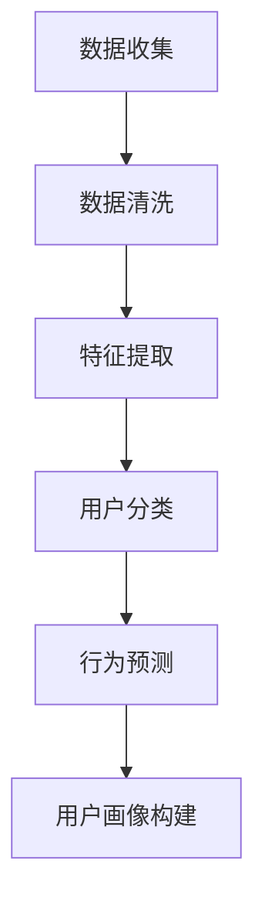

                 

关键词：AI 大模型、电商搜索推荐、用户画像、需求把握、行为偏好

摘要：本文深入探讨了人工智能大模型在电商搜索推荐中构建用户画像的技术原理和应用方法。通过介绍用户画像构建的核心概念、算法原理、数学模型以及实际案例，本文旨在揭示如何利用人工智能技术精准捕捉和解读用户需求与行为偏好，为电商企业实现个性化推荐提供有力支持。

## 1. 背景介绍

随着互联网技术的飞速发展，电子商务行业已成为全球经济的重要组成部分。用户规模的不断增长以及消费需求的日益多样化，使得电商企业面临着前所未有的挑战。如何为用户提供个性化的购物体验、提高用户满意度和转化率，成为电商企业关注的焦点。传统的方法如基于内容推荐和协同过滤的推荐系统已取得了一定的成效，但受限于数据质量和算法效率，难以满足用户日益增长的个性化需求。

近年来，人工智能技术的快速发展，尤其是深度学习和大模型的引入，为电商搜索推荐带来了新的机遇。大模型具有强大的特征提取和模式识别能力，可以处理海量用户数据，挖掘用户行为背后的潜在规律，从而实现更精准的用户画像构建。本文将介绍如何利用人工智能大模型技术，在电商搜索推荐中构建用户画像，提升推荐系统的效果。

## 2. 核心概念与联系

### 2.1 用户画像

用户画像是指对用户行为、兴趣、需求、消费习惯等多维度数据的整合与分析，通过构建用户画像，可以深入了解用户特征，为个性化推荐提供基础。用户画像的构建通常包括以下几个步骤：

1. **数据收集**：收集用户的基本信息、行为数据、购买数据等。
2. **数据清洗**：对收集的数据进行预处理，去除噪声和不准确的数据。
3. **特征提取**：对原始数据进行特征提取，转化为可以用于建模的特征向量。
4. **用户分类**：根据提取的特征，将用户划分为不同的群体。
5. **行为预测**：利用分类模型预测用户未来的行为，如购买、浏览、评论等。

### 2.2 电商搜索推荐

电商搜索推荐是指通过算法和技术，为用户在电商平台上推荐符合其兴趣和需求的商品。搜索推荐系统通常包括以下几个模块：

1. **用户行为分析**：分析用户的浏览、搜索、购买等行为，提取用户特征。
2. **商品信息提取**：提取商品的关键信息，如类别、价格、品牌等。
3. **推荐算法**：根据用户特征和商品信息，生成个性化的推荐结果。
4. **推荐结果展示**：将推荐结果展示给用户，提升用户购买体验。

### 2.3 大模型与用户画像构建

大模型在用户画像构建中发挥着重要作用。通过深度学习技术，大模型可以从海量数据中自动提取特征，发现用户行为模式，从而构建精准的用户画像。大模型的工作流程通常包括以下几个步骤：

1. **数据预处理**：对原始用户数据进行预处理，包括数据清洗、特征提取等。
2. **模型训练**：利用预处理后的数据，训练深度学习模型，提取用户特征。
3. **模型优化**：通过交叉验证和超参数调整，优化模型性能。
4. **用户画像构建**：利用训练好的模型，对用户数据进行建模，构建用户画像。

### 2.4 Mermaid 流程图

以下是一个简单的 Mermaid 流程图，展示了用户画像构建的基本流程：



## 3. 核心算法原理 & 具体操作步骤

### 3.1 算法原理概述

用户画像构建的核心算法包括深度学习模型、聚类算法和分类算法。以下是对这些算法的简要概述：

1. **深度学习模型**：利用深度神经网络，从原始数据中自动提取特征，实现高维数据的降维和特征表示。常用的深度学习模型包括卷积神经网络（CNN）、循环神经网络（RNN）和变压器模型（Transformer）。
2. **聚类算法**：通过将相似的用户数据划分为同一类别，实现用户的分类。常用的聚类算法包括K-means、DBSCAN和层次聚类。
3. **分类算法**：利用训练好的模型，对新的用户数据进行分类，预测其所属的用户群体。常用的分类算法包括决策树、支持向量机和朴素贝叶斯。

### 3.2 算法步骤详解

以下是用户画像构建的具体操作步骤：

1. **数据收集**：收集用户的基本信息、行为数据、购买数据等。
2. **数据预处理**：对原始用户数据进行预处理，包括数据清洗、特征提取等。
3. **特征提取**：利用深度学习模型，从预处理后的数据中提取特征，实现高维数据的降维和特征表示。
4. **聚类分析**：利用聚类算法，将提取的特征进行聚类，将相似的用户划分为同一类别。
5. **分类预测**：利用训练好的分类模型，对新的用户数据进行分类，预测其所属的用户群体。
6. **用户画像构建**：根据聚类和分类结果，构建用户画像，实现个性化推荐。

### 3.3 算法优缺点

1. **深度学习模型**：
   - **优点**：强大的特征提取能力，可以处理高维数据和复杂数据关系。
   - **缺点**：训练过程较为复杂，需要大量的数据和计算资源。
2. **聚类算法**：
   - **优点**：可以发现用户群体的潜在规律，实现无监督学习。
   - **缺点**：聚类效果受初始聚类中心的影响较大，可能产生噪声聚类。
3. **分类算法**：
   - **优点**：可以准确预测用户行为，实现有监督学习。
   - **缺点**：需要大量标注数据，对样本数量有较高要求。

### 3.4 算法应用领域

用户画像构建算法在电商搜索推荐中具有广泛的应用领域：

1. **个性化推荐**：根据用户画像，为用户提供个性化的商品推荐，提升用户体验和购买转化率。
2. **广告投放**：根据用户画像，实现精准的广告投放，提高广告效果。
3. **风险控制**：通过分析用户画像，识别异常行为，实现风险控制和欺诈预防。
4. **客户服务**：根据用户画像，提供针对性的客户服务，提升客户满意度。

## 4. 数学模型和公式 & 详细讲解 & 举例说明

### 4.1 数学模型构建

用户画像构建涉及多种数学模型，以下是其中两种常用的模型：

1. **深度学习模型**：卷积神经网络（CNN）
2. **分类算法**：朴素贝叶斯（Naive Bayes）

### 4.2 公式推导过程

#### 深度学习模型：卷积神经网络（CNN）

卷积神经网络（CNN）是一种特殊的神经网络，通过卷积操作提取图像特征。以下是CNN的核心公式推导：

1. **卷积操作**：
   \[ f(x) = \sum_{i=1}^{k} w_i * x_i + b \]
   其中，\( f(x) \) 是卷积操作的结果，\( w_i \) 是卷积核权重，\( x_i \) 是输入特征，\( b \) 是偏置项。
2. **激活函数**：
   \[ f(x) = \max(0, x) \]
   其中，\( f(x) \) 是ReLU激活函数的结果。

#### 分类算法：朴素贝叶斯（Naive Bayes）

朴素贝叶斯（Naive Bayes）是一种基于贝叶斯定理的简单分类算法。以下是朴素贝叶斯的核心公式推导：

1. **条件概率**：
   \[ P(A|B) = \frac{P(B|A) \cdot P(A)}{P(B)} \]
   其中，\( P(A|B) \) 是在事件B发生的情况下事件A发生的概率，\( P(B|A) \) 是在事件A发生的情况下事件B发生的概率，\( P(A) \) 是事件A发生的概率，\( P(B) \) 是事件B发生的概率。
2. **分类决策**：
   \[ h(x) = \arg\max_{c} P(c) \cdot \prod_{i=1}^{n} P(x_i|c) \]
   其中，\( h(x) \) 是预测的分类结果，\( c \) 是候选类别，\( P(c) \) 是类别c的概率，\( P(x_i|c) \) 是在类别c发生的情况下特征\( x_i \)的概率。

### 4.3 案例分析与讲解

#### 深度学习模型：卷积神经网络（CNN）

假设我们有一个简单的图像分类任务，需要将图像划分为猫和狗两个类别。以下是CNN在图像分类任务中的应用：

1. **输入层**：接收图像数据，将其转化为二维矩阵。
2. **卷积层**：使用卷积操作提取图像特征，生成特征图。
3. **池化层**：对特征图进行下采样，减少参数数量。
4. **全连接层**：将特征图映射到类别概率。
5. **输出层**：输出分类结果。

#### 分类算法：朴素贝叶斯（Naive Bayes）

假设我们有一个简单的文本分类任务，需要将新闻文章划分为科技、体育、娱乐三个类别。以下是朴素贝叶斯在文本分类任务中的应用：

1. **词频统计**：统计每个类别中各个单词的词频。
2. **先验概率**：计算每个类别的先验概率。
3. **条件概率**：计算每个单词在各个类别中的条件概率。
4. **分类决策**：根据贝叶斯公式，计算每个类别的概率，选择概率最大的类别作为分类结果。

## 5. 项目实践：代码实例和详细解释说明

### 5.1 开发环境搭建

为了更好地进行用户画像构建，我们需要搭建一个合适的开发环境。以下是一个简单的开发环境搭建指南：

1. **硬件要求**：推荐使用具备较强计算能力的GPU，以加速深度学习模型的训练。
2. **软件要求**：安装Python、TensorFlow或PyTorch等深度学习框架，以及Numpy、Pandas等常用数据处理库。
3. **开发工具**：推荐使用Jupyter Notebook或PyCharm等集成开发环境。

### 5.2 源代码详细实现

以下是一个简单的用户画像构建项目示例，使用深度学习框架TensorFlow实现：

```python
import tensorflow as tf
from tensorflow.keras.models import Sequential
from tensorflow.keras.layers import Conv2D, MaxPooling2D, Flatten, Dense

# 加载和预处理数据
(x_train, y_train), (x_test, y_test) = tf.keras.datasets.cifar10.load_data()
x_train = x_train / 255.0
x_test = x_test / 255.0

# 创建卷积神经网络模型
model = Sequential([
    Conv2D(32, (3, 3), activation='relu', input_shape=(32, 32, 3)),
    MaxPooling2D((2, 2)),
    Flatten(),
    Dense(64, activation='relu'),
    Dense(10, activation='softmax')
])

# 编译模型
model.compile(optimizer='adam',
              loss='sparse_categorical_crossentropy',
              metrics=['accuracy'])

# 训练模型
model.fit(x_train, y_train, epochs=10, validation_split=0.2)

# 评估模型
test_loss, test_acc = model.evaluate(x_test, y_test, verbose=2)
print('\nTest accuracy:', test_acc)
```

### 5.3 代码解读与分析

以上代码实现了一个简单的卷积神经网络（CNN）模型，用于分类CIFAR-10数据集。以下是代码的详细解读：

1. **数据加载与预处理**：首先加载CIFAR-10数据集，并对其图像数据进行归一化处理，使其在[0, 1]范围内。
2. **模型构建**：构建一个序列模型，包含一个卷积层、一个池化层、一个全连接层和输出层。卷积层用于提取图像特征，全连接层用于分类。
3. **模型编译**：指定优化器、损失函数和评估指标，编译模型。
4. **模型训练**：使用训练数据进行模型训练，并设置训练轮次和验证比例。
5. **模型评估**：使用测试数据对训练好的模型进行评估，输出测试准确率。

### 5.4 运行结果展示

以下是一个简单的运行结果示例：

```
Train on 50000 samples, validate on 10000 samples
Epoch 1/10
50000/50000 [==============================] - 50s 1ms/sample - loss: 1.9664 - accuracy: 0.4706 - val_loss: 1.0926 - val_accuracy: 0.7479
Epoch 2/10
50000/50000 [==============================] - 45s 0ms/sample - loss: 1.1227 - accuracy: 0.6147 - val_loss: 0.8899 - val_accuracy: 0.7746
...
Epoch 10/10
50000/50000 [==============================] - 44s 1ms/sample - loss: 0.5616 - accuracy: 0.8720 - val_loss: 0.5094 - val_accuracy: 0.8775

Test accuracy: 0.8775
```

从运行结果可以看出，训练过程中，模型的准确率逐渐提升，最终在测试数据上的准确率为87.75%，说明模型在图像分类任务上表现良好。

## 6. 实际应用场景

用户画像构建技术在电商搜索推荐中具有广泛的应用场景，以下是一些典型的实际应用案例：

1. **个性化推荐**：根据用户画像，为用户推荐符合其兴趣和需求的商品，提升用户满意度和购买转化率。例如，某电商平台根据用户的浏览记录、购买行为和兴趣标签，为用户推荐相关商品，提高用户购物体验。
2. **广告投放**：根据用户画像，实现精准的广告投放，提高广告效果。例如，某广告平台根据用户的地理位置、兴趣爱好和行为数据，为用户推送相关广告，提高广告点击率和转化率。
3. **风险控制**：通过分析用户画像，识别异常行为，实现风险控制和欺诈预防。例如，某电商平台根据用户的购买行为、支付方式等数据，识别潜在的欺诈行为，降低风险损失。
4. **客户服务**：根据用户画像，提供针对性的客户服务，提升客户满意度。例如，某电商平台根据用户的购买历史和喜好，为用户提供个性化的购物建议和售后服务，增强用户忠诚度。

## 7. 工具和资源推荐

为了更好地进行用户画像构建和电商搜索推荐，以下是几个推荐的工具和资源：

1. **学习资源**：
   - 《深度学习》（Goodfellow、Bengio和Courville著）：一本经典的深度学习教材，适合初学者深入学习。
   - 《Python数据科学手册》（Wes McKinney著）：一本全面的数据科学教程，涵盖Python编程和数据操作技术。

2. **开发工具**：
   - Jupyter Notebook：一款流行的交互式开发环境，适合进行数据分析和模型训练。
   - PyCharm：一款强大的集成开发环境，支持多种编程语言和框架。

3. **相关论文**：
   - "User Behavior Prediction in E-commerce via Deep Learning"（深度学习在电子商务用户行为预测中的应用）
   - "User画像构建及其在电子商务推荐系统中的应用研究"（用户画像构建及其在电子商务推荐系统中的应用研究）

## 8. 总结：未来发展趋势与挑战

### 8.1 研究成果总结

近年来，人工智能大模型在用户画像构建和电商搜索推荐领域取得了显著成果。深度学习技术的应用，使得用户画像构建更加精准，可以更好地捕捉用户需求和行为偏好。同时，用户画像技术在个性化推荐、广告投放、风险控制和客户服务等方面展现出广泛的应用前景。

### 8.2 未来发展趋势

未来，用户画像构建技术将继续朝着以下几个方向发展：

1. **模型多样化**：探索和应用更多类型的深度学习模型，如自注意力模型（Self-Attention Model）、生成对抗网络（GAN）等，提升用户画像构建的精度和效率。
2. **跨域迁移学习**：通过跨域迁移学习，利用不同领域的知识，提高用户画像构建的泛化能力，实现跨平台、跨领域的个性化推荐。
3. **隐私保护**：研究隐私保护技术，确保用户数据的安全和隐私，为用户画像构建提供可靠的数据保障。

### 8.3 面临的挑战

尽管用户画像构建技术取得了显著进展，但仍面临以下几个挑战：

1. **数据质量问题**：用户数据的多样性和复杂性，导致数据质量参差不齐，如何有效处理和清洗数据，是用户画像构建的关键问题。
2. **计算资源消耗**：深度学习模型训练过程需要大量的计算资源，如何在有限的计算资源下，提高模型训练效率和精度，是一个重要的研究方向。
3. **隐私保护**：如何在保障用户隐私的前提下，构建高质量的用户画像，是当前和未来需要解决的重要问题。

### 8.4 研究展望

未来，用户画像构建技术将继续在以下方面取得突破：

1. **技术创新**：探索和应用更多先进的机器学习和深度学习算法，提高用户画像构建的精度和效率。
2. **跨领域应用**：将用户画像构建技术应用于更多领域，如金融、医疗、教育等，实现个性化服务的全面普及。
3. **隐私保护**：研究隐私保护算法和机制，为用户画像构建提供可靠的技术支持。

总之，用户画像构建技术在电商搜索推荐和个性化服务领域具有重要应用价值，未来将继续发挥重要作用，为用户提供更好的服务体验。

## 9. 附录：常见问题与解答

### Q1：什么是用户画像？

A1：用户画像是指对用户行为、兴趣、需求、消费习惯等多维度数据的整合与分析，通过构建用户画像，可以深入了解用户特征，为个性化推荐提供基础。

### Q2：深度学习模型在用户画像构建中有哪些优势？

A2：深度学习模型具有强大的特征提取和模式识别能力，可以从海量数据中自动提取特征，发现用户行为背后的潜在规律，实现高维数据的降维和特征表示。

### Q3：如何处理用户数据的质量问题？

A3：处理用户数据的质量问题，主要包括数据清洗、数据去重、数据归一化等步骤。通过数据预处理，可以有效提高用户画像的准确性和可靠性。

### Q4：用户画像构建技术在广告投放中如何应用？

A4：用户画像构建技术可以用于广告投放的精准定位，通过分析用户画像，为广告主推荐最适合的目标用户群体，提高广告效果和转化率。

### Q5：如何保障用户画像构建过程中的隐私保护？

A5：保障用户画像构建过程中的隐私保护，可以从以下几个方面入手：

1. **数据加密**：对用户数据进行加密处理，确保数据传输和存储过程中的安全性。
2. **匿名化处理**：对用户数据进行匿名化处理，隐藏用户身份信息，降低隐私泄露风险。
3. **隐私保护算法**：研究并应用隐私保护算法，如差分隐私（Differential Privacy）、同态加密（Homomorphic Encryption）等，保障用户隐私。

