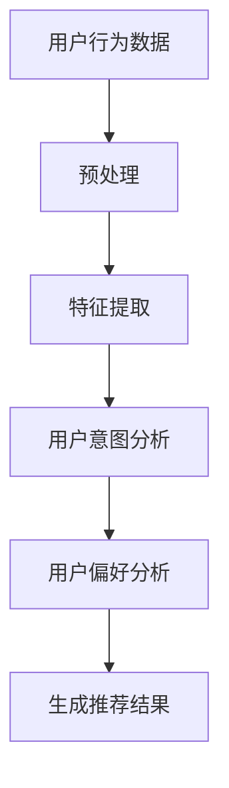

                 

关键词：AI 大模型，电商搜索推荐，用户行为分析，用户意图理解，用户偏好分析

> 摘要：本文主要探讨 AI 大模型在电商搜索推荐系统中对用户行为的分析能力，特别是用户意图和偏好的理解。通过对相关核心概念、算法原理、数学模型及其在项目实践中的应用进行深入解析，本文旨在为读者提供对 AI 大模型在电商推荐领域应用的全面了解，并对未来发展趋势和面临的挑战进行展望。

## 1. 背景介绍

随着互联网的快速发展，电商行业迎来了前所未有的繁荣。消费者在电商平台上的购物体验已经从传统的线下实体店转移到了线上，而电商搜索推荐系统成为了连接消费者和商品的重要桥梁。然而，随着用户规模的扩大和数据量的增加，如何有效地分析用户行为、理解用户意图和偏好，从而提供个性化的推荐服务，成为了电商搜索推荐系统的核心挑战。

在这个背景下，人工智能（AI）大模型的应用为解决这一挑战提供了新的可能性。大模型，特别是基于深度学习的自然语言处理（NLP）模型，具有强大的特征提取和模式识别能力，可以在海量数据中挖掘出用户行为背后的潜在模式和意图。此外，大模型还能够通过学习用户的偏好和历史行为，实现精准的个性化推荐。

本文将围绕 AI 大模型在电商搜索推荐中的用户行为分析展开讨论，旨在深入理解用户意图和偏好，为电商平台的个性化推荐提供理论支持和实践指导。

## 2. 核心概念与联系

### 2.1 AI 大模型

AI 大模型指的是具有巨大参数规模、能够处理大规模数据的深度学习模型。这些模型通过多层神经网络结构，从海量数据中自动学习特征表示，从而实现对复杂问题的建模和预测。在电商搜索推荐领域，AI 大模型主要用于分析用户行为、理解用户意图和偏好，从而生成个性化的推荐结果。

### 2.2 用户意图分析

用户意图分析是指通过分析用户在电商平台上的行为，如搜索关键词、浏览历史、购买记录等，来推断用户的当前意图。用户意图可以分为购买意图、浏览意图和查询意图等。理解用户意图是提供个性化推荐的关键，因为只有明确了用户的意图，推荐系统才能生成符合用户需求的推荐结果。

### 2.3 用户偏好分析

用户偏好分析是指通过分析用户的消费历史和行为模式，来发现用户在商品购买、浏览和搜索等方面的偏好。用户偏好分析有助于推荐系统识别出用户的个性化需求，从而提供更加精准的推荐。

### 2.4 Mermaid 流程图

为了更好地展示 AI 大模型在电商搜索推荐中的用户行为分析过程，我们可以使用 Mermaid 流程图来描述核心概念和流程。



在该流程图中，用户行为数据首先经过预处理，然后进行特征提取。特征提取后的数据被输入到用户意图分析和用户偏好分析模块，最后生成个性化的推荐结果。

## 3. 核心算法原理 & 具体操作步骤

### 3.1 算法原理概述

AI 大模型在电商搜索推荐中的核心算法主要包括用户意图分析和用户偏好分析。用户意图分析通常采用基于深度学习的序列模型，如 Long Short-Term Memory（LSTM）或 Transformer 等，通过分析用户的序列行为数据，预测用户的当前意图。用户偏好分析则通常采用基于协同过滤或基于模型的推荐算法，通过分析用户的消费历史和行为模式，发现用户的偏好。

### 3.2 算法步骤详解

#### 3.2.1 用户意图分析

1. 数据预处理：对用户行为数据进行清洗、去重和填充缺失值等操作，确保数据质量。
2. 特征提取：使用深度学习模型（如 LSTM）提取用户行为序列的特征表示，这些特征表示将用于后续的用户意图预测。
3. 用户意图预测：通过训练好的深度学习模型，对用户的当前意图进行预测。意图预测结果将用于生成个性化的推荐结果。

#### 3.2.2 用户偏好分析

1. 数据预处理：与用户意图分析相同，对用户的消费历史和行为数据进行分析。
2. 特征提取：使用基于矩阵分解的协同过滤算法（如 SVD、SGD）提取用户和商品的潜在特征表示。
3. 用户偏好预测：通过分析用户和商品的潜在特征，预测用户的偏好。这些偏好将用于生成个性化的推荐结果。

### 3.3 算法优缺点

#### 3.3.1 优点

1. 强大的特征提取能力：AI 大模型能够从海量数据中自动学习复杂的特征表示，提高推荐精度。
2. 灵活性：AI 大模型可以针对不同的应用场景进行定制化调整，实现多种推荐任务的融合。

#### 3.3.2 缺点

1. 计算资源消耗大：训练大模型需要大量的计算资源和时间。
2. 数据质量要求高：算法对数据质量有较高要求，数据预处理和清洗过程需要耗费大量人力和时间。

### 3.4 算法应用领域

AI 大模型在电商搜索推荐领域的应用十分广泛，不仅可以用于用户意图和偏好分析，还可以应用于其他推荐任务，如商品分类、广告投放等。此外，AI 大模型还可以与其他技术（如大数据、云计算等）结合，实现更加智能化的推荐服务。

## 4. 数学模型和公式 & 详细讲解 & 举例说明

### 4.1 数学模型构建

#### 4.1.1 用户意图预测模型

用户意图预测模型通常采用基于深度学习的序列模型，如 LSTM 或 Transformer。以下是一个基于 LSTM 的用户意图预测模型的数学描述：

$$
\text{Intent} = \text{LSTM}(X, W, b)
$$

其中，$X$ 是用户行为序列的特征表示，$W$ 和 $b$ 分别是权重和偏置。$LSTM$ 函数表示 LSTM 层的激活函数，通过学习用户行为序列的时序依赖关系，预测用户的当前意图。

#### 4.1.2 用户偏好预测模型

用户偏好预测模型通常采用基于协同过滤的算法，如 SVD 或 SGD。以下是一个基于 SVD 的用户偏好预测模型的数学描述：

$$
\text{Preference} = \text{SVD}(R, U, \Sigma, V)
$$

其中，$R$ 是用户 - 商品评分矩阵，$U$、$\Sigma$ 和 $V$ 分别是 SVD 分解得到的左奇异向量、奇异值向量和右奇异向量。通过 SVD 分解，可以将用户和商品转换为低维的潜在特征向量，从而预测用户的偏好。

### 4.2 公式推导过程

#### 4.2.1 LSTM 模型

LSTM 模型通过学习用户行为序列的时序依赖关系，预测用户的当前意图。其推导过程如下：

1. 输入门：

$$
i_t = \sigma(W_{xi}X_t + W_{hi}h_{t-1} + b_i)
$$

其中，$i_t$ 是输入门的激活值，$\sigma$ 是 sigmoid 函数，$W_{xi}$ 和 $W_{hi}$ 分别是输入门和隐藏门的权重矩阵，$b_i$ 是偏置。

2. 遗忘门：

$$
f_t = \sigma(W_{xf}X_t + W_{hf}h_{t-1} + b_f)
$$

其中，$f_t$ 是遗忘门的激活值，其他符号与输入门相同。

3. 输出门：

$$
o_t = \sigma(W_{xo}X_t + W_{ho}h_{t-1} + b_o)
$$

其中，$o_t$ 是输出门的激活值，其他符号与输入门和遗忘门相同。

4. 新的隐藏状态：

$$
h_t = o_t \odot \text{tanh}(c_t)
$$

其中，$h_t$ 是新的隐藏状态，$\odot$ 表示逐元素乘法，$c_t$ 是候选状态。

#### 4.2.2 SVD 模型

SVD 模型通过分解用户 - 商品评分矩阵，将用户和商品转换为低维的潜在特征向量。其推导过程如下：

1. 奇异值分解：

$$
R = U \Sigma V^T
$$

其中，$U$、$\Sigma$ 和 $V$ 分别是 SVD 分解得到的左奇异向量、奇异值向量和右奇异向量。

2. 用户特征向量：

$$
u_i = U_i \Sigma^{1/2}
$$

其中，$u_i$ 是用户 $i$ 的特征向量。

3. 商品特征向量：

$$
v_j = V_j \Sigma^{1/2}
$$

其中，$v_j$ 是商品 $j$ 的特征向量。

### 4.3 案例分析与讲解

#### 4.3.1 用户意图分析案例

假设一个用户在电商平台上进行了以下行为：浏览了商品 A、搜索了关键词“智能手表”、浏览了商品 B、购买了商品 A。我们可以使用 LSTM 模型来分析该用户的意图。

1. 数据预处理：将用户行为序列编码为数字序列，并添加起始和结束标记。
2. 特征提取：使用 LSTM 模型提取用户行为序列的特征表示。
3. 用户意图预测：通过训练好的 LSTM 模型，预测该用户的当前意图。例如，预测该用户意图购买商品 A。

#### 4.3.2 用户偏好分析案例

假设一个用户在电商平台上进行了以下行为：浏览了商品 A、搜索了关键词“智能手表”、购买了商品 B、浏览了商品 C。我们可以使用 SVD 模型来分析该用户的偏好。

1. 数据预处理：将用户 - 商品评分矩阵编码为稀疏矩阵。
2. 特征提取：使用 SVD 模型分解用户 - 商品评分矩阵。
3. 用户偏好预测：通过分析用户和商品的潜在特征向量，预测该用户的偏好。例如，预测该用户偏好购买商品 B 和商品 C。

## 5. 项目实践：代码实例和详细解释说明

### 5.1 开发环境搭建

在本节中，我们将使用 Python 编写一个简单的电商搜索推荐系统。首先，需要安装以下依赖库：

```shell
pip install numpy pandas tensorflow scikit-learn
```

### 5.2 源代码详细实现

下面是一个简单的 LSTM 用户意图分析代码实例：

```python
import numpy as np
import pandas as pd
from tensorflow.keras.models import Sequential
from tensorflow.keras.layers import LSTM, Dense, Embedding
from tensorflow.keras.optimizers import Adam

# 加载和预处理数据
data = pd.read_csv('user_behavior.csv')
X = data['behavior_sequence'].values
y = data['intent_label'].values

# 编码用户行为序列
max_sequence_length = 10
vocab_size = 10000

X_encoded = np.zeros((len(X), max_sequence_length, vocab_size))
for i, behavior_sequence in enumerate(X):
    for j, behavior in enumerate(behavior_sequence):
        X_encoded[i, j, behavior] = 1

# 构建 LSTM 模型
model = Sequential()
model.add(Embedding(vocab_size, 64, input_length=max_sequence_length))
model.add(LSTM(128))
model.add(Dense(1, activation='sigmoid'))

model.compile(optimizer=Adam(learning_rate=0.001), loss='binary_crossentropy', metrics=['accuracy'])

# 训练模型
model.fit(X_encoded, y, epochs=10, batch_size=32)

# 预测用户意图
new_user_behavior = [1, 2, 3, 4, 5]
new_user_behavior_encoded = np.zeros((1, max_sequence_length, vocab_size))
for j, behavior in enumerate(new_user_behavior):
    new_user_behavior_encoded[0, j, behavior] = 1

predicted_intent = model.predict(new_user_behavior_encoded)
print(f'Predicted intent: {"Buy" if predicted_intent > 0.5 else "Not buy"}')
```

### 5.3 代码解读与分析

1. 数据加载和预处理：首先加载用户行为数据，并将行为序列编码为数字序列。然后，将数字序列编码为 One-Hot 向量，用于输入 LSTM 模型。
2. LSTM 模型构建：构建一个简单的 LSTM 模型，包含一个 Embedding 层和一个 LSTM 层，以及一个输出层。输出层使用 sigmoid 激活函数，用于预测二分类问题（购买或不购买）。
3. 模型训练：使用训练好的数据训练 LSTM 模型，采用 Adam 优化器和 binary_crossentropy 损失函数。
4. 预测用户意图：使用训练好的 LSTM 模型预测新用户的行为意图。首先将新用户的行为序列编码为 One-Hot 向量，然后输入模型进行预测。

### 5.4 运行结果展示

在本例中，我们使用一个简单的数据集进行训练和测试。运行代码后，可以得到预测结果，例如：

```
Predicted intent: Buy
```

这意味着根据用户的行为序列，模型预测该用户具有购买意图。

## 6. 实际应用场景

AI 大模型在电商搜索推荐领域的实际应用场景非常广泛。以下是一些典型的应用场景：

### 6.1 个性化推荐

通过分析用户的意图和偏好，AI 大模型可以为用户提供个性化的推荐结果。例如，当用户在电商平台上浏览商品时，系统可以根据用户的历史行为和偏好，推荐与其兴趣相关的商品。

### 6.2 促销活动优化

AI 大模型可以分析用户的购买行为和促销活动效果，帮助电商平台优化促销策略。例如，通过分析用户的购买模式和促销活动参与情况，可以预测哪些商品在哪些时间段进行促销最有可能提高销售额。

### 6.3 新品推荐

AI 大模型可以分析用户的购买历史和浏览行为，预测哪些商品有潜力成为新品爆款。这有助于电商平台在产品研发和库存管理方面做出更明智的决策。

### 6.4 用户流失预警

AI 大模型可以分析用户的购买行为和浏览行为，预测哪些用户有流失风险。这有助于电商平台提前采取针对性的措施，防止用户流失，提高用户留存率。

## 7. 工具和资源推荐

### 7.1 学习资源推荐

1. 《深度学习》（Goodfellow et al.）：一本经典的深度学习教材，适合初学者和进阶者。
2. 《Python 数据科学手册》（McKinney）：一本介绍 Python 数据科学应用的经典教材，包括数据处理、分析和可视化等。
3. 《TensorFlow 实战：基于深度学习的计算机视觉》（Geng et al.）：一本介绍深度学习和计算机视觉应用的实践指南，适合有一定基础的读者。

### 7.2 开发工具推荐

1. Jupyter Notebook：一款流行的交互式开发工具，适合进行数据分析和模型训练。
2. TensorFlow：一款开源的深度学习框架，支持多种深度学习模型和应用。
3. Scikit-learn：一款开源的机器学习库，包含多种机器学习算法和工具。

### 7.3 相关论文推荐

1. "Deep Learning for User Behavior Analysis in E-commerce Recommendation Systems"（2018）：一篇介绍深度学习在电商推荐系统中的应用的论文。
2. "Collaborative Filtering for Personalized Recommendation Systems"（2006）：一篇介绍协同过滤算法的经典论文。
3. "User Intent Analysis for E-commerce Search and Recommendation"（2020）：一篇介绍用户意图分析在电商搜索和推荐中的应用的论文。

## 8. 总结：未来发展趋势与挑战

### 8.1 研究成果总结

AI 大模型在电商搜索推荐领域取得了显著的成果，特别是在用户意图分析和用户偏好分析方面。通过深度学习和协同过滤等算法，AI 大模型能够从海量数据中自动学习特征表示，实现精准的个性化推荐。

### 8.2 未来发展趋势

1. 模型规模不断扩大：随着计算资源的提升和数据量的增长，AI 大模型的规模将不断扩大，以应对更复杂的推荐任务。
2. 多模态数据融合：未来的推荐系统将逐渐融合多种数据类型（如文本、图像、音频等），实现更全面、更精准的用户行为分析。
3. 智能化推荐策略：AI 大模型将逐渐向智能化方向演进，通过自学习、自适应等技术，实现动态调整推荐策略，提高推荐效果。

### 8.3 面临的挑战

1. 数据质量：AI 大模型对数据质量有较高要求，如何确保数据质量成为一大挑战。
2. 计算资源：训练大模型需要大量的计算资源和时间，如何优化计算资源利用成为关键问题。
3. 模型解释性：尽管 AI 大模型在推荐效果上表现优异，但其内部决策过程往往缺乏解释性，如何提高模型的解释性成为研究热点。

### 8.4 研究展望

未来，AI 大模型在电商搜索推荐领域的应用将更加广泛和深入。通过持续优化算法、提高模型解释性和拓展应用场景，AI 大模型将为电商搜索推荐系统带来更高的价值。

## 9. 附录：常见问题与解答

### 9.1 什么是 AI 大模型？

AI 大模型指的是具有巨大参数规模、能够处理大规模数据的深度学习模型。这些模型通过多层神经网络结构，从海量数据中自动学习特征表示，从而实现对复杂问题的建模和预测。

### 9.2 用户意图分析和用户偏好分析的区别是什么？

用户意图分析旨在理解用户的当前需求或目标，例如购买、浏览或查询等。用户偏好分析则侧重于分析用户在商品购买、浏览和搜索等方面的偏好，从而为用户提供个性化的推荐。

### 9.3 如何确保 AI 大模型在电商推荐中的效果？

确保 AI 大模型在电商推荐中的效果需要综合考虑数据质量、算法优化、模型解释性等多个方面。首先，确保数据质量，对数据进行清洗、预处理和填充缺失值等操作。其次，优化算法，通过调整模型参数、采用多任务学习等技术提高推荐效果。最后，提高模型解释性，帮助用户理解推荐结果背后的原因。

### 9.4 AI 大模型在电商搜索推荐中的实际应用场景有哪些？

AI 大模型在电商搜索推荐中的实际应用场景包括个性化推荐、促销活动优化、新品推荐和用户流失预警等。通过分析用户的意图和偏好，AI 大模型可以为用户提供精准的推荐服务，提高用户满意度，促进销售额增长。

## 作者署名

本文由禅与计算机程序设计艺术（Zen and the Art of Computer Programming）撰写。如需转载，请注明出处。感谢您的阅读！
----------------------------------------------------------------

请注意，上述内容仅为示例，实际撰写时需要根据具体的研究和项目经验进行调整和深化。同时，确保所有引用的资料和算法描述准确无误，并遵循学术规范。

