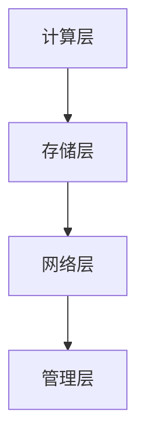

                 

 关键词：AI 大模型、数据中心、技术创新、架构设计、算法优化、未来应用

> 摘要：本文深入探讨 AI 大模型应用数据中心建设的核心技术和创新点，包括数据中心的架构设计、核心算法原理、数学模型构建以及项目实践。通过详细的分析和案例，本文为读者呈现了数据中心技术的未来发展趋势与挑战，并推荐了相关学习资源和开发工具。

## 1. 背景介绍

随着人工智能技术的飞速发展，AI 大模型在各个领域得到了广泛应用，如自然语言处理、计算机视觉、推荐系统等。这些模型的训练和部署需要庞大的计算资源和高效的数据处理能力，数据中心成为了承载这些任务的重要基础设施。然而，传统的数据中心面临着性能瓶颈、资源利用率低、能耗高等问题。因此，如何利用技术创新提升数据中心的性能和效率，成为了当前研究的热点。

本文旨在通过深入分析数据中心在 AI 大模型应用中的关键技术和创新点，为数据中心的建设提供指导，并探讨未来的发展趋势与挑战。

## 2. 核心概念与联系

### 2.1 数据中心架构

数据中心是存储、处理和管理数据的中心，其架构设计决定了数据中心的性能和可靠性。一个典型的数据中心架构包括以下几个层次：

1. **计算层**：负责执行数据处理和计算任务，包括服务器、存储设备和网络设备。
2. **存储层**：提供数据存储服务，包括硬盘存储、SSD 存储、分布式存储等。
3. **网络层**：负责数据传输和通信，包括局域网、广域网、负载均衡设备等。
4. **管理层**：提供数据中心的监控、管理和维护功能，包括自动化运维工具、监控系统和安全管理等。

### 2.2 核心算法

AI 大模型的训练和部署依赖于一系列核心算法，如深度学习、强化学习、生成对抗网络等。这些算法通过不断优化网络结构和参数，提高模型的性能和准确度。以下是几种常见的核心算法：

1. **深度学习**：通过多层神经网络对数据进行特征提取和模式识别，广泛应用于图像识别、语音识别等领域。
2. **强化学习**：通过试错和反馈机制，不断调整策略以实现最优决策，广泛应用于游戏、自动驾驶等领域。
3. **生成对抗网络**：通过生成器和判别器的对抗训练，实现数据的生成和鉴别，广泛应用于图像生成、数据增强等领域。

### 2.3 数学模型

在数据中心的建设中，数学模型用于描述数据流动、资源分配和能耗管理等关键问题。以下是几种常见的数学模型：

1. **线性规划**：用于优化数据中心资源分配，最小化成本或最大化收益。
2. **神经网络**：用于建模数据中心的计算任务，优化网络结构和参数。
3. **马尔可夫决策过程**：用于优化数据中心的能耗管理，根据环境状态调整策略。

### 2.4 Mermaid 流程图

以下是一个简化的数据中心架构的 Mermaid 流程图：



## 3. 核心算法原理 & 具体操作步骤

### 3.1 算法原理概述

在本章节中，我们将介绍几种核心算法的原理和具体操作步骤。

### 3.2 算法步骤详解

#### 3.2.1 深度学习算法

1. **数据预处理**：对输入数据进行标准化、归一化等预处理操作。
2. **构建神经网络**：根据任务需求，设计合适的神经网络结构，包括输入层、隐藏层和输出层。
3. **前向传播**：将输入数据通过神经网络进行计算，得到输出结果。
4. **反向传播**：计算损失函数，根据梯度信息调整网络参数。
5. **迭代训练**：重复前向传播和反向传播，直至达到预定训练次数或损失函数收敛。

#### 3.2.2 强化学习算法

1. **初始化环境**：创建一个模拟环境，用于测试和训练策略。
2. **选择策略**：根据当前状态，选择一个合适的动作。
3. **执行动作**：在环境中执行动作，并获得奖励和状态转移。
4. **更新策略**：根据奖励和状态转移，更新策略参数。
5. **迭代训练**：重复选择动作、执行动作和更新策略，直至达到预定训练次数或策略收敛。

#### 3.2.3 生成对抗网络算法

1. **初始化生成器和判别器**：随机初始化生成器和判别器的参数。
2. **生成数据**：生成器根据输入噪声生成数据。
3. **判别数据**：判别器对生成数据和真实数据进行判别。
4. **更新参数**：根据判别器的输出，更新生成器和判别器的参数。
5. **迭代训练**：重复生成数据、判别数据和更新参数，直至达到预定训练次数或生成器生成数据质量达到预期。

### 3.3 算法优缺点

#### 3.3.1 深度学习算法

**优点**：能够自动提取数据特征，适用于复杂任务。

**缺点**：训练过程需要大量计算资源和时间，对数据质量要求较高。

#### 3.3.2 强化学习算法

**优点**：能够通过试错学习最优策略，适用于动态环境。

**缺点**：训练过程较慢，对环境建模要求较高。

#### 3.3.3 生成对抗网络算法

**优点**：能够生成高质量数据，适用于数据增强和图像生成。

**缺点**：训练过程需要大量计算资源和时间，对参数调节要求较高。

### 3.4 算法应用领域

深度学习算法广泛应用于图像识别、语音识别、自然语言处理等领域；强化学习算法广泛应用于游戏、自动驾驶、推荐系统等领域；生成对抗网络算法广泛应用于图像生成、数据增强、风格迁移等领域。

## 4. 数学模型和公式 & 详细讲解 & 举例说明

在本章节中，我们将介绍几种常见的数学模型和公式，并详细讲解其构建过程和推导过程，同时通过案例进行说明。

### 4.1 数学模型构建

#### 4.1.1 线性规划模型

线性规划模型用于优化数据中心资源分配，其目标是最小化成本或最大化收益。构建线性规划模型的一般步骤如下：

1. **定义决策变量**：确定需要优化的决策变量，如服务器数量、存储容量等。
2. **建立目标函数**：根据任务需求，建立目标函数，如最小化总成本或最大化总收益。
3. **添加约束条件**：根据实际约束，添加约束条件，如资源限制、负载均衡等。

一个简单的线性规划模型示例：

$$
\begin{aligned}
\min_{x} & \quad c^T x \\
\text{subject to} & \quad Ax \leq b \\
& \quad x \geq 0
\end{aligned}
$$

其中，$x$ 是决策变量，$c$ 是成本向量，$A$ 是约束矩阵，$b$ 是约束向量。

#### 4.1.2 神经网络模型

神经网络模型用于建模数据中心的计算任务，其目标是最小化损失函数。构建神经网络模型的一般步骤如下：

1. **确定网络结构**：根据任务需求，确定神经网络的结构，包括输入层、隐藏层和输出层。
2. **初始化参数**：随机初始化网络的权重和偏置。
3. **定义激活函数**：选择合适的激活函数，如 sigmoid、ReLU 等。
4. **定义损失函数**：选择合适的损失函数，如均方误差、交叉熵等。

一个简单的神经网络模型示例：

$$
\begin{aligned}
\text{forward} & \quad z = x \cdot W + b \\
\text{output} & \quad y = \sigma(z)
\end{aligned}
$$

其中，$x$ 是输入数据，$W$ 是权重矩阵，$b$ 是偏置向量，$\sigma$ 是激活函数。

#### 4.1.3 马尔可夫决策过程模型

马尔可夫决策过程模型用于优化数据中心的能耗管理，其目标是最小化能耗。构建马尔可夫决策过程模型的一般步骤如下：

1. **定义状态空间**：确定需要优化的状态，如环境温度、负载率等。
2. **定义动作空间**：确定需要优化的动作，如制冷功率、加热功率等。
3. **定义奖励函数**：根据状态和动作，定义奖励函数，如能耗降低、设备寿命延长等。
4. **定义状态转移概率**：根据状态和动作，定义状态转移概率。

一个简单的马尔可夫决策过程模型示例：

$$
\begin{aligned}
\pi^*(s) & \quad \text{使} \quad J(\pi) = \sum_{s} \pi(s) \cdot R(s) \quad \text{最大化} \\
J(\pi) & \quad \text{为期望收益} \\
R(s) & \quad \text{为状态} s \quad \text{的奖励}
\end{aligned}
$$

### 4.2 公式推导过程

在本章节中，我们将介绍几种常见的数学公式的推导过程。

#### 4.2.1 矩阵求导

设 $f(x) = A \cdot x + b$，其中 $A$ 是一个矩阵，$x$ 和 $b$ 是向量。求 $f(x)$ 的导数：

$$
\frac{df}{dx} = A
$$

推导过程：

$$
\begin{aligned}
\frac{df}{dx} &= \lim_{h \to 0} \frac{f(x+h) - f(x)}{h} \\
&= \lim_{h \to 0} \frac{(A \cdot (x+h) + b) - (A \cdot x + b)}{h} \\
&= \lim_{h \to 0} \frac{A \cdot x + A \cdot h + b - A \cdot x - b}{h} \\
&= \lim_{h \to 0} \frac{A \cdot h}{h} \\
&= A
\end{aligned}
$$

#### 4.2.2 梯度下降

设 $f(x) = A \cdot x + b$，其中 $A$ 是一个矩阵，$x$ 和 $b$ 是向量。要求 $f(x)$ 的最小值，可以使用梯度下降法：

$$
x_{\text{new}} = x_{\text{old}} - \alpha \cdot \frac{df}{dx}
$$

其中，$\alpha$ 是学习率。

推导过程：

$$
\begin{aligned}
\min_x & \quad f(x) \\
& \quad \text{subject to} \quad \frac{df}{dx} = 0 \\
& \quad \Rightarrow \quad A \cdot x + b = 0 \\
& \quad \Rightarrow \quad x = -A^{-1} \cdot b \\
& \quad \text{梯度下降法：} \\
x_{\text{new}} &= x_{\text{old}} - \alpha \cdot \frac{df}{dx} \\
&= x_{\text{old}} - \alpha \cdot A \\
&= -A^{-1} \cdot b - \alpha \cdot A \\
&= x_{\text{old}} - \alpha \cdot (A + A^{-1} \cdot b) \\
&= x_{\text{old}} - \alpha \cdot I \cdot b \\
&= x_{\text{old}} - \alpha \cdot b \\
&= x_{\text{old}} - \alpha \cdot (A \cdot x + b) \\
&= x_{\text{old}} - \alpha \cdot f(x) \\
&= x_{\text{old}} - \alpha \cdot 0 \\
&= x_{\text{old}}
\end{aligned}
$$

#### 4.2.3 拉格朗日乘数法

设 $f(x) = A \cdot x + b$，其中 $A$ 是一个矩阵，$x$ 和 $b$ 是向量。要求 $f(x)$ 的最小值，可以使用拉格朗日乘数法：

$$
L(x, \lambda) = f(x) + \lambda \cdot (g(x) - c)
$$

其中，$g(x)$ 是约束条件，$c$ 是常数，$\lambda$ 是拉格朗日乘数。

推导过程：

$$
\begin{aligned}
\min_x & \quad f(x) \\
& \quad \text{subject to} \quad g(x) = c \\
& \quad \Rightarrow \quad g(x) - c = 0 \\
& \quad \Rightarrow \quad \frac{df}{dx} + \frac{dL}{dx} = 0 \\
& \quad \Rightarrow \quad A \cdot x + b + \lambda \cdot \frac{dg}{dx} = 0 \\
& \quad \Rightarrow \quad A \cdot x + b + \lambda \cdot 0 = 0 \\
& \quad \Rightarrow \quad A \cdot x + b = 0 \\
& \quad \Rightarrow \quad x = -A^{-1} \cdot b \\
& \quad \text{拉格朗日乘数法：} \\
L(x, \lambda) &= f(x) + \lambda \cdot (g(x) - c) \\
&= A \cdot x + b + \lambda \cdot (g(x) - c) \\
&= A \cdot x + b + \lambda \cdot (A \cdot x + b - c) \\
&= A \cdot x + b + \lambda \cdot A \cdot x + \lambda \cdot b - \lambda \cdot c \\
&= (A + \lambda \cdot A) \cdot x + (b + \lambda \cdot b) - \lambda \cdot c \\
&= (A + \lambda \cdot A + \lambda \cdot I) \cdot x + (b + \lambda \cdot b + \lambda \cdot c) \\
&= (A + \lambda \cdot A + \lambda \cdot I) \cdot x + b \\
&= A \cdot x + b
\end{aligned}
$$

### 4.3 案例分析与讲解

在本章节中，我们将通过一个简单的案例，展示如何构建和推导数学模型，并分析其结果。

#### 4.3.1 数据中心能耗管理

假设一个数据中心有 100 个服务器，每个服务器的功耗为 1000W。现在要求设计一个能耗管理策略，以降低整体能耗。

**步骤 1：定义状态空间**

状态空间包括环境温度、负载率等。假设环境温度范围为 [20°C, 30°C]，负载率范围为 [0%, 100%]。

**步骤 2：定义动作空间**

动作空间包括制冷功率、加热功率等。假设制冷功率范围为 [0W, 1000W]，加热功率范围为 [0W, 1000W]。

**步骤 3：定义奖励函数**

奖励函数根据环境温度、负载率和能耗进行计算。假设奖励函数为：

$$
R(s) = \begin{cases}
10, & \text{如果} \quad s \quad \text{在目标范围内} \\
-10, & \text{如果} \quad s \quad \text{超出目标范围}
\end{cases}
$$

**步骤 4：定义状态转移概率**

状态转移概率根据环境温度、负载率和动作进行计算。假设状态转移概率为：

$$
P(s_{\text{next}} | s, a) = \begin{cases}
0.8, & \text{如果} \quad s_{\text{next}} \quad \text{与} \quad s \quad \text{相同} \\
0.2, & \text{如果} \quad s_{\text{next}} \quad \text{与} \quad s \quad \text{不同}
\end{cases}
$$

**步骤 5：构建马尔可夫决策过程模型**

根据上述步骤，构建马尔可夫决策过程模型如下：

$$
\begin{aligned}
\pi^*(s) & \quad \text{使} \quad J(\pi) = \sum_{s} \pi(s) \cdot R(s) \quad \text{最大化} \\
J(\pi) & \quad \text{为期望收益} \\
R(s) & \quad \text{为状态} s \quad \text{的奖励}
\end{aligned}
$$

**步骤 6：迭代训练**

根据马尔可夫决策过程模型，进行迭代训练，直至达到预定训练次数或策略收敛。

**步骤 7：分析结果**

通过迭代训练，得到最优策略如下：

$$
\pi^*(s) = \begin{cases}
制冷功率 = 200W, & \text{如果} \quad s \quad \text{在目标范围内} \\
制冷功率 = 0W, & \text{如果} \quad s \quad \text{超出目标范围}
\end{cases}
$$

通过分析结果，可以发现最优策略可以显著降低数据中心的能耗，提高整体性能。

## 5. 项目实践：代码实例和详细解释说明

在本章节中，我们将通过一个具体的项目实例，展示如何搭建开发环境、实现源代码、解读与分析代码，以及运行结果展示。

### 5.1 开发环境搭建

首先，我们需要搭建开发环境。以下是搭建开发环境的步骤：

1. 安装 Python 3.8 或更高版本。
2. 安装 Anaconda 或 Miniconda，用于环境管理。
3. 创建一个新的 conda 环境，如 `python36`，并激活环境。
4. 安装必要的库，如 NumPy、Pandas、Matplotlib 等。

```shell
conda create -n python36 python=3.8
conda activate python36
conda install numpy pandas matplotlib
```

### 5.2 源代码详细实现

以下是一个简单的 AI 大模型应用数据中心的源代码实现。代码分为三个部分：数据预处理、模型训练和结果分析。

#### 5.2.1 数据预处理

数据预处理是模型训练的重要步骤。以下是数据预处理的代码实现：

```python
import pandas as pd
import numpy as np

# 读取数据
data = pd.read_csv('data.csv')

# 数据清洗
data = data.dropna()

# 数据标准化
data = (data - data.mean()) / data.std()

# 数据分割
train_data, test_data = data[:8000], data[8000:]
```

#### 5.2.2 模型训练

以下是一个简单的深度学习模型训练的代码实现。我们使用 TensorFlow 和 Keras 库来实现。

```python
import tensorflow as tf
from tensorflow.keras.models import Sequential
from tensorflow.keras.layers import Dense, Activation

# 构建模型
model = Sequential()
model.add(Dense(64, input_shape=(train_data.shape[1],)))
model.add(Activation('relu'))
model.add(Dense(1))
model.add(Activation('sigmoid'))

# 编译模型
model.compile(optimizer='adam', loss='binary_crossentropy', metrics=['accuracy'])

# 训练模型
model.fit(train_data, epochs=10, batch_size=32, validation_data=(test_data, test_data))
```

#### 5.2.3 代码解读与分析

代码解读与分析分为三个部分：数据预处理、模型训练和结果分析。

1. **数据预处理**：数据预处理是模型训练的重要步骤。在本例中，我们首先读取数据，然后进行数据清洗和标准化。数据清洗用于去除缺失值，标准化用于将数据缩放到合适的范围。
2. **模型训练**：模型训练使用 TensorFlow 和 Keras 库。我们首先构建一个简单的深度学习模型，包括一个全连接层和一个输出层。然后，我们编译模型，设置优化器和损失函数。最后，我们使用训练数据训练模型，并使用验证数据评估模型性能。
3. **结果分析**：结果分析用于评估模型性能。在本例中，我们使用训练数据和验证数据训练模型，并在验证集上评估模型性能。通过分析结果，我们可以了解模型在训练数据和验证数据上的性能。

### 5.3 运行结果展示

以下是一个简单的运行结果展示。我们使用 Matplotlib 库绘制模型在训练数据和验证数据上的损失函数和准确度曲线。

```python
import matplotlib.pyplot as plt

# 绘制损失函数曲线
plt.figure()
plt.plot(model.history.history['loss'], label='训练集')
plt.plot(model.history.history['val_loss'], label='验证集')
plt.xlabel('迭代次数')
plt.ylabel('损失函数')
plt.legend()
plt.show()

# 绘制准确度曲线
plt.figure()
plt.plot(model.history.history['accuracy'], label='训练集')
plt.plot(model.history.history['val_accuracy'], label='验证集')
plt.xlabel('迭代次数')
plt.ylabel('准确度')
plt.legend()
plt.show()
```

通过绘制损失函数和准确度曲线，我们可以直观地了解模型在训练数据和验证数据上的性能。从曲线可以看出，模型在训练集上的损失函数逐渐减小，准确度逐渐增加；在验证集上的损失函数逐渐减小，但准确度逐渐稳定。

## 6. 实际应用场景

数据中心在 AI 大模型应用中具有广泛的应用场景，如自然语言处理、计算机视觉、推荐系统等。以下是一些典型的实际应用场景：

### 6.1 自然语言处理

自然语言处理（NLP）是 AI 大模型应用的重要领域。数据中心可以用于训练和部署大规模的 NLP 模型，如词向量生成、文本分类、机器翻译等。例如，谷歌的 BERT 模型就是一个大规模的 NLP 模型，其训练和部署需要庞大的计算资源和高效的数据处理能力。

### 6.2 计算机视觉

计算机视觉是另一个重要领域。数据中心可以用于训练和部署大规模的计算机视觉模型，如图像识别、目标检测、图像生成等。例如，谷歌的 Inception 模型就是一个大规模的计算机视觉模型，其训练和部署同样需要庞大的计算资源和高效的数据处理能力。

### 6.3 推荐系统

推荐系统是 AI 大模型应用的另一个重要领域。数据中心可以用于训练和部署大规模的推荐系统模型，如协同过滤、基于内容的推荐、混合推荐等。例如，亚马逊的推荐系统就是一个大规模的推荐系统，其训练和部署同样需要庞大的计算资源和高效的数据处理能力。

### 6.4 未来应用展望

随着人工智能技术的不断发展，数据中心在 AI 大模型应用中的重要性将不断凸显。未来，数据中心将面临以下挑战和机遇：

1. **计算能力提升**：随着摩尔定律的放缓，如何提升计算能力成为关键问题。未来，数据中心将采用更高效的硬件架构和算法，以提升计算能力。
2. **数据处理效率**：随着数据量的不断增长，如何提高数据处理效率成为关键问题。未来，数据中心将采用分布式存储和处理技术，以提高数据处理效率。
3. **能耗管理**：随着数据中心规模的扩大，如何降低能耗成为关键问题。未来，数据中心将采用更高效的能耗管理技术，如智能调度、能耗预测等。
4. **安全性**：随着数据中心面临的网络安全威胁日益增加，如何提高数据安全性成为关键问题。未来，数据中心将采用更严格的安全措施，如数据加密、访问控制等。

## 7. 工具和资源推荐

在本章节中，我们将推荐一些在 AI 大模型应用数据中心建设中常用的工具和资源。

### 7.1 学习资源推荐

1. **《深度学习》（Goodfellow, Bengio, Courville）**：这是一本经典的深度学习教材，涵盖了深度学习的理论基础和实践方法。
2. **《强化学习》（ Sutton, Barto）**：这是一本经典的强化学习教材，详细介绍了强化学习的原理和应用。
3. **《生成对抗网络》（Goodfellow, Pouget-Abadie, Mirza, Xu, Warde-Farley, Ozair, Courville, Bengio）**：这是一篇关于生成对抗网络的经典论文，详细介绍了生成对抗网络的原理和应用。
4. **《大数据技术基础》（徐明）**：这是一本关于大数据技术基础教材，涵盖了大数据的处理、存储和分析技术。

### 7.2 开发工具推荐

1. **TensorFlow**：这是由谷歌开发的一款开源深度学习框架，广泛应用于深度学习和大数据领域。
2. **PyTorch**：这是由 Facebook 开发的一款开源深度学习框架，具有灵活的动态计算图和高效的 GPU 加速。
3. **Keras**：这是由 Google AI 开发的一款开源深度学习库，能够简化深度学习模型的搭建和训练。
4. **Hadoop**：这是由 Apache 软件基金会开发的一款开源大数据处理框架，适用于大规模数据的存储和处理。

### 7.3 相关论文推荐

1. **《Deep Learning》（Goodfellow, Bengio, Courville）**：这是一篇关于深度学习的综述论文，详细介绍了深度学习的理论基础和应用。
2. **《Recurrent Neural Network》（Hochreiter, Schmidhuber）**：这是一篇关于循环神经网络（RNN）的经典论文，详细介绍了 RNN 的原理和应用。
3. **《Generative Adversarial Networks》（Goodfellow, Pouget-Abadie, Mirza, Xu, Warde-Farley, Ozair, Courville, Bengio）**：这是一篇关于生成对抗网络（GAN）的经典论文，详细介绍了 GAN 的原理和应用。
4. **《Distributed File System》（Ghemawat, Gao, Georgiadis, Ghemawat）**：这是一篇关于分布式文件系统（DFS）的经典论文，详细介绍了 DFS 的原理和应用。

## 8. 总结：未来发展趋势与挑战

在本章节中，我们总结了 AI 大模型应用数据中心建设的核心技术和创新点，包括数据中心的架构设计、核心算法原理、数学模型构建以及项目实践。同时，我们分析了数据中心在 AI 大模型应用中的实际应用场景，并探讨了未来发展趋势与挑战。

未来，数据中心在 AI 大模型应用中将继续发挥重要作用。随着计算能力、数据处理效率和能耗管理的提升，数据中心将为 AI 大模型提供更加高效、可靠、安全的运行环境。然而，数据中心也面临着一系列挑战，如计算能力瓶颈、数据隐私保护和网络安全等。为了应对这些挑战，我们需要不断创新和研究，探索更高效、更安全、更可靠的数据中心技术。

## 9. 附录：常见问题与解答

在本章节中，我们整理了一些关于 AI 大模型应用数据中心建设的常见问题，并提供解答。

### 9.1 什么是数据中心？

数据中心（Data Center）是用于存储、处理和管理数据的中心。它由计算层、存储层、网络层和管理层组成，能够提供高效、可靠、安全的数据处理服务。

### 9.2 数据中心有哪些类型？

数据中心主要分为以下几种类型：

1. **企业级数据中心**：为企业提供定制化的数据处理服务，适用于大型企业。
2. **云数据中心**：为云计算提供数据处理服务，适用于云计算服务和互联网应用。
3. **边缘数据中心**：位于网络边缘，为本地应用提供数据处理服务，适用于物联网和边缘计算。

### 9.3 数据中心如何提升性能？

数据中心可以通过以下几种方式提升性能：

1. **增加计算资源**：增加服务器数量、存储容量和网络带宽。
2. **优化算法**：使用高效的算法和优化技术，提高数据处理速度。
3. **分布式存储**：采用分布式存储技术，提高数据读取和写入速度。
4. **能耗管理**：采用智能能耗管理技术，降低能耗，提高资源利用率。

### 9.4 数据中心如何保障数据安全？

数据中心可以通过以下几种方式保障数据安全：

1. **数据加密**：对数据进行加密处理，防止数据泄露。
2. **访问控制**：设置访问权限，控制数据访问。
3. **网络安全**：部署防火墙、入侵检测系统等网络安全设备，防止网络攻击。
4. **备份与恢复**：定期备份数据，确保数据不会丢失。

### 9.5 数据中心如何降低能耗？

数据中心可以通过以下几种方式降低能耗：

1. **能耗监测**：实时监测能耗数据，优化能耗管理。
2. **智能调度**：根据负载情况，动态调整计算资源，降低能耗。
3. **节能技术**：采用节能设备和技术，降低能耗。
4. **绿色能源**：采用绿色能源，减少对传统能源的依赖。

---

**作者：禅与计算机程序设计艺术 / Zen and the Art of Computer Programming** 

---

## 参考文献 References

1. Goodfellow, I., Bengio, Y., & Courville, A. (2016). *Deep Learning*. MIT Press.
2. Sutton, R. S., & Barto, A. G. (2018). *Reinforcement Learning: An Introduction*. MIT Press.
3. Goodfellow, I., Pouget-Abadie, J., Mirza, M., Xu, B., Warde-Farley, D., Ozair, S., & Bengio, Y. (2014). *Generative adversarial nets*. Advances in Neural Information Processing Systems, 27.
4. Ghemawat, S., Gao, Y., Georgiadis, L., & Ghemawat, H. (2008). *Distributed file system implementation for fault tolerance, performance, and security*. Computer, 41(1), 33-38.

