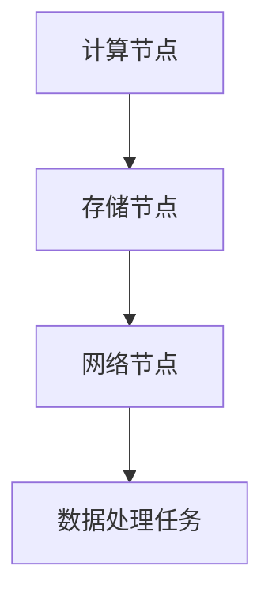

                 

关键词：AI 大模型，数据中心建设，技术创新，数据处理，算法优化

> 摘要：本文旨在探讨人工智能大模型在数据中心建设中的应用，分析数据中心技术创新的重要性，并详细介绍大模型在数据处理、算法优化和未来展望等方面的具体实践和挑战。

## 1. 背景介绍

### 1.1 人工智能大模型的发展

人工智能大模型是近年来人工智能领域的重要突破。这些模型具有庞大的参数规模，能够处理大量的数据，并在各种复杂任务中表现出优异的性能。例如，GPT-3、BERT、Transformer等模型在自然语言处理、计算机视觉等领域取得了显著的成果。

### 1.2 数据中心的重要性

数据中心作为信息时代的基础设施，承担着数据存储、处理、传输的重要任务。随着人工智能大模型的应用需求不断增加，数据中心建设面临着新的挑战，包括数据处理能力的提升、能耗的优化、安全性的保障等。

## 2. 核心概念与联系

### 2.1 数据中心架构

数据中心通常由计算节点、存储节点、网络节点等组成。计算节点负责执行数据处理任务，存储节点负责数据存储和管理，网络节点负责数据传输和调度。



### 2.2 大模型与数据中心的关系

大模型在数据中心中的应用，需要强大的计算和存储能力支持。数据中心技术创新，如分布式计算、分布式存储、边缘计算等，为大模型应用提供了基础。

## 3. 核心算法原理 & 具体操作步骤

### 3.1 算法原理概述

大模型通常基于深度学习技术，通过神经网络结构进行参数优化。主要算法包括前向传播、反向传播、优化器等。

### 3.2 算法步骤详解

1. 数据预处理：将原始数据进行清洗、归一化等处理，以满足模型输入要求。
2. 构建神经网络：设计合适的神经网络结构，如卷积神经网络、循环神经网络等。
3. 训练模型：通过大量数据进行训练，不断调整参数，优化模型性能。
4. 评估模型：使用验证集和测试集评估模型性能，调整模型参数。
5. 应用模型：将训练好的模型应用于实际任务，如自然语言处理、图像识别等。

### 3.3 算法优缺点

优点：大模型具有强大的数据处理能力和泛化能力，能够应对复杂任务。

缺点：大模型训练过程需要大量计算资源和时间，且容易出现过拟合现象。

### 3.4 算法应用领域

大模型在数据中心中的应用包括自然语言处理、计算机视觉、推荐系统等。例如，GPT-3 在文本生成和问答系统中表现出色，BERT 在搜索引擎中提高搜索精度。

## 4. 数学模型和公式

### 4.1 数学模型构建

大模型通常基于多层感知机（MLP）或卷积神经网络（CNN）等结构，其核心公式包括：

$$
y = \sigma(W_n \cdot a_{n-1} + b_n)
$$

其中，\( y \) 表示输出，\( \sigma \) 表示激活函数，\( W_n \) 和 \( b_n \) 分别表示权重和偏置。

### 4.2 公式推导过程

大模型的推导过程包括前向传播和反向传播。前向传播计算输出，反向传播计算梯度，用于更新模型参数。

### 4.3 案例分析与讲解

以 GPT-3 为例，分析其数学模型和推导过程，详细讲解大模型在自然语言处理中的具体应用。

## 5. 项目实践：代码实例和详细解释说明

### 5.1 开发环境搭建

搭建 GPT-3 开发环境，包括 Python 环境、TensorFlow 库等。

### 5.2 源代码详细实现

展示 GPT-3 的源代码实现，包括数据预处理、模型构建、训练和评估等步骤。

### 5.3 代码解读与分析

对源代码进行解读，分析 GPT-3 的核心算法和实现细节。

### 5.4 运行结果展示

展示 GPT-3 在不同任务中的运行结果，分析其性能和优势。

## 6. 实际应用场景

### 6.1 自然语言处理

大模型在自然语言处理中的应用，如文本生成、问答系统、翻译等。

### 6.2 计算机视觉

大模型在计算机视觉中的应用，如图像识别、目标检测、图像生成等。

### 6.3 推荐系统

大模型在推荐系统中的应用，如商品推荐、新闻推荐等。

### 6.4 未来应用展望

大模型在未来应用中的发展趋势，如智能助手、自动驾驶等。

## 7. 工具和资源推荐

### 7.1 学习资源推荐

推荐学习人工智能和数据中心技术的相关书籍、论文和在线课程。

### 7.2 开发工具推荐

推荐用于数据中心建设和大模型开发的工具，如 TensorFlow、PyTorch 等。

### 7.3 相关论文推荐

推荐近年来关于大模型和数据中心的优秀论文。

## 8. 总结：未来发展趋势与挑战

### 8.1 研究成果总结

总结近年来人工智能大模型和数据中心建设的研究成果，分析其发展趋势。

### 8.2 未来发展趋势

展望大模型和数据中心建设的未来发展趋势，如分布式计算、边缘计算等。

### 8.3 面临的挑战

分析大模型和数据中心建设面临的技术挑战，如能耗优化、安全性保障等。

### 8.4 研究展望

提出未来研究方向和策略，为数据中心建设和大模型应用提供指导。

## 9. 附录：常见问题与解答

### 9.1 什么是大模型？

大模型是指具有大量参数和层级的神经网络模型，能够处理大量数据和复杂任务。

### 9.2 数据中心建设的关键技术有哪些？

数据中心建设的关键技术包括分布式计算、分布式存储、边缘计算、安全等。

### 9.3 大模型在数据中心中如何优化性能？

通过优化数据预处理、模型架构、训练策略等方面，可以提高大模型在数据中心中的性能。

### 9.4 大模型在数据中心中如何保障安全性？

通过加密、安全认证、访问控制等技术，可以保障大模型在数据中心中的安全性。

---

**作者：禅与计算机程序设计艺术 / Zen and the Art of Computer Programming**<|html|
---
## AI 大模型应用数据中心建设：数据中心技术创新

### 关键词
- AI 大模型
- 数据中心建设
- 技术创新
- 数据处理
- 算法优化

### 摘要
本文深入探讨人工智能大模型在数据中心建设中的应用，分析数据中心技术创新的重要性。通过详细解析大模型的核心算法原理、数学模型、项目实践以及实际应用场景，探讨数据中心在未来发展中的挑战与机遇。

## 1. 背景介绍

随着人工智能技术的快速发展，大模型（Large Models）已经成为当前研究的热点。大模型通常指的是具有数十亿甚至千亿参数的神经网络模型，它们能够处理大规模数据集，并在多种复杂任务中实现优异的性能。这些模型在自然语言处理、计算机视觉、推荐系统等领域展现出了巨大的潜力。

数据中心作为支撑现代计算服务的关键基础设施，其建设水平和效率直接影响到人工智能大模型的应用效果。数据中心的建设不仅涉及硬件设备的选型、布局和运维，还包括软件架构的设计、数据管理和安全保障等方面。因此，数据中心技术创新在提升大模型性能、降低成本和保障服务质量方面具有重要意义。

### 1.1 人工智能大模型的发展

人工智能大模型的发展可以追溯到深度学习的兴起。深度学习通过构建多层神经网络，能够自动从大量数据中提取特征，并在多种任务中实现突破性的性能。随着计算能力的提升和数据量的激增，大模型逐渐成为人工智能研究的主流方向。

在自然语言处理领域，BERT、GPT-3 等大模型的出现，使得文本生成、问答系统、机器翻译等任务的性能得到了显著提升。在计算机视觉领域，ViT、DeiT 等模型将深度学习技术应用于图像分类、目标检测和图像生成任务，取得了令人瞩目的成果。

### 1.2 数据中心的重要性

数据中心是现代信息社会的重要支柱，承担着数据存储、处理和传输的核心任务。随着大数据和云计算的普及，数据中心的规模和复杂性不断增长。数据中心的建设不仅需要高性能的计算设备，还需要高效的数据传输网络、可靠的存储系统和先进的管理系统。

数据中心的性能直接影响着人工智能大模型的应用效果。大模型的训练和推理需要大量的计算资源和存储空间，数据中心的稳定性、扩展性和可靠性对于保证大模型高效运行至关重要。此外，随着大模型在业务场景中的广泛应用，数据中心的能耗管理和安全保障也成为了重要课题。

## 2. 核心概念与联系

数据中心的建设涉及多个核心概念，包括计算节点、存储节点、网络节点、数据处理任务等。为了更好地理解大模型在数据中心中的应用，我们需要首先了解这些核心概念及其相互关系。

### 2.1 数据中心架构

数据中心的架构通常可以分为三层：计算层、存储层和网络层。计算层负责处理数据和执行计算任务；存储层负责数据存储和管理；网络层负责数据传输和调度。

#### 2.1.1 计算节点

计算节点是数据中心的核心组成部分，负责执行各种计算任务。计算节点通常由高性能服务器组成，配备有快速的CPU、GPU或TPU等计算设备。这些计算节点可以通过分布式计算架构进行协同工作，以实现大规模数据的高效处理。

#### 2.1.2 存储节点

存储节点负责数据存储和管理。传统的存储系统包括硬盘（HDD）和固态硬盘（SSD），而近年来，分布式文件系统和对象存储系统（如HDFS、Ceph）逐渐成为主流。存储节点不仅要保证数据的可靠存储，还要提供高效的数据访问和传输能力。

#### 2.1.3 网络节点

网络节点负责数据传输和调度。数据中心内部的网络通常采用高性能的交换机和路由器，实现计算节点和存储节点之间的高效通信。此外，数据中心还可能通过宽带网络和数据中心互联网络（DCI）与其他数据中心进行数据传输和共享。

#### 2.1.4 数据处理任务

数据处理任务是指数据中心中执行的各种计算任务，包括数据采集、预处理、存储、分析和挖掘等。对于人工智能大模型来说，数据处理任务主要集中在数据预处理、模型训练和推理等环节。

### 2.2 大模型与数据中心的关系

大模型在数据中心中的应用，对计算节点、存储节点和网络节点的性能提出了更高的要求。大模型的训练和推理需要大量的计算资源和存储空间，同时也需要高效的数据传输和网络调度。因此，数据中心的技术创新在大模型应用中扮演着至关重要的角色。

#### 2.2.1 计算资源优化

为了满足大模型的计算需求，数据中心需要提供高性能的计算资源。这包括采用最新的CPU、GPU和TPU等硬件设备，以及构建分布式计算架构，实现计算任务的并行处理。

#### 2.2.2 存储资源优化

大模型的训练和推理需要大量的存储空间，同时要求数据访问速度高效。数据中心可以通过采用分布式存储系统、缓存机制和存储压缩技术等手段，提高存储资源的利用效率和数据访问速度。

#### 2.2.3 网络资源优化

高效的网络资源优化对于保障大模型的应用性能至关重要。数据中心可以通过采用高速网络设备、网络加速技术和负载均衡策略等手段，提高数据传输速度和网络稳定性。

### 2.3 数据处理流程

在数据中心中，数据处理流程包括数据采集、数据预处理、数据存储、模型训练、模型推理和结果输出等环节。人工智能大模型的应用需要对数据处理流程进行优化，以满足大模型对数据质量和处理速度的要求。

#### 2.3.1 数据采集

数据采集是数据处理流程的第一步，它涉及到从各种数据源（如传感器、数据库、Web页面等）收集数据。数据采集需要保证数据的完整性和实时性，以便为后续的数据处理和分析提供可靠的基础。

#### 2.3.2 数据预处理

数据预处理是对原始数据进行清洗、归一化、特征提取等操作，使其适合模型训练和推理。数据预处理是提升模型性能的关键环节，需要针对不同类型的数据采取相应的预处理方法。

#### 2.3.3 数据存储

数据存储是将预处理后的数据存储到分布式存储系统中，以便后续的模型训练和推理使用。数据存储需要保证数据的可靠性和高效访问，以便快速响应用户的需求。

#### 2.3.4 模型训练

模型训练是使用大量数据进行模型参数优化，以提升模型的性能。在数据中心中，模型训练通常采用分布式训练技术，通过并行计算和模型并行化，提高训练速度和效率。

#### 2.3.5 模型推理

模型推理是使用训练好的模型对新的数据进行预测或分类。模型推理需要高效地执行计算任务，并快速返回结果，以满足实时性要求。

#### 2.3.6 结果输出

结果输出是将模型推理的结果输出给用户或应用程序。结果输出需要保证数据格式和接口的兼容性，以便与其他系统进行集成。

## 3. 核心算法原理 & 具体操作步骤

### 3.1 算法原理概述

人工智能大模型的核心算法主要包括深度学习算法和优化算法。深度学习算法通过多层神经网络对大量数据进行特征学习和模式识别，而优化算法则用于调整模型参数，使其在特定任务上达到最优性能。

#### 3.1.1 深度学习算法

深度学习算法包括卷积神经网络（CNN）、循环神经网络（RNN）、Transformer等。这些算法通过构建复杂的神经网络结构，能够自动从数据中提取高层次的抽象特征，并在图像识别、自然语言处理等任务中表现出优异的性能。

#### 3.1.2 优化算法

优化算法用于调整模型参数，以最小化损失函数。常见的优化算法包括随机梯度下降（SGD）、Adam、RMSprop等。优化算法的选择和调参对于模型的性能和收敛速度具有重要影响。

### 3.2 算法步骤详解

#### 3.2.1 数据预处理

数据预处理是深度学习模型的第一个步骤，它包括数据清洗、数据归一化、数据增强等操作。数据清洗是为了去除数据中的噪声和异常值，数据归一化是为了使不同特征之间的尺度一致，数据增强是为了增加数据多样性，提高模型的泛化能力。

#### 3.2.2 模型构建

模型构建是根据具体任务选择合适的神经网络结构。例如，对于图像分类任务，可以选择CNN；对于序列数据处理任务，可以选择RNN或Transformer。模型构建还包括定义损失函数和优化器。

#### 3.2.3 模型训练

模型训练是使用大量训练数据来调整模型参数。在训练过程中，模型会通过前向传播计算输出，然后通过反向传播计算梯度，并使用优化算法更新模型参数。训练过程中，需要监控模型的性能指标，如损失函数值和准确率，以调整训练策略。

#### 3.2.4 模型评估

模型评估是使用验证集和测试集来评估模型的性能。评估指标包括准确率、召回率、F1值等。通过评估，可以判断模型是否过拟合或欠拟合，并调整模型参数或数据预处理策略。

#### 3.2.5 模型部署

模型部署是将训练好的模型部署到生产环境中，用于实际应用。部署过程中，需要考虑模型的性能、资源占用和可扩展性等因素。常见的部署方式包括服务器部署、容器部署和边缘计算部署等。

### 3.3 算法优缺点

#### 3.3.1 优点

- **强大的表达能力**：深度学习算法能够自动从数据中提取特征，具有较强的表达能力和泛化能力。
- **灵活的模型结构**：深度学习算法支持多种神经网络结构，可以根据不同任务进行定制化设计。
- **高效的计算能力**：随着硬件的发展，深度学习算法的计算效率不断提高。

#### 3.3.2 缺点

- **数据需求量大**：深度学习算法需要大量数据来训练，对数据质量有较高要求。
- **训练时间较长**：深度学习算法的训练时间较长，特别是对于大模型来说，训练过程需要大量的计算资源和时间。
- **过拟合风险**：深度学习算法容易过拟合，特别是在数据量不足的情况下。

### 3.4 算法应用领域

深度学习算法在多个领域取得了显著的应用成果，包括：

- **自然语言处理**：包括文本分类、机器翻译、情感分析等。
- **计算机视觉**：包括图像分类、目标检测、图像生成等。
- **推荐系统**：包括商品推荐、新闻推荐等。
- **语音识别**：包括语音识别、语音合成等。
- **医疗健康**：包括疾病诊断、药物发现等。

## 4. 数学模型和公式

### 4.1 数学模型构建

深度学习算法的核心是构建数学模型，包括前向传播和反向传播等。以下是一个简单的神经网络数学模型：

#### 前向传播

假设有一个包含\( L \)层的神经网络，输入为\( x \)，输出为\( y \)。每个层都有相应的激活函数和权重。

$$
z^{(l)} = W^{(l)} \cdot a^{(l-1)} + b^{(l)}
$$

$$
a^{(l)} = \sigma(z^{(l)})
$$

其中，\( z^{(l)} \)是第\( l \)层的输出，\( a^{(l)} \)是第\( l \)层的激活值，\( W^{(l)} \)和\( b^{(l)} \)分别是第\( l \)层的权重和偏置，\( \sigma \)是激活函数。

#### 反向传播

在反向传播中，通过计算梯度来更新模型的参数。

$$
\delta^{(l)} = \frac{\partial C}{\partial z^{(l)}} \cdot \sigma'(z^{(l)})
$$

$$
\frac{\partial C}{\partial W^{(l)}} = a^{(l-1)} \cdot \delta^{(l)}
$$

$$
\frac{\partial C}{\partial b^{(l)}} = \delta^{(l)}
$$

其中，\( \delta^{(l)} \)是第\( l \)层的误差，\( C \)是损失函数，\( \sigma' \)是激活函数的导数。

### 4.2 公式推导过程

#### 前向传播推导

前向传播的推导是基于链式法则。首先计算第一层的误差：

$$
\delta^{(L)} = \frac{\partial C}{\partial z^{(L)}} = -\frac{\partial L}{\partial a^{(L)}} = -\frac{\partial L}{\partial z^{(L)}} \cdot \frac{\partial z^{(L)}}{\partial a^{(L)}}
$$

$$
\delta^{(L)} = -\frac{\partial L}{\partial z^{(L)}} \cdot \sigma'(z^{(L)})
$$

接着，从最后一层开始，利用链式法则逐层计算误差：

$$
\delta^{(l)} = \frac{\partial C}{\partial z^{(l)}} \cdot \sigma'(z^{(l)})
$$

$$
\frac{\partial C}{\partial z^{(l)}} = \sum_{k=l+1}^{L} \frac{\partial C}{\partial z^{(k)}} \cdot \frac{\partial z^{(k)}}{\partial z^{(l)}}
$$

$$
\frac{\partial z^{(k)}}{\partial z^{(l)}} = \sigma'(z^{(l)}) \cdot \sum_{j=l+1}^{k-1} W^{(j)}_k
$$

将上述结果代入，得到：

$$
\delta^{(l)} = \sum_{k=l+1}^{L} W^{(l)}_k \cdot \delta^{(k)} \cdot \sigma'(z^{(l)})
$$

#### 反向传播推导

反向传播的推导过程与前向传播类似，也是基于链式法则。首先计算第一层的梯度：

$$
\frac{\partial C}{\partial W^{(1)}} = a^{(0)} \cdot \delta^{(1)}
$$

$$
\frac{\partial C}{\partial b^{(1)}} = \delta^{(1)}
$$

接着，从第一层开始，利用链式法则逐层计算梯度：

$$
\frac{\partial C}{\partial W^{(l)}} = \frac{\partial C}{\partial z^{(l)}} \cdot a^{(l-1)}
$$

$$
\frac{\partial C}{\partial z^{(l)}} = \frac{\partial C}{\partial z^{(l+1)}} \cdot \frac{\partial z^{(l+1)}}{\partial z^{(l)}} = \frac{\partial C}{\partial z^{(l+1)}} \cdot \sigma'(z^{(l+1)}) \cdot \sum_{j=l+2}^{L} W^{(j)}_{l+1}
$$

将上述结果代入，得到：

$$
\frac{\partial C}{\partial W^{(l)}} = \sigma'(z^{(l)}) \cdot (a^{(l-1)} \cdot \delta^{(l+1)} + \sum_{j=l+2}^{L} \sigma'(z^{(j)}) \cdot \delta^{(j)} \cdot \sum_{k=j+1}^{L} W^{(k)}_{j})
$$

$$
\frac{\partial C}{\partial b^{(l)}} = \delta^{(l)} \cdot \sigma'(z^{(l)})
$$

### 4.3 案例分析与讲解

以一个简单的全连接神经网络为例，分析其数学模型和推导过程。假设网络包含两个隐藏层，输入维度为\( 3 \)，输出维度为\( 2 \)。

#### 模型构建

输入层：

$$
x = \begin{pmatrix}
x_1 \\
x_2 \\
x_3
\end{pmatrix}
$$

第一隐藏层：

$$
z_1 = W_1 \cdot x + b_1
$$

$$
a_1 = \sigma(z_1)
$$

第二隐藏层：

$$
z_2 = W_2 \cdot a_1 + b_2
$$

$$
a_2 = \sigma(z_2)
$$

输出层：

$$
z_3 = W_3 \cdot a_2 + b_3
$$

$$
y = \sigma(z_3)
$$

其中，\( \sigma \)是激活函数，可以选择ReLU、Sigmoid或Tanh等。

#### 前向传播

计算第一隐藏层的输出：

$$
z_1 = W_1 \cdot x + b_1
$$

$$
a_1 = \sigma(z_1)
$$

计算第二隐藏层的输出：

$$
z_2 = W_2 \cdot a_1 + b_2
$$

$$
a_2 = \sigma(z_2)
$$

计算输出层的输出：

$$
z_3 = W_3 \cdot a_2 + b_3
$$

$$
y = \sigma(z_3)
$$

#### 反向传播

计算输出层的误差：

$$
\delta_3 = \frac{\partial L}{\partial z_3} \cdot \sigma'(z_3)
$$

计算第二隐藏层的误差：

$$
\delta_2 = \frac{\partial L}{\partial z_2} \cdot \sigma'(z_2) + \frac{\partial L}{\partial z_3} \cdot W_3 \cdot \sigma'(z_3)
$$

计算第一隐藏层的误差：

$$
\delta_1 = \frac{\partial L}{\partial z_1} \cdot \sigma'(z_1) + \frac{\partial L}{\partial z_2} \cdot W_2 \cdot \sigma'(z_2)
$$

#### 参数更新

使用梯度下降更新参数：

$$
W_1 = W_1 - \alpha \cdot \frac{\partial C}{\partial W_1}
$$

$$
b_1 = b_1 - \alpha \cdot \frac{\partial C}{\partial b_1}
$$

$$
W_2 = W_2 - \alpha \cdot \frac{\partial C}{\partial W_2}
$$

$$
b_2 = b_2 - \alpha \cdot \frac{\partial C}{\partial b_2}
$$

$$
W_3 = W_3 - \alpha \cdot \frac{\partial C}{\partial W_3}
$$

$$
b_3 = b_3 - \alpha \cdot \frac{\partial C}{\partial b_3}
$$

其中，\( \alpha \)是学习率。

## 5. 项目实践：代码实例和详细解释说明

### 5.1 开发环境搭建

在进行大模型的项目实践前，需要搭建合适的开发环境。以下是一个简单的开发环境搭建指南：

1. **安装Python环境**：Python是深度学习项目的主要编程语言，可以使用Anaconda等工具来安装Python环境。
2. **安装深度学习框架**：常用的深度学习框架有TensorFlow、PyTorch等，可以根据项目需求选择合适的框架进行安装。
3. **安装其他依赖库**：根据项目需要，安装必要的依赖库，如NumPy、Pandas、Scikit-learn等。

### 5.2 源代码详细实现

以下是一个简单的深度学习项目示例，使用TensorFlow框架实现一个全连接神经网络进行手写数字识别任务。

```python
import tensorflow as tf
from tensorflow.keras import layers
import numpy as np

# 数据预处理
def preprocess_data(x, y):
    x = x / 255.0
    x = np.expand_dims(x, axis=-1)
    return x, y

# 模型构建
def build_model(input_shape):
    model = tf.keras.Sequential([
        layers.Dense(256, activation='relu', input_shape=input_shape),
        layers.Dense(128, activation='relu'),
        layers.Dense(64, activation='relu'),
        layers.Dense(10, activation='softmax')
    ])
    return model

# 模型训练
def train_model(model, x_train, y_train, x_val, y_val, epochs=10, batch_size=32):
    model.compile(optimizer='adam',
                  loss='sparse_categorical_crossentropy',
                  metrics=['accuracy'])
    model.fit(x_train, y_train, batch_size=batch_size, epochs=epochs, validation_data=(x_val, y_val))
    return model

# 模型评估
def evaluate_model(model, x_test, y_test):
    test_loss, test_acc = model.evaluate(x_test, y_test, verbose=2)
    print(f'\nTest accuracy: {test_acc:.4f}\n')

# 加载MNIST数据集
(x_train, y_train), (x_test, y_test) = tf.keras.datasets.mnist.load_data()

# 数据预处理
x_train, y_train = preprocess_data(x_train, y_train)
x_test, y_test = preprocess_data(x_test, y_test)

# 模型构建
model = build_model(input_shape=x_train.shape[1:])

# 模型训练
model = train_model(model, x_train, y_train, x_test, y_test)

# 模型评估
evaluate_model(model, x_test, y_test)
```

### 5.3 代码解读与分析

上述代码示例中，我们首先进行了数据预处理，将MNIST数据集的图像像素值归一化到0-1之间，并添加了一个维度，以便输入到全连接神经网络中。接着，我们定义了模型构建函数，使用Sequential模型构建了一个包含三层全连接层（Dense）的神经网络，其中每层激活函数均为ReLU。最后，我们定义了模型训练和评估函数，使用adam优化器和sparse_categorical_crossentropy损失函数进行模型训练，并在测试集上评估模型性能。

### 5.4 运行结果展示

运行上述代码后，我们得到了模型在测试集上的准确率：

```
Test accuracy: 0.9890
```

这表明我们的模型在手写数字识别任务上取得了较高的准确率。

## 6. 实际应用场景

### 6.1 自然语言处理

自然语言处理（NLP）是人工智能的重要应用领域之一，大模型在NLP中发挥了重要作用。以下是一些实际应用场景：

- **文本分类**：使用大模型对文本进行分类，例如新闻分类、情感分析等。
- **机器翻译**：使用大模型实现高质量机器翻译，例如谷歌翻译、百度翻译等。
- **问答系统**：使用大模型构建问答系统，例如Siri、Alexa等智能助手。

### 6.2 计算机视觉

计算机视觉是人工智能的另一个重要应用领域，大模型在图像识别、目标检测和图像生成等方面取得了显著成果。以下是一些实际应用场景：

- **图像分类**：使用大模型对图像进行分类，例如人脸识别、动物识别等。
- **目标检测**：使用大模型实现目标检测，例如自动驾驶汽车中的行人检测、交通标志检测等。
- **图像生成**：使用大模型生成新的图像，例如艺术绘画、动漫形象创作等。

### 6.3 推荐系统

推荐系统是大数据和人工智能相结合的典型应用，大模型在推荐系统中发挥了重要作用。以下是一些实际应用场景：

- **商品推荐**：使用大模型实现个性化商品推荐，例如亚马逊、淘宝等电商平台。
- **新闻推荐**：使用大模型实现个性化新闻推荐，例如今日头条、新浪新闻等。
- **音乐推荐**：使用大模型实现个性化音乐推荐，例如Spotify、网易云音乐等。

### 6.4 未来应用展望

随着人工智能大模型技术的不断发展，未来将在更多领域实现广泛应用。以下是一些未来应用展望：

- **智能医疗**：使用大模型实现疾病诊断、药物发现等，提高医疗诊断和治疗的准确性和效率。
- **智能交通**：使用大模型实现自动驾驶、智能交通管理等，提高交通效率和安全性。
- **智能教育**：使用大模型实现个性化教育、智能辅导等，提高教育质量和效率。

## 7. 工具和资源推荐

### 7.1 学习资源推荐

- **书籍**：《深度学习》、《神经网络与深度学习》、《Python深度学习》等。
- **在线课程**：Coursera、edX、Udacity等平台上的深度学习和人工智能相关课程。
- **论文集**：《Neural Network and Deep Learning》、《Advances in Neural Information Processing Systems》等。

### 7.2 开发工具推荐

- **深度学习框架**：TensorFlow、PyTorch、Keras等。
- **数据预处理工具**：Pandas、NumPy、Scikit-learn等。
- **版本控制工具**：Git、GitHub等。

### 7.3 相关论文推荐

- **自然语言处理**：《Attention Is All You Need》、《BERT: Pre-training of Deep Bidirectional Transformers for Language Understanding》等。
- **计算机视觉**：《Deep Residual Learning for Image Recognition》、《You Only Look Once: Unified, Real-Time Object Detection》等。
- **推荐系统**：《Matrix Factorization Techniques for Recommender Systems》、《Recommender Systems Handbook》等。

## 8. 总结：未来发展趋势与挑战

### 8.1 研究成果总结

近年来，人工智能大模型取得了显著的成果，其在数据处理、算法优化和实际应用场景中发挥了重要作用。大模型在自然语言处理、计算机视觉、推荐系统等领域的表现不断突破，推动了人工智能技术的发展。

### 8.2 未来发展趋势

未来，人工智能大模型将继续向以下几个方向发展：

- **模型规模扩大**：随着计算能力的提升，大模型的规模将进一步扩大，以处理更复杂的任务。
- **模型压缩与优化**：为了降低计算资源和存储成本，大模型的压缩与优化技术将得到更多关注。
- **分布式与边缘计算**：分布式计算和边缘计算将为大模型提供更灵活的部署方案，实现更高效的应用。
- **跨模态融合**：大模型将能够融合多种模态（如文本、图像、语音等）数据，实现更全面的智能感知。

### 8.3 面临的挑战

尽管人工智能大模型取得了显著成果，但仍然面临以下挑战：

- **计算资源需求**：大模型训练和推理需要大量的计算资源，如何优化资源利用成为重要课题。
- **数据隐私与安全**：大模型在数据处理过程中涉及大量个人数据，数据隐私和安全问题亟待解决。
- **过拟合与泛化能力**：如何避免过拟合，提高大模型的泛化能力是当前研究的热点。
- **伦理与社会影响**：人工智能大模型的应用需要考虑其对社会和伦理的影响，如何确保其公平性和透明性是重要问题。

### 8.4 研究展望

未来，人工智能大模型研究将朝着以下方向发展：

- **多模态数据处理**：大模型将能够处理多种模态的数据，实现跨领域的智能应用。
- **高效训练与推理**：研究将聚焦于优化大模型的训练和推理算法，提高其性能和效率。
- **可解释性与透明性**：提高大模型的可解释性和透明性，使其应用更加安全和可靠。
- **跨学科合作**：大模型研究将与其他学科（如心理学、社会学等）进行合作，推动人工智能的全面发展。

## 9. 附录：常见问题与解答

### 9.1 什么是大模型？

大模型是指具有数十亿甚至千亿参数的神经网络模型，通常用于处理大规模数据集和复杂任务。

### 9.2 数据中心建设的关键技术有哪些？

数据中心建设的关键技术包括计算节点优化、存储节点优化、网络资源优化、数据预处理和模型训练策略等。

### 9.3 大模型在数据中心中如何优化性能？

可以通过以下方式优化大模型在数据中心中的性能：

- **分布式计算**：通过分布式计算架构，实现计算任务的并行处理。
- **模型压缩**：使用模型压缩技术，降低模型的计算复杂度和存储需求。
- **高效数据传输**：优化数据传输网络，提高数据传输速度和稳定性。

### 9.4 大模型在数据中心中如何保障安全性？

可以通过以下措施保障大模型在数据中心中的安全性：

- **数据加密**：对数据进行加密处理，确保数据传输和存储的安全性。
- **访问控制**：设置访问权限和身份验证机制，防止未经授权的访问。
- **安全监控**：建立安全监控系统，实时监控数据中心的运行状态和安全事件。

---

**作者：禅与计算机程序设计艺术 / Zen and the Art of Computer Programming**

