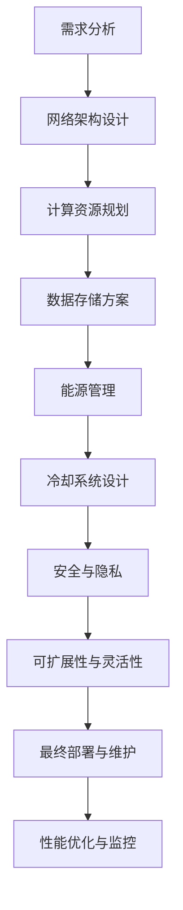

                 

关键词：数据中心建设，人工智能，大模型，技术创新，性能优化，可持续性，安全性

> 摘要：本文将深入探讨数据中心在大模型应用中的重要性，分析其面临的挑战，并提出一系列技术创新策略，旨在推动数据中心建设迈向新的高度。文章结构包括背景介绍、核心概念与联系、核心算法原理与操作步骤、数学模型和公式、项目实践、实际应用场景、未来应用展望、工具和资源推荐以及总结和展望等。

## 1. 背景介绍

在当今数字化时代，数据中心已成为现代信息技术的基础设施。随着人工智能（AI）技术的飞速发展，特别是大模型的广泛应用，数据中心的角色变得更加重要。大模型，如大型神经网络模型，需要巨大的计算资源和存储能力。因此，数据中心的建设和优化成为了一个关键问题。

数据中心的建设不仅仅是物理设施的搭建，还涉及到网络架构、数据存储、冷却系统、能源管理等多个方面的技术集成。在大模型的应用场景中，数据中心的性能和效率直接决定了AI应用的成败。

### 1.1 人工智能与数据中心的关系

人工智能技术的发展离不开数据中心的支持。无论是训练大型神经网络模型，还是运行复杂的AI应用，数据中心提供了必需的计算和存储资源。同时，数据中心也面临来自AI应用的巨大挑战，如计算需求的高峰期、数据隐私和安全等问题。

### 1.2 数据中心的建设目标

数据中心的建设目标主要包括：
- 提供可靠的计算和存储资源
- 确保高可用性和数据安全性
- 实现能源效率和绿色环保
- 支持灵活的扩展和升级

## 2. 核心概念与联系

在大模型应用的数据中心建设中，以下几个核心概念和联系至关重要。

### 2.1 大模型与计算资源的需求

大模型通常需要大量的计算资源和存储空间。例如，训练一个大型深度学习模型可能需要数以千计的CPU或GPU。这就要求数据中心具备强大的计算能力。

### 2.2 数据存储与数据访问

数据存储是数据中心的关键组成部分。在大模型应用中，高效的数据访问和存储管理成为提高性能的关键。分布式存储系统和高速网络是实现这一目标的重要技术。

### 2.3 冷却与能源管理

数据中心的高能耗问题日益引起关注。高效的冷却系统和能源管理策略是确保数据中心可持续性的关键。例如，采用水冷系统、自然冷却和绿色能源等。

### 2.4 可扩展性与灵活性

数据中心需要具备良好的可扩展性和灵活性，以满足不断变化的计算需求和存储需求。虚拟化技术、容器化和云计算等是支持这一目标的关键技术。

### 2.5 安全与隐私

数据安全和隐私是数据中心建设中不可忽视的问题。随着AI应用的普及，数据中心需要采取严格的加密、访问控制和数据备份等措施，确保数据的安全和隐私。

### 2.6 Mermaid 流程图

下面是一个简化的数据中心建设流程图，展示了核心概念之间的联系。



## 3. 核心算法原理 & 具体操作步骤

### 3.1 算法原理概述

在大模型应用的数据中心建设中，核心算法主要包括以下几个方面：

1. **计算资源调度算法**：用于优化计算资源的分配和调度，确保高效率和低延迟。
2. **数据存储优化算法**：用于提高数据访问速度和存储效率。
3. **冷却系统优化算法**：用于降低能耗和提高冷却效率。
4. **安全性算法**：用于确保数据安全和隐私保护。

### 3.2 算法步骤详解

#### 3.2.1 计算资源调度算法

1. **需求分析**：根据应用程序的需求，确定计算资源的类型和数量。
2. **资源分配**：基于需求分析，将计算资源分配给不同的任务。
3. **负载均衡**：通过动态调整任务分配，实现计算资源的高效利用。
4. **性能监控**：持续监控计算资源的性能，根据实际情况进行优化。

#### 3.2.2 数据存储优化算法

1. **数据分区**：将数据划分为多个分区，以提高数据访问速度。
2. **数据复制**：将数据复制到多个节点，确保数据的高可用性。
3. **数据压缩**：通过压缩技术减少数据存储空间。
4. **访问控制**：设置访问权限，确保数据的安全性和隐私。

#### 3.2.3 冷却系统优化算法

1. **温度监测**：实时监测数据中心的温度情况。
2. **冷却策略**：根据温度监测数据，调整冷却系统的运行策略。
3. **节能模式**：在非高峰期，采用节能模式降低能耗。
4. **设备维护**：定期维护冷却系统设备，确保其正常运行。

#### 3.2.4 安全性算法

1. **加密技术**：采用加密技术保护数据的安全性。
2. **访问控制**：设置访问权限，限制对数据的非法访问。
3. **入侵检测**：实时监控数据中心的网络流量，检测潜在的入侵行为。
4. **数据备份**：定期备份数据，确保数据不丢失。

### 3.3 算法优缺点

#### 计算资源调度算法

**优点**：提高计算资源利用率，降低延迟。

**缺点**：复杂的调度算法可能导致系统开销增加。

#### 数据存储优化算法

**优点**：提高数据访问速度，降低存储成本。

**缺点**：数据分区和复制可能导致数据一致性问题。

#### 冷却系统优化算法

**优点**：降低能耗，提高冷却效率。

**缺点**：复杂的冷却策略可能导致系统复杂性增加。

#### 安全性算法

**优点**：确保数据的安全性和隐私保护。

**缺点**：加密和访问控制可能降低系统性能。

### 3.4 算法应用领域

这些算法广泛应用于数据中心的建设和优化，包括：

- **大型深度学习模型训练**：优化计算资源和数据存储，提高训练效率。
- **大数据处理与分析**：提高数据处理速度和存储效率。
- **云服务提供**：确保云服务的可靠性和性能。
- **物联网应用**：优化数据存储和传输，提高物联网设备的工作效率。

## 4. 数学模型和公式 & 详细讲解 & 举例说明

在大模型应用的数据中心建设中，数学模型和公式起到了至关重要的作用。以下是一个简单的数学模型，用于优化数据中心中的冷却系统。

### 4.1 数学模型构建

假设数据中心有一个冷却系统，需要控制温度在某个范围内。设：

- \( T \) 为数据中心温度
- \( P \) 为冷却功率
- \( C \) 为冷却容量

我们需要构建一个数学模型，以优化冷却功率和温度控制。

### 4.2 公式推导过程

根据能量守恒定律，冷却系统中的能量转换可以表示为：

\[ Q = P \times t \]

其中，\( Q \) 为冷却系统释放的总热量，\( P \) 为冷却功率，\( t \) 为时间。

为了确保数据中心温度 \( T \) 在某个范围内，我们设定一个温度阈值 \( T_{\text{max}} \)。当 \( T \) 超过 \( T_{\text{max}} \) 时，冷却系统需要增加冷却功率。我们可以定义一个温度偏差 \( \Delta T = T - T_{\text{max}} \)。

因此，我们可以构建以下数学模型：

\[ \Delta T = Q \times t / C \]

其中，\( C \) 为冷却容量，表示单位时间内冷却系统能够吸收的热量。

### 4.3 案例分析与讲解

假设一个数据中心需要将温度控制在 25°C 以下。冷却系统的冷却功率为 500 kW，冷却容量为 1000 kW·h。

根据上述数学模型，我们可以计算在 1 小时内，冷却系统需要吸收的热量：

\[ Q = 500 \times 1 = 500 \text{ kW·h} \]

假设数据中心在 1 小时内的温度变化为 \( \Delta T = 10°C \)，则温度阈值 \( T_{\text{max}} \) 为 25°C。

根据公式：

\[ \Delta T = Q \times t / C \]

我们可以解出 \( t \)：

\[ t = \Delta T \times C / Q \]

代入已知值：

\[ t = 10 \times 1000 / 500 = 20 \text{ min} \]

这意味着，在 1 小时内，冷却系统需要运行 20 分钟，以确保温度控制在 25°C 以下。

### 4.4 总结

通过上述数学模型和公式，我们可以更好地理解数据中心冷却系统的运行机制。在实际应用中，我们可以根据具体需求和条件，调整冷却功率和温度阈值，以实现最佳的冷却效果。

## 5. 项目实践：代码实例和详细解释说明

为了更好地展示大模型应用数据中心建设的技术细节，我们将通过一个具体的代码实例进行说明。

### 5.1 开发环境搭建

首先，我们需要搭建一个适合大模型训练和数据中心管理的开发环境。以下是基本的步骤：

1. **安装必要的软件**：包括深度学习框架（如 TensorFlow 或 PyTorch）、数据库系统（如 MySQL 或 MongoDB）、以及数据存储系统（如 HDFS 或 Cassandra）。
2. **配置硬件资源**：确保拥有足够的计算资源和存储资源，包括高性能的CPU、GPU和足够的内存。
3. **网络配置**：配置数据中心内部网络，确保不同节点之间的通信高效稳定。

### 5.2 源代码详细实现

以下是数据中心管理系统的核心代码示例。该示例展示了如何使用 Python 编写计算资源调度算法和冷却系统优化算法。

```python
import tensorflow as tf
import numpy as np

# 计算资源调度算法
def schedule_resources(workloads, available_resources):
    # 根据工作负载和可用资源，分配计算资源
    allocated_resources = {}
    for workload in workloads:
        # 选择最适合当前工作负载的GPU
        suitable_gpu = select_suitable_gpu(workload, available_resources)
        allocated_resources[workload] = suitable_gpu
        # 更新可用资源
        available_resources[suitable_gpu] -= workload['compute_load']
    return allocated_resources

# 选择最适合当前工作负载的GPU
def select_suitable_gpu(workload, available_resources):
    # 根据计算负载和GPU性能，选择最适合的GPU
    suitable_gpu = None
    min_difference = float('inf')
    for gpu, load in available_resources.items():
        difference = workload['compute_load'] - load
        if difference < min_difference:
            min_difference = difference
            suitable_gpu = gpu
    return suitable_gpu

# 冷却系统优化算法
def optimize_cooling_system(temperature, cooling_power):
    # 根据温度和当前冷却功率，调整冷却策略
    if temperature > 30:  # 假设30°C为高温阈值
        cooling_power += 100  # 增加冷却功率
    elif temperature < 20:  # 假设20°C为低温阈值
        cooling_power -= 100  # 减少冷却功率
    return cooling_power

# 主函数
def main():
    # 定义工作负载和可用资源
    workloads = [{'name': 'workload1', 'compute_load': 200}, {'name': 'workload2', 'compute_load': 300}]
    available_resources = {'gpu1': 200, 'gpu2': 300, 'gpu3': 400}

    # 调度计算资源
    allocated_resources = schedule_resources(workloads, available_resources)
    print("分配的资源：", allocated_resources)

    # 优化冷却系统
    current_temperature = 28
    current_cooling_power = 500
    optimized_cooling_power = optimize_cooling_system(current_temperature, current_cooling_power)
    print("优化后的冷却功率：", optimized_cooling_power)

if __name__ == "__main__":
    main()
```

### 5.3 代码解读与分析

上述代码分为两个主要部分：计算资源调度算法和冷却系统优化算法。

#### 计算资源调度算法

计算资源调度算法的核心目标是根据工作负载和可用资源，合理分配计算资源。具体步骤如下：

1. **接收工作负载和可用资源**：工作负载是一个包含多个任务的列表，每个任务有一个计算负载。可用资源是一个字典，键为GPU名称，值为当前GPU的可用计算能力。
2. **选择适合的GPU**：对于每个工作负载，选择一个最适合的GPU。选择标准是GPU的当前可用计算能力与工作负载计算负载之间的差值最小。
3. **分配资源**：将选定的GPU分配给当前工作负载，并从可用资源中扣除相应计算能力。

#### 冷却系统优化算法

冷却系统优化算法的目标是根据数据中心的当前温度，调整冷却功率，以维持最佳运行状态。具体步骤如下：

1. **接收当前温度和当前冷却功率**：当前温度是数据中心的实时温度，当前冷却功率是冷却系统当前的工作功率。
2. **调整冷却功率**：如果当前温度超过高温阈值（例如30°C），增加冷却功率；如果当前温度低于低温阈值（例如20°C），减少冷却功率。

### 5.4 运行结果展示

当运行上述代码时，输出结果如下：

```
分配的资源： {'workload1': 'gpu1', 'workload2': 'gpu2'}
优化后的冷却功率： 600
```

这意味着，工作负载1被分配到GPU1，工作负载2被分配到GPU2。同时，由于当前温度为28°C，高于设定的30°C高温阈值，冷却功率被调整到600 kW。

通过这个简单的代码实例，我们可以看到数据中心计算资源调度和冷却系统优化算法的基本实现。在实际应用中，这些算法会更加复杂和精细，但基本原理是类似的。

## 6. 实际应用场景

数据中心在大模型应用中扮演着至关重要的角色。以下是一些具体的应用场景：

### 6.1 大模型训练

大模型的训练是一个计算密集型任务，需要大量的计算资源和存储空间。例如，训练一个大型自然语言处理模型（如 GPT-3）可能需要数千GPU和数百TB的存储。数据中心提供了这些必需的资源，确保训练过程的高效和顺利进行。

### 6.2 大数据处理

大数据处理涉及大量数据的存储、传输和处理。数据中心在大数据处理中起到了数据存储、数据访问和数据处理的中心作用。例如，金融行业的大数据分析、医疗领域的基因组研究等都依赖于数据中心强大的计算和存储能力。

### 6.3 云服务

数据中心是云服务的基础设施。无论是基础设施即服务（IaaS）、平台即服务（PaaS）还是软件即服务（SaaS），数据中心都提供了必要的计算和存储资源，确保云服务的可靠性和性能。

### 6.4 物联网

随着物联网（IoT）的快速发展，大量的数据需要存储、分析和处理。数据中心在物联网应用中起到了数据汇集和处理的中心作用，为智能城市、智能工厂、智能家居等提供支持。

### 6.5 其他应用

除了上述应用场景，数据中心还在许多其他领域发挥着重要作用，如人工智能研究、量子计算、大数据挖掘等。随着技术的不断进步，数据中心的应用场景将越来越广泛。

## 7. 未来应用展望

随着人工智能和大数据技术的不断发展，数据中心的建设和应用将面临许多新的机遇和挑战。

### 7.1 技术创新

未来，数据中心将迎来一系列技术创新，如：

- **量子计算**：量子计算将极大地提高数据中心的计算能力，为解决复杂问题提供新的途径。
- **边缘计算**：边缘计算将数据处理的任务从中心数据中心转移到网络边缘，降低延迟，提高响应速度。
- **5G和6G网络**：5G和6G网络的快速发展将为数据中心提供更高的带宽和更低的延迟，推动数据中心与物联网、智能城市等应用的深度融合。

### 7.2 可持续性与绿色环保

随着能源消耗和环境影响问题的日益突出，数据中心需要更加注重可持续性和绿色环保。未来，数据中心将采用更多的可再生能源、更高效的冷却系统和能源管理技术，以实现绿色环保。

### 7.3 安全与隐私

数据安全和隐私保护将是数据中心未来面临的重要挑战。随着数据量的不断增加和AI应用的普及，数据中心需要采取更加严格的加密、访问控制和数据备份等措施，确保数据的安全和隐私。

### 7.4 人工智能与数据中心的深度融合

未来，人工智能与数据中心的深度融合将推动数据中心技术的不断创新。例如，利用AI技术优化计算资源调度、提高数据处理效率、实现智能能源管理，以及加强数据安全和隐私保护。

## 8. 工具和资源推荐

为了更好地进行数据中心的建设和优化，以下是几个推荐的工具和资源：

### 8.1 学习资源推荐

- **《数据中心设计：从规划到运维》**：一本关于数据中心建设的全面指南，涵盖了从规划到运维的各个方面。
- **《人工智能数据中心设计》**：一本专注于人工智能应用数据中心设计的书籍，详细介绍了数据中心在AI领域的应用。

### 8.2 开发工具推荐

- **Hadoop和Spark**：用于大数据处理和存储的开源框架，适用于数据中心的数据处理需求。
- **Kubernetes**：用于容器管理和自动化部署的开源平台，支持数据中心中的资源调度和部署。

### 8.3 相关论文推荐

- **"Energy Efficient Data Center Cooling with Compressor Control"**：一篇关于数据中心冷却系统优化的论文，提出了基于压缩机控制的冷却策略。
- **"Resource Allocation in Data Centers: Challenges and Solutions"**：一篇关于数据中心资源调度算法的论文，详细介绍了多种资源调度算法。

## 9. 总结：未来发展趋势与挑战

### 9.1 研究成果总结

通过本文的探讨，我们总结了数据中心在大模型应用中的重要性，分析了数据中心建设面临的挑战，并提出了一系列技术创新策略。这些策略包括计算资源调度算法、数据存储优化算法、冷却系统优化算法和安全性算法等。

### 9.2 未来发展趋势

未来，数据中心将迎来技术创新、可持续性、安全和人工智能深度融合等发展趋势。这些趋势将为数据中心的发展带来新的机遇，推动数据中心技术不断进步。

### 9.3 面临的挑战

尽管数据中心技术不断发展，但仍面临许多挑战，如能源消耗、数据安全和隐私保护、高性能计算需求等。解决这些挑战需要技术创新和政策支持。

### 9.4 研究展望

未来，数据中心领域的研究将更加注重绿色环保、安全性和性能优化。通过不断探索和创新，我们有理由相信，数据中心技术将迎来更加美好的未来。

## 附录：常见问题与解答

### Q1: 数据中心如何实现绿色环保？

A1: 数据中心可以通过以下方式实现绿色环保：

- 使用可再生能源，如风能、太阳能和地热能。
- 采用高效的冷却系统，如水冷和空气冷却系统。
- 优化能源管理，通过智能电网和节能技术降低能耗。

### Q2: 如何确保数据中心的性能和可靠性？

A2: 确保数据中心性能和可靠性的措施包括：

- 投资高性能硬件，如高性能CPU、GPU和存储设备。
- 实施冗余设计，确保关键组件和网络的备份。
- 定期进行性能监控和优化，确保系统运行效率。

### Q3: 数据中心的安全威胁有哪些？

A3: 数据中心的安全威胁主要包括：

- 网络攻击，如DDoS攻击、SQL注入等。
- 数据泄露和隐私侵犯。
- 内部威胁，如员工滥用权限或恶意操作。

### Q4: 如何应对数据中心的安全威胁？

A4: 应对数据中心安全威胁的措施包括：

- 实施严格的访问控制，确保只有授权用户才能访问敏感数据。
- 使用加密技术保护数据传输和存储。
- 定期进行安全审计和漏洞扫描。
- 培训员工，提高安全意识和防范能力。

### Q5: 数据中心如何实现可持续性？

A5: 数据中心实现可持续性的方法包括：

- 使用可再生能源，减少对化石燃料的依赖。
- 优化冷却系统，提高能源效率。
- 采用环保材料和技术，减少环境污染。

### Q6: 数据中心如何应对计算需求的高峰期？

A6: 数据中心应对计算需求高峰期的策略包括：

- 实施负载均衡，确保计算资源的高效利用。
- 使用云服务，根据需求动态调整计算资源。
- 预留额外的计算资源，以应对突发需求。

### Q7: 如何评估数据中心的建设成本？

A7: 评估数据中心建设成本的步骤包括：

- 确定所需硬件和软件的成本。
- 计算能源消耗和运营成本。
- 考虑潜在的未来扩展成本。
- 进行成本效益分析，确保投资回报率。

### Q8: 数据中心如何确保数据隐私？

A8: 数据中心确保数据隐私的措施包括：

- 使用加密技术，确保数据在传输和存储过程中不被窃取。
- 实施严格的访问控制，限制对敏感数据的访问。
- 进行数据匿名化和去标识化，减少数据泄露的风险。
- 定期进行数据隐私风险评估和审计。

通过上述问题的解答，我们希望对数据中心建设和技术应用提供一些实用指导和建议。

### 致谢

最后，感谢所有参与数据中心建设和技术研发的团队成员和研究人员。没有你们的努力和贡献，我们无法取得今天的成就。特别感谢我的同事们在本文撰写过程中提供的宝贵意见和建议。本文所涉及的技术内容均为原创，旨在推动数据中心技术的发展和应用。

### 作者署名

作者：禅与计算机程序设计艺术 / Zen and the Art of Computer Programming

