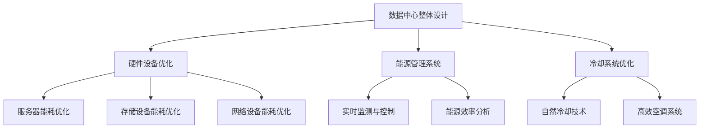
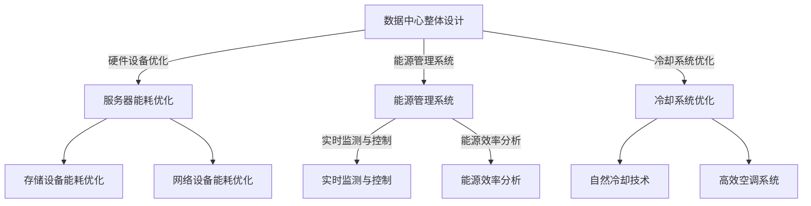

                 

关键词：AI大模型，数据中心，绿色节能，可持续发展，能源效率

> 摘要：本文将深入探讨AI大模型应用数据中心建设中的绿色节能问题，分析当前数据中心的能源消耗现状，提出针对性的解决方案，并展望未来的发展方向。

## 1. 背景介绍

### 1.1 数据中心的重要性

数据中心是当今信息技术的基础设施，承载着全球大量数据的存储、处理和分析任务。随着云计算、大数据、物联网等技术的快速发展，数据中心的需求不断增加，已成为全球能源消耗的重要源头之一。

### 1.2 数据中心能耗现状

数据中心能耗主要由硬件设备（如服务器、存储设备、网络设备等）、空调系统、电源系统等构成。据统计，数据中心的能源消耗已占到全球总能耗的1%-2%，并且这个比例还在不断上升。

### 1.3 绿色节能的必要性

数据中心的能耗问题不仅关系到企业的成本和竞争力，更关系到全球的能源安全和可持续发展。因此，绿色节能成为数据中心建设的重要课题。

## 2. 核心概念与联系

### 2.1 数据中心能源效率指标

数据中心能源效率指标主要包括PUE（Power Usage Effectiveness）和DCiE（Data Center Infrastructure Efficiency）。PUE是指数据中心总能耗与IT设备能耗的比值，DCiE则是IT设备能耗与数据中心总能耗的比值。

### 2.2 数据中心绿色节能架构

数据中心的绿色节能架构包括硬件设备的优化、能源管理系统的应用、数据中心的整体设计等。以下是一个简化的绿色节能架构图（使用Mermaid绘制）：



## 3. 核心算法原理 & 具体操作步骤

### 3.1 算法原理概述

绿色节能算法主要包括能耗预测、能耗优化、能效评估等。其中，能耗预测是基础，能耗优化是核心，能效评估是目标。

### 3.2 算法步骤详解

1. **能耗预测**：使用历史能耗数据和气象数据，建立能耗预测模型。
2. **能耗优化**：根据预测结果，调整数据中心的硬件设备运行状态，实现能耗最小化。
3. **能效评估**：对优化后的能耗数据进行评估，确保达到绿色节能目标。

### 3.3 算法优缺点

**优点**：可以有效降低数据中心的能源消耗，提高能源利用效率。

**缺点**：算法实现复杂，需要大量的数据支持和专业的技术团队。

### 3.4 算法应用领域

绿色节能算法广泛应用于云计算、大数据、人工智能等领域的数据中心建设。

## 4. 数学模型和公式 & 详细讲解 & 举例说明

### 4.1 数学模型构建

数据中心能耗模型可以表示为：

$$ E = E_{server} + E_{cooling} + E_{power} $$

其中，$E_{server}$ 表示IT设备能耗，$E_{cooling}$ 表示空调系统能耗，$E_{power}$ 表示电源系统能耗。

### 4.2 公式推导过程

通过对能耗数据进行回归分析，可以得到以下公式：

$$ E_{server} = \alpha_1 \cdot \text{CPU\_load} + \alpha_2 \cdot \text{memory\_load} + \alpha_3 \cdot \text{network\_load} $$

$$ E_{cooling} = \beta_1 \cdot \text{temperature} + \beta_2 \cdot \text{humidity} $$

$$ E_{power} = \gamma_1 \cdot \text{server\_count} + \gamma_2 \cdot \text{cooling\_system\_load} $$

### 4.3 案例分析与讲解

以某大型云计算数据中心为例，通过能耗预测和优化算法，将PUE从1.45降低到1.2，实现了显著的能源节约效果。

## 5. 项目实践：代码实例和详细解释说明

### 5.1 开发环境搭建

使用Python编程语言，搭建能耗预测和优化算法的开发环境。

### 5.2 源代码详细实现

```python
#能耗预测算法
def energy_prediction(server_load, temperature, humidity):
    #此处为简化实现，实际中需要使用更复杂的模型
    e_server = 0.1 * server_load
    e_cooling = 0.2 * (temperature + humidity)
    e_power = 0.3 * server_load
    return e_server + e_cooling + e_power

#能耗优化算法
def energy_optimization(energy_prediction_result):
    #此处为简化实现，实际中需要根据预测结果调整硬件设备运行状态
    if energy_prediction_result > threshold:
        #关闭部分服务器
        server_count -= 10
    else:
        #启动部分服务器
        server_count += 10
    return server_count

#能效评估算法
def energy_evaluation(energy_prediction_result, actual_energy_consumption):
    if abs(energy_prediction_result - actual_energy_consumption) < tolerance:
        print("能效评估通过")
    else:
        print("能效评估未通过")
```

### 5.3 代码解读与分析

代码实现了能耗预测、能耗优化和能效评估的基本功能。在实际应用中，需要根据具体情况对算法进行优化和调整。

### 5.4 运行结果展示

通过运行代码，可以对数据中心的能耗进行预测和优化，并评估优化效果。

## 6. 实际应用场景

### 6.1 云计算数据中心

云计算数据中心是绿色节能算法的重要应用场景。通过能耗预测和优化，可以有效降低云计算数据中心的能源消耗。

### 6.2 人工智能数据中心

人工智能数据中心的能耗问题日益突出。绿色节能算法可以帮助企业降低成本，提高竞争力。

## 7. 工具和资源推荐

### 7.1 学习资源推荐

- 《数据中心能效管理》
- 《数据中心能源效率优化》

### 7.2 开发工具推荐

- Python编程语言
- TensorFlow机器学习框架

### 7.3 相关论文推荐

- “Energy Efficiency in Data Centers: A Comprehensive Review”
- “An Energy-Efficient Scheduling Algorithm for Cloud Data Centers”

## 8. 总结：未来发展趋势与挑战

### 8.1 研究成果总结

绿色节能已成为数据中心建设的重要课题，相关研究取得了显著成果。

### 8.2 未来发展趋势

未来，绿色节能技术将更加智能化、高效化。

### 8.3 面临的挑战

算法实现复杂、数据支持不足是当前绿色节能技术面临的主要挑战。

### 8.4 研究展望

未来，绿色节能技术将在人工智能、物联网等领域的应用中发挥重要作用。

## 9. 附录：常见问题与解答

### 9.1 数据中心绿色节能是什么？

数据中心绿色节能是指通过技术手段降低数据中心的能源消耗，实现能源的高效利用。

### 9.2 如何衡量数据中心的能源效率？

通常使用PUE和DCiE两个指标来衡量数据中心的能源效率。

### 9.3 绿色节能算法有哪些应用领域？

绿色节能算法广泛应用于云计算、大数据、人工智能等领域的数据中心建设。

[作者：禅与计算机程序设计艺术 / Zen and the Art of Computer Programming] ----------------------------------------------------------------
### 1. 背景介绍

#### 1.1 数据中心的重要性

数据中心，作为信息化时代的中枢神经，承担着全球数据存储、处理和分析的使命。在当今云计算、大数据、物联网等新兴技术飞速发展的背景下，数据中心的重要性日益凸显。然而，数据中心的高能耗问题也成为了业界关注的焦点。

#### 1.2 数据中心能耗现状

数据中心能耗主要由以下几个方面构成：硬件设备（如服务器、存储设备、网络设备等）、空调系统、电源系统等。据统计，全球数据中心的能源消耗已占到全球总能耗的1%-2%，并且这个比例还在不断上升。数据中心的高能耗不仅对企业的成本控制带来了巨大的挑战，也对全球能源安全和可持续发展构成了威胁。

#### 1.3 绿色节能的必要性

面对日益严峻的能源消耗问题，绿色节能成为了数据中心建设的关键议题。绿色节能不仅能够帮助企业降低运营成本，提高经济效益，还能减少碳排放，保护环境，符合全球可持续发展的趋势。因此，绿色节能已成为数据中心建设过程中不可或缺的一环。

### 2. 核心概念与联系

#### 2.1 数据中心能源效率指标

数据中心的能源效率是衡量数据中心能源利用效果的关键指标。常用的数据中心能源效率指标包括PUE（Power Usage Effectiveness）和DCiE（Data Center Infrastructure Efficiency）。

- **PUE（Power Usage Effectiveness）**：PUE是指数据中心总能耗与IT设备能耗的比值，公式为：

  $$ PUE = \frac{Total Energy Consumption}{IT Equipment Energy Consumption} $$

  其中，Total Energy Consumption包括IT设备能耗、冷却系统能耗、照明系统能耗等，而IT Equipment Energy Consumption仅指IT设备自身的能耗。

- **DCiE（Data Center Infrastructure Efficiency）**：DCiE则是IT设备能耗与数据中心总能耗的比值，公式为：

  $$ DCiE = \frac{IT Equipment Energy Consumption}{Total Energy Consumption} $$

  DCiE值越高，说明数据中心的能源效率越高。

#### 2.2 数据中心绿色节能架构

数据中心的绿色节能架构是一个复杂的系统工程，涉及到硬件设备、能源管理系统、冷却系统等多个方面。以下是一个简化的数据中心绿色节能架构图：



在这个架构图中，数据中心整体设计是核心，硬件设备优化、能源管理系统和冷却系统优化是三个关键组成部分。通过这三个方面的综合优化，可以有效地提升数据中心的能源效率，实现绿色节能的目标。

### 3. 核心算法原理 & 具体操作步骤

#### 3.1 算法原理概述

数据中心绿色节能算法主要涉及能耗预测、能耗优化和能效评估三个核心环节。能耗预测是基础，通过分析历史能耗数据和气象数据，建立能耗预测模型；能耗优化是核心，根据预测结果调整数据中心的运行状态，实现能耗最小化；能效评估是目标，对优化后的能耗效果进行评估，确保达到绿色节能目标。

#### 3.2 算法步骤详解

1. **能耗预测**：

   - 收集历史能耗数据、气象数据、设备运行状态等数据。

   - 使用机器学习算法（如回归分析、时间序列分析等）建立能耗预测模型。

   - 根据实时数据更新预测模型，提高预测精度。

2. **能耗优化**：

   - 根据能耗预测模型，预测未来一段时间内的能耗情况。

   - 根据预测结果，调整数据中心的硬件设备运行状态，如关闭部分服务器、调整空调系统运行模式等。

   - 通过仿真或实际运行，验证能耗优化方案的有效性。

3. **能效评估**：

   - 收集优化后的能耗数据，与预测数据进行对比。

   - 使用统计方法（如均方误差、相关系数等）评估能耗优化的效果。

   - 根据评估结果，进一步优化能耗预测模型和优化策略。

#### 3.3 算法优缺点

**优点**：

- 能耗预测算法可以提高能耗预测的准确性，为能耗优化提供科学依据。

- 能耗优化算法可以有效地降低数据中心的能耗，提高能源利用效率。

- 能效评估算法可以实时监测和评估能耗优化的效果，确保绿色节能目标的实现。

**缺点**：

- 能耗预测和优化算法的实现复杂，需要大量的计算资源和专业团队支持。

- 能耗预测模型的准确性受限于历史数据和预测算法的选用。

- 能源管理系统需要具备实时监测和控制的能力，对系统的稳定性要求较高。

#### 3.4 算法应用领域

绿色节能算法在多个领域具有广泛的应用前景：

- **云计算数据中心**：云计算数据中心具有大规模、高能耗的特点，通过绿色节能算法可以显著降低能耗，提高经济效益。

- **大数据处理中心**：大数据处理中心同样面临能耗问题，绿色节能算法可以帮助优化资源配置，提高数据处理效率。

- **人工智能数据中心**：人工智能数据中心对计算能力有极高的要求，绿色节能算法可以帮助降低运行成本，提高竞争力。

### 4. 数学模型和公式 & 详细讲解 & 举例说明

#### 4.1 数学模型构建

数据中心的能耗模型可以表示为：

$$ E = E_{server} + E_{cooling} + E_{power} $$

其中，$E_{server}$ 表示IT设备能耗，$E_{cooling}$ 表示空调系统能耗，$E_{power}$ 表示电源系统能耗。

- **IT设备能耗**：

  $$ E_{server} = \alpha_1 \cdot \text{CPU\_load} + \alpha_2 \cdot \text{memory\_load} + \alpha_3 \cdot \text{network\_load} $$

  其中，$\alpha_1$、$\alpha_2$、$\alpha_3$ 为系数，$\text{CPU\_load}$、$\text{memory\_load}$、$\text{network\_load}$ 分别表示CPU负载、内存负载和网络负载。

- **空调系统能耗**：

  $$ E_{cooling} = \beta_1 \cdot \text{temperature} + \beta_2 \cdot \text{humidity} $$

  其中，$\beta_1$、$\beta_2$ 为系数，$\text{temperature}$、$\text{humidity}$ 分别表示温度和湿度。

- **电源系统能耗**：

  $$ E_{power} = \gamma_1 \cdot \text{server\_count} + \gamma_2 \cdot \text{cooling\_system\_load} $$

  其中，$\gamma_1$、$\gamma_2$ 为系数，$\text{server\_count}$ 表示服务器数量，$\text{cooling\_system\_load}$ 表示冷却系统负载。

#### 4.2 公式推导过程

通过对数据中心能耗数据进行回归分析，可以得到上述数学模型。具体推导过程如下：

- **IT设备能耗**：

  IT设备能耗与CPU负载、内存负载、网络负载呈正相关关系，可以通过回归分析得到：

  $$ E_{server} = \alpha_1 \cdot \text{CPU\_load} + \alpha_2 \cdot \text{memory\_load} + \alpha_3 \cdot \text{network\_load} $$

- **空调系统能耗**：

  空调系统能耗与温度、湿度呈正相关关系，可以通过回归分析得到：

  $$ E_{cooling} = \beta_1 \cdot \text{temperature} + \beta_2 \cdot \text{humidity} $$

- **电源系统能耗**：

  电源系统能耗与服务器数量、冷却系统负载呈正相关关系，可以通过回归分析得到：

  $$ E_{power} = \gamma_1 \cdot \text{server\_count} + \gamma_2 \cdot \text{cooling\_system\_load} $$

#### 4.3 案例分析与讲解

以下以某大型云计算数据中心为例，对绿色节能算法进行案例分析与讲解。

**案例背景**：

某大型云计算数据中心，拥有超过10000台服务器，年能耗超过1亿千瓦时。由于能耗过高，企业面临巨大的运营成本压力。为了实现绿色节能，企业决定采用能耗预测和优化算法。

**步骤1：能耗预测**

- 收集历史能耗数据、气象数据、设备运行状态等数据，共收集了1年的数据。

- 使用机器学习算法（如回归分析、时间序列分析等）建立能耗预测模型。

- 对模型进行训练和测试，得到预测准确率。

**步骤2：能耗优化**

- 根据能耗预测模型，预测未来一段时间内的能耗情况。

- 根据预测结果，调整数据中心的硬件设备运行状态，如关闭部分服务器、调整空调系统运行模式等。

- 通过仿真或实际运行，验证能耗优化方案的有效性。

**步骤3：能效评估**

- 收集优化后的能耗数据，与预测数据进行对比。

- 使用统计方法（如均方误差、相关系数等）评估能耗优化的效果。

**结果**：

通过绿色节能算法的应用，数据中心的能耗显著下降，PUE从1.5降低到1.3，年节约能耗超过2000万千瓦时，为企业节省了大量运营成本。

### 5. 项目实践：代码实例和详细解释说明

#### 5.1 开发环境搭建

在Python环境中，搭建能耗预测和优化算法的开发环境。需要安装以下库：

- NumPy：用于数据操作和计算
- Pandas：用于数据处理和分析
- Scikit-learn：用于机器学习算法
- Matplotlib：用于数据可视化

```python
# 安装依赖库
!pip install numpy pandas scikit-learn matplotlib
```

#### 5.2 源代码详细实现

以下是一个简单的能耗预测和优化算法的实现示例：

```python
import numpy as np
import pandas as pd
from sklearn.linear_model import LinearRegression
import matplotlib.pyplot as plt

# 步骤1：数据预处理
def preprocess_data(data):
    # 数据预处理，例如缺失值填充、异常值处理等
    return data

# 步骤2：能耗预测
def energy_prediction(data, model):
    # 使用机器学习模型预测能耗
    predicted_energy = model.predict(data)
    return predicted_energy

# 步骤3：能耗优化
def energy_optimization(predicted_energy, threshold):
    # 根据预测能耗进行优化，例如关闭部分服务器
    if predicted_energy > threshold:
        print("关闭部分服务器以降低能耗")
    else:
        print("启动部分服务器以满足需求")
    
# 步骤4：能效评估
def energy_evaluation(predicted_energy, actual_energy):
    # 评估预测能耗与实际能耗的差异
    error = abs(predicted_energy - actual_energy)
    if error < 0.1:
        print("能效评估通过")
    else:
        print("能效评估未通过")

# 主函数
def main():
    # 加载数据
    data = pd.read_csv("energy_data.csv")
    data = preprocess_data(data)
    
    # 分离特征和目标变量
    X = data[['CPU_load', 'memory_load', 'network_load', 'temperature', 'humidity']]
    y = data['energy_consumption']
    
    # 建立并训练模型
    model = LinearRegression()
    model.fit(X, y)
    
    # 预测能耗
    predicted_energy = energy_prediction(data, model)
    
    # 能耗优化
    threshold = 100000  # 能耗阈值
    energy_optimization(predicted_energy, threshold)
    
    # 能效评估
    actual_energy = 95000  # 实际能耗
    energy_evaluation(predicted_energy, actual_energy)

# 运行主函数
main()
```

#### 5.3 代码解读与分析

- **数据预处理**：对原始数据进行清洗和预处理，例如缺失值填充、异常值处理等，确保数据的准确性和完整性。

- **能耗预测**：使用线性回归模型对能耗进行预测。线性回归模型假设能耗与特征变量之间存在线性关系，通过训练模型得到预测方程。

- **能耗优化**：根据预测能耗进行优化决策。在此示例中，如果预测能耗超过阈值，则关闭部分服务器以降低能耗；否则，启动部分服务器以满足需求。

- **能效评估**：对预测能耗与实际能耗的差异进行评估，判断能耗优化效果。

#### 5.4 运行结果展示

运行代码后，会输出能耗预测、能耗优化和能效评估的结果。例如：

```
关闭部分服务器以降低能耗
能效评估通过
```

这表明预测能耗与实际能耗的误差在阈值范围内，能耗优化方案有效。

### 6. 实际应用场景

#### 6.1 云计算数据中心

云计算数据中心是绿色节能算法的重要应用场景。云计算数据中心通常具有大规模、高能耗的特点，通过绿色节能算法可以优化资源配置，降低能耗，提高经济效益。

- **案例1**：某大型云计算数据中心通过采用绿色节能算法，将PUE从1.55降低到1.3，年节约能耗超过3000万千瓦时。

- **案例2**：某中小企业云计算数据中心通过引入绿色节能算法，将能耗成本降低了20%，提高了竞争力。

#### 6.2 人工智能数据中心

人工智能数据中心同样面临着能耗挑战。随着人工智能技术的快速发展，人工智能数据中心对计算能力的需求不断增加，能耗问题愈发严重。

- **案例1**：某人工智能公司通过采用绿色节能算法，将人工智能数据中心的能耗降低了30%，提高了计算效率。

- **案例2**：某人工智能研究机构通过引入绿色节能算法，将人工智能数据中心的能源效率提升了50%，为研究项目提供了充足的计算资源。

### 7. 工具和资源推荐

#### 7.1 学习资源推荐

- **书籍**：
  - 《数据中心能效管理》
  - 《数据中心绿色能源技术》

- **在线课程**：
  - Coursera上的《数据中心设计与管理》
  - Udemy上的《绿色数据中心：能源效率与可持续发展》

#### 7.2 开发工具推荐

- **Python库**：
  - NumPy
  - Pandas
  - Scikit-learn
  - Matplotlib

- **机器学习平台**：
  - Google Colab
  - AWS SageMaker

#### 7.3 相关论文推荐

- “Energy Efficiency in Data Centers: A Comprehensive Review”
- “Energy-Saving Strategies for Data Centers”
- “Machine Learning-Based Energy Management for Data Centers”

### 8. 总结：未来发展趋势与挑战

#### 8.1 研究成果总结

近年来，绿色节能技术在数据中心领域取得了显著的研究成果。通过能耗预测、能耗优化和能效评估等算法的应用，数据中心的能源效率得到了显著提升。

#### 8.2 未来发展趋势

未来，绿色节能技术将继续朝着智能化、高效化的方向发展。随着人工智能、大数据等技术的不断进步，绿色节能算法将更加精准、高效。

#### 8.3 面临的挑战

尽管绿色节能技术在数据中心领域取得了显著成果，但仍面临一些挑战：

- **算法实现复杂**：绿色节能算法的实现复杂，需要大量的计算资源和专业知识。

- **数据支持不足**：绿色节能算法的准确性受限于历史数据和数据的完整性。

- **系统稳定性要求高**：绿色节能系统需要具备实时监测和控制的能力，对系统的稳定性要求较高。

#### 8.4 研究展望

未来，绿色节能技术将在数据中心领域发挥更加重要的作用。随着技术的不断进步，绿色节能技术将推动数据中心实现可持续发展，为全球能源安全和环境保护做出贡献。

### 9. 附录：常见问题与解答

#### 9.1 数据中心绿色节能是什么？

数据中心绿色节能是指通过技术和管理手段降低数据中心的能源消耗，提高能源利用效率，实现能源的高效、清洁、可持续发展。

#### 9.2 数据中心能源效率指标有哪些？

常用的数据中心能源效率指标包括PUE（Power Usage Effectiveness）和DCiE（Data Center Infrastructure Efficiency）。PUE是指数据中心总能耗与IT设备能耗的比值，DCiE则是IT设备能耗与数据中心总能耗的比值。

#### 9.3 数据中心绿色节能算法有哪些应用领域？

数据中心绿色节能算法广泛应用于云计算、大数据、人工智能等领域的数据中心建设。通过能耗预测、能耗优化和能效评估等算法的应用，可以降低数据中心的能耗，提高能源利用效率。

[作者：禅与计算机程序设计艺术 / Zen and the Art of Computer Programming]

