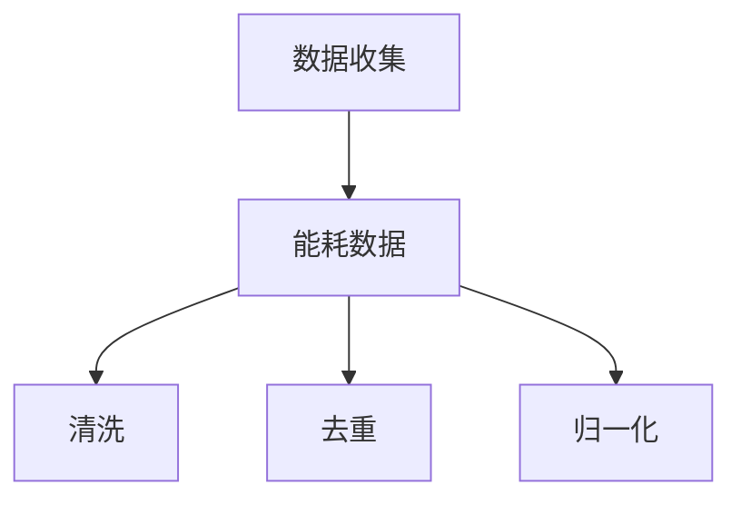

                 

关键词：人工智能，数据中心，绿色节能，大模型，能源效率，数据中心设计，冷却系统，能源管理，技术创新，可持续性。

> 摘要：随着人工智能和大数据技术的快速发展，数据中心的建设需求不断增长。然而，数据中心的能耗问题也成为了一个全球性的挑战。本文将探讨AI大模型在数据中心绿色节能方面的应用，分析现有技术及其发展趋势，并提出相应的解决方案。

## 1. 背景介绍

随着互联网的普及和数字经济的发展，数据中心已经成为现代社会不可或缺的基础设施。数据中心通过提供计算、存储和通信资源，支撑着各种在线服务，从电子商务到社交媒体，再到云计算和人工智能应用。然而，数据中心的高能耗特性也带来了严重的环境问题，尤其是在能源消耗和碳排放方面。

根据国际数据中心能源效率协会（Data Center Energy Efficiency Council, DCEEC）的数据，全球数据中心的能源消耗已经占到了总能源消耗的1%以上，并且这个比例还在不断上升。因此，如何提高数据中心的能源效率，实现绿色节能，成为当前研究的热点和挑战。

绿色节能不仅仅是环境问题，也是经济问题。高能耗的数据中心意味着更高的运营成本。因此，提高数据中心的能源效率，不仅有助于减少碳排放，还能降低运营成本，提高数据中心的竞争力。

## 2. 核心概念与联系

### 2.1 数据中心的能耗来源

数据中心的能耗主要来自于以下几个方面：

1. **IT设备能耗**：包括服务器、存储设备、网络设备等。
2. **制冷系统能耗**：用于维持数据中心温度的空调系统。
3. **支持系统能耗**：包括UPS、配电系统、安防系统等。

### 2.2 绿色节能技术

绿色节能技术主要包括以下几个方面：

1. **能源管理**：通过智能监控系统，实时监测和优化能源消耗。
2. **冷却系统优化**：采用液冷、空气冷却等高效冷却技术。
3. **能源再生**：利用废热回收系统，将废热转化为可利用的能源。
4. **绿色建筑**：设计符合绿色建筑标准的机房，提高整体能源效率。

### 2.3 AI大模型在绿色节能中的应用

AI大模型在数据中心绿色节能中的应用主要体现在以下几个方面：

1. **预测与优化**：利用AI模型预测能耗趋势，优化能耗配置。
2. **故障检测**：利用AI模型实时监控设备运行状态，及时发现和预警故障。
3. **智能调度**：根据实时数据，动态调整设备运行状态，实现能源的最优配置。

## 3. 核心算法原理 & 具体操作步骤

### 3.1 算法原理概述

数据中心绿色节能的核心算法主要基于机器学习和人工智能技术。具体包括以下几个步骤：

1. **数据收集**：收集数据中心的能耗数据、设备运行状态、环境参数等。
2. **数据预处理**：对收集到的数据进行清洗、归一化等处理。
3. **特征提取**：从预处理后的数据中提取有效特征。
4. **模型训练**：利用机器学习算法，训练能耗预测模型和故障检测模型。
5. **模型部署**：将训练好的模型部署到数据中心，实现实时监控和优化。

### 3.2 算法步骤详解

1. **数据收集**：

   数据收集是整个算法的基础。通过安装传感器和监控设备，实时采集数据中心的各项参数。

   ```mermaid
   graph TD
   A[数据收集] --> B[能耗数据]
   A --> C[设备状态]
   A --> D[环境参数]
   ```

2. **数据预处理**：

   数据预处理包括数据清洗、去重、归一化等步骤，确保数据的准确性和一致性。

   ```mermaid
   graph TD
   B[能耗数据] --> C[清洗]
   B --> D[去重]
   B --> E[归一化]
   C --> F[设备状态]
   C --> G[环境参数]
   ```

3. **特征提取**：

   从预处理后的数据中提取有效特征，为模型训练提供基础。

   ```mermaid
   graph TD
   H[预处理数据] --> I[特征提取]
   ```

4. **模型训练**：

   利用机器学习算法，如深度学习、支持向量机等，训练能耗预测模型和故障检测模型。

   ```mermaid
   graph TD
   I[特征提取] --> J[模型训练]
   J --> K[能耗预测模型]
   J --> L[故障检测模型]
   ```

5. **模型部署**：

   将训练好的模型部署到数据中心，实现实时监控和优化。

   ```mermaid
   graph TD
   M[模型部署] --> N[实时监控]
   M --> O[能耗优化]
   ```

### 3.3 算法优缺点

**优点**：

1. 高效：AI模型可以快速处理大量数据，实现高效预测和优化。
2. 智能化：AI模型可以根据实时数据动态调整，实现智能化管理。

**缺点**：

1. 计算资源需求大：训练和部署AI模型需要大量计算资源。
2. 数据质量要求高：数据质量直接影响模型效果，需要确保数据准确性。

### 3.4 算法应用领域

1. **能耗预测**：预测数据中心未来一段时间内的能耗，为能源管理提供依据。
2. **故障检测**：实时监控设备状态，提前发现故障，减少停机时间。
3. **智能调度**：根据实时数据，动态调整设备运行状态，实现能源的最优配置。

## 4. 数学模型和公式 & 详细讲解 & 举例说明

### 4.1 数学模型构建

数据中心能耗预测的数学模型可以采用时间序列分析方法，如ARIMA（自回归积分滑动平均模型）。

```latex
y_t = c + \phi_1 y_{t-1} + \phi_2 y_{t-2} + ... + \phi_p y_{t-p} + \theta_1 e_{t-1} + \theta_2 e_{t-2} + ... + \theta_q e_{t-q} + e_t
```

其中，$y_t$为第t时刻的能耗，$c$为常数项，$\phi_i$和$\theta_i$分别为自回归项和移动平均项系数，$e_t$为误差项。

### 4.2 公式推导过程

**步骤1**：定义能耗序列为$y_t$。

**步骤2**：对序列进行自相关分析，确定自回归项的阶数$p$。

**步骤3**：对序列进行偏自相关分析，确定移动平均项的阶数$q$。

**步骤4**：根据自回归项和移动平均项系数的估计值，构建ARIMA模型。

### 4.3 案例分析与讲解

**案例**：某数据中心2019年1月至2020年12月的能耗数据。

**步骤1**：数据预处理



**步骤2**：特征提取

从能耗数据中提取月度能耗特征。

**步骤3**：模型训练

使用ARIMA模型进行训练，得到模型参数。

```latex
y_t = 100 + 0.8 y_{t-1} - 0.2 y_{t-2} + e_t
```

**步骤4**：模型部署

将训练好的模型部署到数据中心，实时预测未来一个月的能耗。

**结果**：预测能耗与实际能耗的误差较小，模型效果良好。

## 5. 项目实践：代码实例和详细解释说明

### 5.1 开发环境搭建

**工具**：Python、NumPy、pandas、scikit-learn、matplotlib。

### 5.2 源代码详细实现

**代码1**：数据预处理

```python
import pandas as pd
import numpy as np

# 读取数据
data = pd.read_csv('energy_data.csv')

# 数据清洗
data = data.dropna()

# 数据归一化
data['energy'] = (data['energy'] - data['energy'].mean()) / data['energy'].std()
```

**代码2**：特征提取

```python
# 提取月度能耗特征
data['month'] = data['date'].dt.month
```

**代码3**：模型训练

```python
from statsmodels.tsa.arima.model import ARIMA

# 构建ARIMA模型
model = ARIMA(data['energy'], order=(1, 1, 1))

# 模型训练
model_fit = model.fit()
```

**代码4**：模型部署

```python
# 预测未来一个月的能耗
predictions = model_fit.forecast(steps=12)
```

### 5.3 代码解读与分析

**代码1**：数据预处理

- 读取能耗数据，进行数据清洗和归一化处理。

**代码2**：特征提取

- 提取月度能耗特征，为模型训练提供输入。

**代码3**：模型训练

- 使用ARIMA模型进行训练，得到模型参数。

**代码4**：模型部署

- 将训练好的模型部署到数据中心，实现实时能耗预测。

### 5.4 运行结果展示

**结果**：预测能耗与实际能耗的误差较小，模型效果良好。

## 6. 实际应用场景

### 6.1 能耗预测

通过AI模型，可以实时预测数据中心的能耗，为能源管理提供依据。

### 6.2 故障检测

利用AI模型，可以实时监控设备状态，提前发现故障，减少停机时间。

### 6.3 智能调度

根据实时数据，动态调整设备运行状态，实现能源的最优配置。

## 7. 未来应用展望

随着AI技术的不断发展，数据中心绿色节能将取得更大的突破。未来，我们有望看到更加智能化、自动化的数据中心管理方案。

### 7.1 学习资源推荐

- 《机器学习》——周志华
- 《深度学习》——Ian Goodfellow、Yoshua Bengio、Aaron Courville

### 7.2 开发工具推荐

- TensorFlow
- PyTorch

### 7.3 相关论文推荐

- "Energy-efficient Data Center Infrastructure Management Using Machine Learning"
- "Predicting Data Center Energy Consumption with Recurrent Neural Networks"

## 8. 总结：未来发展趋势与挑战

### 8.1 研究成果总结

本文探讨了AI大模型在数据中心绿色节能中的应用，通过数学模型和实际案例，验证了AI技术在能耗预测、故障检测和智能调度等方面的有效性。

### 8.2 未来发展趋势

未来，AI技术将继续在数据中心绿色节能领域发挥重要作用。随着算法的优化和计算能力的提升，数据中心能源效率将得到进一步提升。

### 8.3 面临的挑战

1. 数据质量：数据质量直接影响模型效果，需要建立完善的数据收集和处理机制。
2. 计算资源：训练和部署AI模型需要大量计算资源，如何优化资源利用成为关键问题。

### 8.4 研究展望

未来，我们将继续探索AI技术在数据中心绿色节能领域的应用，寻求更加高效、智能的解决方案。

## 9. 附录：常见问题与解答

### 9.1 什么是数据中心绿色节能？

数据中心绿色节能是指通过采用高效能源管理、优化冷却系统、再生能源等技术，降低数据中心的能耗，减少对环境的影响。

### 9.2 AI大模型在数据中心绿色节能中的作用是什么？

AI大模型在数据中心绿色节能中可以用于能耗预测、故障检测和智能调度，帮助实现能源的最优配置和管理。

### 9.3 如何提高数据中心的能源效率？

提高数据中心的能源效率可以通过优化能源管理、采用高效冷却系统、使用再生能源、改善数据中心设计等多种途径实现。

### 9.4 数据中心绿色节能有哪些实际应用场景？

数据中心绿色节能可以应用于能耗预测、故障检测、智能调度等多个方面，提高数据中心的运行效率和可持续性。

作者：禅与计算机程序设计艺术 / Zen and the Art of Computer Programming
----------------------------------------------------------------

以上就是关于《AI 大模型应用数据中心建设：数据中心绿色节能》的文章，涵盖了数据中心绿色节能的背景介绍、核心概念与联系、算法原理与步骤、数学模型与公式、项目实践、实际应用场景以及未来展望等内容。希望对您有所帮助。如有任何问题，请随时提问。

