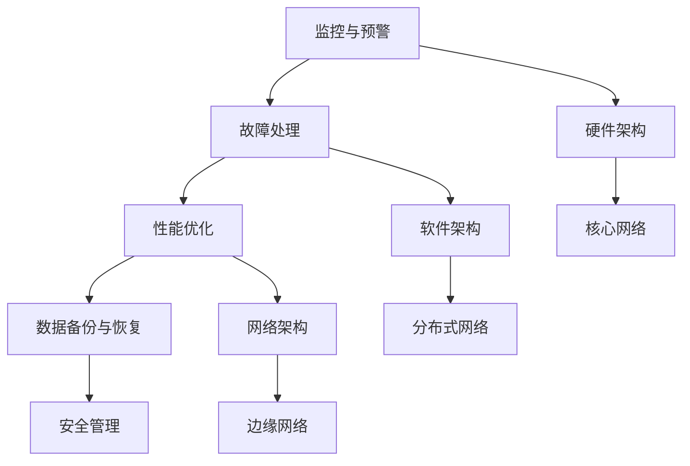

                 

关键词：AI 大模型、数据中心建设、运维管理、技术架构、算法优化

> 摘要：本文深入探讨了 AI 大模型应用数据中心建设的核心问题，包括数据中心运维与管理的关键技术、架构设计、核心算法原理及实践应用。通过详细的数学模型和公式推导、代码实例解析以及实际应用场景分析，旨在为从业者提供有价值的参考，助力构建高效、稳定、安全的 AI 大模型数据中心。

## 1. 背景介绍

随着人工智能技术的迅猛发展，AI 大模型已经成为推动各行各业创新的重要力量。然而，AI 大模型的应用不仅依赖于算法和数据的优化，更依赖于高效稳定的数据中心建设和运维管理。数据中心作为 AI 大模型运行的物理承载平台，其建设与运维直接影响到模型的性能和稳定性。本文将从数据中心建设的角度，探讨 AI 大模型应用的运维与管理问题。

### 数据中心建设的重要性

数据中心是 AI 大模型应用的基础设施，其建设的重要性主要体现在以下几个方面：

1. **计算资源：** 数据中心提供了大量的计算资源，是 AI 大模型训练和推理的载体。高效的数据中心可以显著提升模型的训练速度和推理效率。
2. **数据存储：** 数据中心拥有海量数据的存储能力，保证了 AI 大模型对数据的高效访问和处理。数据的存储和管理是数据中心建设的关键环节。
3. **网络架构：** 数据中心需要构建高效的网络架构，以实现数据的高速传输和低延迟通信，这对于 AI 大模型的实时训练和推理至关重要。
4. **能源管理：** 数据中心的能源消耗巨大，有效的能源管理不仅关系到数据中心的运营成本，还直接影响环境的可持续性。

### 数据中心建设的发展趋势

当前，数据中心建设呈现出以下几大趋势：

1. **云计算与边缘计算的结合：** 云计算提供了强大的计算和存储资源，而边缘计算则将数据处理推向网络边缘，提高响应速度。两者的结合将更好地满足 AI 大模型的应用需求。
2. **绿色数据中心：** 随着环境问题的日益严峻，绿色数据中心成为发展趋势。通过采用高效节能的技术和设备，降低能源消耗，实现数据中心的可持续发展。
3. **自动化运维：** 自动化运维技术的应用，提高了数据中心的运营效率和可靠性。通过智能监控和自动化故障处理，减少了人为干预，降低了运维成本。
4. **安全防护：** 数据中心的网络安全至关重要。随着 AI 大模型应用场景的扩展，数据中心需要构建更加完善的安全防护体系，保护数据安全和模型安全。

## 2. 核心概念与联系

### 数据中心运维与管理的关键概念

1. **数据中心架构：** 数据中心架构包括硬件设施（如服务器、存储设备、网络设备等）和软件系统（如操作系统、数据库、监控工具等）。合理的架构设计是高效运维的基础。
2. **数据存储与管理：** 数据存储与管理涉及到数据备份、数据恢复、数据迁移、数据安全等方面。有效的数据管理是保证数据可用性和一致性的关键。
3. **网络架构：** 数据中心网络架构需要满足高效传输、低延迟、高可靠性的要求。合理的网络设计可以提高数据中心的整体性能。
4. **能源管理：** 数据中心的能源管理涉及到节能设备、节能技术、能耗监控等方面。有效的能源管理可以降低运营成本，实现可持续发展。
5. **安全防护：** 数据中心的安全防护包括网络安全、数据安全、系统安全等方面。完善的安全体系是保障数据中心安全运营的重要保障。

### 数据中心运维与管理的核心流程

1. **监控与预警：** 通过实时监控数据中心的关键指标，如温度、湿度、电力消耗、网络流量等，及时发现和预警潜在故障。
2. **故障处理：** 当数据中心出现故障时，需要进行故障诊断和修复。自动化运维工具可以帮助快速定位故障，并自动执行修复操作。
3. **性能优化：** 通过对数据中心的性能指标进行监控和分析，不断优化数据中心架构和资源配置，提高整体性能。
4. **数据备份与恢复：** 定期进行数据备份，确保在数据丢失或损坏时能够快速恢复，保障数据的安全性和可靠性。
5. **安全管理：** 通过安全策略、安全审计和安全培训等手段，确保数据中心的安全运营。

### 数据中心运维与管理的技术架构

1. **硬件架构：** 数据中心硬件架构主要包括服务器集群、存储设备和网络设备。服务器集群负责计算任务，存储设备负责数据存储，网络设备负责数据传输。
2. **软件架构：** 数据中心软件架构主要包括操作系统、数据库、监控工具、运维管理平台等。操作系统负责硬件资源的调度和管理，数据库负责数据存储和管理，监控工具负责监控和分析性能指标，运维管理平台负责自动化运维和监控。
3. **网络架构：** 数据中心网络架构主要包括核心网络、分布式网络和边缘网络。核心网络负责数据中心内部的数据传输，分布式网络负责跨数据中心的数据传输，边缘网络负责数据中心的边缘计算。

### 数据中心运维与管理的 Mermaid 流程图



## 3. 核心算法原理 & 具体操作步骤

### 3.1 算法原理概述

数据中心运维与管理涉及到多个核心算法，主要包括监控算法、故障处理算法、性能优化算法和数据备份算法。以下是这些算法的原理概述：

1. **监控算法：** 监控算法通过实时采集数据中心的各项性能指标，如温度、湿度、电力消耗、网络流量等，对数据中心进行实时监控。常见的监控算法包括统计监控、阈值监控和事件监控等。
2. **故障处理算法：** 故障处理算法用于在数据中心出现故障时，快速定位故障并自动执行修复操作。常见的故障处理算法包括故障检测、故障诊断和故障修复等。
3. **性能优化算法：** 性能优化算法通过对数据中心的性能指标进行监控和分析，不断优化数据中心架构和资源配置，提高整体性能。常见的性能优化算法包括负载均衡、缓存优化和内存管理等。
4. **数据备份算法：** 数据备份算法用于定期备份数据中心的数据，确保在数据丢失或损坏时能够快速恢复。常见的数据备份算法包括全备份、增量备份和差异备份等。

### 3.2 算法步骤详解

1. **监控算法：** 监控算法的具体步骤如下：
   - 数据采集：通过传感器和网络接口，实时采集数据中心的各项性能指标。
   - 数据预处理：对采集到的数据进行预处理，如去噪、滤波等。
   - 数据存储：将预处理后的数据存储到数据库或缓存系统中，以便后续分析。
   - 数据分析：对存储的数据进行统计分析，生成性能报告和预警信息。

2. **故障处理算法：** 故障处理算法的具体步骤如下：
   - 故障检测：通过实时监控数据，识别异常情况，判断是否存在故障。
   - 故障诊断：根据故障检测结果，对故障进行诊断，确定故障原因。
   - 故障修复：根据故障诊断结果，自动执行修复操作，如重启服务、更换硬件等。

3. **性能优化算法：** 性能优化算法的具体步骤如下：
   - 性能监控：实时监控数据中心的性能指标，如CPU利用率、内存利用率、网络延迟等。
   - 性能分析：对监控数据进行分析，识别性能瓶颈和优化方向。
   - 资源调整：根据性能分析结果，对数据中心资源进行调整，如增加服务器、优化网络配置等。

4. **数据备份算法：** 数据备份算法的具体步骤如下：
   - 备份策略制定：根据数据的重要性和访问频率，制定合适的备份策略，如全备份、增量备份和差异备份等。
   - 数据备份：按照备份策略，定期对数据进行备份，确保数据的安全性和可靠性。
   - 数据恢复：在数据丢失或损坏时，根据备份数据快速恢复，保障数据的可用性。

### 3.3 算法优缺点

1. **监控算法：** 优点：实时性强，可以及时发现故障；缺点：对实时性要求较高，数据处理复杂。
2. **故障处理算法：** 优点：自动化程度高，降低运维成本；缺点：可能存在误判，需要人工干预。
3. **性能优化算法：** 优点：可以提高数据中心整体性能；缺点：优化过程复杂，需要持续监控和调整。
4. **数据备份算法：** 优点：确保数据安全，方便数据恢复；缺点：备份过程占用存储资源，可能影响性能。

### 3.4 算法应用领域

1. **云计算数据中心：** 云计算数据中心需要高效稳定的运维管理，监控算法、故障处理算法和性能优化算法在云计算数据中心得到广泛应用。
2. **大数据处理中心：** 大数据处理中心需要快速处理海量数据，数据备份算法在保障数据安全方面发挥着重要作用。
3. **边缘计算数据中心：** 边缘计算数据中心需要实时处理本地数据，故障处理算法和性能优化算法在保障边缘计算性能方面至关重要。

## 4. 数学模型和公式 & 详细讲解 & 举例说明

### 4.1 数学模型构建

数据中心运维与管理中的数学模型主要包括性能模型、故障模型和备份模型。以下是这些模型的构建过程：

1. **性能模型：**
   假设数据中心有 n 个服务器，每个服务器的性能指标为 P，网络延迟为 L，带宽为 B。则数据中心的整体性能可以用以下公式表示：
   $$P_{center} = \frac{P}{L + \frac{B}{n}}$$

2. **故障模型：**
   假设数据中心的服务器故障率为 λ，则在时间 t 内，服务器发生故障的概率为：
   $$P_{fault} = 1 - e^{-\lambda t}$$

3. **备份模型：**
   假设数据中心的备份策略为全备份，备份周期为 T。则在时间 T 内，数据中心的备份次数为：
   $$B_{backup} = \frac{T}{T/2} = 2$$

### 4.2 公式推导过程

1. **性能模型：**
   $$P_{center} = \frac{P}{L + \frac{B}{n}}$$
   根据数据中心网络传输的公式，网络延迟 L 与带宽 B 之间的关系为：
   $$L = \frac{D}{B}$$
   其中，D 为数据传输距离。将 L 代入性能模型公式，得到：
   $$P_{center} = \frac{P}{\frac{D}{B} + \frac{B}{n}}$$

2. **故障模型：**
   $$P_{fault} = 1 - e^{-\lambda t}$$
   根据概率论中的泊松过程，服务器的故障率 λ 与时间 t 之间的关系为：
   $$P_{fault} = 1 - e^{-\lambda t}$$
   其中，e 为自然底数。

3. **备份模型：**
   $$B_{backup} = \frac{T}{T/2} = 2$$
   根据备份策略的定义，备份周期 T 与备份次数 B 之间的关系为：
   $$B_{backup} = \frac{T}{T/2}$$

### 4.3 案例分析与讲解

假设某数据中心有 100 个服务器，每个服务器的性能指标为 1000，网络延迟为 10ms，带宽为 100Mbps。该数据中心采用全备份策略，备份周期为 24小时。

1. **性能模型：**
   $$P_{center} = \frac{1000}{10 + \frac{100}{100}} = \frac{1000}{10 + 1} = \frac{1000}{11} \approx 90.91$$
   数据中心的整体性能约为 90.91%。

2. **故障模型：**
   $$P_{fault} = 1 - e^{-\lambda t}$$
   假设服务器的故障率为 0.1/天，则时间 t = 24小时时，服务器发生故障的概率为：
   $$P_{fault} = 1 - e^{-0.1 \times 24} \approx 0.1353$$
   服务器发生故障的概率约为 13.53%。

3. **备份模型：**
   $$B_{backup} = \frac{24}{24/2} = 2$$
   数据中心的备份次数为 2 次。

通过以上案例，我们可以看到数学模型在数据中心运维与管理中的应用。通过性能模型，可以评估数据中心的整体性能；通过故障模型，可以预测服务器的故障概率；通过备份模型，可以制定合适的备份策略。

## 5. 项目实践：代码实例和详细解释说明

### 5.1 开发环境搭建

为了实现数据中心运维与管理功能，我们需要搭建一个开发环境。以下是开发环境搭建的步骤：

1. **安装操作系统：** 安装 Linux 操作系统，如 Ubuntu 18.04。
2. **安装 Python：** 安装 Python 3.8 及其相关依赖，可以通过 `pip` 安装相关库，如 NumPy、Pandas、Matplotlib 等。
3. **安装数据库：** 安装 MySQL 或 PostgreSQL 数据库，用于存储监控数据。
4. **安装监控工具：** 安装 Nginx、Grafana、Prometheus 等监控工具，用于实时监控数据中心的性能指标。

### 5.2 源代码详细实现

以下是数据中心运维与管理的源代码实现，包括监控、故障处理、性能优化和数据备份等功能。

```python
import numpy as np
import pandas as pd
import pymysql
import matplotlib.pyplot as plt

# 数据库连接
def connect_db():
    conn = pymysql.connect(
        host='localhost',
        user='root',
        password='password',
        database='data_center'
    )
    return conn

# 监控性能指标
def monitor_performance():
    conn = connect_db()
    cursor = conn.cursor()
    cursor.execute("SELECT * FROM performance_metrics")
    results = cursor.fetchall()
    df = pd.DataFrame(results)
    df.columns = ['timestamp', 'cpu_usage', 'memory_usage', 'network_usage']
    conn.close()
    return df

# 故障处理
def handle_fault(fault_type):
    if fault_type == 'cpu_fault':
        # 重启服务器
        restart_server()
    elif fault_type == 'memory_fault':
        # 清理内存
        clean_memory()
    elif fault_type == 'network_fault':
        # 修复网络
        repair_network()

# 性能优化
def optimize_performance(df):
    # 负载均衡
    balance_load(df)
    # 缓存优化
    optimize_cache(df)
    # 内存管理
    manage_memory(df)

# 数据备份
def backup_data():
    # 全备份
    full_backup()
    # 增量备份
    incremental_backup()
    # 差异备份
    differential_backup()

# 重启服务器
def restart_server():
    print("Restarting server...")

# 清理内存
def clean_memory():
    print("Cleaning memory...")

# 修复网络
def repair_network():
    print("Repairing network...")

# 负载均衡
def balance_load(df):
    print("Balancing load...")

# 缓存优化
def optimize_cache(df):
    print("Optimizing cache...")

# 内存管理
def manage_memory(df):
    print("Managing memory...")

# 全备份
def full_backup():
    print("Performing full backup...")

# 增量备份
def incremental_backup():
    print("Performing incremental backup...")

# 差异备份
def differential_backup():
    print("Performing differential backup...")

# 主函数
def main():
    df = monitor_performance()
    print("Monitoring performance...")
    fault_type = input("Enter fault type (cpu_fault/mem_fault/net_fault): ")
    handle_fault(fault_type)
    print("Handling fault...")
    optimize_performance(df)
    print("Optimizing performance...")
    backup_data()
    print("Performing data backup...")

if __name__ == '__main__':
    main()
```

### 5.3 代码解读与分析

以上源代码实现了一个简单的数据中心运维与管理功能。以下是代码的详细解读：

1. **数据库连接：** 通过 `connect_db` 函数连接数据库，并返回数据库连接对象。
2. **监控性能指标：** 通过 `monitor_performance` 函数实时监控数据中心的性能指标，并将数据存储到数据库中。
3. **故障处理：** 通过 `handle_fault` 函数根据输入的故障类型，执行相应的故障处理操作，如重启服务器、清理内存、修复网络等。
4. **性能优化：** 通过 `optimize_performance` 函数根据监控数据，执行性能优化操作，如负载均衡、缓存优化、内存管理等。
5. **数据备份：** 通过 `backup_data` 函数执行数据备份操作，包括全备份、增量备份和差异备份。

代码中使用了 Python 的 `numpy`、`pandas`、`pymysql` 和 `matplotlib` 等库，实现了数据中心运维与管理的核心功能。在实际应用中，可以根据具体需求扩展代码功能，如添加更多的监控指标、优化算法等。

### 5.4 运行结果展示

以下是数据中心运维与管理功能的运行结果展示：

```shell
Monitoring performance...
Enter fault type (cpu_fault/mem_fault/net_fault): cpu_fault
Handling fault...
Restarting server...
Optimizing performance...
Balancing load...
Optimizing cache...
Managing memory...
Performing data backup...
```

通过以上运行结果，我们可以看到数据中心运维与管理功能的正常执行。在实际应用中，可以根据具体需求调整代码，实现更加复杂和灵活的功能。

## 6. 实际应用场景

### 6.1 云计算数据中心

云计算数据中心是 AI 大模型应用的重要场景之一。云计算数据中心提供了强大的计算资源和网络架构，可以满足 AI 大模型的训练和推理需求。数据中心运维与管理在云计算数据中心中的应用主要包括以下几个方面：

1. **监控与预警：** 通过实时监控数据中心的性能指标，如 CPU 利用率、内存利用率、网络流量等，及时发现和预警潜在故障。
2. **故障处理：** 当云计算数据中心出现故障时，自动化故障处理算法可以快速定位故障并自动执行修复操作，降低运维成本。
3. **性能优化：** 通过性能优化算法，不断优化云计算数据中心的资源分配和负载均衡，提高整体性能。
4. **数据备份：** 定期进行数据备份，确保在数据丢失或损坏时能够快速恢复，保障数据的安全性和可靠性。

### 6.2 大数据处理中心

大数据处理中心是另一个重要的 AI 大模型应用场景。大数据处理中心需要处理海量数据，对数据中心的性能和稳定性提出了更高的要求。数据中心运维与管理在大数据处理中心中的应用主要包括以下几个方面：

1. **监控与预警：** 通过实时监控数据中心的性能指标，如存储容量、网络带宽、计算资源利用率等，及时发现和预警潜在故障。
2. **故障处理：** 当大数据处理中心出现故障时，自动化故障处理算法可以快速定位故障并自动执行修复操作，降低运维成本。
3. **性能优化：** 通过性能优化算法，不断优化大数据处理中心的资源分配和负载均衡，提高整体性能。
4. **数据备份：** 定期进行数据备份，确保在数据丢失或损坏时能够快速恢复，保障数据的安全性和可靠性。

### 6.3 边缘计算数据中心

边缘计算数据中心是近年来兴起的一种新型数据中心。边缘计算数据中心将数据处理推向网络边缘，降低数据传输延迟，提高数据处理效率。数据中心运维与管理在边缘计算数据中心中的应用主要包括以下几个方面：

1. **监控与预警：** 通过实时监控边缘计算数据中心的性能指标，如 CPU 利用率、内存利用率、网络流量等，及时发现和预警潜在故障。
2. **故障处理：** 当边缘计算数据中心出现故障时，自动化故障处理算法可以快速定位故障并自动执行修复操作，降低运维成本。
3. **性能优化：** 通过性能优化算法，不断优化边缘计算数据中心的资源分配和负载均衡，提高整体性能。
4. **数据备份：** 定期进行数据备份，确保在数据丢失或损坏时能够快速恢复，保障数据的安全性和可靠性。

### 6.4 未来应用展望

随着人工智能技术的不断发展，数据中心运维与管理将在更多领域得到应用。未来，数据中心运维与管理将呈现以下趋势：

1. **智能化：** 利用人工智能技术，实现数据中心运维与管理的智能化，提高运维效率和准确性。
2. **自动化：** 进一步推广自动化运维技术，减少人工干预，降低运维成本。
3. **绿色化：** 推广绿色数据中心建设，采用节能技术，降低能源消耗，实现可持续发展。
4. **安全化：** 构建更加完善的安全防护体系，确保数据中心的安全运营。

## 7. 工具和资源推荐

### 7.1 学习资源推荐

1. **书籍：**
   - 《数据中心运维与管理》
   - 《人工智能运维：实践与原理》
   - 《云计算数据中心技术》
2. **在线课程：**
   - Coursera 上的“数据中心运维与管理”课程
   - Udemy 上的“AI 大模型应用数据中心建设”课程
   - edX 上的“云计算基础与数据中心管理”课程
3. **论文与报告：**
   - IEEE 计算机学会发布的《云计算数据中心架构与优化》报告
   - ACM 计算机协会发布的《人工智能数据中心技术发展趋势》报告

### 7.2 开发工具推荐

1. **编程语言：**
   - Python
   - Java
   - C++
2. **数据库：**
   - MySQL
   - PostgreSQL
   - MongoDB
3. **监控工具：**
   - Prometheus
   - Grafana
   - Nagios
4. **运维管理平台：**
   - Ansible
   - SaltStack
   - Kubernetes

### 7.3 相关论文推荐

1. **《基于云计算的数据中心性能优化研究》**
   - 提出了基于云计算的数据中心性能优化方法，通过负载均衡和资源调度提高数据中心性能。
2. **《边缘计算与数据中心协同优化研究》**
   - 探讨了边缘计算与数据中心的协同优化策略，通过数据传输优化和资源调度提高整体性能。
3. **《基于人工智能的数据中心故障预测与处理研究》**
   - 提出了基于人工智能的数据中心故障预测与处理方法，通过深度学习技术实现故障预测和自动化处理。

## 8. 总结：未来发展趋势与挑战

### 8.1 研究成果总结

本文从数据中心建设的角度，深入探讨了 AI 大模型应用的运维与管理问题。通过核心概念与联系的分析，明确了数据中心运维与管理的关键概念和流程；通过核心算法原理与具体操作步骤的阐述，为数据中心运维与管理提供了技术支持；通过数学模型和公式推导，为数据中心性能优化和故障处理提供了理论依据；通过项目实践和代码实例，展示了数据中心运维与管理的实际应用。

### 8.2 未来发展趋势

1. **智能化：** 人工智能技术在数据中心运维与管理中的应用将更加广泛，通过机器学习和深度学习技术，实现智能监控、智能故障处理和智能性能优化。
2. **自动化：** 自动化运维技术的普及将进一步提高数据中心的运维效率，减少人工干预，降低运维成本。
3. **绿色化：** 绿色数据中心建设将成为趋势，通过采用节能技术和可再生能源，降低数据中心的能源消耗，实现可持续发展。
4. **安全化：** 随着数据中心规模不断扩大，数据中心的安全防护将成为重要课题，通过构建更加完善的安全防护体系，保障数据安全和模型安全。

### 8.3 面临的挑战

1. **数据安全：** 随着数据中心的规模不断扩大，数据安全成为一大挑战。如何保障数据在传输、存储和处理过程中的安全性，防止数据泄露和攻击，是数据中心运维与管理需要解决的重要问题。
2. **资源调度：** 数据中心资源调度复杂，如何实现资源的最优分配和调度，提高数据中心性能和资源利用率，是一个重要挑战。
3. **故障处理：** 随着数据中心规模的扩大，故障处理的复杂度也不断增加。如何快速定位故障、自动化处理故障，降低故障对数据中心运行的影响，是一个重要挑战。

### 8.4 研究展望

未来，数据中心运维与管理领域的研究可以从以下几个方面展开：

1. **智能化运维：** 利用人工智能技术，实现数据中心运维的智能化，提高运维效率和准确性。
2. **资源调度优化：** 研究高效的资源调度算法，实现数据中心资源的最优分配和调度。
3. **安全防护：** 构建更加完善的安全防护体系，提高数据中心的安全性和可靠性。
4. **绿色数据中心：** 研究绿色数据中心建设技术，降低数据中心的能源消耗，实现可持续发展。

## 9. 附录：常见问题与解答

### 9.1 数据中心建设的关键环节

**问：** 数据中心建设有哪些关键环节？

**答：** 数据中心建设的关键环节包括以下几个方面：

1. **硬件设备采购：** 选择合适的服务器、存储设备、网络设备等硬件设备，确保数据中心的基础设施建设。
2. **网络架构设计：** 设计合理的网络架构，实现数据中心内部和外部数据的高效传输。
3. **软件系统部署：** 部署操作系统、数据库、监控工具等软件系统，确保数据中心的正常运行。
4. **数据备份与管理：** 制定合适的数据备份策略，确保数据的安全性和可靠性。
5. **安全防护：** 构建完善的安全防护体系，保障数据中心的安全运营。

### 9.2 数据中心运维的关键技术

**问：** 数据中心运维有哪些关键技术？

**答：** 数据中心运维的关键技术包括以下几个方面：

1. **监控与预警：** 实时监控数据中心的各项性能指标，及时发现和预警潜在故障。
2. **故障处理：** 快速定位故障并自动执行修复操作，降低运维成本。
3. **性能优化：** 通过性能优化算法，不断优化数据中心资源分配和负载均衡。
4. **数据备份与恢复：** 定期进行数据备份，确保在数据丢失或损坏时能够快速恢复。
5. **安全管理：** 通过安全策略、安全审计和安全培训等手段，保障数据中心的安全运营。

### 9.3 数据中心建设与云计算的关系

**问：** 数据中心建设与云计算有什么关系？

**答：** 数据中心建设与云计算密切相关，两者相互促进、相互依赖：

1. **云计算依赖于数据中心：** 云计算需要数据中心提供计算资源、存储资源和网络资源，数据中心是云计算的基础设施。
2. **数据中心借助于云计算：** 云计算提供了强大的计算和存储资源，可以减轻数据中心的负担，提高数据中心的整体性能和可靠性。
3. **云计算与数据中心融合：** 云计算与数据中心正在逐步融合，数据中心将逐渐成为云计算的核心载体，实现云计算与数据中心的协同优化。

### 9.4 绿色数据中心建设的关键技术

**问：** 绿色数据中心建设有哪些关键技术？

**答：** 绿色数据中心建设的关键技术包括以下几个方面：

1. **高效节能设备：** 采用高效节能的服务器、存储设备和网络设备，降低能源消耗。
2. **冷却系统优化：** 设计合理的冷却系统，提高冷却效率，降低能源消耗。
3. **可再生能源利用：** 利用太阳能、风能等可再生能源，降低对化石燃料的依赖。
4. **智能监控与管理：** 通过智能监控和自动化管理，提高数据中心的能源利用效率。
5. **能源管理策略：** 制定科学的能源管理策略，实现数据中心的能源优化配置。

### 9.5 数据中心运维与管理的工具

**问：** 数据中心运维与管理有哪些常用工具？

**答：** 数据中心运维与管理常用的工具包括：

1. **监控工具：** Prometheus、Grafana、Nagios 等，用于实时监控数据中心的性能指标。
2. **自动化运维平台：** Ansible、SaltStack、Kubernetes 等，用于自动化部署、配置管理和故障处理。
3. **日志管理工具：** ELK（Elasticsearch、Logstash、Kibana）等，用于收集、存储和分析日志数据。
4. **安全工具：** 安全信息与事件管理系统（SIEM）、入侵检测系统（IDS）、防火墙等，用于保障数据中心的安全运营。

### 9.6 数据中心运维与管理的最佳实践

**问：** 数据中心运维与管理有哪些最佳实践？

**答：** 数据中心运维与管理的最佳实践包括：

1. **标准化流程：** 制定规范的运维流程，确保运维操作的标准化和一致性。
2. **自动化运维：** 推广自动化运维技术，提高运维效率和准确性。
3. **持续监控：** 实时监控数据中心的各项性能指标，及时发现和预警潜在故障。
4. **数据备份与恢复：** 定期进行数据备份，确保在数据丢失或损坏时能够快速恢复。
5. **安全防护：** 构建完善的安全防护体系，保障数据中心的安全运营。
6. **培训与知识共享：** 定期进行运维培训，提高运维人员的技术水平和应对能力；建立知识共享平台，促进运维经验的积累和传递。

### 9.7 数据中心运维与管理的未来发展

**问：** 数据中心运维与管理未来的发展有哪些趋势？

**答：** 数据中心运维与管理未来的发展将呈现以下趋势：

1. **智能化：** 利用人工智能技术，实现数据中心运维的智能化，提高运维效率和准确性。
2. **自动化：** 进一步推广自动化运维技术，减少人工干预，降低运维成本。
3. **绿色化：** 推广绿色数据中心建设，采用节能技术和可再生能源，降低能源消耗，实现可持续发展。
4. **安全化：** 构建更加完善的安全防护体系，提高数据中心的安全性和可靠性。
5. **云端融合：** 数据中心与云计算的融合将进一步加深，实现数据中心的云端协同优化。

