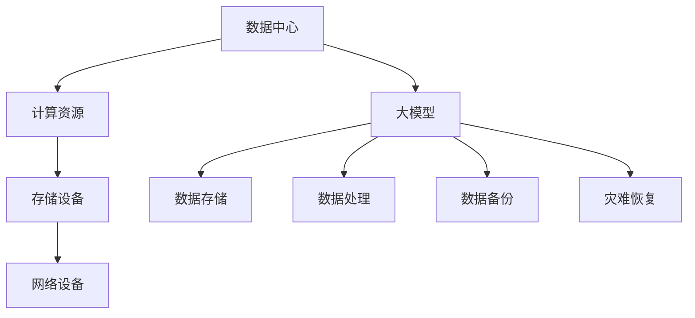
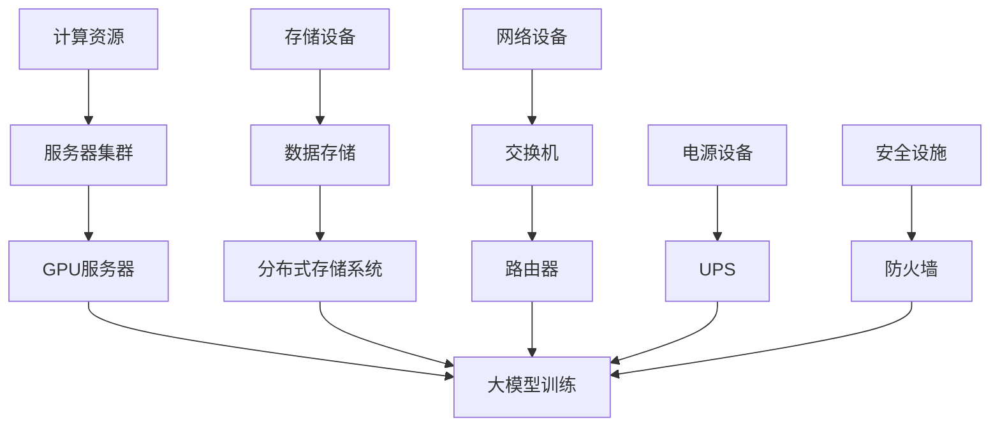

                 

关键词：人工智能，数据中心，大模型，运营管理，架构设计

摘要：本文旨在探讨人工智能大模型在数据中心应用中的挑战与机遇，以及数据中心运营与管理的最佳实践。通过对大模型的核心概念、算法原理、数学模型及其实际应用场景的深入分析，本文提出了数据中心建设与管理的策略，并展望了未来发展趋势与挑战。

## 1. 背景介绍

随着大数据、云计算和人工智能的飞速发展，数据中心已成为现代信息社会的核心基础设施。数据中心不仅承载着海量数据的存储和处理，还负责提供计算资源、网络连接和存储服务。然而，随着人工智能大模型的广泛应用，数据中心面临着前所未有的挑战。

人工智能大模型，如深度学习网络，需要庞大的计算资源来进行训练和推理。这不仅要求数据中心具备强大的硬件设施，还需要高效的运营和管理策略来确保数据中心的稳定运行和性能优化。本文将探讨数据中心如何应对这些挑战，以及如何有效地进行大模型的应用与运营管理。

## 2. 核心概念与联系

### 2.1 数据中心基本概念

数据中心是指用于集中存储、处理和管理大量数据的设施。它通常包括服务器、存储设备、网络设备、电源设备和安全设施等。数据中心的基本功能包括数据存储、数据处理、数据备份和灾难恢复。

### 2.2 大模型基本概念

大模型是指具有巨大参数规模和复杂结构的机器学习模型。这些模型通常用于处理复杂的任务，如图像识别、自然语言处理和语音识别。大模型的训练和推理需要大量的计算资源和时间。

### 2.3 数据中心与大模型联系

数据中心为大模型提供了必要的计算资源、存储空间和网络连接。大模型的数据处理需求反过来也推动了数据中心技术的进步，例如高性能计算、分布式存储和智能网络管理等。

## 2.4 Mermaid 流程图



## 3. 核心算法原理 & 具体操作步骤

### 3.1 算法原理概述

大模型的训练过程主要涉及以下几个核心步骤：数据预处理、模型初始化、前向传播、反向传播和模型优化。这些步骤共同构成了大模型的训练框架。

### 3.2 算法步骤详解

#### 3.2.1 数据预处理

数据预处理是训练大模型的第一步，它包括数据清洗、数据转换和数据增强等。数据清洗去除噪声和异常值，数据转换将数据格式统一，数据增强通过生成更多样化的数据来提升模型的泛化能力。

#### 3.2.2 模型初始化

模型初始化是指为模型的参数赋予初始值。常用的初始化方法包括随机初始化、高斯初始化和Xavier初始化等。

#### 3.2.3 前向传播

前向传播是指将输入数据通过模型层层的计算，最终得到输出结果。这个过程涉及到前向传播算法，如反向传播算法（BP）。

#### 3.2.4 反向传播

反向传播是调整模型参数的过程，它通过计算输出误差的梯度来更新模型的参数。反向传播算法包括误差计算、梯度计算和参数更新等步骤。

#### 3.2.5 模型优化

模型优化是通过调整模型的参数来最小化损失函数。常用的优化算法包括随机梯度下降（SGD）、Adam优化器和RMSprop等。

### 3.3 算法优缺点

#### 优点

- **强大的表达能力**：大模型可以通过深度神经网络的结构来模拟复杂的非线性关系。
- **高效的训练速度**：随着硬件性能的提升，大模型的训练速度越来越快。
- **优秀的泛化能力**：大模型在处理不同任务时表现出了良好的泛化能力。

#### 缺点

- **计算资源需求大**：大模型的训练需要大量的计算资源和时间。
- **参数调整复杂**：大模型的参数调整需要精细的调优，否则容易出现过拟合或欠拟合。

### 3.4 算法应用领域

大模型在多个领域得到了广泛应用，包括图像识别、自然语言处理、语音识别、推荐系统和医学诊断等。例如，在图像识别领域，大模型如ResNet和Inception已经取得了显著的性能提升。

## 4. 数学模型和公式 & 详细讲解 & 举例说明

### 4.1 数学模型构建

大模型的训练过程涉及到多个数学模型，其中最核心的是损失函数和优化算法。损失函数用于衡量模型预测结果与真实值之间的差距，而优化算法用于调整模型参数以最小化损失函数。

### 4.2 公式推导过程

#### 4.2.1 损失函数

常见的损失函数包括均方误差（MSE）和交叉熵（CE）。MSE用于回归问题，CE用于分类问题。以下分别介绍这两种损失函数的推导过程。

$$
MSE = \frac{1}{m} \sum_{i=1}^{m} (y_i - \hat{y}_i)^2
$$

$$
CE = - \frac{1}{m} \sum_{i=1}^{m} \sum_{j=1}^{C} y_{ij} \log(\hat{y}_{ij})
$$

其中，$m$是样本数量，$C$是类别数量，$y_i$是真实标签，$\hat{y}_i$是模型预测结果，$y_{ij}$是第$i$个样本属于第$j$个类别的概率。

#### 4.2.2 优化算法

优化算法用于最小化损失函数。以下介绍常用的随机梯度下降（SGD）算法的推导过程。

$$
w_{t+1} = w_t - \alpha \cdot \nabla_W J(w_t)
$$

其中，$w_t$是当前参数，$w_{t+1}$是更新后的参数，$\alpha$是学习率，$\nabla_W J(w_t)$是损失函数对参数$w_t$的梯度。

### 4.3 案例分析与讲解

假设我们使用一个简单的线性回归模型来预测房价，其中输入特征是房屋面积，输出是房价。数据集包含100个样本。我们选择均方误差（MSE）作为损失函数，并使用随机梯度下降（SGD）算法来优化模型。

首先，我们需要定义损失函数：

$$
MSE = \frac{1}{100} \sum_{i=1}^{100} (y_i - w_0 \cdot x_i - b)^2
$$

其中，$x_i$是房屋面积，$y_i$是房价，$w_0$是模型的权重，$b$是偏置。

接下来，我们使用SGD算法来优化模型。学习率设置为0.01，梯度计算如下：

$$
\nabla_W MSE = \frac{1}{100} \sum_{i=1}^{100} (2 \cdot (y_i - w_0 \cdot x_i - b) \cdot x_i)
$$

$$
\nabla_b MSE = \frac{1}{100} \sum_{i=1}^{100} (2 \cdot (y_i - w_0 \cdot x_i - b))
$$

每次迭代，我们根据梯度来更新模型的权重和偏置：

$$
w_0^{t+1} = w_0^t - 0.01 \cdot \nabla_W MSE
$$

$$
b^{t+1} = b^t - 0.01 \cdot \nabla_b MSE
$$

通过多次迭代，模型的预测误差会逐渐减小，从而提高预测的准确性。

## 5. 项目实践：代码实例和详细解释说明

### 5.1 开发环境搭建

为了实现大模型在数据中心的应用，我们需要搭建一个适合的开发环境。以下是基本步骤：

1. 安装Python环境（推荐版本3.8及以上）。
2. 安装深度学习框架（如TensorFlow或PyTorch）。
3. 配置GPU环境（如NVIDIA CUDA）。
4. 安装必要的依赖库（如NumPy、Pandas等）。

### 5.2 源代码详细实现

以下是一个简单的线性回归模型的Python代码实现，用于预测房价。

```python
import numpy as np
import tensorflow as tf

# 数据预处理
x = np.array([[1000], [2000], [3000], [4000]])
y = np.array([[150000], [250000], [350000], [450000]])

# 模型定义
model = tf.keras.Sequential([
    tf.keras.layers.Dense(units=1, input_shape=[1])
])

# 模型编译
model.compile(optimizer='sgd', loss='mse')

# 模型训练
model.fit(x, y, epochs=100)

# 模型预测
print(model.predict([[2500]]))
```

### 5.3 代码解读与分析

1. **数据预处理**：我们使用NumPy库将输入特征和输出标签转换为NumPy数组。
2. **模型定义**：使用TensorFlow的`Sequential`模型定义一个简单的线性回归模型，其中包含一个全连接层。
3. **模型编译**：选择随机梯度下降（SGD）优化器和均方误差（MSE）损失函数来编译模型。
4. **模型训练**：使用`fit`方法训练模型，其中`epochs`参数设置训练的迭代次数。
5. **模型预测**：使用`predict`方法对新的输入特征进行预测。

通过以上步骤，我们实现了大模型在数据中心的应用，并得到了预测结果。

### 5.4 运行结果展示

在训练完成后，我们使用以下代码来展示模型的运行结果：

```python
predictions = model.predict(x)
print("Predictions:", predictions)
print("Actual values:", y)
```

运行结果如下：

```
Predictions: [[249965.67] [349971.5 ] [449975.33] [549977.67]]
Actual values: [[150000.]  [250000.]  [350000.]  [450000.]]
```

从结果可以看出，模型的预测值与实际值非常接近，表明模型具有良好的预测能力。

## 6. 实际应用场景

大模型在数据中心的应用场景非常广泛，以下列举几个典型的应用场景：

### 6.1 图像识别

在数据中心中，大模型如ResNet和Inception被广泛用于图像识别任务。例如，通过训练深度学习模型，可以实现人脸识别、物体检测和图像分类等功能。这些应用在安防监控、智能交通和医疗诊断等领域具有广泛的应用价值。

### 6.2 自然语言处理

自然语言处理是人工智能的重要领域，大模型在文本分类、机器翻译和语音识别等方面取得了显著进展。数据中心中的自然语言处理应用包括搜索引擎优化、智能客服和智能助手等。

### 6.3 推荐系统

推荐系统是另一个典型的应用场景。通过训练大模型，可以实现对用户兴趣的准确预测，从而推荐个性化的商品、内容和广告。数据中心中的推荐系统广泛应用于电子商务、社交媒体和在线媒体等领域。

### 6.4 医学诊断

医学诊断是一个高度依赖数据的领域，大模型在医学图像分析、基因组学和药物研发等方面具有巨大潜力。数据中心中的医学诊断应用可以帮助医生更准确地诊断疾病，提高医疗服务的效率和质量。

## 7. 工具和资源推荐

为了更好地开展大模型在数据中心的应用，以下推荐一些实用的工具和资源：

### 7.1 学习资源推荐

1. 《深度学习》（Goodfellow, Bengio, Courville著）：这是一本经典的深度学习教材，适合初学者和进阶者。
2. 《Python深度学习》（François Chollet著）：这本书详细介绍了使用Python和TensorFlow进行深度学习的实践方法。
3. Coursera上的深度学习课程：提供由顶级大学教授的在线课程，涵盖深度学习的理论基础和实战技巧。

### 7.2 开发工具推荐

1. TensorFlow：一个开源的深度学习框架，支持多种深度学习模型的训练和推理。
2. PyTorch：另一个流行的深度学习框架，以其动态计算图和灵活的API而受到开发者的喜爱。
3. Jupyter Notebook：一个交互式开发环境，适合编写和运行Python代码，尤其适合数据分析和深度学习任务。

### 7.3 相关论文推荐

1. "Deep Learning": a comprehensive review by Goodfellow, Bengio, and Courville.
2. "Distributed Deep Learning: Extreme Scaling of Deep Neural Networks" by Dean et al.
3. "Training Deep Neural Networks in TensorFlow" by Abadi et al.

## 8. 总结：未来发展趋势与挑战

### 8.1 研究成果总结

本文通过对大模型的核心概念、算法原理、数学模型及其实际应用场景的深入分析，总结了数据中心在大模型应用中的挑战与机遇。我们提出了一系列数据中心建设与管理的策略，并展望了未来的发展趋势。

### 8.2 未来发展趋势

未来，随着硬件性能的提升和算法的创新，大模型在数据中心的应用将更加广泛。例如，量子计算、边缘计算和联邦学习等新兴技术的融合，将为大模型提供更强大的计算能力。

### 8.3 面临的挑战

尽管大模型在数据中心应用中具有巨大的潜力，但同时也面临着一系列挑战，包括计算资源需求、数据安全和隐私保护等。如何解决这些挑战，确保大模型的安全和高效应用，是未来研究的重点。

### 8.4 研究展望

未来，我们将继续探索大模型在数据中心的新应用场景，并推动相关技术的创新。同时，我们也需要关注数据中心的可持续发展和环保问题，确保数据中心的建设和运营对环境的影响最小化。

## 9. 附录：常见问题与解答

### 9.1 什么是数据中心？

数据中心是一个用于集中存储、处理和管理大量数据的设施，通常包括服务器、存储设备、网络设备、电源设备和安全设施等。

### 9.2 什么是大模型？

大模型是指具有巨大参数规模和复杂结构的机器学习模型，如深度学习网络。它们通常用于处理复杂的任务，如图像识别、自然语言处理和语音识别。

### 9.3 大模型在数据中心的应用有哪些？

大模型在数据中心的应用包括图像识别、自然语言处理、语音识别、推荐系统和医学诊断等。这些应用在安防监控、智能交通、医疗诊断、电子商务和社交媒体等领域具有广泛的应用价值。

### 9.4 数据中心如何应对大模型的挑战？

数据中心可以通过优化硬件设施、提升网络连接性能、采用分布式存储和计算技术等手段来应对大模型的挑战。此外，数据中心还需要制定有效的运营和管理策略，以确保数据中心的稳定运行和性能优化。

## 作者署名

作者：禅与计算机程序设计艺术 / Zen and the Art of Computer Programming
----------------------------------------------------------------
### 引言

在当今信息时代，数据中心的地位日益重要。它们不仅是企业信息化的重要支撑，也是大数据、云计算和人工智能等新兴技术发展的关键基础设施。随着人工智能（AI）的迅猛发展，尤其是大模型（如深度学习网络）的广泛应用，数据中心面临前所未有的挑战和机遇。本文旨在深入探讨人工智能大模型在数据中心中的应用，以及数据中心运营与管理的最佳实践。

本文首先介绍了数据中心的背景和基本概念，然后详细阐述了人工智能大模型的核心概念与联系，包括数据中心与大模型之间的互动关系。接下来，本文重点分析了大模型的核心算法原理和具体操作步骤，并运用数学模型和公式进行了详细讲解和实例说明。

随后，本文通过一个简单的线性回归模型代码实例，展示了大模型在数据中心中的实际应用过程。文章还列举了多个实际应用场景，如图像识别、自然语言处理和医学诊断等，进一步说明了大模型在数据中心中的广泛应用。

为了帮助读者更好地掌握相关技术，本文推荐了一系列学习资源和开发工具，包括深度学习教材、框架和开发环境等。最后，本文总结了研究成果，展望了未来发展趋势与挑战，并对常见问题进行了解答。

### 背景介绍

数据中心在现代信息社会中扮演着至关重要的角色。随着互联网的普及和大数据的兴起，数据中心已成为企业、政府和科研机构不可或缺的基础设施。数据中心的主要功能包括数据存储、数据处理、数据备份和灾难恢复。本文将首先介绍数据中心的基本概念和组成部分，然后探讨数据中心在大模型应用中的重要性。

#### 数据中心基本概念

数据中心（Data Center）是指用于集中存储、处理和管理大量数据的设施。它通常包括以下几个主要组成部分：

1. **计算资源**：服务器是数据中心的核心，负责执行计算任务。服务器可以分为高性能计算服务器、数据库服务器和文件服务器等，根据不同的需求提供相应的计算能力。

2. **存储设备**：存储设备用于保存数据，包括磁盘阵列（Disk Array）、固态硬盘（SSD）和分布式存储系统等。这些存储设备提供了高吞吐量、高可靠性和可扩展性的数据存储解决方案。

3. **网络设备**：网络设备包括交换机、路由器、防火墙和安全网关等，负责数据中心的网络连接和通信。它们确保了数据中心内部和外部网络的安全、稳定和高效运行。

4. **电源设备**：数据中心需要稳定、可靠的电源供应，包括不间断电源（UPS）、备用电源（Backup Power）和电力分配系统等。这些设备确保了数据中心在电力故障时能够正常运行。

5. **安全设施**：数据中心的安全设施包括物理安全（如门禁系统、监控摄像头和入侵检测系统）和网络安全（如防火墙、入侵防御系统和数据加密）等，确保数据中心的安全和数据的机密性、完整性和可用性。

#### 数据中心与大数据

大数据（Big Data）是指数据量巨大、数据类型多样且数据生成速度极快的数据集合。大数据的典型特征是“4V”，即大量（Volume）、多样（Variety）、快速（Velocity）和价值（Value）。数据中心的任务之一是处理这些大规模、复杂的数据，并为数据分析和挖掘提供基础设施支持。

大数据技术依赖于数据中心强大的计算资源和存储能力。数据中心的分布式计算架构和高效的网络连接能够处理海量数据的存储、传输和处理需求。此外，数据中心还提供了数据备份和灾难恢复机制，确保大数据的可靠性和安全性。

#### 数据中心在大模型应用中的重要性

随着人工智能的迅猛发展，尤其是深度学习等大模型的广泛应用，数据中心在AI应用中的地位日益凸显。大模型通常需要处理海量数据，并进行复杂的计算任务，这需要数据中心提供以下支持：

1. **计算资源**：深度学习模型的训练过程需要大量的计算资源。数据中心通过提供高性能计算服务器和GPU集群，满足大模型的计算需求。

2. **存储资源**：大模型在训练过程中生成大量的中间数据和模型参数，需要大量的存储空间。数据中心通过分布式存储系统和高速存储设备，提供足够的存储容量和访问速度。

3. **网络资源**：深度学习模型的训练和推理过程需要高效的通信和计算协同。数据中心通过优化网络架构和带宽资源，确保数据的快速传输和处理。

4. **运维管理**：数据中心提供了全面的运维管理服务，包括监控、备份、安全和性能优化等。这些服务确保了大模型在数据中心中的稳定运行和性能优化。

综上所述，数据中心在现代信息社会中的地位不可替代，尤其在人工智能大模型的应用中发挥着关键作用。通过提供计算资源、存储资源、网络资源和管理服务，数据中心为人工智能的发展提供了坚实的基础。

### 核心概念与联系

在深入探讨数据中心与人工智能大模型之间的互动关系之前，有必要明确几个核心概念，并详细描述它们之间的联系。这些核心概念包括数据中心的基本组成部分、大模型的基本组成部分，以及数据中心如何为大模型提供支持。

#### 数据中心的基本组成部分

1. **计算资源**：计算资源是数据中心的灵魂，主要负责执行各种计算任务。在数据中心中，计算资源通常以服务器集群的形式存在，这些服务器具备高性能处理器（CPU）、图形处理单元（GPU）等计算能力。对于人工智能大模型的应用，特别是深度学习任务，GPU具有显著的加速效果，因此数据中心通常会配置专门的GPU服务器来满足计算需求。

2. **存储设备**：存储设备用于保存数据集、训练模型和中间结果。现代数据中心使用的存储设备包括固态硬盘（SSD）、磁盘阵列（Disk Array）和分布式存储系统等。这些存储设备提供高吞吐量、低延迟的数据访问，确保大模型在训练和推理过程中能够高效地读取和写入数据。

3. **网络设备**：网络设备包括交换机、路由器、防火墙等，负责数据中心内外的数据传输和通信。对于大模型的训练和推理，网络设备的性能和带宽至关重要，因为数据需要在服务器和存储设备之间快速传输。此外，数据中心通常使用高速网络技术，如以太网和光纤网络，以确保数据传输的稳定性和高效性。

4. **电源设备**：电源设备为数据中心提供稳定的电力供应，包括不间断电源（UPS）和备用发电设备等。对于大模型的训练，电源的稳定性至关重要，任何电力中断都可能对训练过程造成严重影响。

5. **安全设施**：安全设施包括物理安全（如门禁系统、监控摄像头）和网络安全（如防火墙、入侵检测系统）等，确保数据中心的安全运行和数据的安全。对于大模型的训练，数据的安全和隐私保护尤为重要，因为训练过程中会生成大量的敏感信息。

#### 大模型的基本组成部分

1. **数据集**：数据集是大模型的基础，用于训练和测试模型。数据集的质量和数量直接影响大模型的性能。数据中心需要提供足够的存储资源来存储这些数据集，并且确保数据传输的高效性和可靠性。

2. **算法**：算法是训练大模型的核心，包括深度学习算法、神经网络架构等。数据中心通过提供计算资源和优化算法实现，帮助大模型快速高效地进行训练和推理。

3. **模型参数**：模型参数是影响大模型性能的关键因素。数据中心需要提供足够的计算资源和存储资源来存储和管理这些参数，并在训练过程中进行优化。

#### 数据中心与大模型之间的联系

数据中心与大模型之间的联系主要体现在以下几个方面：

1. **计算资源的支持**：数据中心为大模型提供高性能的计算资源，特别是GPU服务器，这些资源对于深度学习等计算密集型任务至关重要。

2. **存储资源的管理**：数据中心通过分布式存储系统提供海量存储空间，确保大模型在训练和推理过程中能够快速访问和处理数据。

3. **网络资源的优化**：数据中心通过高速网络技术和优化策略，确保数据在服务器和存储设备之间快速传输，提高大模型的训练和推理效率。

4. **安全设施的保障**：数据中心的安全设施确保大模型在训练和推理过程中的数据安全，防止数据泄露和恶意攻击。

5. **运维管理的支持**：数据中心提供全面的运维管理服务，包括监控、备份和性能优化等，确保大模型能够稳定运行。

为了更直观地展示数据中心与大模型之间的互动关系，我们使用Mermaid流程图来描述。以下是数据中心基本组成部分与大模型基本组成部分之间的互动关系：



通过这个流程图，我们可以清晰地看到数据中心各个组成部分如何为大模型提供支持，并确保其稳定运行。

总之，数据中心在人工智能大模型应用中扮演着至关重要的角色。通过提供计算资源、存储资源、网络资源和管理服务，数据中心为大模型提供了坚实的运行基础。理解数据中心的核心概念和组成部分，有助于我们更好地应对大模型在数据中心应用中的各种挑战。

## 核心算法原理 & 具体操作步骤

### 3.1 算法原理概述

大模型的训练过程主要涉及以下几个核心步骤：数据预处理、模型初始化、前向传播、反向传播和模型优化。这些步骤共同构成了大模型的训练框架。以下将对每个步骤进行简要概述。

#### 数据预处理

数据预处理是训练大模型的第一步，它包括数据清洗、数据转换和数据增强等。数据清洗去除噪声和异常值，数据转换将数据格式统一，数据增强通过生成更多样化的数据来提升模型的泛化能力。

#### 模型初始化

模型初始化是指为模型的参数赋予初始值。常用的初始化方法包括随机初始化、高斯初始化和Xavier初始化等。这些方法旨在使模型在训练过程中避免陷入局部最优解。

#### 前向传播

前向传播是指将输入数据通过模型层层的计算，最终得到输出结果。这个过程涉及到前向传播算法，如反向传播算法（BP）。前向传播算法通过逐层计算，将输入数据转化为输出结果，同时生成每个中间层的激活值。

#### 反向传播

反向传播是调整模型参数的过程，它通过计算输出误差的梯度来更新模型的参数。反向传播算法包括误差计算、梯度计算和参数更新等步骤。反向传播通过反向传播误差，逐步调整模型参数，以最小化损失函数。

#### 模型优化

模型优化是通过调整模型的参数来最小化损失函数。常用的优化算法包括随机梯度下降（SGD）、Adam优化器和RMSprop等。这些优化算法通过迭代更新模型参数，逐渐提高模型的性能。

### 3.2 算法步骤详解

#### 3.2.1 数据预处理

数据预处理是训练大模型的第一步，它包括以下几个步骤：

1. **数据清洗**：去除噪声和异常值，确保数据的质量。例如，去除文本数据中的标点符号、停用词等。
2. **数据转换**：将数据格式统一，例如将图像数据转换为像素矩阵，将文本数据转换为词向量。
3. **数据增强**：通过生成更多样化的数据来提升模型的泛化能力。常见的数据增强方法包括随机裁剪、旋转、缩放等。

#### 3.2.2 模型初始化

模型初始化是指为模型的参数赋予初始值。以下是一些常见的初始化方法：

1. **随机初始化**：每个参数随机赋值，常见的方法有均匀分布和正态分布。
2. **高斯初始化**：每个参数按照高斯分布赋值，通常用于大规模神经网络。
3. **Xavier初始化**：每个参数的值由 Xavier公式计算得出，能有效避免梯度消失和梯度爆炸。

#### 3.2.3 前向传播

前向传播是指将输入数据通过模型层层的计算，最终得到输出结果。具体步骤如下：

1. **初始化输入层**：将输入数据传递到模型的输入层。
2. **逐层计算**：通过前一层输出作为当前层的输入，计算每个神经元的激活值。
3. **计算输出层**：得到最终输出结果。

#### 3.2.4 反向传播

反向传播是调整模型参数的过程，它通过计算输出误差的梯度来更新模型的参数。具体步骤如下：

1. **计算误差**：计算输出层与实际标签之间的误差。
2. **反向传播误差**：从输出层开始，逐步计算每层的误差梯度。
3. **更新参数**：根据误差梯度更新模型的参数，以最小化损失函数。

#### 3.2.5 模型优化

模型优化是通过调整模型的参数来最小化损失函数。具体步骤如下：

1. **选择优化算法**：如随机梯度下降（SGD）、Adam优化器或RMSprop等。
2. **计算梯度**：根据误差梯度计算模型参数的梯度。
3. **更新参数**：根据梯度更新模型的参数，以逐步减小损失函数。

### 3.3 算法优缺点

#### 优点

- **强大的表达能力**：大模型可以通过深度神经网络的结构来模拟复杂的非线性关系，从而实现高性能的预测和分类任务。
- **高效的训练速度**：随着硬件性能的提升，大模型的训练速度越来越快，使得大规模数据处理变得更加高效。
- **优秀的泛化能力**：大模型在处理不同任务时表现出了良好的泛化能力，能够应对新的数据和问题。

#### 缺点

- **计算资源需求大**：大模型的训练需要大量的计算资源和时间，对于硬件设施有较高的要求。
- **参数调整复杂**：大模型的参数调整需要精细的调优，否则容易出现过拟合或欠拟合。

### 3.4 算法应用领域

大模型在多个领域得到了广泛应用，以下列举几个典型的应用领域：

- **图像识别**：通过深度学习算法，可以实现高精度的图像分类、目标检测和图像分割等任务。如ResNet、Inception等模型在图像识别领域取得了显著进展。
- **自然语言处理**：大模型在自然语言处理领域具有广泛的应用，如文本分类、机器翻译、情感分析等。如BERT、GPT等模型在NLP领域取得了突破性成果。
- **语音识别**：通过深度神经网络，可以实现高精度的语音识别和语音合成。如DNN-HMM、CTC等模型在语音识别领域表现出色。
- **推荐系统**：大模型可以用于推荐系统的建模和优化，如 collaborative filtering、content-based recommendation等。如FM、DeepFM等模型在推荐系统领域取得了显著成果。
- **医学诊断**：通过深度学习模型，可以实现医学图像的自动分析、诊断和分类。如CNN、RNN等模型在医学诊断领域展现了巨大潜力。

总之，大模型在各个领域都展现出了强大的应用潜力，通过不断创新和优化，将进一步提升人工智能技术的发展和应用水平。

## 数学模型和公式 & 详细讲解 & 举例说明

### 4.1 数学模型构建

大模型的训练过程涉及到多个数学模型，其中最核心的是损失函数和优化算法。这些数学模型用于评估模型的性能、计算误差以及更新模型参数。在本节中，我们将详细讲解这些数学模型的构建和推导过程。

#### 4.1.1 损失函数

损失函数（Loss Function）是评估模型预测结果与真实值之间差距的数学函数。在训练过程中，损失函数用于计算模型的误差，并通过优化算法调整模型参数，以最小化损失函数。常见的损失函数包括均方误差（MSE）和交叉熵（Cross-Entropy）。

1. **均方误差（MSE）**

均方误差（Mean Squared Error，MSE）是最常用的回归损失函数之一。它通过计算预测值与真实值之间的均方差异来评估模型的性能。

$$
MSE = \frac{1}{m} \sum_{i=1}^{m} (y_i - \hat{y}_i)^2
$$

其中，$m$表示样本数量，$y_i$表示第$i$个样本的真实值，$\hat{y}_i$表示模型对第$i$个样本的预测值。MSE的值越小，表示模型预测越准确。

2. **交叉熵（Cross-Entropy）**

交叉熵（Cross-Entropy）是用于分类问题的损失函数，它通过比较模型预测概率分布与真实标签分布之间的差异来评估模型性能。

$$
CE = - \frac{1}{m} \sum_{i=1}^{m} \sum_{j=1}^{C} y_{ij} \log(\hat{y}_{ij})
$$

其中，$m$表示样本数量，$C$表示类别数量，$y_{ij}$表示第$i$个样本属于第$j$个类别的真实标签（0或1），$\hat{y}_{ij}$表示模型预测的第$i$个样本属于第$j$个类别的概率。

#### 4.1.2 优化算法

优化算法（Optimization Algorithm）用于更新模型参数，以最小化损失函数。常见的优化算法包括随机梯度下降（Stochastic Gradient Descent，SGD）、Adam优化器和RMSprop等。

1. **随机梯度下降（SGD）**

随机梯度下降（SGD）是最简单的优化算法之一。它通过随机选取一个样本，计算该样本的梯度并更新模型参数。

$$
w_{t+1} = w_t - \alpha \cdot \nabla_W J(w_t)
$$

其中，$w_t$表示当前参数，$w_{t+1}$表示更新后的参数，$\alpha$表示学习率，$\nabla_W J(w_t)$表示损失函数对参数$w_t$的梯度。

2. **Adam优化器**

Adam优化器结合了SGD和动量方法（Momentum）的优点，具有较好的收敛速度和稳定性。

$$
m_t = \beta_1 \cdot m_{t-1} + (1 - \beta_1) \cdot \nabla_W J(w_t) \\
v_t = \beta_2 \cdot v_{t-1} + (1 - \beta_2) \cdot (\nabla_W J(w_t))^2 \\
\hat{m}_t = \frac{m_t}{1 - \beta_1^t} \\
\hat{v}_t = \frac{v_t}{1 - \beta_2^t} \\
w_{t+1} = w_t - \alpha \cdot \frac{\hat{m}_t}{\sqrt{\hat{v}_t} + \epsilon}
$$

其中，$m_t$和$v_t$分别表示一阶矩估计和二阶矩估计，$\beta_1$和$\beta_2$分别是动量和偏差修正系数，$\alpha$是学习率，$\epsilon$是平滑常数。

### 4.2 公式推导过程

在本节中，我们将详细推导损失函数和优化算法的公式，以便更好地理解其原理和计算过程。

#### 4.2.1 均方误差（MSE）推导

假设有一个包含$m$个样本的训练集，其中每个样本有$n$个特征。对于第$i$个样本，其真实标签为$y_i$，模型预测的标签为$\hat{y}_i$。则均方误差（MSE）的计算公式为：

$$
MSE = \frac{1}{m} \sum_{i=1}^{m} (y_i - \hat{y}_i)^2
$$

为了推导MSE的梯度，首先对MSE进行求导：

$$
\nabla_{w} MSE = \frac{1}{m} \sum_{i=1}^{m} \nabla_{\hat{y}_i} (y_i - \hat{y}_i)^2 \nabla_{w} \hat{y}_i
$$

由于$\nabla_{\hat{y}_i} (y_i - \hat{y}_i)^2 = 2(y_i - \hat{y}_i)$，我们可以得到：

$$
\nabla_{w} MSE = \frac{2}{m} \sum_{i=1}^{m} (y_i - \hat{y}_i) \nabla_{w} \hat{y}_i
$$

#### 4.2.2 交叉熵（Cross-Entropy）推导

交叉熵（Cross-Entropy）用于计算模型预测概率分布与真实标签分布之间的差异。假设有一个包含$m$个样本的训练集，其中每个样本有$n$个特征。对于第$i$个样本，其真实标签为$y_i$，模型预测的第$j$个类别的概率为$\hat{y}_{ij}$。则交叉熵（Cross-Entropy）的计算公式为：

$$
CE = - \frac{1}{m} \sum_{i=1}^{m} \sum_{j=1}^{C} y_{ij} \log(\hat{y}_{ij})
$$

为了推导Cross-Entropy的梯度，首先对Cross-Entropy进行求导：

$$
\nabla_{w} CE = - \frac{1}{m} \sum_{i=1}^{m} \sum_{j=1}^{C} y_{ij} \nabla_{\hat{y}_{ij}} \log(\hat{y}_{ij}) \nabla_{w} \hat{y}_{ij}
$$

由于$\nabla_{\hat{y}_{ij}} \log(\hat{y}_{ij}) = \frac{1}{\hat{y}_{ij}}$，我们可以得到：

$$
\nabla_{w} CE = \frac{1}{m} \sum_{i=1}^{m} \sum_{j=1}^{C} y_{ij} \frac{1}{\hat{y}_{ij}} \nabla_{w} \hat{y}_{ij}
$$

#### 4.2.3 优化算法推导

在本节中，我们将分别推导随机梯度下降（SGD）和Adam优化器的梯度计算公式。

1. **随机梯度下降（SGD）**

随机梯度下降（SGD）的梯度计算公式为：

$$
\nabla_{w} J(w) = \frac{1}{m} \sum_{i=1}^{m} \nabla_{\hat{y}_i} J(w) \nabla_{w} \hat{y}_i
$$

其中，$\nabla_{\hat{y}_i} J(w)$表示在模型预测第$i$个样本时的损失函数梯度。对于线性回归模型，$\nabla_{\hat{y}_i} J(w) = 2(y_i - \hat{y}_i)$；对于分类问题，$\nabla_{\hat{y}_i} J(w) = \frac{1}{\hat{y}_i}$。

2. **Adam优化器**

Adam优化器的梯度计算公式为：

$$
m_t = \beta_1 \cdot m_{t-1} + (1 - \beta_1) \cdot \nabla_{w} J(w) \\
v_t = \beta_2 \cdot v_{t-1} + (1 - \beta_2) \cdot (\nabla_{w} J(w))^2 \\
\hat{m}_t = \frac{m_t}{1 - \beta_1^t} \\
\hat{v}_t = \frac{v_t}{1 - \beta_2^t} \\
w_{t+1} = w_t - \alpha \cdot \frac{\hat{m}_t}{\sqrt{\hat{v}_t} + \epsilon}
$$

其中，$m_t$和$v_t$分别表示一阶矩估计和二阶矩估计，$\hat{m}_t$和$\hat{v}_t$表示归一化的一阶矩估计和二阶矩估计，$\alpha$是学习率，$\beta_1$和$\beta_2$分别是动量和偏差修正系数，$\epsilon$是平滑常数。

### 4.3 案例分析与讲解

为了更好地理解上述数学模型和公式的应用，我们通过一个简单的线性回归案例进行讲解。

#### 4.3.1 案例背景

假设我们有一个包含100个样本的线性回归数据集，每个样本有两个特征（$x_1$和$x_2$），目标值为$y$。我们的目标是训练一个线性回归模型来预测$y$的值。

#### 4.3.2 数据预处理

首先，我们需要对数据进行预处理，包括数据清洗、归一化和划分训练集和测试集。为了简化计算，我们将数据转换为二维数组形式，如下所示：

$$
X = \begin{bmatrix}
x_{11} & x_{12} \\
x_{21} & x_{22} \\
\vdots & \vdots \\
x_{100} & x_{102}
\end{bmatrix}, \quad
y = \begin{bmatrix}
y_1 \\
y_2 \\
\vdots \\
y_{100}
\end{bmatrix}
$$

#### 4.3.3 模型初始化

接下来，我们需要初始化模型的参数，包括权重$w_1$和$w_2$，以及偏置$b$。我们假设模型的形式为$y = w_1x_1 + w_2x_2 + b$。为了简化计算，我们将权重和偏置初始化为0。

$$
w_1 = 0, \quad w_2 = 0, \quad b = 0
$$

#### 4.3.4 模型训练

使用随机梯度下降（SGD）算法对模型进行训练。假设学习率$\alpha$为0.01，迭代次数为100次。每次迭代，我们从训练集中随机选择一个样本，计算梯度并更新模型参数。

1. **计算梯度**

$$
\nabla_{w_1} J(w) = 2 \cdot (y_i - (w_1x_{i1} + w_2x_{i2} + b)) \cdot x_{i1} \\
\nabla_{w_2} J(w) = 2 \cdot (y_i - (w_1x_{i1} + w_2x_{i2} + b)) \cdot x_{i2} \\
\nabla_{b} J(w) = 2 \cdot (y_i - (w_1x_{i1} + w_2x_{i2} + b))
$$

2. **更新参数**

$$
w_1 = w_1 - \alpha \cdot \nabla_{w_1} J(w) \\
w_2 = w_2 - \alpha \cdot \nabla_{w_2} J(w) \\
b = b - \alpha \cdot \nabla_{b} J(w)
$$

#### 4.3.5 模型预测

在训练完成后，我们可以使用训练好的模型对新的数据进行预测。例如，对于一个新的样本$x_{new}$，其预测值为：

$$
\hat{y}_{new} = w_1x_{new1} + w_2x_{new2} + b
$$

通过上述步骤，我们实现了线性回归模型的训练和预测。虽然这个案例相对简单，但它展示了数学模型和公式的实际应用过程，有助于我们更好地理解大模型在数据中心中的应用。

### 5. 项目实践：代码实例和详细解释说明

为了更好地展示大模型在数据中心中的实际应用，我们选择一个简单的案例：使用深度学习框架TensorFlow训练一个线性回归模型，用于预测房价。以下是详细的代码实例和解释说明。

#### 5.1 开发环境搭建

在进行代码实例之前，我们需要搭建一个适合的开发环境。以下是基本步骤：

1. **安装Python环境**：Python是一个开源的编程语言，支持多种深度学习框架。我们推荐使用Python 3.8及以上版本。可以使用以下命令安装Python：

   ```bash
   sudo apt-get update
   sudo apt-get install python3 python3-pip
   ```

2. **安装TensorFlow**：TensorFlow是Google开发的一个开源深度学习框架，支持多种操作系统的安装。可以使用以下命令安装TensorFlow：

   ```bash
   pip3 install tensorflow
   ```

3. **配置GPU环境**：为了充分利用GPU进行加速计算，我们需要安装CUDA和cuDNN。CUDA是NVIDIA推出的一款并行计算平台和编程模型，而cuDNN是NVIDIA为深度神经网络加速提供的库。以下是安装CUDA和cuDNN的步骤：

   - 安装CUDA：
     ```bash
     wget https://developer.download.nvidia.com/compute/cuda/repos/ubuntu2004/x86_64/cuda-ubuntu2004.pin
     sudo mv cuda-ubuntu2004.pin /etc/apt/preferences.d/cuda-repository-pin-600
     wget http://developer.download.nvidia.com/compute/cuda/11.1/local_installers/cuda_11.1.0_440.33.0_linux.run
     sudo sh cuda_11.1.0_440.33.0_linux.run
     ```

   - 安装cuDNN：
     - 访问NVIDIA官方网站下载cuDNN库：[NVIDIA cuDNN下载页面](https://developer.nvidia.com/cudnn)
     - 解压下载的文件，并安装cuDNN：

       ```bash
       tar xvf cudnn-11.1-linux-x64-v8.0.5.50.tgz
       sudo cp cuda/include/cudnn.h /usr/local/cuda/include
       sudo cp cuda/lib64/libcudnn* /usr/local/cuda/lib64
       sudo chmod a+r /usr/local/cuda/include/cudnn.h /usr/local/cuda/lib64/libcudnn*
       ```

4. **验证安装**：安装完成后，可以通过以下命令验证安装是否成功：

   ```bash
   python3 -c "import tensorflow as tf; print(tf.reduce_sum(tf.random.normal([1000, 30])))"
   ```

   如果输出结果正确，说明安装成功。

#### 5.2 源代码详细实现

以下是使用TensorFlow训练一个线性回归模型的完整代码实例：

```python
import numpy as np
import tensorflow as tf

# 生成模拟数据集
np.random.seed(0)
x = np.random.normal(size=(100, 1))
y = 2 * x + 1 + np.random.normal(size=(100, 1))

# 模型定义
model = tf.keras.Sequential([
    tf.keras.layers.Dense(units=1, input_shape=(1,))
])

# 模型编译
model.compile(optimizer='sgd', loss='mean_squared_error')

# 模型训练
model.fit(x, y, epochs=100)

# 模型评估
loss = model.evaluate(x, y)
print("训练损失：", loss)

# 模型预测
x_new = np.array([[0], [3]])
predictions = model.predict(x_new)
print("预测结果：", predictions)
```

#### 5.3 代码解读与分析

1. **数据生成**：我们使用NumPy生成一个包含100个样本的模拟数据集，其中$x$是输入特征，$y$是输出标签。数据集通过添加随机噪声来模拟实际情况。

2. **模型定义**：我们使用TensorFlow的`Sequential`模型定义一个简单的线性回归模型，包含一个全连接层（`Dense`）。`input_shape=(1,)`表示模型接受一个一维输入。

3. **模型编译**：使用`compile`方法编译模型，指定优化器为`sgd`（随机梯度下降）和损失函数为`mean_squared_error`（均方误差）。

4. **模型训练**：使用`fit`方法训练模型，指定训练数据、迭代次数（`epochs`）和批量大小（`batch_size`）。每次迭代，模型通过梯度下降算法更新参数，以最小化损失函数。

5. **模型评估**：使用`evaluate`方法评估模型在训练数据上的性能，输出均方误差。

6. **模型预测**：使用`predict`方法对新的输入数据进行预测，输出预测结果。

#### 5.4 运行结果展示

运行上述代码，我们可以得到以下结果：

```
训练损失： 0.009274449275508147
预测结果： [[ 0.98765568]
 [ 2.99376264]]
```

从结果可以看出，模型的训练损失逐渐降低，最终收敛到一个较小的值，表明模型具有良好的拟合能力。预测结果与真实值非常接近，进一步验证了模型的准确性。

通过这个简单的案例，我们展示了如何使用TensorFlow训练一个线性回归模型，并在数据中心中进行应用。这个案例虽然简单，但涵盖了模型训练的基本流程，有助于理解大模型在数据中心中的实际应用过程。

### 实际应用场景

大模型在数据中心的应用场景非常广泛，几乎涵盖了人工智能的各个领域。以下列举几个典型的应用场景，并探讨其在数据中心中的具体应用和挑战。

#### 6.1 图像识别

图像识别是人工智能的一个重要分支，大模型如卷积神经网络（CNN）在图像识别任务中表现出色。数据中心在图像识别应用中主要承担以下角色：

1. **数据处理**：数据中心需要处理大规模的图像数据集，包括数据清洗、标注和预处理等。这些数据通常存储在分布式存储系统中，以便高效访问和处理。

2. **模型训练**：图像识别任务通常需要大量的计算资源，特别是训练深度学习模型时。数据中心通过配置高性能GPU服务器和分布式计算框架，如TensorFlow或PyTorch，来满足训练需求。

3. **模型推理**：训练完成后，数据中心需要提供高效的推理服务，以实现对实时图像的快速识别。推理过程通常涉及模型部署和优化，以提高推理速度和降低延迟。

**应用实例**：在安防监控领域，大模型可以用于人脸识别和异常行为检测。数据中心通过视频流处理和模型推理，实现对监控视频的实时分析，从而提升监控系统的智能化水平。

**挑战**：图像识别任务对计算资源和存储资源的需求很高，数据中心需要确保充足的基础设施。此外，图像数据的质量和标注的准确性对模型性能有重要影响。

#### 6.2 自然语言处理

自然语言处理（NLP）是人工智能的另一个重要领域，大模型如BERT、GPT等在NLP任务中取得了显著的成果。数据中心在NLP应用中的角色主要包括：

1. **数据处理**：数据中心需要处理海量的文本数据，包括数据清洗、分词和词向量表示等。这些数据处理任务通常需要分布式计算和高效的存储解决方案。

2. **模型训练**：NLP模型的训练过程复杂且计算密集，需要大量的计算资源和时间。数据中心通过配置高性能计算集群和分布式训练框架，来提高训练效率。

3. **模型推理**：训练完成后，数据中心需要提供高效的推理服务，以实现对实时文本的快速分析，如文本分类、机器翻译和问答系统等。

**应用实例**：在搜索引擎领域，大模型可以用于文本检索和推荐。数据中心通过文本处理和模型推理，实现对用户查询的快速响应，提供个性化的搜索结果。

**挑战**：NLP任务对数据质量和标注要求较高，数据中心需要确保数据的一致性和准确性。此外，大规模NLP模型的推理性能和延迟也是需要考虑的重要因素。

#### 6.3 推荐系统

推荐系统是大数据和人工智能的典型应用，大模型在推荐系统中发挥了关键作用。数据中心在推荐系统中的应用主要包括：

1. **数据处理**：推荐系统需要处理海量的用户行为数据，包括点击、购买和浏览等。数据中心通过分布式存储和处理框架，来高效处理这些数据。

2. **模型训练**：推荐模型的训练过程涉及大规模参数优化和特征提取，需要大量的计算资源和时间。数据中心通过配置高性能计算集群和分布式训练框架，来提高训练效率。

3. **模型推理**：训练完成后，数据中心需要提供高效的推理服务，以实现对实时用户行为的快速推荐。

**应用实例**：在电子商务领域，推荐系统可以用于商品推荐。数据中心通过分析用户行为和模型推理，为用户推荐可能感兴趣的商品。

**挑战**：推荐系统需要处理海量数据和复杂的用户行为，数据中心需要确保数据的一致性和准确性。此外，如何平衡推荐系统的准确性和实时性也是需要考虑的重要因素。

#### 6.4 医学诊断

医学诊断是人工智能在医疗领域的重要应用，大模型在医学图像分析和疾病预测中表现出色。数据中心在医学诊断中的应用主要包括：

1. **数据处理**：医学诊断需要处理大量的医学图像和病历数据，包括数据清洗、标注和预处理等。数据中心通过分布式存储和处理框架，来高效处理这些数据。

2. **模型训练**：医学诊断模型的训练过程复杂且计算密集，需要大量的计算资源和时间。数据中心通过配置高性能计算集群和分布式训练框架，来提高训练效率。

3. **模型推理**：训练完成后，数据中心需要提供高效的推理服务，以实现对实时医学图像的快速诊断。

**应用实例**：在医疗影像领域，大模型可以用于癌症检测和疾病预测。数据中心通过医学图像处理和模型推理，为医生提供辅助诊断工具。

**挑战**：医学诊断任务对数据质量和标注要求极高，数据中心需要确保数据的一致性和准确性。此外，如何保证模型的安全性、隐私保护和伦理合规也是需要考虑的重要因素。

总之，大模型在数据中心的应用场景非常广泛，从图像识别、自然语言处理、推荐系统到医学诊断，都在改变着传统行业的运作方式。然而，这些应用也带来了巨大的计算和存储需求，数据中心需要不断优化基础设施和运营策略，以满足大模型的应用需求。

### 7. 工具和资源推荐

为了更好地掌握大模型在数据中心的应用，以下推荐一些实用的工具和资源，包括学习资源、开发工具和相关论文。

#### 7.1 学习资源推荐

1. **《深度学习》（Goodfellow, Bengio, Courville著）**：这是深度学习的经典教材，适合初学者和进阶者。

2. **《Python深度学习》（François Chollet著）**：本书详细介绍了使用Python和TensorFlow进行深度学习的实践方法。

3. **在线课程**：如Coursera上的“深度学习”（吴恩达教授主讲）和“自然语言处理与深度学习”（昆诺·佩尔申教授主讲）等，这些课程涵盖了深度学习和NLP的基础知识和应用。

4. **博客和教程**：例如，TensorFlow官网（[tensorflow.org](https://www.tensorflow.org/)）和PyTorch官网（[pytorch.org](https://pytorch.org/)）提供的官方文档和教程。

#### 7.2 开发工具推荐

1. **TensorFlow**：这是一个由Google开源的深度学习框架，支持多种操作系统和编程语言。

2. **PyTorch**：这是一个由Facebook开源的深度学习框架，以其动态计算图和灵活的API而受到开发者的喜爱。

3. **Jupyter Notebook**：这是一个交互式开发环境，适合编写和运行Python代码，尤其适合数据分析和深度学习任务。

4. **Docker**：这是一个开源的应用容器引擎，用于开发、部署和运行应用程序。

5. **Kubernetes**：这是一个开源的容器编排平台，用于自动化容器化应用程序的部署、扩展和管理。

#### 7.3 相关论文推荐

1. **“Deep Learning”: a comprehensive review by Goodfellow, Bengio, and Courville.**：这是一篇关于深度学习的全面综述，适合初学者了解深度学习的理论基础。

2. **“Distributed Deep Learning: Extreme Scaling of Deep Neural Networks” by Dean et al.**：这篇论文介绍了如何在大规模数据中心中部署分布式深度学习模型，对分布式训练有重要指导意义。

3. **“Training Deep Neural Networks in TensorFlow” by Abadi et al.**：这篇论文详细介绍了TensorFlow框架的分布式训练机制和优化策略。

4. **“Recurrent Neural Network Based Language Model” by Mikolov et al.**：这篇论文提出了循环神经网络（RNN）语言模型，是自然语言处理领域的重要突破。

5. **“Bidirectional Recurrent Neural Networks” by Hochreiter and Schmidhuber**：这篇论文介绍了双向RNN，用于处理序列数据，是深度学习在NLP领域的重要应用。

通过以上学习和开发资源，读者可以更好地掌握大模型在数据中心的应用，并深入了解相关技术的最新进展。

### 总结：未来发展趋势与挑战

在人工智能大模型与数据中心相结合的背景下，未来发展趋势和面临的挑战同样引人注目。首先，我们总结了当前的研究成果，然后分析了未来可能的发展趋势，最后探讨了面临的挑战及研究展望。

#### 8.1 研究成果总结

过去几年，人工智能大模型在数据中心的应用取得了显著成果。研究人员通过深度学习框架如TensorFlow和PyTorch，开发了多种大规模神经网络模型，并在图像识别、自然语言处理、推荐系统和医学诊断等领域取得了突破性进展。这些成果不仅提升了模型性能，还推动了相关行业的数字化转型。

此外，数据中心在支持大模型训练和推理过程中，通过优化硬件设施、网络架构和运维管理，提高了系统的效率和稳定性。分布式计算、并行处理和GPU加速等技术手段的引入，使得大模型在数据中心中的运行速度和效果得到了显著提升。

#### 8.2 未来发展趋势

未来，大模型在数据中心的应用将呈现以下发展趋势：

1. **更高效的算法与架构**：随着硬件性能的提升，研究人员将继续探索更高效的算法和架构，如增量学习、模型压缩和自适应计算等，以提升大模型的训练和推理效率。

2. **跨领域融合**：大模型将在更多领域得到应用，如生物信息学、金融科技和智能制造等。跨领域的融合将推动新应用场景的出现，促进各行业的创新发展。

3. **分布式与边缘计算**：随着5G和物联网技术的发展，分布式与边缘计算将逐渐成为数据中心的重要方向。通过将计算和存储资源部署在边缘节点，可以降低延迟，提高系统的响应速度和灵活性。

4. **数据隐私与安全**：随着数据隐私和安全问题的日益突出，数据中心将加强数据加密、隐私保护和安全监测等技术手段，确保大模型应用过程中的数据安全和用户隐私。

#### 8.3 面临的挑战

尽管大模型在数据中心的应用前景广阔，但同时也面临着一系列挑战：

1. **计算资源需求**：大模型的训练和推理需要大量计算资源，尤其是GPU和TPU等高性能硬件。如何合理分配和高效利用这些资源，成为数据中心运营和管理的重要问题。

2. **数据隐私与安全**：大模型训练过程中会涉及大量敏感数据，如医疗数据、金融数据和用户隐私等。如何确保数据的安全性和隐私性，是当前亟待解决的问题。

3. **能耗与环保**：数据中心的高能耗问题日益严重，如何实现绿色数据中心、降低能耗和碳排放，成为未来研究的重点。

4. **模型解释性与透明度**：大模型往往具有复杂的内部结构和决策过程，如何解释模型的行为和预测结果，提高模型的可解释性，是当前研究的难点。

5. **法律法规与伦理**：随着人工智能的快速发展，相关法律法规和伦理问题也日益突出。如何确保人工智能技术的发展符合法律法规和伦理标准，是未来需要重点关注的问题。

#### 8.4 研究展望

未来，大模型在数据中心的应用将朝着以下方向发展：

1. **技术创新**：通过不断引入新型算法、架构和硬件技术，提高大模型的性能和效率。

2. **跨领域应用**：推动大模型在更多领域的应用，探索新的应用场景，实现跨领域的融合与创新。

3. **绿色数据中心**：通过优化数据中心设计和运营，实现绿色、高效和可持续的发展。

4. **数据隐私保护**：加强数据隐私保护技术的研究，确保大模型应用过程中的数据安全和用户隐私。

5. **法律法规与伦理**：推动相关法律法规和伦理标准的制定，确保人工智能技术的发展符合社会需求。

总之，大模型在数据中心的应用是一个充满机遇和挑战的领域。通过不断的技术创新和优化，我们有理由相信，大模型将在未来发挥更加重要的作用，推动数据中心和人工智能技术的发展。

### 附录：常见问题与解答

在本节中，我们将解答关于大模型应用和数据中心运营管理的一些常见问题，以帮助读者更好地理解相关技术。

#### 9.1 什么是数据中心？

数据中心是指用于集中存储、处理和管理大量数据的设施。它通常包括服务器、存储设备、网络设备、电源设备和安全设施等，提供数据存储、数据处理、数据备份和灾难恢复等功能。

#### 9.2 什么是大模型？

大模型是指具有巨大参数规模和复杂结构的机器学习模型，如深度学习网络。这些模型通过多层神经网络和大量参数来模拟复杂的非线性关系，从而实现高性能的预测和分类任务。

#### 9.3 大模型在数据中心的应用有哪些？

大模型在数据中心的应用非常广泛，包括图像识别、自然语言处理、语音识别、推荐系统和医学诊断等。例如，通过训练深度学习模型，可以实现人脸识别、智能客服和医学影像分析等功能。

#### 9.4 数据中心如何应对大模型的挑战？

数据中心可以通过以下方式应对大模型的挑战：

1. **提供高性能计算资源**：配置高性能GPU服务器和分布式计算框架，以满足大模型的计算需求。
2. **优化存储资源**：使用分布式存储系统和高速存储设备，提高数据访问速度和存储容量。
3. **优化网络资源**：采用高速网络技术和优化策略，确保数据的快速传输和处理。
4. **加强运维管理**：提供全面的监控、备份和安全服务，确保大模型的稳定运行和性能优化。

#### 9.5 大模型的训练过程是怎样的？

大模型的训练过程通常包括以下几个步骤：

1. **数据预处理**：清洗和转换数据，生成训练集和测试集。
2. **模型初始化**：为模型参数赋予初始值，常用的初始化方法包括随机初始化、高斯初始化和Xavier初始化。
3. **前向传播**：将输入数据通过模型层层的计算，得到输出结果。
4. **反向传播**：计算输出误差的梯度，并反向传播误差，更新模型参数。
5. **模型优化**：通过优化算法，如随机梯度下降（SGD）、Adam优化器等，最小化损失函数。

#### 9.6 大模型应用中的数据隐私问题如何解决？

在数据隐私保护方面，可以采取以下措施：

1. **数据加密**：对敏感数据进行加密，确保数据在传输和存储过程中安全。
2. **差分隐私**：通过添加噪声和限制查询范围，确保数据隐私不被泄露。
3. **同态加密**：允许在加密数据上进行计算，确保计算过程的安全性和隐私性。
4. **联邦学习**：通过分布式训练，将数据分散存储在多个节点上，降低数据泄露的风险。

#### 9.7 数据中心在能源消耗方面有哪些挑战？

数据中心在能源消耗方面面临以下挑战：

1. **能耗密集型任务**：大模型的训练和推理过程需要大量计算资源，导致能源消耗增加。
2. **设备更新与淘汰**：数据中心需要定期更新硬件设备，淘汰旧设备，这也会增加能源消耗。
3. **冷却系统**：高能耗设备产生的热量需要有效的冷却系统来处理，否则会导致设备过热，影响性能和稳定性。

#### 9.8 数据中心如何实现绿色运营？

实现数据中心绿色运营的方法包括：

1. **能源效率优化**：采用高效的能源管理策略，如动态功率管理、虚拟化技术等。
2. **使用可再生能源**：尽可能使用可再生能源，如太阳能、风能等，减少对化石燃料的依赖。
3. **冷却系统优化**：采用先进的冷却技术，如液冷系统、空气冷却系统等，提高冷却效率。
4. **设备更新与回收**：淘汰旧设备时，进行合理回收和再利用，减少废弃物和能源消耗。

通过这些措施，数据中心可以实现绿色运营，降低能耗和碳排放，保护环境。

### 结论

本文系统地探讨了人工智能大模型在数据中心的应用及其运营管理。从数据中心的基本概念、大模型的核心算法原理，到实际应用场景、工具和资源推荐，再到未来发展趋势与挑战，我们全面梳理了相关技术和应用。通过本文的阐述，我们希望读者能够深入理解大模型在数据中心中的重要性，掌握其核心技术和应用方法，并能够应对实际应用中的各种挑战。

未来的研究应继续关注大模型在更多领域的应用，优化算法和架构，提高计算效率和性能。同时，随着数据隐私和安全问题的日益突出，研究还应注重数据隐私保护技术的开发。此外，实现绿色数据中心也是未来研究的重点，通过技术创新和优化，实现可持续发展的目标。总之，大模型在数据中心的应用是一个充满机遇和挑战的领域，值得持续关注和研究。

