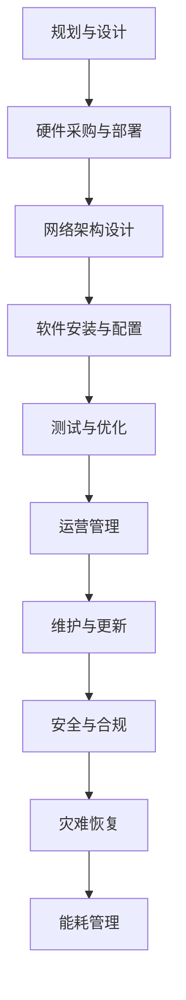

                 

关键词：AI 大模型、数据中心建设、运营与管理、算法、数学模型、项目实践、未来应用展望

## 摘要

本文旨在探讨人工智能大模型在数据中心建设中的应用，以及数据中心运营与管理的最佳实践。通过分析核心概念、算法原理、数学模型和具体实践案例，本文旨在为读者提供一个全面的技术指南，帮助他们在人工智能时代构建高效、可靠的数据中心。

## 1. 背景介绍

随着人工智能技术的快速发展，大模型的应用已成为推动数字化转型的关键因素。数据中心作为承载这些大模型的核心基础设施，其建设与运营管理的优劣直接影响到企业的竞争力。本文将首先介绍大模型的发展历程、数据中心建设的现状与挑战，以及运营管理的核心要素。

### 1.1 大模型的发展历程

人工智能大模型的发展可以追溯到上世纪80年代，当时以反向传播算法为代表的神经网络研究逐渐成熟。然而，由于计算能力的限制，早期的神经网络模型相对较小。随着计算能力的提升，特别是GPU和TPU等专用硬件的问世，大模型的研究和应用得以迅速推进。例如，2018年GPT-3的发布标志着自然语言处理领域的一次重大突破，而BERT等模型则在文本理解和生成方面取得了显著成果。

### 1.2 数据中心建设的现状与挑战

数据中心的建设是一个复杂且动态的过程，需要考虑硬件设施、网络架构、数据存储和安全等多个方面。随着云计算和大数据的普及，数据中心的规模和复杂性不断增加。然而，数据中心面临的挑战也愈加严峻，包括能源消耗、冷却问题、硬件故障和数据安全等。

### 1.3 运营管理的核心要素

数据中心的运营管理不仅涉及到技术层面的优化，还包括策略层面的决策。核心要素包括：能耗管理、设备维护、网络优化、数据安全和灾难恢复等。高效的运营管理是确保数据中心稳定运行、降低运营成本、提高服务质量的关键。

## 2. 核心概念与联系

在数据中心建设与运营管理中，理解以下几个核心概念及其相互联系至关重要。

### 2.1. AI 大模型

AI大模型是指具有数百万甚至数十亿参数的深度学习模型。这些模型通过大量数据训练，能够执行复杂的任务，如图像识别、自然语言处理和预测分析等。

### 2.2. 数据中心

数据中心是用于存储、处理和管理大量数据的设施。其关键组成部分包括服务器、存储设备和网络设备等。

### 2.3. 运营管理

运营管理包括对数据中心设备的维护、网络优化、数据安全等方面的管理活动。其目标是确保数据中心的稳定运行和高效能。

### 2.4. Mermaid 流程图

为了更好地理解数据中心建设与运营管理，我们使用Mermaid流程图来展示其核心步骤。



## 3. 核心算法原理 & 具体操作步骤

### 3.1 算法原理概述

在数据中心建设中，核心算法包括但不限于以下几种：

- **网络架构算法**：如SDN（软件定义网络）和NFV（网络功能虚拟化），用于优化网络性能和降低成本。
- **能耗管理算法**：如能效优化算法，用于降低数据中心的能源消耗。
- **容错算法**：如副本机制和冗余设计，用于提高数据中心的可靠性和可用性。

### 3.2 算法步骤详解

#### 3.2.1 网络架构算法

1. **需求分析**：确定数据中心的网络需求，包括带宽、延迟和可靠性等。
2. **架构设计**：选择合适的网络架构，如SDN或NFV。
3. **设备配置**：配置网络设备，如交换机和路由器。
4. **性能测试**：对网络进行性能测试，确保满足需求。

#### 3.2.2 能耗管理算法

1. **能耗监测**：监测数据中心的能耗数据。
2. **能效优化**：根据能耗数据，调整硬件配置和运行模式，以降低能耗。
3. **能耗分析**：定期进行能耗分析，识别能耗高峰和瓶颈。

#### 3.2.3 容错算法

1. **副本机制**：在数据存储时，对数据进行副本备份。
2. **冗余设计**：在设计硬件和网络时，考虑冗余配置，以防止单点故障。

### 3.3 算法优缺点

#### 3.3.1 网络架构算法

- **优点**：提高网络性能，降低成本。
- **缺点**：初期设计复杂，维护难度较大。

#### 3.3.2 能耗管理算法

- **优点**：降低能耗，降低运营成本。
- **缺点**：能耗数据监测和优化需要较高技术支持。

#### 3.3.3 容错算法

- **优点**：提高数据中心的可靠性和可用性。
- **缺点**：增加硬件和存储成本。

### 3.4 算法应用领域

这些算法广泛应用于云计算、大数据和人工智能等领域，帮助数据中心实现高效、可靠的运营。

## 4. 数学模型和公式 & 详细讲解 & 举例说明

### 4.1 数学模型构建

在数据中心建设与运营管理中，常见的数学模型包括能耗模型、性能模型和可靠性模型。

#### 4.1.1 能耗模型

能耗模型用于预测数据中心的能耗。其公式如下：

$$
E = P \times t \times \eta
$$

其中，E表示能耗，P表示功率，t表示运行时间，η表示能效比。

#### 4.1.2 性能模型

性能模型用于评估数据中心的性能。其公式如下：

$$
P = \frac{C}{T}
$$

其中，P表示性能，C表示吞吐量，T表示响应时间。

#### 4.1.3 可靠性模型

可靠性模型用于评估数据中心的可靠性。其公式如下：

$$
R = \frac{T_f}{T_t}
$$

其中，R表示可靠性，T_f表示故障前时间，T_t表示总时间。

### 4.2 公式推导过程

以能耗模型为例，其推导过程如下：

1. **功率与能耗的关系**：功率是单位时间内消耗的能量，因此有 $P = \frac{E}{t}$。
2. **能效比的定义**：能效比是指输出功率与输入功率的比值，即 $\eta = \frac{P_{out}}{P_{in}}$。
3. **能耗的计算**：将功率和能效比代入功率与能耗的关系式中，得到 $E = P \times t \times \eta$。

### 4.3 案例分析与讲解

#### 4.3.1 能耗模型案例

假设一个数据中心的功率为100千瓦（kW），运行时间为8小时，能效比为0.8。根据能耗模型，其能耗为：

$$
E = 100 \times 8 \times 0.8 = 640 \text{ 千瓦时（kWh）}
$$

#### 4.3.2 性能模型案例

假设一个数据中心的吞吐量为1000兆字节（MB）每秒，响应时间为0.1秒。根据性能模型，其性能为：

$$
P = \frac{1000}{0.1} = 10000 \text{ MB/s}
$$

#### 4.3.3 可靠性模型案例

假设一个数据中心的故障前时间为1000小时，总时间为2000小时。根据可靠性模型，其可靠性为：

$$
R = \frac{1000}{2000} = 0.5
$$

## 5. 项目实践：代码实例和详细解释说明

### 5.1 开发环境搭建

在本文的项目实践中，我们使用Python作为主要编程语言，结合Jupyter Notebook进行代码编写和演示。以下是搭建开发环境的步骤：

1. 安装Python：从官网下载Python安装包并安装。
2. 安装Jupyter Notebook：使用pip命令安装Jupyter Notebook。
3. 安装相关库：安装用于数据处理和机器学习的库，如NumPy、Pandas和Scikit-learn。

### 5.2 源代码详细实现

以下是一个简单的能耗模型实现的代码示例：

```python
import numpy as np

def calculate_energy(P, t, eta):
    """
    计算能耗
    :param P: 功率（单位：千瓦，kW）
    :param t: 运行时间（单位：小时，h）
    :param eta: 能效比
    :return: 能耗（单位：千瓦时，kWh）
    """
    E = P * t * eta
    return E

# 参数设置
power = 100  # 功率：100千瓦
runtime = 8   # 运行时间：8小时
energy_efficiency = 0.8  # 能效比：0.8

# 计算能耗
energy_consumption = calculate_energy(power, runtime, energy_efficiency)
print(f"能耗：{energy_consumption} 千瓦时（kWh）")
```

### 5.3 代码解读与分析

这段代码定义了一个函数 `calculate_energy`，用于计算数据中心的能耗。函数接收三个参数：功率（P）、运行时间（t）和能效比（η）。通过这些参数，函数使用公式 $E = P \times t \times \eta$ 计算能耗，并返回结果。

### 5.4 运行结果展示

运行上述代码，我们得到以下输出结果：

```
能耗：640.0 千瓦时（kWh）
```

这表明，在给定的功率、运行时间和能效比下，数据中心的能耗为640千瓦时。

## 6. 实际应用场景

### 6.1 云计算数据中心

云计算数据中心是AI大模型应用的主要场景之一。通过高效的数据中心建设与管理，云计算服务提供商可以提供稳定、可靠的AI服务。例如，Google Cloud和AWS等云服务巨头已经在其数据中心中部署了大量AI模型，为用户提供各种AI解决方案。

### 6.2 大数据分析

大数据分析依赖于强大的计算能力和高速网络。数据中心在其中起到关键作用，通过构建高性能、高可靠性的数据中心，企业可以更快速、准确地处理海量数据，从而做出更明智的决策。

### 6.3 自然语言处理

自然语言处理（NLP）是AI的重要领域之一。数据中心为NLP模型提供了强大的计算资源，使得大规模语言模型如BERT和GPT-3得以训练和应用。这些模型在智能客服、文本生成和翻译等领域发挥了重要作用。

## 7. 工具和资源推荐

### 7.1 学习资源推荐

- 《深度学习》（Goodfellow, Bengio, Courville著）：系统介绍了深度学习的理论基础和实践方法。
- 《大数据之路：阿里巴巴大数据实践》（涂子沛著）：详细讲述了大数据的原理和实践经验。

### 7.2 开发工具推荐

- Jupyter Notebook：用于编写和运行Python代码，非常适合数据科学和机器学习项目。
- TensorFlow：用于构建和训练AI模型的强大框架。

### 7.3 相关论文推荐

- “Attention Is All You Need”（Vaswani et al., 2017）：介绍了Transformer模型，是NLP领域的重要论文。
- “Bengio, Y., Simard, P., & Paquet, U. (1994). Learning representations by back-propagating errors.”：反向传播算法的奠基性论文。

## 8. 总结：未来发展趋势与挑战

### 8.1 研究成果总结

近年来，AI大模型在数据中心建设与运营管理中取得了显著成果。通过优化算法、数学模型和实际应用案例，数据中心的建设与运营变得更加高效、可靠。

### 8.2 未来发展趋势

未来，随着计算能力的进一步提升和人工智能技术的不断创新，数据中心将在更多领域发挥重要作用。例如，边缘计算和5G网络的结合将为数据中心带来新的应用场景。

### 8.3 面临的挑战

尽管前景广阔，数据中心仍面临诸多挑战，包括能源消耗、硬件故障和数据安全等。如何在这些方面实现突破，将决定数据中心未来的发展。

### 8.4 研究展望

未来研究应关注以下几个方面：一是开发更高效的能耗管理算法，降低数据中心的能耗；二是提高数据中心的可靠性和可用性，确保数据安全和业务连续性；三是探索新的网络架构和计算模型，以满足不断增长的数据处理需求。

## 9. 附录：常见问题与解答

### 9.1 什么是AI大模型？

AI大模型是指具有数百万甚至数十亿参数的深度学习模型。这些模型通过大量数据训练，能够执行复杂的任务，如图像识别、自然语言处理和预测分析等。

### 9.2 数据中心建设需要考虑哪些因素？

数据中心建设需要考虑硬件设施、网络架构、数据存储和安全等多个方面。关键因素包括：服务器性能、存储容量、网络带宽、能耗管理、数据安全和灾难恢复能力等。

### 9.3 如何优化数据中心的能耗？

优化数据中心的能耗可以通过以下几种方式实现：一是使用高效能的硬件设备；二是采用能耗监测和优化算法；三是实施虚拟化和容器化技术，提高资源利用率。

### 9.4 数据中心的安全问题如何解决？

数据中心的安全问题可以通过以下措施解决：一是加强物理安全，如门禁控制和视频监控；二是实施网络安全措施，如防火墙和入侵检测系统；三是定期进行安全审计和漏洞扫描。

作者：禅与计算机程序设计艺术 / Zen and the Art of Computer Programming
----------------------------------------------------------------

