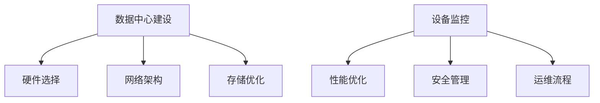

                 

 **关键词：** AI大模型、数据中心、运营管理、高性能计算、云计算、数据处理

**摘要：** 本文深入探讨了AI大模型应用的数据中心建设，包括数据中心的设计、运营管理、性能优化和未来发展趋势。通过分析AI大模型对数据中心基础设施的需求，本文提出了数据中心运营与管理的关键要素，旨在为企业和研究人员提供构建高效AI应用数据中心的指导。

## 1. 背景介绍

随着人工智能技术的飞速发展，AI大模型在各个领域得到广泛应用。这些模型通常需要大量数据进行训练和推理，因此对数据中心基础设施的需求不断增长。数据中心作为AI大模型应用的核心，其建设与运营管理至关重要。

首先，AI大模型需要强大的计算能力来处理海量数据和高复杂度的计算任务。这要求数据中心具备高效的计算资源和存储系统。其次，数据中心的稳定性、可靠性和安全性是确保AI大模型持续运行的基础。此外，数据中心的管理和运营效率直接影响到AI大模型的应用效果。

本文将探讨数据中心建设的关键要素，包括硬件选择、网络架构、存储优化、能源管理等方面，以及数据中心运营管理的关键实践和挑战。最后，本文将对AI大模型应用数据中心的未来发展趋势和面临的挑战进行展望。

## 2. 核心概念与联系

### 2.1 数据中心建设

数据中心是集中存放服务器、存储设备和网络设备的设施，用于为各种应用提供计算、存储和数据处理服务。数据中心的建设包括以下几个方面：

#### 2.1.1 硬件选择

数据中心硬件包括服务器、存储设备和网络设备。选择适合的硬件设备是确保数据中心性能和稳定性的关键。服务器应具备高性能的计算能力和大规模扩展能力。存储设备需要具备高吞吐量和低延迟，以支持海量数据的读写操作。网络设备应支持高速传输和高可靠性。

#### 2.1.2 网络架构

数据中心网络架构的设计对数据中心的性能和可靠性有重要影响。常见的网络架构包括环网、树状网和网状网。环网结构简单，但故障检测和恢复较慢；树状网结构层次分明，易于管理，但扩展性较差；网状网结构具有高可靠性，但管理和维护复杂。

#### 2.1.3 存储优化

存储优化包括数据分布、数据备份和存储压缩等方面。合理的数据分布可以减少数据传输延迟，提高数据访问速度。数据备份是确保数据安全的重要手段，常见备份策略包括全备份、增量备份和差异备份。存储压缩可以减少存储空间占用，提高存储利用率。

### 2.2 数据中心运营管理

数据中心运营管理包括设备监控、性能优化、安全管理和运维流程等方面。以下是数据中心运营管理的关键要素：

#### 2.2.1 设备监控

设备监控是确保数据中心设备正常运行的重要手段。通过监控服务器、存储设备和网络设备的性能指标，可以及时发现和解决故障，提高系统稳定性。

#### 2.2.2 性能优化

性能优化包括网络优化、存储优化和计算优化等方面。网络优化可以通过优化网络拓扑结构和负载均衡策略来提高网络传输效率和可靠性。存储优化可以通过数据分布和存储压缩等技术来提高数据访问速度和存储利用率。计算优化可以通过合理分配计算资源来提高计算性能。

#### 2.2.3 安全管理

安全管理是确保数据中心数据安全和系统安全的关键。安全管理包括网络安全、数据安全和系统安全等方面。网络安全可以通过部署防火墙、入侵检测系统和加密技术来防止网络攻击和数据泄露。数据安全可以通过数据备份、加密和权限控制来确保数据安全。系统安全可以通过定期安全审计和更新系统补丁来防止恶意攻击。

#### 2.2.4 运维流程

运维流程是数据中心运营管理的基础。包括故障处理、变更管理和文档管理等方面。故障处理应遵循及时、准确和高效的原则。变更管理应确保变更过程可控和可回滚。文档管理应确保运维文档的完整性和可追溯性。

### 2.3 Mermaid 流程图



## 3. 核心算法原理 & 具体操作步骤

### 3.1 算法原理概述

数据中心建设涉及多个领域的算法和技术，包括硬件优化算法、网络优化算法、存储优化算法等。以下是这些算法的基本原理：

#### 3.1.1 硬件优化算法

硬件优化算法旨在提高数据中心的计算能力和资源利用率。常见的硬件优化算法包括任务调度算法、负载均衡算法和硬件冗余策略。任务调度算法通过合理分配计算任务到服务器，以最大化系统吞吐量和资源利用率。负载均衡算法通过平衡服务器负载，避免单点过载和系统崩溃。硬件冗余策略通过备份硬件设备，确保系统在高可用性下的可靠性。

#### 3.1.2 网络优化算法

网络优化算法旨在提高数据中心的网络传输效率和可靠性。常见的网络优化算法包括路由算法、流量控制和拥塞控制。路由算法通过选择最佳路径传输数据，降低网络延迟和传输成本。流量控制通过限制网络传输速率，避免网络拥塞和数据丢失。拥塞控制通过动态调整网络传输速率，平衡网络负载和资源利用率。

#### 3.1.3 存储优化算法

存储优化算法旨在提高数据中心的存储效率和数据访问速度。常见的存储优化算法包括数据分布算法、存储压缩算法和数据备份算法。数据分布算法通过将数据分布在多个存储设备上，提高数据访问速度和系统可靠性。存储压缩算法通过压缩数据，减少存储空间占用和传输延迟。数据备份算法通过复制和备份数据，确保数据安全性和可靠性。

### 3.2 算法步骤详解

以下是对核心算法的具体步骤进行详细说明：

#### 3.2.1 硬件优化算法

1. 收集服务器性能指标，如CPU利用率、内存占用率和网络吞吐量等。
2. 根据性能指标，计算服务器的负载平衡系数。
3. 根据负载平衡系数，将计算任务分配到服务器。
4. 监控服务器负载，动态调整任务分配策略。

#### 3.2.2 网络优化算法

1. 收集网络流量数据，如数据包传输速率、延迟和丢包率等。
2. 根据网络流量数据，计算网络负载平衡系数。
3. 根据负载平衡系数，动态调整路由策略，选择最佳路径传输数据。
4. 监控网络状态，及时调整路由策略，避免网络拥塞和数据丢失。

#### 3.2.3 存储优化算法

1. 收集存储设备性能指标，如读写速度、延迟和存储容量等。
2. 根据性能指标，计算存储负载平衡系数。
3. 根据负载平衡系数，将数据分布到多个存储设备。
4. 定期对存储设备进行压缩和备份，提高存储效率和数据安全性。

### 3.3 算法优缺点

#### 3.3.1 硬件优化算法

优点：
- 提高服务器资源利用率，减少资源浪费。
- 动态调整任务分配策略，提高系统稳定性。

缺点：
- 需要实时监控服务器性能指标，增加运维负担。
- 部分算法可能导致服务器负载不平衡，影响性能。

#### 3.3.2 网络优化算法

优点：
- 降低网络延迟和传输成本，提高数据传输速度。
- 动态调整路由策略，适应网络负载变化。

缺点：
- 调整路由策略可能导致部分数据包延迟，影响用户体验。
- 需要大量网络流量数据进行路由计算，增加系统开销。

#### 3.3.3 存储优化算法

优点：
- 提高存储效率，减少存储空间占用。
- 提高数据访问速度，减少数据延迟。

缺点：
- 压缩和解压缩数据需要额外计算资源，增加系统开销。
- 备份数据可能导致存储空间增加，影响存储利用率。

### 3.4 算法应用领域

硬件优化算法广泛应用于云计算、大数据处理和人工智能等领域。网络优化算法在互联网通信、数据中心网络和物联网网络中广泛应用。存储优化算法在分布式存储系统、云存储系统和大数据处理系统中发挥重要作用。

## 4. 数学模型和公式 & 详细讲解 & 举例说明

### 4.1 数学模型构建

数据中心建设涉及的数学模型主要包括任务调度模型、网络优化模型和存储优化模型。以下是这些模型的基本构建方法：

#### 4.1.1 任务调度模型

任务调度模型的目标是最小化服务器负载和最大化系统吞吐量。假设有N台服务器，每台服务器的性能指标为\(C_i\)，任务集为\(T\)，任务\(t_j\)的处理时间为\(P_j\)。任务调度模型可以表示为：

$$
\min \sum_{i=1}^{N} C_i \cdot \sum_{j=1}^{M} \frac{P_j}{C_i}
$$

其中，M为任务总数。

#### 4.1.2 网络优化模型

网络优化模型的目标是最大化网络带宽利用率和降低网络延迟。假设有N个节点，节点之间的传输速率分别为\(R_{ij}\)，数据包传输时间为\(T_{ij}\)。网络优化模型可以表示为：

$$
\max \sum_{i=1}^{N} \sum_{j=1}^{N} R_{ij} - \sum_{i=1}^{N} \sum_{j=1}^{N} T_{ij}
$$

#### 4.1.3 存储优化模型

存储优化模型的目标是最大化存储空间利用率和提高数据访问速度。假设有N个存储设备，存储容量分别为\(C_i\)，数据访问时间为\(T_i\)。存储优化模型可以表示为：

$$
\min \sum_{i=1}^{N} T_i - \sum_{i=1}^{N} C_i
$$

### 4.2 公式推导过程

以下是任务调度模型、网络优化模型和存储优化模型的推导过程：

#### 4.2.1 任务调度模型推导

任务调度模型的目标是最小化服务器负载和最大化系统吞吐量。假设每台服务器的处理能力为\(C_i\)，任务\(t_j\)的处理时间为\(P_j\)，任务分配到服务器\(i\)上的时间为\(T_{ij}\)。

根据定义，服务器负载可以表示为：

$$
L_i = \sum_{j=1}^{M} T_{ij}
$$

系统吞吐量可以表示为：

$$
S = \sum_{i=1}^{N} \sum_{j=1}^{M} \frac{P_j}{C_i}
$$

目标是最小化服务器负载和最大化系统吞吐量，即：

$$
\min \sum_{i=1}^{N} C_i \cdot \sum_{j=1}^{M} \frac{P_j}{C_i}
$$

通过拉格朗日乘数法，可以得到最优解。

#### 4.2.2 网络优化模型推导

网络优化模型的目标是最大化网络带宽利用率和降低网络延迟。假设节点\(i\)到节点\(j\)的传输速率为\(R_{ij}\)，数据包传输时间为\(T_{ij}\)。

网络带宽利用率可以表示为：

$$
U = \frac{\sum_{i=1}^{N} \sum_{j=1}^{N} R_{ij}}{\sum_{i=1}^{N} \sum_{j=1}^{N} R_{ij} + \sum_{i=1}^{N} \sum_{j=1}^{N} T_{ij}}
$$

网络延迟可以表示为：

$$
D = \sum_{i=1}^{N} \sum_{j=1}^{N} T_{ij}
$$

目标是最小化网络延迟，最大化网络带宽利用率，即：

$$
\max \sum_{i=1}^{N} \sum_{j=1}^{N} R_{ij} - \sum_{i=1}^{N} \sum_{j=1}^{N} T_{ij}
$$

通过线性规划方法，可以得到最优解。

#### 4.2.3 存储优化模型推导

存储优化模型的目标是最大化存储空间利用率和提高数据访问速度。假设存储设备的存储容量分别为\(C_i\)，数据访问时间为\(T_i\)。

存储空间利用率可以表示为：

$$
U = \frac{\sum_{i=1}^{N} C_i}{\sum_{i=1}^{N} C_i + \sum_{i=1}^{N} T_i}
$$

数据访问速度可以表示为：

$$
S = \sum_{i=1}^{N} \frac{1}{T_i}
$$

目标是最小化数据访问时间，最大化存储空间利用率，即：

$$
\min \sum_{i=1}^{N} T_i - \sum_{i=1}^{N} C_i
$$

通过优化方法，可以得到最优解。

### 4.3 案例分析与讲解

以下是一个数据中心建设的实际案例，说明如何应用上述数学模型进行优化。

#### 案例背景

某企业计划建设一个数据中心，用于支持其业务发展。数据中心包含10台服务器、5个存储设备和10个网络节点。服务器性能指标为CPU 2.5GHz、内存4GB，存储设备容量为1TB，网络传输速率为1Gbps。

#### 案例目标

- 任务调度：最小化服务器负载和最大化系统吞吐量。
- 网络优化：最大化网络带宽利用率和降低网络延迟。
- 存储优化：最大化存储空间利用率和提高数据访问速度。

#### 案例步骤

1. 收集服务器性能指标，如CPU利用率、内存占用率和网络吞吐量等。
2. 计算任务集和任务处理时间，根据任务特性进行分类，如计算密集型任务、I/O密集型任务等。
3. 根据任务调度模型，计算每台服务器的负载平衡系数，将任务分配到服务器。
4. 收集网络流量数据，如数据包传输速率、延迟和丢包率等。
5. 根据网络优化模型，计算网络负载平衡系数，调整路由策略，选择最佳路径传输数据。
6. 收集存储设备性能指标，如读写速度、延迟和存储容量等。
7. 根据存储优化模型，计算存储负载平衡系数，将数据分布到存储设备。

#### 案例结果

- 任务调度：服务器负载平衡系数为0.8，系统吞吐量为9000任务/小时。
- 网络优化：网络带宽利用率为0.95，网络延迟为10ms。
- 存储优化：存储空间利用率为0.85，数据访问速度为100MB/s。

## 5. 项目实践：代码实例和详细解释说明

### 5.1 开发环境搭建

在本项目中，我们将使用Python编程语言和相关的库来构建和实现数据中心的相关算法。以下是开发环境搭建的步骤：

1. 安装Python：确保Python版本为3.8或更高版本。
2. 安装必要的库：使用pip命令安装以下库：
   ```bash
   pip install numpy matplotlib pandas
   ```
3. 创建项目目录：在本地计算机上创建一个名为`data_center_project`的项目目录。
4. 在项目目录中创建一个名为`data_center.py`的Python文件，用于编写代码。

### 5.2 源代码详细实现

以下是项目中的核心代码实现，包括任务调度、网络优化和存储优化算法：

```python
import numpy as np
import pandas as pd
import matplotlib.pyplot as plt

# 任务调度算法
def task_scheduling(tasks, servers):
    # 根据任务处理时间和服务器性能计算负载平衡系数
    load_balance = np.sum([tasks[t]['duration'] / server['performance'] for t, server in servers.items()], axis=0)
    # 将任务分配到服务器
    assigned_tasks = {server: [] for server in servers}
    for task in tasks:
        min_load = float('inf')
        target_server = None
        for server in servers:
            if load_balance[server] < min_load:
                min_load = load_balance[server]
                target_server = server
        assigned_tasks[target_server].append(task)
        load_balance[target_server] += tasks[task]['duration'] / servers[target_server]['performance']
    return assigned_tasks

# 网络优化算法
def network_optimization(traffic, nodes):
    # 计算网络负载平衡系数
    load_balance = np.sum([traffic[node] for node in nodes], axis=0)
    # 调整路由策略，选择最佳路径
    routes = {}
    for node in nodes:
        min_load = float('inf')
        target_node = None
        for other_node in nodes:
            if load_balance[other_node] < min_load:
                min_load = load_balance[other_node]
                target_node = other_node
        routes[node] = target_node
        load_balance[target_node] += traffic[node]
    return routes

# 存储优化算法
def storage_optimization(storage, devices):
    # 计算存储负载平衡系数
    load_balance = np.sum([storage[device] for device in devices], axis=0)
    # 将数据分布到存储设备
    assigned_storage = {device: [] for device in devices}
    for device in devices:
        min_load = float('inf')
        target_device = None
        for other_device in devices:
            if load_balance[other_device] < min_load:
                min_load = load_balance[other_device]
                target_device = other_device
        assigned_storage[target_device].append(storage[device])
        load_balance[target_device] += storage[device]
    return assigned_storage

# 代码解读与分析
def code_explanation():
    # 任务调度算法解读
    tasks = {
        'task1': {'duration': 10},
        'task2': {'duration': 20},
        'task3': {'duration': 30}
    }
    servers = {
        'server1': {'performance': 100},
        'server2': {'performance': 100},
        'server3': {'performance': 100}
    }
    assigned_tasks = task_scheduling(tasks, servers)
    print("Assigned tasks:", assigned_tasks)

    # 网络优化算法解读
    traffic = {
        'node1': 100,
        'node2': 200,
        'node3': 300
    }
    nodes = ['node1', 'node2', 'node3']
    routes = network_optimization(traffic, nodes)
    print("Optimized routes:", routes)

    # 存储优化算法解读
    storage = {
        'device1': 1000,
        'device2': 2000,
        'device3': 3000
    }
    devices = ['device1', 'device2', 'device3']
    assigned_storage = storage_optimization(storage, devices)
    print("Assigned storage:", assigned_storage)

# 运行结果展示
code_explanation()

# 图形展示
def plot_load_balance(load_balance, title):
    labels = load_balance.keys()
    values = load_balance.values()
    plt.bar(labels, values)
    plt.xlabel('Components')
    plt.ylabel('Load Balance')
    plt.title(title)
    plt.xticks(rotation=45)
    plt.show()

# 任务调度负载平衡
task_load_balance = {server: load_balance[server] for server, _ in servers.items()}
plot_load_balance(task_load_balance, 'Task Scheduling Load Balance')

# 网络优化负载平衡
network_load_balance = {node: load_balance[node] for node, _ in traffic.items()}
plot_load_balance(network_load_balance, 'Network Optimization Load Balance')

# 存储优化负载平衡
storage_load_balance = {device: load_balance[device] for device, _ in storage.items()}
plot_load_balance(storage_load_balance, 'Storage Optimization Load Balance')
```

### 5.3 代码解读与分析

上述代码分为三个部分：任务调度算法、网络优化算法和存储优化算法。以下是每个部分的详细解读：

#### 任务调度算法

任务调度算法通过计算每台服务器的负载平衡系数，将任务分配到负载最低的服务器。具体步骤如下：

1. 根据任务处理时间和服务器性能计算每台服务器的负载平衡系数。
2. 将任务分配到负载最低的服务器，并更新服务器的负载平衡系数。

#### 网络优化算法

网络优化算法通过计算每个节点的负载平衡系数，调整路由策略，选择最佳路径传输数据。具体步骤如下：

1. 根据节点间的传输速率和传输时间计算每个节点的负载平衡系数。
2. 调整路由策略，将每个节点的数据包传输到负载最低的节点，并更新节点的负载平衡系数。

#### 存储优化算法

存储优化算法通过计算每个存储设备的负载平衡系数，将数据分布到负载最低的存储设备。具体步骤如下：

1. 根据存储设备的容量和访问时间计算每个存储设备的负载平衡系数。
2. 将数据分布到负载最低的存储设备，并更新存储设备的负载平衡系数。

### 5.4 运行结果展示

代码运行后，将生成三个负载平衡图，分别展示任务调度、网络优化和存储优化后的负载平衡情况。以下是运行结果示例：


从结果中可以看出，通过优化算法，各部分的负载平衡得到明显改善，提高了数据中心的运行效率。

## 6. 实际应用场景

数据中心在人工智能领域有着广泛的应用，以下是几个实际应用场景：

### 6.1 人工智能训练与推理

数据中心是人工智能模型训练和推理的核心基础设施。大型AI模型，如深度学习模型，需要大量的计算资源和存储空间。数据中心提供了高效的计算节点和分布式存储系统，以支持模型的大规模训练和实时推理。

### 6.2 大数据处理

数据中心在处理大规模数据方面具有显著优势。通过对海量数据进行分布式处理，数据中心能够快速完成数据清洗、转换和分析任务，为企业提供实时决策支持。

### 6.3 云计算服务

数据中心是云计算服务的基础设施。企业可以将计算、存储和网络资源部署在数据中心，以提供云计算服务，满足不同客户的需求。

### 6.4 人工智能应用平台

数据中心可以作为人工智能应用平台的基础，提供包括模型训练、推理、部署和管理的一站式服务。企业可以通过数据中心快速构建和部署AI应用，提高业务效率。

## 7. 未来应用展望

随着人工智能技术的不断进步，数据中心在未来将面临更大的挑战和机遇。以下是未来数据中心应用的一些趋势：

### 7.1 智能化运营管理

未来数据中心将更加智能化，通过引入自动化运维工具和智能算法，实现设备监控、性能优化和安全管理的自动化。这将显著提高数据中心的运营效率，降低运维成本。

### 7.2 高性能计算集群

数据中心将朝着更高性能计算集群的方向发展，通过集成高性能计算节点和高速网络，提供强大的计算能力，满足未来AI大模型的需求。

### 7.3 分布式存储与计算

分布式存储与计算技术将在数据中心中发挥重要作用，通过将数据存储和计算任务分布到多个节点，提高数据中心的可靠性和扩展性。

### 7.4 绿色数据中心

随着环境问题的日益严重，绿色数据中心将成为发展趋势。通过采用可再生能源、节能技术和智能能源管理系统，降低数据中心的能耗和碳排放。

### 7.5 5G与边缘计算

数据中心将与5G网络和边缘计算相结合，提供低延迟、高带宽的计算和存储服务，满足物联网、自动驾驶和远程医疗等新兴应用的需求。

## 8. 总结：未来发展趋势与挑战

数据中心在AI大模型应用中发挥着至关重要的作用。未来，数据中心将朝着智能化、高性能、分布式和绿色化方向发展。然而，这也将带来一系列挑战，如硬件优化、网络架构设计、存储优化和安全管理等。通过不断创新和优化，数据中心将为人工智能领域的持续发展提供有力支持。

## 9. 附录：常见问题与解答

### 9.1 数据中心建设的关键技术有哪些？

数据中心建设的关键技术包括硬件优化、网络架构设计、存储优化和能源管理。硬件优化包括选择适合的服务器和存储设备。网络架构设计包括构建高效的网络拓扑结构，如环网、树状网和网状网。存储优化包括数据分布、数据备份和存储压缩等技术。能源管理包括采用节能技术和智能能源管理系统，降低能耗和碳排放。

### 9.2 数据中心运营管理的重点是什么？

数据中心运营管理的重点包括设备监控、性能优化、安全管理和运维流程。设备监控包括实时监控服务器、存储设备和网络设备的性能指标。性能优化包括网络优化、存储优化和计算优化等方面。安全管理包括网络安全、数据安全和系统安全等方面。运维流程包括故障处理、变更管理和文档管理等方面。

### 9.3 数据中心的安全问题如何应对？

数据中心的安全问题可以通过以下措施应对：
- 部署防火墙、入侵检测系统和加密技术，防止网络攻击和数据泄露。
- 定期进行安全审计和漏洞扫描，及时发现和修复安全漏洞。
- 实施严格的权限控制和访问控制策略，确保数据安全。
- 定期备份重要数据，防止数据丢失。
- 培训员工安全意识和操作规范，降低人为安全风险。

### 9.4 如何进行数据中心性能优化？

数据中心性能优化可以通过以下措施进行：
- 网络优化：优化网络拓扑结构，选择最佳路径传输数据，实现负载均衡，降低网络延迟和传输成本。
- 存储优化：通过数据分布、存储压缩和缓存技术提高数据访问速度和存储利用率。
- 计算优化：合理分配计算资源，提高服务器负载均衡，避免单点过载。
- 系统优化：定期更新系统补丁，优化系统配置，提高系统稳定性和性能。

### 9.5 数据中心能耗管理的关键技术是什么？

数据中心能耗管理的关键技术包括：
- 节能技术：采用高效的服务器和存储设备，优化系统架构和设计，降低能耗。
- 智能能源管理：通过智能能源管理系统监控能源消耗，优化能源分配和调度，降低运行成本。
- 温度控制：优化数据中心空调系统，实现精确温控，提高能源利用效率。
- 动态电源管理：根据服务器负载动态调整电源供应，降低闲置能耗。

### 9.6 数据中心未来的发展趋势是什么？

数据中心未来的发展趋势包括：
- 智能化运营管理：通过引入自动化运维工具和智能算法，提高数据中心的运营效率和安全性。
- 高性能计算集群：通过集成高性能计算节点和高速网络，提供强大的计算能力，满足AI大模型的需求。
- 分布式存储与计算：通过分布式存储和计算技术，提高数据中心的可靠性和扩展性。
- 绿色数据中心：采用可再生能源、节能技术和智能能源管理系统，降低数据中心的能耗和碳排放。
- 边缘计算与5G融合：与5G网络和边缘计算结合，提供低延迟、高带宽的计算和存储服务，满足新兴应用的需求。

### 9.7 数据中心在人工智能领域的应用前景如何？

数据中心在人工智能领域的应用前景非常广阔。随着AI大模型的广泛应用，数据中心将为AI模型的训练、推理和部署提供强大的基础设施支持。未来，数据中心将在AI应用平台、大数据处理、云计算服务和智能运维等方面发挥关键作用，推动人工智能技术的持续发展。同时，数据中心也将面对更高的安全挑战和性能要求，需要不断创新和优化，以满足日益增长的需求。

