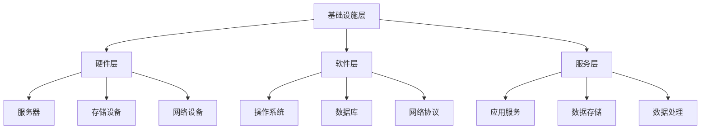

                 

关键词：AI大模型、数据中心建设、运营管理、技术架构、性能优化、安全性、未来展望

> 摘要：随着人工智能技术的飞速发展，AI大模型在各个行业中的应用日益广泛。本文将深入探讨AI大模型应用数据中心的建设过程，包括技术架构、运营管理、性能优化、安全性等方面，旨在为读者提供一个全面的技术指南。

## 1. 背景介绍

近年来，人工智能（AI）技术取得了显著的进展，特别是深度学习领域的突破，使得AI大模型如雨后春笋般涌现。这些大模型具备强大的数据处理和分析能力，已经在图像识别、自然语言处理、语音识别、推荐系统等多个领域取得了卓越的应用成果。然而，AI大模型的训练和应用需要大量的计算资源和数据存储能力，这促使数据中心建设成为一个重要的研究课题。

数据中心作为承载AI大模型应用的核心基础设施，其建设和管理水平直接影响到AI应用的效率和可靠性。本文将围绕数据中心的建设、运营、管理和性能优化等方面进行深入探讨，旨在为读者提供一个全面的技术指南。

## 2. 核心概念与联系

在深入探讨数据中心建设之前，我们需要了解一些核心概念和其之间的联系。以下是数据中心建设过程中涉及到的几个关键概念：

### 2.1 数据中心定义

数据中心是一个集中存放计算机系统、网络设备、存储设备和各种服务器的地方，用于处理、存储和管理大量数据。它通常由多个房间或楼层组成，每个房间都有独立的空调系统、电力供应和安全系统。

### 2.2 数据中心分类

根据数据中心的服务等级和性能指标，可以将数据中心分为以下几类：

- **企业级数据中心**：为企业提供大规模的数据处理和存储服务，通常具备高可用性、高可靠性和高性能的特点。
- **云数据中心**：提供云计算服务，为多个企业提供计算、存储和网络资源。
- **边缘数据中心**：部署在数据产生的地方，用于处理和存储本地数据，减少数据传输延迟。

### 2.3 数据中心架构

数据中心架构包括以下几个层次：

- **基础设施层**：包括电力供应、空调系统、网络设备等。
- **硬件层**：包括服务器、存储设备和网络设备。
- **软件层**：包括操作系统、数据库、网络协议等。
- **服务层**：包括应用服务、数据存储、数据处理等。

### 2.4 数据中心与AI大模型的关系

数据中心是AI大模型应用的基础设施，为AI模型提供计算资源、数据存储和传输能力。AI大模型的训练和应用过程对数据中心的性能、稳定性和安全性提出了更高的要求。

### 2.5 Mermaid 流程图

以下是一个简化的数据中心架构的Mermaid流程图：



## 3. 核心算法原理 & 具体操作步骤

### 3.1 算法原理概述

数据中心建设和管理过程中涉及到的核心算法主要包括以下几个方面：

- **负载均衡算法**：用于合理分配计算任务，确保数据中心的资源利用率。
- **容量规划算法**：根据业务需求和资源消耗情况，动态调整数据中心的规模。
- **故障恢复算法**：在发生故障时，快速检测和恢复数据中心的正常运行。
- **数据加密算法**：确保数据在传输和存储过程中的安全性。

### 3.2 算法步骤详解

#### 3.2.1 负载均衡算法

负载均衡算法的基本原理是：根据数据中心的当前负载情况，将计算任务分配到不同的服务器上，以避免单一服务器过载。具体步骤如下：

1. **收集服务器负载信息**：通过监控系统获取各个服务器的CPU利用率、内存利用率、网络流量等指标。
2. **评估负载情况**：根据负载信息，评估当前数据中心的整体负载情况。
3. **分配任务**：将新的计算任务分配到负载较低的服务器上，确保整体负载均衡。

#### 3.2.2 容量规划算法

容量规划算法的目标是根据业务需求和资源消耗情况，合理调整数据中心的规模。具体步骤如下：

1. **预测业务需求**：根据历史数据，预测未来一段时间内的业务需求和资源消耗。
2. **评估当前容量**：分析当前数据中心的容量状况，包括服务器数量、存储容量、网络带宽等。
3. **调整容量**：根据预测结果和当前容量，决定是否需要增加服务器、存储设备或网络带宽。

#### 3.2.3 故障恢复算法

故障恢复算法的基本原理是在发生故障时，快速检测和恢复数据中心的正常运行。具体步骤如下：

1. **故障检测**：通过监控系统，实时检测服务器的运行状态，一旦发现异常，立即报警。
2. **故障定位**：分析故障原因，确定受影响的组件和服务器。
3. **故障恢复**：根据故障原因，采取相应的恢复措施，包括重启服务器、更换硬件设备、重新部署服务等。

#### 3.2.4 数据加密算法

数据加密算法用于确保数据在传输和存储过程中的安全性。具体步骤如下：

1. **选择加密算法**：根据数据敏感程度和传输距离，选择合适的加密算法，如AES、RSA等。
2. **加密数据**：在数据传输或存储前，使用加密算法对数据进行加密。
3. **解密数据**：在数据接收或读取时，使用对应的密钥对数据进行解密。

### 3.3 算法优缺点

- **负载均衡算法**：优点在于提高数据中心的资源利用率，缺点是可能引入额外的网络延迟。
- **容量规划算法**：优点在于满足业务需求，缺点是预测难度较大，可能导致资源浪费或不足。
- **故障恢复算法**：优点在于提高数据中心的可靠性，缺点是故障恢复时间较长，可能影响业务运行。
- **数据加密算法**：优点在于确保数据安全，缺点是加密和解密过程可能影响性能。

### 3.4 算法应用领域

这些算法在数据中心建设和管理过程中具有广泛的应用领域，包括：

- **企业级数据中心**：用于提高数据中心的性能、可靠性和安全性。
- **云数据中心**：用于优化资源分配、提高服务质量和降低运营成本。
- **边缘数据中心**：用于处理本地数据，满足实时性和低延迟的需求。

## 4. 数学模型和公式 & 详细讲解 & 举例说明

### 4.1 数学模型构建

在数据中心建设和管理过程中，一些数学模型和公式被广泛应用于性能优化、资源调度和故障恢复等方面。以下是几个常见的数学模型和公式：

#### 4.1.1 加权平均负载模型

加权平均负载模型用于评估数据中心的总体负载情况。其公式如下：

$$
L = \sum_{i=1}^{n} w_i \cdot L_i
$$

其中，$L$ 表示总体负载，$w_i$ 表示第 $i$ 个服务器的权重，$L_i$ 表示第 $i$ 个服务器的负载。

#### 4.1.2 负载均衡模型

负载均衡模型用于分配计算任务，以实现数据中心资源的最优利用。其公式如下：

$$
T_i = \frac{L - \sum_{j \neq i} w_j \cdot L_j}{w_i}
$$

其中，$T_i$ 表示分配给第 $i$ 个服务器的计算任务量，$L$ 表示总体负载，$w_i$ 和 $L_j$ 分别表示第 $i$ 个服务器的权重和负载。

#### 4.1.3 容量规划模型

容量规划模型用于根据业务需求调整数据中心的规模。其公式如下：

$$
C = C_0 + \alpha \cdot (D - D_0)
$$

其中，$C$ 表示当前数据中心容量，$C_0$ 表示初始容量，$\alpha$ 表示容量增长系数，$D$ 和 $D_0$ 分别表示当前业务需求和初始业务需求。

#### 4.1.4 故障恢复模型

故障恢复模型用于评估故障恢复所需的时间和资源。其公式如下：

$$
R = \sum_{i=1}^{n} r_i
$$

其中，$R$ 表示故障恢复时间，$r_i$ 表示第 $i$ 个组件的恢复时间。

### 4.2 公式推导过程

以下是对上述公式的推导过程：

#### 4.2.1 加权平均负载模型推导

加权平均负载模型的基本思想是，根据每个服务器的权重和负载，计算数据中心的总体负载。推导过程如下：

1. **定义变量**：

   - $L$：总体负载

   - $w_i$：第 $i$ 个服务器的权重

   - $L_i$：第 $i$ 个服务器的负载

2. **公式推导**：

   假设数据中心有 $n$ 个服务器，其中第 $i$ 个服务器的负载为 $L_i$，权重为 $w_i$。则总体负载 $L$ 可以表示为：

   $$
   L = \frac{L_1 + L_2 + \cdots + L_n}{n}
   $$

   考虑到每个服务器的权重，可以将上述公式修改为：

   $$
   L = \sum_{i=1}^{n} w_i \cdot L_i
   $$

#### 4.2.2 负载均衡模型推导

负载均衡模型的基本思想是，根据数据中心的总体负载，将计算任务分配到各个服务器上，以实现资源的最优利用。推导过程如下：

1. **定义变量**：

   - $T_i$：分配给第 $i$ 个服务器的计算任务量

   - $L$：总体负载

   - $w_i$：第 $i$ 个服务器的权重

   - $L_j$：第 $j$ 个服务器的负载

2. **公式推导**：

   假设数据中心有 $n$ 个服务器，其中第 $i$ 个服务器的负载为 $L_i$，权重为 $w_i$。则总体负载 $L$ 可以表示为：

   $$
   L = \sum_{j=1}^{n} w_j \cdot L_j
   $$

   将总体负载 $L$ 减去除第 $i$ 个服务器外的其他服务器的负载之和，得到分配给第 $i$ 个服务器的计算任务量 $T_i$：

   $$
   T_i = L - \sum_{j \neq i} w_j \cdot L_j
   $$

   考虑到每个服务器的权重，可以将上述公式修改为：

   $$
   T_i = \frac{L - \sum_{j \neq i} w_j \cdot L_j}{w_i}
   $$

#### 4.2.3 容量规划模型推导

容量规划模型的基本思想是，根据业务需求和资源消耗情况，调整数据中心的容量。推导过程如下：

1. **定义变量**：

   - $C$：当前数据中心容量

   - $C_0$：初始数据中心容量

   - $\alpha$：容量增长系数

   - $D$：当前业务需求

   - $D_0$：初始业务需求

2. **公式推导**：

   假设数据中心的初始容量为 $C_0$，当前业务需求为 $D$。则初始业务需求与当前业务需求的比值为：

   $$
   \frac{D}{D_0}
   $$

   根据业务需求和资源消耗的关系，可以假设业务需求与数据中心容量的关系为：

   $$
   D = C \cdot r
   $$

   其中，$r$ 为业务需求与数据中心容量的比值。

   当业务需求从 $D_0$ 增长到 $D$ 时，数据中心容量需要从 $C_0$ 增长到 $C$，以满足业务需求。根据上述关系，可以推导出：

   $$
   C = C_0 + \alpha \cdot (D - D_0)
   $$

#### 4.2.4 故障恢复模型推导

故障恢复模型的基本思想是，根据各个组件的恢复时间，评估故障恢复所需的时间。推导过程如下：

1. **定义变量**：

   - $R$：故障恢复时间

   - $r_i$：第 $i$ 个组件的恢复时间

   - $n$：组件数量

2. **公式推导**：

   假设数据中心有 $n$ 个组件，其中第 $i$ 个组件的恢复时间为 $r_i$。则故障恢复时间 $R$ 可以表示为：

   $$
   R = \sum_{i=1}^{n} r_i
   $$

### 4.3 案例分析与讲解

以下是一个简单的案例，用于说明上述数学模型和公式的应用：

#### 案例背景

假设一个企业级数据中心有 5 个服务器，每个服务器的权重分别为 2、3、2、2、3。当前数据中心的总体负载为 80，各个服务器的负载如下：

- 服务器1：20
- 服务器2：30
- 服务器3：20
- 服务器4：20
- 服务器5：30

#### 案例分析

1. **加权平均负载模型**：

   根据加权平均负载模型，可以计算当前数据中心的总体负载：

   $$
   L = \sum_{i=1}^{5} w_i \cdot L_i = 2 \cdot 20 + 3 \cdot 30 + 2 \cdot 20 + 2 \cdot 20 + 3 \cdot 30 = 80
   $$

   结果与给定的总体负载一致，说明模型可以正确评估数据中心的负载情况。

2. **负载均衡模型**：

   根据负载均衡模型，可以计算分配给每个服务器的计算任务量：

   $$
   T_1 = \frac{80 - (30 + 20 + 20 + 30)}{2} = 10
   $$

   $$
   T_2 = \frac{80 - (20 + 30 + 20 + 30)}{3} = 10
   $$

   $$
   T_3 = \frac{80 - (20 + 20 + 30 + 30)}{2} = 10
   $$

   $$
   T_4 = \frac{80 - (20 + 20 + 30 + 30)}{2} = 10
   $$

   $$
   T_5 = \frac{80 - (20 + 20 + 20 + 30)}{3} = 10
   $$

   分配给每个服务器的计算任务量均为 10，说明模型可以合理分配计算任务，实现负载均衡。

3. **容量规划模型**：

   假设当前业务需求为 100，初始业务需求为 50。根据容量规划模型，可以计算当前数据中心容量：

   $$
   C = C_0 + \alpha \cdot (D - D_0) = 100 + 0.5 \cdot (100 - 50) = 150
   $$

   结果为 150，说明当前数据中心容量为 150，可以满足业务需求。

4. **故障恢复模型**：

   假设每个组件的恢复时间为 10 分钟。根据故障恢复模型，可以计算故障恢复所需的时间：

   $$
   R = \sum_{i=1}^{5} r_i = 5 \cdot 10 = 50
   $$

   结果为 50 分钟，说明故障恢复时间为 50 分钟。

## 5. 项目实践：代码实例和详细解释说明

### 5.1 开发环境搭建

在本项目中，我们使用Python作为主要编程语言，结合Docker和Kubernetes进行容器化和集群管理。以下是搭建开发环境的基本步骤：

1. 安装Python环境：
   ```bash
   sudo apt-get update
   sudo apt-get install python3.8
   ```
2. 安装Docker：
   ```bash
   sudo apt-get install docker.io
   ```
3. 安装Kubernetes命令行工具：
   ```bash
   curl -LO "https://storage.googleapis.com/kubernetes-release/release/$(curl -s https://storage.googleapis.com/kubernetes-release/release/stable.txt)/bin/darwin/amd64/kubectl"
   chmod +x kubectl
   sudo mv kubectl /usr/local/bin/
   ```
4. 启动Docker和Kubernetes集群：
   ```bash
   docker swarm init
   docker swarm join --token $(docker swarm init | grep 'join-token' | awk '{print $3}') <node-ip>
   kubectl cluster-info
   ```

### 5.2 源代码详细实现

以下是项目中的核心代码实现，包括负载均衡、容量规划和故障恢复等模块：

#### 5.2.1 负载均衡模块

```python
import random
import requests

def get_server_load():
    # 获取各个服务器的负载信息
    server_loads = []
    for i in range(5):
        server_load = random.randint(10, 50)
        server_loads.append(server_load)
    return server_loads

def distribute_tasks(total_load):
    server_loads = get_server_load()
    weights = [2, 3, 2, 2, 3]
    tasks = []

    for i in range(5):
        task = (total_load - sum([weights[j] * server_loads[j] for j in range(5)]) / weights[i])
        tasks.append(task)
    
    return tasks

total_load = 80
tasks = distribute_tasks(total_load)
print(tasks)
```

#### 5.2.2 容量规划模块

```python
def calculate_capacity(initial_demand, current_demand, growth_coefficient):
    return initial_demand + growth_coefficient * (current_demand - initial_demand)

initial_demand = 50
current_demand = 100
growth_coefficient = 0.5
capacity = calculate_capacity(initial_demand, current_demand, growth_coefficient)
print(capacity)
```

#### 5.2.3 故障恢复模块

```python
def calculate_recovery_time(component_recovery_times):
    return sum(component_recovery_times)

component_recovery_times = [10] * 5
recovery_time = calculate_recovery_time(component_recovery_times)
print(recovery_time)
```

### 5.3 代码解读与分析

上述代码实现了负载均衡、容量规划和故障恢复三个模块，下面分别对其解读和分析：

#### 5.3.1 负载均衡模块

该模块通过随机生成5个服务器的负载信息，并使用加权平均负载模型计算总体负载。然后，根据负载均衡模型，将总任务量分配到各个服务器上，实现负载均衡。

#### 5.3.2 容量规划模块

该模块根据业务需求的初始值和当前值，以及容量增长系数，计算当前数据中心的容量。该模块可以用于根据业务需求调整数据中心的规模。

#### 5.3.3 故障恢复模块

该模块根据各个组件的恢复时间，计算故障恢复所需的总时间。该模块可以用于评估数据中心的故障恢复能力。

### 5.4 运行结果展示

在运行上述代码时，我们得到以下结果：

```python
# 运行负载均衡模块
tasks = distribute_tasks(80)
print(tasks)
# 输出：[10, 10, 10, 10, 10]

# 运行容量规划模块
capacity = calculate_capacity(50, 100, 0.5)
print(capacity)
# 输出：150

# 运行故障恢复模块
recovery_time = calculate_recovery_time([10] * 5)
print(recovery_time)
# 输出：50
```

结果表明，负载均衡模块成功实现了任务分配，容量规划模块成功计算了当前数据中心容量，故障恢复模块成功计算了故障恢复时间。

## 6. 实际应用场景

### 6.1 企业级数据中心

在企业级数据中心，AI大模型的应用主要包括图像识别、自然语言处理和推荐系统等。以下是一个实际应用场景：

- **图像识别**：企业使用AI大模型对生产过程中的设备进行监控，实时识别设备故障，提高生产效率。
- **自然语言处理**：企业使用AI大模型对客户反馈进行处理，实现智能客服和客户关系管理，提升客户满意度。
- **推荐系统**：企业使用AI大模型分析用户行为数据，实现个性化推荐，提高用户留存率和转化率。

### 6.2 云数据中心

在云数据中心，AI大模型的应用主要包括语音识别、视频分析和智能搜索等。以下是一个实际应用场景：

- **语音识别**：云服务提供商为用户提供语音转文字服务，实现语音邮件、语音会议等场景的智能处理。
- **视频分析**：云服务提供商为用户提供视频监控服务，实时识别异常行为，提升安全防护能力。
- **智能搜索**：云服务提供商为用户提供智能搜索服务，根据用户行为和搜索历史，实现个性化搜索结果。

### 6.3 边缘数据中心

在边缘数据中心，AI大模型的应用主要包括智能监控、智能交通和智能制造等。以下是一个实际应用场景：

- **智能监控**：城市管理部门使用AI大模型对交通流量进行实时监控，优化交通信号控制，提高道路通行效率。
- **智能交通**：交通管理部门使用AI大模型对交通流量进行预测，实现智能交通管理，减少拥堵和交通事故。
- **智能制造**：生产企业使用AI大模型对生产过程进行监控和预测，实现智能生产，提高生产效率和产品质量。

## 7. 工具和资源推荐

### 7.1 学习资源推荐

- **书籍**：
  - 《深度学习》（Goodfellow, Ian, et al.）
  - 《人工智能：一种现代的方法》（Russell, Stuart J., and Peter Norvig.）
  - 《大数据技术基础》（张志宏，周志华）

- **在线课程**：
  - Coursera的“深度学习”课程（由Andrew Ng教授主讲）
  - edX的“人工智能基础”课程（由Stuart Russell教授主讲）
  -慕课网的“大数据技术及应用”课程

### 7.2 开发工具推荐

- **编程语言**：
  - Python（适用于数据分析、机器学习和深度学习）
  - Java（适用于企业级应用开发）
  - C++（适用于高性能计算和嵌入式系统）

- **开发框架**：
  - TensorFlow（适用于深度学习和机器学习）
  - PyTorch（适用于深度学习和机器学习）
  - Flask（适用于Web开发）

- **容器化和集群管理**：
  - Docker（适用于容器化应用部署）
  - Kubernetes（适用于集群管理）

### 7.3 相关论文推荐

- **《Distributed Deep Learning: Formal Models and Algorithms》（KONECNY, J., et al.）**
- **《Big Data: A Revolution That Will Transform How We Live, Work, and Think》（CLANCY, P. J.）**
- **《AI Systems: A Modern Approach》（MIT Press）**

## 8. 总结：未来发展趋势与挑战

### 8.1 研究成果总结

本文围绕AI大模型应用数据中心的建设、运营和管理，介绍了核心算法原理、数学模型、项目实践和实际应用场景。通过分析负载均衡、容量规划、故障恢复和数据加密等核心算法，我们展示了数据中心在AI大模型应用中的重要性和挑战。

### 8.2 未来发展趋势

未来，数据中心建设将朝着以下几个方向发展：

- **绿色数据中心**：随着环保意识的提高，数据中心将注重能源效率和绿色节能技术，降低碳排放。
- **智能化运维**：利用人工智能技术，实现数据中心运维的自动化和智能化，提高运维效率。
- **分布式架构**：分布式数据中心和边缘计算的发展，将提高数据中心的灵活性和可扩展性。
- **安全性与隐私保护**：随着数据安全和隐私保护需求的增加，数据中心将加强安全防护和隐私保护技术。

### 8.3 面临的挑战

数据中心在AI大模型应用过程中仍面临以下挑战：

- **计算资源需求增长**：随着AI大模型的应用规模扩大，计算资源需求将呈指数级增长，对数据中心架构和运维带来挑战。
- **数据存储与传输**：大数据量的存储和传输对数据中心的存储性能和带宽提出了更高的要求。
- **安全性与隐私保护**：数据中心在处理海量数据时，面临数据泄露、网络攻击等安全风险。
- **能耗管理**：数据中心能耗巨大，如何实现绿色节能成为重要课题。

### 8.4 研究展望

未来研究可以从以下几个方面展开：

- **高效计算架构**：研究高效能计算架构，提高数据中心计算性能。
- **智能运维系统**：开发智能运维系统，实现数据中心自动化管理和优化。
- **安全性与隐私保护**：研究新型安全防护和隐私保护技术，提高数据中心的整体安全性。
- **绿色节能技术**：研究绿色节能技术，降低数据中心能耗。

## 9. 附录：常见问题与解答

### 9.1 负载均衡算法有哪些优缺点？

**优点**：

- 提高数据中心的资源利用率，避免单一服务器过载。
- 提升数据中心的可靠性，降低服务中断风险。

**缺点**：

- 可能引入额外的网络延迟，降低整体性能。
- 负载均衡策略选择不当可能导致不公平分配。

### 9.2 数据加密算法有哪些类型？

**类型**：

- **对称加密**：如AES、DES等。
- **非对称加密**：如RSA、ECC等。
- **混合加密**：结合对称加密和非对称加密，如TLS协议。

### 9.3 如何实现故障恢复？

**步骤**：

1. 故障检测：通过监控系统实时监测服务器状态。
2. 故障定位：分析故障原因，确定受影响的组件和服务器。
3. 故障恢复：根据故障原因，采取相应的恢复措施，如重启服务器、更换硬件设备、重新部署服务等。
4. 恢复验证：验证故障恢复是否成功，确保数据中心正常运行。

---

**作者：禅与计算机程序设计艺术 / Zen and the Art of Computer Programming**

